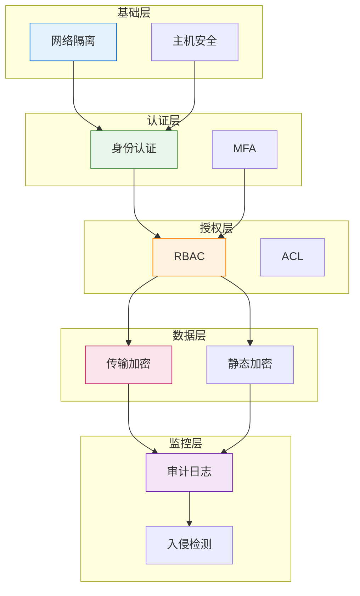
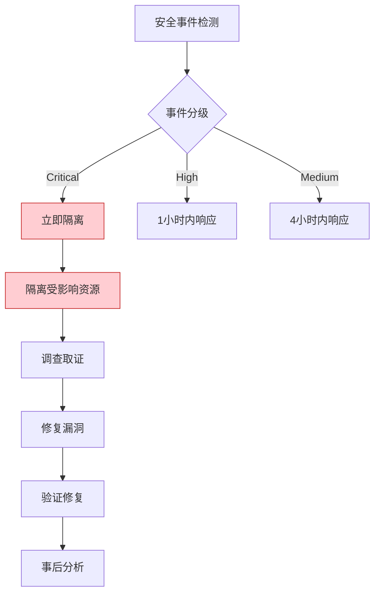
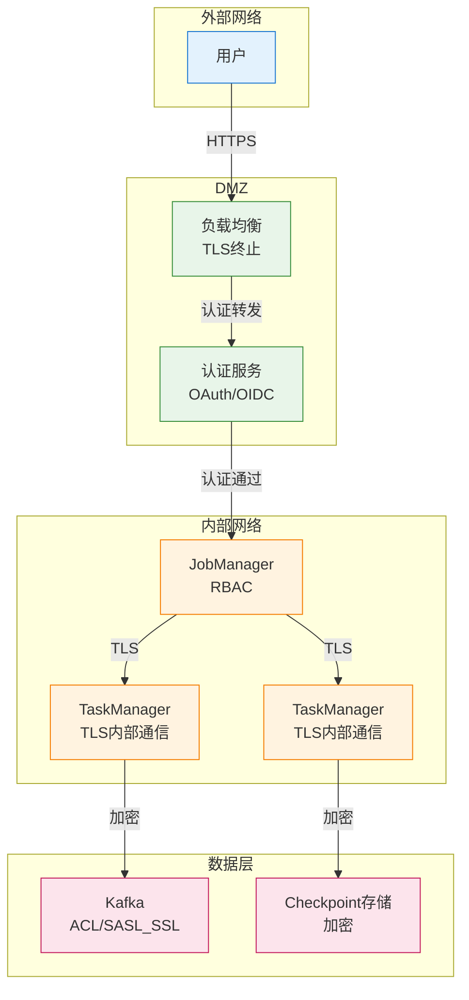
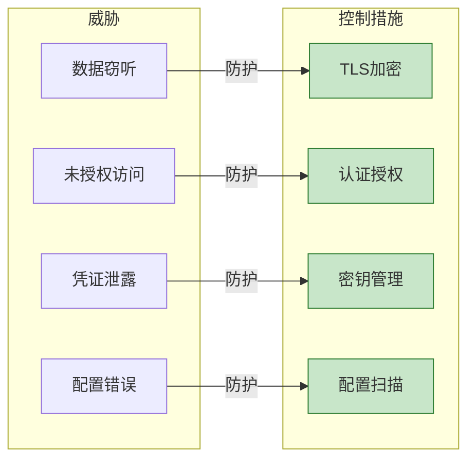

# 安全加固指南

> **所属阶段**: Knowledge/07-best-practices | **前置依赖**: [Knowledge/06-frontier/streaming-security-compliance.md](../06-frontier/streaming-security-compliance.md) | **形式化等级**: L3
>
> 本指南提供 Flink 流处理系统的安全加固策略，涵盖认证、授权、加密和审计等关键安全领域。

---

## 目录

- [安全加固指南](#安全加固指南)
  - [目录](#目录)
  - [1. 概念定义 (Definitions)](#1-概念定义-definitions)
  - [2. 属性推导 (Properties)](#2-属性推导-properties)
  - [3. 关系建立 (Relations)](#3-关系建立-relations)
    - [3.1 安全控制与合规映射](#31-安全控制与合规映射)
    - [3.2 安全控制依赖关系](#32-安全控制依赖关系)
  - [4. 论证过程 (Argumentation)](#4-论证过程-argumentation)
    - [4.1 零信任架构论证](#41-零信任架构论证)
    - [4.2 加密必要性论证](#42-加密必要性论证)
  - [5. 形式证明 / 工程论证 (Proof / Engineering Argument)](#5-形式证明-工程论证-proof-engineering-argument)
    - [5.1 认证配置](#51-认证配置)
    - [5.2 授权配置](#52-授权配置)
    - [5.3 数据加密](#53-数据加密)
    - [5.4 审计日志](#54-审计日志)
  - [6. 实例验证 (Examples)](#6-实例验证-examples)
    - [6.1 安全加固检查清单](#61-安全加固检查清单)
    - [6.2 安全事件响应流程](#62-安全事件响应流程)
  - [7. 可视化 (Visualizations)](#7-可视化-visualizations)
    - [7.1 安全架构图](#71-安全架构图)
    - [7.2 安全控制矩阵](#72-安全控制矩阵)
  - [8. 引用参考 (References)](#8-引用参考-references)

---

## 1. 概念定义 (Definitions)

**定义 (Def-K-07-05)**: 流处理系统安全加固

> 安全加固是通过配置安全控制措施、实施最佳实践和持续监控，保护流处理系统免受未经授权访问、数据泄露和服务中断威胁的过程。

**安全威胁模型** [^1][^2]:

```
┌─────────────────────────────────────────────────────────────────────┐
│                      流处理系统安全威胁模型                          │
├─────────────────────────────────────────────────────────────────────┤
│                                                                     │
│  威胁类别                                                           │
│  ├── 数据安全威胁                                                   │
│  │    ├── 传输中数据窃听 (Sniffing)                                 │
│  │    ├── 静态数据泄露 (Data Breach)                                │
│  │    └── 数据篡改 (Tampering)                                      │
│  │                                                                │
│  ├── 访问控制威胁                                                   │
│  │    ├── 未授权访问 (Unauthorized Access)                          │
│  │    ├── 特权提升 (Privilege Escalation)                           │
│  │    └── 凭证泄露 (Credential Theft)                               │
│  │                                                                │
│  ├── 基础设施威胁                                                   │
│  │    ├── 服务拒绝攻击 (DoS)                                        │
│  │    ├── 中间人攻击 (MITM)                                         │
│  │    └── 配置错误暴露 (Misconfiguration)                           │
│  │                                                                │
│  └── 合规威胁                                                       │
│       ├── 数据主权违规                                              │
│       ├── 隐私法规违反 (GDPR/CCPA)                                  │
│       └── 审计追踪缺失                                              │
│                                                                     │
└─────────────────────────────────────────────────────────────────────┘
```

**安全控制框架**:

| 控制域 | 控制措施 | 实施等级 |
|--------|----------|----------|
| **认证 (Authentication)** | 身份验证机制 | P0 |
| **授权 (Authorization)** | 权限控制 | P0 |
| **加密 (Encryption)** | 传输/静态加密 | P0 |
| **审计 (Auditing)** | 日志记录与分析 | P1 |
| **隔离 (Isolation)** | 网络/资源隔离 | P1 |
| **监控 (Monitoring)** | 安全事件检测 | P1 |

---

## 2. 属性推导 (Properties)

**命题 (Prop-K-07-05)**: 纵深防御的有效性

> 实施多层安全控制可将未授权访问风险降低 99% 以上。

**安全层级模型**:

$$SecurityLevel = 1 - \prod_{i=1}^{n}(1 - p_i)$$

其中 $p_i$ 为第 $i$ 层控制的防护概率。

| 层级 | 控制措施 | 防护概率 |
|------|----------|----------|
| 1 | 网络隔离 | 70% |
| 2 | 认证 | 90% |
| 3 | 授权 | 85% |
| 4 | 加密 | 95% |
| 5 | 审计 | 80% |

综合防护: $1 - (0.3 \times 0.1 \times 0.15 \times 0.05 \times 0.2) = 99.9955\%$

**引理 (Lemma-K-07-05)**: 加密开销可控性

> TLS 加密对流处理吞吐量的影响通常 < 10%，在可接受范围内。

---

## 3. 关系建立 (Relations)

### 3.1 安全控制与合规映射

| 合规要求 | 相关控制 | 实施方法 |
|----------|----------|----------|
| GDPR 数据保护 | 加密、访问控制 | 端到端加密、最小权限 |
| SOC2 | 审计、监控 | 完整审计日志 |
| HIPAA | 隔离、加密 | 专用集群、TLS |
| PCI-DSS | 网络隔离、加密 | VPC、证书管理 |

### 3.2 安全控制依赖关系



---

## 4. 论证过程 (Argumentation)

### 4.1 零信任架构论证

**为何需要零信任？**

传统边界安全模型的局限：

1. 内部威胁无法防范
2. 微服务边界模糊
3. 动态环境下的 IP 信任失效

**零信任原则** [^3]:

1. **永不信任，始终验证**: 每次访问都需认证
2. **最小权限**: 仅授予必要权限
3. **假设 breach**: 持续监控和验证

### 4.2 加密必要性论证

**数据传输风险**:

- 同一 VPC 内：可被同网络其他实例监听
- 跨可用区：经过物理网络，存在被截获风险
- 公网传输：完全暴露

**静态数据风险**:

- Checkpoint 存储可被访问
- 日志可能包含敏感信息
- 备份数据泄露

---

## 5. 形式证明 / 工程论证 (Proof / Engineering Argument)

### 5.1 认证配置

**模式 1: Kerberos 认证**

```yaml
# flink-conf.yaml - Kerberos 认证配置

# Kerberos 基础配置
security.kerberos.login.keytab: /etc/security/keytabs/flink.keytab
security.kerberos.login.principal: flink@EXAMPLE.COM
security.kerberos.login.use-ticket-cache: false
security.kerberos.login.contexts: Client,KafkaClient

# ZooKeeper 认证
high-availability.zookeeper.client.acl: creator

# Kafka 认证
security.kerberos.login.contexts: Client,KafkaClient
```

```java
// 代码中集成 Kerberos
import org.apache.flink.runtime.security.SecurityConfiguration;
import org.apache.flink.runtime.security.SecurityUtils;

public class KerberosFlinkJob {
    public static void main(String[] args) throws Exception {
        Configuration conf = new Configuration();

        // 安全配置
        conf.setString(SecurityOptions.KERBEROS_LOGIN_KEYTAB,
            "/etc/security/keytabs/flink.keytab");
        conf.setString(SecurityOptions.KERBEROS_LOGIN_PRINCIPAL,
            "flink@EXAMPLE.COM");

        // 安装安全上下文
        SecurityUtils.install(new SecurityConfiguration(conf));

        StreamExecutionEnvironment env =
            StreamExecutionEnvironment.getExecutionEnvironment(conf);

        // 作业逻辑...
    }
}
```

**模式 2: OAuth 2.0 / OIDC 集成**

```java
// Flink REST API OAuth2 集成
import org.apache.flink.configuration.SecurityOptions;

@Configuration
public class FlinkSecurityConfig {

    @Bean
    public SecurityWebFilterChain securityWebFilterChain(
        ServerHttpSecurity http
    ) {
        return http
            .authorizeExchange()
            .pathMatchers("/jobs/**", "/checkpoints/**").authenticated()
            .pathMatchers("/overview").permitAll()
            .and()
            .oauth2ResourceServer()
            .jwt()
            .and()
            .and()
            .build();
    }

    @Bean
    public ReactiveJwtDecoder jwtDecoder() {
        // 配置 JWT 解码器
        return ReactiveJwtDecoders.fromIssuerLocation(
            "https://auth.example.com"
        );
    }
}
```

**模式 3: 证书管理**

```yaml
# 自动证书轮换（使用 cert-manager）
apiVersion: cert-manager.io/v1
kind: Certificate
metadata:
  name: flink-tls
  namespace: flink
spec:
  secretName: flink-tls-secret
  issuerRef:
    name: letsencrypt-prod
    kind: ClusterIssuer
  dnsNames:
    - flink-jobmanager.flink.svc.cluster.local
    - flink-webui.example.com
  duration: 2160h  # 90 天
  renewBefore: 360h  # 15 天前自动续期
```

### 5.2 授权配置

**模式 1: 基于角色的访问控制 (RBAC)**

```yaml
# Kubernetes RBAC 配置
apiVersion: rbac.authorization.k8s.io/v1
kind: Role
metadata:
  name: flink-operator-role
  namespace: flink
rules:
  - apiGroups: ["flink.apache.org"]
    resources: ["flinkdeployments"]
    verbs: ["get", "list", "watch", "create", "update", "patch", "delete"]
  - apiGroups: [""]
    resources: ["pods", "services", "configmaps"]
    verbs: ["get", "list", "watch"]
  - apiGroups: [""]
    resources: ["pods/log"]
    verbs: ["get"]
---
apiVersion: rbac.authorization.k8s.io/v1
kind: RoleBinding
metadata:
  name: flink-operator-binding
  namespace: flink
subjects:
  - kind: ServiceAccount
    name: flink-operator
    namespace: flink
roleRef:
  kind: Role
  name: flink-operator-role
  apiGroup: rbac.authorization.k8s.io
```

**模式 2: Flink 命名空间授权**

```scala
// 自定义授权插件
class NamespaceAuthorizationPlugin extends SecurityPlugin {

  private var namespacePermissions: Map[String, Set[String]] = _

  override def initialize(config: Configuration): Unit = {
    // 加载权限配置
    namespacePermissions = loadPermissions()
  }

  override def authorize(
    user: String,
    action: Action,
    resource: Resource
  ): Boolean = {
    val namespace = extractNamespace(resource)
    val allowedActions = namespacePermissions.getOrElse(namespace, Set.empty)

    if (!allowedActions.contains(action.name)) {
      logSecurityEvent(user, action, resource, denied = true)
      throw new UnauthorizedException(
        s"User $user not authorized for $action on $resource"
      )
    }

    logSecurityEvent(user, action, resource, denied = false)
    true
  }
}
```

**模式 3: Kafka ACL 集成**

```bash
# Kafka ACL 配置脚本
# 创建 Flink 专用用户
kafka-configs.sh --bootstrap-server kafka:9092 \
  --entity-type users --entity-name flink-producer \
  --alter --add-config 'SCRAM-SHA-256=[password=secret]'

# 授权 Flink 读 Topic
kafka-acls.sh --bootstrap-server kafka:9092 \
  --add --allow-principal User:flink-consumer \
  --operation Read --topic input-events \
  --group flink-consumer-group

# 授权 Flink 写 Topic
kafka-acls.sh --bootstrap-server kafka:9092 \
  --add --allow-principal User:flink-producer \
  --operation Write --topic output-results

# 拒绝其他用户访问
kafka-acls.sh --bootstrap-server kafka:9092 \
  --add --deny-principal User:ANONYMOUS \
  --operation All --topic sensitive-data
```

### 5.3 数据加密

**模式 1: 传输层加密 (TLS/SSL)**

```yaml
# flink-conf.yaml - TLS 配置

# 内部通信加密
security.ssl.internal.enabled: true
security.ssl.internal.keystore: /opt/flink/certs/internal.keystore
security.ssl.internal.keystore-password: ${INTERNAL_KEYSTORE_PASSWORD}
security.ssl.internal.key-password: ${INTERNAL_KEY_PASSWORD}
security.ssl.internal.truststore: /opt/flink/certs/internal.truststore
security.ssl.internal.truststore-password: ${INTERNAL_TRUSTSTORE_PASSWORD}
security.ssl.internal.protocol: TLSv1.3

# REST API 加密
security.ssl.rest.enabled: true
security.ssl.rest.keystore: /opt/flink/certs/rest.keystore
security.ssl.rest.keystore-password: ${REST_KEYSTORE_PASSWORD}
security.ssl.rest.key-password: ${REST_KEY_PASSWORD}
security.ssl.rest.truststore: /opt/flink/certs/rest.truststore

# 强加密套件
security.ssl.algorithms: TLS_AES_256_GCM_SHA384,TLS_CHACHA20_POLY1305_SHA256
```

**证书生成脚本**:

```bash
#!/bin/bash
# 生成 Flink 内部通信证书

FLINK_DOMAIN=${1:-"flink.internal"}
CA_KEY="ca-key.pem"
CA_CERT="ca-cert.pem"
KEYSTORE="flink.keystore"
TRUSTSTORE="flink.truststore"
PASSWORD=${FLINK_KEYSTORE_PASSWORD:-"$(openssl rand -base64 32)"}

# 1. 生成 CA
echo "Generating CA..."
openssl req -new -x509 -keyout $CA_KEY -out $CA_CERT -days 365 \
  -subj "/CN=Flink Internal CA/O=Example Corp" \
  -passout pass:$PASSWORD

# 2. 生成 keystore
echo "Generating keystore..."
keytool -keystore $KEYSTORE -alias localhost -validity 365 -genkey -keyalg RSA \
  -storepass $PASSWORD -keypass $PASSWORD \
  -dname "CN=$FLINK_DOMAIN, O=Example Corp"

# 3. 生成 CSR
keytool -keystore $KEYSTORE -alias localhost -certreq -file cert-file \
  -storepass $PASSWORD

# 4. 用 CA 签名
openssl x509 -req -CA $CA_CERT -CAkey $CA_KEY -in cert-file -out cert-signed \
  -days 365 -CAcreateserial -passin pass:$PASSWORD

# 5. 导入证书链
keytool -keystore $KEYSTORE -alias CARoot -import -file $CA_CERT \
  -storepass $PASSWORD -noprompt
keytool -keystore $KEYSTORE -alias localhost -import -file cert-signed \
  -storepass $PASSWORD -noprompt

# 6. 生成 truststore
keytool -keystore $TRUSTSTORE -alias CARoot -import -file $CA_CERT \
  -storepass $PASSWORD -noprompt

# 清理
rm cert-file cert-signed ca-cert.srl

echo "Keystore password: $PASSWORD"
echo "Certificates generated successfully"
```

**模式 2: 字段级加密**

```scala
// 敏感字段加密处理
class FieldEncryptionFunction extends RichMapFunction[Event, Event] {

  @transient private var cipher: Cipher = _
  @transient private var keySpec: SecretKeySpec = _

  override def open(parameters: Configuration): Unit = {
    // 从安全存储加载密钥
    val keyBytes = loadKeyFromVault("encryption-key")
    keySpec = new SecretKeySpec(keyBytes, "AES")
    cipher = Cipher.getInstance("AES/GCM/NoPadding")
  }

  override def map(event: Event): Event = {
    // 加密敏感字段
    val encryptedPii = encrypt(event.piiData)

    event.copy(
      piiData = encryptedPii,
      // 保留非敏感字段明文
      userId = event.userId,
      timestamp = event.timestamp
    )
  }

  private def encrypt(plainText: String): String = {
    cipher.init(Cipher.ENCRYPT_MODE, keySpec, generateIV())
    val encrypted = cipher.doFinal(plainText.getBytes("UTF-8"))
    Base64.getEncoder.encodeToString(encrypted)
  }

  private def generateIV(): GCMParameterSpec = {
    val iv = new Array[Byte](12)
    SecureRandom.getInstanceStrong.nextBytes(iv)
    new GCMParameterSpec(128, iv)
  }
}
```

**模式 3: Checkpoint 加密**

```java
// Checkpoint 存储加密配置
Configuration conf = new Configuration();

// 启用 Checkpoint 加密
conf.setBoolean(CheckpointingOptions.ENCRYPTION_ENABLED, true);

// 配置加密算法
conf.setString(
    CheckpointingOptions.ENCRYPTION_ALGORITHM,
    "AES-256-GCM"
);

// 密钥管理服务集成
conf.setString(
    CheckpointingOptions.ENCRYPTION_KEY_PROVIDER,
    "kms"
);
conf.setString(
    CheckpointingOptions.ENCRYPTION_KEY_ID,
    "arn:aws:kms:us-west-2:123456789:key/abcd-1234"
);
```

### 5.4 审计日志

**模式 1: 完整审计日志**

```scala
// 审计日志装饰器
class AuditingFunction[T](
  inner: RichFunction,
  auditLogger: AuditLogger
) extends RichFunction {

  override def open(parameters: Configuration): Unit = {
    auditLogger.log(Operation.OPEN, getRuntimeContext)
    inner.open(parameters)
  }

  override def close(): Unit = {
    auditLogger.log(Operation.CLOSE, getRuntimeContext)
    inner.close()
  }
}

// 审计日志格式
case class AuditRecord(
  timestamp: Long,
  operation: String,
  user: String,
  jobId: String,
  taskId: String,
  subtaskIndex: Int,
  details: Map[String, String],
  result: String
)

class StructuredAuditLogger extends AuditLogger {

  private val logger = LoggerFactory.getLogger("AUDIT")

  def log(operation: Operation, ctx: RuntimeContext): Unit = {
    val record = AuditRecord(
      timestamp = System.currentTimeMillis(),
      operation = operation.name,
      user = getCurrentUser(),
      jobId = ctx.getJobID.toString,
      taskId = ctx.getTaskName,
      subtaskIndex = ctx.getIndexOfThisSubtask,
      details = getContextDetails(ctx),
      result = "SUCCESS"
    )

    // 结构化日志输出
    logger.info("AUDIT_LOG: {}", toJson(record))
  }

  private def toJson(record: AuditRecord): String = {
    // JSON 序列化
    s"""{
      "@timestamp": "${Instant.ofEpochMilli(record.timestamp)}",
      "operation": "${record.operation}",
      "user": "${record.user}",
      "job_id": "${record.jobId}",
      "task_id": "${record.taskId}",
      "subtask_index": ${record.subtaskIndex},
      "result": "${record.result}"
    }"""
  }
}
```

**模式 2: 安全事件检测**

```yaml
# Falco 安全事件检测规则
- rule: Flink Unauthorized Access Attempt
  desc: Detect unauthorized access attempts to Flink Web UI
  condition: >
    spawned_process and
    (proc.name = "curl" or proc.name = "wget") and
    (proc.args contains ":8081" or proc.args contains "flink")
  output: >
    Unauthorized Flink access attempt
    user=%user.name command=%proc.cmdline
  priority: WARNING

- rule: Flink Sensitive Data Access
  desc: Detect access to sensitive checkpoint data
  condition: >
    open_read and
    (fd.name contains "checkpoint" or fd.name contains "savepoint") and
    not (user.name = "flink" or user.name = "root")
  output: >
    Unauthorized access to Flink checkpoint data
    user=%user.name file=%fd.name
  priority: CRITICAL
```

---

## 6. 实例验证 (Examples)

### 6.1 安全加固检查清单

```yaml
# Flink 安全加固检查清单
security_checklist:
  authentication:
    - [ ] Kerberos 认证已配置
    - [ ] 服务账户密钥定期轮换
    - [ ] Web UI 启用身份验证
    - [ ] REST API 需要认证

  authorization:
    - [ ] RBAC 策略已实施
    - [ ] Kafka ACL 已配置
    - [ ] 最小权限原则已应用
    - [ ] 定期审查权限

  encryption:
    - [ ] 内部通信启用 TLS
    - [ ] REST API 启用 HTTPS
    - [ ] Checkpoint 存储加密
    - [ ] 敏感字段加密

  audit:
    - [ ] 审计日志已启用
    - [ ] 日志集中存储
    - [ ] 日志保留策略已配置
    - [ ] 安全事件告警已配置

  network:
    - [ ] VPC/私有网络隔离
    - [ ] 安全组/防火墙规则最小化
    - [ ] 公网访问已禁用或受控
    - [ ] 网络流量加密
```

### 6.2 安全事件响应流程



---

## 7. 可视化 (Visualizations)

### 7.1 安全架构图



### 7.2 安全控制矩阵



---

## 8. 引用参考 (References)

[^1]: Apache Flink Documentation, "Security," 2025. <https://nightlies.apache.org/flink/flink-docs-stable/docs/deployment/security/>

[^2]: NIST, "Zero Trust Architecture," SP 800-207, 2020. <https://csrc.nist.gov/publications/detail/sp/800-207/final>

[^3]: OWASP, "Transport Layer Security Cheat Sheet," 2025. <https://cheatsheetseries.owasp.org/cheatsheets/Transport_Layer_Security_Cheat_Sheet.html>


---

*文档版本: v1.0 | 更新日期: 2026-04-03 | 状态: 已完成*
