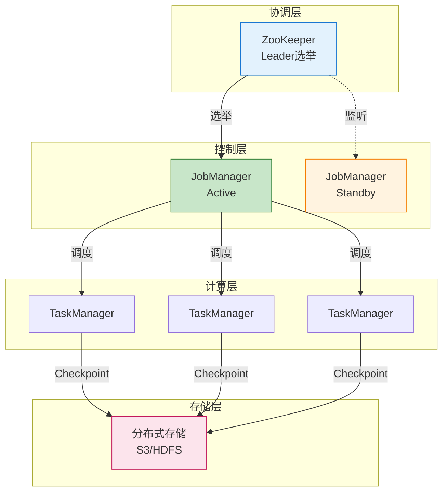
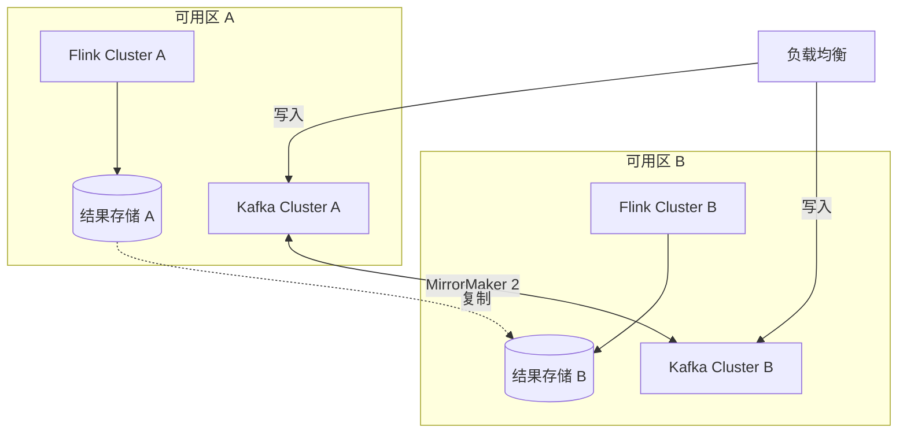
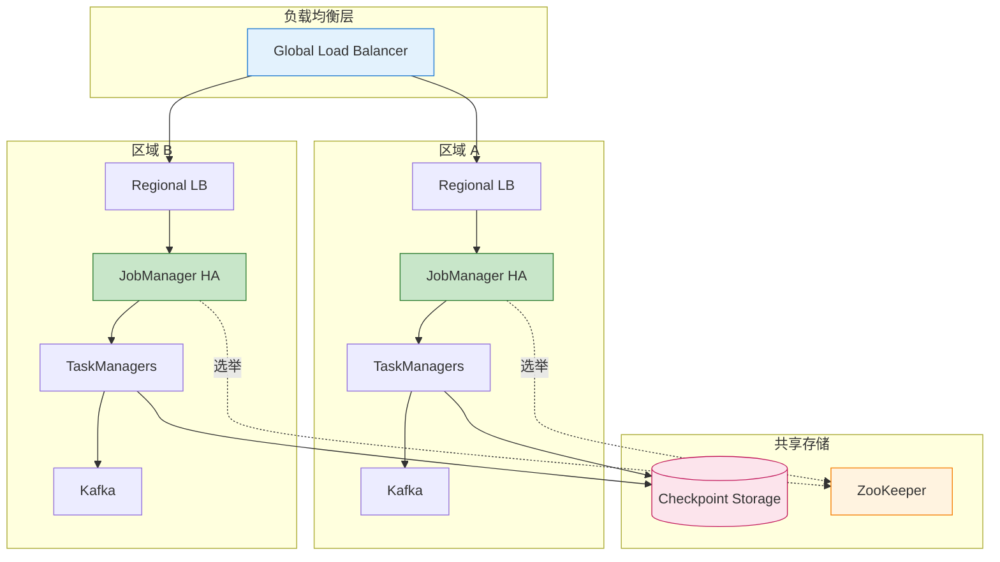
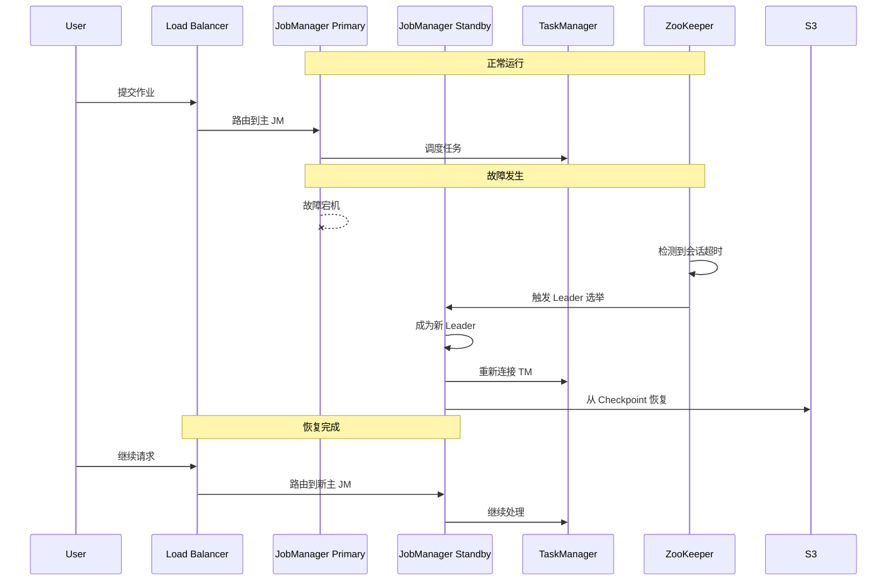

# 高可用模式

> **所属阶段**: Knowledge/07-best-practices | **前置依赖**: [Knowledge/02-design-patterns/pattern-checkpoint-recovery.md](../02-design-patterns/pattern-checkpoint-recovery.md) | **形式化等级**: L3
>
> 本文档提供流处理系统的高可用架构模式，涵盖故障转移、多活架构和灾难恢复策略。

---

## 目录

- [高可用模式](#高可用模式)
  - [目录](#目录)
  - [1. 概念定义 (Definitions)](#1-概念定义-definitions)
  - [2. 属性推导 (Properties)](#2-属性推导-properties)
  - [3. 关系建立 (Relations)](#3-关系建立-relations)
    - [3.1 HA 模式与故障类型映射](#31-ha-模式与故障类型映射)
    - [3.2 HA 组件依赖关系](#32-ha-组件依赖关系)
  - [4. 论证过程 (Argumentation)](#4-论证过程-argumentation)
    - [4.1 单点故障消除论证](#41-单点故障消除论证)
    - [4.2 恢复时间优化论证](#42-恢复时间优化论证)
  - [5. 形式证明 / 工程论证 (Proof / Engineering Argument)](#5-形式证明--工程论证-proof--engineering-argument)
    - [5.1 故障转移模式](#51-故障转移模式)
    - [5.2 多活架构模式](#52-多活架构模式)
    - [5.3 灾难恢复模式](#53-灾难恢复模式)
  - [6. 实例验证 (Examples)](#6-实例验证-examples)
    - [6.1 HA 配置验证测试](#61-ha-配置验证测试)
    - [6.2 可用性监控仪表盘](#62-可用性监控仪表盘)
  - [7. 可视化 (Visualizations)](#7-可视化-visualizations)
    - [7.1 高可用架构图](#71-高可用架构图)
    - [7.2 故障转移流程](#72-故障转移流程)
  - [8. 引用参考 (References)](#8-引用参考-references)

---

## 1. 概念定义 (Definitions)

**定义 (Def-K-07-06)**: 高可用性 (High Availability)

> 高可用性是指系统在面临组件故障时，仍能保持可接受的性能水平并持续提供服务的能力。通常以可用性百分比（如 99.9%、99.99%）来衡量。

**可用性计算公式**:

$$Availability = \frac{MTTF}{MTTF + MTTR} \times 100\%$$

其中：

- **MTTF** (Mean Time To Failure): 平均故障间隔时间
- **MTTR** (Mean Time To Recovery): 平均恢复时间

**可用性等级** [^1][^2]:

| 等级 | 可用性 | 年停机时间 | 适用场景 |
|------|--------|------------|----------|
| 2个9 | 99% | 87.6 小时 | 内部工具 |
| 3个9 | 99.9% | 8.76 小时 | 一般业务 |
| 4个9 | 99.99% | 52.6 分钟 | 关键业务 |
| 5个9 | 99.999% | 5.26 分钟 | 核心业务 |

**故障类型分类**:

```
┌─────────────────────────────────────────────────────────────────────┐
│                      流处理系统故障类型                              │
├─────────────────────────────────────────────────────────────────────┤
│                                                                     │
│  故障类别                                                           │
│  ├── 硬件故障                                                       │
│  │    ├── 节点宕机 (Node Failure)                                   │
│  │    ├── 磁盘故障 (Disk Failure)                                   │
│  │    └── 网络分区 (Network Partition)                              │
│  │                                                                │
│  ├── 软件故障                                                       │
│  │    ├── 进程崩溃 (Process Crash)                                  │
│  │    ├── 内存溢出 (OOM)                                            │
│  │    └── 逻辑错误 (Logic Error)                                    │
│  │                                                                │
│  ├── 依赖故障                                                       │
│  │    ├── Source 不可用                                             │
│  │    ├── Sink 写入失败                                             │
│  │    └── 状态存储故障                                              │
│  │                                                                │
│  └── 灾难性故障                                                     │
│       ├── 可用区故障                                                │
│       ├── 区域故障                                                  │
│       └── 数据中心故障                                              │
│                                                                     │
└─────────────────────────────────────────────────────────────────────┘
```

---

## 2. 属性推导 (Properties)

**命题 (Prop-K-07-06)**: Checkpoint 频率与可用性关系

> Checkpoint 间隔直接影响 MTTR，进而影响可用性。

**量化分析**:

设 Checkpoint 间隔为 $T_c$，故障发生时的最大数据丢失为 $L_{max} = T_c$。

$$MTTR \approx T_{detect} + T_{schedule} + T_{restore}$$

其中 $T_{restore}$ 与 Checkpoint 大小成正比。

**优化策略**:

- 增量 Checkpoint 减少 $T_{restore}$
- 本地恢复减少 $T_{schedule}$
- 快速故障检测减少 $T_{detect}$

**引理 (Lemma-K-07-06)**: 多活架构的可用性提升

> 多活架构可将可用性从 99.9% 提升至 99.99% 以上。

双活架构可用性计算:

$$Availability_{active-active} = 1 - (1 - A_1)(1 - A_2)$$

若 $A_1 = A_2 = 99.9\%$，则:
$$Availability_{total} = 1 - 0.001 \times 0.001 = 99.9999\%$$

---

## 3. 关系建立 (Relations)

### 3.1 HA 模式与故障类型映射

| 故障类型 | 推荐模式 | 恢复时间 |
|----------|----------|----------|
| TaskManager 失败 | 自动重启 + 本地恢复 | < 30s |
| JobManager 失败 | HA 模式 + ZooKeeper | < 60s |
| Checkpoint 失败 | 增量 Checkpoint + 重试 | < 5min |
| 可用区故障 | 跨 AZ 部署 | < 5min |
| 区域故障 | 多区域多活 | < 15min |

### 3.2 HA 组件依赖关系



---

## 4. 论证过程 (Argumentation)

### 4.1 单点故障消除论证

**Flink 单点分析**:

| 组件 | 默认风险 | HA 方案 |
|------|----------|---------|
| JobManager | 单点 | HA 模式 + 多个 JM |
| TaskManager | 部分风险 | 故障转移 + 冗余 |
| Checkpoint 存储 | 单点 | 分布式存储 |
| 元数据存储 | 单点 | ZooKeeper/Raft |

**CAP 权衡** [^3]:

```
分布式系统中的权衡:

CP 系统 (如 ZooKeeper): 一致性和分区容错
  - 优点: 强一致性，无数据冲突
  - 缺点: 网络分区时不可用

AP 系统 (如 Cassandra): 可用性和分区容错
  - 优点: 高可用
  - 缺点: 可能读到过期数据

Flink HA 设计: 优先 CP，通过快速恢复提升可用性
```

### 4.2 恢复时间优化论证

**恢复时间分解**:

| 阶段 | 耗时因素 | 优化方向 |
|------|----------|----------|
| 故障检测 | 心跳超时 | 缩短心跳间隔 |
| 领导者选举 | ZooKeeper 会话 | 本地缓存 |
| 作业调度 | 资源申请 | 预分配资源 |
| 状态恢复 | Checkpoint 下载 | 本地恢复 + 增量 |

---

## 5. 形式证明 / 工程论证 (Proof / Engineering Argument)

### 5.1 故障转移模式

**模式 1: JobManager HA**

```yaml
# flink-conf.yaml - JobManager HA 配置

# 高可用模式
high-availability: zookeeper
high-availability.zookeeper.quorum: zk1:2181,zk2:2181,zk3:2181
high-availability.zookeeper.path.root: /flink
high-availability.cluster-id: production-cluster

# JobManager 元数据存储
high-availability.storageDir: hdfs:///flink/ha/

# 多个 JobManager 地址
jobmanager.rpc.address: jm1,jm2,jm3
jobmanager.rpc.port: 6123

# 故障转移配置
jobmanager.execution.failover-strategy: region
restart-strategy: fixed-delay
restart-strategy.fixed-delay.attempts: 3
restart-strategy.fixed-delay.delay: 10s
```

**Kubernetes 部署**:

```yaml
# JobManager HA StatefulSet
apiVersion: apps/v1
kind: StatefulSet
metadata:
  name: flink-jobmanager
  namespace: flink
spec:
  serviceName: flink-jobmanager
  replicas: 3
  selector:
    matchLabels:
      app: flink-jobmanager
  template:
    metadata:
      labels:
        app: flink-jobmanager
    spec:
      containers:
        - name: jobmanager
          image: flink:1.18
          args: ["jobmanager"]
          env:
            - name: POD_NAME
              valueFrom:
                fieldRef:
                  fieldPath: metadata.name
          ports:
            - containerPort: 6123
              name: rpc
            - containerPort: 6124
              name: blob
            - containerPort: 8081
              name: webui
          volumeMounts:
            - name: flink-config
              mountPath: /opt/flink/conf
  volumeClaimTemplates:
    - metadata:
        name: ha-storage
      spec:
        accessModes: ["ReadWriteOnce"]
        resources:
          requests:
            storage: 10Gi
---
apiVersion: v1
kind: Service
metadata:
  name: flink-jobmanager
  namespace: flink
spec:
  selector:
    app: flink-jobmanager
  ports:
    - port: 8081
      targetPort: 8081
      name: webui
    - port: 6123
      targetPort: 6123
      name: rpc
  clusterIP: None  # Headless service for StatefulSet
```

**模式 2: TaskManager 故障转移**

```scala
// 自定义故障检测和恢复策略
class EnhancedFailoverStrategy extends FailoverStrategy {

  override def onTaskFailure(
    taskExecution: TaskExecution,
    cause: Throwable
  ): FailoverAction = {

    // 分析故障原因
    cause match {
      case oom: OutOfMemoryError =>
        // OOM 时增加内存并重启
        FailoverAction.RESTART_WITH_RESOURCE_INCREASE(
          memoryIncreaseFactor = 1.5
        )

      case network: NetworkException =>
        // 网络故障时快速重试
        FailoverAction.RESTART_WITH_BACKOFF(
          initialDelay = 1.seconds,
          maxDelay = 30.seconds
        )

      case checkpoint: CheckpointException =>
        // Checkpoint 故障时切换到备用存储
        FailoverAction.RESTART_WITH_CONFIG_CHANGE(
          config = Map(
            "state.checkpoint-storage" -> "backup-s3"
          )
        )

      case _ =>
        FailoverAction.RESTART
    }
  }
}
```

**模式 3: 本地恢复加速**

```yaml
# flink-conf.yaml - 本地恢复配置

# 启用本地恢复
state.backend.local-recovery: true

# 本地恢复目录
taskmanager.state.local.root-dirs: /tmp/flink-local-recovery

# 状态后端配置（RocksDB 增量）
state.backend: rocksdb
state.checkpoint-storage: filesystem
checkpoints.dir: hdfs:///flink/checkpoints
state.backend.incremental: true

# 网络内存优化（快速状态传输）
taskmanager.memory.network.min: 512mb
taskmanager.memory.network.max: 2gb
```

```scala
// 本地恢复监控
class LocalRecoveryMonitor extends RichFunction {

  @transient private var localRecoveryMetrics: LocalRecoveryMetrics = _

  override def initializeState(context: FunctionInitializationContext): Unit = {
    val isRestored = context.isRestored
    val restoredFromLocal = context.asInstanceOf[LocalRecoveryContext]
      .isRestoredFromLocalStorage

    if (isRestored && restoredFromLocal) {
      // 记录本地恢复指标
      localRecoveryMetrics.localRecoveryCount.inc()

      val recoveryTime = System.currentTimeMillis() - restoreStartTime
      localRecoveryMetrics.localRecoveryTime.update(recoveryTime)

      log.info(s"Task restored from local storage in ${recoveryTime}ms")
    }
  }
}
```

### 5.2 多活架构模式

**模式 1: 同城双活**



**配置实现**:

```scala
// 双活架构作业配置
class ActiveActiveJob {

  def buildDualActiveJob(env: StreamExecutionEnvironment): Unit = {
    // 配置：优先本地消费，故障时切换
    val kafkaProps = new Properties()
    kafkaProps.setProperty("bootstrap.servers",
      "kafka-az1:9092,kafka-az2:9092")
    kafkaProps.setProperty("client.rack", getCurrentAZ())  // 机架感知

    // 配置多区域 Kafka 消费
    val consumer = new FlinkKafkaConsumer[Event](
      "input-topic",
      new EventDeserializer(),
      kafkaProps
    )

    // 优先从本地 AZ 读取
    consumer.setStartFromGroupOffsets()

    val stream = env.addSource(consumer)

    // 处理逻辑
    stream
      .keyBy(_.userId)
      .process(new StatefulProcessor())
      .addSink(new DualActiveSink())  // 双写结果
  }
}

class DualActiveSink extends RichSinkFunction[Result] {

  @transient private var primarySink: SinkFunction[Result] = _
  @transient private var secondarySink: SinkFunction[Result] = _

  override def open(parameters: Configuration): Unit = {
    // 初始化主备 Sink
    primarySink = createSink(getPrimaryEndpoint())
    secondarySink = createSink(getSecondaryEndpoint())
  }

  override def invoke(value: Result, context: Context): Unit = {
    // 异步双写
    Future {
      try {
        primarySink.invoke(value, context)
      } catch {
        case e: Exception =>
          // 主 Sink 失败，降级到备 Sink
          secondarySink.invoke(value, context)
      }
    }

    // 同步写备（确保数据安全）
    secondarySink.invoke(value, context)
  }
}
```

**模式 2: 异地多活**

```yaml
# 多区域 Flink 部署
apiVersion: flink.apache.org/v1beta1
kind: FlinkDeployment
metadata:
  name: multi-region-pipeline
spec:
  # 全局配置
  flinkVersion: v1.18

  # 区域特定配置通过 Overlay 实现
  podTemplate:
    spec:
      affinity:
        podAntiAffinity:
          requiredDuringSchedulingIgnoredDuringExecution:
            - labelSelector:
                matchLabels:
                  app: flink-taskmanager
              topologyKey: topology.kubernetes.io/zone

      # 区域感知配置
      env:
        - name: FLINK_REGION
          valueFrom:
            fieldRef:
              fieldPath: metadata.labels['topology.kubernetes.io/region']
```

```scala
// 跨区域数据一致性保障
class GeoReplicatedStateBackend extends StateBackend {

  override def createCheckpointStorage(jobId: JobID): CheckpointStorage {
    // 多区域 Checkpoint 存储
    new GeoReplicatedCheckpointStorage(
      primaryStorage = s"s3://primary-region/checkpoints/$jobId",
      replicaStorages = List(
        s"s3://secondary-region-1/checkpoints/$jobId",
        s"s3://secondary-region-2/checkpoints/$jobId"
      ),
      replicationFactor = 2
    )
  }

  override def createKeyedStateBackend(
    env: Environment,
    jobID: JobID,
    operatorIdentifier: String,
    keySerializer: TypeSerializer[_],
    numberOfKeyGroups: Int,
    keyGroupRange: KeyGroupRange,
    taskKvStateRegistry: TaskKvStateRegistry
  ): CheckpointableKeyedStateBackend[_] = {
    // 跨区域状态复制
    new GeoReplicatedKeyedStateBackend(
      localBackend = new RocksDBStateBackend(),
      remoteReplicator = new AsyncStateReplicator()
    )
  }
}
```

### 5.3 灾难恢复模式

**模式 1: 备份与恢复**

```scala
// 自动化备份策略
class DisasterRecoveryManager {

  def scheduleBackups(jobId: String): Unit = {
    // 定期 Savepoint
    val savepointTrigger = new ScheduledThreadPoolExecutor(1)
    savepointTrigger.scheduleAtFixedRate(
      () => triggerSavepoint(jobId),
      0,  // 立即执行
      1,  // 每小时
      TimeUnit.HOURS
    )
  }

  def triggerSavepoint(jobId: String): String = {
    val flinkClient = FlinkRestClient("http://flink-jobmanager:8081")

    // 触发 Savepoint
    val savepointPath = s"s3://dr-backups/savepoints/$jobId/${System.currentTimeMillis()}"

    val response = flinkClient.post(
      s"/jobs/$jobId/savepoints",
      body = Json.obj(
        "cancel-job" -> false,
        "target-directory" -> savepointPath
      )
    )

    // 等待完成
    val triggerId = (response \ "request-id").as[String]
    awaitSavepointCompletion(jobId, triggerId)

    // 验证 Savepoint
    validateSavepoint(savepointPath)

    // 清理旧 Savepoint（保留最近 24 个）
    cleanupOldSavepoints(jobId, keepCount = 24)

    savepointPath
  }

  def restoreFromDisaster(
    jobId: String,
    targetRegion: String
  ): JobSubmissionResult = {
    // 1. 获取最新有效 Savepoint
    val savepointPath = findLatestValidSavepoint(jobId)

    // 2. 在新区域创建 Flink 集群
    val newCluster = createClusterInRegion(targetRegion)

    // 3. 从 Savepoint 恢复作业
    val jobSubmitResult = newCluster.submitJob(
      jobJar = getJobJar(jobId),
      savepointPath = savepointPath,
      allowNonRestoredState = false
    )

    // 4. 验证恢复成功
    awaitJobRunning(jobSubmitResult.jobId)
    verifyDataConsistency(jobSubmitResult.jobId)

    // 5. 切换流量
    switchTraffic(targetRegion)

    jobSubmitResult
  }
}
```

**模式 2: 热备模式**

```scala
// 热备模式实现
class HotStandbyPipeline {

  def deployHotStandby(env: StreamExecutionEnvironment): Unit = {
    // 主集群消费 Kafka 主分区
    val primarySource = KafkaSource.builder[Event]()
      .setBootstrapServers("kafka-primary:9092")
      .setTopics("events")
      .setGroupId("flink-primary")
      .setProperty("auto.offset.reset", "latest")
      .build()

    // 备集群消费 Kafka 备份分区（延迟消费）
    val standbySource = KafkaSource.builder[Event]()
      .setBootstrapServers("kafka-standby:9092")
      .setTopics("events")
      .setGroupId("flink-standby")
      .setProperty("auto.offset.reset", "latest")
      .setProperty("fetch.min.bytes", "1048576")  // 延迟处理
      .build()

    // 主集群处理
    val primaryStream = env.fromSource(
      primarySource,
      WatermarkStrategy.forBoundedOutOfOrderness(Duration.ofSeconds(5)),
      "primary-source"
    )

    // 处理并输出（写入主存储）
    primaryStream
      .keyBy(_.userId)
      .process(new PrimaryProcessor())
      .addSink(new PrimarySink())

    // 备集群处理（相同逻辑）
    val standbyStream = env.fromSource(
      standbySource,
      WatermarkStrategy.forBoundedOutOfOrderness(Duration.ofSeconds(5)),
      "standby-source"
    )

    standbyStream
      .keyBy(_.userId)
      .process(new StandbyProcessor())
      .addSink(new StandbySink())  // 不实际写入，仅保持状态
  }
}

// 故障切换协调器
class FailoverCoordinator extends LeaderElectionListener {

  private var currentLeader: String = "primary"

  override def onLeaderChange(newLeader: String): Unit = {
    if (newLeader != currentLeader) {
      // 执行故障切换
      performFailover(currentLeader, newLeader)
      currentLeader = newLeader
    }
  }

  def performFailover(from: String, to: String): Unit = {
    // 1. 停止旧主集群写入
    disableWrites(from)

    // 2. 同步状态（如果需要）
    syncState(from, to)

    // 3. 提升备集群为主
    promoteToPrimary(to)

    // 4. 更新路由
    updateTrafficRouter(to)

    // 5. 启动旧集群恢复流程
    startRecovery(from)
  }
}
```

**灾难恢复计划模板**:

```yaml
# 灾难恢复运行手册
disaster_recovery_plan:
  version: "1.0"

  rto_rpo:
    rto: 15m  # 恢复时间目标
    rpo: 5m   # 恢复点目标

  scenarios:
    - name: 单 TaskManager 故障
      severity: low
      response: 自动重启
      manual_steps: []

    - name: JobManager 故障
      severity: medium
      response: 自动故障转移
      manual_steps:
        - 确认新 Leader 选举成功
        - 检查 Checkpoint 恢复状态

    - name: 可用区故障
      severity: high
      response: 跨 AZ 切换
      manual_steps:
        - 确认备用 AZ 集群状态
        - 切换 Kafka 消费组
        - 验证数据一致性
        - 通知业务方

    - name: 区域故障
      severity: critical
      response: 异地切换
      manual_steps:
        - 启动 DR 区域集群
        - 从异地备份恢复
        - 切换 DNS/流量
        - 全链路验证
        - 升级事故响应

  contacts:
    primary: oncall-engineer@company.com
    secondary: infra-team@company.com
    pager: +1-555-0123
```

---

## 6. 实例验证 (Examples)

### 6.1 HA 配置验证测试

```bash
#!/bin/bash
# 高可用性验证测试脚本

FLINK_URL="http://flink-jobmanager:8081"
TEST_DURATION=3600

echo "=== Flink HA 测试 ==="

# 测试 1: JobManager 故障转移
echo "[1/4] 测试 JobManager 故障转移..."
JM_POD=$(kubectl get pod -l app=flink-jobmanager -o jsonpath='{.items[0].metadata.name}')
kubectl delete pod $JM_POD --force --grace-period=0

# 等待新 Leader 选举
sleep 30
NEW_LEADER=$(curl -s "$FLINK_URL/config" | jq -r '.flink-version')
if [ -n "$NEW_LEADER" ]; then
    echo "✓ JobManager 故障转移成功"
else
    echo "✗ JobManager 故障转移失败"
    exit 1
fi

# 测试 2: TaskManager 故障
echo "[2/4] 测试 TaskManager 故障恢复..."
TM_COUNT_BEFORE=$(curl -s "$FLINK_URL/taskmanagers" | jq '.taskmanagers | length')
kubectl delete pod -l app=flink-taskmanager --force --grace-period=0

sleep 60
TM_COUNT_AFTER=$(curl -s "$FLINK_URL/taskmanagers" | jq '.taskmanagers | length')

if [ "$TM_COUNT_AFTER" -ge "$TM_COUNT_BEFORE" ]; then
    echo "✓ TaskManager 恢复成功"
else
    echo "✗ TaskManager 恢复失败"
fi

# 测试 3: Checkpoint 恢复
echo "[3/4] 测试 Checkpoint 恢复..."
JOB_ID=$(curl -s "$FLINK_URL/jobs" | jq -r '.jobs[0].id')
curl -X PATCH "$FLINK_URL/jobs/$JOB_ID" -d '{"cancel-job": true}'

sleep 10

# 从 Checkpoint 重启
curl -X POST "$FLINK_URL/jars/$JAR_ID/run" -d "{
  \"programArgs\": \"\",
  \"savepointPath\": \"$LATEST_CHECKPOINT\"
}"

sleep 30
JOB_STATUS=$(curl -s "$FLINK_URL/jobs/$JOB_ID" | jq -r '.state')
if [ "$JOB_STATUS" == "RUNNING" ]; then
    echo "✓ Checkpoint 恢复成功"
else
    echo "✗ Checkpoint 恢复失败"
fi

# 测试 4: 长时间稳定性
echo "[4/4] 长时间稳定性测试 (${TEST_DURATION}s)..."
sleep $TEST_DURATION

FAILED_CHECKPOINTS=$(curl -s "$FLINK_URL/jobs/$JOB_ID/checkpoints" | jq '.counts.failed')
if [ "$FAILED_CHECKPOINTS" -eq 0 ]; then
    echo "✓ 长时间运行稳定"
else
    echo "⚠ 检测到 $FAILED_CHECKPOINTS 个 Checkpoint 失败"
fi

echo "=== 测试完成 ==="
```

### 6.2 可用性监控仪表盘

```yaml
# Grafana 仪表盘配置
apiVersion: 1
datasources:
  - name: Prometheus
    type: prometheus
    url: http://prometheus:9090

dashboards:
  - title: Flink HA Dashboard
    panels:
      - title: JobManager Leader 状态
        type: stat
        targets:
          - expr: flink_jobmanager_is_leader
        thresholds:
          - color: red
            value: 0
          - color: green
            value: 1

      - title: TaskManager 存活数
        type: graph
        targets:
          - expr: flink_taskmanager_numberOfTaskManagers
        alert:
          conditions:
            - evaluator:
                params: [3]
                type: lt

      - title: Checkpoint 成功率
        type: graph
        targets:
          - expr: |
              (flink_jobmanager_checkpoint_numberOfCompletedCheckpoints /
              (flink_jobmanager_checkpoint_numberOfCompletedCheckpoints +
               flink_jobmanager_checkpoint_numberOfFailedCheckpoints)) * 100
        alert:
          conditions:
            - evaluator:
                params: [95]
                type: lt

      - title: 故障恢复时间
        type: graph
        targets:
          - expr: flink_jobmanager_job_recovery_time_ms

      - title: 可用性百分比
        type: stat
        targets:
          - expr: |
              100 - (
                sum(increase(flink_jobmanager_job_downtime_seconds[30d])) /
                (30 * 24 * 3600)
              ) * 100
        thresholds:
          - color: red
            value: 99
          - color: yellow
            value: 99.9
          - color: green
            value: 99.99
```

---

## 7. 可视化 (Visualizations)

### 7.1 高可用架构图



### 7.2 故障转移流程



---

## 8. 引用参考 (References)

[^1]: Apache Flink Documentation, "High Availability," 2025. <https://nightlies.apache.org/flink/flink-docs-stable/docs/deployment/ha/>

[^2]: Google SRE Book, "Managing Load," 2017. <https://sre.google/sre-book/managing-load/>

[^3]: S. Gilbert and N. Lynch, "Brewer's Conjecture and the Feasibility of Consistent, Available, Partition-Tolerant Web Services," *ACM SIGACT News*, 33(2), 2002.


---

*文档版本: v1.0 | 更新日期: 2026-04-03 | 状态: 已完成*
