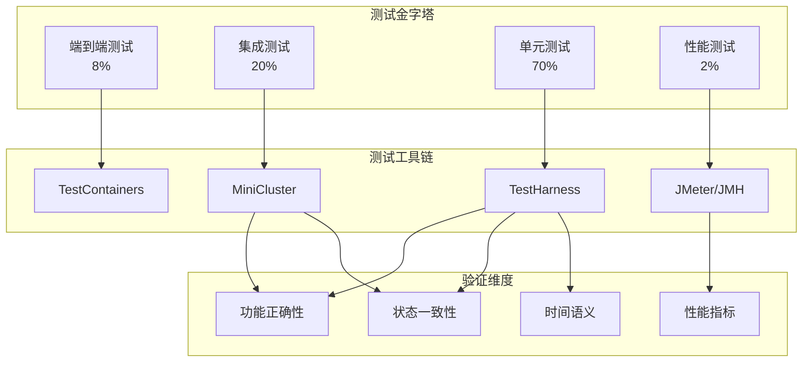
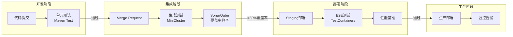
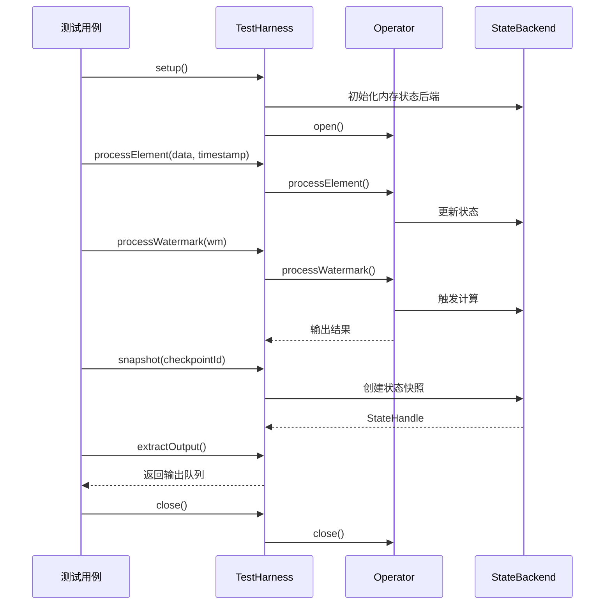

# Flink 测试策略完整指南

> **所属阶段**: Knowledge | **前置依赖**: [07.01-flink-production-checklist.md](./07.01-flink-production-checklist.md), [Flink/03-api-comparison/03.01-datastream-api-guide.md](../../Flink/03-api/03.02-table-sql-api/sql-vs-datastream-comparison.md) | **形式化等级**: L4

---

## 1. 概念定义 (Definitions)

### Def-K-07-01: 流处理测试金字塔

流处理测试金字塔定义了不同层次测试的类型和比例：

$$
\text{TestingPyramid} = \langle \text{Unit}, \text{Integration}, \text{E2E}, \text{Performance} \rangle
$$

其中各层比例遵循：**单元测试(70%) > 集成测试(20%) > 端到端测试(8%) > 性能测试(2%)**

### Def-K-07-02: TestHarness

`TestHarness` 是 Flink 提供的专门用于测试 DataStream API 的工具类，它允许在本地环境中模拟完整的流处理作业执行：

```
TestHarness = ⟨Environment, Operator, StateBackend, TimeService⟩
```

### Def-K-07-03: 确定性测试

确定性测试指在相同输入和配置下，测试结果始终一致的测试：

$$
\text{Deterministic}(T) \iff \forall i, c: T(i, c) \equiv T(i, c)
$$

其中 $i$ 为输入，$c$ 为配置，$\equiv$ 表示结果等价。

### Def-K-07-04: MiniCluster

`MiniCluster` 是 Flink 提供的轻量级集群实现，用于在单个 JVM 中模拟完整的 Flink 运行时环境：

```
MiniCluster = ⟨JobManager, TaskManager(s), Dispatcher, ResourceManager⟩
```

---

## 2. 属性推导 (Properties)

### Prop-K-07-01: 测试隔离性

在流处理测试中，测试用例之间必须保持隔离：

$$
\forall t_1, t_2 \in \text{Tests}: \text{State}(t_1) \cap \text{State}(t_2) = \emptyset
$$

这意味着每个测试用例应该拥有独立的 StateBackend 和 checkpoint 目录。

### Prop-K-07-02: 时间可控性

测试中的时间必须是可控和确定性的：

$$
\text{TestTime} = \text{ManualTime} \oplus \text{ProcessingTime} \oplus \text{EventTime}
$$

通过 `TestStreamEnvironment.setAutoTime()` 可以实现时间的精确控制。

### Prop-K-07-03: 状态可验证性

流处理作业的内部状态必须是可验证的：

$$
\forall s \in \text{KeyedState}: \exists \text{verify}(s) \rightarrow \{\top, \bot\}
$$

通过 `TestHarness.extractOutput()` 和状态快照可以验证状态正确性。

### Lemma-K-07-01: 测试幂等性

在流处理测试中，重复执行相同的测试用例应该产生相同的结果：

$$
\text{Idempotent}(T) \implies T^n(i, c) \equiv T(i, c), \forall n \geq 1
$$

**证明**: 通过使用 `RESTART_STRATEGY_FIXED_DELAY` 和确定性时间源，可以确保测试的幂等性。∎

---

## 3. 关系建立 (Relations)

### 3.1 测试类型映射关系

| 测试类型 | 适用场景 | Flink 工具 | 执行时间 |
|---------|---------|-----------|---------|
| 单元测试 | 单个算子逻辑 | `OneInputStreamOperatorTestHarness` | < 100ms |
| 集成测试 | 算子链/作业 | `MiniClusterWithClientResource` | 1-10s |
| 端到端测试 | 完整数据管道 | `TestEnvironment` + 外部系统 | 10-60s |
| 性能测试 | 吞吐量/延迟基准 | `LocalStreamEnvironment` + Metrics | 分钟级 |

### 3.2 TestHarness 与 MiniCluster 关系

```
┌─────────────────────────────────────────────────────────────┐
│                     Testing Stack                          │
├─────────────────────────────────────────────────────────────┤
│  E2E Tests     │  MiniCluster + Kafka/TestContainers        │
├─────────────────────────────────────────────────────────────┤
│  Integration   │  MiniClusterWithClientResource             │
├─────────────────────────────────────────────────────────────┤
│  Unit Tests    │  TestHarness (One/Multi-Input)            │
├─────────────────────────────────────────────────────────────┤
│  Operator      │  SimpleOperatorTestHarness                 │
│  Tests         │  (Direct operator instantiation)          │
└─────────────────────────────────────────────────────────────┘
```

### 3.3 Table API 与 DataStream API 测试映射

| 特性 | DataStream API 测试 | Table API/SQL 测试 |
|------|--------------------|-------------------|
| 基础类 | `AbstractStreamOperatorTestHarness` | `TableTestBase` |
| 数据输入 | `processElement()` / `processWatermark()` | `values()` / `insertInto()` |
| 结果验证 | `extractOutputValues()` | `executeSql() + assertEquals()` |
| 计划验证 | 不支持 | `explain() + 计划对比` |

---

## 4. 论证过程 (Argumentation)

### 4.1 为什么需要专门的流处理测试框架

**传统测试框架的局限性**:

1. **时间语义缺失**: 单元测试框架（如 JUnit）无法理解 Event Time 和 Watermark
2. **状态不可见**: 无法验证算子内部的状态值
3. **异步复杂性**: 流处理是异步的，传统断言方式无法处理

**Flink TestHarness 的解决方案**:

```java
// 传统方式:无法测试时间语义
@Test
public void badTest() {
    // 无法模拟 watermark 触发
    // 无法验证窗口状态
}

// TestHarness 方式:完整控制
@Test
public void goodTest() throws Exception {
    OneInputStreamOperatorTestHarness<Event, Result> harness =
        new OneInputStreamOperatorTestHarness<>(new WindowOperator<>());

    // 精确控制时间
    harness.processWatermark(new Watermark(1000));
    harness.setProcessingTime(2000);

    // 验证状态
    assertEquals(expectedState, harness.getKeyedState());
}
```

### 4.2 测试数据生成策略对比

| 策略 | 优点 | 缺点 | 适用场景 |
|------|------|------|---------|
| 固定数据 | 确定性高，易于调试 | 覆盖场景有限 | 回归测试 |
| 随机数据 | 覆盖边界情况 | 难以复现失败 | 模糊测试 |
| 生成器模式 | 灵活，可组合 | 实现复杂度高 | 复杂业务逻辑 |
| 真实数据子集 | 贴近生产 | 数据敏感，体积大 | 集成测试 |

---

## 5. 形式证明 / 工程论证 (Proof / Engineering Argument)

### 5.1 测试覆盖率定理

**Thm-K-07-01**: 对于流处理作业 $J$，测试套件 $S$ 达到完全覆盖当且仅当：

$$
\forall p \in \text{Paths}(J), \exists s \in S: \text{Covers}(s, p)
$$

其中 $\text{Paths}(J)$ 包含：

- 正常处理路径
- Watermark 触发路径
- Checkpoint 触发路径
- 故障恢复路径
- 迟到数据处理路径

**工程论证**: 在实践中，通过以下方法实现高覆盖率：

```java
// 覆盖所有路径的测试套件示例
public class ComprehensiveWindowTest {

    @Test
    public void testNormalPath() { /* 正常数据 */ }

    @Test
    public void testWatermarkTrigger() { /* watermark 触发窗口 */ }

    @Test
    public void testCheckpointRecovery() {
        /* 模拟故障恢复 */
        harness.snapshot(0, 0);
        harness.initializeState(snapshot);
    }

    @Test
    public void testLateData() {
        /* 侧输出验证 */
        harness.processElement(lateElement);
        assertEquals(1, harness.getSideOutput(tag).size());
    }
}
```

### 5.2 测试稳定性论证

**不稳定测试的根源分析**:

1. **时间依赖**: 使用 `System.currentTimeMillis()` 而非测试可控时间
2. **资源竞争**: 多测试用例共享端口/目录
3. **异步断言**: 在数据未完全处理时就进行断言

**稳定性保证措施**:

```java
// 不稳定示例
@Test
public void flakyTest() {
    processElement(data);
    Thread.sleep(100); // 不可靠！
    assertEquals(expected, getResult());
}

// 稳定示例
@Test
public void stableTest() throws Exception {
    harness.processElement(data);
    harness.endInput(); // 明确结束输入
    harness.waitForTaskCompletion(); // 等待完成
    assertEquals(expected, harness.extractOutputValues());
}
```

---

## 6. 实例验证 (Examples)

### 6.1 单元测试完整示例

#### 6.1.1 DataStream 算子单元测试

```java
// 伪代码示意,非完整可编译代码
import org.apache.flink.streaming.api.operators.KeyedProcessOperator;
import org.apache.flink.streaming.util.KeyedOneInputStreamOperatorTestHarness;
import org.apache.flink.streaming.util.TestHarnessUtil;
import org.junit.Before;
import org.junit.Test;

import java.util.concurrent.ConcurrentLinkedQueue;

import org.apache.flink.api.common.typeinfo.Types;


/**
 * 带状态的 KeyedProcessFunction 单元测试
 */
public class StatefulCounterTest {

    private KeyedOneInputStreamOperatorTestHarness<String, Event, Result> harness;
    private StatefulCounterFunction function;

    @Before
    public void setup() throws Exception {
        function = new StatefulCounterFunction();
        KeyedProcessOperator<String, Event, Result> operator =
            new KeyedProcessOperator<>(function);

        harness = new KeyedOneInputStreamOperatorTestHarness<>(
            operator,
            Event::getKey,
            Types.STRING
        );

        // 配置状态后端
        harness.setup(new HashMapStateBackend()  // MemoryStateBackend已弃用,使用HashMapStateBackend
// ));
        harness.open();
    }

    @Test
    public void testAccumulateCount() throws Exception {
        // Given: 两个相同 key 的事件
        Event event1 = new Event("user1", 100);
        Event event2 = new Event("user1", 200);

        // When: 处理事件
        harness.processElement(event1, 1000);
        harness.processElement(event2, 2000);

        // Then: 验证累计结果
        ConcurrentLinkedQueue<Object> output = harness.getOutput();
        assertEquals(2, output.size());

        // 验证具体输出值
        Result result1 = (Result) output.poll();
        assertEquals("user1", result1.getKey());
        assertEquals(1, result1.getCount());

        Result result2 = (Result) output.poll();
        assertEquals(2, result2.getCount());
    }

    @Test
    public void testTimerTrigger() throws Exception {
        // Given: 事件和超时设置
        Event event = new Event("user1", 100);

        // When: 处理事件并推进处理时间
        harness.processElement(event, 1000);
        harness.setProcessingTime(5000); // 触发定时器

        // Then: 验证超时输出
        Result result = extractLastOutput();
        assertTrue(result.isTimeout());
    }

    @Test
    public void testStateRestore() throws Exception {
        // Given: 处理事件并创建 checkpoint
        harness.processElement(new Event("user1", 100), 1000);
        OperatorStateHandles snapshot = harness.snapshot(0, 0);

        // When: 重新初始化并恢复状态
        harness.close();
        setup();
        harness.initializeState(snapshot);

        // Then: 验证状态恢复
        harness.processElement(new Event("user1", 200), 2000);
        Result result = extractLastOutput();
        assertEquals(2, result.getCount()); // 累计计数应为2
    }

    @Test
    public void testWatermarkPropagation() throws Exception {
        // When: 发送 watermark
        harness.processWatermark(new Watermark(5000));

        // Then: 验证 watermark 传播
        assertEquals(5000, harness.getOutput().stream()
            .filter(e -> e instanceof Watermark)
            .map(e -> ((Watermark) e).getTimestamp())
            .findFirst()
            .orElse(-1L));
    }
}
```

#### 6.1.2 Window 算子测试

```java
/**
 * TumblingWindow 算子测试
 */

import org.apache.flink.api.common.typeinfo.Types;
import org.apache.flink.streaming.api.windowing.time.Time;

public class TumblingWindowTest {

    private KeyedOneInputStreamOperatorTestHarness<String, Event, WindowResult> harness;

    @Before
    public void setup() throws Exception {
        WindowOperator<String, Event, ?, ?, ?> windowOperator =
            WindowOperator.builder()
                .setEventTime(true)
                .setWindowAssigner(TumblingEventTimeWindows.of(Time.minutes(5)))
                .setAllowedLateness(Time.seconds(10))
                .setOutputTag(lateDataTag)
                .build();

        harness = new KeyedOneInputStreamOperatorTestHarness<>(
            windowOperator,
            Event::getKey,
            Types.STRING
        );
        harness.setup();
        harness.open();
    }

    @Test
    public void testWindowAggregation() throws Exception {
        // Given: 同一窗口内的多个事件
        long windowStart = 0;
        harness.processElement(createEvent("key1", 100, windowStart + 1000));
        harness.processElement(createEvent("key1", 200, windowStart + 2000));
        harness.processElement(createEvent("key1", 300, windowStart + 3000));

        // When: 发送 watermark 触发窗口
        harness.processWatermark(new Watermark(windowStart + 300000));

        // Then: 验证聚合结果
        WindowResult result = extractOutput();
        assertEquals(600, result.getSum()); // 100+200+300
        assertEquals(3, result.getCount());
    }

    @Test
    public void testLateDataToSideOutput() throws Exception {
        // Given: 窗口已触发后的迟到数据
        long windowStart = 0;
        harness.processElement(createEvent("key1", 100, windowStart + 1000));
        harness.processWatermark(new Watermark(windowStart + 300000));

        // When: 发送迟到数据(在允许延迟范围内)
        harness.processElement(createEvent("key1", 50, windowStart + 500));

        // Then: 验证更新后的结果
        // 验证侧输出(超出允许延迟的数据)
        harness.processElement(createEvent("key1", 999, windowStart + 310000));
        assertEquals(1, harness.getSideOutput(lateDataTag).size());
    }
}
```

### 6.2 集成测试完整示例

```java
import org.apache.flink.runtime.testutils.MiniClusterResourceConfiguration;
import org.apache.flink.test.util.MiniClusterWithClientResource;
import org.junit.ClassRule;
import org.junit.Test;

import org.apache.flink.streaming.api.environment.StreamExecutionEnvironment;
import org.apache.flink.streaming.api.windowing.time.Time;


/**
 * 使用 MiniCluster 的集成测试
 */
public class StreamingJobIntegrationTest {

    private static final int PARALLELISM = 2;

    @ClassRule
    public static MiniClusterWithClientResource flinkCluster =
        new MiniClusterWithClientResource(
            new MiniClusterResourceConfiguration.Builder()
                .setNumberSlotsPerTaskManager(PARALLELISM)
                .setNumberTaskManagers(1)
                .build()
        );

    @Test
    public void testEndToEndPipeline() throws Exception {
        // Given: 构建完整作业
        StreamExecutionEnvironment env =
            StreamExecutionEnvironment.getExecutionEnvironment();
        env.setParallelism(PARALLELISM);

        // 使用 CollectSink 收集结果
        CollectSink.clear();

        env.fromElements(
            new Order("order1", 100.0, System.currentTimeMillis()),
            new Order("order2", 200.0, System.currentTimeMillis()),
            new Order("order3", 150.0, System.currentTimeMillis())
        )
        .keyBy(Order::getUserId)
        .window(TumblingProcessingTimeWindows.of(Time.seconds(1)))
        .aggregate(new SumAggregate())
        .addSink(new CollectSink());

        // When: 执行作业
        env.execute("Integration Test Job");

        // Then: 验证结果
        List<OrderSummary> results = CollectSink.getValues();
        assertFalse(results.isEmpty());
        assertTrue(results.stream()
            .mapToDouble(OrderSummary::getTotal)
            .sum() > 0);
    }

    @Test
    public void testCheckpointRecovery() throws Exception {
        // 配置 checkpoint
        StreamExecutionEnvironment env =
            StreamExecutionEnvironment.getExecutionEnvironment();
        env.enableCheckpointing(100);
        env.setRestartStrategy(RestartStrategies.fixedDelayRestart(3, 100));

        // 构建会触发故障的作业
        env.fromElements(1, 2, 3, 4, 5)
           .map(new FailingMapper(3)) // 第3个元素触发故障
           .addSink(new CollectSink());

        env.execute();

        // 验证:即使有故障,所有元素都被处理
        assertEquals(5, CollectSink.getValues().size());
    }

    // 自定义 Sink 用于测试
    private static class CollectSink implements SinkFunction<Integer> {
        private static final List<Integer> values = new CopyOnWriteArrayList<>();

        @Override
        public void invoke(Integer value, Context context) {
            values.add(value);
        }

        public static List<Integer> getValues() {
            return new ArrayList<>(values);
        }

        public static void clear() {
            values.clear();
        }
    }
}
```

### 6.3 Table API/SQL 测试示例

```java
import org.apache.flink.table.api.bridge.java.StreamTableEnvironment;
import org.apache.flink.table.api.EnvironmentSettings;
import org.apache.flink.table.planner.runtime.utils.StreamTestBase;
import org.junit.Test;

import org.apache.flink.table.api.TableEnvironment;


/**
 * Table API 测试基类
 */
public class TableApiTest extends StreamTestBase {

    @Test
    public void testSqlQuery() {
        // Given: 注册源表
        tEnv.executeSql(
            "CREATE TABLE orders (" +
            "  order_id STRING," +
            "  user_id STRING," +
            "  amount DECIMAL(10,2)," +
            "  ts TIMESTAMP(3)," +
            "  WATERMARK FOR ts AS ts - INTERVAL '5' SECOND" +
            ") WITH ('connector' = 'values')"
        );

        // 插入测试数据
        tEnv.executeSql(
            "INSERT INTO orders VALUES " +
            "('1', 'user1', 100.00, TIMESTAMP '2024-01-01 10:00:00')," +
            "('2', 'user1', 200.00, TIMESTAMP '2024-01-01 10:00:05')," +
            "('3', 'user2', 150.00, TIMESTAMP '2024-01-01 10:00:10')"
        );

        // When: 执行查询
        Table result = tEnv.sqlQuery(
            "SELECT user_id, SUM(amount) as total " +
            "FROM orders " +
            "GROUP BY user_id"
        );

        // Then: 验证结果
        List<Row> results = result.execute().collect();
        assertEquals(2, results.size());

        // 验证聚合值
        Map<String, BigDecimal> expected = Map.of(
            "user1", new BigDecimal("300.00"),
            "user2", new BigDecimal("150.00")
        );

        for (Row row : results) {
            String userId = row.getFieldAs("user_id");
            BigDecimal total = row.getFieldAs("total");
            assertEquals(expected.get(userId), total);
        }
    }

    @Test
    public void testQueryPlan() {
        // Given: 创建表
        tEnv.executeSql(
            "CREATE TABLE events (" +
            "  user_id STRING," +
            "  event_type STRING," +
            "  ts TIMESTAMP(3)" +
            ") WITH ('connector' = 'values')"
        );

        // When: 获取执行计划
        String explain = tEnv.explainSql(
            "SELECT user_id, COUNT(*) " +
            "FROM events " +
            "WHERE event_type = 'click' " +
            "GROUP BY user_id"
        );

        // Then: 验证计划包含预期算子
        assertTrue(explain.contains("Calc"));      // 过滤算子
        assertTrue(explain.contains("GroupAggregate")); // 聚合算子
        assertTrue(explain.contains("exchange"));  // 数据交换
    }

    @Test
    public void testTemporalJoin() {
        // Given: 创建事实表和维度表
        tEnv.executeSql(
            "CREATE TABLE orders (" +
            "  order_id STRING," +
            "  currency_code STRING," +
            "  amount DECIMAL(10,2)," +
            "  proctime AS PROCTIME()" +
            ") WITH ('connector' = 'values')"
        );

        tEnv.executeSql(
            "CREATE TABLE currency_rates (" +
            "  currency_code STRING," +
            "  rate DECIMAL(10,4)," +
            "  update_time TIMESTAMP(3)," +
            "  WATERMARK FOR update_time AS update_time," +
            "  PRIMARY KEY (currency_code) NOT ENFORCED" +
            ") WITH ('connector' = 'values')"
        );

        // When: 执行 Temporal Join
        Table result = tEnv.sqlQuery(
            "SELECT o.order_id, o.amount * r.rate as usd_amount " +
            "FROM orders AS o " +
            "JOIN currency_rates FOR SYSTEM_TIME AS OF o.proctime AS r " +
            "ON o.currency_code = r.currency_code"
        );

        // Then: 验证结果(简化示例)
        assertNotNull(result);
    }
}
```

### 6.4 性能测试示例

```java
import org.apache.flink.runtime.testutils.MiniClusterResourceConfiguration;
import org.apache.flink.test.util.MiniClusterWithClientResource;
import org.junit.ClassRule;
import org.junit.Test;

import org.apache.flink.streaming.api.environment.StreamExecutionEnvironment;
import org.apache.flink.streaming.api.windowing.time.Time;


/**
 * 性能基准测试
 */
public class PerformanceBenchmarkTest {

    private static final int PARALLELISM = 4;

    @ClassRule
    public static MiniClusterWithClientResource flinkCluster =
        new MiniClusterWithClientResource(
            new MiniClusterResourceConfiguration.Builder()
                .setNumberSlotsPerTaskManager(PARALLELISM)
                .setNumberTaskManagers(2)
                .build()
        );

    @Test
    public void throughputBenchmark() throws Exception {
        // 配置
        final int numRecords = 1_000_000;
        final int numKeys = 1000;

        StreamExecutionEnvironment env =
            StreamExecutionEnvironment.getExecutionEnvironment();
        env.setParallelism(PARALLELISM);

        // 使用 ThroughputMeasuringSink
        ThroughputSink throughputSink = new ThroughputSink();

        // 生成测试数据
        env.addSource(new InfiniteSource(numRecords, numKeys))
           .keyBy(Event::getKey)
           .window(TumblingProcessingTimeWindows.of(Time.seconds(1)))
           .aggregate(new CountAggregate())
           .addSink(throughputSink);

        // 执行
        long startTime = System.currentTimeMillis();
        env.execute("Throughput Benchmark");
        long duration = System.currentTimeMillis() - startTime;

        // 报告
        double throughput = (double) numRecords / duration * 1000;
        System.out.printf("Throughput: %.2f records/second%n", throughput);
        System.out.printf("Duration: %d ms%n", duration);

        // 断言:吞吐量应该超过 10000 records/s
        assertTrue(throughput > 10000,
            "Throughput too low: " + throughput);
    }

    @Test
    public void latencyBenchmark() throws Exception {
        StreamExecutionEnvironment env =
            StreamExecutionEnvironment.getExecutionEnvironment();
        env.setParallelism(PARALLELISM);

        // 延迟测量
        LatencyMeasuringSink latencySink = new LatencyMeasuringSink();

        env.addSource(new TimestampedSource(100_000))
           .keyBy(Event::getKey)
           .process(new StatefulFunction())
           .addSink(latencySink);

        env.execute("Latency Benchmark");

        // 报告 P99 延迟
        long p99Latency = latencySink.getP99Latency();
        System.out.printf("P99 Latency: %d ms%n", p99Latency);

        // 断言:P99 延迟应该小于 100ms
        assertTrue(p99Latency < 100,
            "P99 Latency too high: " + p99Latency);
    }

    // 吞吐量测量 Sink
    private static class ThroughputSink implements SinkFunction<AggregateResult> {
        private static final AtomicLong counter = new AtomicLong(0);

        @Override
        public void invoke(AggregateResult value, Context context) {
            counter.incrementAndGet();
        }
    }

    // 延迟测量 Sink
    private static class LatencyMeasuringSink implements SinkFunction<Result> {
        private final List<Long> latencies = new ArrayList<>();

        @Override
        public void invoke(Result value, Context context) {
            long latency = System.currentTimeMillis() - value.getTimestamp();
            latencies.add(latency);
        }

        public long getP99Latency() {
            Collections.sort(latencies);
            int index = (int) (latencies.size() * 0.99);
            return latencies.get(index);
        }
    }
}
```

### 6.5 测试数据生成器

```java
import org.apache.flink.api.common.serialization.SerializationSchema;
import java.util.Random;
import java.util.concurrent.ThreadLocalRandom;

/**
 * 测试数据生成器
 */
public class TestDataGenerator {

    private final Random random = ThreadLocalRandom.current();

    /**
     * 生成随机事件流
     */
    public Stream<Event> generateEventStream(int count, int numKeys) {
        return Stream.generate(() -> generateRandomEvent(numKeys))
                    .limit(count);
    }

    private Event generateRandomEvent(int numKeys) {
        return new Event(
            "key" + random.nextInt(numKeys),
            random.nextDouble() * 1000,
            System.currentTimeMillis() - random.nextInt(10000)
        );
    }

    /**
     * 生成倾斜数据(用于测试热点处理)
     */
    public Stream<Event> generateSkewedStream(int count, double skewFactor) {
        return Stream.generate(() -> {
            String key = random.nextDouble() < skewFactor
                ? "hot-key"
                : "key" + random.nextInt(100);
            return new Event(key, random.nextDouble(), System.currentTimeMillis());
        }).limit(count);
    }

    /**
     * 生成乱序事件流(用于测试 Watermark 处理)
     */
    public Stream<Event> generateOutOfOrderStream(int count, int maxDelayMs) {
        long baseTime = System.currentTimeMillis();
        return Stream.generate(() -> {
            long delay = random.nextInt(maxDelayMs * 2) - maxDelayMs;
            return new Event(
                "key" + random.nextInt(100),
                random.nextDouble(),
                baseTime + delay
            );
        }).limit(count);
    }

    /**
     * 生成包含迟到数据的流
     */
    public List<Event> generateStreamWithLateData(
            int normalCount,
            int lateCount,
            long windowSize) {

        List<Event> events = new ArrayList<>();
        long baseTime = 0;

        // 正常数据
        for (int i = 0; i < normalCount; i++) {
            events.add(new Event("key1", i, baseTime + i * 1000));
        }

        // 迟到数据(超出 watermark 延迟)
        for (int i = 0; i < lateCount; i++) {
            events.add(new Event("key1", 999, baseTime + i * 100));
        }

        return events;
    }
}
```

---

## 7. 可视化 (Visualizations)

### 7.1 流处理测试架构图



### 7.2 CI/CD 集成流程图



### 7.3 TestHarness 工作原理图



---

## 8. 测试配置模板

### 8.1 Maven 测试配置

```xml
<!-- pom.xml 测试相关配置 -->
<properties>
    <flink.version>1.18.0</flink.version>
    <junit.version>5.9.2</junit.version>
    <testcontainers.version>1.19.0</testcontainers.version>
</properties>

<dependencies>
    <!-- Flink 测试依赖 -->
    <dependency>
        <groupId>org.apache.flink</groupId>
        <artifactId>flink-test-utils</artifactId>
        <version>${flink.version}</version>
        <scope>test</scope>
    </dependency>

    <dependency>
        <groupId>org.apache.flink</groupId>
        <artifactId>flink-streaming-java</artifactId>
        <version>${flink.version}</version>
        <scope>test</scope>
        <classifier>tests</classifier>
    </dependency>

    <dependency>
        <groupId>org.apache.flink</groupId>
        <artifactId>flink-table-test-utils</artifactId>
        <version>${flink.version}</version>
        <scope>test</scope>
    </dependency>

    <!-- JUnit 5 -->
    <dependency>
        <groupId>org.junit.jupiter</groupId>
        <artifactId>junit-jupiter</artifactId>
        <version>${junit.version}</version>
        <scope>test</scope>
    </dependency>

    <!-- AssertJ 流畅断言 -->
    <dependency>
        <groupId>org.assertj</groupId>
        <artifactId>assertj-core</artifactId>
        <version>3.24.2</version>
        <scope>test</scope>
    </dependency>

    <!-- TestContainers -->
    <dependency>
        <groupId>org.testcontainers</groupId>
        <artifactId>testcontainers</artifactId>
        <version>${testcontainers.version}</version>
        <scope>test</scope>
    </dependency>
    <dependency>
        <groupId>org.testcontainers</groupId>
        <artifactId>kafka</artifactId>
        <version>${testcontainers.version}</version>
        <scope>test</scope>
    </dependency>
</dependencies>

<build>
    <plugins>
        <!-- Surefire 插件配置 -->
        <plugin>
            <groupId>org.apache.maven.plugins</groupId>
            <artifactId>maven-surefire-plugin</artifactId>
            <version>3.1.2</version>
            <configuration>
                <includes>
                    <include>**/*Test.java</include>
                    <include>**/*Tests.java</include>
                </includes>
                <excludes>
                    <exclude>**/*IntegrationTest.java</exclude>
                    <exclude>**/*PerformanceTest.java</exclude>
                </excludes>
                <systemPropertyVariables>
                    <log4j.configurationFile>log4j2-test.xml</log4j.configurationFile>
                </systemPropertyVariables>
            </configuration>
        </plugin>

        <!-- Failsafe 插件用于集成测试 -->
        <plugin>
            <groupId>org.apache.maven.plugins</groupId>
            <artifactId>maven-failsafe-plugin</artifactId>
            <version>3.1.2</version>
            <configuration>
                <includes>
                    <include>**/*IntegrationTest.java</include>
                </includes>
            </configuration>
            <executions>
                <execution>
                    <goals>
                        <goal>integration-test</goal>
                        <goal>verify</goal>
                    </goals>
                </execution>
            </executions>
        </plugin>

        <!-- JaCoCo 覆盖率 -->
        <plugin>
            <groupId>org.jacoco</groupId>
            <artifactId>jacoco-maven-plugin</artifactId>
            <version>0.8.11</version>
            <executions>
                <execution>
                    <goals>
                        <goal>prepare-agent</goal>
                    </goals>
                </execution>
                <execution>
                    <id>report</id>
                    <phase>test</phase>
                    <goals>
                        <goal>report</goal>
                    </goals>
                </execution>
            </executions>
        </plugin>
    </plugins>
</build>
```

### 8.2 GitHub Actions CI 配置

```yaml
# .github/workflows/flink-ci.yml
name: Flink CI/CD Pipeline

on:
  push:
    branches: [main, develop]
  pull_request:
    branches: [main]

jobs:
  unit-tests:
    runs-on: ubuntu-latest
    steps:
      - uses: actions/checkout@v4

      - name: Set up JDK 11
        uses: actions/setup-java@v3
        with:
          java-version: '11'
          distribution: 'temurin'
          cache: maven

      - name: Run Unit Tests
        run: mvn test -Dtest="!*IntegrationTest,!*PerformanceTest"

      - name: Upload Coverage
        uses: codecov/codecov-action@v3
        with:
          files: target/site/jacoco/jacoco.xml
          fail_ci_if_error: true

  integration-tests:
    runs-on: ubuntu-latest
    needs: unit-tests
    steps:
      - uses: actions/checkout@v4

      - name: Set up JDK 11
        uses: actions/setup-java@v3
        with:
          java-version: '11'
          distribution: 'temurin'
          cache: maven

      - name: Run Integration Tests
        run: mvn failsafe:integration-test
        env:
          # 限制 MiniCluster 资源使用
          FLINK_TEST_MINICLUSTER_MAX_MEMORY: 512m
          FLINK_TEST_MINICLUSTER_NUM_TASK_MANAGERS: 2

      - name: Upload Test Results
        uses: actions/upload-artifact@v3
        if: always()
        with:
          name: integration-test-results
          path: target/failsafe-reports/

  performance-tests:
    runs-on: ubuntu-latest
    needs: integration-tests
    if: github.ref == 'refs/heads/main'
    steps:
      - uses: actions/checkout@v4

      - name: Set up JDK 11
        uses: actions/setup-java@v3
        with:
          java-version: '11'
          distribution: 'temurin'
          cache: maven

      - name: Run Performance Benchmarks
        run: mvn test -Dtest="*PerformanceTest"

      - name: Upload Benchmark Results
        uses: actions/upload-artifact@v3
        with:
          name: benchmark-results
          path: target/benchmark-results/

  code-quality:
    runs-on: ubuntu-latest
    steps:
      - uses: actions/checkout@v4

      - name: SonarCloud Scan
        uses: SonarSource/sonarcloud-github-action@master
        env:
          GITHUB_TOKEN: ${{ secrets.GITHUB_TOKEN }}
          SONAR_TOKEN: ${{ secrets.SONAR_TOKEN }}
```

### 8.3 Jenkins Pipeline 配置

```groovy
// Jenkinsfile
pipeline {
    agent any

    tools {
        maven 'Maven-3.9'
        jdk 'JDK-11'
    }

    environment {
        FLINK_VERSION = '1.18.0'
        MAVEN_OPTS = '-Xmx1024m'
    }

    stages {
        stage('Checkout') {
            steps {
                checkout scm
            }
        }

        stage('Build') {
            steps {
                sh 'mvn clean compile -DskipTests'
            }
        }

        stage('Unit Tests') {
            steps {
                sh 'mvn test -Dtest="!*IntegrationTest,!*PerformanceTest"'
            }
            post {
                always {
                    junit 'target/surefire-reports/*.xml'
                    jacoco execPattern: 'target/jacoco.exec'
                }
            }
        }

        stage('Integration Tests') {
            steps {
                sh 'mvn failsafe:integration-test failsafe:verify'
            }
            post {
                always {
                    junit 'target/failsafe-reports/*.xml'
                }
            }
        }

        stage('Code Coverage') {
            steps {
                sh 'mvn jacoco:report'
                publishHTML([
                    allowMissing: false,
                    alwaysLinkToLastBuild: true,
                    keepAll: true,
                    reportDir: 'target/site/jacoco',
                    reportFiles: 'index.html',
                    reportName: 'JaCoCo Coverage Report'
                ])
            }
        }

        stage('Performance Tests') {
            when {
                branch 'main'
            }
            steps {
                sh 'mvn test -Dtest="*PerformanceTest"'
            }
        }
    }

    post {
        always {
            cleanWs()
        }
        failure {
            mail to: 'team@example.com',
                 subject: "Build Failed: ${env.JOB_NAME} - ${env.BUILD_NUMBER}",
                 body: "Check console output at ${env.BUILD_URL}"
        }
    }
}
```

### 8.4 测试日志配置

```xml
<!-- src/test/resources/log4j2-test.xml -->
<?xml version="1.0" encoding="UTF-8"?>
<Configuration status="WARN">
    <Appenders>
        <Console name="Console" target="SYSTEM_OUT">
            <PatternLayout pattern="%d{HH:mm:ss.SSS} [%t] %-5level %logger{36} - %msg%n"/>
        </Console>
    </Appenders>

    <Loggers>
        <!-- Flink 测试框架日志 -->
        <Logger name="org.apache.flink.runtime.testutils" level="INFO"/>
        <Logger name="org.apache.flink.streaming.util" level="INFO"/>

        <!-- 降低 MiniCluster 日志级别 -->
        <Logger name="org.apache.flink.runtime.minicluster" level="WARN"/>
        <Logger name="org.apache.flink.runtime.dispatcher" level="WARN"/>
        <Logger name="org.apache.flink.runtime.resourcemanager" level="WARN"/>

        <!-- 测试类日志 -->
        <Logger name="com.example.flink" level="DEBUG"/>

        <Root level="WARN">
            <AppenderRef ref="Console"/>
        </Root>
    </Loggers>
</Configuration>
```

---

## 9. 测试最佳实践

### 9.1 测试命名规范

| 测试类型 | 命名模式 | 示例 |
|---------|---------|------|
| 单元测试 | `{Class}Test` | `WindowOperatorTest` |
| 集成测试 | `{Class}IntegrationTest` | `StreamingJobIntegrationTest` |
| 性能测试 | `{Class}PerformanceTest` | `ThroughputBenchmarkTest` |
| 参数化测试 | `{Class}ParameterizedTest` | `WindowTypeParameterizedTest` |

### 9.2 测试代码组织

```
src/
├── main/
│   └── java/
│       └── com/example/flink/
│           ├── operators/
│           └── functions/
└── test/
    ├── java/
    │   └── com/example/flink/
    │       ├── operators/
    │       │   ├── WindowOperatorTest.java
    │       │   └── ProcessFunctionTest.java
    │       ├── integration/
    │       │   └── StreamingJobIntegrationTest.java
    │       ├── performance/
    │       │   └── ThroughputBenchmarkTest.java
    │       └── utils/
    │           ├── TestDataGenerator.java
    │           └── CollectSink.java
    └── resources/
        ├── log4j2-test.xml
        └── test-data/
            └── sample-events.json
```

### 9.3 测试稳定性检查清单

- [ ] 使用 `TestHarness` 而非 `Thread.sleep()` 等待结果
- [ ] 每个测试用例使用独立的状态后端目录
- [ ] 测试结束后清理资源（调用 `harness.close()`）
- [ ] 避免使用随机端口，使用端口分配工具
- [ ] 设置合理的超时时间（`@Timeout(value = 30, unit = TimeUnit.SECONDS)`）
- [ ] 使用 `@RepeatedTest(10)` 验证测试稳定性

### 9.4 覆盖率目标

| 层级 | 目标覆盖率 | 说明 |
|------|-----------|------|
| 行覆盖率 | ≥ 80% | 核心逻辑必须覆盖 |
| 分支覆盖率 | ≥ 70% | 条件分支必须覆盖 |
| 方法覆盖率 | ≥ 90% | 公共 API 必须覆盖 |
| 类覆盖率 | ≥ 85% | 核心类必须覆盖 |

---

## 10. 引用参考 (References)


---

*文档版本: v1.0 | 最后更新: 2026-04-04 | 维护者: AnalysisDataFlow Team*
