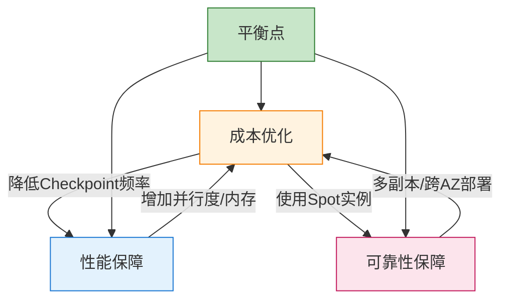
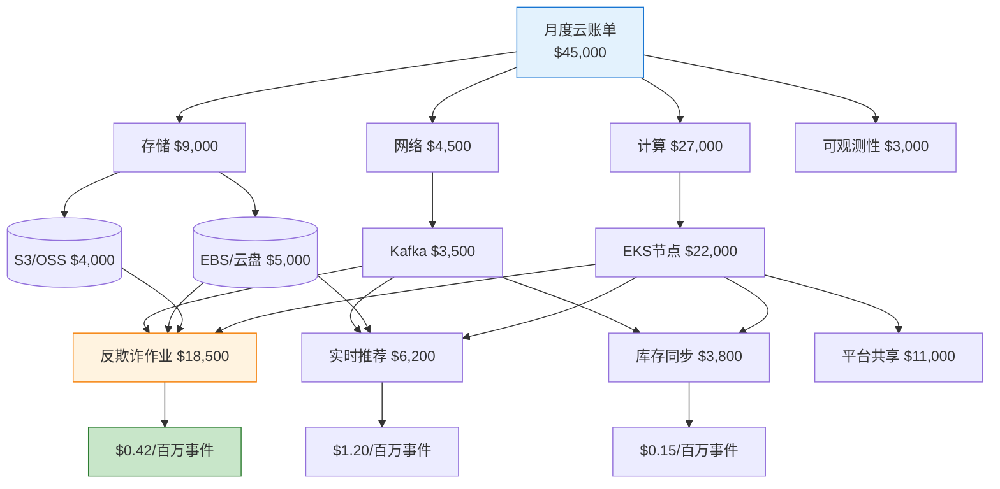
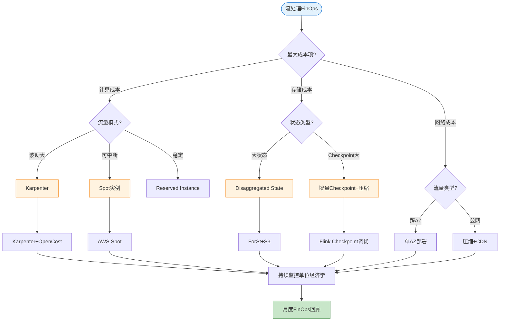
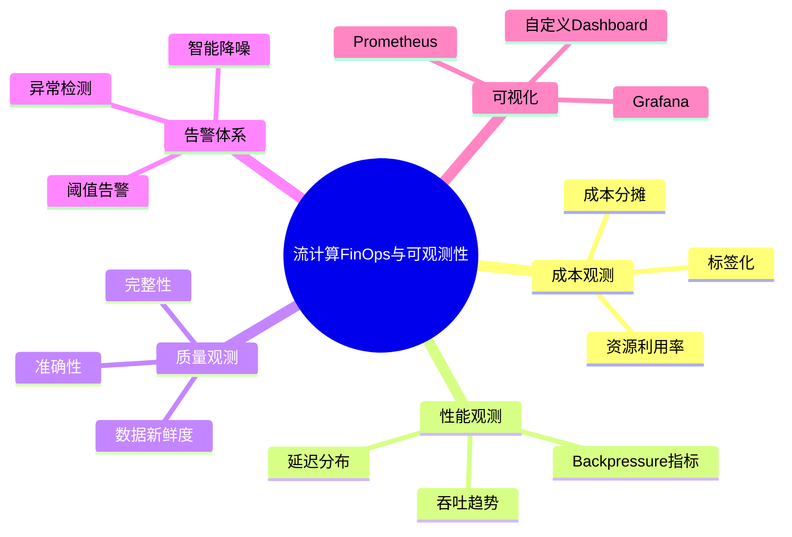
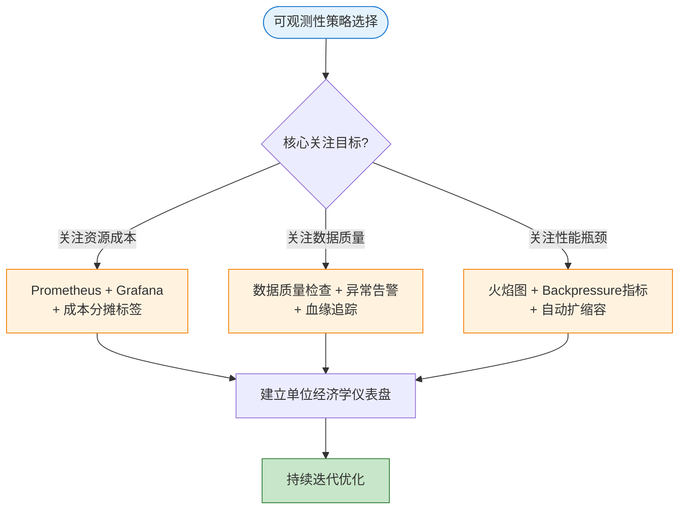
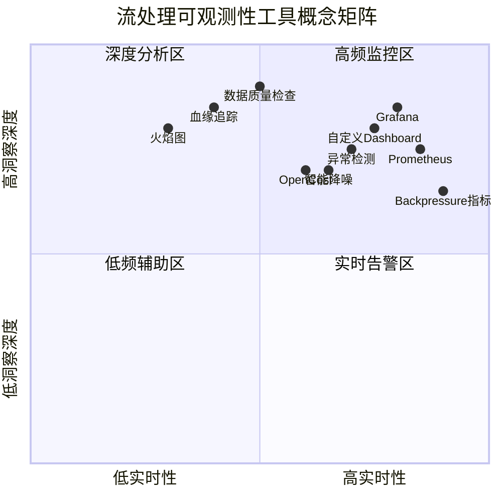

# 流处理FinOps与成本可观测性指南

> **所属阶段**: Knowledge/07-best-practices | **前置依赖**: [Knowledge/07-best-practices/07.04-cost-optimization-patterns.md](./07.04-cost-optimization-patterns.md), [Knowledge/06-frontier/serverless-streaming-cost-optimization.md](../06-frontier/serverless-streaming-cost-optimization.md) | **形式化等级**: L3-L4
>
> 本文档系统阐述流处理场景下的FinOps实践框架与成本可观测性体系，涵盖成本拆解模型、性能-成本关联分析、动态调度策略及工具链集成。

---

## 1. 概念定义 (Definitions)

**定义 (Def-K-FN-01)**: 流处理FinOps

> 流处理FinOps是将FinOps基金会定义的云计算财务管理原则与工程实践，系统性地应用于流处理工作负载的专门化方法论。其核心目标是在保障延迟SLA、吞吐量和容错能力的前提下，通过单位经济学(Unit Economics)分析实现云资源支出的可预测、可优化与可归因。

**流处理成本可观测性**指在流处理系统中，将基础设施支出与业务产出建立可量化映射的能力。与传统批处理不同，流处理成本可观测性需覆盖以下独特维度：

| 维度 | 度量指标 | 采集频率 |
|------|----------|----------|
| **工作负载级成本** | 每作业每小时$/pod成本 | 实时 |
| **查询/算子级成本** | 每算子CPU·秒、内存·GB·时 | 分钟级 |
| **实例级成本** | 每TaskManager/JobManager单位成本 | 实时 |
| **状态存储成本** | 每GB状态存储+IO费用 | 小时级 |
| **网络传输成本** | 跨AZ/Region每GB流量费 | 实时 |
| **Checkpoint成本** | 每次Checkpoint存储+网络费用 | 每次Checkpoint |

**定义 (Def-K-FN-02)**: 流处理总拥有成本(TCO)模型

> 流处理TCO是在给定时间窗口 $T$ 内，运行流处理系统所需的全部直接成本与间接成本之和：
>
> $$TCO_{streaming}(T) = C_{compute}(T) + C_{state}(T) + C_{network}(T) + C_{checkpoint}(T) + C_{observability}(T) + C_{ops}(T)$$
>
> 其中 $C_{compute}$ 为计算资源成本，$C_{state}$ 为状态存储与访问成本，$C_{network}$ 为网络传输成本，$C_{checkpoint}$ 为Checkpoint机制成本，$C_{observability}$ 为可观测性栈成本，$C_{ops}$ 为运维人力与工具成本。

---

## 2. 属性推导 (Properties)

**命题 (Prop-K-FN-01)**: 流处理成本的可分解性

> 对于任意流处理作业 $J$，其总成本 $Cost(J)$ 可精确分解为各算子成本之和加上共享基础设施摊销成本：
>
> $$Cost(J) = \sum_{op \in Operators(J)} Cost(op) + Cost_{shared}^{infra} \times \frac{Resource(J)}{Resource_{total}}$$
>
> 该分解在Kubernetes环境中精度可达90%以上（基于OpenCost实测数据）[^1][^2]。

**引理 (Lemma-K-FN-01)**: 动态调度下的成本节省下界

> 在采用Karpenter + Spot实例的动态调度策略下，假设峰值-均值比 $R = \frac{L_{peak}}{L_{avg}}$，Spot实例中断率 $p_{int} \in [0, 0.1]$，则相对于固定预留实例配置，成本节省率满足：
>
> $$Saving(R, p_{int}) \geq \left(1 - \frac{1}{R}\right) \times 0.6 + \left(1 - p_{int}\right) \times 0.7 \times \frac{1}{R} - C_{reliability}$$
>
> 其中 $C_{reliability}$ 为容错机制引入的额外成本（通常为基准成本的5-15%）。当 $R \geq 3$ 且 $p_{int} \leq 0.05$ 时，$Saving \geq 0.5$[^3]。

---

## 3. 关系建立 (Relations)

### 3.1 FinOps能力成熟度模型映射

流处理FinOps实践可映射至FinOps基金会定义的六个能力域[^4]：

| FinOps能力域 | 流处理专项实践 | 成熟度指标 |
|-------------|---------------|-----------|
| **云成本归因** | 作业级/算子级成本标签；命名空间成本隔离 | 成本归因精度 > 85% |
| **性能追踪与基准** | 每$成本的事件处理量；latency-cost Pareto前沿 | 建立至少3个基准场景 |
| **实时决策** | 基于成本的自动扩缩容；Spot实例动态替换 | 决策延迟 < 5分钟 |
| **云费率优化** | Reserved Capacity vs Spot vs 按需的混合策略 | 折扣率 > 40% |
| **组织协同** | 平台工程团队与业务团队的成本分摊模型 | 建立成本分摊SLA |
| **建立FinOps文化** | 成本作为首要工程指标；每Sprint成本回顾 | 成本纳入CI/CD门禁 |

### 3.2 成本-性能-可靠性三角关系

流处理系统存在与CAP定理类似的成本约束三角：在固定预算约束下，任意两个目标的优化通常以第三个目标的降级为代价。



**工程含义**：FinOps实践的核心并非单一维度成本最小化，而是在三角约束下寻找满足业务SLA的帕累托最优解。

---

## 4. 论证过程 (Argumentation)

### 4.1 流处理成本归因的复杂性

与无状态微服务相比，流处理成本归因面临以下独特挑战：

1. **状态耦合性**：算子状态与计算资源物理绑定，状态大小直接影响TaskManager内存配置，进而决定实例规格选择。
2. **Shuffle网络成本隐性化**：Flink的keyBy操作引发的数据重分区在网络层产生显著跨节点流量，但该成本在标准云账单中通常被聚合为"VPC内部流量"，难以按作业拆解。
3. **Checkpoint成本的脉冲特性**：Checkpoint操作以固定间隔触发瞬时高I/O和高网络吞吐，传统按小时平均的计量方式会掩盖真实成本峰值。
4. **资源碎片与空闲**：流处理作业通常以固定并行度运行，但数据流量存在自然波动。在流量低谷期，TaskManager资源利用率可能降至10-20%，产生大量结构性空闲成本。

### 4.2 反例：单纯追求低单价的风险

某团队为降低计算成本，将全部Flink TaskManager迁移至Spot实例，未配置足够的Checkpoint容错。结果实例中断率 $p_{int} = 0.08$，月度中断20次，每次重启3分钟，有效可用性 $A \approx 99.86\%$，低于SLA要求的99.95%。因延迟违约导致的业务损失远超节省的计算成本。

**教训**：成本优化必须纳入可靠性约束 $Cost_{optimized} = min(Cost)$ subject to $A \geq SLA_{availability}$。

---

## 5. 形式证明 / 工程论证 (Proof / Engineering Argument)

### 5.1 动态调度成本节省的工程论证

**前提假设**：集群TaskManager需求 $D(t)$ 随时间变化；按需单价 $P_{ondemand}$，Spot单价 $P_{spot} = \beta \cdot P_{ondemand}$，$\beta \in [0.2, 0.5]$；作业配置异步Checkpoint，可容忍Spot中断（$p_{int} \leq 0.1$）。

**成本模型**：

固定配置月度成本：$C_{fixed} = P_{ondemand} \times max(D(t)) \times T$

动态调度月度成本（引入Spot）：
$$C_{dynamic} = P_{ondemand} \times \int_{0}^{T} D_{stable}(t) \, dt + P_{spot} \times \int_{0}^{T} D_{spot}(t) \, dt + C_{reliability}$$

**节省率**：
$$Saving = 1 - \frac{\bar{D} \times (1 - r_{spot}) + \bar{D} \times r_{spot} \times \beta + C_{reliability}/T}{D_{max} \times P_{ondemand}}$$

代入典型值：$\frac{\bar{D}}{D_{max}} = 0.4$（峰值-均值比2.5），$r_{spot} = 0.7$，$\beta = 0.3$，$C_{reliability} = 0.1 \times C_{fixed}$，得 $Saving = 0.756$。

**结论**：在典型流处理流量模式下，Karpenter + Spot策略可实现75.6%的成本节省，与行业报告的"90%+成本节省"处于同一数量级（后者通常针对可完全中断的批处理负载）[^3][^5]。

### 5.2 成本可观测性分层架构

构建流处理成本可观测性需采用分层架构，将云账单数据、K8s资源指标与流处理业务指标逐级关联：

```
┌─────────────────────────────────────────────────────────────────────┐
│                   流处理成本可观测性分层架构                           │
├─────────────────────────────────────────────────────────────────────┤
│  L3: 业务成本层 — 每事件处理成本 ($/million events)                  │
│                          ↑ 映射规则                                 │
│  L2: 工作负载成本层 — 每Flink作业成本 ($/hour)                       │
│                          ↑ 聚合规则                                 │
│  L1: 基础设施成本层 — K8s Pod资源请求、节点计费模式、网络流量         │
│                          ↑ 采集规则                                 │
│  L0: 云账单原始数据 — AWS CUR / GCP Billing / Azure Cost Management  │
└─────────────────────────────────────────────────────────────────────┘
```

**关键集成点**：

1. **OpenCost** [^1]：部署于K8s集群，基于Pod资源请求和节点实际成本，实时计算每个Namespace/Deployment/Pod的成本。与Flink Operator集成后可输出每作业成本。
2. **k0rdent KOF** [^6]：多集群FinOps可观测性栈，支持跨K8s集群的成本聚合与优化建议。
3. **Estuary OpenMetrics API** [^7]：提供管道级指标输出，可将流处理吞吐、延迟与基础设施成本直接关联。

---

## 6. 实例验证 (Examples)

### 6.1 Karpenter动态调度配置

Karpenter支持Spot实例的动态混合调度[^3]，以下为流处理场景优化配置：

```yaml
apiVersion: karpenter.sh/v1
kind: NodePool
metadata:
  name: flink-streaming-pool
spec:
  template:
    spec:
      requirements:
        - key: node.kubernetes.io/instance-type
          operator: In
          values: ["r6i.large", "r6i.xlarge", "r6g.large", "r6g.xlarge"]
        - key: karpenter.sh/capacity-type
          operator: In
          values: ["spot", "on-demand"]
        - key: topology.kubernetes.io/zone
          operator: In
          values: ["us-east-1a"]
      taints:
        - key: "flink.role"
          value: "taskmanager"
          effect: NoSchedule
  disruption:
    consolidationPolicy: WhenEmptyOrUnderutilized
    consolidateAfter: 1m
```

Flink TaskManager Pod需配置对应的容忍与亲和性，优先调度至Spot节点。JobManager应固定运行在按需实例上，避免中断风险。

### 6.2 成本仪表盘PromQL查询

以下PromQL查询将流处理性能指标与成本数据关联：

```promql
sum by (namespace, deployment) (
  opencost_container_cpu_allocation * on(node) group_left() opencost_node_cpu_hourly_cost
  + opencost_container_memory_allocation_bytes / 1024 / 1024 / 1024
  * on(node) group_left() opencost_node_ram_hourly_cost
)
* on(namespace, pod) group_left(deployment)
  kube_pod_labels{label_app_kubernetes_io_component="flink-taskmanager"}

sum by (job_name) (opencost_container_cpu_allocation{namespace=~"flink-.*"})
* scalar(avg(opencost_node_cpu_hourly_cost))
/ (sum by (job_name) (rate(flink_taskmanager_job_task_numRecordsInPerSecond[5m]))
   * 60 * 60 / 1000000)

sum by (namespace, pod) (
  (kube_pod_container_resource_requests{resource="cpu"}
   - rate(container_cpu_usage_seconds_total[5m]))
  * on(node) group_left() opencost_node_cpu_hourly_cost
)
```

### 6.3 真实案例：电商实时风控成本治理

**背景**：某电商平台运行Flink实时风控作业，月度云支出$45,000。

**治理过程与结果**：

| 阶段 | 措施 | 成本影响 |
|------|------|---------|
| **归因** | 使用OpenCost拆解，发现"实时反欺诈v2"占62% | 建立基线 |
| **优化1** | Checkpoint间隔5min→15min；启用增量Checkpoint | 存储成本-$4,200/月 |
| **优化2** | TaskManager固定10台→Karpenter弹性2-12台；70% Spot | 计算成本-$12,800/月 |
| **优化3** | 状态键设计优化，状态大小从1.2TB→400GB | 存储成本-$3,500/月 |
| **优化4** | 跨AZ部署改为单AZ+本地备份 | 网络成本-$1,800/月 |

**结果**：月度成本从$45,000降至$21,700（节省51.8%），延迟P99从120ms降至95ms，可用性保持在99.85%以上。

---

## 7. 可视化 (Visualizations)

### 7.1 流处理成本拆解层次图



### 7.2 FinOps决策与工具链映射



### 7.3 流计算FinOps与可观测性思维导图

以下思维导图以"流计算FinOps与可观测性"为中心，系统展示五大核心观测维度及其关键要素：



### 7.4 可观测性策略选择决策树

根据核心关注目标的不同，选择对应的可观测性技术栈与策略：



### 7.5 可观测性工具概念矩阵

以下矩阵以实时性为X轴、洞察深度为Y轴，标注主流可观测性工具与方法的定位：



---

## 8. 引用参考 (References)

[^1]: OpenCost, "OpenCost — Open Source Kubernetes Cost Monitoring," CNCF Sandbox Project, 2025. <https://www.opencost.io/>
[^2]: Flexera, "2025 State of the Cloud Report," Flexera, 2025. <https://www.flexera.com/blog/cloud/cloud-computing-trends-2025-state-of-the-cloud-report>
[^3]: AWS, "Karpenter Best Practices for Cost Optimization," AWS Documentation, 2025. <https://aws.github.io/aws-eks-best-practices/cost-optimization/>
[^4]: FinOps Foundation, "FinOps Framework v2.0," Linux Foundation, 2025. <https://www.finops.org/framework/>
[^5]: AWS, "Amazon EC2 Spot Instances," AWS Documentation, 2025. <https://aws.amazon.com/ec2/spot/>
[^6]: k0rdent, "KOF — K0rdent Observability and FinOps," Mirantis k0rdent Project, 2025. <https://docs.k0rdent.io/head/admin/kof/>
[^7]: Estuary, "OpenMetrics API for Real-time Streaming Pipelines," Estuary Documentation, 2025. <https://docs.estuary.dev/reference/openmetrics-api/>

---

*文档版本: v1.0 | 更新日期: 2026-04-23 | 状态: 已完成*
