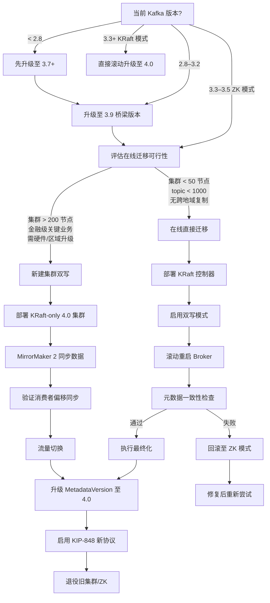
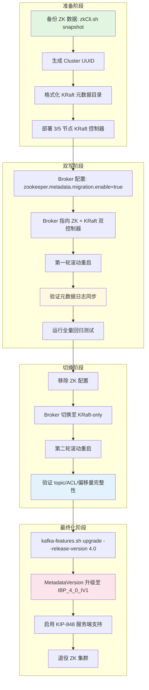
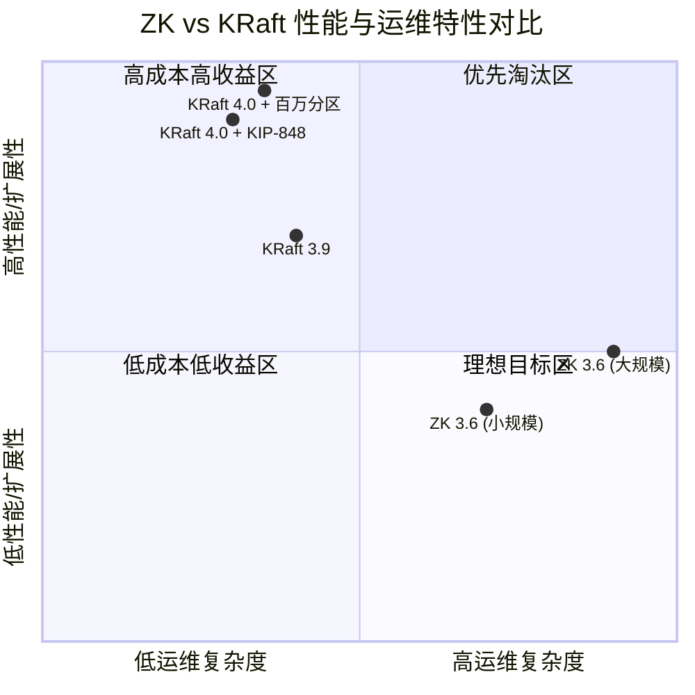

# Kafka 4.0 生产迁移完整指南：从 ZooKeeper 到 KRaft 与全新消费者协议

> 所属阶段: Knowledge | 前置依赖: [Flink/Kafka 连接器最佳实践](../../Flink/05-ecosystem/kafka-connector-production-guide.md), [KRaft 架构原理](../01-concept-atlas/kraft-architecture-deep-dive.md) | 形式化等级: L4

## 目录

- [Kafka 4.0 生产迁移完整指南：从 ZooKeeper 到 KRaft 与全新消费者协议](#kafka-40-生产迁移完整指南从-zookeeper-到-kraft-与全新消费者协议)
  - [目录](#目录)
  - [1. 概念定义 (Definitions)](#1-概念定义-definitions)
  - [2. 属性推导 (Properties)](#2-属性推导-properties)
  - [3. 关系建立 (Relations)](#3-关系建立-relations)
    - [3.1 Flink ↔ Kafka 4.0 适配关系](#31-flink--kafka-40-适配关系)
    - [3.2 Kafka Streams ↔ KRaft 元数据关系](#32-kafka-streams--kraft-元数据关系)
    - [3.3 ksqlDB ↔ 新协议关系](#33-ksqldb--新协议关系)
  - [4. 论证过程 (Argumentation)](#4-论证过程-argumentation)
    - [4.1 在线迁移 vs 新建集群双写：决策框架](#41-在线迁移-vs-新建集群双写决策框架)
    - [4.2 反例分析：混合协议状态的陷阱](#42-反例分析混合协议状态的陷阱)
    - [4.3 边界讨论：Java 版本升级的连锁反应](#43-边界讨论java-版本升级的连锁反应)
  - [5. 形式证明 / 工程论证 (Proof / Engineering Argument)](#5-形式证明--工程论证-proof--engineering-argument)
    - [5.1 元数据一致性验证的工程定理](#51-元数据一致性验证的工程定理)
    - [5.2 回滚策略的形式化分析](#52-回滚策略的形式化分析)
  - [6. 实例验证 (Examples)](#6-实例验证-examples)
    - [6.1 配置变更清单](#61-配置变更清单)
      - [6.1.1 已移除配置（必须在升级前清理）](#611-已移除配置必须在升级前清理)
      - [6.1.2 默认值变更（KIP-1030）\[^7\]](#612-默认值变更kip-10307)
      - [6.1.3 新协议客户端配置（KIP-848）](#613-新协议客户端配置kip-848)
    - [6.2 Flink 适配检查清单](#62-flink-适配检查清单)
    - [6.3 Kafka Streams 适配检查清单](#63-kafka-streams-适配检查清单)
    - [6.4 ksqlDB 适配检查清单](#64-ksqldb-适配检查清单)
    - [6.5 真实迁移案例时间线：Aiven 15,000 节点 ZK→KRaft 迁移](#65-真实迁移案例时间线aiven-15000-节点-zkkraft-迁移)
  - [7. 可视化 (Visualizations)](#7-可视化-visualizations)
    - [7.1 Kafka 4.0 迁移决策树](#71-kafka-40-迁移决策树)
    - [7.2 ZK→KRaft 在线迁移流程图](#72-zkkraft-在线迁移流程图)
    - [7.3 性能基准对比矩阵](#73-性能基准对比矩阵)
  - [8. 引用参考 (References)](#8-引用参考-references)

## 1. 概念定义 (Definitions)

本节建立 Kafka 4.0 迁移的核心形式化概念，为后续工程决策提供严格基础。

**Def-K-07-060** (迁移单元, Migration Unit)。一个迁移单元 $\mathcal{M}$ 是一个四元组 $\mathcal{M} = \langle C, D, P, \Delta \rangle$，其中 $C$ 为运行中的 Kafka 集群配置状态，$D$ 为持久化数据（topic 日志、消费者偏移量、事务状态），$P$ 为客户端程序集合（生产者、消费者、Streams 应用、Connect 连接器），$\Delta$ 为元数据差异算子，表示从源状态到目标状态的转换函数。Kafka 4.0 迁移要求 $\Delta$ 必须满足 $\text{MetadataVersion} \geq \text{IBP\_3\_3\_IV0}$ 且 $\text{mode} = \text{KRaft}$。

直观上，迁移单元捕获了"不能孤立升级 Broker 而不考虑客户端"的工程现实。任何 Broker 升级操作都会通过协议兼容性约束反作用于 $P$，构成一个闭环依赖系统。

**Def-K-07-061** (元数据一致性边界, Metadata Consistency Boundary)。给定 KRaft 仲裁集 $Q = \{q_1, q_2, \dots, q_{2f+1}\}$，其元数据一致性边界 $\mathcal{B}(Q)$ 定义为所有已提交元数据日志条目构成的线性序 $\langle e_1, e_2, \dots, e_n \rangle$，满足：对于任意 $q_i, q_j \in Q$，在最终化(finalization)之前，$\mathcal{B}(Q)$ 与遗留 ZooKeeper 状态 $Z$ 之间维持双写一致性，即 $\forall e \in \mathcal{B}(Q), \exists z \in Z : \text{hash}(e) = \text{hash}(z) \lor e \in \text{PendingMigration}$。最终化之后，$Z$ 被剪枝，$\mathcal{B}(Q)$ 成为唯一真相来源。

该定义精确刻画了 ZK→KRaft 在线迁移中的"双写窗口期"：在此窗口内，系统处于元数据双活状态，允许回滚；一旦最终化，回滚窗口关闭。

**Def-K-07-062** (协议兼容性矩阵, Protocol Compatibility Matrix)。设 Broker 协议版本集合为 $V_B$，客户端协议版本集合为 $V_C$。兼容性矩阵 $\mathcal{C} : V_B \times V_C \rightarrow \{0, 1, \text{degraded}\}$ 定义为：

$$
\mathcal{C}(v_b, v_c) = \begin{cases}
1 & \text{if } v_b \geq 2.1 \land v_c \geq 2.1 \land (v_b = 4.0 \rightarrow \text{KRaft}) \\
\text{degraded} & \text{if } v_b \geq 2.1 \land v_c \geq 2.1 \land \text{classic protocol} \\
0 & \text{otherwise}
\end{cases}
$$

Kafka 4.0 移除了早于 2.1 的协议版本支持（KIP-896）[^1][^6]，因此 $\mathcal{C}(4.0, <2.1) = 0$。降级模式(degraded)允许 Broker 4.0 与使用 classic 消费者协议的客户端通信，但无法启用 KIP-848 的新重平衡能力[^5]。

**Def-K-07-063** (消费者协议代际, Consumer Protocol Generation)。消费者协议代际 $G \in \{\text{classic}, \text{consumer}\}$ 定义了消费者组参与重平衡的方式。classic 代际采用客户端主导的分区分配策略（partition.assignment.strategy），服务器仅协调组同步；consumer 代际（KIP-848）将分区分配逻辑上移至 Broker 端的组协调器，客户端通过 `group.remote.assignor` 声明偏好，由 `uniform` 或 `range` 服务器端分配器执行。形式上，classic 的分配函数 $A_{classic} : \text{Members} \times \text{Topics} \rightarrow \text{Assignments}$ 在客户端计算，而 consumer 代际的 $A_{consumer}$ 在 Broker 端计算并增量下发。

## 2. 属性推导 (Properties)

从上述定义可直接导出以下对迁移工程具有指导意义的命题。

**Prop-K-07-060** (ZK 直升级不可能性)。设当前集群处于 ZooKeeper 模式且版本 $< 3.3$，则不存在直接迁移路径 $\Delta$ 使得 $\Delta(C_{ZK}) = C_{4.0}^{KRaft}$。即：

$$
\forall \Delta : \text{mode}(C_{src}) = \text{ZooKeeper} \land \text{version}(C_{src}) < 3.3 \Rightarrow \nexists \Delta(C_{src}) \mapsto C_{4.0}
$$

**证明概要**：Kafka 4.0 的二进制发行版移除了 `zookeeper.connect` 配置解析器与 ZK 元数据管理代码路径。Broker 启动时若检测到 ZooKeeper 相关配置或旧版元数据快照，将触发 `KafkaException` 并拒绝启动。因此必须先通过 3.3+ 的 KRaft 迁移桥接完成元数据格式转换。

**Prop-K-07-061** (新协议回滚时间窗口有界性)。当消费者组 $G$ 从 classic 代际切换至 consumer 代际后，集群级回滚能力受时间窗口约束。设 $t_0$ 为首个 consumer 代际成员加入时刻，$t_f$ 为组完全迁移时刻，则回滚到 classic 的可行区间满足：

$$
T_{rollback} = \begin{cases}
(t_0, t_f) & \text{混合状态自动回滚} \\
\emptyset & \text{若 } t > t_f + \tau_{commit} \land \text{offsets 已按新协议提交}
\end{cases}
$$

其中 $\tau_{commit}$ 为消费者偏移提交间隔。一旦所有成员均使用 consumer 协议且至少完成一轮偏移提交，Broker 元数据将标记该组为 `CONSUMER` 类型，此时即使单个消费者改回 classic，组协调器也会拒绝其加入请求（返回 `INCONSISTENT_GROUP_PROTOCOL`）。

**Prop-K-07-062** (KRaft 元数据操作复杂度下界)。对于 KRaft 模式下的分区管理操作，topic 创建与分区重分配的算法复杂度为 $O(1)$，相对于 ZooKeeper 模式下的 $O(n)$（$n$ 为受影响的 topic 数量）。

**工程含义**：KRaft 将元数据存储从外部协调服务迁移至内部 Raft 日志，消除了 ZK 的 znode 层级遍历开销[^2][^4]。Aiven 的实测数据表明，在 15,000 节点规模的迁移后，分区创建延迟从平均 800ms 降至 50ms 以下[^10]。

## 3. 关系建立 (Relations)

Kafka 4.0 迁移并非孤立的 Broker 升级操作，它与上游流处理框架形成复杂的协议依赖网络。

### 3.1 Flink ↔ Kafka 4.0 适配关系

Flink Kafka Connector 的兼容性取决于 Flink 版本与 Kafka Client 版本的交叉乘积：

| Flink 版本 | Kafka Client 兼容性 | KIP-848 支持 | 推荐操作 |
|-----------|-------------------|-------------|---------|
| Flink 1.18.x | Kafka client ≤ 3.5 | ❌ 不支持 | 升级 Flink 至 1.19+ |
| Flink 1.19.x | Kafka client 3.6–4.0 | ⚠️ 部分支持 | 显式升级 kafka-clients 依赖至 4.0 |
| Flink 1.20.x | Kafka client 4.0+ | ✅ 完整支持 | 启用 `group.protocol=consumer` |

Flink 的 `FlinkKafkaConsumer`（已废弃）硬编码了旧版消费者 API，在 Kafka 4.0 下将因移除的 API 版本而抛出 `UnsupportedVersionException`[^1][^6]。必须迁移至 `KafkaSource`（FLIP-27），该实现基于新版消费者 API，兼容 KIP-848[^15]。

### 3.2 Kafka Streams ↔ KRaft 元数据关系

Kafka Streams 应用通过 `application.id` 创建内部 topic（如 `__consumer_offsets` 衍生的事务日志、重分区 topic）。在 KRaft 模式下，这些内部 topic 的元数据由 KRaft 仲裁直接管理，不再经过 ZK 的 `/brokers/topics` 路径。这一变化对 Streams 应用透明，但要求运维工具不再直接查询 ZK 获取 topic 列表。

Kafka 4.1 进一步引入 Streams Rebalance Protocol（KIP-1071），基于 KIP-848 的组协议扩展，为 Streams 提供 broker 驱动的任务分配。运行在 4.0 的 Streams 应用使用经典消费者协议仍可正常工作，但无法享受增量式任务重分配的性能收益。

### 3.3 ksqlDB ↔ 新协议关系

ksqlDB 的查询执行引擎依赖 Kafka Streams 作为底层运行时。ksqlDB 0.29+（对应 Confluent Platform 7.6+）已将 Kafka 4.0 client 绑定为默认依赖。启用 KIP-848 时，ksqlDB 的持久查询（persistent queries）将自动受益于增量重平衡，减少因扩缩容导致的查询处理暂停。

**关键约束**：ksqlDB 的命令 topic（command topic）使用生产者事务确保 exactly-once 语义。Kafka 4.0 的 KIP-890 事务防御机制要求生产者 epoch 在每次事务开始时递增，这与 ksqlDB 的幂等生产者配置完全兼容，无需变更[^8]。

## 4. 论证过程 (Argumentation)

### 4.1 在线迁移 vs 新建集群双写：决策框架

生产环境 ZK→KRaft 迁移存在两种基本策略，每种策略在风险、成本、停机时间维度上构成权衡空间。

**策略 A：在线直接迁移（In-Place Migration）**

- **机制**：在现有集群上部署 KRaft 控制器仲裁，开启 `zookeeper.metadata.migration.enable=true`，Broker 逐步从 ZK 切换至 KRaft 控制器，最终完成元数据最终化。
- **优势**：无需复制 topic 数据；保留消费者偏移量；停机时间趋近于零（仅滚动重启的瞬时中断）。
- **劣势**：迁移期间集群处于混合状态，任何配置错误可能导致元数据不一致；回滚窗口有限；需要对所有 Broker 进行两轮滚动重启（启用迁移 → 切换至 KRaft-only）。

**策略 B：新建集群双写（Dual-Write / MirrorMaker 2）**

- **机制**：并行部署全新的 KRaft-only 4.0 集群，使用 MirrorMaker 2（或 Confluent Replicator）从旧集群持续复制数据；验证新集群后，将生产流量切换至新集群。
- **优势**：旧集群保持只读或继续运行，提供清晰回滚路径；新集群可充分测试 KIP-848 等新特性；避免了复杂的状态迁移。
- **劣势**：双集群运行期间基础设施成本翻倍；消费者偏移量需要显式迁移（MM2 可自动同步 `__consumer_offsets`）；切换时刻需要协调生产者/消费者 DNS 或 bootstrap 配置。

**决策建议**：

- 若集群规模 $< 50$ 节点、topic 数量 $< 1000$、没有跨地域复制需求，优先选择**策略 A**（在线迁移）。
- 若集群规模 $> 200$ 节点、承担金融级关键业务、或需要同时升级硬件/云区域，优先选择**策略 B**（新建集群）。

### 4.2 反例分析：混合协议状态的陷阱

假设一个消费者在滚动迁移期间错误地保留了以下配置：

```properties
group.protocol=consumer
partition.assignment.strategy=org.apache.kafka.clients.consumer.CooperativeStickyAssignor
session.timeout.ms=45000
```

在 KIP-848 下，`partition.assignment.strategy` 和 `session.timeout.ms` 已被 Broker 端管理，客户端传入这些参数将导致 `JoinGroup` 请求被组协调器拒绝（返回 `INVALID_CONFIG`）[^5]。这一反例说明：迁移不仅是版本升级，更是配置范式的根本转变——从"客户端自治"转向"服务端集中控制"。

### 4.3 边界讨论：Java 版本升级的连锁反应

Kafka 4.0 的 Java 版本要求（Broker Java 17、Client Java 11）引入了组织级 JVM 生态的强制升级[^1][^7]。

- **Java 8 运行环境**：若生产环境仍运行在 Java 8，Broker 直接无法启动（`UnsupportedClassVersionError`）。
- **Java 11 运行环境**：可运行 Kafka Client 和 Kafka Streams，但无法运行 Broker/Connect/Tools。
- **G1GC 与 ZGC**：Java 17 引入了成熟的 ZGC（低延迟垃圾收集器），对于大堆内存（$> 32$ GB）的 Broker 节点，建议从 G1GC 迁移至 ZGC 或 Shenandoah，以降低 GC 暂停对 P99 延迟的影响。

## 5. 形式证明 / 工程论证 (Proof / Engineering Argument)

### 5.1 元数据一致性验证的工程定理

**定理** (KRaft 最终化后的元数据等价性)。设 $M_{ZK}$ 为 ZooKeeper 模式的元数据闭包（包含所有 topic、ACL、配置、消费者组状态），$M_{KRaft}$ 为迁移最终化后的 KRaft 元数据日志快照。若迁移工具正确执行了双写同步，则：

$$
M_{KRaft} \equiv M_{ZK} \setminus \{\text{ZK-specific paths}\}
$$

其中 $\equiv$ 表示对 Kafka 语义层的逻辑等价，$\setminus$ 移除了仅 ZK 使用的路径（如 `/controller_epoch` 的存储格式差异）。

**工程验证方法**：

1. **前置校验**：迁移前运行 `kafka-metadata-quorum --bootstrap-server ... describe --status` 确认 KRaft 仲裁健康。
2. **中期校验**：在双写阶段，对比 ZK `zkCli.sh ls /brokers/topics` 与 KRaft `kafka-metadata-shell` 中的 topic 列表，差异集应为空。
3. **后置校验**：最终化后，使用 `kafka-topics.sh --describe` 遍历所有 topic，验证分区数、副本因子、ISR 列表与迁移前快照一致。

### 5.2 回滚策略的形式化分析

回滚能力取决于迁移阶段：

| 阶段 | 操作状态 | 回滚可行性 | 回滚操作 |
|-----|---------|-----------|---------|
| 准备期 | Broker 仍在 ZK 模式，仅部署 KRaft 控制器 | ✅ 完全回滚 | 停止控制器，删除 `metadata.log.dir` |
| 双写期 | `zookeeper.metadata.migration.enable=true` | ✅ 支持回滚 | 将 Broker 切回 ZK 控制器，移除 KRaft 配置 |
| 最终化后 | `zookeeper.metadata.migration.enable` 已移除 | ❌ 不可回滚 | 必须从 KRaft 快照重建 ZK（无官方工具） |
| 4.0 升级后 | MetadataVersion = IBP_4_0_IV1 | ❌ 不可回滚 | Kafka 4.0 不支持元数据降级 |

**关键推论**：在最终化(finalization)之前，必须完成全量功能测试与性能基线对比。一旦执行 `kafka-features.sh upgrade --release-version 4.0`，元数据格式将发生不可逆变更。

## 6. 实例验证 (Examples)

### 6.1 配置变更清单

#### 6.1.1 已移除配置（必须在升级前清理）

| 旧配置（≤3.9） | 替代配置（4.0） | 影响范围 | 备注 |
|--------------|--------------|---------|------|
| `delegation.token.master.key` | `delegation.token.secret.key` | Broker | KIP-1041 |
| `offsets.commit.required.acks` | —（已移除） | Broker | 偏移提交始终要求全部 ISR 确认 |
| `log.message.timestamp.difference.max.ms` | `log.message.timestamp.before.max.ms` + `log.message.timestamp.after.max.ms` | Broker | KIP-937 |
| `log.message.format.version` | —（已移除） | Broker | v0/v1 格式支持已删除（KIP-724）[^9] |

#### 6.1.2 默认值变更（KIP-1030）[^7]

| 配置 | 旧默认值 | 新默认值 | 影响 |
|-----|---------|---------|------|
| `remote.log.manager.copier.thread.pool.size` | `-1` | `10` | `-1` 不再合法 |
| `remote.log.manager.expiration.thread.pool.size` | `-1` | `10` | `-1` 不再合法 |
| `remote.log.manager.thread.pool.size` | `10` | `2` | 线程数减少 |
| `segment.bytes` / `log.segment.bytes` | `14` (最小值) | `1MB` (最小值) | 极小分段被禁止 |

#### 6.1.3 新协议客户端配置（KIP-848）

```properties
# kafka-consumer.properties — Kafka 4.0 新消费者协议
group.protocol=consumer
group.remote.assignor=uniform  # 或 range

# 以下配置在 group.protocol=consumer 下由 Broker 端管理，客户端必须移除[^5]：
# partition.assignment.strategy=<...>
# session.timeout.ms=<...>
# heartbeat.interval.ms=<...>
```

### 6.2 Flink 适配检查清单

```markdown
□ Flink 版本 ≥ 1.19（推荐 1.20+）
□ 依赖替换：排除旧版 kafka-clients，显式引入 org.apache.kafka:kafka-clients:4.0.0
□ API 迁移：FlinkKafkaConsumer → KafkaSource（FLIP-27）
□ 序列化器：确认 DeserializationSchema 不依赖已移除的 message format v0/v1
□ Checkpoint 兼容性：KafkaSource 的偏移提交通过 KafkaConsumer#commitSync 完成，与 KIP-848 兼容
□ 事务生产者：FlinkKafkaSink 的两阶段提交与 KIP-890 增强协议兼容，无需代码变更[^8]
□ JVM 验证：TaskManager 运行环境 ≥ Java 11
```

### 6.3 Kafka Streams 适配检查清单

```markdown
□ Kafka Streams 版本 ≥ 3.7（推荐 4.0 内嵌客户端）
□ 内部 topic 重分区：确认 `application.server` 配置不硬编码 ZK 路径
□ 状态存储：RocksDB 状态目录不受 KRaft 影响，无需迁移
□ Exactly-Once 语义：processing.guarantee=exactly_once_v2 与 KIP-890 兼容
□ 监控指标：KIP-1076 扩展了 Streams 操作符指标，更新 Grafana 仪表板查询[^11]
□ 处理器包装：若使用 KIP-1112 的 ProcessorWrapper，验证自定义逻辑与新版 consumer 协议不冲突[^12]
```

### 6.4 ksqlDB 适配检查清单

```markdown
□ ksqlDB 版本 ≥ 0.29（Confluent Platform 7.6+）
□ 命令 topic：验证 `ksql.service.id` 对应的内部 topic 在 KRaft 元数据中可见
□ UDF 兼容性：Java UDF 若使用 Kafka 内部类，需重新编译于 Java 17
□ 查询迁移：ksqlDB 的推送查询依赖 consumer 协议，启用 KIP-848 可减少重平衡暂停
□ 健康检查：更新存活探针，不再检测 ZK 连接状态
```

### 6.5 真实迁移案例时间线：Aiven 15,000 节点 ZK→KRaft 迁移

Aiven 于 2025 年 3 月至 6 月完成了大规模生产集群从 ZooKeeper 到 KRaft 的在线迁移[^3][^10]。以下是该案例的工程时间线：

**阶段 1：预演与工具开发（第 1–4 周）**

- 在隔离测试环境中复刻生产拓扑（32 节点集群作为基准）。
- 开发自动化健康检查编排器：每个 Broker 重启后自动验证 ISR 完整性、元数据日志同步延迟 $< 100$ms。
- 确定迁移窗口：仅限 UTC 06:00–14:00（业务低峰期）。

**阶段 2：试点集群迁移（第 5–6 周）**

- 选择 3 个非关键业务集群（共 96 节点）执行在线迁移。
- 观测到单节点迁移平均耗时 8 分钟，其中 15 分钟为 32 节点集群的总编排开销。
- 发现的问题：早期版本迁移工具在 Broker 快速连续重启时偶发 `MetadataDelta` 不一致，通过引入节点级 stabilization wait（等待集群进入 `HEALTHY` 状态后再继续下一节点）解决。

**阶段 3：分批次生产迁移（第 7–12 周）**

- 批次策略：每批次迁移 1,200–1,500 节点，批次间保留 48 小时观察期。
- 11,000 节点通过全自动化流水线完成；4,000 节点因客户自定义配置（非标准 ACL、遗留 MirrorMaker 1）需人工审核后触发。
- 零计划外停机：所有中断均为滚动重启的预期内瞬时失效转移。

**阶段 4：最终化与 4.0 升级（第 13–14 周）**

- 全部集群完成 KRaft 迁移后，执行 `kafka-features.sh upgrade --release-version 4.0`。
- 启用 KIP-848 新消费者协议：分消费者组滚动启用 `group.protocol=consumer`。
- 退役全部 ZooKeeper 节点，回收约 20% 的控制平面基础设施成本。

**关键经验**：

1. **自动化健康检查是零停机的前提**：人工判断无法在大规模滚动重启中及时发现单个节点的元数据同步延迟。
2. **客户自定义配置是最大变数**：标准化程度高的集群迁移速度快 3–5 倍。
3. **KRaft 控制器资源规划**：控制器节点的网络带宽需求高于 ZK，因为元数据变更通过 Raft 日志复制到所有控制器，而非 ZK 的写主读从模式。

## 7. 可视化 (Visualizations)

### 7.1 Kafka 4.0 迁移决策树

以下决策树帮助运维团队根据当前集群状态选择最优迁移路径。



### 7.2 ZK→KRaft 在线迁移流程图

以下流程图展示在线迁移的详细阶段与关键检查点。



### 7.3 性能基准对比矩阵

以下矩阵对比 ZooKeeper 模式与 KRaft 模式在典型生产负载下的关键指标。



## 8. 引用参考 (References)

[^1]: Apache Kafka Project, "Apache Kafka 4.0.0 Release Announcement", 2025-03-18. <https://kafka.apache.org/blog/2025/03/18/apache-kafka-4.0.0-release-announcement/>

[^2]: Apache Kafka Documentation, "KRaft Overview", 2025. <https://kafka.apache.org/40/documentation.html#kraft>

[^3]: Confluent Documentation, "Migrate from ZooKeeper to KRaft", 2025. <https://docs.confluent.io/platform/current/installation/migrate-zk-kraft.html>

[^4]: KIP-500: Replace ZooKeeper with a Self-Managed Metadata Quorum. <https://cwiki.apache.org/confluence/display/KAFKA/KIP-500>

[^5]: KIP-848: The Next Generation of the Consumer Rebalance Protocol. <https://cwiki.apache.org/confluence/display/KAFKA/KIP-848>

[^6]: KIP-896: Remove old client protocol API versions in Kafka 4.0. <https://cwiki.apache.org/confluence/display/KAFKA/KIP-896>

[^7]: KIP-1030: Change constraints and default values for various configurations. <https://cwiki.apache.org/confluence/display/KAFKA/KIP-1030>

[^8]: KIP-890: Transactions Server-Side Defense. <https://cwiki.apache.org/confluence/display/KAFKA/KIP-890>

[^9]: KIP-724: Drop support for message formats v0 and v1. <https://cwiki.apache.org/confluence/display/KAFKA/KIP-724>

[^10]: Aiven Blog, "Say Goodbye to ZooKeeper", 2025-03. <https://aiven.io/blog/say-goodbye-to-zookeeper>


[^15]: Apache Flink Documentation, "Apache Kafka Connector", 2025. <https://nightlies.apache.org/flink/flink-docs-stable/docs/connectors/datastream/kafka/>
