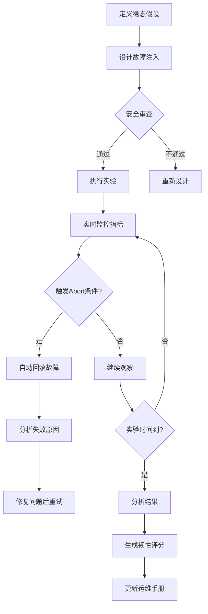
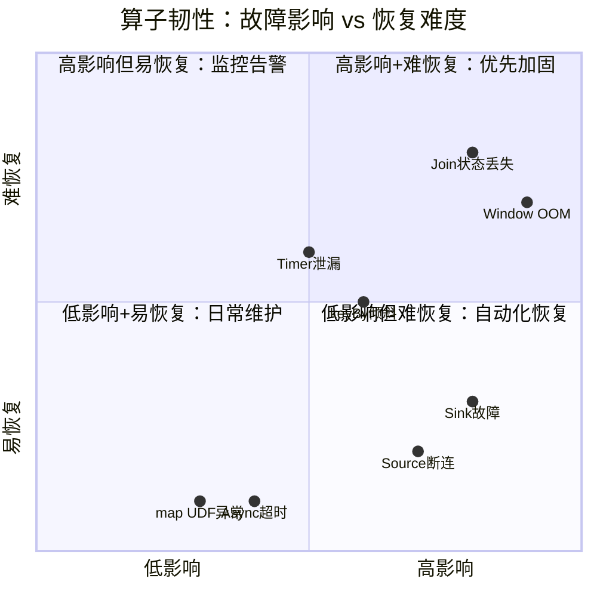

# 算子混沌工程与韧性验证

> **所属阶段**: Knowledge/07-best-practices | **前置依赖**: [operator-testing-and-verification-guide.md](operator-testing-and-verification-guide.md), [operator-debugging-and-troubleshooting-handbook.md](operator-debugging-and-troubleshooting-handbook.md) | **形式化等级**: L3
> **文档定位**: 通过混沌工程方法验证流处理算子在故障场景下的韧性与恢复能力
> **版本**: 2026.04

---

## 目录

- [算子混沌工程与韧性验证](#算子混沌工程与韧性验证)
  - [目录](#目录)
  - [1. 概念定义 (Definitions)](#1-概念定义-definitions)
    - [Def-CHA-01-01: 算子韧性（Operator Resilience）](#def-cha-01-01-算子韧性operator-resilience)
    - [Def-CHA-01-02: 混沌工程（Chaos Engineering）](#def-cha-01-02-混沌工程chaos-engineering)
    - [Def-CHA-01-03: 算子级故障注入（Operator-level Fault Injection）](#def-cha-01-03-算子级故障注入operator-level-fault-injection)
    - [Def-CHA-01-04: 稳态假设（Steady State Hypothesis）](#def-cha-01-04-稳态假设steady-state-hypothesis)
    - [Def-CHA-01-05: 故障爆炸半径（Blast Radius）](#def-cha-01-05-故障爆炸半径blast-radius)
  - [2. 属性推导 (Properties)](#2-属性推导-properties)
    - [Lemma-CHA-01-01: Checkpoint频率与恢复时间的反比关系](#lemma-cha-01-01-checkpoint频率与恢复时间的反比关系)
    - [Lemma-CHA-01-02: 无状态算子的快速恢复性](#lemma-cha-01-02-无状态算子的快速恢复性)
    - [Prop-CHA-01-01: 部分失败优于全局失败](#prop-cha-01-01-部分失败优于全局失败)
    - [Prop-CHA-01-02: 混沌实验的安全边界](#prop-cha-01-02-混沌实验的安全边界)
  - [3. 关系建立 (Relations)](#3-关系建立-relations)
    - [3.1 算子类型与韧性策略映射](#31-算子类型与韧性策略映射)
    - [3.2 混沌工程工具链](#32-混沌工程工具链)
    - [3.3 韧性测试与常规测试的关系](#33-韧性测试与常规测试的关系)
  - [4. 论证过程 (Argumentation)](#4-论证过程-argumentation)
    - [4.1 为什么流处理特别需要混沌工程](#41-为什么流处理特别需要混沌工程)
    - [4.2 生产环境混沌实验的安全准则](#42-生产环境混沌实验的安全准则)
    - [4.3 常见反模式：盲目注入](#43-常见反模式盲目注入)
  - [5. 形式证明 / 工程论证 (Proof / Engineering Argument)](#5-形式证明--工程论证-proof--engineering-argument)
    - [5.1 算子级故障注入框架设计](#51-算子级故障注入框架设计)
    - [5.2 韧性评分模型](#52-韧性评分模型)
    - [5.3 混沌实验报告模板](#53-混沌实验报告模板)
  - [6. 实例验证 (Examples)](#6-实例验证-examples)
    - [6.1 实战：Window算子OOM故障注入与恢复](#61-实战window算子oom故障注入与恢复)
    - [6.2 实战：Kafka Source断连恢复验证](#62-实战kafka-source断连恢复验证)
  - [7. 可视化 (Visualizations)](#7-可视化-visualizations)
    - [混沌工程实验流程](#混沌工程实验流程)
    - [韧性评分雷达图](#韧性评分雷达图)
  - [8. 引用参考 (References)](#8-引用参考-references)

---

## 1. 概念定义 (Definitions)

### Def-CHA-01-01: 算子韧性（Operator Resilience）

算子韧性是算子在面临故障时维持正确语义和可接受性能水平的能力：

$$\text{Resilience}(Op) = \frac{\text{MTBF}}{\text{MTBF} + \text{MTTR}} \times \text{Correctness}_{fault}$$

其中 MTBF 为平均故障间隔时间，MTTR 为平均恢复时间，$\text{Correctness}_{fault}$ 为故障期间结果正确性评分（0-1）。

### Def-CHA-01-02: 混沌工程（Chaos Engineering）

混沌工程是通过在生产环境或准生产环境中注入可控故障，验证系统韧性的实践方法：

$$\text{Chaos Experiment} = (\text{Steady State}, \text{Fault Injection}, \text{Observation}, \text{Rollback})$$

### Def-CHA-01-03: 算子级故障注入（Operator-level Fault Injection）

算子级故障注入是针对特定算子或算子类型的定向故障模拟：

| 故障类型 | 注入目标 | 模拟场景 |
|---------|---------|---------|
| **延迟注入** | AsyncFunction | 外部服务响应变慢 |
| **异常注入** | map/ProcessFunction | UDF代码异常 |
| **背压注入** | Sink算子 | 下游消费变慢 |
| **网络分区** | 跨TaskManager通信 | 节点间网络中断 |
| **节点故障** | TaskManager Pod | K8s节点宕机 |
| **内存压力** | Window/Aggregate算子 | 状态过大导致GC |

### Def-CHA-01-04: 稳态假设（Steady State Hypothesis）

稳态假设是混沌实验前对系统正常行为的可测量定义：

$$\text{SteadyState} = \bigwedge_{i}(\text{Metric}_i \in [\text{Lower}_i, \text{Upper}_i])$$

例如：

- 吞吐 > 10000 records/s
- 端到端延迟 p99 < 500ms
- 错误率 < 0.1%
- Checkpoint成功率 = 100%

### Def-CHA-01-05: 故障爆炸半径（Blast Radius）

故障爆炸半径是故障注入影响的系统范围：

$$\text{BlastRadius} = \frac{\text{AffectedOperators}}{\text{TotalOperators}} \times \frac{\text{AffectedTraffic}}{\text{TotalTraffic}}$$

混沌工程原则：从最小爆炸半径开始，逐步扩大。

---

## 2. 属性推导 (Properties)

### Lemma-CHA-01-01: Checkpoint频率与恢复时间的反比关系

检查点间隔 $\Delta_{chkpt}$ 与恢复时间 $\mathcal{T}_{recover}$ 满足：

$$\mathcal{T}_{recover} = \mathcal{T}_{restart} + \alpha \cdot \Delta_{chkpt}$$

其中 $\mathcal{T}_{restart}$ 为作业重启固定开销（约 10-30 秒），$\alpha$ 为重放数据比例系数。

**工程推论**: 更频繁的checkpoint减少恢复时需重放的数据量，但增加运行时开销。

### Lemma-CHA-01-02: 无状态算子的快速恢复性

无状态算子（map/filter/flatMap）的恢复时间仅取决于重启开销：

$$\mathcal{T}_{recover}^{stateless} = \mathcal{T}_{restart}$$

而有状态算子的恢复时间还包括状态加载：

$$\mathcal{T}_{recover}^{stateful} = \mathcal{T}_{restart} + \frac{S}{B_{load}}$$

其中 $S$ 为状态大小，$B_{load}$ 为状态加载带宽。

### Prop-CHA-01-01: 部分失败优于全局失败

在分布式流处理中，局部故障隔离优于全局重启：

$$\text{Availability}_{partial} > \text{Availability}_{global}$$

**证明概要**: 设系统有 $N$ 个并行Task，单个Task故障概率为 $p$。全局重启策略下，任何Task故障导致全系统不可用；局部隔离策略下，仅故障Task短暂不可用，其他Task继续处理。∎

### Prop-CHA-01-02: 混沌实验的安全边界

混沌实验的安全边界要求：

$$\text{BlastRadius} \leq \text{AbortCondition} \land \text{Metric}_{critical} > \text{SafetyThreshold}$$

若实验过程中关键指标跌破安全阈值，必须立即自动回滚故障注入。

---

## 3. 关系建立 (Relations)

### 3.1 算子类型与韧性策略映射

| 算子类型 | 主要故障模式 | 韧性策略 | 混沌验证实验 |
|---------|------------|---------|-----------|
| **Source** | Kafka Lag、连接断开 | 自动重连、偏移量持久化 | Kill Kafka broker |
| **map/filter** | UDF异常 | Try-catch + Side Output | 注入NPE异常 |
| **keyBy** | 数据倾斜 | 加盐、两阶段聚合 | 制造热点Key |
| **window/aggregate** | 状态过大OOM | State TTL、增量聚合 | 内存压力注入 |
| **join** | 关联率低下 | Side Output未匹配数据 | 延迟注入到一路流 |
| **AsyncFunction** | 外部服务超时 | Timeout + 降级 + 熔断 | 网络延迟注入 |
| **ProcessFunction** | Timer泄漏 | Timer清理 + 状态TTL | 高频率Timer注册 |
| **Sink** | 写入失败 | 幂等写入 + 重试 + 死信队列 | Kill下游存储 |

### 3.2 混沌工程工具链

```
混沌实验编排
├── Chaos Mesh（K8s原生）
│   ├── Pod故障（杀死、网络分区）
│   ├── 网络故障（延迟、丢包、带宽限制）
│   ├── 压力故障（CPU、内存、IO）
│   └── 时间故障（时钟漂移）
├── Gremlin（SaaS平台）
│   └── 攻击库（Latency、Blackhole、Packet Loss）
├── Toxiproxy（网络代理）
│   └── 服务间通信故障注入
└── 自定义工具
    ├── Flink UDF异常注入
    └── 数据倾斜生成器
```

### 3.3 韧性测试与常规测试的关系

```
测试金字塔
├── 单元测试（L1）
│   └── 单个算子的纯逻辑验证
├── 集成测试（L2）
│   └── 算子组合的功能验证
├── 端到端测试（L3）
│   └── 完整Pipeline的功能验证
└── 混沌测试（L4）
    └── 故障场景下的韧性验证
```

---

## 4. 论证过程 (Argumentation)

### 4.1 为什么流处理特别需要混沌工程

流处理系统的特殊性：

1. **持续运行**: 无明确的"测试窗口"，故障可能随时发生
2. **状态累积**: 长时间运行的状态可能在特定条件下触发bug
3. **分布式本质**: 网络分区、节点故障是常态而非异常
4. **Exactly-Once的脆弱性**: 故障恢复时容易引入重复或丢失

### 4.2 生产环境混沌实验的安全准则

**准则1: 从小规模开始**

- 先在开发/测试环境验证实验设计
- 首次生产实验选择非高峰时段
- 爆炸半径从单Task开始，逐步扩大

**准则2: 自动化Abort条件**

```yaml
abort_conditions:
  - metric: error_rate
    threshold: "> 5%"
    duration: "1m"
  - metric: p99_latency
    threshold: "> 2s"
    duration: "30s"
  - metric: checkpoint_success_rate
    threshold: "< 90%"
    duration: "2m"
```

**准则3: 快速回滚能力**

- 所有故障注入必须可逆
- 准备一键回滚脚本
- 团队值班响应时间 < 5分钟

### 4.3 常见反模式：盲目注入

**反模式1**: 无稳态假设直接注入故障

- 后果：无法判断系统是否"正常"恢复

**反模式2**: 无Abort条件持续注入

- 后果：导致生产事故

**反模式3**: 仅在测试环境做混沌实验

- 后果：测试环境无法模拟生产的真实负载和复杂性

---

## 5. 形式证明 / 工程论证 (Proof / Engineering Argument)

### 5.1 算子级故障注入框架设计

**框架目标**: 在不修改算子代码的前提下，通过配置注入故障。

**实现方案**:

```java
// 故障注入装饰器
public class FaultInjectionWrapper<T, R> extends RichMapFunction<T, R> {
    private final RichMapFunction<T, R> inner;
    private final FaultConfig config;
    private transient Random random;

    public FaultInjectionWrapper(RichMapFunction<T, R> inner, FaultConfig config) {
        this.inner = inner;
        this.config = config;
    }

    @Override
    public R map(T value) throws Exception {
        // 延迟注入
        if (config.getLatencyInjection() > 0 && random.nextDouble() < config.getLatencyProbability()) {
            Thread.sleep(config.getLatencyInjection());
        }

        // 异常注入
        if (config.getExceptionProbability() > 0 && random.nextDouble() < config.getExceptionProbability()) {
            throw new RuntimeException("Injected fault: " + config.getExceptionType());
        }

        return inner.map(value);
    }
}
```

**使用方式**:

```java
stream.map(new FaultInjectionWrapper<>(
    new RealMapFunction(),
    FaultConfig.builder()
        .latencyInjection(1000)  // 注入1秒延迟
        .latencyProbability(0.1) // 10%概率
        .exceptionProbability(0.01) // 1%概率抛异常
        .build()
));
```

### 5.2 韧性评分模型

**评分维度**:

| 维度 | 权重 | 测量方法 |
|------|------|---------|
| **可用性** | 30% | MTBF / (MTBF + MTTR) |
| **正确性** | 30% | 故障期间结果准确率 |
| **性能** | 20% | 故障期间延迟变化率 |
| **恢复速度** | 20% | 从故障到稳态的时间 |

**综合评分**:
$$\text{ResilienceScore} = \sum_{i} w_i \cdot \text{Score}_i$$

**等级**:

- 90-100: 优秀（生产级）
- 70-89: 良好（需优化）
- 50-69: 及格（有风险）
- <50: 不合格（禁止上线）

### 5.3 混沌实验报告模板

```markdown
# 混沌实验报告: [实验名称]

## 实验设计
- **目标算子**: [算子名称]
- **故障类型**: [延迟/异常/网络/节点]
- **爆炸半径**: [单Task/单TM/全集群]
- **持续时间**: [X分钟]

## 稳态假设
- 吞吐: [X records/s]
- 延迟p99: [X ms]
- 错误率: [X%]

## 实验执行
- **注入时间**: [timestamp]
- **观察现象**: [描述]
- **指标变化**: [数据]

## 结果分析
- **韧性评分**: [X/100]
- **发现的问题**: [描述]
- **修复建议**: [描述]

## 回滚验证
- **回滚时间**: [timestamp]
- **恢复时间**: [X秒]
- **稳态恢复**: [是/否]
```

---

## 6. 实例验证 (Examples)

### 6.1 实战：Window算子OOM故障注入与恢复

**实验设计**:

- 目标：TumblingWindow aggregate算子
- 故障：内存压力（通过K8s限制容器内存）
- 稳态：吞吐5000 records/s，Checkpoint 10秒

**执行过程**:

```bash
# 使用Chaos Mesh注入内存压力
kubectl apply -f - <<EOF
apiVersion: chaos-mesh.org/v1alpha1
kind: StressChaos
metadata:
  name: memory-stress
spec:
  mode: one
  selector:
    labelSelectors:
      app: flink-taskmanager
  stressors:
    memory:
      workers: 4
      size: "80%"
  duration: "5m"
EOF
```

**观察结果**:

- 注入后30秒：GC时间占比从3%升至45%
- 注入后2分钟：Checkpoint时间从10秒增至90秒
- 注入后4分钟：TaskManager OOMKilled
- 恢复时间：45秒（从上一个checkpoint恢复）

**修复措施**:

- 启用State TTL（窗口状态保留时间从无限改为1小时）
- 增大TaskManager内存（4GB → 8GB）
- 优化聚合逻辑（减少中间状态）

### 6.2 实战：Kafka Source断连恢复验证

**实验设计**:

- 目标：Kafka Source算子
- 故障：Kafka broker网络隔离
- 稳态：消费延迟 < 1000 records

**执行过程**:

```bash
# 使用Chaos Mesh注入网络分区
kubectl apply -f - <<EOF
apiVersion: chaos-mesh.org/v1alpha1
kind: NetworkChaos
metadata:
  name: kafka-partition
spec:
  action: partition
  mode: one
  selector:
    labelSelectors:
      app: kafka-broker
  direction: both
  target:
    selector:
      labelSelectors:
        app: flink-taskmanager
    mode: all
  duration: "3m"
EOF
```

**观察结果**:

- 网络分区后：Source消费立即停止，records-lag开始增长
- 分区解除后：Source自动重连，追赶消费（catch-up消费速率达正常3倍）
- 数据一致性：无丢失，无重复（Exactly-Once保证）

---

## 7. 可视化 (Visualizations)

### 混沌工程实验流程



### 韧性评分雷达图



---

## 8. 引用参考 (References)


---

*关联文档*: [operator-testing-and-verification-guide.md](operator-testing-and-verification-guide.md) | [operator-debugging-and-troubleshooting-handbook.md](operator-debugging-and-troubleshooting-handbook.md) | [operator-observability-and-intelligent-ops.md](operator-observability-and-intelligent-ops.md)
