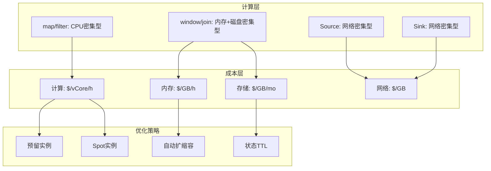
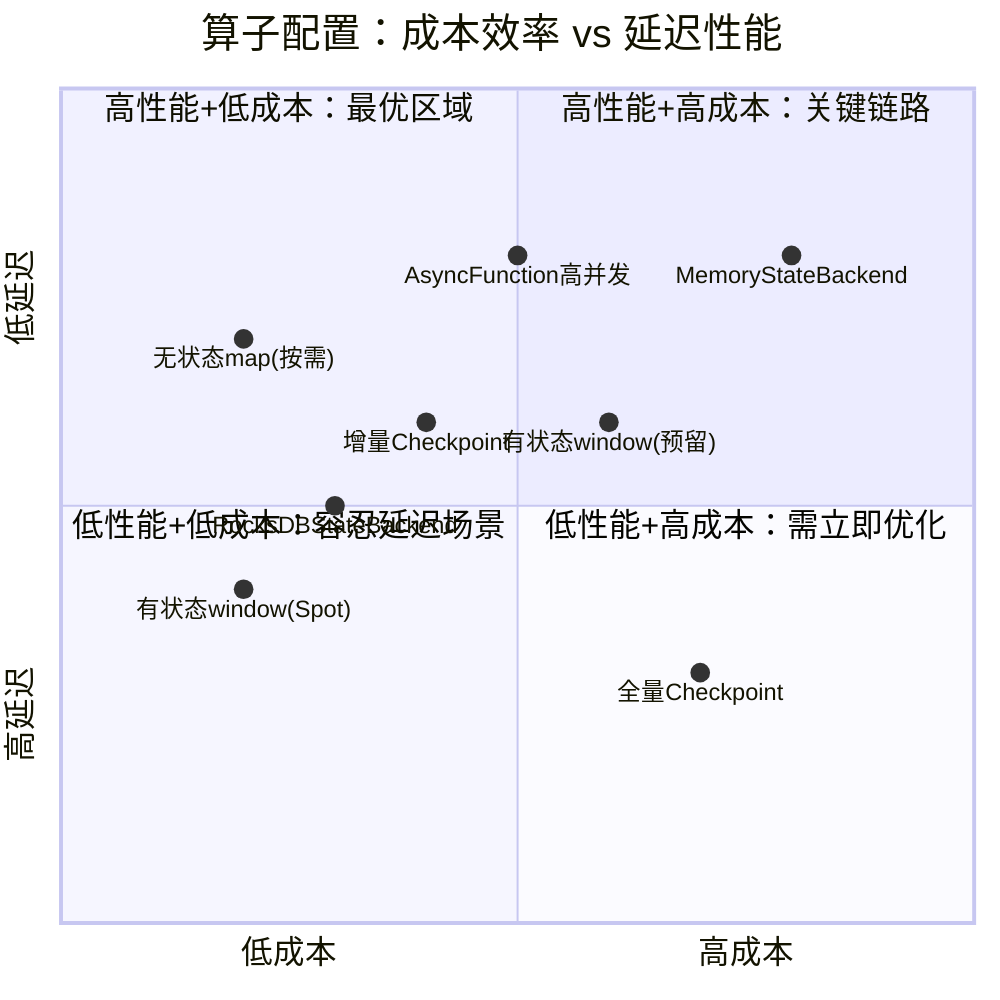
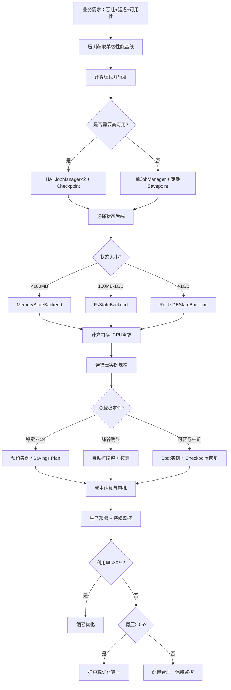

# 算子成本模型与云资源估算

> **所属阶段**: Knowledge/07-best-practices | **前置依赖**: [operator-performance-benchmark-tuning.md](operator-performance-benchmark-tuning.md), [01.06-single-input-operators.md](../01-concept-atlas/operator-deep-dive/01.06-single-input-operators.md) | **形式化等级**: L2-L3
> **文档定位**: 流处理算子的资源消耗模型、云成本估算方法与容量规划指南
> **版本**: 2026.04

---

## 目录

- [算子成本模型与云资源估算](#算子成本模型与云资源估算)
  - [目录](#目录)
  - [1. 概念定义 (Definitions)](#1-概念定义-definitions)
    - [Def-CST-01-01: 算子资源消耗向量 (Operator Resource Vector)](#def-cst-01-01-算子资源消耗向量-operator-resource-vector)
    - [Def-CST-01-02: 算子成本函数 (Operator Cost Function)](#def-cst-01-02-算子成本函数-operator-cost-function)
    - [Def-CST-01-03: 状态存储成本密度 (State Storage Cost Density)](#def-cst-01-03-状态存储成本密度-state-storage-cost-density)
    - [Def-CST-01-04: 资源利用效率 (Resource Utilization Efficiency)](#def-cst-01-04-资源利用效率-resource-utilization-efficiency)
    - [Def-CST-01-05: 弹性伸缩粒度 (Elastic Scaling Granularity)](#def-cst-01-05-弹性伸缩粒度-elastic-scaling-granularity)
  - [2. 属性推导 (Properties)](#2-属性推导-properties)
    - [Lemma-CST-01-01: 算子成本随状态大小超线性增长](#lemma-cst-01-01-算子成本随状态大小超线性增长)
    - [Lemma-CST-01-02: 无状态算子成本与吞吐的线性关系](#lemma-cst-01-02-无状态算子成本与吞吐的线性关系)
    - [Prop-CST-01-01: 数据倾斜导致资源利用率悖论](#prop-cst-01-01-数据倾斜导致资源利用率悖论)
    - [Prop-CST-01-02: 云厂商预留实例 vs 按需实例的成本差异](#prop-cst-01-02-云厂商预留实例-vs-按需实例的成本差异)
  - [3. 关系建立 (Relations)](#3-关系建立-relations)
    - [3.1 算子类型与资源特征映射](#31-算子类型与资源特征映射)
    - [3.2 云厂商定价模型对照](#32-云厂商定价模型对照)
    - [3.3 容量规划与成本优化的关系](#33-容量规划与成本优化的关系)
  - [4. 论证过程 (Argumentation)](#4-论证过程-argumentation)
    - [4.1 为什么流处理成本难以预估](#41-为什么流处理成本难以预估)
    - [4.2 Spot/Preemptible实例的适用性分析](#42-spotpreemptible实例的适用性分析)
    - [4.3 内存与磁盘的权衡](#43-内存与磁盘的权衡)
  - [5. 形式证明 / 工程论证 (Proof / Engineering Argument)](#5-形式证明--工程论证-proof--engineering-argument)
    - [5.1 算子资源估算公式](#51-算子资源估算公式)
    - [5.2 容量规划计算器模板](#52-容量规划计算器模板)
    - [5.3 成本优化策略矩阵](#53-成本优化策略矩阵)
  - [6. 实例验证 (Examples)](#6-实例验证-examples)
    - [6.1 实战：电商实时看板成本估算](#61-实战电商实时看板成本估算)
    - [6.2 实战：从压测数据推导生产配置](#62-实战从压测数据推导生产配置)
  - [7. 可视化 (Visualizations)](#7-可视化-visualizations)
    - [算子资源消耗层次图](#算子资源消耗层次图)
    - [成本-延迟权衡象限图](#成本-延迟权衡象限图)
    - [容量规划决策流程](#容量规划决策流程)
  - [8. 引用参考 (References)](#8-引用参考-references)

---

## 1. 概念定义 (Definitions)

### Def-CST-01-01: 算子资源消耗向量 (Operator Resource Vector)

算子 $Op_i$ 的资源消耗用四维向量表示：

$$\vec{R}_i = \langle CPU_i, MEM_i, NET_i, DISK_i \rangle$$

其中：

- $CPU_i$: 单核利用率（%）或所需vCore数
- $MEM_i$: 堆内存 + 托管内存 + 网络缓冲区（GB）
- $NET_i$: 输入/输出网络带宽（MB/s）
- $DISK_i$: 状态后端磁盘I/O（IOPS或MB/s）

### Def-CST-01-02: 算子成本函数 (Operator Cost Function)

在公有云环境中，算子 $Op_i$ 的时均成本为：

$$\mathcal{C}(Op_i, t) = \alpha \cdot CPU_i + \beta \cdot MEM_i + \gamma \cdot NET_i + \delta \cdot DISK_i + \epsilon \cdot \mathcal{L}_i$$

其中 $\alpha, \beta, \gamma, \delta$ 为云厂商定价系数（$/vCore/h, $/GB/h等），$\epsilon$ 为延迟惩罚系数（SLA违约成本），$\mathcal{L}_i$ 为算子延迟。

### Def-CST-01-03: 状态存储成本密度 (State Storage Cost Density)

单位状态量的存储成本：

$$\rho_{state} = \frac{\text{月度存储费用}}{\text{平均状态大小}} \quad [\$/GB/月]$$

对于RocksDB on SSD：$\rho_{state} \approx 0.08-0.15$ $/GB/月；对于增量Checkpoint on OSS/S3：$\rho_{state} \approx 0.012-0.023$ $/GB/月。

### Def-CST-01-04: 资源利用效率 (Resource Utilization Efficiency)

资源利用效率定义为实际工作负载与所分配资源峰值的比例：

$$\eta = \frac{\int_0^T \min(\vec{R}_{\text{actual}}(t), \vec{R}_{\text{allocated}}) \, dt}{\int_0^T \vec{R}_{\text{allocated}} \, dt}$$

若 $\eta < 0.3$，则资源配置过度；若 $\eta > 0.8$ 且持续存在背压，则资源配置不足。

### Def-CST-01-05: 弹性伸缩粒度 (Elastic Scaling Granularity)

弹性伸缩粒度 $\Delta P$ 定义为单次扩缩容的最小并行度调整单位。Flink on Kubernetes的粒度为单个TaskManager Pod（通常承载1-4个Slot）：

$$\Delta P = \text{slotsPerTM} \times \Delta \text{Pods}$$

---

## 2. 属性推导 (Properties)

### Lemma-CST-01-01: 算子成本随状态大小超线性增长

对于有状态算子（window/aggregate/join），成本与状态大小满足：

$$\mathcal{C}(Op_{stateful}) \in O(S \cdot \log S)$$

**证明概要**:

- 状态存储：线性 $O(S)$
- Checkpoint：增量快照需遍历状态树，$O(S)$
- Compaction：RocksDB LSM-Tree的写放大为 $O(\log S)$
- 恢复：读取并反序列化状态，$O(S)$

综合得超线性增长。∎

### Lemma-CST-01-02: 无状态算子成本与吞吐的线性关系

对于无状态算子（map/filter/flatMap），在CPU未饱和时：

$$\mathcal{C}(Op_{stateless}) \approx k \cdot \lambda$$

其中 $\lambda$ 为输入吞吐（records/s），$k$ 为单位记录处理成本。

**推论**: 无状态算子的成本预测最准确，可通过小规模压测线性外推。

### Prop-CST-01-01: 数据倾斜导致资源利用率悖论

在数据倾斜场景下，整体资源利用率 $\eta$ 与倾斜指数 $\text{SkewIndex}$ 满足：

$$\eta \approx \frac{1}{\text{SkewIndex}} + (1 - \frac{1}{K}) \cdot \eta_{idle}$$

其中 $\eta_{idle}$ 为空闲Task的资源占比，$K$ 为总并行度。

**工程意义**: SkewIndex=10时，即使整体利用率显示30%，热点Task可能已100%满载。不能仅凭平均利用率判断扩容需求。

### Prop-CST-01-02: 云厂商预留实例 vs 按需实例的成本差异

对于7×24运行的流处理作业，预留实例（Reserved Instances / Savings Plans）可降低成本：

$$\text{SavingsRatio} = 1 - \frac{\text{Cost}_{\text{reserved}}}{\text{Cost}_{\text{ondemand}}} \in [0.3, 0.6]$$

**约束**: 预留实例要求1-3年承诺期，不适用于弹性伸缩频繁波动的作业。

---

## 3. 关系建立 (Relations)

### 3.1 算子类型与资源特征映射

| 算子类型 | CPU特征 | 内存特征 | 网络特征 | 磁盘特征 | 成本敏感度 |
|---------|---------|---------|---------|---------|-----------|
| **Source(Kafka)** | 低 | 低 | 高（消费带宽） | 低 | 中 |
| **map/filter** | 中 | 极低 | 中 | 无 | 低 |
| **flatMap** | 中-高 | 低 | 高（输出膨胀） | 无 | 低-中 |
| **keyBy** | 低 | 低 | 高（shuffle） | 无 | 中 |
| **window/aggregate** | 中 | **极高**（状态） | 中 | 高（RocksDB） | **高** |
| **join** | 高 | **极高**（双路状态） | 高 | 高 | **高** |
| **ProcessFunction** | 可变 | 可变 | 可变 | 可变 | 可变 |
| **AsyncFunction** | 低 | 低 | 极高（并发IO） | 无 | 中 |
| **Sink** | 低-中 | 低 | 高（写出带宽） | 无 | 中 |

### 3.2 云厂商定价模型对照

| 云厂商 | 计算定价 | 存储定价 | 网络定价 | 预留折扣 |
|--------|---------|---------|---------|---------|
| **AWS** | $0.05-0.20/vCore/h (EKS) | $0.10/GB/mo (EBS gp3) | $0.09/GB (出站) | 最高55% |
| **阿里云** | ¥0.30-1.20/vCore/h | ¥0.50/GB/mo (ESSD) | ¥0.80/GB | 最高50% |
| **GCP** | $0.05-0.15/vCore/h (GKE) | $0.12/GB/mo (PD-SSD) | $0.12/GB | 最高57% |
| **Azure** | $0.04-0.18/vCore/h (AKS) | $0.15/GB/mo (Managed Disk) | $0.10/GB | 最高55% |

### 3.3 容量规划与成本优化的关系

```
容量规划流程
├── 1. 吞吐预估（QPS × 记录大小 × 峰值系数）
├── 2. 算子级资源建模（基于Def-CST-01-01向量）
├── 3. 云资源选型（VM规格匹配）
├── 4. 成本估算（预留 vs 按需 vs Spot）
├── 5. 压测验证（验证模型准确性）
└── 6. 持续优化（基于实际利用率调整）
```

---

## 4. 论证过程 (Argumentation)

### 4.1 为什么流处理成本难以预估

与批处理的"按需启动、按次计费"不同，流处理是**持续运行**的：

- **固定成本**: 即使凌晨流量低谷，作业仍在运行，资源持续计费
- **状态累积**: 状态大小随时间增长，存储成本单调递增（除非TTL有效）
- **峰值冗余**: 为应对流量峰值预留的资源在低峰期闲置
- **Checkpoint开销**: 定期快照消耗CPU和I/O，与业务流量无关

**案例**: 某电商实时推荐系统，日均QPS 10万，大促峰值QPS 200万。

- 按峰值配置：200万QPS需要80 vCore，月成本 $2,880
- 实际平均利用率：15%（大部分时间10万QPS）
- 优化后（自动扩缩容）：月均40 vCore，月成本 $1,440（节省50%）

### 4.2 Spot/Preemptible实例的适用性分析

Spot实例价格通常为按需的20-40%，但可能被云厂商随时回收。

**适用场景**:

- ✅ 无状态算子（map/filter）：状态丢失可恢复
- ✅ 可容忍分钟级中断的作业（从Savepoint恢复约30-60秒）
- ✅ 多可用区部署的冗余Task

**不适用场景**:

- ❌ 有状态算子的主副本（状态迁移成本高）
- ❌ JobManager（单点故障不可接受）
- ❌ 严格SLA（<30秒RTO）的作业

### 4.3 内存与磁盘的权衡

Flink提供两种状态后端：

| 维度 | MemoryStateBackend | FsStateBackend | RocksDBStateBackend |
|------|-------------------|----------------|---------------------|
| 状态位置 | JVM Heap | JVM Heap + 磁盘 | 原生内存 + 磁盘 |
| 状态上限 | 几GB（受堆限制） | 几GB | TB级 |
| 序列化开销 | 低（对象引用） | 低 | 高（Kryo/Avro） |
| Checkpoint速度 | 快 | 中 | 慢（增量优化后中等） |
| 单位成本 | 高（内存贵） | 高 | 低（磁盘便宜） |

**决策**:

- 状态 < 100MB: MemoryStateBackend（简单、快）
- 状态 100MB-1GB: FsStateBackend
- 状态 > 1GB: RocksDBStateBackend（唯一选择）

---

## 5. 形式证明 / 工程论证 (Proof / Engineering Argument)

### 5.1 算子资源估算公式

**输入**: 业务吞吐 $\lambda$ (records/s)，记录平均大小 $s$ (bytes)，Pipeline拓扑。

**步骤1: 计算每算子输入输出量**

$$\lambda_i^{in} = \lambda_{i-1}^{out} \cdot (1 - r_{filter,i})$$

其中 $r_{filter,i}$ 为第 $i$ 个filter算子的丢弃率。

$$\lambda_i^{out} = \lambda_i^{in} \cdot c_{flatMap,i}$$

其中 $c_{flatMap,i}$ 为flatMap的平均膨胀系数。

**步骤2: 计算CPU需求**

$$CPU_i = \frac{\lambda_i^{in} \cdot \tau_i}{1000 \cdot U_{target}} \quad [\text{vCore}]$$

其中 $\tau_i$ 为单记录处理时间（ms，来自基准测试），$U_{target}$ 为目标CPU利用率（通常0.6-0.7）。

**步骤3: 计算内存需求**

$$MEM_i = MEM_{fixed} + MEM_{network} + MEM_{managed}$$

其中：

- $MEM_{fixed}$: Flink框架固定开销（约 1.5-2GB/TaskManager）
- $MEM_{network}$: 网络缓冲区 = $\min(\text{slots} \times 64MB, 1GB)$
- $MEM_{managed}$: 托管内存（RocksDB cache）= 建议 256MB/Slot

**步骤4: 计算状态存储成本**

$$S_i = \lambda_i^{in} \cdot s_{state} \cdot TTL_{effective} \quad [GB]$$

其中 $s_{state}$ 为单记录状态大小，$TTL_{effective}$ 为有效保留时间。

$$\text{Cost}_{state} = S_i \cdot \rho_{state}$$

**步骤5: 总成本**

$$\text{TotalCost} = \sum_i (CPU_i \cdot \alpha + MEM_i \cdot \beta) \cdot 730 + \sum_i S_i \cdot \rho_{state}$$

（730 = 月均小时数）

### 5.2 容量规划计算器模板

```yaml
# streaming-resource-calculator.yaml
pipeline:
  source:
    type: kafka
    throughput_rps: 100000
    record_size_bytes: 512

  operators:
    - name: filter
      type: filter
      drop_rate: 0.3
      processing_time_ms: 0.05

    - name: enrich
      type: asyncWait
      processing_time_ms: 10
      capacity: 50

    - name: aggregate
      type: window_aggregate
      window_minutes: 5
      state_per_key_bytes: 1024
      unique_keys_estimate: 1000000

    - name: sink
      type: kafka_sink
      processing_time_ms: 0.5

pricing:
  cloud_provider: aws
  region: us-east-1
  vcore_hourly: 0.05
  memory_gb_hourly: 0.015
  storage_gb_monthly: 0.10
  network_egress_per_gb: 0.09

constraints:
  target_cpu_utilization: 0.65
  target_memory_utilization: 0.70
  sla_latency_p99_ms: 500
  sla_availability: 0.999
```

### 5.3 成本优化策略矩阵

| 策略 | 适用场景 | 预期节省 | 风险 |
|------|---------|---------|------|
| **预留实例** | 7×24稳定负载 | 30-55% | 长期锁定 |
| **Spot实例** | 无状态Task、可容忍中断 | 60-80% | 中断恢复延迟 |
| **自动扩缩容** | 明显峰谷模式 | 20-40% | 冷启动延迟 |
| **状态TTL优化** | 状态持续增长 | 10-30% | 业务数据丢失 |
| **序列化优化** | CPU高、序列化占比>30% | 10-20% | 代码复杂度 |
| **就近部署** | 跨AZ/Region流量大 | 5-15%（网络费） | 容灾降低 |

---

## 6. 实例验证 (Examples)

### 6.1 实战：电商实时看板成本估算

**业务需求**:

- 实时统计各品类GMV、UV、订单数
- 吞吐：50,000 orders/s
- 窗口：1分钟Tumbling + 5分钟Sliding
- 延迟SLA: p99 < 300ms

**资源估算**:

| 组件 | 并行度 | vCore | 内存(GB) | 状态(GB) | 月成本(USD) |
|------|--------|-------|---------|---------|------------|
| Source(Kafka) | 16 | 4 | 8 | 0 | $140 |
| map+filter | 16 | 4 | 8 | 0 | $140 |
| keyBy+window(1min) | 32 | 8 | 32 | 2.5 | $730 |
| aggregate(5min sliding) | 32 | 8 | 48 | 15 | $1,100 |
| Sink | 8 | 2 | 4 | 0 | $70 |
| **总计** | | **26** | **100** | **17.5** | **~$2,180** |

**优化后**（启用State TTL、自动扩缩容、预留实例）：

- 月均vCore降至18，节省30%
- 状态通过TTL控制在5GB，节省存储60%
- 预留实例额外节省40%
- **优化后月成本：~$920**

### 6.2 实战：从压测数据推导生产配置

**压测结果**（单vCore）：

- map: 500,000 records/s
- window aggregate (1min): 50,000 records/s
- join: 20,000 records/s

**生产需求**: 100,000 records/s，含map → keyBy → window → sink。

**推导**:

```
map并行度 = 100,000 / 500,000 = 0.2 → 最小1
window并行度 = 100,000 / 50,000 = 2
考虑峰值3倍和利用率0.7:
map并行度 = ceil(1 × 3 / 0.7) = 5
window并行度 = ceil(2 × 3 / 0.7) = 9
```

**推荐配置**: map×5, window×9, 预留20%余量应对突发。

---

## 7. 可视化 (Visualizations)

### 算子资源消耗层次图



### 成本-延迟权衡象限图



### 容量规划决策流程



---

## 8. 引用参考 (References)


---

*关联文档*: [operator-performance-benchmark-tuning.md](operator-performance-benchmark-tuning.md) | [operator-evolution-and-version-compatibility.md](operator-evolution-and-version-compatibility.md) | [01.10-process-and-async-operators.md](../01-concept-atlas/operator-deep-dive/01.10-process-and-async-operators.md)
