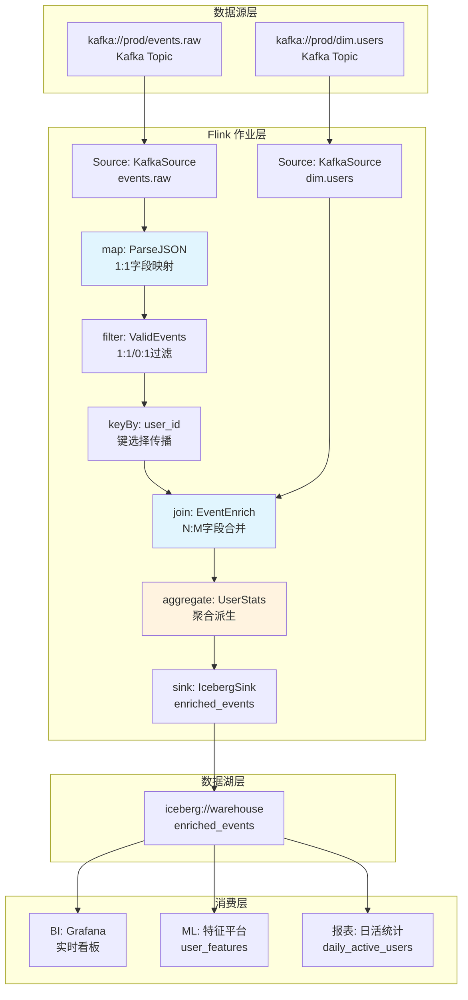

# 流处理算子数据血缘与影响分析

> 所属阶段: Knowledge | 前置依赖: [Flink DataStream API](../../Flink/03-api/README.md), [Flink SQL 解析原理](../../Flink/02-core/flink-state-management-complete-guide.md) | 形式化等级: L4
>
> **状态**: 生产就绪 | **风险等级**: 中 | **最后更新**: 2026-04

## 目录

- [流处理算子数据血缘与影响分析](#流处理算子数据血缘与影响分析)
  - [目录](#目录)
  - [1. 概念定义 (Definitions)](#1-概念定义-definitions)
  - [2. 属性推导 (Properties)](#2-属性推导-properties)
  - [3. 关系建立 (Relations)](#3-关系建立-relations)
    - [3.1 Flink 原生血缘与 OpenLineage 的映射关系](#31-flink-原生血缘与-openlineage-的映射关系)
    - [3.2 血缘采集层与元数据平台的集成矩阵](#32-血缘采集层与元数据平台的集成矩阵)
    - [3.3 血缘粒度与适用场景的对应关系](#33-血缘粒度与适用场景的对应关系)
  - [4. 论证过程 (Argumentation)](#4-论证过程-argumentation)
    - [4.1 为什么字段级血缘是流处理的刚需](#41-为什么字段级血缘是流处理的刚需)
    - [4.2 Calcite RelNode 遍历的边界与局限](#42-calcite-relnode-遍历的边界与局限)
    - [4.3 DataStream API 血缘的技术难点](#43-datastream-api-血缘的技术难点)
  - [5. 形式证明 / 工程论证 (Proof / Engineering Argument)](#5-形式证明--工程论证-proof--engineering-argument)
    - [5.1 算子层面的血缘传播规则](#51-算子层面的血缘传播规则)
    - [5.2 Flink SQL Parser 拦截：基于 Calcite RelNode 遍历](#52-flink-sql-parser-拦截基于-calcite-relnode-遍历)
    - [5.3 DataStream API 运行时血缘：基于 Transformation 拓扑遍历](#53-datastream-api-运行时血缘基于-transformation-拓扑遍历)
    - [5.4 OpenLineage 集成方案](#54-openlineage-集成方案)
  - [6. 实例验证 (Examples)](#6-实例验证-examples)
    - [6.1 Flink SQL 字段级血缘提取示例](#61-flink-sql-字段级血缘提取示例)
    - [6.2 DataStream API 血缘配置（FLIP-314）](#62-datastream-api-血缘配置flip-314)
    - [6.3 OpenLineage 事件手动发射示例](#63-openlineage-事件手动发射示例)
    - [6.4 上游 Schema 变更影响分析实例](#64-上游-schema-变更影响分析实例)
  - [7. 可视化 (Visualizations)](#7-可视化-visualizations)
    - [7.1 典型 Pipeline 血缘 DAG 图](#71-典型-pipeline-血缘-dag-图)
    - [7.2 字段级影响分析图](#72-字段级影响分析图)
    - [7.3 数据质量异常溯源路径图](#73-数据质量异常溯源路径图)
  - [8. 引用参考 (References)](#8-引用参考-references)

## 1. 概念定义 (Definitions)

数据血缘（Data Lineage）是数据治理的核心基础设施，它精确刻画数据在产生、加工、流转到最终消费过程中形成的有层次、可溯源的联系。在流处理系统中，血缘分析需要同时应对高吞吐、低延迟、持续运行等特性带来的挑战。

**Def-LIN-01-01（数据血缘）**
给定流处理系统 $\mathcal{S}$、数据集集合 $\mathcal{D}$ 和算子集合 $\mathcal{O}$，数据血缘是一个带标签的有向图 $G = (V, E, \lambda)$，其中：

- 顶点集 $V = \mathcal{D} \cup \mathcal{O}$，表示数据集与算子；
- 边集 $E \subseteq V \times V$，表示数据流向关系；
- 标签函数 $\lambda: E \to \mathcal{T}$，映射每条边到变换类型 $\mathcal{T} = \{\text{map}, \text{filter}, \text{join}, \text{aggregate}, \text{union}, \dots\}$。

数据血缘按粒度可分为三个层次：

**Def-LIN-01-02（表级血缘 / Table-Level Lineage）**
表级血缘是血缘图 $G$ 在数据集顶点上的投影 $G_{table} = (\mathcal{D}, E_{\mathcal{D}}, \lambda_{\mathcal{D}})$，其中 $E_{\mathcal{D}} \subseteq \mathcal{D} \times \mathcal{D}$ 表示数据集之间的直接依赖关系。表级血缘回答"哪个表流向哪个表"的问题，是最粗粒度的血缘表示。

**Def-LIN-01-03（字段级血缘 / Column-Level Lineage）**
设数据集 $d \in \mathcal{D}$ 的 schema 为 $\text{Schema}(d) = \{c_1, c_2, \dots, c_n\}$。字段级血缘是在表级血缘基础上对每条边 $e = (d_s, d_t) \in E_{\mathcal{D}}$ 的进一步分解，定义字段映射关系：
$$\text{ColMap}(e) \subseteq \text{Schema}(d_s) \times \text{Schema}(d_t) \times \mathcal{F}$$
其中 $\mathcal{F}$ 为变换表达式集合。字段级血缘精确追踪单个字段从源到目标的转换路径，是合规审计和根因分析的"黄金标准"。

**Def-LIN-01-04（算子级血缘 / Operator-Level Lineage）**
算子级血缘是血缘图在算子顶点上的展开表示 $G_{op} = (\mathcal{D} \cup \mathcal{O}, E_{op}, \lambda_{op})$，其中每个算子 $o \in \mathcal{O}$ 显式出现在图中，边 $E_{op}$ 描述数据集与算子之间的输入/输出关系。算子级血缘揭示了数据在 pipeline 内部的逐跳（hop-by-hop）处理过程。

**Def-LIN-01-05（端到端血缘 / End-to-End Lineage）**
端到端血缘是跨越多个系统边界的血缘图 $G_{e2e} = (V_{e2e}, E_{e2e})$，其中 $V_{e2e}$ 包含跨系统的数据集（如 Kafka Topic、Flink 作业、Iceberg 表、BI 报表），$E_{e2e}$ 通过统一的命名空间（namespace）和标识策略连接异构系统的血缘片段。OpenLineage 标准即为此类跨平台血缘提供互操作基础。

**Def-LIN-01-06（血缘传播函数）**
对于算子 $o \in \mathcal{O}$，定义其血缘传播函数 $\text{Prop}_o: 2^{\text{Schema}(in)} \to 2^{\text{Schema}(out)}$，描述输入字段集合到输出字段集合的映射规则。不同算子类型具有不同的传播函数语义。

## 2. 属性推导 (Properties)

**Lemma-LIN-01-01（血缘图的DAG性质）**
流处理 pipeline 的血缘图 $G$ 是有向无环图（DAG）。

*推导*：流处理系统中，数据从 Source 流向 Sink，每个算子产生新的 DataStream，不存在数据回流的语义（除非显式引入迭代，但迭代在 Flink 中通过特殊算子边界隔离）。因此 $G$ 中不存在从任意顶点出发并回到自身的有向路径，即 $G$ 为 DAG。$\square$

**Lemma-LIN-01-02（字段级血缘的传递闭包）**
若字段 $c_s$ 经算子链 $o_1 \to o_2 \to \dots \to o_k$ 传播至字段 $c_t$，则存在字段级血缘路径 $(c_s, c_1, f_1), (c_1, c_2, f_2), \dots, (c_{k-1}, c_t, f_k)$，其中 $c_i$ 为中间字段，$f_i$ 为局部变换。

*推导*：由算子级血缘定义，每个算子 $o_i$ 定义局部字段映射 $\text{ColMap}_i$。通过关系复合运算 $\text{ColMap}_1 \circ \text{ColMap}_2 \circ \dots \circ \text{ColMap}_k$ 可构造端到端映射。由于 $G$ 为 DAG（Lemma-LIN-01-01），复合运算有限且良定义。$\square$

**Lemma-LIN-01-03（filter算子的血缘单调性）**
设 filter 算子 $o_{filter}$ 的谓词为 $p: \text{Record} \to \{\text{true}, \text{false}\}$，则其输出 schema 是输入 schema 的子集（字段不变），输出记录集是输入记录集的子集：$\text{Schema}(out) = \text{Schema}(in)$ 且 $|out| \leq |in|$。

*推导*：filter 算子不修改记录结构，仅根据谓词 $p$ 决定是否保留记录。因此每个输出字段精确对应一个同名的输入字段，不存在字段增减或重命名。$\square$

**Prop-LIN-01-01（aggregate算子的血缘不可逆性）**
聚合算子 $o_{agg}$ 将多行输入聚合为单行或少行输出，其字段级血缘存在信息损失：给定输出字段 $c_{out}$，可通过血缘追溯到聚合键和聚合值字段；但给定输入字段 $c_{in}$，无法确定其精确影响哪些输出行（仅知影响包含该键的聚合组）。

*说明*：这种不可逆性使得聚合算子下游的数据质量异常难以精确溯源到单条输入记录，是流处理血缘分析的固有挑战。

## 3. 关系建立 (Relations)

### 3.1 Flink 原生血缘与 OpenLineage 的映射关系

Flink 社区通过 [FLIP-314](https://cwiki.apache.org/confluence/display/FLINK/FLIP-314%3A+Lineage+Graph+API) 引入了原生血缘 API，其核心接口与 OpenLineage 标准模型高度对齐：

| Flink 原生概念 | OpenLineage 概念 | 语义说明 |
|--------------|----------------|--------|
| `LineageVertex` | Job / Dataset | 血缘图中的节点，Source/Sink 实现 `LineageVertexProvider` |
| `LineageEdge` | Run 的输入/输出关系 | 连接 Source 与 Sink 的数据流向边 |
| `LineageDataset` | Dataset | 数据集元数据，包含命名空间、名称、schema facets |
| `LineageGraph` | Lineage Graph | 完整的血缘图，在 `JobCreatedEvent` 中暴露 |
| Facets（自定义） | Facets（标准+自定义） | 扩展元数据，如 schema、数据质量、ownership |

### 3.2 血缘采集层与元数据平台的集成矩阵

| 采集技术 | DataHub | Apache Atlas | Marquez | 支持粒度 |
|---------|---------|-------------|---------|--------|
| Flink SQL Parser (Calcite) | ✅ 列级 | ⚠️ 表级 | ✅ 列级 | 字段级 |
| Flink DataStream API | ✅ 算子级 | ⚠️ 作业级 | ✅ 算子级 | 算子级 |
| OpenLineage Listener | ✅ 原生集成 | ❌ 需桥接 | ✅ 参考实现 | 表/列级 |
| DataHub Flink Ingestion | ✅ 自动提取 | — | — | 算子/表级 |

### 3.3 血缘粒度与适用场景的对应关系

```
┌─────────────────────────────────────────────────────────────┐
│                    血缘粒度光谱                              │
├─────────────┬─────────────┬─────────────┬─────────────────┤
│  系统级      │  表级        │  算子级      │   字段级         │
│ (System)    │ (Table)     │ (Operator)  │  (Column)       │
├─────────────┼─────────────┼─────────────┼─────────────────┤
│ 架构视图     │ 数据依赖     │ 调试追踪     │  合规审计        │
│ 成本估算     │ 影响分析     │ 性能优化     │  根因定位        │
│ 资产盘点     │ 调度编排     │ 变更评估     │  Schema变更     │
└─────────────┴─────────────┴─────────────┴─────────────────┘
```

## 4. 论证过程 (Argumentation)

### 4.1 为什么字段级血缘是流处理的刚需

在批处理系统中，血缘可以在作业完成后通过查询日志重建。但在流处理系统中，作业持续运行，数据以无界流形式通过算子，传统的"事后分析"方法面临以下挑战：

1. **实时性要求**：流处理的数据质量问题需要在分钟甚至秒级内定位，无法等待作业结束后再分析日志。
2. **状态算子复杂性**：KeyedProcessFunction、WindowOperator 等算子维护内部状态，字段修改可能影响状态兼容性，血缘必须涵盖状态字段。
3. **动态表与持续 SQL**：Flink SQL 的 `INSERT INTO ... SELECT ...` 语句定义了持续运行的查询，字段映射关系在编译期即已确定，为静态血缘提取提供了可能。

### 4.2 Calcite RelNode 遍历的边界与局限

基于 Calcite `RelMetadataQuery.getColumnOrigins()` 的字段级血缘提取虽然成熟，但存在以下边界条件：

- **UDF 黑盒问题**：用户自定义函数（UDF/UDTF）的内部逻辑对 Calcite 不可见，血缘只能标记为"UDF 转换"，无法展开内部字段映射。
- **动态 SQL 限制**：表名或列名在运行时动态生成的 SQL（如通过变量拼接）无法在编译期解析。
- **SELECT * 展开**：`SELECT *` 需要通过 schema 展开为显式列引用，若 schema 在运行时变化，静态血缘可能失效。
- **非确定性算子**：如 `RAND()`、`UUID()` 等函数生成的列没有上游血缘源点，需标记为"虚拟源"（virtual source）。

### 4.3 DataStream API 血缘的技术难点

与 SQL 不同，DataStream API 使用通用编程语言（Java/Scala/Python）表达转换逻辑，编译为字节码后丢失了高级语义信息：

- **匿名函数反解析**：`map(r -> new Result(r.field1, r.field2 * 2))` 中的字段映射需要字节码分析或源码 AST 解析才能提取。
- **算子链（Operator Chaining）优化**：Flink 在生成 JobGraph 时将多个算子合并为 OperatorChain，中间数据传输被优化掉，血缘边可能被隐藏。
- **侧输出流（Side Output）**：一个算子可能产生多个输出流，每条侧输出流具有独立的 schema 和血缘路径。

## 5. 形式证明 / 工程论证 (Proof / Engineering Argument)

### 5.1 算子层面的血缘传播规则

**Thm-LIN-01-01（算子血缘传播完备性）**
对于 Flink DataStream API 的标准算子集合，其字段级血缘传播函数 $\text{Prop}_o$ 可按算子类型完备定义：

| 算子类型 | 传播模式 | 数学描述 | 血缘语义 |
|---------|--------|---------|---------|
| **map** | 1:1 字段映射 | $\forall c_{out} \in \text{Schema}(out), \exists! c_{in} \in \text{Schema}(in): c_{out} = f(c_{in})$ | 每个输出字段由单个输入字段经变换 $f$ 派生 |
| **filter** | 1:1 或 0:1 | $\text{Schema}(out) = \text{Schema}(in)$, $\text{Prop}_{filter}(C) = C$ | 字段不变，记录可能被过滤（0条或1条输出/输入） |
| **flatMap** | 1:N 字段映射 | $\forall c_{out} \in \text{Schema}(out), \exists c_{in} \in \text{Schema}(in): c_{out} = f(c_{in})$ | 单条输入可产生多条输出，字段映射保持 |
| **keyBy** | 键选择传播 | $\text{Prop}_{keyBy}(C) = C$, 标记 $K \subseteq C$ 为分区键 | 数据按键重分区，schema 不变，血缘附加上下游分区属性 |
| **join** | N:M 字段合并 | $\text{Schema}(out) = \text{Schema}(left) \cup \text{Schema}(right) \cup \{join\_key\}$ | 输出字段来自左/右输入表，join 条件字段为共享血缘 |
| **aggregate** | 聚合派生 | $\forall c_{out} \in \text{Schema}(out), c_{out} = \text{agg}(\{c_{in}\}_{group})$ | 输出字段由聚合组内多条记录的输入字段派生 |
| **union** | 多源合并 | $\text{Schema}(out) = \text{Schema}(in_1) = \dots = \text{Schema}(in_n)$ | 同 schema 多源合并，每条输出记录精确溯源至某输入源 |

*证明*：

- **map/filter/flatMap**：由 Flink 的 `MapFunction`/`FilterFunction`/`FlatMapFunction` 接口定义，每个输入元素独立产生输出元素，不存在跨记录依赖。字段映射由函数体决定，通过源码或字节码分析可提取。
- **keyBy**：`KeySelector` 从输入记录中提取键值，但记录本身完整传递到下游，schema 不变。分区属性作为 metadata 附加到血缘边。
- **join**：`JoinFunction` 接收左/右两个输入元素，产生一个输出元素。输出 schema 为两输入 schema 的并集（需处理同名字段冲突）。join 条件字段同时出现在左右输入中，形成共享血缘节点。
- **aggregate**：`AggregateFunction` 将同一键组内的多条记录累积为单个结果。输出字段与输入字段是多对一关系，需标记为"聚合派生"。
- **union**：Flink 要求 union 的所有输入具有相同 schema，输出记录精确来自某一个输入源，可通过数据源标记区分。$\square$

### 5.2 Flink SQL Parser 拦截：基于 Calcite RelNode 遍历

**工程论证**：Flink SQL 血缘提取的核心技术路径已在开源项目 [flink-sql-lineage](https://github.com/HamaWhiteGG/flink-sql-lineage) 和 Flink 官方 FLIP-314 中得到验证。其技术流程如下：

```
SQL 文本
   ↓
Calcite SqlParser → SqlNode (AST)
   ↓
SqlValidator 语义验证 + Catalog 元数据解析
   ↓
SqlToRelConverter → RelNode 树（逻辑执行计划）
   ↓
FlinkRelBuilder 优化 → Optimized RelNode 树
   ↓
RelMetadataQuery.getColumnOrigins(rel, iColumn) → RelColumnOrigin[]
   ↓
构建 Column-Level Lineage Graph
```

关键实现要点：

1. **RelColumnOrigin 解析**：`RelColumnOrigin` 包含源表 (`RelOptTable`)、源列序号 (`int originColumn`)、以及是否为派生列 (`boolean isDerived`)。
2. **递归溯源**：对于嵌套子查询，递归调用 `getColumnOrigins()` 直至到达叶子节点（TableScan）。
3. **表达式追踪**：通过 `RexNode` 表达式树记录字段间的变换逻辑，如 `CAST`, `UPPER`, `+`, `CONCAT` 等。

### 5.3 DataStream API 运行时血缘：基于 Transformation 拓扑遍历

Flink DataStream API 在 `StreamExecutionEnvironment.execute()` 调用时构建 `StreamGraph`，其拓扑信息可通过以下方式提取血缘：

1. **Transformation 列表遍历**：`StreamExecutionEnvironment` 维护 `List<Transformation<?>>` 列表，每个 Transformation 对应用户代码中的一个算子操作。
2. **StreamGraph 生成**：`StreamGraphGenerator` 遍历 Transformation 列表，构建 `StreamNode`（算子）和 `StreamEdge`（数据流边）。
3. **JobGraph 转换**：`StreamingJobGraphGenerator` 应用算子链（chaining）策略，将可合并的算子合并为 `JobVertex`。

血缘提取策略：

- **编译期提取**：在 `StreamGraph` 生成后拦截，遍历 `StreamNode` 和 `StreamEdge`，记录算子名称、类型、并行度、输入/输出类型信息。
- **连接器元数据**：Source/Sink 连接器实现 `LineageVertexProvider`（FLIP-314），暴露数据集命名空间、名称、schema facets。
- **运行时增强**：结合 Flink Metrics（如 `numRecordsIn`, `numRecordsOut`）为血缘边附加运营元数据。

### 5.4 OpenLineage 集成方案

OpenLineage 作为数据血缘的开放标准，定义了核心事件模型：

**RunEvent 结构**：

```json
{
  "eventType": "START|COMPLETE|FAIL",
  "eventTime": "2026-04-30T09:00:00Z",
  "run": { "runId": "uuid" },
  "job": { "namespace": "prod.flink", "name": "order-enrichment" },
  "inputs": [{
    "namespace": "kafka://prod-cluster",
    "name": "orders-topic",
    "facets": { "schema": { "fields": [...] } }
  }],
  "outputs": [{
    "namespace": "iceberg://warehouse",
    "name": "orders.enriched",
    "facets": { "schema": { "fields": [...] }, "dataQuality": {...} }
  }]
}
```

Flink 与 OpenLineage 的集成模式：

1. **FLIP-314 Native Listener 模式**（推荐，Flink 2.0+）：
   - Flink 在 `JobCreatedEvent` 中携带 `LineageGraph`。
   - 第三方实现 `JobStatusListener` 接口，将 `LineageGraph` 转换为 OpenLineage `RunEvent` 并发射。
   - 无需修改作业代码，通过配置 `execution.job-status-listeners` 启用。

2. **OpenLineage Flink Agent 模式**（Flink 1.15-1.18）：
   - 通过 Java Agent 字节码增强在运行时拦截 Flink 作业提交。
   - 利用反射提取 Source/Sink 的私有字段获取数据集信息。
   - 局限性：不支持 Flink SQL / Table API，依赖反射维护成本高。

3. **手动注解模式**：
   - 在作业配置 YAML 中声明输入/输出数据集。
   - 部署脚本读取配置并发射 OpenLineage 事件。
   - 适用于血缘要求不严格或需要人工审核的场景。

## 6. 实例验证 (Examples)

### 6.1 Flink SQL 字段级血缘提取示例

```java
// 使用 Flink SQL Lineage 库提取字段级血缘
LineageService lineageService = new LineageServiceImpl();

String sql = "INSERT INTO sink_table " +
    "SELECT a.user_id, " +
    "       UPPER(a.user_name) AS user_name_upper, " +
    "       b.order_amount * 0.85 AS discounted_amount, " +
    "       a.region " +
    "FROM source_users a " +
    "JOIN source_orders b ON a.user_id = b.user_id " +
    "WHERE b.order_status = 'PAID'";

// 解析并获取血缘
List<LineageResult> results = lineageService.analyzeLineage(sql);

// 输出结果示例：
// sink_table.user_id         ← source_users.user_id         (直接映射)
// sink_table.user_name_upper ← source_users.user_name       (UPPER转换)
// sink_table.discounted_amount ← source_orders.order_amount  (* 0.85 转换)
// sink_table.region          ← source_users.region          (直接映射)
```

### 6.2 DataStream API 血缘配置（FLIP-314）

```java
// 自定义 Source 实现 LineageVertexProvider
public class KafkaLineageSource implements SourceFunction<Event>,
        LineageVertexProvider {

    @Override
    public LineageVertex getLineageVertex() {
        return DefaultLineageVertex.builder()
            .addDataset(DefaultLineageDataset.builder()
                .namespace("kafka://prod-cluster")
                .name("events.raw")
                .facet("schema", SchemaFacet.builder()
                    .field("event_id", "STRING")
                    .field("payload", "JSON")
                    .field("ts", "TIMESTAMP")
                    .build())
                .build())
            .build();
    }
}

// 启用 OpenLineage JobStatusListener
Configuration config = new Configuration();
config.setString("execution.job-status-listeners",
    "org.openlineage.flink.OpenLineageJobStatusListener");
config.setString("openlineage.transport.type", "http");
config.setString("openlineage.transport.url", "http://marquez:5000");
```

### 6.3 OpenLineage 事件手动发射示例

```java
OpenLineageClient client = OpenLineageClient.builder()
    .transport(new HttpTransport("http://marquez:5000"))
    .build();

RunEvent event = RunEvent.builder()
    .eventType(RunState.START)
    .run(new Run(UUID.randomUUID().toString()))
    .job(new Job("prod.flink", "fraud-detection-job"))
    .inputs(Collections.singletonList(
        InputDataset.builder()
            .namespace("kafka://prod-cluster")
            .name("transactions")
            .facets(buildSchemaFacet("transaction_id", "amount", "timestamp"))
            .build()))
    .outputs(Collections.singletonList(
        OutputDataset.builder()
            .namespace("kafka://prod-cluster")
            .name("flagged-transactions")
            .facets(buildSchemaFacet("transaction_id", "risk_score"))
            .build()))
    .build();

client.emit(event);
```

### 6.4 上游 Schema 变更影响分析实例

**场景**：上游 Kafka Topic `user_events` 的 `user_id` 字段从 `INT` 改为 `STRING`。

**影响分析步骤**：

1. 在血缘图中定位 `user_events.user_id` 字段节点。
2. 执行下游 BFS 遍历，收集所有依赖该字段的下游节点。
3. 识别关键影响点：
   - Flink 作业 `user-profile-enrichment`：join 条件字段类型变化，需修改 KeySelector。
   - Iceberg 表 `user_profiles`：`user_id` 列类型需同步变更。
   - BI 报表 `daily-active-users`：基于 `user_id` 的聚合逻辑可能受影响。

## 7. 可视化 (Visualizations)

### 7.1 典型 Pipeline 血缘 DAG 图

下图展示了一个电商实时分析 Pipeline 的端到端血缘关系，涵盖 Kafka Source、Flink 算子处理、Iceberg Sink 以及下游 BI 报表消费。



### 7.2 字段级影响分析图

下图以 `source_orders.order_amount` 字段为起点，展示 Schema 变更的下游影响范围（影响半径 = 2）。

```mermaid
graph LR
    subgraph 上游
        A[source_orders<br/>.order_amount DECIMAL]
    end

    subgraph 影响半径=1
        B1[flink-job: order-enrich<br/>.discounted_amount = order_amount * 0.85]
        B2[flink-job: order-stats<br/>.total_amount = SUM(order_amount)]
    end

    subgraph 影响半径=2
        C1[iceberg://warehouse<br/>enriched_orders.discounted_amount]
        C2[iceberg://warehouse<br/>hourly_stats.total_amount]
        C3[BI看板: 营收大盘<br/>指标: 折扣后营收]
        C4[ML特征: user_ltv<br/>特征: 历史消费总额]
    end

    subgraph 影响半径=3
        D1[告警规则: 营收波动>5%<br/>可能误触发]
        D2[营销系统: 优惠券发放<br/>依赖user_ltv特征]
    end

    A --> B1 --> C1 --> C3 --> D1
    A --> B2 --> C2 --> C4 --> D2

    style A fill:#ffebee,stroke:#c62828,stroke-width:2px
    style B1 fill:#fff3e0
    style B2 fill:#fff3e0
    style D1 fill:#ffebee
    style D2 fill:#ffebee
```

### 7.3 数据质量异常溯源路径图

下图展示了一条数据质量异常（下游指标突降）的完整溯源路径，从 BI 报表反向追踪至根因 Source。

```mermaid
flowchart TD
    Start[下游异常检测:<br/>BI报表"日活用户"指标突降40%] --> Q1{检查最近变更?}

    Q1 -->|无BI层变更| Q2{检查上游数据?}
    Q1 -->|有变更| X1[回滚BI配置]

    Q2 -->|iceberg表数据正常| Q3{检查Flink作业?}
    Q2 -->|iceberg数据异常| P1[溯源至flink作业输出]

    Q3 -->|作业运行正常| Q4{检查Source Topic?}
    Q3 -->|作业失败/延迟| X2[重启作业/扩容]

    Q4 -->|Kafka Topic数据正常| Q5{检查字段级血缘}
    Q4 -->|Topic数据骤降| X3[定位上游Producer变更]

    Q5 -->|filter算子条件变更| P2[根因: filter谓词<br/>从status='active'<br/>误改为status='ACTIVE'<br/>大小写敏感导致过滤过度]
    Q5 -->|join条件变更| P3[根因: join key类型变更]

    P2 --> Fix[修复谓词大小写:<br/>LOWER(status)='active']
    P3 --> Fix2[修复join key类型一致性]

    style Start fill:#ffebee
    style P2 fill:#c8e6c9,stroke:#2e7d32,stroke-width:2px
    style P3 fill:#c8e6c9,stroke:#2e7d32,stroke-width:2px
```

## 8. 引用参考 (References)
