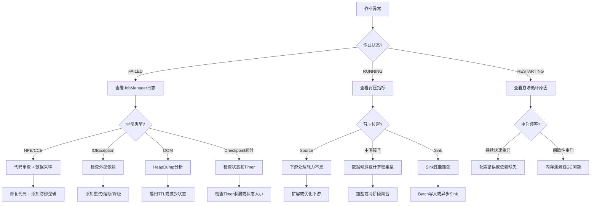
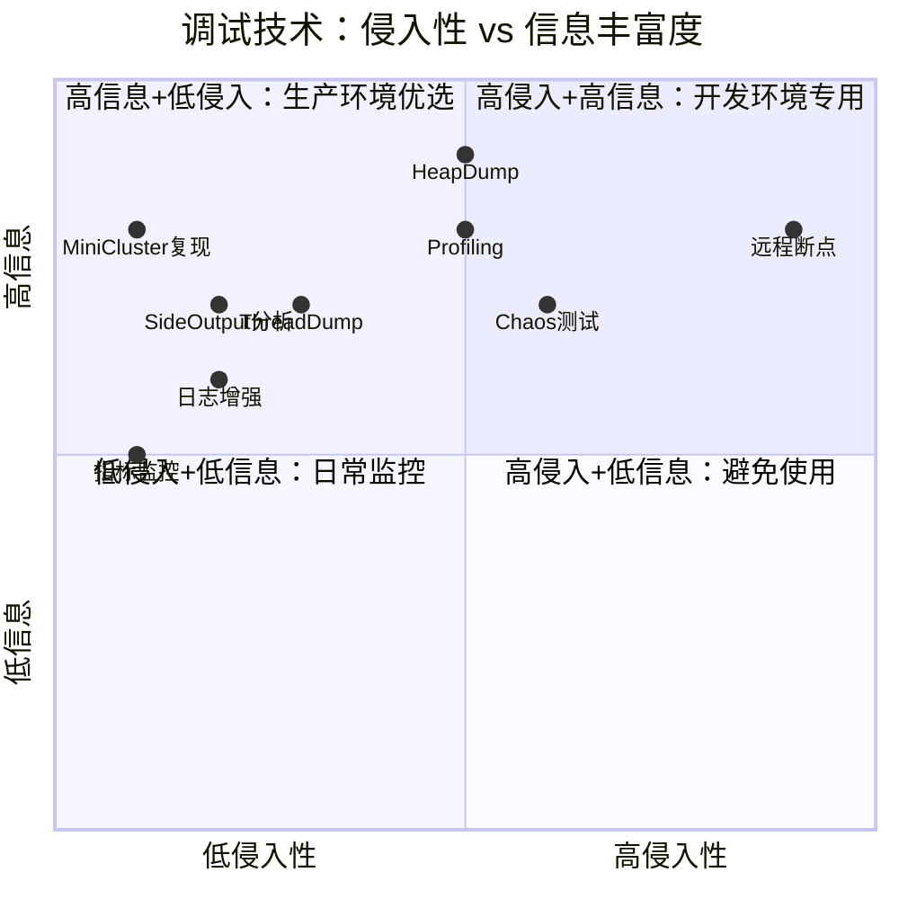

# 算子调试与故障排查手册

> **所属阶段**: Knowledge/07-best-practices | **前置依赖**: [operator-observability-and-intelligent-ops.md](operator-observability-and-intelligent-ops.md), [operator-anti-patterns.md](../09-anti-patterns/operator-anti-patterns.md) | **形式化等级**: L2-L3
> **文档定位**: 流处理算子级别的故障诊断、调试技巧与问题修复实战指南
> **版本**: 2026.04

---

## 目录

- [算子调试与故障排查手册](#算子调试与故障排查手册)
  - [目录](#目录)
  - [1. 概念定义 (Definitions)](#1-概念定义-definitions)
    - [Def-DBG-01-01: 算子故障分类（Operator Failure Taxonomy）](#def-dbg-01-01-算子故障分类operator-failure-taxonomy)
    - [Def-DBG-01-02: 调试信号（Debugging Signal）](#def-dbg-01-02-调试信号debugging-signal)
    - [Def-DBG-01-03: 最小可复现示例（Minimal Reproducible Example, MRE）](#def-dbg-01-03-最小可复现示例minimal-reproducible-example-mre)
    - [Def-DBG-01-04: 检查点诊断（Checkpoint Diagnosis）](#def-dbg-01-04-检查点诊断checkpoint-diagnosis)
  - [2. 属性推导 (Properties)](#2-属性推导-properties)
    - [Lemma-DBG-01-01: 异常传播的单向性](#lemma-dbg-01-01-异常传播的单向性)
    - [Lemma-DBG-01-02: 确定性故障的可复现性](#lemma-dbg-01-02-确定性故障的可复现性)
    - [Prop-DBG-01-01: 背压与延迟的相关性](#prop-dbg-01-01-背压与延迟的相关性)
    - [Prop-DBG-01-02: OOM前的GC模式](#prop-dbg-01-02-oom前的gc模式)
  - [3. 关系建立 (Relations)](#3-关系建立-relations)
    - [3.1 故障症状与调试工具映射](#31-故障症状与调试工具映射)
    - [3.2 调试技术分层](#32-调试技术分层)
  - [4. 论证过程 (Argumentation)](#4-论证过程-argumentation)
    - [4.1 为什么流处理调试比批处理困难](#41-为什么流处理调试比批处理困难)
    - [4.2 日志策略的最佳实践](#42-日志策略的最佳实践)
    - [4.3 远程调试的风险与替代方案](#43-远程调试的风险与替代方案)
  - [5. 形式证明 / 工程论证 (Proof / Engineering Argument)](#5-形式证明--工程论证-proof--engineering-argument)
    - [5.1 系统化故障排查流程](#51-系统化故障排查流程)
    - [5.2 常见异常速查表](#52-常见异常速查表)
    - [5.3 性能剖析方法论](#53-性能剖析方法论)
  - [6. 实例验证 (Examples)](#6-实例验证-examples)
    - [6.1 实战：KeyedProcessFunction状态泄漏排查](#61-实战keyedprocessfunction状态泄漏排查)
    - [6.2 实战：数据倾斜导致单Task OOM](#62-实战数据倾斜导致单task-oom)
    - [6.3 实战：Side Output捕获异常数据](#63-实战side-output捕获异常数据)
  - [7. 可视化 (Visualizations)](#7-可视化-visualizations)
    - [故障排查决策树](#故障排查决策树)
    - [调试技术选择矩阵](#调试技术选择矩阵)
  - [8. 引用参考 (References)](#8-引用参考-references)

---

## 1. 概念定义 (Definitions)

### Def-DBG-01-01: 算子故障分类（Operator Failure Taxonomy）

算子故障按层次分为四类：

$$\text{Failure} = \text{CompilationFailure} \cup \text{RuntimeFailure} \cup \text{PerformanceFailure} \cup \text{SemanticFailure}$$

| 类型 | 发生阶段 | 典型症状 | 检测方式 |
|------|---------|---------|---------|
| **编译故障** | 作业提交前 | 类型不匹配、序列化器缺失 | 编译错误日志 |
| **运行时故障** | 作业执行中 | NPE、OOM、连接超时 | 异常堆栈 |
| **性能故障** | 作业执行中 | 背压、延迟高、吞吐低 | 指标监控 |
| **语义故障** | 结果验证时 | 数据重复、丢失、乱序 | 结果对比 |

### Def-DBG-01-02: 调试信号（Debugging Signal）

调试信号是用于定位算子问题的可观测输出：

$$\text{Signal} \in \{\text{Exception}, \text{Metric}, \text{Log}, \text{ThreadDump}, \text{HeapDump}, \text{StateDump}\}$$

### Def-DBG-01-03: 最小可复现示例（Minimal Reproducible Example, MRE）

MRE是剥离业务逻辑后仍能复现算子故障的最小Pipeline：

$$\text{MRE} = (\text{Minimal Source}, \text{Target Operator}, \text{Minimal Sink})$$

要求：

1. 可独立运行（不依赖外部系统）
2. 数据量可控（通常 < 1000条）
3. 故障复现率 100%

### Def-DBG-01-04: 检查点诊断（Checkpoint Diagnosis）

检查点诊断是通过分析checkpoint成功/失败模式来定位问题的方法：

$$\text{Diagnosis}(chkpt) = f(\text{duration}, \text{size}, \text{syncDuration}, \text{asyncDuration}, \text{numOfAcknowledgedTasks})$$

---

## 2. 属性推导 (Properties)

### Lemma-DBG-01-01: 异常传播的单向性

若算子 $i$ 抛出未捕获异常，则该异常仅影响算子 $i$ 所在的Task，不会直接传播到其他Task。但会通过以下间接路径传播：

1. **Checkpoint失败**: 异常Task不响应barrier，导致全局checkpoint超时
2. **背压传播**: 异常Task停止消费，上游网络缓冲区填满
3. **JobManager决策**: 若异常率超过阈值，JobManager重启整个作业

### Lemma-DBG-01-02: 确定性故障的可复现性

若故障由确定性因素（代码bug、固定输入数据）引起，则在相同条件下100%复现：

$$\text{Deterministic}(bug) \Rightarrow P(\text{Failure} \mid \text{SameConditions}) = 1$$

若故障由非确定性因素（网络抖动、GC时机、竞态条件）引起，则需要增加采样频率来捕获。

### Prop-DBG-01-01: 背压与延迟的相关性

在Pipeline中，背压指数 $B$ 与端到端延迟 $\mathcal{L}$ 满足正相关：

$$\rho(B, \mathcal{L}) > 0.7$$

**工程意义**: 当观测到延迟飙升时，首先检查背压指标可快速定位瓶颈算子。

### Prop-DBG-01-02: OOM前的GC模式

OOM发生前通常出现以下GC模式：

1. Full GC频率从分钟级降至秒级
2. GC后内存回收率从80%降至10%以下
3. GC时间占比从 < 5% 升至 > 50%

**预警**: 当GC时间占比 > 30% 持续1分钟，作业将在10分钟内OOM。

---

## 3. 关系建立 (Relations)

### 3.1 故障症状与调试工具映射

| 症状 | 首选工具 | 次选工具 | 关键指标 |
|------|---------|---------|---------|
| **作业崩溃** | JobManager日志 | TaskManager日志 | Exception类名 |
| **Checkpoint超时** | Web UI Checkpoints页 | TM日志 | alignmentDuration |
| **延迟高** | Flink Metrics | 自定义日志 | records-lag-max |
| **OOM** | HeapDump + MAT | GC日志 | oldGenUsage |
| **数据丢失** | Sink输出对比 | Checkpoint状态检查 | records-out vs records-in |
| **数据重复** | 幂等检查 | 事务日志 | 主键冲突数 |
| **数据乱序** | Watermark监控 | 事件时间分布图 | watermark-lag |
| **状态过大** | StateBackend统计 | Checkpoint大小 | stateSize |

### 3.2 调试技术分层

```
调试技术栈
├── 静态分析
│   ├── 代码审查（Code Review）
│   ├── 类型检查（Type Checking）
│   └── 序列化兼容性检查
├── 动态分析
│   ├── 日志增强（Logging）
│   ├── 指标采集（Metrics）
│   ├── 断点调试（Remote Debug）
│   └── 性能剖析（Profiling）
├── 故障注入
│   ├── Chaos Engineering
│   ├── 网络分区模拟
│   └── 延迟注入
└── 事后分析
    ├── 堆转储分析（Heap Dump）
    ├── 线程转储分析（Thread Dump）
    └── 检查点分析（Checkpoint Analysis）
```

---

## 4. 论证过程 (Argumentation)

### 4.1 为什么流处理调试比批处理困难

| 维度 | 批处理 | 流处理 |
|------|--------|--------|
| 数据可见性 | 全量数据在运行前已知 | 数据无限，只能采样 |
| 故障时机 | 通常在作业启动时暴露 | 可能在运行数天后暴露 |
| 重跑成本 | 低（重跑一次即可） | 高（需从Savepoint恢复） |
| 状态复杂度 | 无状态或简单状态 | 持续累积的复杂状态 |
| 时间因素 | 不涉及时间语义 | 事件时间/处理时间/watermark交织 |
| 并发调试 | 通常单线程 | 多并行度，竞态条件难复现 |

### 4.2 日志策略的最佳实践

**反模式**: 每条记录都打印日志。

```java
// ❌ 错误：日志洪水
public void processElement(Event event, Context ctx, Collector<Result> out) {
    LOG.info("Processing event: {}", event);  // 每秒10万条日志
    out.collect(process(event));
}
```

**正模式**: 采样日志 + 结构化日志。

```java
// ✅ 正确：采样+结构化
private static final int LOG_SAMPLE_RATE = 1000;
private long counter = 0;

public void processElement(Event event, Context ctx, Collector<Result> out) {
    counter++;
    if (counter % LOG_SAMPLE_RATE == 0) {
        LOG.info("Sample processing", StructuredArguments.keyValue("eventId", event.getId()));
    }
    out.collect(process(event));
}
```

### 4.3 远程调试的风险与替代方案

**远程调试的风险**:

- 断点暂停会导致背压传播，影响生产环境
- 调试器连接增加网络开销
- 多并行度下调试器只能 attach 到一个 Task

**替代方案**:

1. **本地MiniCluster复现**: 在本地用相同代码和数据复现
2. **增强日志**: 在可疑位置添加详细日志，重新部署
3. **Side Output异常流**: 将异常数据路由到Side Output，离线分析

---

## 5. 形式证明 / 工程论证 (Proof / Engineering Argument)

### 5.1 系统化故障排查流程

**Step 1: 症状收集**

```
作业异常?
├── 完全崩溃（FAILED状态）
│   └── 收集JobManager + 所有TaskManager日志
├── 运行但延迟高（RUNNING状态）
│   └── 收集Metrics + Backpressure指标
├── Checkpoint持续失败
│   └── 收集Checkpoint详情 + TM日志
└── 结果不正确（数据质量问题）
    └── 收集输入输出对比 + 中间算子输出采样
```

**Step 2: 范围缩小**
使用二分法缩小故障范围：

1. 将Pipeline从中间截断
2. 检查上半部分输出是否正常
3. 若正常，故障在下半部分；反之在上半部分
4. 重复直到定位到单个算子

**Step 3: 根因确认**
对目标算子进行以下检查：

- 代码逻辑审查
- 输入数据采样分析
- 状态大小和类型检查
- 外部依赖可用性检查

### 5.2 常见异常速查表

| 异常信息 | 根因 | 修复方案 |
|---------|------|---------|
| `NullPointerException` | 输入数据有空值 | 前置filter或空值处理 |
| `ClassCastException` | 类型擦除或序列化问题 | 检查TypeInformation配置 |
| `IOException: Connection refused` | 外部服务不可用 | 添加重试和熔断 |
| `TimeoutException` | 异步调用超时 | 增大timeout或优化外部服务 |
| `OutOfMemoryError` | 状态过大或内存泄漏 | 启用TTL或减少窗口大小 |
| `CheckpointExpiredException` | Checkpoint超时 | 增大timeout或优化状态 |
| `Watermarks are lagging` | Source延迟或数据乱序 | 检查Source Lag或调整Watermark策略 |
| `Buffer pool is destroyed` | Task崩溃后网络层关闭 | 检查上游Task异常 |

### 5.3 性能剖析方法论

**CPU热点分析**:

```bash
# 使用async-profiler attach到TaskManager
./profiler.sh -d 60 -f cpu.svg $(jps | grep TaskManager | awk '{print $1}')
```

分析Flame Graph，定位CPU消耗最高的方法：

- 序列化/反序列化（Kryo/Avro）
- 状态访问（RocksDB get/put）
- 用户自定义函数（UDF）
- 网络传输（Netty）

**内存泄漏分析**:

```bash
# 生成Heap Dump
jmap -dump:format=b,file=heap.hprof $(jps | grep TaskManager | awk '{print $1}')

# 使用Eclipse MAT分析
# 查找Dominator Tree中最大的对象
# 检查 retained heap 最大的类
```

常见泄漏源：

- ListState/MapState无限制增长
- Timer未清理
- 静态集合缓存
- 网络缓冲区未释放

---

## 6. 实例验证 (Examples)

### 6.1 实战：KeyedProcessFunction状态泄漏排查

**症状**: 作业运行2天后，Checkpoint从5秒增加到120秒，最终OOM。

**排查步骤**:

1. **查看Metrics**: `numberOfRegisteredTimers` 持续增长至2,000,000+
2. **代码审查**:

```java
// ❌ 问题代码：每条事件注册Timer，旧Timer未删除
public void processElement(Event event, Context ctx, Collector<Result> out) {
    ctx.timerService().registerEventTimeTimer(event.getTimestamp() + 60000);
    // 没有删除旧Timer的逻辑！
}
```

1. **修复**:

```java
private ValueState<Long> timerState;

public void processElement(Event event, Context ctx, Collector<Result> out) {
    Long oldTimer = timerState.value();
    if (oldTimer != null) {
        ctx.timerService().deleteEventTimeTimer(oldTimer);
    }
    long newTimer = event.getTimestamp() + 60000;
    ctx.timerService().registerEventTimeTimer(newTimer);
    timerState.update(newTimer);
}

public void onTimer(long timestamp, OnTimerContext ctx, Collector<Result> out) {
    timerState.clear();
}
```

1. **验证**: 修复后Timer数量稳定在预期范围，Checkpoint恢复至5秒。

### 6.2 实战：数据倾斜导致单Task OOM

**症状**: 作业某Task频繁OOM重启，其他Task正常运行。

**排查步骤**:

1. **查看Metrics**: 问题Task的 `records-in` 是其他Task的15倍
2. **检查keyBy键分布**:

```java
// ❌ 问题：按省份keyBy，北京/上海占90%数据
stream.keyBy(Order::getProvince)
```

1. **修复方案**（加盐）：

```java
// ✅ 修复：加盐分散热点
stream.map(order -> {
    int salt = ThreadLocalRandom.current().nextInt(10);
    order.setSaltedKey(order.getProvince() + "_" + salt);
    return order;
})
.keyBy(Order::getSaltedKey)
.aggregate(new PartialSum())
.keyBy(Order::getProvince)  // 下游去盐聚合
.aggregate(new FinalSum());
```

1. **验证**: 各Task负载均衡，无OOM。

### 6.3 实战：Side Output捕获异常数据

**场景**: 某算子偶尔NPE，但无法确定是哪条数据导致。

**方案**: 使用Side Output捕获异常数据，不中断主流程。

```java
OutputTag<Event> errorTag = new OutputTag<Event>("parse-errors"){};

SingleOutputStreamOperator<Result> mainStream = stream
    .process(new ProcessFunction<Event, Result>() {
        @Override
        public void processElement(Event event, Context ctx, Collector<Result> out) {
            try {
                out.collect(parse(event));
            } catch (Exception e) {
                ctx.output(errorTag, event);  // 异常数据输出到Side Output
                LOG.error("Parse failed for event: {}", event.getId(), e);
            }
        }
    });

// 异常数据单独处理
DataStream<Event> errorStream = mainStream.getSideOutput(errorTag);
errorStream.addSink(new ErrorEventSink());
```

---

## 7. 可视化 (Visualizations)

### 故障排查决策树



### 调试技术选择矩阵



---

## 8. 引用参考 (References)


---

*关联文档*: [operator-observability-and-intelligent-ops.md](operator-observability-and-intelligent-ops.md) | [operator-anti-patterns.md](../09-anti-patterns/operator-anti-patterns.md) | [operator-testing-and-verification-guide.md](operator-testing-and-verification-guide.md)
