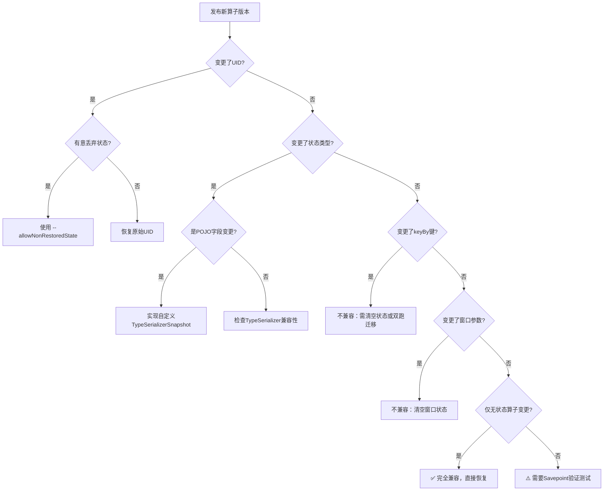
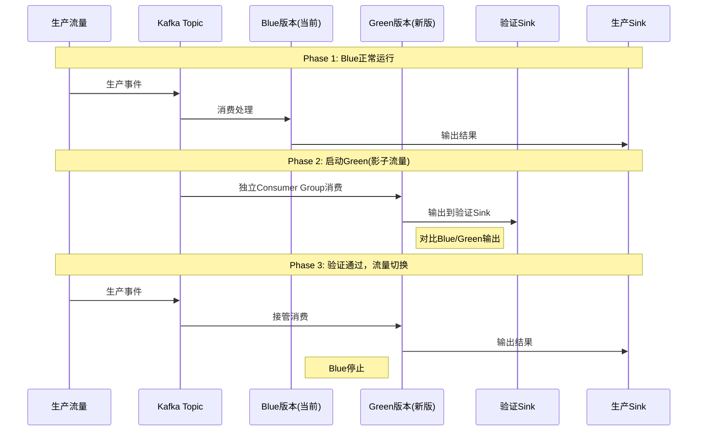
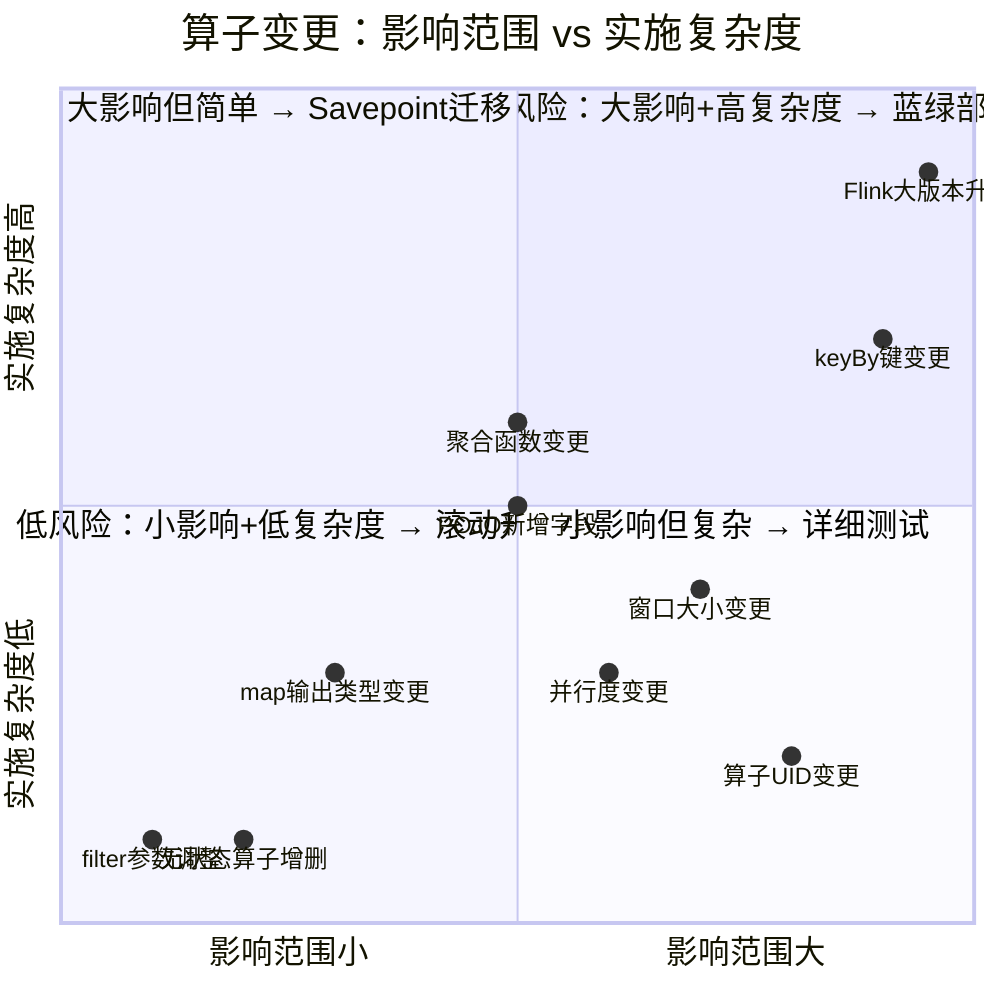

# 算子演化与版本兼容性

> **所属阶段**: Knowledge/07-best-practices | **前置依赖**: [01.10-process-and-async-operators.md](../01-concept-atlas/operator-deep-dive/01.10-process-and-async-operators.md), [operator-testing-and-verification-guide.md](operator-testing-and-verification-guide.md) | **形式化等级**: L2-L3
> **文档定位**: 流处理算子的状态兼容性、Savepoint迁移、版本升级策略与回滚机制
> **版本**: 2026.04

---

## 目录

- [算子演化与版本兼容性](#算子演化与版本兼容性)
  - [目录](#目录)
  - [1. 概念定义 (Definitions)](#1-概念定义-definitions)
    - [Def-EVO-01-01: 算子状态兼容性 (Operator State Compatibility)](#def-evo-01-01-算子状态兼容性-operator-state-compatibility)
    - [Def-EVO-01-02: Savepoint语义版本 (Savepoint Semantic Version)](#def-evo-01-02-savepoint语义版本-savepoint-semantic-version)
    - [Def-EVO-01-03: 状态Schema演化 (State Schema Evolution)](#def-evo-01-03-状态schema演化-state-schema-evolution)
    - [Def-EVO-01-04: 算子UID稳定性 (Operator UID Stability)](#def-evo-01-04-算子uid稳定性-operator-uid-stability)
    - [Def-EVO-01-05: 蓝绿部署与影子流量 (Blue-Green \& Shadow Traffic)](#def-evo-01-05-蓝绿部署与影子流量-blue-green--shadow-traffic)
  - [2. 属性推导 (Properties)](#2-属性推导-properties)
    - [Lemma-EVO-01-01: UID变更导致状态丢失](#lemma-evo-01-01-uid变更导致状态丢失)
    - [Lemma-EVO-01-02: 无状态算子的拓扑可交换性](#lemma-evo-01-02-无状态算子的拓扑可交换性)
    - [Prop-EVO-01-01: 窗口算子参数变更的不兼容性](#prop-evo-01-01-窗口算子参数变更的不兼容性)
    - [Prop-EVO-01-02: keyBy键选择器变更的数据重分布需求](#prop-evo-01-02-keyby键选择器变更的数据重分布需求)
  - [3. 关系建立 (Relations)](#3-关系建立-relations)
    - [3.1 变更类型与兼容性矩阵](#31-变更类型与兼容性矩阵)
    - [3.2 版本升级策略对照](#32-版本升级策略对照)
    - [3.3 与项目其他文档的关系](#33-与项目其他文档的关系)
  - [4. 论证过程 (Argumentation)](#4-论证过程-argumentation)
    - [4.1 为什么StateSchemaEvolution如此困难](#41-为什么stateschemaevolution如此困难)
    - [4.2 Flink版本升级的特殊挑战](#42-flink版本升级的特殊挑战)
    - [4.3 并行度变更的状态重分区](#43-并行度变更的状态重分区)
  - [5. 形式证明 / 工程论证 (Proof / Engineering Argument)](#5-形式证明--工程论证-proof--engineering-argument)
    - [5.1 兼容性检查清单](#51-兼容性检查清单)
    - [5.2 自定义状态迁移模式](#52-自定义状态迁移模式)
    - [5.3 蓝绿部署实施流程](#53-蓝绿部署实施流程)
  - [6. 实例验证 (Examples)](#6-实例验证-examples)
    - [6.1 实战：窗口聚合参数升级](#61-实战窗口聚合参数升级)
    - [6.2 实战：POJO状态字段扩展](#62-实战pojo状态字段扩展)
  - [7. 可视化 (Visualizations)](#7-可视化-visualizations)
    - [版本兼容性决策树](#版本兼容性决策树)
    - [蓝绿部署时序图](#蓝绿部署时序图)
    - [状态兼容性矩阵](#状态兼容性矩阵)
  - [8. 引用参考 (References)](#8-引用参考-references)

---

## 1. 概念定义 (Definitions)

### Def-EVO-01-01: 算子状态兼容性 (Operator State Compatibility)

算子状态兼容性是指算子新版本 $Op_{v2}$ 能否从旧版本 $Op_{v1}$ 保存的 checkpoint/savepoint 中恢复状态并继续正确运行的二元属性：

$$\text{Compatible}(Op_{v1}, Op_{v2}) = \begin{cases} \text{true} & \text{if } \forall s \in \text{State}(Op_{v1}), \exists f: s \mapsto s' \in \text{State}(Op_{v2}) \\ \text{false} & \text{otherwise} \end{cases}$$

其中 $f$ 为状态迁移函数（State Migration Function）。

### Def-EVO-01-02: Savepoint语义版本 (Savepoint Semantic Version)

Savepoint的语义版本遵循 $Major.Minor.Patch$ 规则：

- **Major变更**: Pipeline拓扑改变（算子增删改顺序），不兼容恢复
- **Minor变更**: 算子参数调整（窗口大小、TTL等），需状态适配函数
- **Patch变更**: 纯bug修复或性能优化，完全兼容恢复

### Def-EVO-01-03: 状态Schema演化 (State Schema Evolution)

状态Schema演化指算子内部ValueState/MapState/ListState的数据类型发生变更时的处理策略：

$$\text{SchemaEvolution}(T_{old}, T_{new}) \in \{\text{IDENTITY}, \text{UPCAST}, \text{MIGRATION}, \text{BREAKING}\}$$

| 类型 | 示例 | 处理方式 |
|------|------|---------|
| IDENTITY | `String` → `String` | 直接恢复 |
| UPCAST | `int` → `long` | 自动类型提升 |
| MIGRATION | `UserV1{name,age}` → `UserV2{name,age,email}` | 自定义迁移函数 |
| BREAKING | `String` → `POJO`（无默认构造器） | 不兼容，需清空状态 |

### Def-EVO-01-04: 算子UID稳定性 (Operator UID Stability)

算子UID是Flink用于在Savepoint中定位算子状态的标识符。UID稳定性定义为：

$$\text{UIDStable} = \forall t_1, t_2: \text{UID}(Op, t_1) = \text{UID}(Op, t_2)$$

若UID变更，则Savepoint中的状态无法自动关联到新算子。

### Def-EVO-01-05: 蓝绿部署与影子流量 (Blue-Green & Shadow Traffic)

蓝绿部署是指同时运行两个版本作业（Blue为当前生产版本，Green为新版本），通过流量切换实现零停机升级。影子流量是指将生产流量同时复制到Green版本但不影响实际输出，用于验证新版本正确性。

---

## 2. 属性推导 (Properties)

### Lemma-EVO-01-01: UID变更导致状态丢失

若算子 $Op$ 的UID从 $uid_1$ 变更为 $uid_2$，则从包含 $uid_1$ 的Savepoint恢复时：

$$\text{State}_{recovered}(Op_{uid_2}) = \emptyset$$

**证明**: Flink Savepoint使用UID作为状态索引键。新UID在Savepoint中无对应条目，因此恢复时该算子状态为空集合。∎

### Lemma-EVO-01-02: 无状态算子的拓扑可交换性

对于无状态算子（map/filter/flatMap），若仅交换相邻算子的顺序且不改变语义：

$$Op_1 \circ Op_2 = Op_2' \circ Op_1' \Rightarrow \text{Compatible}(\text{Savepoint}(Op_1 \circ Op_2), \text{Savepoint}(Op_2' \circ Op_1'))$$

**证明**: 无状态算子不保存任何状态数据，因此Savepoint中不包含这些算子的状态条目。拓扑变更不影响有状态算子的状态映射。∎

### Prop-EVO-01-01: 窗口算子参数变更的不兼容性

将Tumbling窗口大小从 $W_1$ 变更为 $W_2$（$W_1 \neq W_2$）时，原有窗口状态无法直接映射：

$$\text{Compatible}(\text{Tumble}(W_1), \text{Tumble}(W_2)) = \text{false}, \quad W_1 \neq W_2$$

**工程推论**: 窗口参数变更必须清空窗口状态（丢弃未完成的窗口数据）或使用自定义迁移逻辑将旧窗口数据重新分配。

### Prop-EVO-01-02: keyBy键选择器变更的数据重分布需求

若keyBy的键选择器从 $key_1$ 变更为 $key_2$，则状态需按新键重新分区：

$$\text{State}_{new}(key_2) = \bigoplus_{\{e: key_2(e) = k\}} \text{State}_{old}(key_1(e))$$

其中 $\bigoplus$ 为聚合操作（取决于具体算子语义，如SUM、COUNT等）。

---

## 3. 关系建立 (Relations)

### 3.1 变更类型与兼容性矩阵

| 变更类型 | 示例 | 兼容性 | 恢复策略 |
|---------|------|--------|---------|
| **增加无状态算子** | map后新增filter | ✅ 完全兼容 | 直接恢复 |
| **删除无状态算子** | 移除冗余map | ✅ 完全兼容 | 直接恢复 |
| **调整无状态算子参数** | filter条件变更 | ✅ 完全兼容 | 直接恢复 |
| **增加有状态算子** | 新增window aggregate | ⚠️ 需指定初始状态 | 使用 `--allowNonRestoredState` 或自定义初始化 |
| **删除有状态算子** | 移除aggregate | ⚠️ 需允许丢弃状态 | 使用 `--allowNonRestoredState` |
| **变更UID** | 重命名算子 | ❌ 不兼容 | 使用 `--uid` 保持原值或状态迁移 |
| **变更keyBy键** | userId → sessionId | ❌ 不兼容 | 状态重分区或清空 |
| **变更窗口参数** | 1分钟 → 5分钟 | ❌ 不兼容 | 清空窗口状态 |
| **变更状态类型** | int → long | ✅ 自动兼容 | TypeSerializer自动处理 |
| **变更POJO结构** | 增加字段 | ⚠️ 需迁移函数 | 实现 `StateTtlConfig` 或自定义 `TypeSerializer` |
| **变更并行度** | 4 → 8 | ⚠️ 有限兼容 | Flink自动重分区状态（RocksDB backend） |

### 3.2 版本升级策略对照

```
升级策略
├── 滚动升级 (Rolling Upgrade)
│   ├── 适用：无状态算子或Patch变更
│   └── 特点：逐TaskManager重启，不中断数据处理
├── Savepoint-Stop-Resume
│   ├── 适用：Minor变更（参数调整）
│   └── 特点：停机时间短，状态完整保留
├── 蓝绿部署 (Blue-Green)
│   ├── 适用：Major变更或高风险发布
│   └── 特点：零停机，需双资源，流量可秒级回切
└── 影子流量验证 (Shadow Traffic)
    ├── 适用：核心链路重大变更
    └── 特点：生产流量复制验证，不影响实际业务
```

### 3.3 与项目其他文档的关系

- [operator-testing-and-verification-guide.md](operator-testing-and-verification-guide.md): 升级前的兼容性测试方法
- [01.10-process-and-async-operators.md](../01-concept-atlas/operator-deep-dive/01.10-process-and-async-operators.md): ProcessFunction自定义状态的序列化控制
- [02.06-stream-operator-algebra.md](../../Struct/02-properties/02.06-stream-operator-algebra.md): 算子交换律与拓扑变换的理论基础

---

## 4. 论证过程 (Argumentation)

### 4.1 为什么StateSchemaEvolution如此困难

流处理系统的状态是**持续累积**的，与批处理系统的"每次从零开始"不同：

- **批处理**: 修改Schema只需重跑作业，无历史负担
- **流处理**: 状态可能包含数小时/数天/数月的历史聚合数据，Schema变更必须兼容这些数据

**典型案例**: 用户画像系统运行6个月，MapState中累积了1亿用户的标签数据。此时需要在UserProfile POJO中新增`vipLevel`字段：

- 批处理：直接修改代码，重跑即可
- 流处理：必须确保旧数据的`vipLevel`有合理默认值，或提供迁移逻辑

### 4.2 Flink版本升级的特殊挑战

Flink大版本升级（如1.x → 2.x）涉及：

1. **Savepoint格式变更**: 新格式可能无法读取旧Savepoint
2. **序列化器变更**: TypeSerializerSnapshot格式可能不兼容
3. **API废弃**: DataStream API的某些方法可能被移除

**应对策略**:

- 小版本升级（1.17 → 1.18）: 直接升级，通常兼容
- 大版本升级（1.x → 2.x）: 必须通过Savepoint迁移，且需测试验证

### 4.3 并行度变更的状态重分区

Flink在恢复时自动处理并行度变更的状态重分区：

**扩缩容场景**:

- 4并行度 → 8并行度: 每个旧分区的状态按新key分区函数重新分配到2个新分区
- 8并行度 → 4并行度: 每2个旧分区的状态合并到1个新分区

**限制**:

- 仅适用于keyed state（按key hash自然可重分区）
- Operator state（如Broadcast state）需自定义 `OperatorStateRepartitioner`

---

## 5. 形式证明 / 工程论证 (Proof / Engineering Argument)

### 5.1 兼容性检查清单

在发布新版算子前，按以下清单逐项验证：

```markdown
□ UID是否保持不变？（除非有意丢弃状态）
□ 算子输入/输出类型是否变更？
□ 算子状态类型（ValueState/MapState/ListState/ReducingState）是否变更？
□ 状态POJO的字段是否增删改？
□ keyBy键选择器是否变更？
□ 窗口类型或窗口参数是否变更？
□ 聚合函数是否变更？
□ TTL配置是否变更？
□ TypeSerializer是否自定义？是否升级了SerializerSnapshot？
□ 并行度范围是否与Savepoint兼容？
```

### 5.2 自定义状态迁移模式

当自动兼容性不足时，实现自定义 `StateMigrationFunction`：

```java
public class UserProfileMigration
    implements StateMigrationFunction<UserProfileV1, UserProfileV2> {

    @Override
    public UserProfileV2 migrate(UserProfileV1 oldValue) {
        return UserProfileV2.builder()
            .userId(oldValue.getUserId())
            .name(oldValue.getName())
            .age(oldValue.getAge())
            .email("unknown@example.com")  // 新字段默认值
            .vipLevel(0)                  // 新字段默认值
            .build();
    }
}

// 注册迁移
env.getConfig().registerTypeWithKryoSerializer(
    UserProfileV2.class,
    new MigratingSerializer<>(new UserProfileMigration())
);
```

### 5.3 蓝绿部署实施流程

**阶段1：Green版本部署**

```bash
# 1. 从当前Blue版本的Savepoint启动Green版本
flink run -s hdfs://savepoints/blue-v1.0 -d green-job.jar

# 2. 配置影子流量（通过Kafka Consumer Group或流量复制）
# Green版本消费独立Consumer Group，不影响Blue的offset提交
```

**阶段2：验证Green版本**

- 对比Blue和Green的输出到独立的验证Sink
- 检查延迟、吞吐、状态大小、错误率等指标
- 运行至少2个业务周期（如2天）

**阶段3：流量切换**

```bash
# 1. 停止Blue版本（保留Savepoint）
flink cancel -s hdfs://savepoints/blue-final <blue-job-id>

# 2. Green版本接管生产流量（切换Kafka Consumer Group或负载均衡器）
```

**阶段4：回滚准备**

- 保留Blue版本Savepoint至少7天
- 若Green发现问题，可立即从 `blue-final` Savepoint恢复Blue版本

---

## 6. 实例验证 (Examples)

### 6.1 实战：窗口聚合参数升级

**场景**: 实时UV统计，原窗口1分钟，业务要求改为5分钟以获得更稳定的统计。

**分析**:

- 窗口类型未变（TumblingEventTimeWindows）
- 窗口大小从1分钟变为5分钟
- 根据Prop-EVO-01-01，不兼容

**方案选择**:

| 方案 | 说明 | 数据丢失 | 复杂度 |
|------|------|---------|--------|
| A: 清空状态重启 | 直接修改参数，丢弃旧窗口状态 | 丢失当前未完成窗口 | 低 |
| B: 双窗口并行 | 同时运行1分钟和5分钟两个作业 | 无 | 高（资源双倍） |
| C: 平滑迁移 | 新作业从Savepoint恢复，但自定义窗口状态转换 | 无 | 高 |

**推荐方案A**（适用于允许分钟级数据丢失的场景）:

```java
// 新代码
stream.keyBy(Event::getPageId)
    .window(TumblingEventTimeWindows.of(Time.minutes(5)))  // 从1改为5
    .aggregate(new UvAggregate());

// 启动命令：允许非恢复状态
flink run -s hdfs://savepoints/old -d new-job.jar \
    --allowNonRestoredState
```

### 6.2 实战：POJO状态字段扩展

**场景**: 订单聚合状态从 `OrderStats{count, totalAmount}` 扩展为 `OrderStats{count, totalAmount, avgAmount, maxAmount}`。

**迁移实现**:

```java
// 旧版本POJO
public class OrderStatsV1 implements Serializable {
    private long count;
    private BigDecimal totalAmount;
}

// 新版本POJO
public class OrderStatsV2 implements Serializable {
    private long count;
    private BigDecimal totalAmount;
    private BigDecimal avgAmount;  // 新增
    private BigDecimal maxAmount;  // 新增
}

// 自定义TypeSerializerSnapshot
public class OrderStatsV2SerializerSnapshot
    extends CompositeTypeSerializerSnapshot<OrderStatsV2, OrderStatsV2Serializer> {

    private static final int CURRENT_VERSION = 2;

    @Override
    protected int getCurrentOuterSnapshotVersion() {
        return CURRENT_VERSION;
    }

    @Override
    protected TypeSerializer<OrderStatsV2> createOuterSerializerWithNestedSerializers(
            TypeSerializer<?>[] nestedSerializers) {
        return new OrderStatsV2Serializer();
    }

    @Override
    protected TypeSerializer<?>[] getNestedSerializers(TypeSerializer<OrderStatsV2> outerSerializer) {
        return new TypeSerializer[0];
    }

    // 从旧版本恢复时的迁移逻辑
    @Override
    protected OrderStatsV2Serializer restoreOuterSerializer(
            int readOuterSnapshotVersion,
            TypeSerializer<?>[] restoredNestedSerializers) {
        if (readOuterSnapshotVersion == 1) {
            // 从V1迁移到V2
            return new OrderStatsV2Serializer.WithMigration();
        }
        return new OrderStatsV2Serializer();
    }
}
```

---

## 7. 可视化 (Visualizations)

### 版本兼容性决策树



### 蓝绿部署时序图



### 状态兼容性矩阵



---

## 8. 引用参考 (References)


---

*关联文档*: [operator-testing-and-verification-guide.md](operator-testing-and-verification-guide.md) | [02.06-stream-operator-algebra.md](../../Struct/02-properties/02.06-stream-operator-algebra.md) | [01.10-process-and-async-operators.md](../01-concept-atlas/operator-deep-dive/01.10-process-and-async-operators.md)
