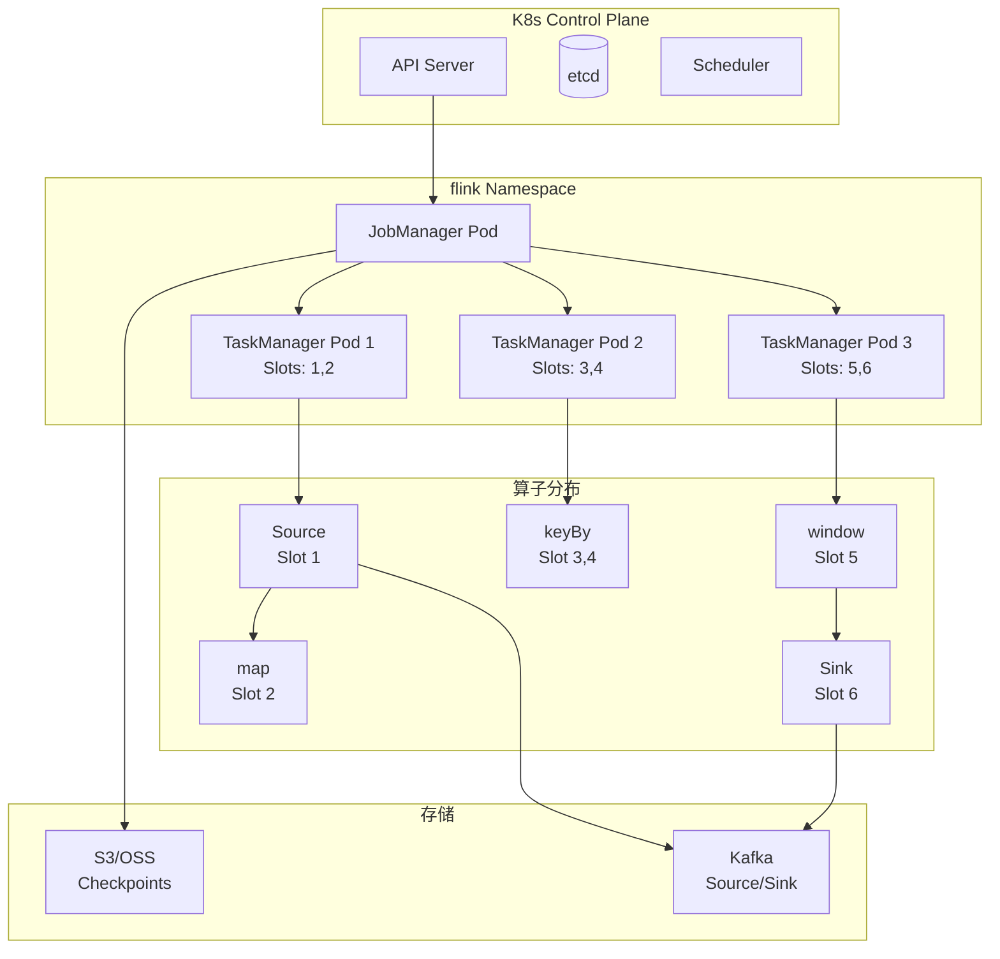
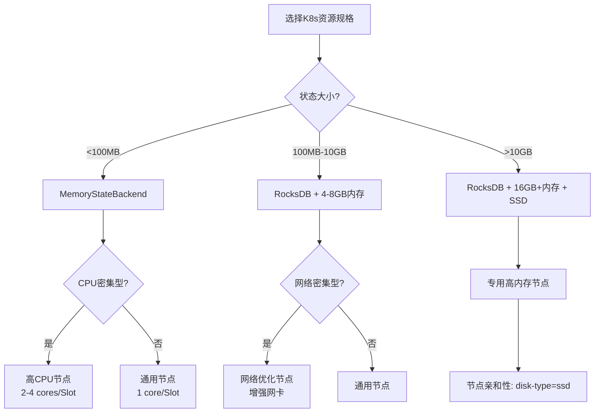

# 算子与Kubernetes云原生部署

> **所属阶段**: Knowledge/07-best-practices | **前置依赖**: [operator-cost-model-and-resource-estimation.md](operator-cost-model-and-resource-estimation.md), [operator-evolution-and-version-compatibility.md](operator-evolution-and-version-compatibility.md) | **形式化等级**: L3
> **文档定位**: 流处理算子在Kubernetes环境中的资源调度、部署策略与生命周期管理
> **版本**: 2026.04

---

## 目录

- [算子与Kubernetes云原生部署](#算子与kubernetes云原生部署)
  - [目录](#目录)
  - [1. 概念定义 (Definitions)](#1-概念定义-definitions)
    - [Def-K8S-01-01: 算子-资源映射（Operator-to-Resource Mapping）](#def-k8s-01-01-算子-资源映射operator-to-resource-mapping)
    - [Def-K8S-01-02: TaskManager Pod模型](#def-k8s-01-02-taskmanager-pod模型)
    - [Def-K8S-01-03: 算子亲和性（Operator Affinity）](#def-k8s-01-03-算子亲和性operator-affinity)
    - [Def-K8S-01-04: 算子级弹性伸缩（Operator-level Autoscaling）](#def-k8s-01-04-算子级弹性伸缩operator-level-autoscaling)
    - [Def-K8S-01-05: Flink Kubernetes Operator](#def-k8s-01-05-flink-kubernetes-operator)
  - [2. 属性推导 (Properties)](#2-属性推导-properties)
    - [Lemma-K8S-01-01: Slot共享的局部性优化](#lemma-k8s-01-01-slot共享的局部性优化)
    - [Lemma-K8S-01-02: Pod重启对作业的影响](#lemma-k8s-01-02-pod重启对作业的影响)
    - [Prop-K8S-01-01: 资源碎片化与调度效率](#prop-k8s-01-01-资源碎片化与调度效率)
    - [Prop-K8S-01-02: 有状态算子扩容的状态迁移成本](#prop-k8s-01-02-有状态算子扩容的状态迁移成本)
  - [3. 关系建立 (Relations)](#3-关系建立-relations)
    - [3.1 算子类型与K8s资源规格映射](#31-算子类型与k8s资源规格映射)
    - [3.2 Flink on K8s部署模式对比](#32-flink-on-k8s部署模式对比)
    - [3.3 算子与K8s健康检查映射](#33-算子与k8s健康检查映射)
  - [4. 论证过程 (Argumentation)](#4-论证过程-argumentation)
    - [4.1 为什么Flink on K8s优于Standalone](#41-为什么flink-on-k8s优于standalone)
    - [4.2 TaskManager内存模型的K8s适配](#42-taskmanager内存模型的k8s适配)
    - [4.3 Checkpoint与PersistentVolume的关系](#43-checkpoint与persistentvolume的关系)
  - [5. 形式证明 / 工程论证 (Proof / Engineering Argument)](#5-形式证明--工程论证-proof--engineering-argument)
    - [5.1 算子资源需求计算公式](#51-算子资源需求计算公式)
    - [5.2 K8s资源配额与LimitRange设计](#52-k8s资源配额与limitrange设计)
    - [5.3 自动扩缩容策略（HPA + Flink Autoscaler）](#53-自动扩缩容策略hpa--flink-autoscaler)
  - [6. 实例验证 (Examples)](#6-实例验证-examples)
    - [6.1 实战：Flink Kubernetes Operator部署](#61-实战flink-kubernetes-operator部署)
    - [6.2 实战：有状态算子的节点亲和性配置](#62-实战有状态算子的节点亲和性配置)
  - [7. 可视化 (Visualizations)](#7-可视化-visualizations)
    - [Flink on K8s架构图](#flink-on-k8s架构图)
    - [资源规格选型决策树](#资源规格选型决策树)
  - [8. 引用参考 (References)](#8-引用参考-references)

---

## 1. 概念定义 (Definitions)

### Def-K8S-01-01: 算子-资源映射（Operator-to-Resource Mapping）

算子-资源映射定义了流处理算子与Kubernetes资源对象之间的分配关系：

$$\text{Mapping}: Op_i \mapsto (\text{Pod}_j, \text{Container}_k, \text{Resources}(CPU, MEM))$$

其中 $Op_i$ 为算子实例（Subtask），$Pod_j$ 为K8s Pod，$Container_k$ 为Pod内容器。

### Def-K8S-01-02: TaskManager Pod模型

Flink on K8s中，TaskManager以Pod形式运行，每个Pod承载一个TaskManager进程，包含多个Slot：

$$\text{TaskManager Pod} = (\text{JobManager Connection}, \text{SlotPool}, \text{MemoryManager}, \text{IOManager})$$

Slot数量由配置 `taskmanager.numberOfTaskSlots` 决定，通常每个CPU core分配1-2个Slot。

### Def-K8S-01-03: 算子亲和性（Operator Affinity）

算子亲和性控制算子Subtask在K8s节点上的分布策略：

- **Pod亲和性**: 将相关算子（如Source和首个处理算子）调度到同一节点，减少网络传输
- **Pod反亲和性**: 将有状态算子的不同副本分散到不同节点/可用区，提高容错性
- **节点亲和性**: 将计算密集型算子调度到高CPU节点，将内存密集型算子调度到高内存节点

### Def-K8S-01-04: 算子级弹性伸缩（Operator-level Autoscaling）

算子级弹性伸缩是根据算子运行时指标动态调整其并行度的能力：

$$P_{new} = \text{ScaleFunction}(P_{current}, \text{Metrics}, \text{Constraints})$$

约束条件：

- Source并行度 ≤ Kafka分区数
- 有状态算子扩容需状态迁移
- 缩容需保证最小冗余度

### Def-K8S-01-05: Flink Kubernetes Operator

Flink Kubernetes Operator是管理Flink作业生命周期的K8s自定义控制器（CRD）：

$$\text{Operator} = \text{Reconcile}(\text{Desired State (FlinkDeployment)}, \text{Actual State (K8s Resources)})$$

支持作业提交、更新（savepoint-based）、暂停/恢复、自动恢复等操作。

---

## 2. 属性推导 (Properties)

### Lemma-K8S-01-01: Slot共享的局部性优化

Flink的Slot共享机制允许将不同算子的Subtask放入同一Slot（若它们属于同一Pipeline Region）：

$$\text{LocalityGain} = \text{避免了网络序列化和传输开销}$$

**约束**: 共享Slot的算子总资源需求不得超过Slot容量。

### Lemma-K8S-01-02: Pod重启对作业的影响

TaskManager Pod重启的影响取决于重启时机：

- **Checkpoint间隔内重启**: 作业从上一个成功checkpoint恢复，数据不丢失
- **Checkpoint进行中重启**: 当前checkpoint失败，回滚到上一个成功checkpoint
- **JobManager重启**: 若配置了HA（EmbeddedJournal/ZK），作业状态不丢失

### Prop-K8S-01-01: 资源碎片化与调度效率

当TaskManager请求的CPU/Mem与K8s节点容量不匹配时，产生资源碎片化：

$$\text{FragmentationRatio} = 1 - \frac{\sum_{i}(\text{Allocated}_i)}{\sum_{j}(\text{NodeCapacity}_j)}$$

**优化**: 使用 `taskmanager.memory.process.size` 固定TaskManager总内存，便于K8s调度器做Bin Packing。

### Prop-K8S-01-02: 有状态算子扩容的状态迁移成本

有状态算子从 $P_{old}$ 扩容到 $P_{new}$ 的状态迁移时间为：

$$\mathcal{T}_{migrate} = \frac{S_{total}}{B_{network}} \cdot \frac{P_{new} - P_{old}}{P_{new}}$$

其中 $S_{total}$ 为总状态大小，$B_{network}$ 为网络带宽。

**工程推论**: 状态 > 10GB的有状态算子扩容需要数分钟，期间作业暂停处理。

---

## 3. 关系建立 (Relations)

### 3.1 算子类型与K8s资源规格映射

| 算子特征 | CPU请求 | 内存请求 | 磁盘 | 节点偏好 |
|---------|---------|---------|------|---------|
| **无状态轻量**（map/filter） | 0.5-1 core | 1-2GB | 无 | 通用节点 |
| **无状态重量**（flatMap/复杂UDF） | 1-2 core | 2-4GB | 无 | 高CPU节点 |
| **有状态窗口**（window/aggregate） | 1-2 core | 4-8GB | SSD（RocksDB） | 高内存+SSD节点 |
| **有状态Join** | 2-4 core | 8-16GB | SSD | 高内存+SSD节点 |
| **异步IO** | 0.5 core | 1-2GB | 无 | 网络优化节点 |
| **Source/Sink** | 0.5-1 core | 1-2GB | 无 | 靠近Kafka/Broker |

### 3.2 Flink on K8s部署模式对比

| 模式 | 资源隔离 | 弹性 | 适用场景 | 缺点 |
|------|---------|------|---------|------|
| **Session Cluster** | 低（多作业共享TM） | 低 | 开发测试、小作业 | 作业间资源竞争 |
| **Application Mode** | 高（每作业独立） | 中 | 生产环境标准选择 | 资源利用率可能低 |
| **Per-Job Mode** | 高 | 低 | Flink < 1.15 兼容 | 已废弃 |
| **Native K8s** | 高 | 高 | 需要动态扩缩容 | 配置复杂 |

### 3.3 算子与K8s健康检查映射

```
K8s LivenessProbe → TaskManager进程存活
├── 失败 → K8s重启Pod → Flink自动恢复Task

K8s ReadinessProbe → TaskManager是否可接受Slot分配
├── 失败 → 从Service Endpoint移除 → 不再分配新Slot

Flink RestartStrategy → 算子失败后的重启策略
├── fixed-delay: 固定间隔重启（推荐开发环境）
├── exponential-delay: 指数退避（推荐生产环境）
└── failure-rate: 限频重启（防重启风暴）
```

---

## 4. 论证过程 (Argumentation)

### 4.1 为什么Flink on K8s优于Standalone

| 维度 | Standalone | Kubernetes |
|------|-----------|------------|
| **资源调度** | 静态分配 | 动态调度，资源池化 |
| **故障恢复** | 手动或脚本 | 自动Pod重启、自动重调度 |
| **弹性伸缩** | 需手动扩容 | HPA/VPA自动伸缩 |
| **资源隔离** | 进程级 | 容器级（Cgroup） |
| **多租户** | 弱 | 强（Namespace隔离） |
| **运维复杂度** | 中（需维护主机） | 中（需掌握K8s） |

### 4.2 TaskManager内存模型的K8s适配

Flink 1.10+引入了新的内存模型：

```
Total Process Memory
├── Total Flink Memory
│   ├── Framework Heap (128MB固定)
│   ├── Task Heap (用户代码+状态)
│   ├── Managed Memory (RocksDB cache + batch排序)
│   └── Network Memory (网络缓冲区)
└── JVM Overhead (元空间+栈+直接内存)
```

**K8s配置建议**:

```yaml
resources:
  requests:
    memory: "4Gi"  # 对应 taskmanager.memory.process.size
    cpu: "2"
  limits:
    memory: "4Gi"  # 必须等于requests，避免OOMKiller
    cpu: "2"
```

**关键**: K8s的memory limit必须等于Flink的process memory，否则JVM堆外内存使用超出限制会触发OOMKiller。

### 4.3 Checkpoint与PersistentVolume的关系

Checkpoint存储需要高可用、高吞吐的存储后端：

| 存储类型 | 适用场景 | 性能 | 成本 |
|---------|---------|------|------|
| **HDFS** | 传统大数据生态 | 高 | 中（需维护NameNode） |
| **S3/OSS** | 云原生 | 中 | 低 |
| **NFS/EFS** | 小规模或测试 | 低 | 中 |
| **PersistentVolume（SSD）** | 低延迟要求 | 极高 | 高 |

**推荐**: 生产环境使用对象存储（S3/OSS），本地SSD仅用于RocksDB状态存储（通过emptyDir或local PV）。

---

## 5. 形式证明 / 工程论证 (Proof / Engineering Argument)

### 5.1 算子资源需求计算公式

**输入**: 业务吞吐 $\lambda$，Pipeline拓扑，算子特征。

**Step 1: 计算TaskManager数量**

$$N_{TM} = \left\lceil \frac{\sum_i P_i}{SlotsPerTM} \right\rceil$$

其中 $P_i$ 为算子 $i$ 的并行度，$SlotsPerTM$ 为每个TaskManager的Slot数。

**Step 2: 计算单个TaskManager资源**

$$MEM_{TM} = MEM_{framework} + \sum_{s \in Slots}(MEM_{task}^{(s)} + MEM_{managed}^{(s)} + MEM_{network}^{(s)})$$

$$CPU_{TM} = \sum_{s \in Slots} CPU_{task}^{(s)}$$

**Step 3: 计算JobManager资源**

$$MEM_{JM} = 1.5GB + 0.1 \times N_{TM} \quad \text{(经验公式)}$$

$$CPU_{JM} = 1 \sim 2 \quad \text{cores}$$

### 5.2 K8s资源配额与LimitRange设计

为Flink作业 Namespace 设置资源配额：

```yaml
apiVersion: v1
kind: ResourceQuota
metadata:
  name: flink-quota
  namespace: flink-jobs
spec:
  hard:
    requests.cpu: "100"
    requests.memory: 400Gi
    limits.cpu: "100"
    limits.memory: 400Gi
    pods: "50"
---
apiVersion: v1
kind: LimitRange
metadata:
  name: flink-limits
  namespace: flink-jobs
spec:
  limits:
  - default:
      memory: 4Gi
      cpu: "2"
    defaultRequest:
      memory: 4Gi
      cpu: "2"
    type: Container
```

### 5.3 自动扩缩容策略（HPA + Flink Autoscaler）

**HPA（Horizontal Pod Autoscaler）配置**:

```yaml
apiVersion: autoscaling/v2
kind: HorizontalPodAutoscaler
metadata:
  name: flink-taskmanager-hpa
spec:
  scaleTargetRef:
    apiVersion: apps/v1
    kind: Deployment
    name: flink-taskmanager
  minReplicas: 2
  maxReplicas: 20
  metrics:
  - type: Resource
    resource:
      name: cpu
      target:
        type: Utilization
        averageUtilization: 70
  behavior:
    scaleUp:
      stabilizationWindowSeconds: 300
      policies:
      - type: Pods
        value: 2
        periodSeconds: 60
    scaleDown:
      stabilizationWindowSeconds: 600
      policies:
      - type: Pods
        value: 1
        periodSeconds: 120
```

**约束**: HPA只能扩缩TaskManager数量，不能改变算子并行度。真正的算子级弹性伸缩需要Flink Autoscaler（实验性功能）。

---

## 6. 实例验证 (Examples)

### 6.1 实战：Flink Kubernetes Operator部署

**FlinkDeployment CRD**:

```yaml
apiVersion: flink.apache.org/v1beta1
kind: FlinkDeployment
metadata:
  name: streaming-pipeline
  namespace: flink
spec:
  image: flink:1.18-scala_2.12
  flinkVersion: v1.18
  jobManager:
    resource:
      memory: "2Gi"
      cpu: 1
  taskManager:
    resource:
      memory: "4Gi"
      cpu: 2
    replicas: 3
  job:
    jarURI: local:///opt/flink/examples/streaming/StateMachineExample.jar
    parallelism: 6
    upgradeMode: savepoint
    state: running
  podTemplate:
    spec:
      affinity:
        podAntiAffinity:
          preferredDuringSchedulingIgnoredDuringExecution:
          - weight: 100
            podAffinityTerm:
              labelSelector:
                matchLabels:
                  app: flink-taskmanager
              topologyKey: kubernetes.io/hostname
```

### 6.2 实战：有状态算子的节点亲和性配置

**场景**: RocksDB状态后端需要本地SSD。

```yaml
podTemplate:
  spec:
    containers:
    - name: flink-main-container
      volumeMounts:
      - name: state-volume
        mountPath: /opt/flink/state
    volumes:
    - name: state-volume
      emptyDir:
        medium: Memory  # 或 local SSD
    affinity:
      nodeAffinity:
        requiredDuringSchedulingIgnoredDuringExecution:
          nodeSelectorTerms:
          - matchExpressions:
            - key: disk-type
              operator: In
              values:
              - ssd
```

---

## 7. 可视化 (Visualizations)

### Flink on K8s架构图



### 资源规格选型决策树



---

## 8. 引用参考 (References)


---

*关联文档*: [operator-cost-model-and-resource-estimation.md](operator-cost-model-and-resource-estimation.md) | [operator-evolution-and-version-compatibility.md](operator-evolution-and-version-compatibility.md) | [operator-observability-and-intelligent-ops.md](operator-observability-and-intelligent-ops.md)
