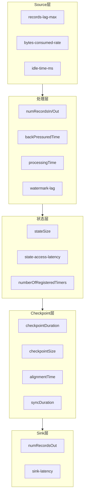
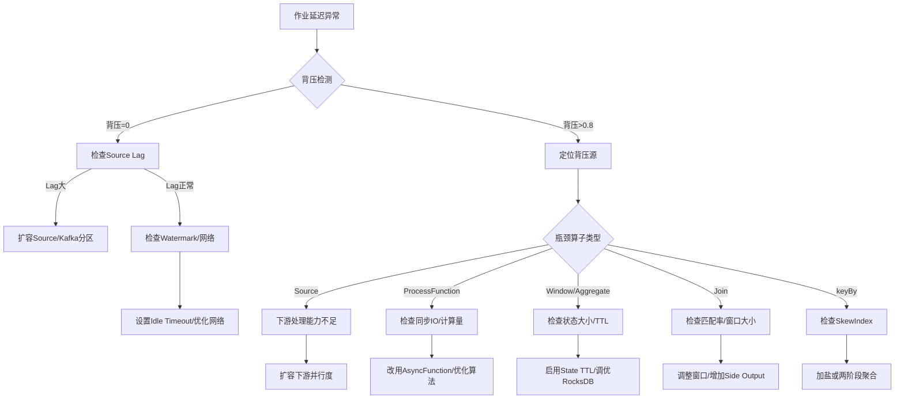
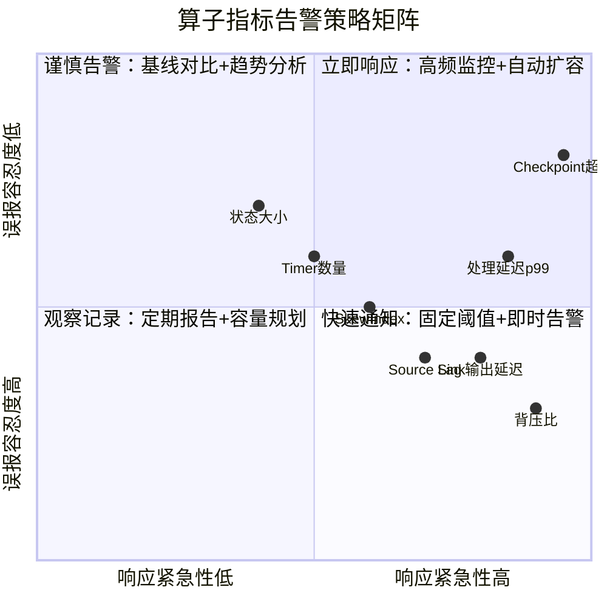

# 算子可观测性与智能运维

> **所属阶段**: Knowledge/07-best-practices | **前置依赖**: [01.06-single-input-operators.md](../01-concept-atlas/operator-deep-dive/01.06-single-input-operators.md), [operator-performance-benchmark-tuning.md](operator-performance-benchmark-tuning.md) | **形式化等级**: L2-L3
> **文档定位**: 流处理算子层面的指标采集、监控告警、故障诊断与智能运维
> **版本**: 2026.04

---

## 目录

- [算子可观测性与智能运维](#算子可观测性与智能运维)
  - [目录](#目录)
  - [1. 概念定义 (Definitions)](#1-概念定义-definitions)
    - [Def-OBS-01-01: 算子级可观测性 (Operator-level Observability)](#def-obs-01-01-算子级可观测性-operator-level-observability)
    - [Def-OBS-01-02: 背压指标 (Backpressure Metric)](#def-obs-01-02-背压指标-backpressure-metric)
    - [Def-OBS-01-03: 算子延迟分解 (Operator Latency Decomposition)](#def-obs-01-03-算子延迟分解-operator-latency-decomposition)
    - [Def-OBS-01-04: 数据倾斜指数 (Data Skew Index)](#def-obs-01-04-数据倾斜指数-data-skew-index)
    - [Def-OBS-01-05: 检查点对齐时间 (Checkpoint Alignment Time)](#def-obs-01-05-检查点对齐时间-checkpoint-alignment-time)
  - [2. 属性推导 (Properties)](#2-属性推导-properties)
    - [Lemma-OBS-01-01: 背压传播单调性](#lemma-obs-01-01-背压传播单调性)
    - [Lemma-OBS-01-02: 算子延迟与并行度的反比关系](#lemma-obs-01-02-算子延迟与并行度的反比关系)
    - [Prop-OBS-01-01: 状态大小与检查点时间的正相关性](#prop-obs-01-01-状态大小与检查点时间的正相关性)
    - [Prop-OBS-01-02: Watermark滞后与事件时间延迟的等价性](#prop-obs-01-02-watermark滞后与事件时间延迟的等价性)
  - [3. 关系建立 (Relations)](#3-关系建立-relations)
    - [3.1 算子类型与可观测性维度映射](#31-算子类型与可观测性维度映射)
    - [3.2 可观测性工具链映射](#32-可观测性工具链映射)
    - [3.3 与性能调优的关系](#33-与性能调优的关系)
  - [4. 论证过程 (Argumentation)](#4-论证过程-argumentation)
    - [4.1 为什么算子级可观测性比作业级更重要](#41-为什么算子级可观测性比作业级更重要)
    - [4.2 背压定位的常见误区](#42-背压定位的常见误区)
    - [4.3 Watermark滞后分析](#43-watermark滞后分析)
  - [5. 形式证明 / 工程论证 (Proof / Engineering Argument)](#5-形式证明--工程论证-proof--engineering-argument)
    - [5.1 智能告警阈值推导](#51-智能告警阈值推导)
    - [5.2 根因分析决策树（RCA Tree）](#52-根因分析决策树rca-tree)
    - [5.3 自动扩缩容策略（Auto-scaling）](#53-自动扩缩容策略auto-scaling)
  - [6. 实例验证 (Examples)](#6-实例验证-examples)
    - [6.1 实战：定位Join算子性能瓶颈](#61-实战定位join算子性能瓶颈)
    - [6.2 实战：Timer泄漏诊断](#62-实战timer泄漏诊断)
  - [7. 可视化 (Visualizations)](#7-可视化-visualizations)
    - [算子可观测性指标全景图](#算子可观测性指标全景图)
    - [背压根因分析决策树](#背压根因分析决策树)
    - [智能告警阈值象限图](#智能告警阈值象限图)
  - [8. 引用参考 (References)](#8-引用参考-references)

---

## 1. 概念定义 (Definitions)

### Def-OBS-01-01: 算子级可观测性 (Operator-level Observability)

算子级可观测性是指对单个算子实例（Subtask）的运行时状态、性能特征、资源消耗和异常行为的可测量、可追踪、可告警能力的三元组：

$$\text{Observability}_{op} = (\text{Metrics}, \text{Traces}, \text{Logs})_{op}$$

其中 Metrics 为时间序列指标，Traces 为分布式追踪 Span，Logs 为结构化日志事件。

### Def-OBS-01-02: 背压指标 (Backpressure Metric)

背压指标量化上游算子向下游输出数据的阻塞程度。Flink 中通过 `backPressuredTimeMsPerSecond` 度量：

$$\text{BackpressureRatio}_i = \frac{\text{backPressuredTimeMsPerSecond}_i}{1000} \in [0, 1]$$

若 $\text{BackpressureRatio}_i > 0.8$，则判定算子 $i$ 处于**高背压**状态。

### Def-OBS-01-03: 算子延迟分解 (Operator Latency Decomposition)

端到端延迟 $\mathcal{L}$ 沿Pipeline分解为各算子延迟之和：

$$\mathcal{L} = \sum_{i=1}^{n} (\mathcal{L}_i^{\text{process}} + \mathcal{L}_i^{\text{wait}} + \mathcal{L}_i^{\text{serialize}} + \mathcal{L}_i^{\text{network}})$$

其中 $\mathcal{L}_i^{\text{process}}$ 为处理时间，$\mathcal{L}_i^{\text{wait}}$ 为等待时间（watermark或barrier），$\mathcal{L}_i^{\text{serialize}}$ 为序列化时间，$\mathcal{L}_i^{\text{network}}$ 为网络传输时间。

### Def-OBS-01-04: 数据倾斜指数 (Data Skew Index)

对于 keyBy 后的分组聚合，数据倾斜指数定义为最大分区事件数与平均分区事件数之比：

$$\text{SkewIndex} = \frac{\max_{k}(|P_k|)}{\frac{1}{K}\sum_{k=1}^{K}|P_k|}$$

其中 $P_k$ 为第 $k$ 个分区的键集合，$K$ 为总分区数。若 $\text{SkewIndex} > 5$，则认为存在严重数据倾斜。

### Def-OBS-01-05: 检查点对齐时间 (Checkpoint Alignment Time)

在算子接收多输入流时，检查点对齐时间为等待所有输入流的 barrier 到达的时间差：

$$\mathcal{T}_{\text{align}} = \max_{j}(t_j^{\text{barrier}}) - \min_{j}(t_j^{\text{barrier}})$$

其中 $t_j^{\text{barrier}}$ 为第 $j$ 个输入流 barrier 到达时间。若 $\mathcal{T}_{\text{align}} > \text{checkpointTimeout} \times 0.5$，则存在对齐瓶颈。

---

## 2. 属性推导 (Properties)

### Lemma-OBS-01-01: 背压传播单调性

若算子 $i$ 处于背压状态，则所有上游算子 $j \in \text{Up}(i)$ 必然处于或趋向背压状态。形式化：

$$\text{Backpressure}_i \Rightarrow \forall j \in \text{Up}(i), \text{Backpressure}_j \text{ eventually}$$

**证明概要**: 下游消费速率低于上游生产速率时，Flink 网络缓冲区填满，Netty  Credit-based 流量控制反向传播，上游输出被阻塞。∎

### Lemma-OBS-01-02: 算子延迟与并行度的反比关系

在无数据倾斜和共享资源竞争的条件下，算子处理延迟 $\mathcal{L}_i^{\text{process}}$ 与并行度 $P_i$ 近似满足：

$$\mathcal{L}_i^{\text{process}} \approx \frac{\lambda_i}{\mu_i \cdot P_i}$$

其中 $\lambda_i$ 为到达率，$\mu_i$ 为单核处理速率。

### Prop-OBS-01-01: 状态大小与检查点时间的正相关性

算子状态大小 $S_i$ 与检查点持续时间 $\mathcal{T}_{\text{chkpt}}$ 满足近似线性关系：

$$\mathcal{T}_{\text{chkpt}}^{(i)} \approx \alpha \cdot S_i + \beta$$

其中 $\alpha$ 为状态序列化和写入存储的速率系数（RocksDB incremental checkpoint 约 50-200 MB/s），$\beta$ 为固定开销（约 100-500ms）。

**工程意义**: 状态超过1GB的算子需要监控增量checkpoint是否有效（delta size 远小于 full state）。

### Prop-OBS-01-02: Watermark滞后与事件时间延迟的等价性

在事件时间语义下，算子 $i$ 的 watermark 滞后 $\Delta W_i$ 与该算子的最大事件时间延迟 $\mathcal{L}_i^{\text{event}}$ 满足：

$$\Delta W_i = \max_{e \in \text{buffer}_i}(t_{\text{current}} - t_e^{\text{event}}) \approx \mathcal{L}_i^{\text{event}}$$

其中 $t_e^{\text{event}}$ 为事件 $e$ 的事件时间戳。

---

## 3. 关系建立 (Relations)

### 3.1 算子类型与可观测性维度映射

| 算子类型 | 核心指标 | 关键阈值 | 告警策略 |
|---------|---------|---------|---------|
| **Source** | records-lag-max, bytes-consumed-rate | lag > 10000 | 消费者滞后告警 |
| **map/filter** | numRecordsInPerSecond, numRecordsOutPerSecond | 背压比 > 0.5 | 处理能力不足告警 |
| **keyBy** | (隐式，无独立指标) | SkewIndex > 5 | 数据倾斜告警 |
| **window/aggregate** | stateSize, checkpointDuration | state > 1GB | 状态膨胀告警 |
| **join** | stateSize, records-matched-rate | 匹配率 < 10% | Join效率低告警 |
| **ProcessFunction** | processingTimePerRecord | p99 > 100ms | 计算密集型告警 |
| **AsyncFunction** | asyncWaitTime, capacity-utilization | 利用率 > 90% | 并发不足告警 |
| **Sink** | numRecordsOutPerSecond, sink-latency | 输出延迟 > 5s | Sink瓶颈告警 |

### 3.2 可观测性工具链映射

```
Flink Metrics System
├── Web UI (实时监控)
├── REST API (程序化采集)
├── Prometheus (时序存储)
│   └── Grafana (可视化/告警)
├── OpenTelemetry (分布式追踪)
│   └── Jaeger/Zipkin (追踪分析)
└── Structured Logging
    └── ELK/Loki (日志聚合)
```

### 3.3 与性能调优的关系

可观测性数据直接驱动调优决策：

- 背压高 + 处理延迟低 → 网络瓶颈 → 增大 buffer timeout
- 背压高 + 处理延迟高 + SkewIndex > 5 → 数据倾斜 → 加盐或重新分区
- 状态大小线性增长 + checkpoint超时 → 未设置TTL → 启用状态过期

---

## 4. 论证过程 (Argumentation)

### 4.1 为什么算子级可观测性比作业级更重要

作业级指标（如整体吞吐、延迟）只能回答"作业是否健康"，无法回答"哪个算子是瓶颈"。

**案例**: 一个10算子的Pipeline，整体延迟1秒。作业级指标显示正常，但算子级指标揭示：

- 算子3（join）处理延迟900ms
- 其他9个算子各50ms

**结论**: 优化join算子即可将整体延迟降低90%。

### 4.2 背压定位的常见误区

**误区1**: 背压在Source，所以Source是瓶颈。
**纠正**: 背压总是从下游向上游传播。Source背压意味着**最下游的Sink或某个中间算子**是瓶颈。

**误区2**: 增大并行度一定能解决背压。
**纠正**: 若瓶颈是单键热点（如全局计数器），增大并行度无效。需先检查 SkewIndex。

### 4.3 Watermark滞后分析

Watermark滞后高可能由以下原因导致：

1. **Source延迟**: Kafka消费者lag大，或数据源本身事件时间晚
2. **算子处理慢**: 中间算子背压导致事件堆积
3. **空闲Source**: 某并行度无数据，watermark不推进（需设置Idleness Timeout）
4. **乱序过大**: 事件时间戳与处理时间差距大（需评估业务合理性）

---

## 5. 形式证明 / 工程论证 (Proof / Engineering Argument)

### 5.1 智能告警阈值推导

**问题**: 如何为算子指标设置科学的告警阈值？

**方法**: 基于历史数据的统计阈值（3σ原则）。

设算子 $i$ 的指标 $m_i(t)$ 的历史时间序列为 $\{m_i(t_1), ..., m_i(t_n)\}$，则：

$$\text{Threshold}_i^{\text{upper}} = \mu_i + 3\sigma_i$$
$$\text{Threshold}_i^{\text{lower}} = \mu_i - 3\sigma_i$$

其中 $\mu_i$ 为历史均值，$\sigma_i$ 为标准差。超过3σ视为异常。

**工程实现**:

```yaml
# Prometheus Recording Rule 示例
- record: flink_operator_processing_time_p99_baseline
  expr: avg_over_time(flink_taskmanager_job_task_operator_latency_p99[7d])

- record: flink_operator_processing_time_p99_stddev
  expr: stddev_over_time(flink_taskmanager_job_task_operator_latency_p99[7d])

# Alert Rule
- alert: OperatorLatencyAnomaly
  expr: |
    flink_taskmanager_job_task_operator_latency_p99 >
    flink_operator_processing_time_p99_baseline + 3 * flink_operator_processing_time_p99_stddev
  for: 5m
  annotations:
    summary: "算子 {{ $labels.operator_name }} 延迟异常偏高"
```

### 5.2 根因分析决策树（RCA Tree）

基于可观测性指标的根因分析流程：

```
作业延迟高?
├── Source lag大?
│   ├── 是 → Kafka消费者能力不足 → 增加Source并行度或扩容Kafka分区
│   └── 否 → 继续
├── 某算子背压高?
│   ├── 是 → 该算子是瓶颈
│   │   ├── 处理延迟高? → CPU密集型或阻塞IO
│   │   ├── 状态访问慢? → RocksDB调优或预热
│   │   └── SkewIndex高? → 数据倾斜 → 重新分区
│   └── 否 → 继续
├── Checkpoint超时?
│   ├── 是 → 状态过大或增量失效 → 启用TTL或调优RocksDB
│   └── 否 → 继续
└── Watermark滞后?
    ├── 是 → 检查Idle Source / 乱序程度
    └── 否 → 网络延迟 → 优化网络配置或就近部署
```

### 5.3 自动扩缩容策略（Auto-scaling）

基于算子指标的响应式扩缩容：

**扩容条件**（满足任一）：

1. 背压持续 > 0.8 超过 2 分钟
2. 处理延迟 p99 超过 SLA 的 150%
3. CPU利用率 > 80% 持续 5 分钟

**缩容条件**（同时满足）：

1. 背压 < 0.1 持续 10 分钟
2. CPU利用率 < 30% 持续 10 分钟
3. 无检查点超时

**约束**: Source并行度 ≤ Kafka分区数；窗口算子并行度变更需考虑状态迁移成本。

---

## 6. 实例验证 (Examples)

### 6.1 实战：定位Join算子性能瓶颈

**场景**: 电商订单流Join支付流，端到端延迟从200ms飙升至5秒。

**排查步骤**:

1. **查看作业级指标**: 整体吞吐下降80%
2. **查看算子级背压**: 算子5（IntervalJoin）背压比0.95，下游算子6背压0
3. **查看算子5状态**: stateSize = 2.3GB，且线性增长
4. **查看Join匹配率**: records-matched-rate = 2%

**诊断结论**:

- Interval窗口过大（30分钟），支付延迟远大于预期
- 大量支付事件在窗口内未匹配，状态累积
- 匹配率仅2%，说明窗口设置不合理

**修复方案**:

```java
// 原代码（问题）
.between(Time.seconds(-5), Time.minutes(30))

// 修复：缩短窗口 + 添加Side Output
.between(Time.seconds(-5), Time.minutes(5))
.process(new OrderPaymentJoinWithLateData());

// 未匹配数据输出到Side Output
OutputTag<Order> lateOrderTag = new OutputTag<Order>("late-orders"){};
```

**效果**: 状态从2.3GB降至180MB，延迟恢复至250ms。

### 6.2 实战：Timer泄漏诊断

**场景**: 作业运行3天后，Checkpoint时间从2秒增加到60秒，最终超时。

**排查步骤**:

1. **Checkpoint指标**: 持续时间线性增长
2. **Timer指标**: `numberOfRegisteredTimers` = 15,000,000（异常高）
3. **代码审查**: KeyedProcessFunction中每条事件都注册新Timer，旧Timer未删除

**修复代码**:

```java
public void processElement(Event event, Context ctx, Collector<Result> out) {
    Long oldTimer = timerState.value();
    if (oldTimer != null) {
        ctx.timerService().deleteEventTimeTimer(oldTimer);
    }
    long newTimer = event.getTimestamp() + TIMEOUT_MS;
    ctx.timerService().registerEventTimeTimer(newTimer);
    timerState.update(newTimer);
}

public void onTimer(long timestamp, OnTimerContext ctx, Collector<Result> out) {
    timerState.clear();  // 关键：清理状态
    // ... 处理逻辑
}
```

**效果**: Timer数量稳定在~10,000，Checkpoint恢复至2秒。

---

## 7. 可视化 (Visualizations)

### 算子可观测性指标全景图



### 背压根因分析决策树



### 智能告警阈值象限图



---

## 8. 引用参考 (References)


---

*关联文档*: [operator-performance-benchmark-tuning.md](operator-performance-benchmark-tuning.md) | [operator-anti-patterns.md](../09-anti-patterns/operator-anti-patterns.md) | [01.10-process-and-async-operators.md](../01-concept-atlas/operator-deep-dive/01.10-process-and-async-operators.md)
