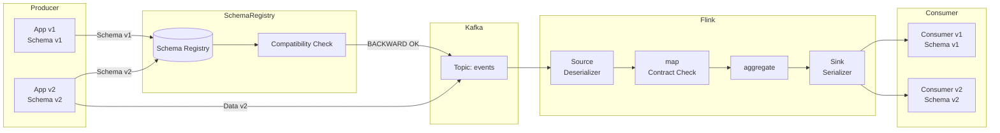
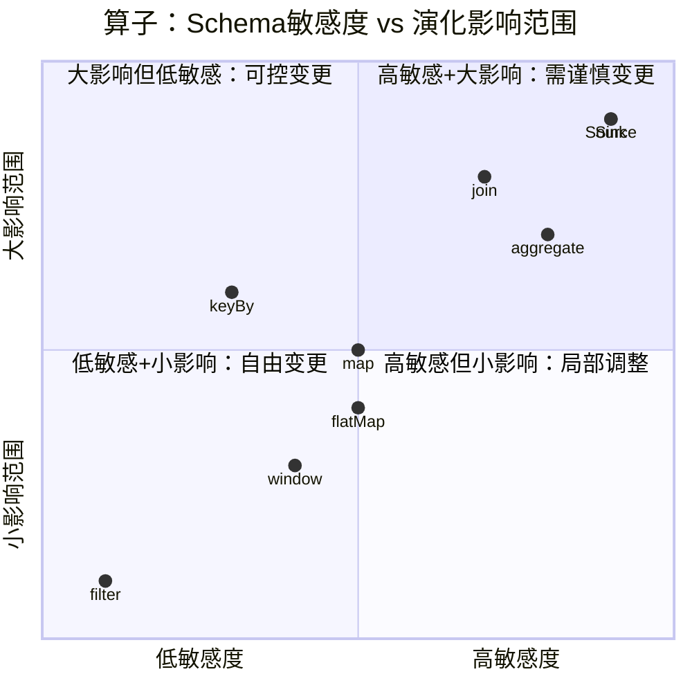

# 算子与Schema演化及数据契约

> **所属阶段**: Knowledge/07-best-practices | **前置依赖**: [01.06-single-input-operators.md](../01-concept-atlas/operator-deep-dive/01.06-single-input-operators.md), [operator-evolution-and-version-compatibility.md](operator-evolution-and-version-compatibility.md) | **形式化等级**: L3
> **文档定位**: 流处理算子层面的Schema管理、数据契约设计与演化策略
> **版本**: 2026.04

---

## 目录

- [算子与Schema演化及数据契约](#算子与schema演化及数据契约)
  - [目录](#目录)
  - [1. 概念定义 (Definitions)](#1-概念定义-definitions)
    - [Def-SCH-01-01: 数据契约（Data Contract）](#def-sch-01-01-数据契约data-contract)
    - [Def-SCH-01-02: Schema兼容性等级（Schema Compatibility Level）](#def-sch-01-02-schema兼容性等级schema-compatibility-level)
    - [Def-SCH-01-03: 算子Schema传播（Operator Schema Propagation）](#def-sch-01-03-算子schema传播operator-schema-propagation)
    - [Def-SCH-01-04: Schema Registry](#def-sch-01-04-schema-registry)
  - [2. 属性推导 (Properties)](#2-属性推导-properties)
    - [Lemma-SCH-01-01: map算子的Schema确定性](#lemma-sch-01-01-map算子的schema确定性)
    - [Lemma-SCH-01-02: keyBy不改变Schema结构](#lemma-sch-01-02-keyby不改变schema结构)
    - [Prop-SCH-01-01: aggregate算子的Schema压缩性](#prop-sch-01-01-aggregate算子的schema压缩性)
    - [Prop-SCH-01-02: join算子的Schema膨胀性](#prop-sch-01-02-join算子的schema膨胀性)
  - [3. 关系建立 (Relations)](#3-关系建立-relations)
    - [3.1 算子类型与Schema演化能力](#31-算子类型与schema演化能力)
    - [3.2 Schema Registry与Flink集成架构](#32-schema-registry与flink集成架构)
    - [3.3 数据契约与算子验证的映射](#33-数据契约与算子验证的映射)
  - [4. 论证过程 (Argumentation)](#4-论证过程-argumentation)
    - [4.1 为什么流处理的Schema演化比批处理复杂](#41-为什么流处理的schema演化比批处理复杂)
    - [4.2 Avro vs Protobuf vs JSON Schema的选型](#42-avro-vs-protobuf-vs-json-schema的选型)
    - [4.3 Schema变更的广播通知机制](#43-schema变更的广播通知机制)
  - [5. 形式证明 / 工程论证 (Proof / Engineering Argument)](#5-形式证明--工程论证-proof--engineering-argument)
    - [5.1 数据契约的算子级 enforcement](#51-数据契约的算子级-enforcement)
    - [5.2 Schema演化的版本协商协议](#52-schema演化的版本协商协议)
    - [5.3 状态Schema迁移的工程实现](#53-状态schema迁移的工程实现)
  - [6. 实例验证 (Examples)](#6-实例验证-examples)
    - [6.1 实战：Avro Schema演化流水线](#61-实战avro-schema演化流水线)
    - [6.2 实战：数据契约违规处理](#62-实战数据契约违规处理)
  - [7. 可视化 (Visualizations)](#7-可视化-visualizations)
    - [Schema演化流程图](#schema演化流程图)
    - [算子Schema敏感度矩阵](#算子schema敏感度矩阵)
  - [8. 引用参考 (References)](#8-引用参考-references)

---

## 1. 概念定义 (Definitions)

### Def-SCH-01-01: 数据契约（Data Contract）

数据契约是数据生产者与消费者之间的结构化协议，定义了数据的Schema、语义、质量规则和SLA：

$$\text{Contract} = (\text{Schema}, \text{Semantics}, \text{QualityRules}, \text{SLA})$$

其中：

- Schema: 字段名、类型、是否可空、默认值
- Semantics: 字段业务含义、枚举值定义、单位
- QualityRules: 完整性、唯一性、范围约束
- SLA: 延迟、可用性、数据新鲜度

### Def-SCH-01-02: Schema兼容性等级（Schema Compatibility Level）

Schema兼容性定义了新版本Schema与旧版本数据的兼容程度：

$$\text{Compatibility}(S_{new}, S_{old}) \in \{\text{BACKWARD}, \text{FORWARD}, \text{FULL}, \text{NONE}\}$$

| 等级 | 定义 | 流处理影响 |
|------|------|-----------|
| **BACKWARD** | 新Schema可读旧数据 | 消费者升级后仍可读旧生产者数据 |
| **FORWARD** | 旧Schema可读新数据 | 旧消费者仍可读新生产者数据 |
| **FULL** | 同时满足BACKWARD+FORWARD | 最安全，但限制最多 |
| **NONE** | 无兼容性保证 | 需全量停机迁移 |

### Def-SCH-01-03: 算子Schema传播（Operator Schema Propagation）

算子Schema传播是指算子输出Schema由其输入Schema和算子逻辑唯一确定的映射关系：

$$\text{Schema}_{out} = \mathcal{F}_{op}(\text{Schema}_{in})$$

其中 $\mathcal{F}_{op}$ 为算子的Schema变换函数。

### Def-SCH-01-04: Schema Registry

Schema Registry是集中式的Schema存储与版本管理服务，提供：

- Schema注册与版本控制
- 兼容性检查
- Schema查询与发现
- 序列化器/反序列化器生成

主流实现：Confluent Schema Registry（Avro/JSON Schema/Protobuf）、AWS Glue Schema Registry、Azure Schema Registry。

---

## 2. 属性推导 (Properties)

### Lemma-SCH-01-01: map算子的Schema确定性

对于 `map` 算子，若映射函数 $f: A \to B$ 是确定性的，则输出Schema完全由输入Schema和 $f$ 的类型签名决定：

$$\text{Schema}_{out}^{map} = \text{Type}(f(\text{Schema}_{in}))$$

**推论**: `map` 算子的Schema演化可直接追踪到输入Schema的变更。

### Lemma-SCH-01-02: keyBy不改变Schema结构

`keyBy` 算子仅按指定字段重新分区，不改变记录的结构：

$$\text{Schema}_{out}^{keyBy} = \text{Schema}_{in}$$

### Prop-SCH-01-01: aggregate算子的Schema压缩性

`aggregate` 算子的输出Schema通常比输入Schema更"窄"（字段更少）：

$$|\text{Schema}_{out}^{aggregate}| \leq |\text{Schema}_{in}|$$

**工程意义**: 聚合算子天然是Schema信息的损失层，需要在契约中显式定义聚合后的字段语义。

### Prop-SCH-01-02: join算子的Schema膨胀性

`join` 算子的输出Schema是两个输入Schema的笛卡尔积式合并：

$$\text{Schema}_{out}^{join} = \text{Schema}_{left} \cup \text{Schema}_{right}$$

**风险**: 左右流字段名冲突时，需显式重命名（如 `left.id` vs `right.id`）。

---

## 3. 关系建立 (Relations)

### 3.1 算子类型与Schema演化能力

| 算子 | Schema变换 | 演化敏感度 | 兼容性风险 |
|------|-----------|-----------|-----------|
| **Source** | 外部Schema → 内部类型 | 🔴 高 | 上游Schema变更直接影响Pipeline |
| **map** | 字段增删改 | 🟡 中 | 取决于映射函数的实现 |
| **filter** | 无变换 | 🟢 低 | 仅影响数据量 |
| **flatMap** | 1→N字段映射 | 🟡 中 | 输出结构可能与输入无关 |
| **keyBy** | 无结构变换 | 🟢 低 | 键字段类型变更导致分区变化 |
| **aggregate** | 压缩/聚合 | 🔴 高 | 聚合字段语义变更影响结果 |
| **join** | 合并两个Schema | 🔴 高 | 字段冲突、类型不匹配 |
| **window** | 添加窗口元数据 | 🟡 中 | 窗口字段类型固定 |
| **Sink** | 内部类型 → 外部Schema | 🔴 高 | 下游消费方依赖输出Schema |

### 3.2 Schema Registry与Flink集成架构

```
数据生产者
├── Schema注册（Confluent Schema Registry）
│   └── POST /subjects/orders-value/versions
└── 序列化（AvroSerializer with Schema ID）

Kafka
├── Key: byte[]
└── Value: [MagicByte(1)][SchemaID(4)][AvroPayload(N)]

Flink消费者
├── Schema解析（ConfluentRegistryAvroDeserializationSchema）
│   └── 从Registry获取Schema by ID
├── 类型映射（Avro → Flink TypeInformation）
└── 算子处理
```

### 3.3 数据契约与算子验证的映射

| 契约规则 | 验证位置 | 验证方式 |
|---------|---------|---------|
| 字段非空 | Source / map | `filter(event -> event.getField() != null)` |
| 数值范围 | map / ProcessFunction | `if (value < 0) ctx.output(invalidTag, event)` |
| 枚举值 | map | `if (!EnumSet.contains(value)) ...` |
| 唯一性 | keyed aggregate | `state.get(key) == null` |
| 外键存在 | AsyncFunction | 异步查询维度表验证 |
| 格式合规 | Source反序列化 | Schema Registry校验 |

---

## 4. 论证过程 (Argumentation)

### 4.1 为什么流处理的Schema演化比批处理复杂

**批处理**:

- Schema在作业启动时确定
- Schema变更 = 修改代码 + 重跑作业
- 无历史状态负担

**流处理**:

- Schema在运行时可变
- Schema变更必须兼容正在处理的数据和历史状态
- 状态中的数据可能使用旧Schema序列化
- 多消费者可能使用不同版本的Schema

**典型案例**: 订单流增加`vipLevel`字段。批处理只需重跑；流处理需确保：

1. 新数据含`vipLevel`
2. 旧状态数据恢复时`vipLevel`有默认值
3. 下游消费者（可能未升级）能正常读取

### 4.2 Avro vs Protobuf vs JSON Schema的选型

| 维度 | Avro | Protobuf | JSON Schema |
|------|------|----------|-------------|
| Schema演进 | ⭐⭐⭐⭐⭐ | ⭐⭐⭐⭐ | ⭐⭐⭐ |
| 序列化性能 | ⭐⭐⭐⭐ | ⭐⭐⭐⭐⭐ | ⭐⭐ |
| 序列化后大小 | ⭐⭐⭐⭐⭐ | ⭐⭐⭐⭐⭐ | ⭐⭐ |
| 可读性 | ⭐⭐ | ⭐⭐ | ⭐⭐⭐⭐⭐ |
| 动态类型支持 | ⭐⭐⭐⭐ | ⭐⭐ | ⭐⭐⭐⭐⭐ |
| Flink集成 | ⭐⭐⭐⭐⭐ | ⭐⭐⭐ | ⭐⭐⭐ |

**推荐**:

- 内部服务间通信：Protobuf（性能优先）
- Flink流处理Pipeline：Avro（Schema演化+集成度优先）
- 外部API/调试接口：JSON Schema（可读性优先）

### 4.3 Schema变更的广播通知机制

当Schema变更时，需要通知Pipeline中的所有算子：

1. **Schema Registry触发Webhook** → 通知Schema变更
2. **Flink JobManager接收通知** → 评估兼容性影响
3. **兼容性检查**:
   - FULL兼容：自动更新算子Schema，无中断
   - BACKWARD兼容：消费者升级，生产者继续
   - FORWARD兼容：生产者升级，消费者继续
   - NONE：需停机协调升级

---

## 5. 形式证明 / 工程论证 (Proof / Engineering Argument)

### 5.1 数据契约的算子级 enforcement

**问题**: 如何在算子层面强制实施数据契约？

**方案**: 在Source和Sink层植入契约验证算子：

```java
// 契约验证算子
public class ContractEnforcementFunction
    extends RichMapFunction<Event, ValidatedEvent> {

    private transient DataContract contract;
    private transient Counter violationCounter;

    @Override
    public void open(Configuration parameters) {
        contract = DataContractRegistry.load("orders-v2");
        violationCounter = getRuntimeContext()
            .getMetricGroup().counter("contract-violations");
    }

    @Override
    public ValidatedEvent map(Event event) {
        List<Violation> violations = contract.validate(event);
        if (!violations.isEmpty()) {
            violationCounter.inc();
            // 严重违规：抛出异常
            if (violations.stream().anyMatch(Violation::isFatal)) {
                throw new ContractViolationException(violations);
            }
            // 非严重违规：标记但继续
            return new ValidatedEvent(event, violations);
        }
        return new ValidatedEvent(event, Collections.emptyList());
    }
}
```

### 5.2 Schema演化的版本协商协议

**协议流程**:

```
生产者 (Schema v2)          Schema Registry          消费者 (Schema v1)
     |                           |                         |
     |-- 注册 v2 ---------------→|                         |
     |                           |-- 兼容性检查 BACKWARD --|
     |                           |←-- 确认兼容 ------------|
     |                           |                         |
     |-- 写入数据 [v2 ID] ------→|                         |
     |                           |                         |
     |                           |←-- 读取数据 [v2 ID] ----|
     |                           |-- 返回 v2 Schema ------→|
     |                           |                         |
     |                           |                         |-- Avro反序列化 (v2→v1)
     |                           |                         |   (利用Avro的Schema解析)
```

**关键**: Avro的`SchemaResolution`机制允许v2数据被v1消费者读取（只要满足BACKWARD兼容）。

### 5.3 状态Schema迁移的工程实现

当算子状态的POJO Schema变更时，实现自定义`TypeSerializerSnapshot`：

```java
public class OrderSerializerSnapshot
    extends CompositeTypeSerializerSnapshot<Order, OrderSerializer> {

    private static final int CURRENT_VERSION = 2;

    @Override
    protected int getCurrentOuterSnapshotVersion() {
        return CURRENT_VERSION;
    }

    @Override
    protected TypeSerializer<Order> createOuterSerializerWithNestedSerializers(
            TypeSerializer<?>[] nestedSerializers) {
        return new OrderSerializer();
    }

    @Override
    protected OrderSerializer restoreOuterSerializer(
            int readOuterSnapshotVersion,
            TypeSerializer<?>[] restoredNestedSerializers) {
        if (readOuterSnapshotVersion == 1) {
            // V1 → V2 迁移
            return new OrderSerializer.WithMigration(
                oldValue -> new Order(
                    oldValue.getId(),
                    oldValue.getAmount(),
                    "UNKNOWN"  // 新字段默认值
                )
            );
        }
        return new OrderSerializer();
    }
}
```

---

## 6. 实例验证 (Examples)

### 6.1 实战：Avro Schema演化流水线

**场景**: 用户事件流从v1演进到v2，新增`deviceType`字段。

**v1 Schema**:

```json
{
  "type": "record",
  "name": "UserEvent",
  "fields": [
    {"name": "userId", "type": "string"},
    {"name": "eventType", "type": "string"},
    {"name": "timestamp", "type": "long"}
  ]
}
```

**v2 Schema**（BACKWARD兼容）:

```json
{
  "type": "record",
  "name": "UserEvent",
  "fields": [
    {"name": "userId", "type": "string"},
    {"name": "eventType", "type": "string"},
    {"name": "timestamp", "type": "long"},
    {"name": "deviceType", "type": ["null", "string"], "default": null}
  ]
}
```

**Flink配置**:

```java
// Source: 使用Schema Registry动态解析
KafkaSource<UserEvent> source = KafkaSource.<UserEvent>builder()
    .setTopics("user-events")
    .setValueOnlyDeserializer(
        ConfluentRegistryAvroDeserializationSchema.forSpecific(
            UserEvent.class,
            "http://schema-registry:8081"
        )
    )
    .build();

// 算子处理：安全访问新增字段
stream.map(event -> {
    String deviceType = event.getDeviceType() != null
        ? event.getDeviceType()
        : "unknown";
    return new EnrichedEvent(event, deviceType);
});
```

### 6.2 实战：数据契约违规处理

**契约规则**: 订单金额必须 > 0。

```java
OutputTag<Order> invalidAmountTag = new OutputTag<Order>("invalid-amount"){};

stream.process(new ProcessFunction<Order, ValidOrder>() {
    @Override
    public void processElement(Order order, Context ctx, Collector<ValidOrder> out) {
        if (order.getAmount() <= 0) {
            // 违反契约，输出到Side Output
            ctx.output(invalidAmountTag, order);
            getRuntimeContext().getMetricGroup()
                .counter("invalid-amount-count").inc();
        } else {
            out.collect(new ValidOrder(order));
        }
    }
});
```

---

## 7. 可视化 (Visualizations)

### Schema演化流程图



### 算子Schema敏感度矩阵



---

## 8. 引用参考 (References)


---

*关联文档*: [operator-evolution-and-version-compatibility.md](operator-evolution-and-version-compatibility.md) | [01.06-single-input-operators.md](../01-concept-atlas/operator-deep-dive/01.06-single-input-operators.md) | [operator-data-lineage-and-impact-analysis.md](operator-data-lineage-and-impact-analysis.md)
