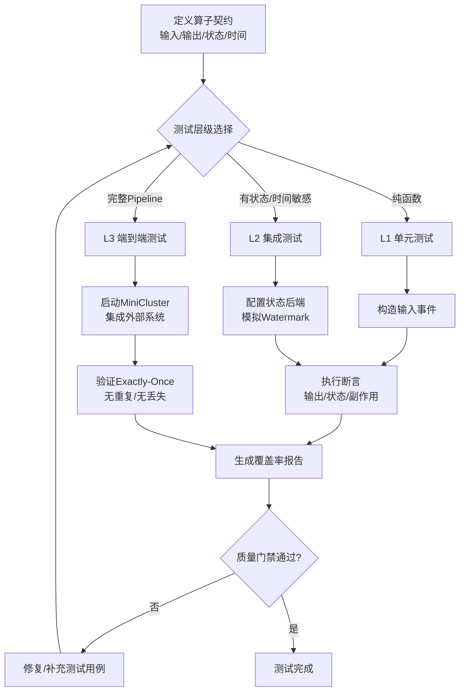
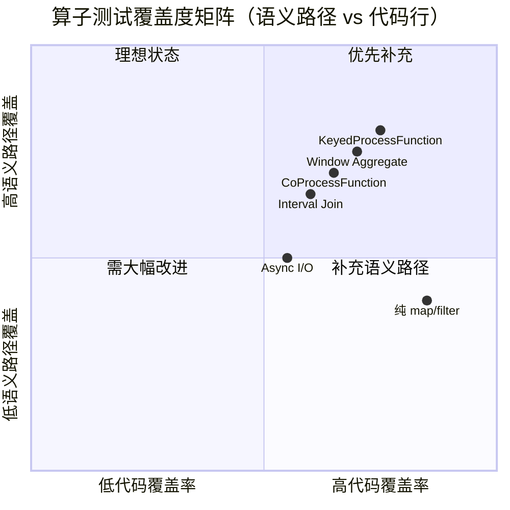
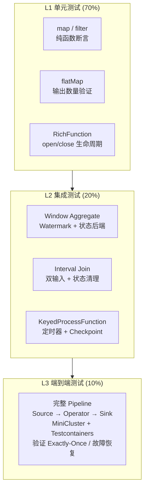
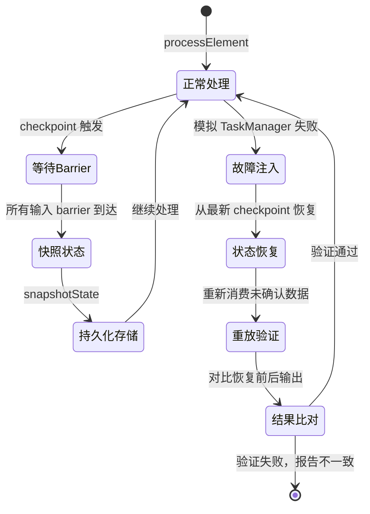
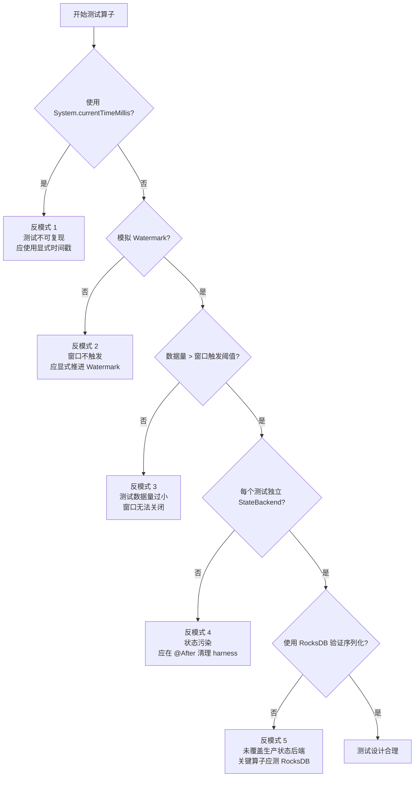

# 流处理算子测试与验证指南

> **所属阶段**: Knowledge/07-best-practices | **前置依赖**: [07.07-testing-strategies-complete.md](./07.07-testing-strategies-complete.md), [Flink/02-core/state-management.md](../../Flink/02-core/flink-state-management-complete-guide.md) | **形式化等级**: L4
> **最后更新**: 2026-04-30

---

## 目录

- [流处理算子测试与验证指南](#流处理算子测试与验证指南)
  - [目录](#目录)
  - [1. 概念定义 (Definitions)](#1-概念定义-definitions)
    - [Def-TEST-01-01（算子测试分层模型）](#def-test-01-01算子测试分层模型)
    - [Def-TEST-01-02（Flink TestHarness）](#def-test-01-02flink-testharness)
    - [Def-TEST-01-03（确定性测试时间）](#def-test-01-03确定性测试时间)
    - [Def-TEST-01-04（测试数据生成器）](#def-test-01-04测试数据生成器)
    - [Def-TEST-01-05（状态一致性验证）](#def-test-01-05状态一致性验证)
  - [2. 属性推导 (Properties)](#2-属性推导-properties)
    - [Prop-TEST-01-01（TestHarness 测试隔离性）](#prop-test-01-01testharness-测试隔离性)
    - [Lemma-TEST-01-01（Watermark 单调性保证）](#lemma-test-01-01watermark-单调性保证)
    - [Prop-TEST-01-02（Checkpoint 恢复幂等性）](#prop-test-01-02checkpoint-恢复幂等性)
    - [Lemma-TEST-01-02（有状态算子延迟下界）](#lemma-test-01-02有状态算子延迟下界)
  - [3. 关系建立 (Relations)](#3-关系建立-relations)
    - [3.1 测试分层与工具映射关系](#31-测试分层与工具映射关系)
    - [3.2 TestHarness 与 MiniCluster 的层次关系](#32-testharness-与-minicluster-的层次关系)
    - [3.3 测试数据策略与场景映射](#33-测试数据策略与场景映射)
  - [4. 论证过程 (Argumentation)](#4-论证过程-argumentation)
    - [4.1 为什么流处理算子需要专门的测试框架](#41-为什么流处理算子需要专门的测试框架)
    - [4.2 状态后端选择对测试行为的影响论证](#42-状态后端选择对测试行为的影响论证)
    - [4.3 exactly-once 语义验证的边界条件](#43-exactly-once-语义验证的边界条件)
  - [5. 形式证明 / 工程论证 (Proof / Engineering Argument)](#5-形式证明--工程论证-proof--engineering-argument)
    - [Thm-TEST-01-01（算子测试完备性定理）](#thm-test-01-01算子测试完备性定理)
    - [5.1 验证流程的工程规范](#51-验证流程的工程规范)
    - [5.2 覆盖度矩阵的工程论证](#52-覆盖度矩阵的工程论证)
  - [6. 实例验证 (Examples)](#6-实例验证-examples)
    - [6.1 实例一：KeyedProcessFunction 单元测试（L1 + L2）](#61-实例一keyedprocessfunction-单元测试l1--l2)
    - [6.2 实例二：Window Aggregate 测试（L2）](#62-实例二window-aggregate-测试l2)
    - [6.3 实例三：Interval Join 测试（L2）](#63-实例三interval-join-测试l2)
    - [6.4 实例四：端到端 exactly-once 验证（L3）](#64-实例四端到端-exactly-once-验证l3)
    - [6.5 实例五：Datafaker 流事件生成器](#65-实例五datafaker-流事件生成器)
  - [7. 可视化 (Visualizations)](#7-可视化-visualizations)
    - [7.1 算子测试金字塔](#71-算子测试金字塔)
    - [7.2 状态验证与 exactly-once 验证流程](#72-状态验证与-exactly-once-验证流程)
    - [7.3 测试反模式决策树](#73-测试反模式决策树)
  - [8. 常见测试反模式](#8-常见测试反模式)
    - [8.1 反模式一：使用真实时间而非事件时间](#81-反模式一使用真实时间而非事件时间)
    - [8.2 反模式二：未模拟 Watermark 推进](#82-反模式二未模拟-watermark-推进)
    - [8.3 反模式三：测试数据量过小未触发窗口](#83-反模式三测试数据量过小未触发窗口)
    - [8.4 反模式四：未清理 TestHarness 状态](#84-反模式四未清理-testharness-状态)
    - [8.5 反模式五：仅使用 HashMapStateBackend 测试](#85-反模式五仅使用-hashmapstatebackend-测试)
  - [9. 引用参考 (References)](#9-引用参考-references)

## 1. 概念定义 (Definitions)

### Def-TEST-01-01（算子测试分层模型）

流处理算子测试分层模型定义了从纯函数到完整数据管道的三级验证体系：

$$
\text{OperatorTestingModel} = \langle L_1^{\text{Unit}}, L_2^{\text{Integration}}, L_3^{\text{E2E}} \rangle
$$

其中：

- $L_1^{\text{Unit}}$：单元测试层，覆盖纯函数算子（map/filter/flatMap），验证单记录转换逻辑，执行时间 $< 100\text{ms}$；
- $L_2^{\text{Integration}}$：集成测试层，覆盖有状态算子（window/aggregate/join），验证状态管理与时间语义交互，执行时间 $1\text{-}10\text{s}$；
- $L_3^{\text{E2E}}$：端到端测试层，覆盖完整 Pipeline（含 Source/Sink），验证作业级正确性与容错恢复，执行时间 $10\text{-}60\text{s}$。

测试金字塔的理想比例为 $L_1 : L_2 : L_3 = 70\% : 20\% : 10\%$[^1]。

### Def-TEST-01-02（Flink TestHarness）

`TestHarness` 是 Flink 提供的专门用于隔离测试流算子的运行时模拟器，其结构为：

$$
\text{TestHarness} = \langle \text{Environment}, \text{Operator}, \text{StateBackend}, \text{TimeService}, \text{OutputCollector} \rangle
$$

Flink 提供四类 TestHarness[^2]：

- `OneInputStreamOperatorTestHarness`：单输入 DataStream 算子测试；
- `KeyedOneInputStreamOperatorTestHarness`：KeyedStream 算子测试，需额外提供 `KeySelector` 与 `TypeInformation`；
- `TwoInputStreamOperatorTestHarness`：ConnectedStreams 双输入算子测试；
- `KeyedTwoInputStreamOperatorTestHarness`：双 KeyedStream 输入算子测试（如 Interval Join）。

此外，Flink 自 1.11 起提供 `ProcessFunctionTestHarnesses` 工厂类，简化 `ProcessFunction` 及其变体（`KeyedProcessFunction`、`KeyedCoProcessFunction`、`BroadcastProcessFunction`）的测试用例编写[^3]。

### Def-TEST-01-03（确定性测试时间）

确定性测试时间指在测试执行过程中，事件时间（Event Time）与处理时间（Processing Time）完全由测试代码显式控制，而非依赖系统时钟：

$$
\text{DeterministicTime} \iff \forall t_{\text{event}}, t_{\text{proc}} \in \text{Test}: t_{\text{event}} = f_{\text{test}}(i) \land t_{\text{proc}} = g_{\text{test}}(j)
$$

其中 $f_{\text{test}}$ 和 $g_{\text{test}}$ 为测试代码中显式指定的时间函数，$i, j$ 为输入元素的序号或测试步骤索引。通过 `processElement(record, timestamp)` 控制事件时间，`setProcessingTime(timestamp)` 控制处理时间[^4]。

### Def-TEST-01-04（测试数据生成器）

测试数据生成器是用于自动化构造大规模、结构化、语义合理的流事件数据的工具。主流方案包括：

- **Datafaker**：Java/Kotlin 库，支持 233+ 数据提供者，可生成姓名、地址、时间戳、金融数据等，支持可重复随机种子（seed）与批量流式生成[^5]；
- **Schema Registry + Avro/Protobuf**：基于 Confluent Schema Registry 或 AWS Glue Schema Registry 的 schema 驱动生成，确保数据格式与生产一致[^6]；
- **事件时间生成器**：根据业务场景生成带单调递增或故意乱序时间戳的事件流，用于验证 watermark 策略与窗口行为。

### Def-TEST-01-05（状态一致性验证）

状态一致性验证指通过模拟 checkpoint 创建、状态快照持久化与状态恢复，验证算子在故障恢复后状态的正确性：

$$
\text{StateConsistent}(O) \iff \forall \text{ckpt}: \text{Restore}(\text{Snapshot}(O, \text{ckpt})) \equiv O_{\text{pre-failure}}
$$

其中 $\text{Snapshot}(O, \text{ckpt})$ 为算子 $O$ 在 checkpoint 时的状态快照，$\text{Restore}$ 为从快照恢复后的算子状态，$\equiv$ 表示状态等价。Flink TestHarness 提供 `snapshot(checkpointId, timestamp)` 和 `initializeState(stateHandles)` 方法直接支持该验证[^7]。

---

## 2. 属性推导 (Properties)

### Prop-TEST-01-01（TestHarness 测试隔离性）

每个 TestHarness 实例在内存中维护独立的状态后端与输出队列：

$$
\forall h_1, h_2 \in \text{TestHarnesses}: \text{State}(h_1) \cap \text{State}(h_2) = \emptyset \land \text{Output}(h_1) \cap \text{Output}(h_2) = \emptyset
$$

该性质确保并发执行多个测试用例时不会产生状态污染或输出交叉，前提是每个 `@Test` 方法独立创建 TestHarness 实例并在 `@After` 中调用 `harness.close()`[^8]。

### Lemma-TEST-01-01（Watermark 单调性保证）

在 TestHarness 中手动推进 watermark 时，若满足

$$
\forall w_i, w_{i+1} \in \text{Watermarks}: w_{i+1} \geq w_i
$$

则窗口算子的触发具有确定性。即对于相同的输入事件集合与 watermark 序列，窗口计算结果始终一致。

*推导*：Flink 窗口算子仅在收到 watermark $w \geq \text{window-end-time}$ 时才触发计算。若 watermark 单调不减，则触发时机唯一确定；若 watermark 回退，行为未定义，可能导致窗口重复触发或结果不一致。∎

### Prop-TEST-01-02（Checkpoint 恢复幂等性）

对于支持 exactly-once 语义的状态算子，checkpoint/restore 循环满足：

$$
\text{Restore}(\text{Snapshot}(O)) \equiv O \implies \forall n \geq 1: (\text{Restore} \circ \text{Snapshot})^n(O) \equiv O
$$

即在无新输入的条件下，多次快照-恢复操作后算子状态保持不变。该性质是端到端 exactly-once 语义的基础[^9]。

### Lemma-TEST-01-02（有状态算子延迟下界）

使用 RocksDB 状态后端的 keyed window/aggregate/join 算子，单记录处理延迟满足：

$$
L_{\text{stateful}} \geq t_{\text{serde}} + t_{\text{rocksdb\_seek}} + t_{\text{udf}}
$$

其中 $t_{\text{rocksdb\_seek}}$ 在 SSD 上约为 $1\text{-}10\,\mu\text{s}$，在内存（HashMapStateBackend）中约为 $100\,\text{ns}$。因此，集成测试中状态后端的选择直接影响算子行为验证的侧重点：内存后端验证逻辑正确性，RocksDB 后端验证序列化与大状态行为[^10]。

---

## 3. 关系建立 (Relations)

### 3.1 测试分层与工具映射关系

| 测试层级 | 目标算子 | 核心测试工具 | 状态后端 | 时间控制方式 | 典型执行时间 |
|---------|---------|------------|---------|-----------|-----------|
| $L_1$ 单元测试 | map, filter, flatMap, 纯 UDF | `OneInputStreamOperatorTestHarness` | 无需 / 内存 | `processElement(ts)` | $< 100\,\text{ms}$ |
| $L_2$ 集成测试 | window, aggregate, join, ProcessFunction | `KeyedOneInputStreamOperatorTestHarness`, `TwoInputStreamOperatorTestHarness` | HashMapStateBackend / EmbeddedRocksDBStateBackend | `processWatermark()`, `setProcessingTime()` | $1\text{-}10\,\text{s}$ |
| $L_3$ 端到端测试 | 完整 Pipeline | `MiniClusterWithClientResource`, Testcontainers | 完整配置 | 系统时间 / 注入时间 | $10\text{-}60\,\text{s}$ |

### 3.2 TestHarness 与 MiniCluster 的层次关系

```
┌─────────────────────────────────────────────────────────────────┐
│                     流处理测试技术栈                              │
├─────────────────────────────────────────────────────────────────┤
│  L3 端到端测试   │  MiniCluster + Testcontainers (Kafka/PG)      │
├─────────────────────────────────────────────────────────────────┤
│  L2 集成测试     │  KeyedOneInputStreamOperatorTestHarness       │
│                  │  TwoInputStreamOperatorTestHarness            │
├─────────────────────────────────────────────────────────────────┤
│  L1 单元测试     │  OneInputStreamOperatorTestHarness            │
│                  │  ProcessFunctionTestHarnesses 工厂类          │
├─────────────────────────────────────────────────────────────────┤
│  基础设施        │  JUnit 5 + AssertJ + Datafaker + Mockito      │
└─────────────────────────────────────────────────────────────────┘
```

### 3.3 测试数据策略与场景映射

| 数据策略 | 工具 | 适用场景 | 状态确定性 | 数据量 |
|---------|------|---------|-----------|--------|
| 固定硬编码 | 手动构造 POJO | 回归测试、边界值验证 | 完全确定 | 小（10-100条）|
| 随机生成 | Datafaker + seed | 模糊测试、覆盖率提升 | 可重复（固定seed）| 中（1K-10K条）|
| Schema 驱动 | Schema Registry + Avro | 集成测试、格式兼容性 | 由 schema 约束 | 大（10K+条）|
| 生产子集采样 | 脱敏后的真实数据 | 性能测试、端到端验证 | 不确定 | 极大（百万条）|

---

## 4. 论证过程 (Argumentation)

### 4.1 为什么流处理算子需要专门的测试框架

传统单元测试框架（如 JUnit）在测试流处理算子时面临三重根本性缺失：

**1. 时间语义缺失**

传统测试框架无法表达事件时间与 watermark 的推进逻辑。对于如下窗口聚合算子：

```java
// 传统方式：无法测试时间语义
@Test
public void badWindowTest() {
    // 无法模拟 watermark 触发窗口关闭
    // 无法控制事件时间戳
    // 结果：测试无法覆盖窗口计算路径
}
```

**2. 状态不可见性**

有状态算子（如 `KeyedProcessFunction`）的内部状态对传统测试框架是黑盒。开发者无法验证状态值在多次输入后的累积是否正确，也无法验证 checkpoint 后状态恢复的准确性。

**3. 异步执行复杂性**

流处理是持续异步的，传统断言 `assertEquals(expected, actual)` 在数据未完全处理时可能产生 flaky 结果。TestHarness 通过同步的 `processElement` 与 `extractOutputValues` 将异步流转换为同步验证模型[^11]。

Flink TestHarness 的解决路径：

```java
// TestHarness 方式：完整控制时间与状态
@Test
public void goodWindowTest() throws Exception {
    KeyedOneInputStreamOperatorTestHarness<String, Event, Result> harness = ...;
    harness.processElement(event1, 1000L);   // 显式指定事件时间
    harness.processElement(event2, 2500L);
    harness.processWatermark(new Watermark(3000L)); // 显式推进 watermark
    // 同步验证输出
    assertThat(harness.extractOutputValues()).containsExactly(expectedResult);
}
```

### 4.2 状态后端选择对测试行为的影响论证

在 $L_2$ 集成测试中，状态后端的选择决定了测试验证的侧重点：

| 状态后端 | 验证重点 | 局限 |
|---------|---------|------|
| `HashMapStateBackend` | 算子逻辑正确性、时间语义 | 无法发现序列化 bug、状态过大时 OOM |
| `EmbeddedRocksDBStateBackend` | 序列化正确性、大状态行为、增量 checkpoint | 测试执行时间增加 2-5 倍 |

**论证**：生产环境通常使用 RocksDB 状态后端，因此 $L_2$ 测试必须至少在关键算子上使用 `EmbeddedRocksDBStateBackend` 进行验证，以确保序列化器（`TypeSerializer`）升级后的兼容性。然而，日常开发中的快速反馈循环应以 `HashMapStateBackend` 为主，以降低测试执行成本[^12]。

### 4.3 exactly-once 语义验证的边界条件

Flink 的 exactly-once 语义基于 Chandy-Lamport 分布式快照算法，通过 barrier 对齐实现状态一致性[^13]。在测试中需验证以下边界：

1. **Barrier 对齐路径**：多输入算子（join/co-group）必须等待所有输入通道的 barrier 到达后才快照状态；
2. **Unaligned checkpoint 路径**：Flink 1.11+ 支持非对齐 checkpoint，将 inflight 数据纳入快照，测试需验证反压场景下的恢复行为；
3. **At-least-once 降级路径**：当 barrier 对齐超时时，系统降级为 at-least-once，测试需验证该降级不会导致状态损坏。

---

## 5. 形式证明 / 工程论证 (Proof / Engineering Argument)

### Thm-TEST-01-01（算子测试完备性定理）

对于流处理算子 $O$，测试套件 $S$ 达到完备覆盖当且仅当满足：

$$
\forall p \in \text{Paths}(O), \exists s \in S: \text{Covers}(s, p)
$$

其中 $\text{Paths}(O)$ 包含以下六类执行路径：

1. **正常处理路径**：单条或多条记录按序处理；
2. **Watermark 触发路径**：窗口因 watermark 推进而关闭并输出；
3. **定时器触发路径**：Processing Time / Event Time 定时器到期触发 `onTimer`；
4. **Checkpoint 快照路径**：barrier 到达后执行 `snapshotState`；
5. **故障恢复路径**：从 checkpoint/savepoint 恢复后状态正确性；
6. **迟到数据路径**：窗口关闭后到达的数据进入侧输出或更新结果。

**工程论证**：实践中通过分层测试实现完备覆盖：

- $L_1$ 单元测试覆盖路径 1（正常处理）；
- $L_2$ 集成测试覆盖路径 2、3、4、6（时间语义 + 状态管理）；
- $L_3$ 端到端测试覆盖路径 5（故障恢复）。

### 5.1 验证流程的工程规范

流处理算子验证应遵循以下标准化流程：



*图 5.1：流处理算子验证标准化流程图*

### 5.2 覆盖度矩阵的工程论证

算子测试覆盖度不仅指代码行覆盖率，更强调语义路径覆盖率。下表给出不同算子类型的最低覆盖度要求：



*图 5.2：算子测试覆盖度矩阵——语义路径覆盖率与代码行覆盖率的象限分布*

**论证**：纯 map/filter 算子代码行覆盖率高但语义路径简单（无非确定性因素）；而 Interval Join 与 Async I/O 因涉及双输入同步与超时处理，语义路径复杂，需重点补充测试用例[^14]。

---

## 6. 实例验证 (Examples)

### 6.1 实例一：KeyedProcessFunction 单元测试（L1 + L2）

以下示例展示如何使用 `KeyedOneInputStreamOperatorTestHarness` 测试带状态与定时器的 `KeyedProcessFunction`，覆盖正常处理路径、定时器触发路径与 checkpoint 恢复路径。

```java
import org.apache.flink.api.common.typeinfo.Types;
import org.apache.flink.api.common.state.ValueState;
import org.apache.flink.api.common.state.ValueStateDescriptor;
import org.apache.flink.configuration.Configuration;
import org.apache.flink.streaming.api.functions.KeyedProcessFunction;
import org.apache.flink.streaming.api.operators.KeyedProcessOperator;
import org.apache.flink.streaming.runtime.streamrecord.StreamRecord;
import org.apache.flink.streaming.util.KeyedOneInputStreamOperatorTestHarness;
import org.apache.flink.streaming.util.OneInputStreamOperatorTestHarness;
import org.apache.flink.util.Collector;
import org.junit.After;
import org.junit.Before;
import org.junit.Test;

import java.util.List;
import java.util.concurrent.ConcurrentLinkedQueue;

import static org.assertj.core.api.Assertions.assertThat;

/**
 * 带状态计数与超时告警的 KeyedProcessFunction
 */
public class KeyedCounterProcessFunctionTest {

    private KeyedOneInputStreamOperatorTestHarness<String, Event, Alert> harness;

    @Before
    public void setup() throws Exception {
        KeyedCounterProcessFunction function = new KeyedCounterProcessFunction();
        KeyedProcessOperator<String, Event, Alert> operator =
            new KeyedProcessOperator<>(function);

        harness = new KeyedOneInputStreamOperatorTestHarness<>(
            operator,
            Event::getUserId,
            Types.STRING
        );
        harness.setup();
        harness.open();
    }

    @After
    public void teardown() throws Exception {
        if (harness != null) {
            harness.close();
        }
    }

    @Test
    public void testAccumulateCount() throws Exception {
        // Given: 同一用户的两条事件
        harness.processElement(new Event("user1", "click", 1000L), 1000L);
        harness.processElement(new Event("user1", "click", 2000L), 2000L);

        // Then: 验证输出（每条事件触发一次计数输出）
        List<Alert> output = harness.extractOutputValues();
        assertThat(output).hasSize(2);
        assertThat(output.get(0).getCount()).isEqualTo(1);
        assertThat(output.get(1).getCount()).isEqualTo(2);
    }

    @Test
    public void testProcessingTimeTimer() throws Exception {
        // Given: 用户事件，定时器设为处理时间 + 5000ms
        harness.processElement(new Event("user1", "click", 1000L), 1000L);

        // When: 推进处理时间触发定时器
        harness.setProcessingTime(6000L);

        // Then: 验证超时告警输出
        List<Alert> output = harness.extractOutputValues();
        assertThat(output).hasSize(2); // 1条计数 + 1条超时
        Alert timeoutAlert = output.get(1);
        assertThat(timeoutAlert.getType()).isEqualTo("TIMEOUT");
    }

    @Test
    public void testCheckpointRestore() throws Exception {
        // Given: 处理事件并创建 checkpoint
        harness.processElement(new Event("user1", "click", 1000L), 1000L);
        harness.processElement(new Event("user1", "click", 2000L), 2000L);

        // 模拟 checkpoint
        OperatorStateHandles snapshot = harness.snapshot(0L, 0L);

        // When: 关闭旧 harness，新建并恢复状态
        harness.close();
        setup();
        harness.initializeState(snapshot);

        // Then: 再处理一条事件，计数应继承之前状态（2+1=3）
        harness.processElement(new Event("user1", "click", 3000L), 3000L);
        List<Alert> output = harness.extractOutputValues();
        assertThat(output.get(0).getCount()).isEqualTo(3);
    }

    // ========== 被测算子 ==========
    static class KeyedCounterProcessFunction
            extends KeyedProcessFunction<String, Event, Alert> {

        private transient ValueState<Integer> countState;
        private static final long TIMEOUT_MS = 5000L;

        @Override
        public void open(Configuration parameters) {
            countState = getRuntimeContext().getState(
                new ValueStateDescriptor<>("count", Types.INT)
            );
        }

        @Override
        public void processElement(Event event, Context ctx, Collector<Alert> out)
                throws Exception {
            Integer current = countState.value();
            if (current == null) {
                current = 0;
            }
            current++;
            countState.update(current);
            out.collect(new Alert(event.getUserId(), "COUNT", current));

            // 注册处理时间定时器
            ctx.timerService().registerProcessingTimeTimer(
                ctx.timerService().currentProcessingTime() + TIMEOUT_MS
            );
        }

        @Override
        public void onTimer(long timestamp, OnTimerContext ctx, Collector<Alert> out)
                throws Exception {
            out.collect(new Alert(ctx.getCurrentKey(), "TIMEOUT", countState.value()));
            countState.clear();
        }
    }

    // ========== 数据类 ==========
    static class Event {
        private final String userId;
        private final String action;
        private final long timestamp;
        // constructor, getters...
        public Event(String userId, String action, long timestamp) {
            this.userId = userId; this.action = action; this.timestamp = timestamp;
        }
        public String getUserId() { return userId; }
        public long getTimestamp() { return timestamp; }
    }

    static class Alert {
        private final String userId;
        private final String type;
        private final int count;
        // constructor, getters...
        public Alert(String userId, String type, int count) {
            this.userId = userId; this.type = type; this.count = count;
        }
        public String getType() { return type; }
        public int getCount() { return count; }
    }
}
```

### 6.2 实例二：Window Aggregate 测试（L2）

以下示例展示 Tumbling Event Time Window 的测试，重点验证 watermark 触发、迟到数据侧输出与增量聚合逻辑。

```java
import org.apache.flink.api.common.typeinfo.Types;
import org.apache.flink.api.java.tuple.Tuple2;
import org.apache.flink.streaming.api.windowing.assigners.TumblingEventTimeWindows;
import org.apache.flink.streaming.api.windowing.time.Time;
import org.apache.flink.streaming.api.windowing.windows.TimeWindow;
import org.apache.flink.streaming.runtime.streamrecord.StreamRecord;
import org.apache.flink.streaming.util.KeyedOneInputStreamOperatorTestHarness;
import org.apache.flink.streaming.util.OneInputStreamOperatorTestHarness;
import org.apache.flink.streaming.api.operators.OneInputStreamOperator;
import org.apache.flink.streaming.api.watermark.Watermark;
import org.junit.Before;
import org.junit.Test;

import java.util.List;

import static org.assertj.core.api.Assertions.assertThat;

/**
 * TumblingWindow Aggregate 集成测试
 */
public class TumblingWindowAggregateTest {

    private KeyedOneInputStreamOperatorTestHarness<String, Tuple2<String, Long>,
            Tuple2<String, Long>> harness;
    private static final long WINDOW_SIZE_MS = 5000L;
    private static final long ALLOWED_LATENESS_MS = 1000L;

    @Before
    public void setup() throws Exception {
        // 构造 WindowOperator（使用 Flink 内部 API，实际项目中可通过 StreamExecutionEnvironment 构建）
        WindowOperator<String, Tuple2<String, Long>, ?, ?, ?> windowOperator =
            WindowOperator.builder()
                .setKeySelector(value -> value.f0)
                .setKeyType(Types.STRING)
                .setWindowAssigner(TumblingEventTimeWindows.of(Time.milliseconds(WINDOW_SIZE_MS)))
                .setAllowedLateness(Time.milliseconds(ALLOWED_LATENESS_MS))
                .setTrigger(EventTimeTrigger.create())
                .setWindowFunction(new AggregateFunction<...>()) // 省略具体实现
                .build();

        harness = new KeyedOneInputStreamOperatorTestHarness<>(
            windowOperator,
            value -> value.f0,
            Types.STRING
        );
        harness.setup();
        harness.open();
    }

    @Test
    public void testWindowAggregation() throws Exception {
        // Given: [0, 5000) 窗口内的 3 条事件
        harness.processElement(Tuple2.of("key1", 100L), 1000L);
        harness.processElement(Tuple2.of("key1", 200L), 2500L);
        harness.processElement(Tuple2.of("key1", 300L), 4000L);

        // When: 推进 watermark 超过窗口结束时间
        harness.processWatermark(new Watermark(5001L));

        // Then: 验证聚合结果（sum = 600）
        List<Tuple2<String, Long>> output = harness.extractOutputValues();
        assertThat(output).hasSize(1);
        assertThat(output.get(0).f1).isEqualTo(600L);
    }

    @Test
    public void testLateDataWithinAllowedLateness() throws Exception {
        // Given: 触发窗口
        harness.processElement(Tuple2.of("key1", 100L), 1000L);
        harness.processWatermark(new Watermark(5001L));

        // When: 在允许延迟范围内发送迟到数据
        harness.processElement(Tuple2.of("key1", 50L), 2000L);
        harness.processWatermark(new Watermark(6001L));

        // Then: 结果应更新为 150
        List<Tuple2<String, Long>> output = harness.extractOutputValues();
        assertThat(output.get(output.size() - 1).f1).isEqualTo(150L);
    }

    @Test
    public void testLateDataToSideOutput() throws Exception {
        OutputTag<Tuple2<String, Long>> lateDataTag =
            new OutputTag<>("late-data") {};

        // Given: 触发窗口
        harness.processElement(Tuple2.of("key1", 100L), 1000L);
        harness.processWatermark(new Watermark(5001L));

        // When: 超出允许延迟范围的迟到数据
        harness.processElement(Tuple2.of("key1", 999L), 6100L);

        // Then: 验证侧输出
        assertThat(harness.getSideOutput(lateDataTag)).hasSize(1);
    }
}
```

### 6.3 实例三：Interval Join 测试（L2）

以下示例展示使用 `KeyedTwoInputStreamOperatorTestHarness` 测试 Interval Join，验证双输入时间对齐与状态清理逻辑。

```java
import org.apache.flink.api.common.typeinfo.Types;
import org.apache.flink.api.java.tuple.Tuple2;
import org.apache.flink.streaming.api.functions.co.ProcessJoinFunction;
import org.apache.flink.streaming.api.windowing.time.Time;
import org.apache.flink.streaming.runtime.streamrecord.StreamRecord;
import org.apache.flink.streaming.util.KeyedTwoInputStreamOperatorTestHarness;
import org.apache.flink.streaming.api.operators.co.IntervalJoinOperator;
import org.apache.flink.util.Collector;
import org.junit.Before;
import org.junit.Test;

import java.util.List;

import static org.assertj.core.api.Assertions.assertThat;

/**
 * Interval Join 算子测试
 */
public class IntervalJoinOperatorTest {

    private KeyedTwoInputStreamOperatorTestHarness<String, Order, Shipment, JoinResult> harness;

    @Before
    public void setup() throws Exception {
        // Interval Join: order 与 shipment 在 [-1h, +1h] 内匹配
        IntervalJoinOperator<String, Order, Shipment, JoinResult> joinOperator =
            new IntervalJoinOperator<>(
                Time.hours(-1).toMilliseconds(),
                Time.hours(1).toMilliseconds(),
                true,  // leftCleanupTime = lowerBound
                true,  // rightCleanupTime = upperBound
                new OrderShipmentJoinFunction()
            );

        harness = new KeyedTwoInputStreamOperatorTestHarness<>(
            joinOperator,
            Order::getOrderId,
            Shipment::getOrderId,
            Types.STRING
        );
        harness.setup();
        harness.open();
    }

    @Test
    public void testMatchWithinInterval() throws Exception {
        // Given: order 与 shipment 在同一 key 且时间差在 30 分钟内
        harness.processElement1(new Order("ORD-001", 1000L), 1000L);
        harness.processElement2(new Shipment("ORD-001", 1200L), 1200L);

        // Then: 验证 join 结果
        List<JoinResult> output = harness.extractOutputValues();
        assertThat(output).hasSize(1);
        assertThat(output.get(0).getOrderId()).isEqualTo("ORD-001");
    }

    @Test
    public void testNoMatchOutsideInterval() throws Exception {
        // Given: order 与 shipment 时间差超过 1 小时
        harness.processElement1(new Order("ORD-002", 1000L), 1000L);
        harness.processElement2(new Shipment("ORD-002", 7200000L), 7200000L); // +2h

        // Then: 无 join 结果
        List<JoinResult> output = harness.extractOutputValues();
        assertThat(output).isEmpty();
    }

    @Test
    public void testStateCleanupAfterWatermark() throws Exception {
        // Given: 输入 order，随后推进 watermark 超过 state 保留时间
        harness.processElement1(new Order("ORD-003", 1000L), 1000L);
        harness.processWatermark1(new Watermark(7200001L)); // 超过 cleanup 时间

        // When: 此时发送匹配的 shipment（已超出 interval）
        harness.processElement2(new Shipment("ORD-003", 2000L), 2000L);

        // Then: 由于 order 状态已被清理，无匹配
        List<JoinResult> output = harness.extractOutputValues();
        assertThat(output).isEmpty();
    }

    // ========== 被测函数与数据类 ==========
    static class OrderShipmentJoinFunction
            extends ProcessJoinFunction<Order, Shipment, JoinResult> {
        @Override
        public void processElement(Order order, Shipment shipment,
                                   Context ctx, Collector<JoinResult> out) {
            out.collect(new JoinResult(order.getOrderId(), order.getTimestamp(),
                                       shipment.getTimestamp()));
        }
    }

    static class Order {
        private final String orderId;
        private final long timestamp;
        public Order(String orderId, long timestamp) {
            this.orderId = orderId; this.timestamp = timestamp;
        }
        public String getOrderId() { return orderId; }
        public long getTimestamp() { return timestamp; }
    }

    static class Shipment {
        private final String orderId;
        private final long timestamp;
        public Shipment(String orderId, long timestamp) {
            this.orderId = orderId; this.timestamp = timestamp;
        }
        public String getOrderId() { return orderId; }
        public long getTimestamp() { return timestamp; }
    }

    static class JoinResult {
        private final String orderId;
        private final long orderTime;
        private final long shipTime;
        // constructor, getters...
        public JoinResult(String orderId, long orderTime, long shipTime) {
            this.orderId = orderId; this.orderTime = orderTime; this.shipTime = shipTime;
        }
        public String getOrderId() { return orderId; }
    }
}
```

### 6.4 实例四：端到端 exactly-once 验证（L3）

以下示例使用 `MiniClusterWithClientResource` 与 Testcontainers 搭建完整测试环境，验证 checkpoint 恢复后的 exactly-once 语义。

```java
import org.apache.flink.api.common.restartstrategy.RestartStrategies;
import org.apache.flink.api.common.time.Time;
import org.apache.flink.contrib.streaming.state.EmbeddedRocksDBStateBackend;
import org.apache.flink.runtime.client.JobCancellationException;
import org.apache.flink.runtime.testutils.MiniClusterResourceConfiguration;
import org.apache.flink.streaming.api.environment.StreamExecutionEnvironment;
import org.apache.flink.streaming.api.functions.sink.SinkFunction;
import org.apache.flink.test.util.MiniClusterWithClientResource;
import org.junit.ClassRule;
import org.junit.Test;
import org.testcontainers.containers.KafkaContainer;
import org.testcontainers.junit.jupiter.Container;
import org.testcontainers.junit.jupiter.Testcontainers;
import org.testcontainers.utility.DockerImageName;

import java.util.ArrayList;
import java.util.Collections;
import java.util.List;
import java.util.concurrent.CopyOnWriteArrayList;

import static org.assertj.core.api.Assertions.assertThat;

/**
 * 端到端 exactly-once 语义验证（使用 MiniCluster + Testcontainers）
 */
@Testcontainers
public class ExactlyOnceEndToEndTest {

    @Container
    public static KafkaContainer kafka = new KafkaContainer(
        DockerImageName.parse("confluentinc/cp-kafka:7.8.0")
    );

    @ClassRule
    public static MiniClusterWithClientResource flinkCluster =
        new MiniClusterWithClientResource(
            new MiniClusterResourceConfiguration.Builder()
                .setNumberSlotsPerTaskManager(2)
                .setNumberTaskManagers(1)
                .build()
        );

    @Test
    public void testExactlyOnceAfterFailure() throws Exception {
        // Given: 配置环境
        StreamExecutionEnvironment env =
            StreamExecutionEnvironment.getExecutionEnvironment();
        env.enableCheckpointing(500);
        env.getCheckpointConfig().setCheckpointingMode(
            CheckpointingMode.EXACTLY_ONCE
        );
        env.setStateBackend(new EmbeddedRocksDBStateBackend(true));
        env.setRestartStrategy(RestartStrategies.fixedDelayRestart(
            3, Time.milliseconds(100)
        ));
        env.setParallelism(2);

        ExactlyOnceSink.values.clear();

        // When: 构建会故意在第 50 条记录失败的 Source
        env.addSource(new FailingCountableSource(50))
            .keyBy(event -> event.getKey())
            .process(new StatefulSummingFunction())
            .addSink(new ExactlyOnceSink());

        env.execute("Exactly-Once E2E Test");

        // Then: 验证无重复、无丢失
        List<Long> results = ExactlyOnceSink.values;
        long uniqueCount = results.stream().distinct().count();
        assertThat(uniqueCount).isEqualTo(results.size()); // 无重复
        assertThat(results).isNotEmpty(); // 有输出
    }

    // ========== 测试辅助类 ==========
    static class ExactlyOnceSink implements SinkFunction<Long> {
        public static final List<Long> values =
            new CopyOnWriteArrayList<>();

        @Override
        public void invoke(Long value, Context context) {
            values.add(value);
        }
    }

    static class FailingCountableSource
            extends RichParallelSourceFunction<Event>
            implements CheckpointedFunction {

        private final int failAtCount;
        private int count = 0;
        private boolean hasFailed = false;
        private transient ListState<Integer> countState;

        public FailingCountableSource(int failAtCount) {
            this.failAtCount = failAtCount;
        }

        @Override
        public void initializeState(FunctionInitializationContext ctx) {
            countState = ctx.getOperatorStateStore().getListState(
                new ListStateDescriptor<>("count", Integer.class)
            );
            if (ctx.isRestored()) {
                for (Integer c : countState.get()) {
                    count = c;
                }
                hasFailed = true;
            }
        }

        @Override
        public void run(SourceContext<Event> ctx) throws Exception {
            while (count < 100) {
                synchronized (ctx.getCheckpointLock()) {
                    ctx.collect(new Event("key-" + (count % 10), count));
                    count++;
                }
                if (count == failAtCount && !hasFailed) {
                    throw new RuntimeException("Simulated failure");
                }
                Thread.sleep(5);
            }
        }

        @Override
        public void snapshotState(FunctionSnapshotContext ctx) throws Exception {
            countState.clear();
            countState.add(count);
        }

        @Override
        public void cancel() {}
    }
}
```

### 6.5 实例五：Datafaker 流事件生成器

以下示例展示使用 Datafaker 生成大规模、可重复的流事件数据，用于 $L_2$ 与 $L_3$ 测试[^15]。

```java
import net.datafaker.Faker;
import org.apache.flink.streaming.api.functions.source.RichParallelSourceFunction;

import java.util.concurrent.TimeUnit;

/**
 * Datafaker 驱动的订单事件生成器
 */
public class DatafakerOrderSource extends RichParallelSourceFunction<OrderEvent> {

    private final long seed;
    private final long eventsPerSecond;
    private final long durationSeconds;
    private volatile boolean running = true;

    public DatafakerOrderSource(long seed, long eventsPerSecond, long durationSeconds) {
        this.seed = seed;
        this.eventsPerSecond = eventsPerSecond;
        this.durationSeconds = durationSeconds;
    }

    @Override
    public void run(SourceContext<OrderEvent> ctx) throws Exception {
        Faker faker = new Faker(new java.util.Random(seed));
        long baseTime = System.currentTimeMillis();
        long intervalMs = 1000 / eventsPerSecond;
        long totalEvents = eventsPerSecond * durationSeconds;

        for (long i = 0; i < totalEvents && running; i++) {
            synchronized (ctx.getCheckpointLock()) {
                // 生成带可控时间戳的事件（故意引入轻微乱序）
                long timestamp = baseTime + i * intervalMs
                    + faker.number().numberBetween(-200, 200);

                OrderEvent event = new OrderEvent(
                    faker.commerce().promotionCode(),           // orderId
                    faker.options().option("BUY", "SELL"),      // side
                    faker.number().randomDouble(2, 10, 10000),  // amount
                    faker.stock().nsdqSymbol(),                 // symbol
                    timestamp
                );
                ctx.collectWithTimestamp(event, timestamp);
            }
            Thread.sleep(intervalMs);
        }
    }

    @Override
    public void cancel() {
        running = false;
    }
}
```

Maven 依赖配置：

```xml
<dependencies>
    <!-- Flink 测试工具 -->
    <dependency>
        <groupId>org.apache.flink</groupId>
        <artifactId>flink-test-utils</artifactId>
        <version>${flink.version}</version>
        <scope>test</scope>
    </dependency>
    <dependency>
        <groupId>org.apache.flink</groupId>
        <artifactId>flink-test-utils-junit</artifactId>
        <version>${flink.version}</version>
        <scope>test</scope>
    </dependency>
    <dependency>
        <groupId>org.apache.flink</groupId>
        <artifactId>flink-runtime</artifactId>
        <version>${flink.version}</version>
        <scope>test</scope>
        <classifier>tests</classifier>
    </dependency>

    <!-- 测试框架 -->
    <dependency>
        <groupId>org.junit.jupiter</groupId>
        <artifactId>junit-jupiter</artifactId>
        <version>5.10.2</version>
        <scope>test</scope>
    </dependency>
    <dependency>
        <groupId>org.assertj</groupId>
        <artifactId>assertj-core</artifactId>
        <version>3.25.3</version>
        <scope>test</scope>
    </dependency>

    <!-- 数据生成 -->
    <dependency>
        <groupId>net.datafaker</groupId>
        <artifactId>datafaker</artifactId>
        <version>2.0.2</version>
        <scope>test</scope>
    </dependency>

    <!-- 集成测试 -->
    <dependency>
        <groupId>org.testcontainers</groupId>
        <artifactId>kafka</artifactId>
        <version>1.19.7</version>
        <scope>test</scope>
    </dependency>
</dependencies>
```

---

## 7. 可视化 (Visualizations)

### 7.1 算子测试金字塔



*图 7.1：流处理算子测试金字塔——L1 单元测试占 70%，L2 集成测试占 20%，L3 端到端测试占 10%*

### 7.2 状态验证与 exactly-once 验证流程



*图 7.2：状态验证与 exactly-once 语义验证状态机*

### 7.3 测试反模式决策树



*图 7.3：流处理算子测试反模式决策树*

---

## 8. 常见测试反模式

### 8.1 反模式一：使用真实时间而非事件时间

**问题描述**：在测试中依赖 `System.currentTimeMillis()` 或 `System.nanoTime()`，导致测试结果不可复现，窗口触发时机不可控。

**错误示例**：

```java
// 错误：使用真实时间
@Test
public void flakyWindowTest() throws Exception {
    harness.processElement(event); // 未指定时间戳，默认使用 System.currentTimeMillis()
    Thread.sleep(6000); // 不可靠的等待
    assertThat(harness.extractOutputValues()).isNotEmpty();
}
```

**正确做法**：

```java
// 正确：显式控制事件时间
@Test
public void stableWindowTest() throws Exception {
    long fixedTimestamp = 1000L;
    harness.processElement(event, fixedTimestamp); // 显式时间戳
    harness.processWatermark(new Watermark(5000L)); // 显式推进 watermark
    assertThat(harness.extractOutputValues()).hasSize(1);
}
```

### 8.2 反模式二：未模拟 Watermark 推进

**问题描述**：输入事件后未发送 watermark，导致 Event Time 窗口永远无法触发，测试始终通过（因为无输出），形成虚假的绿色测试。

**错误示例**：

```java
// 错误：未发送 watermark
@Test
public void brokenWindowTest() throws Exception {
    harness.processElement(event1, 1000L);
    harness.processElement(event2, 2000L);
    // 未发送 watermark！
    assertThat(harness.extractOutputValues()).isEmpty(); // 永远通过，但无意义
}
```

### 8.3 反模式三：测试数据量过小未触发窗口

**问题描述**：Tumbling Window 大小为 5 分钟，但只发送 1-2 条数据就断言窗口结果，未理解窗口触发依赖 watermark 而非数据条数。

**正确做法**：发送 watermark $w \geq \text{window-end-time}$，而非增加数据量。

### 8.4 反模式四：未清理 TestHarness 状态

**问题描述**：在 `@Before` 中创建 TestHarness，但在 `@After` 中未调用 `harness.close()`，导致状态文件句柄泄漏，多测试类执行时端口或目录冲突。

### 8.5 反模式五：仅使用 HashMapStateBackend 测试

**问题描述**：所有 $L_2$ 测试均使用内存状态后端，未覆盖 RocksDB 的序列化路径。生产升级 Flink 版本或变更 `TypeInformation` 后，可能出现序列化兼容性故障。

**推荐策略**：核心有状态算子（聚合、join、ProcessFunction）应至少在 CI  nightly build 中使用 `EmbeddedRocksDBStateBackend` 执行一次完整测试套件[^16]。

---

## 9. 引用参考 (References)

[^1]: M. Fowler, "The Test Pyramid", 2012. <https://martinfowler.com/articles/practical-test-pyramid.html>

[^2]: Apache Flink Documentation, "Testing", 2025. <https://nightlies.apache.org/flink/flink-docs-stable/docs/dev/datastream/testing/>

[^3]: Apache Flink 2.0 Documentation, "Testing — Unit Testing ProcessFunction", 2025. <https://nightlies.apache.org/flink/flink-docs-release-2.0-preview1/docs/dev/datastream/testing/>

[^4]: Apache Flink, "A Guide for Unit Testing in Apache Flink", 2020. <https://flink.apache.org/2020/02/03/a-guide-for-unit-testing-in-apache-flink/>

[^5]: Datafaker Documentation, "Providers Overview", 2024. <https://www.datafaker.net/documentation/providers/>

[^6]: Confluent Documentation, "Schema Registry Overview", 2025. <https://docs.confluent.io/platform/current/schema-registry/index.html>

[^7]: Apache Flink Documentation, "Stateful Stream Processing", 2025. <https://nightlies.apache.org/flink/flink-docs-stable/docs/concepts/stateful-stream-processing/>

[^8]: Diffblue, "Unit Testing using Apache Flink", 2025. <https://www.diffblue.com/resources/unit-testing-using-apache-flink/>

[^9]: Streamkap, "Flink Exactly-Once Semantics: How It Works End-to-End", 2026. <https://streamkap.com/resources-and-guides/flink-exactly-once-semantics>

[^10]: Alibaba Cloud, "Flink Checkpoints Principles and Practices", 2020. <https://www.alibabacloud.com/blog/flink-checkpoints-principles-and-practices-flink-advanced-tutorials_596631>

[^11]: Conduktor, "Testing Strategies for Streaming Applications", 2026. <https://conduktor.io/glossary/testing-strategies-for-streaming-applications>

[^12]: System Internals, "Flink Checkpointing: Barrier Alignment & Exactly-Once Semantics", 2025. <https://systeminternals.dev/flink/checkpointing/>

[^13]: K. Mani Chandy and L. Lamport, "Distributed Snapshots: Determining Global States of Distributed Systems", ACM Transactions on Computer Systems, 3(1), 1985.

[^14]: OneUptime, "How to Implement Flink Exactly-Once Processing", 2026. <https://oneuptime.com/blog/post/2026-01-28-flink-exactly-once-processing/view>

[^15]: Baeldung, "Fake Data in Java with Data Faker", 2022. <https://www.baeldung.com/java-datafaker>

[^16]: Apache Flink Documentation, "State Backends", 2025. <https://nightlies.apache.org/flink/flink-docs-stable/docs/ops/state/state_backends/>

---

*文档版本: v1.0 | 最后更新: 2026-04-30 | 维护者: AnalysisDataFlow Team*
