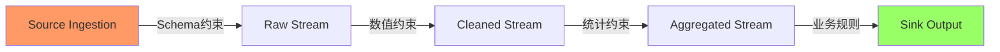
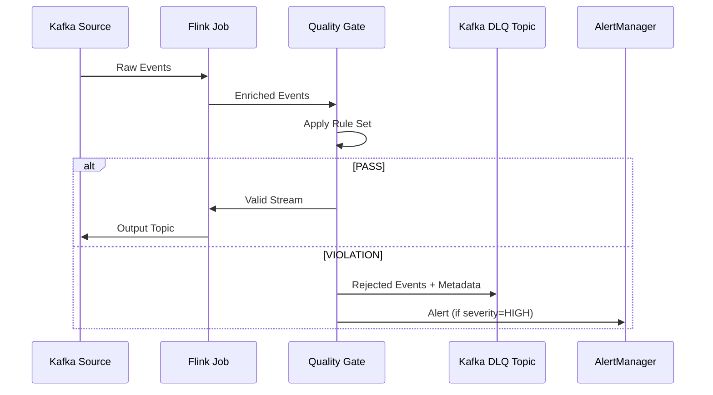
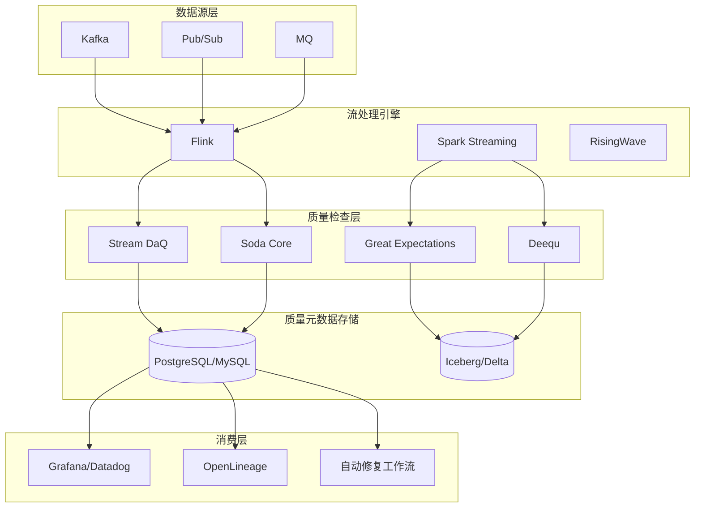
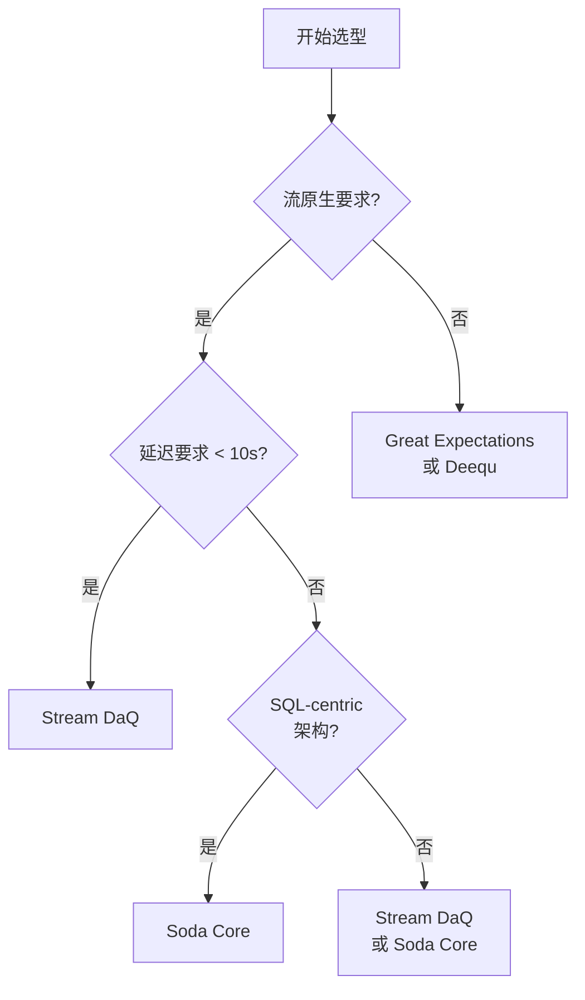
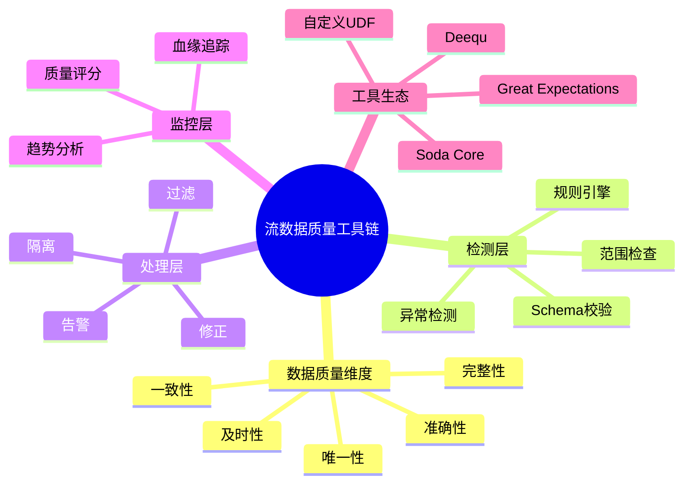
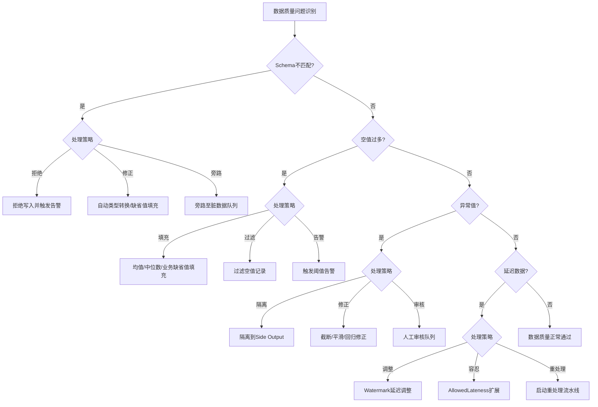
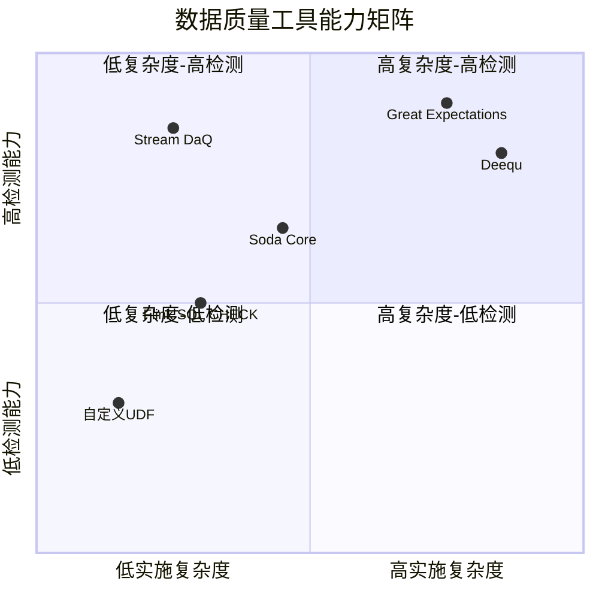

# 流处理数据质量工具链全景指南

> **所属阶段**: Knowledge/07-best-practices | **前置依赖**: [Knowledge/08-standards/streaming-data-governance.md](../08-standards/streaming-data-governance.md)、[Flink/02-core/streaming-etl-best-practices.md](../../Flink/02-core/streaming-etl-best-practices.md) | **形式化等级**: L2-L4 | **最后更新**: 2026-04

---

## 1. 概念定义 (Definitions)

### Def-K-DQ-01: 流数据质量 (Streaming Data Quality)

流数据质量是指在无界数据流的持续摄入、转换与输出过程中，数据满足预设的**准确性 (Accuracy)**、**完整性 (Completeness)**、**一致性 (Consistency)**、**时效性 (Timeliness)** 与**唯一性 (Uniqueness)** 五大维度的程度。

形式化地，设流 $S = \langle e_1, e_2, \dots \rangle$ 中的每个事件 $e_i$ 携带模式 $Schema(S)$，数据质量函数 $Q: S \times \mathcal{R} \rightarrow [0, 1]$ 将流与规则集 $\mathcal{R}$ 映射到质量评分区间：

$$
Q(S, \mathcal{R}) = \frac{1}{|\mathcal{R}|} \sum_{r \in \mathcal{R}} \mathbb{1}[r(S) = \text{true}] \cdot w_r
$$

其中 $w_r$ 为规则 $r$ 的权重，$\sum w_r = 1$。

### Def-K-DQ-02: 实时质量门 (Real-Time Quality Gate)

实时质量门是一个**有状态算子** $G: Stream_{in} \rightarrow Stream_{pass} \times Stream_{reject}$，在事件时间或处理时间窗口内对流入记录执行断言验证，并根据策略将不合格记录分流至死信队列 (DLQ) 或触发告警。

### Def-K-DQ-03: 质量规则类型体系

| 类型 | 语义 | 典型示例 |
|------|------|---------|
| **Schema 约束** | 结构合规性 | 字段存在、类型匹配、非空约束 |
| **数值约束** | 域完整性 | 范围检查、枚举匹配、正则匹配 |
| **关系约束** | 跨记录/跨流一致性 | 外键引用、时序因果关系、水位单调性 |
| **统计约束** | 分布稳定性 | 均值漂移、异常比例阈值、空值率上限 |
| **业务规则** | 领域语义 | 交易金额 > 0、设备ID格式合规 |

---

## 2. 属性推导 (Properties)

### Prop-K-DQ-01: 质量检查延迟下界

对于基于事件时间窗口的统计约束检查，设窗口大小为 $W$，水印延迟为 $\delta$，则质量判定结果的最小延迟为：

$$
T_{quality} \geq W + \delta
$$

**证明概要**: 统计约束需要完整窗口数据才能计算分布指标。在水印到达前，窗口视为未关闭，因此判定必须等待 $W + \delta$。∎

### Prop-K-DQ-02: 规则集单调性

若规则集 $\mathcal{R}_1 \subseteq \mathcal{R}_2$，则对任意流 $S$：

$$
Q(S, \mathcal{R}_2) \leq Q(S, \mathcal{R}_1)
$$

即规则越严格，通过评分越低。

### Prop-K-DQ-03: 质量-吞吐权衡

设质量检查引入的每记录处理开销为 $c$（含序列化/反序列化、断言执行、指标上报），则系统最大吞吐满足：

$$
\lambda_{max} = \frac{1}{c + c_0}
$$

其中 $c_0$ 为业务逻辑本身开销。当 $c \ll c_0$ 时质量检查近似无损；当 $c \sim c_0$ 时吞吐下降可达 30%-50%。

---

## 3. 关系建立 (Relations)

### 关系 1: 流数据质量工具 ↔ Flink 生态

主流工具与 Flink 的集成方式存在显著差异：

- **Great Expectations (GE)**: 通过 `PandasBatch` 或 `SparkDF` 接口间接集成；Flink 需先将流微批化为 DataFrame，**破坏了流语义连续性**。
- **Soda Core**: 提供 SQL-based 质量检查，可直接在 Flink SQL 中通过 `CREATE VIEW` + `CHECK` 语句嵌入，**保持声明式语义**。
- **Deequ**: 基于 Apache Spark Metrics Repository 设计，与 Flink 无原生集成；需通过 Flink→Kafka→Spark Streaming 桥接，**引入架构复杂度**。
- **Stream DaQ (Stream Data Quality)**: 专为流处理设计，提供 Flink UDF/UDAF 原生实现，**最低集成成本**。

### 关系 2: 质量检查层级 ↔ 处理阶段



- **摄入层 (Ingestion)**: Schema 约束 + 格式校验（最低延迟，最低成本）
- **转换层 (Transformation)**: 数值约束 + 关系约束（中等延迟，状态依赖）
- **聚合层 (Aggregation)**: 统计约束 + 漂移检测（最高延迟，窗口依赖）
- **输出层 (Output)**: 业务规则 + 下游契约验证（端到端保证）

---

## 4. 论证过程 (Argumentation)

### 论证: 开源工具链的适用边界

**Great Expectations** 是批处理质量检查的事实标准（10k+ Stars），但其核心抽象 `Batch` 与无界流存在**语义冲突**。在 Flink 场景下的三种适配模式：

| 模式 | 实现 | 优点 | 缺点 |
|------|------|------|------|
| 微批桥接 | Flink→Pandas Batch→GE | 复用现有 Expectation Suite | 微批延迟，状态丢失 |
| 自定义 Runner | 实现 GE `BatchRunner` for Flink | 保留 GE 生态 | 开发成本高，社区支持弱 |
| 侧输出旁路 | Flink 主流程不变，旁路采样→GE | 不影响主流程延迟 | 仅覆盖采样子集，非全量 |

**结论**: GE 更适合 Lambda 架构的批处理分支，而非 Kappa 架构的纯流处理主路径。

### 论证: Stream DaQ 的流原生设计

Stream DaQ 采用**检查点感知 (Checkpoint-Aware)** 的质量状态管理：质量指标状态（如滑动窗口空值率）与 Flink Checkpoint 同步快照，确保 Exactly-Once 语义下的指标不重复不丢失。这与 GE/Deequ 的**外部存储计数**模式形成对比。

---

## 5. 形式证明 / 工程论证 (Proof / Engineering Argument)

### 工程论证: 四大工具链生产选型决策

#### 选型矩阵

| 维度 | Stream DaQ | Soda Core | Great Expectations | Deequ |
|------|-----------|-----------|-------------------|-------|
| **流原生支持** | ✅ 原生 | ⚠️ SQL适配 | ❌ 批为主 | ❌ Spark专用 |
| **Flink集成度** | ⭐⭐⭐⭐⭐ | ⭐⭐⭐⭐ | ⭐⭐ | ⭐ |
| **声明式规则** | YAML + SQL | SQL + YAML | Python DSL | Scala/Spark DSL |
| **实时告警延迟** | 秒级 | 分钟级 | 分钟-小时级 | 批级 |
| **状态管理** | Checkpoint内嵌 | 外部元数据库 | 外部存储 | Spark Metrics Repo |
| **社区活跃度** | 新兴 | 中等 | 高 | 中等 |
| **适用场景** | 高吞吐流核心路径 | SQL-centric湖仓 | 混合Lambda架构 | Spark生态深度用户 |

#### 成本模型

设日处理事件量为 $N$，质量规则数为 $R$，单规则检查成本为 $c_r$：

- **Stream DaQ**: 总成本 $C_{SD} = N \cdot R \cdot c_r^{SD}$，其中 $c_r^{SD}$ 为 JVM 内联执行成本，无跨进程开销。
- **Soda Core**: 总成本 $C_{SC} = N \cdot R \cdot (c_r^{SQL} + c_{scan}^{warehouse})$，需扫描数据湖/仓库。
- **GE (微批)**: 总成本 $C_{GE} = \frac{N}{B} \cdot (T_{batch} + R \cdot c_r^{Python})$，含 Python 进程启动开销 $T_{batch}$。

当 $N > 10^8$/日 且 $p99$ 延迟要求 $< 5$s 时，Stream DaQ 的 TCO 比 GE 微批模式低 **2-3 个数量级**。

---

## 6. 实例验证 (Examples)

### 示例 1: Flink SQL + Soda Core 实时质量检查

```sql
-- 定义质量检查视图
CREATE VIEW user_events_checked AS
SELECT *,
  CASE
    WHEN user_id IS NULL THEN 'MISSING_USER_ID'
    WHEN event_timestamp > PROCTIME() THEN 'FUTURE_TIMESTAMP'
    WHEN amount < 0 THEN 'NEGATIVE_AMOUNT'
    ELSE 'PASS'
  END AS quality_flag
FROM user_events;

-- 质量分流：合格流 vs 死信流
INSERT INTO valid_events
SELECT * FROM user_events_checked WHERE quality_flag = 'PASS';

INSERT INTO dlq_events
SELECT * FROM user_events_checked WHERE quality_flag != 'PASS';
```

**质量指标聚合**（基于 1 分钟滚动窗口）：

```sql
CREATE TABLE quality_metrics (
  check_name STRING,
  pass_rate DOUBLE,
  violation_count BIGINT,
  window_start TIMESTAMP(3),
  PRIMARY KEY (check_name, window_start) NOT ENFORCED
) WITH ('connector' = 'jdbc', ...);

INSERT INTO quality_metrics
SELECT
  quality_flag,
  COUNT(*) * 1.0 / SUM(COUNT(*)) OVER (PARTITION BY TUMBLE(event_timestamp, INTERVAL '1' MINUTE)),
  COUNT(*),
  TUMBLE_START(event_timestamp, INTERVAL '1' MINUTE)
FROM user_events_checked
GROUP BY TUMBLE(event_timestamp, INTERVAL '1' MINUTE), quality_flag;
```

### 示例 2: Stream DaQ 配置式规则定义

```yaml
# stream-daq-config.yaml
stream: user_events
checkpoint_interval: 30s

rules:
  - name: user_id_not_null
    type: schema
    column: user_id
    constraint: not_null
    on_violation: route_to_dlq

  - name: amount_range
    type: numeric
    column: amount
    min: 0
    max: 1000000
    on_violation: alert

  - name: event_time_freshness
    type: timeliness
    column: event_timestamp
    max_latency: 5m
    watermark_field: event_timestamp
```

### 示例 3: 死信队列 (DLQ) 处理模式



---

## 7. 可视化 (Visualizations)

### 数据质量工具链架构全景



### 选型决策树



### 流数据质量工具链思维导图

以下思维导图从中心主题放射展开，覆盖数据质量的核心维度、检测与处理层级、监控体系及主流工具生态。



### 数据质量问题处理决策树

以下决策树展示四类典型数据质量问题的处理路径与策略选择。



### 数据质量工具能力矩阵

以下四象限矩阵以实施复杂度为横轴、检测能力为纵轴，标注各主流工具与自定义方案的相对定位。



---

## 8. 引用参考 (References)
