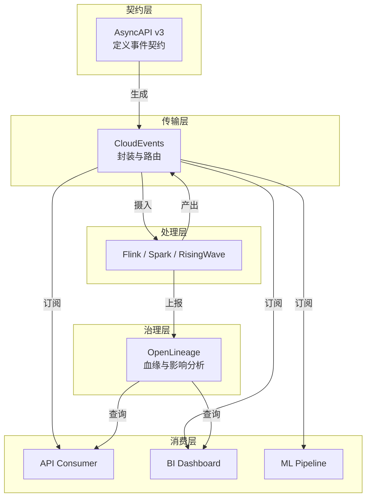
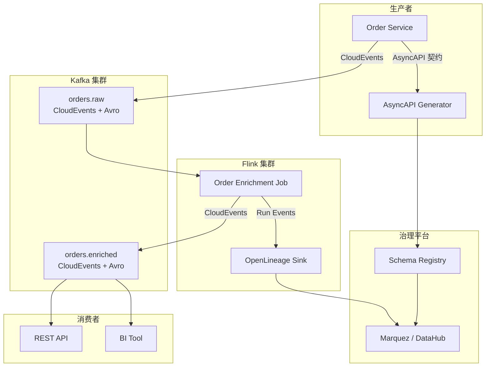
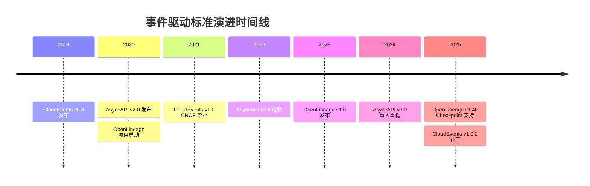
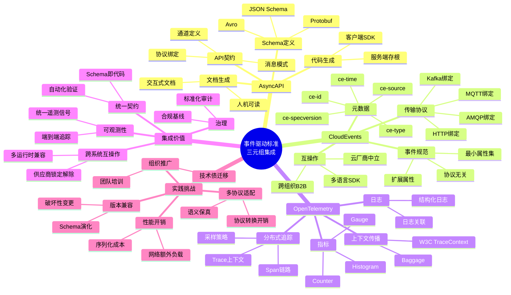
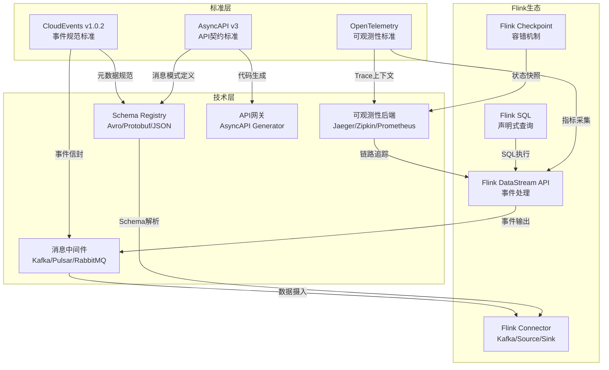
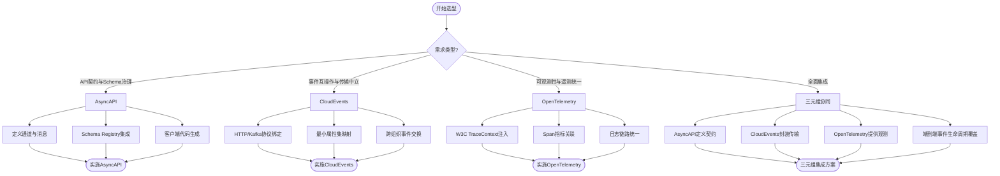
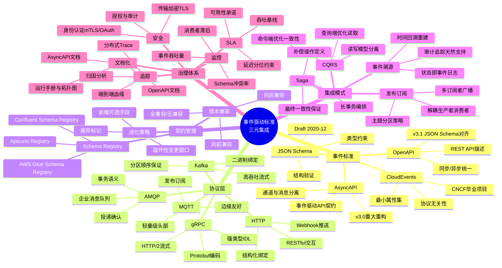
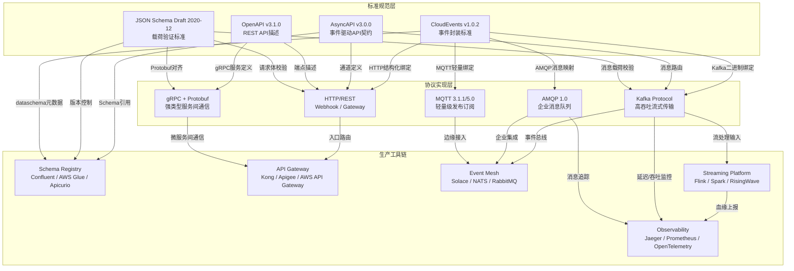
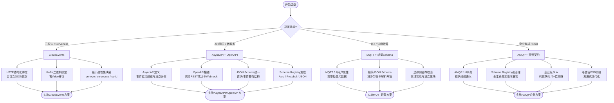

# 事件驱动标准三剑客生产集成指南 (AsyncAPI v3 / OpenLineage 1.40 / CloudEvents)

> **所属阶段**: Knowledge/08-standards | **前置依赖**: [Knowledge/08-standards/streaming-data-governance.md](./streaming-data-governance.md)、[Flink/05-ecosystem/05.01-connectors/kafka-integration-patterns.md](../../Flink/05-ecosystem/05.01-connectors/kafka-integration-patterns.md) | **形式化等级**: L2-L4 | **最后更新**: 2026-04

---

## 1. 概念定义 (Definitions)

### Def-K-ES-01: 事件驱动标准三剑客 (Event-Driven Standards Triad)

在流处理与事件驱动架构 (EDA) 领域，三个互补标准共同构成**互操作、可观测、可治理**的生产级基础：

| 标准 | 治理域 | 核心抽象 | 版本状态 |
|------|--------|---------|---------|
| **CloudEvents** | **事件契约 (Event Contract)** | 规范化的事件信封 (Context Attributes + Data) | v1.0.2 (CNCF Graduated) |
| **AsyncAPI v3** | **API 契约 (API Contract)** | 事件驱动 API 的 OpenAPI 等价物 | v3.0.0 (2024 发布) |
| **OpenLineage 1.40** | **数据血缘 (Data Lineage)** | 作业运行级元数据与依赖追踪 | v1.40.0 (2025) |

三者的关系可形式化为**事件生命周期覆盖**：

$$
Event_{lifecycle} = Contract_{AsyncAPI} \times Transport_{CloudEvents} \times Lineage_{OpenLineage}
$$

即：AsyncAPI 定义**什么事件可以发生**，CloudEvents 定义**事件如何封装传输**，OpenLineage 定义**事件处理产生了什么影响**。

### Def-K-ES-02: CloudEvents 核心属性集

CloudEvents 规范定义了**最小必需属性 (Required Attributes)** 和**扩展属性 (Extension Attributes)**：

```
ce-specversion: "1.0"
ce-type: "com.example.order.created"
ce-source: "https://example.com/orders"
ce-id: "a89b-12cd-..."
ce-time: "2026-04-24T10:00:00Z"
```

**关键设计原则**: 传输协议无关性 (HTTP/Kafka/AMQP/MQTT 均可携带)、规范名前缀 (`ce-` 或二进制模式的消息头映射)、时间戳强制 ISO 8601 格式。

### Def-K-ES-03: AsyncAPI v3 通道与消息分离

AsyncAPI v3 引入**通道 (Channel) 与消息 (Message) 的显式分离**，解决 v2 中消息类型与传输通道紧耦合的问题：

```yaml
asyncapi: '3.0.0'
channels:
  userEvents:
    address: 'user.{userId}.events'
    messages:
      userSignedUp:
        $ref: '#/components/messages/UserSignedUp'
      orderPlaced:
        $ref: '#/components/messages/OrderPlaced'
```

**形式化提升**: v3 的分离使得同一消息类型可在多个通道中复用，且通道参数化 (`{userId}`) 支持动态路由的静态类型检查。

### Def-K-ES-04: OpenLineage 运行事件模型

OpenLineage 定义了**运行事件 (Run Events)** 的三元组：

$$
RunEvent = (Run, Job, Dataset, EventType)
$$

其中：

- **Run**: 单次作业执行的不可变标识
- **Job**: 作业的逻辑定义（名称、命名空间）
- **Dataset**: 输入/输出数据集（名称、格式、存储位置）
- **EventType**: `START` / `COMPLETE` / `FAIL` / `ABORT`

通过追踪 `RunEvent` 序列，可构建**作业-数据集依赖图 (Job-Dataset Dependency Graph)**，实现端到端血缘追踪。

---

## 2. 属性推导 (Properties)

### Prop-K-ES-01: CloudEvents 的可移植性保证

若事件 $e$ 符合 CloudEvents 规范，则对于任意两个符合 CloudEvents 的传输绑定 (HTTP Protocol Binding、Kafka Protocol Binding、MQTT Binding)，事件语义保持：

$$
Semantics(e_{HTTP}) = Semantics(e_{Kafka}) = Semantics(e_{MQTT})
$$

**证明概要**: CloudEvents 规范要求所有传输绑定实现**结构映射的双射**——每个 CloudEvents 属性在目标协议中有且仅有一个映射位置，反之亦然。因此协议转换不丢失信息。∎

### Prop-K-ES-02: AsyncAPI 契约的兼容性判定

设 AsyncAPI 文档 $A$ 定义了通道集合 $C_A$ 和消息类型集合 $M_A$，文档 $B$ 定义了 $C_B$ 和 $M_B$。$B$ 对 $A$ 的**向后兼容 (Backward Compatible)** 当且仅当：

$$
\forall c \in C_A, \forall m \in Messages_A(c) : m \in Messages_B(c) \land Schema_B(m) \supseteq Schema_A(m)
$$

即：$B$ 保留 $A$ 的所有通道和消息类型，且消息模式为超集（允许新增可选字段，禁止删除字段或收紧约束）。

### Prop-K-ES-03: OpenLineage 血缘图的传递闭包

设 OpenLineage 捕获的作业-数据集依赖图为 $G = (J \cup D, E)$，其中 $J$ 为作业节点，$D$ 为数据集节点，$E$ 为输入/输出边。则数据集 $d_{out}$ 对数据集 $d_{in}$ 的**血缘距离**定义为 $G$ 中 $d_{in} \to d_{out}$ 的最短路径长度 $L(d_{in}, d_{out})$。

若 $L(d_{in}, d_{out}) = k$，则任何对 $d_{in}$ 的 Schema 变更可能影响最多 $k$ 跳内的所有下游作业和数据集。

---

## 3. 关系建立 (Relations)

### 关系 1: 三标准在流处理管道中的分层集成



### 关系 2: 与 Schema Registry 的协同

三标准与 Schema Registry (Confluent / AWS Glue / Apicurio) 的关系：

- **AsyncAPI v3**: 原生引用 Schema Registry 中的 Avro/Protobuf/JSON Schema 定义（`schemaFormat: application/vnd.apache.avro+json`）
- **CloudEvents**: 通过扩展属性 `dataschema` 指向 Schema Registry URI，但**不强制**注册表存在
- **OpenLineage**: 在 `Dataset` 元数据中记录 Schema 版本和注册表位置，支持血缘与 Schema 演化的联合分析

---

## 4. 论证过程 (Argumentation)

### 论证: AsyncAPI v3 的通道-消息分离价值

**v2 的痛点**: 在 v2 中，消息定义嵌套于通道内部：

```yaml
# v2 - 消息与通道紧耦合
channels:
  user/signedup:
    subscribe:
      message:
        payload: ...
```

这导致同一 `UserSignedUp` 事件在 `user/signedup` 和 `user/events` 两个通道中需**重复定义**。

**v3 的解决**: 消息提升至 `components/messages`，通道通过 `$ref` 引用。好处：

1. **DRY 原则**: 消息定义单点维护
2. **契约测试**: 可对消息类型独立进行 JSON Schema 验证
3. **代码生成**: 单消息类型生成单语言结构体，减少代码膨胀

### 论证: OpenLineage 在流处理中的实时性挑战

**质疑**: OpenLineage 的运行事件由作业完成后发送，对于长时间运行的 Flink 作业，血缘信息是否实时？

**回应**:

1. **START 事件**: Flink JobManager 在作业启动时即发送 `START` RunEvent，上游血缘立即可见。
2. **CHECKPOINT 事件**: OpenLineage 1.40 扩展支持 `CHECKPOINT` 事件类型，Flink 每次 Checkpoint 成功时发送中间状态，实现**增量血缘更新**。
3. **COMPLETE 事件**: 作业终止（优雅关闭或失败）时发送最终血缘快照。

因此，对于流处理，OpenLineage 提供**近实时 (Near-Real-Time)** 而非严格实时的血缘追踪，满足 99% 的治理场景。

---

## 5. 形式证明 / 工程论证 (Proof / Engineering Argument)

### 工程论证: 三标准生产集成决策矩阵

#### 集成深度评估

| 场景 | CloudEvents | AsyncAPI v3 | OpenLineage | 集成复杂度 |
|------|------------|-------------|-------------|-----------|
| **内部微服务 EDA** | ⭐⭐⭐⭐⭐ | ⭐⭐⭐⭐ | ⭐⭐ | 低 |
| **跨组织 B2B 事件** | ⭐⭐⭐⭐⭐ | ⭐⭐⭐⭐⭐ | ⭐⭐⭐ | 中 |
| **Flink 流处理管道** | ⭐⭐⭐⭐ | ⭐⭐⭐ | ⭐⭐⭐⭐⭐ | 中 |
| **数据湖仓治理** | ⭐⭐⭐ | ⭐⭐ | ⭐⭐⭐⭐⭐ | 中 |
| **IoT 边缘接入** | ⭐⭐⭐⭐⭐ | ⭐⭐⭐ | ⭐ | 低 |

#### 选型规则

```
IF 跨组织事件交换 THEN 必须 CloudEvents + AsyncAPI v3
IF 数据合规/审计需求 THEN 必须 OpenLineage
IF 微服务内部事件 THEN CloudEvents 足够
IF Flink 管道血缘追踪 THEN CloudEvents (传输) + OpenLineage (治理)
IF Schema 强治理 THEN AsyncAPI v3 + Schema Registry + CloudEvents dataschema
```

### 兼容性论证: CloudEvents 与 Kafka 协议绑定

CloudEvents Kafka Protocol Binding 支持两种模式：

| 模式 | 实现 | 优点 | 缺点 |
|------|------|------|------|
| **结构化 (Structured)** | CloudEvents JSON 作为 Kafka Message Value | 自包含、易调试 | Value 膨胀 ~20% |
| **二进制 (Binary)** | CloudEvents 属性映射为 Kafka Headers | 零 Value 开销 | Headers 大小限制 (1MB default) |

**生产建议**: 结构化模式适用于开发/测试环境；二进制模式适用于高吞吐生产环境（Kafka Headers 通常 < 1KB，远未触及限制）。

---

## 6. 实例验证 (Examples)

### 示例 1: Flink + CloudEvents + Kafka 集成

```java
// CloudEvents Flink Kafka Producer
import io.cloudevents.CloudEvent;
import io.cloudevents.core.builder.CloudEventBuilder;
import io.cloudevents.kafka.CloudEventSerializer;

Properties props = new Properties();
props.put("key.serializer", StringSerializer.class);
props.put("value.serializer", CloudEventSerializer.class); // 结构化模式

KafkaProducer<String, CloudEvent> producer = new KafkaProducer<>(props);

CloudEvent event = CloudEventBuilder.v1()
    .withId(UUID.randomUUID().toString())
    .withType("com.example.order.created")
    .withSource(URI.create("https://example.com/orders"))
    .withData("application/json", orderJsonBytes)
    .build();

producer.send(new ProducerRecord<>("orders", event));
```

### 示例 2: AsyncAPI v3 定义 Flink 作业的输入输出契约

```yaml
# flink-pipeline.asyncapi.yaml
asyncapi: '3.0.0'
info:
  title: Flink Order Processing Pipeline
  version: '1.0.0'

channels:
  rawOrders:
    address: 'orders.raw'
    messages:
      orderCreated:
        $ref: '#/components/messages/OrderCreated'

  enrichedOrders:
    address: 'orders.enriched'
    messages:
      orderEnriched:
        $ref: '#/components/messages/OrderEnriched'

components:
  messages:
    OrderCreated:
      name: OrderCreated
      contentType: application/vnd.apache.avro+json
      payload:
        schemaFormat: application/vnd.apache.avro+json;version=1.9.1
        schema:
          type: record
          name: OrderCreated
          fields:
            - name: orderId
              type: string
            - name: amount
              type: double
            - name: eventTime
              type: long
              logicalType: timestamp-millis

    OrderEnriched:
      name: OrderEnriched
      contentType: application/vnd.apache.avro+json
      payload:
        schema:
          type: record
          name: OrderEnriched
          fields:
            - name: orderId
              type: string
            - name: amount
              type: double
            - name: customerSegment
              type: string
            - name: riskScore
              type: double
```

### 示例 3: OpenLineage Flink 集成配置

```java
// OpenLineage Flink JobListener
import io.openlineage.flink.OpenLineageFlinkJobListener;

StreamExecutionEnvironment env = StreamExecutionEnvironment.getExecutionEnvironment();

// 注册 OpenLineage 监听器
env.registerJobListener(
    new OpenLineageFlinkJobListener(
        URI.create("http://openlineage-marquez:5000"),
        "flink-order-pipeline",  // 命名空间
        "order-enrichment-v1"     // 作业名称
    )
);

// 血缘自动捕获：输入 Kafka Topic -> Flink 转换 -> 输出 JDBC Table
FlinkKafkaConsumer<Order> source = new FlinkKafkaConsumer<>("orders.raw", ...);
JDBCAppendTableSink sink = JDBCAppendTableSink.builder()
    .setQuery("INSERT INTO enriched_orders VALUES (?, ?, ?, ?)")
    ...
    .build();

env.addSource(source)
   .map(new EnrichmentFunction())
   .addSink(sink);
```

**生成的血缘输出**:

```json
{
  "eventType": "COMPLETE",
  "run": {"runId": "uuid-1234"},
  "job": {"namespace": "flink-order-pipeline", "name": "order-enrichment-v1"},
  "inputs": [{
    "namespace": "kafka://cluster-1",
    "name": "orders.raw",
    "facets": {"schema": {"fields": [{"name": "orderId", "type": "STRING"}]}}
  }],
  "outputs": [{
    "namespace": "postgresql://db-1",
    "name": "enriched_orders",
    "facets": {"schema": {"fields": [{"name": "riskScore", "type": "DOUBLE"}]}}
  }]
}
```

---

## 7. 可视化 (Visualizations)

### 三标准在流处理架构中的集成全景



### 标准采用成熟度时间线



---

### 事件驱动标准三元组思维导图

以下思维导图以"事件驱动标准三元组集成"为中心，放射展开三大核心标准及其关键维度：



### 标准层到技术层到Flink生态多维关联树

以下多维关联树展示标准层、技术层与Flink生态之间的映射关系：



### 标准选型决策树

以下决策树帮助在不同场景下选择合适的事件驱动标准：



### 事件驱动标准三元集成全景思维导图

以下思维导图以"事件驱动标准三元集成"为中心，放射展开五大核心维度，覆盖从标准规范到治理体系的完整视图：



### 标准→实现→工具链多维关联树

以下多维关联树展示标准规范层、协议实现层与生产工具链之间的完整映射关系：



### 事件标准选型场景决策树

以下决策树针对不同技术场景提供事件驱动标准的选型路径与实施要点：



## 8. 引用参考 (References)
