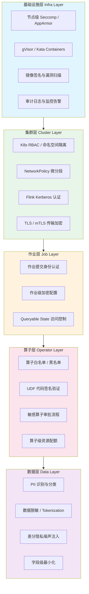
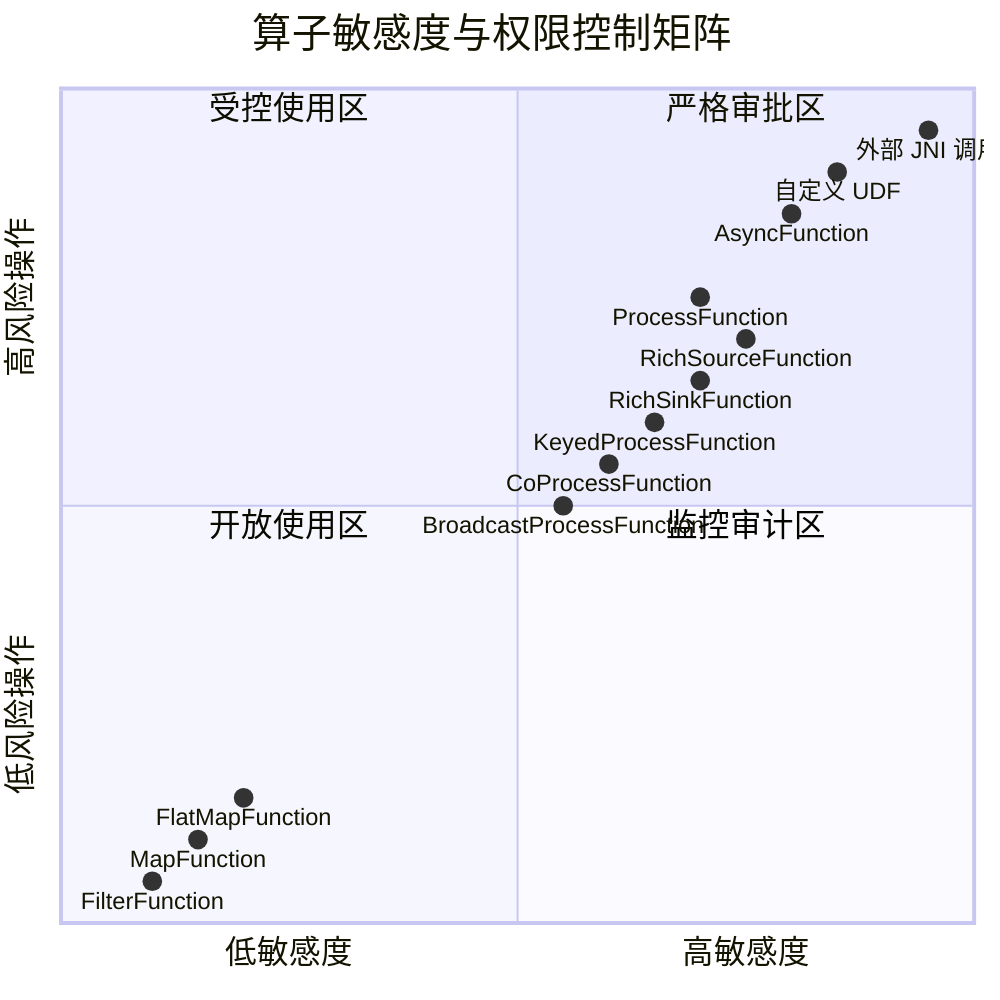
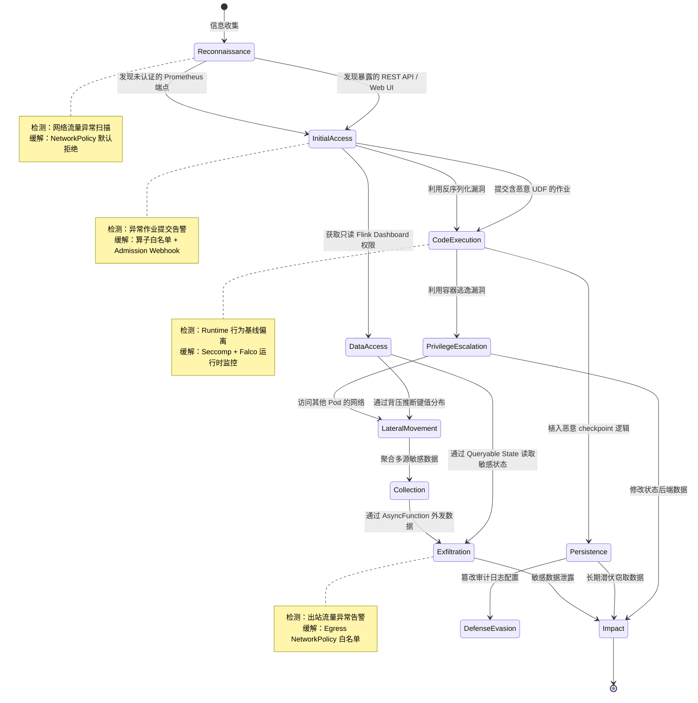

# 流处理算子安全模型与权限控制

> **所属阶段**: Knowledge/08-standards | **前置依赖**: [streaming-security-compliance.md](streaming-security-compliance.md) | **形式化等级**: L4
> **状态**: 生产就绪 | **风险等级**: 中 | **最后更新**: 2026-04

## 目录

- [流处理算子安全模型与权限控制](#流处理算子安全模型与权限控制)
  - [目录](#目录)
  - [1. 概念定义 (Definitions)](#1-概念定义-definitions)
  - [2. 属性推导 (Properties)](#2-属性推导-properties)
  - [3. 关系建立 (Relations)](#3-关系建立-relations)
    - [3.1 算子安全模型与 Kubernetes RBAC 的关系](#31-算子安全模型与-kubernetes-rbac-的关系)
    - [3.2 算子安全模型与 Flink Kerberos 的关系](#32-算子安全模型与-flink-kerberos-的关系)
    - [3.3 算子安全模型与 GDPR/CCPA 的关系](#33-算子安全模型与-gdprccpa-的关系)
    - [3.4 算子安全模型与零信任架构的关系](#34-算子安全模型与零信任架构的关系)
  - [4. 论证过程 (Argumentation)](#4-论证过程-argumentation)
    - [4.1 算子安全威胁面分析](#41-算子安全威胁面分析)
    - [4.2 攻击树分析：侧信道推断攻击](#42-攻击树分析侧信道推断攻击)
    - [4.3 反例分析：白名单机制的绕过路径](#43-反例分析白名单机制的绕过路径)
  - [5. 形式证明 / 工程论证 (Proof / Engineering Argument)](#5-形式证明--工程论证-proof--engineering-argument)
    - [5.1 GDPR 删除权在流系统中的可实现性论证](#51-gdpr-删除权在流系统中的可实现性论证)
    - [5.2 算子沙箱隔离的安全边界论证](#52-算子沙箱隔离的安全边界论证)
  - [6. 实例验证 (Examples)](#6-实例验证-examples)
    - [6.1 Flink Kerberos + SSL/TLS 安全配置](#61-flink-kerberos--ssltls-安全配置)
    - [6.2 Kubernetes RBAC：算子部署权限控制](#62-kubernetes-rbac算子部署权限控制)
    - [6.3 差分隐私聚合算子实现](#63-差分隐私聚合算子实现)
    - [6.4 PII 数据识别与脱敏算子](#64-pii-数据识别与脱敏算子)
  - [7. 可视化 (Visualizations)](#7-可视化-visualizations)
    - [7.1 流处理算子安全模型层次图](#71-流处理算子安全模型层次图)
    - [7.2 算子权限控制矩阵](#72-算子权限控制矩阵)
    - [7.3 算子安全威胁模型图](#73-算子安全威胁模型图)
  - [8. 引用参考 (References)](#8-引用参考-references)

## 1. 概念定义 (Definitions)

**Def-SEC-01-01** [算子安全威胁模型, Operator Security Threat Model]
> 给定流处理系统 $\mathcal{S} = (O, D, K, C)$，其中 $O$ 为算子集合，$D$ 为数据流集合，$K$ 为状态存储集合，$C$ 为配置集合。算子安全威胁模型 $\mathcal{T}$ 定义为四元组 $\mathcal{T} = (A, V, T, R)$，其中 $A$ 为攻击者集合，$V$ 为系统脆弱点集合，$T: A \times V \to \{0, 1\}$ 为攻击可达性函数，$R: V \to \mathbb{R}^+$ 为风险量化函数。

算子安全威胁模型关注流处理系统中**单个算子**及其组合所面临的安全风险。与传统批处理系统不同，流处理算子具有持续运行、状态累积、数据实时流转的特点，这导致其威胁面显著扩大——攻击者不仅可以通过外部接口入侵，还可以通过数据流本身投递恶意负载。

**Def-SEC-01-02** [算子级权限控制, Operator-Level Access Control]
> 算子级权限控制是一个授权判定函数 $\text{Auth}: U \times O \times P \to \{\text{allow}, \text{deny}\}$，其中 $U$ 为用户/主体集合，$O$ 为算子类型集合，$P = \{\text{deploy}, \text{execute}, \text{audit}, \text{admin}\}$ 为权限集合。对于任意用户 $u \in U$、算子 $o \in O$ 和权限 $p \in P$，$\text{Auth}(u, o, p) = \text{allow}$ 当且仅当存在角色 $r \in R$ 使得 $(u, r) \in \text{UA}$（用户-角色分配）且 $(r, (o, p)) \in \text{PA}$（权限-角色分配）。

算子级权限控制将访问控制的粒度从**作业级**下推到**算子级**。这意味着即使一个用户被授权提交流处理作业，系统仍可进一步限制其使用特定类型的算子（如 `ProcessFunction`、`AsyncFunction` 等具有外部调用能力的算子）。Apache Flink 当前主要提供作业级的安全控制（通过 Kerberos + SSL/TLS），算子级权限控制通常需要借助外部框架（如 StreamPark、Ververica Platform）或 Kubernetes Admission Controller 实现。

**Def-SEC-01-03** [数据隐私保护算子, Privacy-Preserving Operator]
> 数据隐私保护算子是一个满足隐私约束的流处理算子 $\hat{o}: D_{\text{in}} \to D_{\text{out}}$，使得对于任意相邻输入流 $D_{\text{in}} \approx D'_{\text{in}}$（仅相差一条个人数据记录），输出流满足 $\Pr[\hat{o}(D_{\text{in}}) \in S] \leq e^\epsilon \cdot \Pr[\hat{o}(D'_{\text{in}}) \in S] + \delta$，其中 $\epsilon \geq 0$ 为隐私预算，$\delta \in [0, 1]$ 为失败概率。当 $\delta = 0$ 时称为纯 $(\epsilon, 0)$-差分隐私。

数据隐私保护算子是在标准算子语义之上叠加隐私约束的增强型算子。它通过技术手段（如数据脱敏、差分隐私噪声注入、k-匿名化）确保输出数据不会泄露输入数据中的个人身份信息（PII, Personally Identifiable Information）。

**Def-SEC-01-04** [数据源投毒攻击, Source Poisoning Attack]
> 数据源投毒攻击是指攻击者通过控制或伪造上游数据源，向流处理系统注入恶意构造的数据记录 $d_{\text{poison}}$，使得下游算子 $o$ 在处理该记录后产生非预期的状态变更 $\Delta s \neq 0$ 或输出 $\Delta o \neq 0$，最终导致系统行为偏离规范。形式化地，攻击者目标为找到 $d_{\text{poison}}$ 使得 $\|o(s, d_{\text{poison}}) - o(s, d_{\text{normal}})\| > \theta$，其中 $\theta$ 为异常检测阈值。

数据源投毒在流处理场景中尤为危险，因为：

1. 数据持续到达，攻击窗口长期存在；
2. 有状态算子（如窗口聚合、会话状态机）会将恶意输入的影响累积到状态 $s$ 中；
3. 与批处理不同，流系统通常无法在输入阶段执行完整的 schema 校验。

**Def-SEC-01-05** [算子代码注入, Operator Code Injection]
> 算子代码注入是指攻击者通过提交包含恶意代码的 UDF（User-Defined Function）、UDAF（User-Defined Aggregate Function）或 UDTF（User-Defined Table Function），在流处理系统的执行环境中执行任意代码。攻击向量包括但不限于：反序列化漏洞（如 Java 反序列化）、动态代码加载、JNDI 注入、以及通过 `ProcessFunction` 的 `open()` 或 `processElement()` 方法执行系统调用。

Flink 的 DataStream API 允许用户自定义 `RichFunction`，其生命周期方法 `open(Configuration)` 在 TaskManager JVM 中执行，具有与 Flink 进程相同的权限。如果作业提交机制未对代码进行沙箱隔离或签名验证，攻击者可以借此读取本地文件、访问网络资源、甚至通过反序列化 gadget 链实现远程代码执行（RCE）。

**Def-SEC-01-06** [状态泄露, State Leakage]
> 状态泄露是指流处理算子的内部状态 $s \in K$ 中包含的敏感信息，通过以下途径被未授权主体访问：(a) 未加密的 checkpoint 文件 $c \in C$；(b) savepoint 导出操作；(c) 状态后端（RocksDB/HDFS/S3）的访问控制配置不当；(d) 状态查询 API（Queryable State）的未授权访问。

状态是流处理系统的"记忆"。窗口算子可能缓存数小时甚至数天的原始事件；聚合算子可能保存用户行为统计；Join 算子可能保留关联的个人信息。当 checkpoint 写入分布式存储时，如果未启用加密（如 Flink 的 `state.backend.incremental` + S3 SSE），敏感状态数据将以明文形式持久化。

**Def-SEC-01-07** [侧信道攻击, Side-Channel Attack]
> 侧信道攻击是指攻击者通过观测流处理系统的非功能性特征（如背压指标、checkpoint 持续时间、网络缓冲区占用率、CPU/GPU 利用率模式）推断输入数据的统计分布或个别敏感属性。形式化地，设观测特征向量为 $\vec{f} = (f_1, f_2, \ldots, f_n)$，攻击者构建推断函数 $g: \vec{f} \to D_{\text{sensitive}}$，使得 $g$ 以不可忽略的概率恢复出敏感数据 $d_{\text{secret}}$。

Flink 的 Web UI 提供了详细的背压（backpressure）指标——`outPoolUsage` 和 `inPoolUsage` 反映了网络缓冲区的饱和度。攻击者如果具有只读访问权限，可以观测这些指标随输入数据分布的变化。例如，当特定键值（key）频繁出现时，对应 KeyGroup 的处理延迟会系统性升高，从而暴露该键的存在和频率。

## 2. 属性推导 (Properties)

**Prop-SEC-01-01** [算子安全闭包性, Operator Security Closure]
> 若流处理拓扑 $G = (O, E)$ 中每个算子 $o_i \in O$ 都满足安全属性 $\phi_i$，且算子之间的数据流 $e_{ij} \in E$ 均经过加密和完整性保护，则整个拓扑 $G$ 满足安全属性 $\Phi = \bigwedge_{i} \phi_i$。

**推导过程**：流处理拓扑可视为有向无环图（或允许循环的迭代图）。根据 Def-SEC-01-01 的威胁模型，攻击者要破坏整个拓扑的安全属性，必须至少攻破一个算子或一条数据流边。若每个算子独立满足安全属性（如代码签名验证通过、无已知漏洞），且数据流边使用 TLS/mTLS 保护，则攻击者无法从外部注入恶意数据或篡改传输中的数据。状态传递（通过 checkpoint）同样受到加密保护，因此状态泄露路径被阻断。根据安全组合原理[^1]，各组件安全性的合取即构成系统级安全性。

**Lemma-SEC-01-01** [白名单机制的完备性, Whitelist Completeness]
> 设允许算子集合为 $O_{\text{allow}} \subset O$，禁止算子集合为 $O_{\text{deny}} = O \setminus O_{\text{allow}}$。若作业提交时的静态分析能够完整提取算子类型集合 $O_{\text{job}}$，则白名单机制在以下条件下是完备的：
> $$\forall \text{job } j, \quad O_{\text{job}} \subseteq O_{\text{allow}} \iff \text{Auth}(u, j, \text{deploy}) = \text{allow}$$

**证明概要**：白名单机制的核心在于静态分析的可靠性。Flink DataStream API 的作业图（JobGraph）在提交到 JobManager 之前即已确定所有算子类型。通过在客户端或 Admission Controller 层解析 JobGraph 的字节码/JSON 表示，可以提取完整的算子类名。若静态分析是完备的（不遗漏任何算子），且白名单 $O_{\text{allow}}$ 的维护与 Flink 版本同步更新，则上述等价关系成立。对于动态加载的算子（如通过 `Class.forName` 反射实例化的 UDF），静态分析可能不完备，此时需要结合运行时沙箱机制作为补充防护。

**Prop-SEC-01-02** [差分隐私组合的隐私预算累积, Differential Privacy Composition]
> 设流处理拓扑包含 $n$ 个差分隐私算子，第 $i$ 个算子提供 $(\epsilon_i, \delta_i)$-DP 保证。则整个拓扑满足 $(\sum_{i=1}^n \epsilon_i, \sum_{i=1}^n \delta_i)$-DP 保证（基本组合定理）；若使用高级组合定理[^2]，对于任意 $\delta' > 0$，拓扑满足 $(\epsilon_{\text{total}}, \delta_{\text{total}})$-DP，其中
> $$\epsilon_{\text{total}} = \sqrt{2n \ln(1/\delta')} \cdot \max_i \epsilon_i + n \cdot \max_i \epsilon_i \cdot \frac{e^{\max_i \epsilon_i} - 1}{e^{\max_i \epsilon_i} + 1}, \quad \delta_{\text{total}} = \sum_{i=1}^n \delta_i + \delta'$$

该命题直接影响隐私保护算子的工程实现：在流处理管道中，每个差分隐私算子都会消耗一部分隐私预算 $\epsilon$。当预算耗尽时，必须终止数据发布或重置隐私会计（Privacy Accounting）。对于无限流（unbounded stream），需要采用流式差分隐私机制[^3]，如基于滑动窗口的预算重充值策略。

## 3. 关系建立 (Relations)

### 3.1 算子安全模型与 Kubernetes RBAC 的关系

Kubernetes RBAC（Role-Based Access Control）为流处理系统提供了基础设施层面的权限控制框架。在 Kubernetes 上部署 Flink 时，存在三个层级的 RBAC 映射：

| 层级 | Kubernetes 资源 | Flink 概念 | 权限映射 |
|------|----------------|-----------|---------|
| 集群级 | `ClusterRole` + `ClusterRoleBinding` | Flink Operator | 管理 FlinkDeployment CRD |
| 命名空间级 | `Role` + `RoleBinding` | JobManager Pod | 创建/管理 TaskManager Pod、ConfigMap |
| 作业级 | `ServiceAccount` | TaskManager | 访问外部服务（S3、Kafka）的凭据 |

Flink Kubernetes Operator 安装时创建两个自定义角色：`flink-operator` 用于管理 FlinkDeployment 资源，`flink` 用于 JobManager 创建 TaskManager 资源[^4]。**关键安全原则**：对于运行不可信代码的场景，应使用 standalone Kubernetes 部署模式——该模式不需要 Flink Pod 的服务账户具有启动额外 Pod 的权限，从而将攻击者通过 JobManager 横向移动（lateral movement）的风险降至最低。

### 3.2 算子安全模型与 Flink Kerberos 的关系

Flink 的 Kerberos 安全模块架构将算子对外部系统的访问认证委托给三个安全模块[^5]：

1. **Hadoop Security Module**：使用 `UserGroupInformation` (UGI) 建立进程级登录用户上下文，用于 HDFS、HBase、YARN 交互；
2. **JAAS Security Module**：为 ZooKeeper、Kafka 等依赖 JAAS 的组件提供动态安全配置；
3. **ZooKeeper Security Module**：配置 ZooKeeper 服务名和 JAAS 登录上下文。

在算子级别，这意味着**所有算子共享同一个 Kerberos 主体（principal）**。如果一个作业中的 `ProcessFunction` 需要访问 HDFS，而另一个作业中的 `AsyncFunction` 需要访问 Kafka，它们都使用集群级别的 keytab。这种设计在便利性与隔离性之间存在张力——为不同作业或不同算子使用不同 keytab 需要启动独立的 Flink 集群。

### 3.3 算子安全模型与 GDPR/CCPA 的关系

GDPR（通用数据保护条例）和 CCPA（加州消费者隐私法案）对流处理系统提出了直接的合规要求：

- **数据最小化原则（Article 5(1)(c) GDPR）**：算子应仅处理实现处理目的所必需的个人数据。这要求算子设计时采用**字段级过滤**——在数据源算子处即剔除无关的 PII 字段，而非在管道末端统一脱敏。
- **目的限制原则（Article 5(1)(b) GDPR）**：同一数据流不得被用于与收集时声明目的不相容的后续处理。算子权限控制应绑定处理目的，当目的变更时需要重新审批。
- **删除权（Right to Erasure, Article 17 GDPR）**：数据主体要求删除其个人数据时，流系统必须能够定位并清除该数据在所有状态（窗口状态、Join 状态、聚合状态）和 checkpoint 中的副本。
- **CCPA 的"知情权"和"删除权"**：企业必须披露收集的个人信息类别，并在收到可验证的消费者请求后删除相关信息。

### 3.4 算子安全模型与零信任架构的关系

零信任（Zero Trust）安全模型的核心原则是"永不信任，始终验证"（Never Trust, Always Verify）。在流处理算子安全语境下，零信任体现为：

1. **身份即边界**：每个算子实例都应具有可验证的身份（通过 ServiceAccount + SPIFFE/SPIRE 身份标识），而非依赖网络位置（Pod IP）判断可信度；
2. **最小权限**：算子仅能访问其功能所必需的外部资源和数据字段；
3. **持续验证**：通过准入控制器（Admission Controller）在部署时验证算子镜像签名、扫描漏洞，并在运行时通过 Falco/KubeArmor 监控系统调用异常；
4. **默认拒绝**：网络策略（NetworkPolicy）采用默认拒绝（default-deny）姿态，仅显式允许必要的 pod-to-pod 通信[^6]。

## 4. 论证过程 (Argumentation)

### 4.1 算子安全威胁面分析

流处理算子的威胁面可从四个维度展开：

**输入面（Input Surface）**

- 数据源连接器（Kafka、Kinesis、Pulsar）的认证绕过；
- Schema Registry 的篡改导致算子解析恶意构造的数据；
- 未经验证的输入数据导致算子内部状态溢出（如窗口状态无限增长）。

**代码面（Code Surface）**

- UDF/UDAF/ProcessFunction 中的反序列化漏洞；
- `Runtime.getRuntime().exec()` 等系统调用逃逸；
- 通过 `open()` 方法加载的外部资源配置文件被污染。

**状态面（State Surface）**

- Checkpoint 存储（S3、HDFS、NFS）的 ACL 配置错误；
- RocksDB SST 文件未加密，本地文件系统可读取；
- Queryable State 服务端点暴露在互联网可访问范围。

**观测面（Observation Surface）**

- Flink Web UI 的 REST API 暴露背压、延迟、吞吐量等运行时指标；
- Prometheus 指标端点（`/metrics`）暴露算子级延迟分布；
- 日志中的敏感数据泄露（如 `System.out.println(record)` 打印原始事件）。

### 4.2 攻击树分析：侧信道推断攻击

以 Def-SEC-01-07 定义的侧信道攻击为例，构建简化攻击树：

```
目标：推断输入数据中特定键值的存在性
├── [OR] 观测背压指标
│   ├── [AND] 获取 Flink Web UI 只读访问权限
│   └── [AND] 注入可控频率的测试数据
│       └── 观测目标键值对应的 subtask 延迟模式
├── [OR] 观测 checkpoint 时长
│   ├── [AND] 获取 JobManager 日志访问权限
│   └── [AND] 目标键值导致窗口状态膨胀
│       └── checkpoint 时长与该键出现频率正相关
└── [OR] 观测网络 I/O 模式
    ├── [AND] 获取节点级网络监控权限
    └── [AND] 特定键值触发跨节点 shuffle
        └── 目标键出现时 network buffer 占用异常
```

**缓解策略**：(1) 对运行时指标实施基于角色的访问控制，开发者和运维人员看到不同粒度的指标；(2) 在指标收集层对敏感 subtask 的延迟数据进行聚合或加噪；(3) 限制网络监控权限与 Flink 集群访问权限的交集。

### 4.3 反例分析：白名单机制的绕过路径

白名单机制（Def-SEC-01-02 的特例）并非绝对安全。考虑以下绕过场景：

- **场景 A**：白名单允许 `MapFunction`，攻击者在 `MapFunction` 中通过 Java 反射调用 `java.lang.Runtime.exec()`。由于反射调用在静态分析中可能被隐藏（如使用 `Class.forName("java.lang.Runtime")`），基于类名匹配的白名单无法检测。
- **场景 B**：白名单允许 `AsyncFunction`，攻击者在 `asyncInvoke()` 中向恶意服务器泄露数据。该行为在静态分析层面属于正常的外部 I/O 调用，难以与合法的外部服务访问区分。
- **场景 C**：白名单基于算子类名，但攻击者通过 Flink 的 `StateTtlConfig` 和 `CheckpointListener` 组合构造拒绝服务（DoS）攻击——频繁触发大规模状态清理导致 GC 停顿。

这些反例表明，**白名单必须与运行时沙箱（如 Seccomp、AppArmor、gVisor）结合使用**，才能形成纵深防御（Defense in Depth）。

## 5. 形式证明 / 工程论证 (Proof / Engineering Argument)

### 5.1 GDPR 删除权在流系统中的可实现性论证

**Thm-SEC-01-01** [流系统删除权的可实现性定理]
> 设流处理系统使用基于事件时间的窗口算子，状态后端支持增量 checkpoint，且数据保留期为 $T_{\text{retention}}$。若系统满足以下条件：
> (1) 每个输入事件 $e$ 携带唯一标识符 $id(e)$ 和数据主体标识 $subj(e)$；
> (2) 状态 TTL 配置为 $T_{\text{TTL}} \leq T_{\text{retention}}$；
> (3) 增量 checkpoint 的过期文件在 $T_{\text{cleanup}} < T_{\text{retention}}$ 内被清理；
> 则对于任意数据主体 $s$，系统在收到删除请求后最多经过 $T_{\text{retention}} + T_{\text{cleanup}}$ 时间，可保证 $s$ 的所有个人数据从活跃状态和历史 checkpoint 中完全清除。

**工程论证**：

流系统的删除权实现面临核心矛盾——**数据不可变性（immutability）与删除要求（erasure）的冲突**。在批处理系统中，可以通过覆盖存储文件实现删除；但在流系统中，checkpoint 是只增（append-only）的历史序列，且算子状态可能以复杂结构（如窗口状态中的 `MapState<Key, List<Event>>`）保存数据。

论证分三步展开：

**第一步：活跃状态的删除**。对于 Flink 的 `ValueState`、`ListState`、`MapState` 和 `ReducingState`，可以通过在算子中实现自定义的 "遗忘逻辑"（forget logic）来删除特定数据主体的记录。具体而言，在 `processElement()` 中检测 `subj(e)` 是否匹配删除请求列表，若匹配则跳过状态更新或从 `MapState` 中移除对应条目。由于 Flink 的状态变更仅在 checkpoint 时持久化，活跃状态的删除在下一个 checkpoint 完成后即生效。

**第二步：历史 checkpoint 的处理**。Flink 的增量 checkpoint 依赖于引用计数的快照文件。当状态条目被删除后，旧的 checkpoint 文件可能仍包含该条目的历史版本。解决方案是：

- 配置 `state.checkpoints.num-retained` 限制保留的 checkpoint 数量；
- 使用状态后端的自动清理功能（RocksDB 的 compaction + TTL）；
- 对于需要立即删除的场景，触发 savepoint 后手动清理历史 checkpoint 目录。

**第三步：事件时间与隐私保留期的对齐**。GDPR 并未规定统一的保留期，但要求"不超过实现处理目的所必需的时间"。设业务要求的事件时间窗口为 $T_{\text{window}}$，则隐私保留期 $T_{\text{retention}}$ 应满足 $T_{\text{retention}} \geq T_{\text{window}}$。通过配置 `StateTtlConfig` 的 `TimeCharacteristic.EventTime`，可以使状态过期时间与事件时间戳（而非处理时间）对齐，从而在业务逻辑允许的时间点自动清除数据：

```java
StateTtlConfig ttlConfig = StateTtlConfig
    .newBuilder(Time.days(90))  // 90天隐私保留期
    .setUpdateType(OnCreateAndWrite)
    .setStateVisibility(NeverReturnExpired)
    .cleanupInRocksdbCompactFilter(1000)  // compaction时清理
    .build();
```

综上，虽然流系统的删除权实现比批系统复杂，但通过**状态 TTL + 增量 checkpoint 清理 + 事件时间对齐**的三层策略，可以在工程上满足 GDPR 的合规要求。

### 5.2 算子沙箱隔离的安全边界论证

**Thm-SEC-01-02** [算子沙箱隔离边界定理]
> 若流处理算子 $o$ 运行在满足以下条件的沙箱环境中：
> (1) 文件系统命名空间隔离（chroot / overlayfs）；
> (2) 系统调用过滤（Seccomp-BPF 或 eBPF）；
> (3) 网络访问限制（NetworkPolicy + egress 白名单）；
> (4) 资源配额限制（CPU/内存/磁盘）；
> 则算子 $o$ 对宿主机和其他算子的影响被限制在沙箱边界内，即对于任意恶意输入 $d_{\text{malicious}}$，$o(d_{\text{malicious}})$ 无法突破沙箱的隔离属性。

**工程论证**：现代容器运行时（containerd、cri-o）和 Kubernetes 的 Pod Security Standards 提供了实现上述条件的完整工具链。Flink on Kubernetes 场景中，可以通过以下配置实现算子级沙箱：

1. **SecurityContext 配置**：
   - `runAsNonRoot: true`——禁止以 root 运行；
   - `readOnlyRootFilesystem: true`——根文件系统只读；
   - `allowPrivilegeEscalation: false`——禁止特权提升；
   - `seccompProfile.type: RuntimeDefault`——启用默认 Seccomp 过滤。

2. **NetworkPolicy 配置**：默认拒绝所有 egress，仅允许访问 Kafka broker（端口 9093）和 S3 端点（端口 443）。

3. **ResourceQuota 配置**：限制每个 TaskManager Pod 的 CPU 和内存，防止资源耗尽型攻击。

4. **gVisor 或 Kata Containers**：对于高风险算子（如执行第三方 UDF），使用用户态内核或轻量级虚拟机提供额外的隔离层。

这些措施的组合构成了纵深防御体系，使得即使单个算子被攻破，攻击者也无法横向移动到其他算子或宿主机。

## 6. 实例验证 (Examples)

### 6.1 Flink Kerberos + SSL/TLS 安全配置

以下 `flink-conf.yaml` 配置展示了如何在 Flink 中启用 Kerberos 认证和 TLS 加密：

```yaml
# ========== Kerberos 认证配置 ==========
security.kerberos.login.keytab: /etc/security/keytabs/flink.keytab
security.kerberos.login.principal: flink@EXAMPLE.COM
security.kerberos.login.use-ticket-cache: false

# ========== 内部通信 TLS ==========
security.ssl.internal.enabled: true
security.ssl.internal.keystore: /etc/flink/ssl/flink.keystore
security.ssl.internal.keystore-password: ${SSL_KEYSTORE_PASSWORD}
security.ssl.internal.key-password: ${SSL_KEY_PASSWORD}
security.ssl.internal.truststore: /etc/flink/ssl/flink.truststore
security.ssl.internal.truststore-password: ${SSL_TRUSTSTORE_PASSWORD}

# ========== REST API TLS ==========
security.ssl.rest.enabled: true
security.ssl.rest.keystore: /etc/flink/ssl/rest.keystore
security.ssl.rest.keystore-password: ${SSL_KEYSTORE_PASSWORD}

# ========== Checkpoint 加密 (S3) ==========
state.backend: rocksdb
state.checkpoints.dir: s3p://flink-checkpoints/prod/
s3.access-key: ${S3_ACCESS_KEY}
s3.secret-key: ${S3_SECRET_KEY}
# S3 服务端加密 (SSE-S3)
state.backend.rocksdb.memory.managed: true
```

**安全说明**：

- 所有密码字段使用环境变量或加密工具（如 Cloudera 的 EncryptTool[^7]）注入，避免明文存储；
- `security.ssl.internal.enabled` 确保 TaskManager 与 JobManager 之间的所有 RPC 和数据传输均加密；
- 对于 S3 存储，建议启用 SSE-KMS 或 SSE-C 以提供更强的密钥管理。

### 6.2 Kubernetes RBAC：算子部署权限控制

以下 YAML 展示了如何通过 Kubernetes RBAC 限制特定命名空间内的 Flink 作业部署权限，并结合自定义 Admission Webhook 实现算子白名单：

```yaml
# === Role: 允许部署基础算子，禁止 ProcessFunction ===
apiVersion: rbac.authorization.k8s.io/v1
kind: Role
metadata:
  namespace: flink-streaming
  name: flink-basic-operator-role
rules:
- apiGroups: ["flink.apache.org"]
  resources: ["flinkdeployments"]
  verbs: ["get", "list", "create"]
---
apiVersion: rbac.authorization.k8s.io/v1
kind: RoleBinding
metadata:
  namespace: flink-streaming
  name: flink-basic-operator-binding
subjects:
- kind: User
  name: "developer@example.com"
  apiGroup: rbac.authorization.k8s.io
roleRef:
  kind: Role
  name: flink-basic-operator-role
  apiGroup: rbac.authorization.k8s.io
---
# === NetworkPolicy: 默认拒绝，仅允许访问 Kafka 和 S3 ===
apiVersion: networking.k8s.io/v1
kind: NetworkPolicy
metadata:
  namespace: flink-streaming
  name: flink-default-deny
spec:
  podSelector:
    matchLabels:
      app: flink
  policyTypes:
  - Ingress
  - Egress
  egress:
  - to:
    - namespaceSelector:
        matchLabels:
          name: kafka
    ports:
    - protocol: TCP
      port: 9093
  - to:
    - ipBlock:
        cidr: 0.0.0.0/0
    ports:
    - protocol: TCP
      port: 443
```

**算子白名单 Admission Webhook 逻辑**（Python 伪代码）：

```python
import json
from flask import Flask, request

ALLOWED_OPERATORS = {
    "org.apache.flink.streaming.api.functions.source.SourceFunction",
    "org.apache.flink.streaming.api.functions.sink.SinkFunction",
    "org.apache.flink.api.common.functions.MapFunction",
    "org.apache.flink.api.common.functions.FilterFunction",
    "org.apache.flink.api.common.functions.FlatMapFunction",
    # 基础算子白名单...
}

DENIED_OPERATORS = {
    "org.apache.flink.streaming.api.functions.ProcessFunction",
    "org.apache.flink.streaming.api.functions.async.AsyncFunction",
    "java.lang.Runtime",
}

def validate_jobgraph(jobgraph):
    operators = extract_operators(jobgraph)  # 从 JobGraph JSON 提取算子类名
    for op in operators:
        if op in DENIED_OPERATORS:
            return False, f"Denied operator detected: {op}"
        if op not in ALLOWED_OPERATORS:
            return False, f"Unknown operator not in whitelist: {op}"
    return True, "Validation passed"

app = Flask(__name__)

@app.route('/validate', methods=['POST'])
def validate():
    admission_review = request.get_json()
    jobgraph = admission_review['request']['object']
    allowed, message = validate_jobgraph(jobgraph)
    # 构造 AdmissionResponse...
    return json.dumps({"allowed": allowed, "message": message})
```

### 6.3 差分隐私聚合算子实现

以下代码展示了如何在 Flink 中实现一个满足 $(\epsilon, 0)$-差分隐私的计数聚合算子：

```java
import org.apache.flink.streaming.api.functions.windowing.ProcessWindowFunction;
import org.apache.flink.streaming.api.windowing.windows.TimeWindow;
import org.apache.flink.util.Collector;

import java.security.SecureRandom;

/**
 * 差分隐私计数算子：在窗口计数结果上添加 Laplace 噪声
 * 满足 (epsilon, 0)-差分隐私，敏感度为 1（单条记录的增删影响计数最多为 1）
 */
public class DifferentialPrivacyCountFunction<T>
    extends ProcessWindowFunction<T, PrivacyPreservingResult<T>, String, TimeWindow> {

    private final double epsilon;  // 隐私预算
    private final SecureRandom random;

    public DifferentialPrivacyCountFunction(double epsilon) {
        if (epsilon <= 0) {
            throw new IllegalArgumentException("Privacy budget epsilon must be positive");
        }
        this.epsilon = epsilon;
        this.random = new SecureRandom();
    }

    @Override
    public void process(String key, Context context,
                        Iterable<T> elements,
                        Collector<PrivacyPreservingResult<T>> out) {
        // 步骤 1：计算真实计数
        long trueCount = 0;
        for (T ignored : elements) {
            trueCount++;
        }

        // 步骤 2：从 Laplace(0, sensitivity/epsilon) 分布采样噪声
        // 敏感度 sensitivity = 1（计数查询的 L1 敏感度）
        double scale = 1.0 / epsilon;
        double noise = sampleLaplace(0.0, scale);

        // 步骤 3：输出加噪结果（非负截断）
        long noisyCount = Math.max(0, Math.round(trueCount + noise));

        // 步骤 4：隐私会计（全局预算管理应由外部服务负责）
        // auditLog.recordConsumption(key, epsilon, context.window());

        out.collect(new PrivacyPreservingResult<>(
            key,
            context.window().getStart(),
            context.window().getEnd(),
            noisyCount,
            epsilon
        ));
    }

    /**
     * Laplace 分布采样：使用逆变换采样法
     */
    private double sampleLaplace(double mean, double scale) {
        double u = random.nextDouble() - 0.5;  // u ~ Uniform(-0.5, 0.5)
        return mean - scale * Math.signum(u) * Math.log(1 - 2 * Math.abs(u));
    }
}
```

**使用约束与说明**：

- 隐私预算 $\epsilon$ 的选择需要在数据效用和隐私保护之间权衡。通常 $\epsilon \in [0.1, 1.0]$ 被认为是强隐私保护，$\epsilon \in [1.0, 10.0]$ 适用于中等敏感度场景；
- 该算子仅保证**单个窗口**内的差分隐私。若同一数据主体出现在多个窗口中，需要应用组合定理（Prop-SEC-01-02）累积隐私预算；
- 对于求和、均值等聚合查询，敏感度计算方式不同（求和的敏感度为数值上界 $M$，均值的敏感度为 $2M/n$），需相应调整噪声尺度。

### 6.4 PII 数据识别与脱敏算子

```java
import org.apache.flink.api.common.functions.MapFunction;
import java.util.regex.Pattern;

/**
 * PII 脱敏算子：使用正则表达式识别常见 PII 字段并进行掩码处理
 */
public class PIIMaskingFunction implements MapFunction<Event, Event> {

    // 手机号掩码：保留前3位和后4位
    private static final Pattern PHONE_PATTERN =
        Pattern.compile("(1\\d{2})\\d{4}(\\d{4})");
    // 身份证号掩码：保留前6位和后4位
    private static final Pattern ID_CARD_PATTERN =
        Pattern.compile("(\\d{6})\\d{8}(\\d{4})");
    // 邮箱掩码：保留首字符和域名
    private static final Pattern EMAIL_PATTERN =
        Pattern.compile("(.)[^@]*(@.+)");

    @Override
    public Event map(Event event) {
        String payload = event.getPayload();

        // 手机号脱敏
        payload = PHONE_PATTERN.matcher(payload)
            .replaceAll("$1****$2");
        // 身份证号脱敏
        payload = ID_CARD_PATTERN.matcher(payload)
            .replaceAll("$1********$2");
        // 邮箱脱敏
        payload = EMAIL_PATTERN.matcher(payload)
            .replaceAll("$1****$2");

        return new Event(event.getId(), payload, event.getTimestamp());
    }
}
```

**工程实践建议**：对于生产环境，建议使用专门的数据分类工具（如 Apache Ranger、AWS Macie、Azure Purview）在数据源层识别 PII，而非依赖正则表达式。脱敏策略应与数据分类标签绑定，实现策略即代码（Policy-as-Code）管理。

## 7. 可视化 (Visualizations)

### 7.1 流处理算子安全模型层次图

以下层次图展示了流处理算子安全模型的五层防御体系，从基础设施层到数据层逐层递进：



**说明**：该五层模型遵循纵深防御（Defense in Depth）原则。基础设施层提供操作系统级隔离；集群层提供网络和服务身份管理；作业层控制作业生命周期中的权限；算子层实现细粒度的算子类型管控；数据层确保个人信息在流转过程中的隐私保护。每一层的失效不会导致整体安全体系的崩溃，因为上层和下层仍提供补偿性保护。

### 7.2 算子权限控制矩阵

以下矩阵展示了不同角色对流处理算子类型的访问权限，体现了最小权限原则（Principle of Least Privilege）：



**矩阵解读**：

- **开放使用区（左下）**：`MapFunction`、`FilterFunction` 等纯转换算子无副作用，允许所有经认证的用户使用；
- **监控审计区（右下）**：`FlatMapFunction` 等可以生成多条输出记录的算子需要操作日志记录，但无需特殊审批；
- **受控使用区（左上）**：`KeyedProcessFunction`、`CoProcessFunction` 等具有状态访问能力的算子需要部门级审批，并配置状态 TTL；
- **严格审批区（右上）**：`AsyncFunction`（可发起外部 I/O）、自定义 UDF（任意代码执行）、外部 JNI 调用（突破 JVM 沙箱）属于高风险算子，必须经过安全团队的多级审批，并在隔离的命名空间或 gVisor 环境中运行。

### 7.3 算子安全威胁模型图

以下状态转移图展示了攻击者从初始入侵到达成攻击目标的典型路径，以及每个阶段的检测与缓解措施：



**威胁模型说明**：该图基于 MITRE ATT&CK 框架的战术阶段[^8]建模。流处理系统的独特威胁包括：

- **数据层面的攻击路径**：攻击者无需完全控制代码执行，仅通过数据输入即可影响有状态算子的行为（数据源投毒）；
- **观测层面的攻击路径**：只读访问权限即可通过系统侧信道推断敏感信息；
- **持久化层面的攻击路径**：恶意逻辑可以隐藏在 checkpoint 状态中，在作业重启后继续生效。

## 8. 引用参考 (References)

[^1]: M. Abadi et al., "Deep Learning with Differential Privacy", CCS 2016. <https://arxiv.org/abs/1607.00133>

[^2]: C. Dwork and A. Roth, "The Algorithmic Foundations of Differential Privacy", Foundations and Trends in Theoretical Computer Science, 2014. <https://www.cis.upenn.edu/~aaroth/Papers/privacybook.pdf>

[^3]: T. Wang et al., "Continuous Release of Data Streams under both Centralized and Local Differential Privacy", CCS 2021. <https://dl.acm.org/doi/10.1145/3460120.3484740>

[^4]: Confluent Documentation, "Configure security for a Flink job", 2025. <https://docs.confluent.io/cp-flink/current/jobs/configure/security.html>

[^5]: Apache Flink Documentation, "Kerberos Authentication Setup and Configuration", Flink 1.13. <https://nightlies.apache.org/flink/flink-docs-release-1.13/docs/deployment/security/security-kerberos/>

[^6]: Microsoft Tech Community, "Zero-Trust Kubernetes: Enforcing Security & Multi-Tenancy with Custom Admission Webhooks", 2025. <https://techcommunity.microsoft.com/blog/azureinfrastructureblog/zero-trust-kubernetes-enforcing-security--multi-tenancy-with-custom-admission-we/4466646>

[^7]: Cloudera Documentation, "Securing Apache Flink", CSA 1.16. <https://docs.cloudera.com/csa/1.16.0/security/topics/csa-enable-security.html>

[^8]: MITRE Corporation, "MITRE ATT&CK Framework for Containers", 2025. <https://attack.mitre.org/matrices/enterprise/cloud/>
