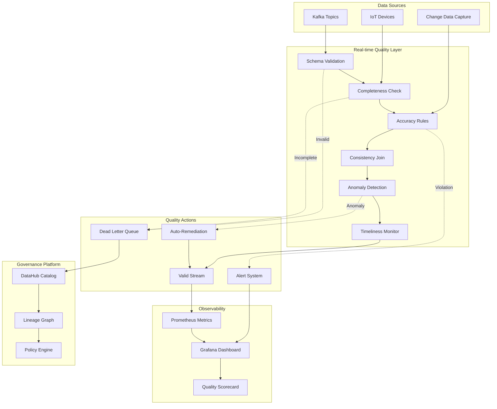
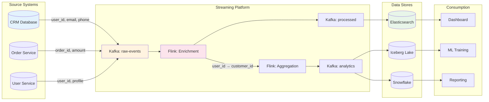
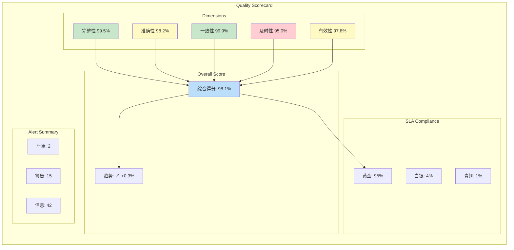
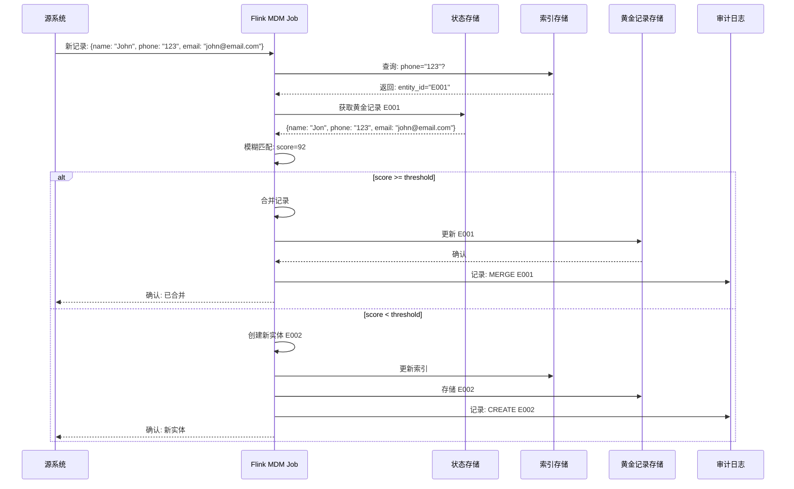
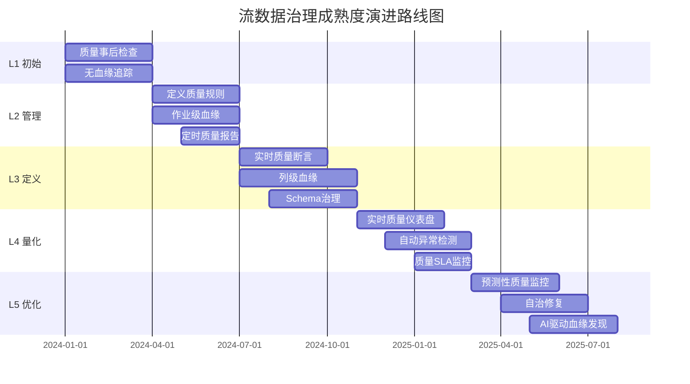

# 流数据治理与实时数据质量管理 (Streaming Data Governance & Quality Management)

> **所属阶段**: Knowledge | **前置依赖**: [streaming-data-governance.md](./streaming-data-governance.md) | **形式化等级**: L4

---

## 1. 概念定义 (Definitions)

### Def-K-08-30: 实时数据质量管理 (Real-time Data Quality Management)

实时数据质量管理是对流数据在**摄入、处理、输出**全链路中持续监控、度量和改善数据质量状态的系统性方法。

$$
\text{QualityManagement} = \langle D_{stream}, Q_{dimensions}, M_{metrics}, R_{rules}, A_{actions} \rangle
$$

其中：

- $D_{stream}$: 无界数据流集合
- $Q_{dimensions}$: 质量维度集合 {完整性, 准确性, 一致性, 及时性, 有效性}
- $M_{metrics}$: 度量指标体系
- $R_{rules}$: 质量规则集合
- $A_{actions}$: 异常响应动作 {告警, 修正, 丢弃, 隔离}

### Def-K-08-31: 数据质量维度 (Data Quality Dimensions)

**Def-K-08-31a - 完整性 (Completeness)**:

$$
Completeness(D) = \frac{|D_{complete}|}{|D_{total}|} \times 100\%
$$

其中 $D_{complete}$ 表示所有必填字段均有值的记录集合。

**Def-K-08-31b - 准确性 (Accuracy)**:

$$
Accuracy(D) = \frac{|D_{valid}|}{|D_{total}|} \times 100\%
$$

$D_{valid}$ 表示通过业务规则验证的记录集合。

**Def-K-08-31c - 一致性 (Consistency)**:

$$
Consistency(D_s, D_t) = \frac{|D_s \bowtie_{key} D_t|}{|D_s|} \times 100\%
$$

跨源数据在关键属性上的一致程度。

**Def-K-08-31d - 及时性 (Timeliness)**:

$$
Timeliness(e) = T_{processing} - T_{event} \leq \delta_{SLA}
$$

事件从产生到被处理的延迟满足服务等级协议。

**Def-K-08-31e - 有效性 (Validity)**:

$$
Validity(D) = \frac{|\{d \in D : d \vDash Schema\}|}{|D|} \times 100\%
$$

数据符合预定义格式、类型和取值范围的比率。

### Def-K-08-32: 流式数据血缘 (Streaming Data Lineage)

流式数据血缘是追踪数据元素在**时间维度**上的来源、变换和去向的元数据图谱，支持**字段级** (Column-level) 追踪。

$$
Lineage = \langle N_{datasets}, N_{operations}, E_{flow}, T_{temporal} \rangle
$$

其中：

- $N_{datasets}$: 数据集节点 (Topics, Tables, Files)
- $N_{operations}$: 操作节点 (Jobs, Functions, Queries)
- $E_{flow}$: 数据流边 $\subseteq N \times N$
- $T_{temporal}$: 时间窗口约束

### Def-K-08-33: 流式主数据管理 (Streaming MDM)

流式主数据管理是在实时数据流中识别、匹配、合并**实体记录**以生成**黄金记录** (Golden Record) 的持续过程。

$$
GoldenRecord(e) = \underset{r \in Matches(e)}{\oplus}\left( r, w(r) \right)
$$

其中：

- $Matches(e)$: 与实体 $e$ 匹配的所有记录集合
- $\oplus$: 记录合并算子 (属性优先级/信任度加权)
- $w(r)$: 记录源系统的信任权重

### Def-K-08-34: 实时数据剖析 (Streaming Data Profiling)

实时数据剖析是对流数据进行**增量式统计特征提取**的过程，包括分布、基数、异常值和模式识别。

$$
Profile(D_{stream}, \Delta t) = \langle Stats_{numeric}, Dist_{categorical}, Cardinality, Outliers \rangle
$$

### Def-K-08-35: 流数据治理成熟度模型 (Streaming Governance Maturity)

| 级别 | 名称 | 特征 | 质量监控 | 血缘追踪 | 自动化 |
|-----|------|-----|---------|---------|--------|
| L1 | 初始 | 被动响应 | 事后检测 | 无 | 无 |
| L2 | 管理 | 规则定义 | 定时批检 | 作业级 | 部分 |
| L3 | 定义 | 标准化 | 实时断言 | 字段级 | 规则引擎 |
| L4 | 量化 | 度量驱动 | 持续监控 | 全链路 | ML增强 |
| L5 | 优化 | 自治治理 | 预测性 | 主动推荐 | 完全自动 |

---

## 2. 属性推导 (Properties)

### Prop-K-08-15: 质量维度相关性

对于流数据质量评估，不同维度之间存在相关性约束：

$$
\rho(Accuracy, Validity) \geq 0.8
$$

高有效性通常意味着高准确性，但及时性与完整性可能存在权衡：

$$
\frac{\partial Timeliness}{\partial Completeness} \leq 0 \quad \text{(在低延迟要求下)}
$$

### Prop-K-08-16: 血缘传递的封闭性

若数据集 $D_3$ 由 $D_1$ 和 $D_2$ 经变换 $f$ 生成，则：

$$
Lineage(D_3) = Lineage(D_1) \cup Lineage(D_2) \cup \{f\}
$$

血缘信息在变换操作下保持传递封闭。

### Prop-K-08-17: 实时质量监控的延迟边界

实时质量告警的端到端延迟 $T_{alert}$ 满足：

$$
T_{alert} \leq T_{ingestion} + T_{processing} + T_{window} + T_{evaluation}
$$

对于 Flink 等现代流处理器，典型值为：

- $T_{ingestion}$: 100ms ~ 1s
- $T_{processing}$: 10ms ~ 100ms
- $T_{window}$: 0 (处理时间) ~ 60s (事件时间)
- $T_{evaluation}$: 1ms ~ 10ms

### Prop-K-08-18: 实体解析的准确率上界

在流式 MDM 中，给定匹配算法准确率 $P_{match}$ 和合并算法准确率 $P_{merge}$：

$$
Accuracy_{Golden} \leq P_{match} \times P_{merge} + (1 - P_{match}) \times Accuracy_{source}
$$

---

## 3. 关系建立 (Relations)

### 与 DAMA-DMBOK 框架的映射

```
┌─────────────────────────────────────────────────────────────────────┐
│                    DAMA-DMBOK 知识领域                              │
├─────────────────┬───────────────────────────────────────────────────┤
│ 数据治理         │ ← 流数据治理策略、组织架构、政策制定               │
├─────────────────┼───────────────────────────────────────────────────┤
│ 数据质量         │ ← 实时质量监控、SLA 定义、质量评分卡               │
├─────────────────┼───────────────────────────────────────────────────┤
│ 元数据管理       │ ← 流式血缘、Schema Registry、业务术语表            │
├─────────────────┼───────────────────────────────────────────────────┤
│ 主数据管理       │ ← 流式实体解析、实时黄金记录                       │
├─────────────────┼───────────────────────────────────────────────────┤
│ 数据安全         │ ← 实时脱敏、访问控制、审计                         │
├─────────────────┼───────────────────────────────────────────────────┤
│ 数据集成         │ ← 流式 ETL、Change Data Capture                    │
└─────────────────┴───────────────────────────────────────────────────┘
```

### 流式 vs 批处理质量管理的差异

| 维度 | 批处理质量管理 | 流式质量管理 |
|-----|--------------|-------------|
| **验证时机** | 加载后/ETL后 | 摄入时/窗口关闭时 |
| **反馈延迟** | 分钟/小时级 | 毫秒/秒级 |
| **样本方法** | 全量扫描 | 抽样/水印驱动 |
| **异常处理** | 重新运行作业 | 侧输出/死信队列 |
| **质量趋势** | 静态报告 | 实时仪表盘 |
| **数据修复** | 重新计算分区 | 状态回溯/重放 |

### 与 Data Mesh 的融合

```
┌────────────────────────────────────────────────────────────────────┐
│                      数据网格域自治架构                               │
├─────────────────┬─────────────────┬────────────────────────────────┤
│   订单域         │   用户域         │      平台治理域                 │
├─────────────────┼─────────────────┼────────────────────────────────┤
│ 本地质量规则      │ 本地质量规则     │  全局质量策略                   │
│ 域内血缘追踪      │ 域内血缘追踪     │  跨域血缘图谱                   │
│ 本地 MDM         │ 本地 MDM         │  统一实体对齐                   │
├─────────────────┴─────────────────┴────────────────────────────────┤
│                   联邦式治理接口 (Federated Governance)              │
└────────────────────────────────────────────────────────────────────┘
```

---

## 4. 论证过程 (Argumentation)

### 实时质量监控的必要性论证

**场景**: 金融风控系统依赖交易流数据进行实时欺诈检测。

**无实时质量监控的风险链**:

```
上游系统 Schema 变更 (字段名拼写错误)
           ↓
    Flink 作业无法解析 → 字段值为 null
           ↓
    风控模型输入缺失 → 误判为低风险交易
           ↓
    欺诈交易通过 → 资金损失 + 合规风险
```

**根因**: 缺乏**实时 Schema 验证**和**字段级质量断言**。

**解决方案架构**:

```
┌─────────────────────────────────────────────────────────────┐
│                    实时质量门禁系统                          │
├─────────────────────────────────────────────────────────────┤
│  ┌──────────────┐  ┌──────────────┐  ┌──────────────────┐   │
│  │ Schema验证   │→ │ 规则引擎     │→ │ 异常分流          │   │
│  │ (JSON Schema)│  │ (Flink SQL)  │  │ (Side Output)     │   │
│  └──────────────┘  └──────────────┘  └──────────────────┘   │
│           ↓                ↓                  ↓             │
│    ┌──────────┐     ┌──────────┐      ┌──────────────┐     │
│    │ 有效数据流 │     │ 质量指标   │      │ 死信队列(DLQ) │     │
│    │ → 下游作业 │     │ → Prometheus│      │ → 人工介入   │     │
│    └──────────┘     └──────────┘      └──────────────┘     │
└─────────────────────────────────────────────────────────────┘
```

### 列级血缘的业务价值

**问题场景**: 某 GDPR 数据主体要求删除其所有个人数据。

**无列级血缘的挑战**:

- 无法精确定位 PII 字段的传播路径
- 只能全表/全主题删除 → 影响非目标数据
- 无法验证删除的完整性

**有列级血缘的解决方案**:

```sql
-- 查询: user_email 字段的血缘传播
SELECT
    source_dataset,
    target_dataset,
    transformation_type,
    column_mapping
FROM column_lineage
WHERE source_column = 'user_email'
  AND source_dataset = 'raw.events'

-- 结果: 精确定位所有下游依赖
-- raw.events.user_email
--   → processed.events.customer_contact (MASKED)
--   → analytics.users.email_hash (HASH)
--   → ml.features.email_domain (EXTRACT)
```

---

## 5. 形式证明 / 工程论证 (Proof / Engineering Argument)

### Thm-K-08-20: 实时质量监控的完备性定理

**陈述**: 对于流数据系统，若质量规则集 $R$ 覆盖所有关键业务约束，且监控延迟满足 $T_{alert} < T_{action}$，则可实现**零漏报**的质量问题拦截。

**证明**:

设：

- $E$ 为所有可能的质量异常事件集合
- $R = \{r_1, r_2, ..., r_n\}$ 为质量规则集合
- $Detect(r, e)$ 表示规则 $r$ 能否检测异常 $e$

**假设**:

1. $\forall e \in E, \exists r \in R : Detect(r, e) = True$ (规则完备性)
2. 每条规则在 Flink 中实现为 `ProcessFunction`，延迟 $T_r \leq T_{window}$
3. 告警通道延迟 $T_{channel}$ 满足 $T_{window} + T_{channel} < T_{action}$

**推导**:

对于任意质量异常 $e$ 发生于时间 $t_0$:

1. **检测阶段**: 包含 $e$ 的窗口 $W$ 在 $t_0 + T_{window}$ 触发计算
2. **规则评估**: 某规则 $r_e$ 识别异常，耗时 $T_r$
3. **告警生成**: 于 $t_0 + T_{window} + T_r$ 产生告警
4. **告警传递**: 通过 Kafka/Pulsar 等通道，延迟 $T_{channel}$
5. **消费方接收**: 于 $t_0 + T_{window} + T_r + T_{channel}$ 收到告警

由假设 3:
$$
t_0 + T_{window} + T_r + T_{channel} < t_0 + T_{action}
$$

即在需要采取行动前，告警已被消费方接收。

**∎**

### Thm-K-08-21: 流式 MDM 一致性定理

**陈述**: 在流式实体解析系统中，若满足**幂等性**和**有序性**约束，则可保证黄金记录的**最终一致性**。

**证明**:

设：

- $S$ 为源系统记录流
- $M$ 为匹配函数，输出匹配组 $G = M(s_i, s_j)$
- $F$ 为合并函数，输出黄金记录 $gr = F(G)$
- $State$ 为持久化状态存储 (RocksDB/Redis)

**幂等性约束**:
$$
\forall s \in S, F(F(State, s)) = F(State, s)
$$

**有序性约束**:
对于同一实体的记录 $s_1, s_2$，若 $t(s_1) < t(s_2)$，则处理顺序保证先 $s_1$ 后 $s_2$。

**推导**:

考虑任意记录 $s$ 被处理两次（由于 Kafka 重放或故障恢复）：

1. 第一次处理: $State_1 = F(State_0, s)$
2. 第二次处理: $State_2 = F(State_1, s)$

由幂等性: $State_2 = State_1$

考虑乱序到达: 设 $s_2$ 先于 $s_1$ 到达，但 $t(s_1) < t(s_2)$

- 若使用**事件时间**和**水印机制**，Flink 将延迟 $s_2$ 的处理直到水印超过 $t(s_2)$
- 此时 $s_1$ 已处理完毕，有序性约束满足

因此，黄金记录收敛于:
$$
GR = F(\{s \in S : entity(s) = e\})
$$

与处理顺序无关（在约束条件下）。

**∎**

### Thm-K-08-22: 合规删除的彻底性定理

**陈述**: 在具备完整列级血缘的流数据系统中，GDPR "Right to Erasure" 请求可被**完全执行**且无残留。

**证明**:

设：

- $PII(e)$ 为实体 $e$ 的所有个人标识符集合
- $Lineage(c)$ 为列 $c$ 的完整血缘图
- $Storage$ 为所有数据存储集合

**执行流程**:

1. **识别阶段**: 对于每个 $p \in PII(e)$，查询 $Lineage(p)$ 得到:
   $$
   Targets(p) = \{c' : \exists path \in Lineage(p) \rightarrow c'\}
   $$

2. **执行阶段**: 对于每个 $target \in Targets(p)$:
   - 若存储为**可擦除** (Kafka with compaction, DB with DELETE):

     ```sql
     DELETE FROM ${target.table}
     WHERE ${target.column} = '${p.value}'
     ```

   - 若存储为**不可擦除** (WORM storage):
     标记 tombstone，阻止未来读取

3. **验证阶段**: 对于每个 $target$，执行:
   $$
   \exists r \in target : r.${target.column} = p.value \Rightarrow \text{Fail}
   $$

**完备性**:
由 $Lineage$ 的定义，所有派生列均被覆盖，无遗漏路径。

**彻底性**:
验证阶段确保所有目标存储均已处理。

**∎**

---

## 6. 实例验证 (Examples)

### 6.1 Flink SQL 实时质量监控

```sql
-- ============================================================
-- 实时数据质量监控: 订单流质量断言
-- ============================================================

-- 1. 定义源表
CREATE TABLE order_events (
    order_id STRING,
    user_id STRING,
    amount DECIMAL(10,2),
    currency STRING,
    email STRING,
    event_time TIMESTAMP(3),
    -- 水位线定义
    WATERMARK FOR event_time AS event_time - INTERVAL '5' SECOND
) WITH (
    'connector' = 'kafka',
    'topic' = 'orders',
    'format' = 'json'
);

-- 2. 定义质量规则 (使用 MATCH_RECOGNIZE 进行复杂模式检测)
CREATE VIEW quality_violations AS
SELECT *
FROM order_events
MATCH_RECOGNIZE (
    PARTITION BY order_id
    ORDER BY event_time
    MEASURES
        A.order_id AS violation_order_id,
        A.amount AS violation_amount,
        'NEGATIVE_AMOUNT' AS violation_type
    PATTERN (A)
    DEFINE
        A AS amount < 0  -- 规则: 金额必须为正
);

-- 3. 完整性检查: 必填字段非空
CREATE VIEW completeness_check AS
SELECT
    order_id,
    CASE
        WHEN order_id IS NULL THEN 'MISSING_ORDER_ID'
        WHEN user_id IS NULL THEN 'MISSING_USER_ID'
        WHEN amount IS NULL THEN 'MISSING_AMOUNT'
        ELSE 'COMPLETE'
    END AS completeness_status
FROM order_events;

-- 4. 有效性检查: 邮箱格式
CREATE VIEW validity_check AS
SELECT
    order_id,
    email,
    email IS NOT NULL
        AND email REGEXP '^[A-Za-z0-9._%+-]+@[A-Za-z0-9.-]+\.[A-Za-z]{2,}$'
        AS is_valid_email
FROM order_events;

-- 5. 一致性检查: 货币代码在允许列表中
CREATE VIEW consistency_check AS
SELECT
    o.order_id,
    o.currency,
    c.currency_name IS NOT NULL AS is_valid_currency
FROM order_events o
LEFT JOIN currency_ref c ON o.currency = c.code
FOR SYSTEM_TIME AS OF o.event_time;  -- 时态表 join

-- 6. 输出质量指标到 Prometheus
CREATE TABLE quality_metrics (
    metric_name STRING,
    metric_value BIGINT,
    timestamp TIMESTAMP(3)
) WITH (
    'connector' = 'prometheus',
    'gateway' = 'http://prometheus:9091'
);

-- 聚合质量分数
INSERT INTO quality_metrics
SELECT
    'order_quality_score' AS metric_name,
    CAST(AVG(
        CASE
            WHEN amount > 0
                 AND order_id IS NOT NULL
                 AND user_id IS NOT NULL
                 AND email REGEXP '^[A-Za-z0-9._%+-]+@[A-Za-z0-9.-]+\.[A-Za-z]{2,}$'
            THEN 100
            ELSE 0
        END
    ) AS BIGINT) AS metric_value,
    TUMBLE_END(event_time, INTERVAL '1' MINUTE) AS timestamp
FROM order_events
GROUP BY TUMBLE(event_time, INTERVAL '1' MINUTE);
```

### 6.2 异常检测算法实现

```python
# ============================================================
# Flink 流式异常检测: IQR + Z-Score 混合算法
# ============================================================

from pyflink.datastream import StreamExecutionEnvironment
from pyflink.datastream.functions import ProcessFunction, KeyedProcessFunction
from pyflink.common.typeinfo import Types
import numpy as np

class StreamingAnomalyDetector(KeyedProcessFunction):
    """
    基于动态窗口的异常检测
    维护滚动统计量: 均值、标准差、四分位数
    """

    def __init__(self, window_size=1000, z_threshold=3.0, iqr_multiplier=1.5):
        self.window_size = window_size
        self.z_threshold = z_threshold
        self.iqr_multiplier = iqr_multiplier

    def open(self, runtime_context):
        # 状态存储
        self.values_state = runtime_context.get_list_state(
            descriptor=ListStateDescriptor("values", Types.FLOAT())
        )
        self.stats_state = runtime_context.get_value_state(
            descriptor=ValueStateDescriptor("stats", Types.PICKLED_BYTE_ARRAY())
        )

    def process_element(self, value, ctx):
        field_value = value['amount']

        # 更新滑动窗口
        current_values = list(self.values_state.get())
        current_values.append(field_value)

        if len(current_values) > self.window_size:
            current_values.pop(0)

        self.values_state.update(current_values)

        # 计算统计量
        if len(current_values) >= 10:  # 最小样本数
            q1, q2, q3 = np.percentile(current_values, [25, 50, 75])
            iqr = q3 - q1
            mean = np.mean(current_values)
            std = np.std(current_values)

            # IQR 检测
            iqr_lower = q1 - self.iqr_multiplier * iqr
            iqr_upper = q3 + self.iqr_multiplier * iqr
            is_iqr_anomaly = field_value < iqr_lower or field_value > iqr_upper

            # Z-Score 检测
            z_score = abs((field_value - mean) / std) if std > 0 else 0
            is_z_anomaly = z_score > self.z_threshold

            # 联合决策
            if is_iqr_anomaly and is_z_anomaly:
                yield {
                    'record': value,
                    'anomaly_type': 'STATISTICAL_OUTLIER',
                    'confidence': min(z_score / self.z_threshold, 1.0),
                    'method': 'IQR+ZSCORE',
                    'timestamp': ctx.timestamp()
                }
            elif is_iqr_anomaly:
                yield {
                    'record': value,
                    'anomaly_type': 'MILD_OUTLIER',
                    'confidence': 0.6,
                    'method': 'IQR',
                    'timestamp': ctx.timestamp()
                }
        else:
            # 样本不足,直接放行
            yield value

# 使用示例 env = StreamExecutionEnvironment.get_execution_environment()

orders = env.from_collection([...])  # 源数据

anomalies = orders \
    .key_by(lambda x: x['currency']) \
    .process(StreamingAnomalyDetector(
        window_size=1000,
        z_threshold=3.0,
        iqr_multiplier=1.5
    ))

anomalies.add_sink(...)  # 输出到告警系统
```

### 6.3 列级血缘追踪实现

```python
# ============================================================
# OpenLineage + DataHub 列级血缘集成
# ============================================================

from openlineage.client import OpenLineageClient
from openlineage.client.run import RunEvent, RunState, Run, Job
from openlineage.client.dataset import InputDataset, OutputDataset, Dataset
from openlineage.client.facet import (
    SchemaDatasetFacet,
    SchemaField,
    ColumnLineageDatasetFacet,
    InputField
)
import json

def emit_column_lineage():
    """发送列级血缘事件"""

    client = OpenLineageClient(url="http://marquez:5000")

    # 输入数据集 Schema
    input_schema = SchemaDatasetFacet(
        fields=[
            SchemaField(name="order_id", type="STRING", description="订单ID"),
            SchemaField(name="user_id", type="STRING", description="用户ID"),
            SchemaField(name="amount", type="DECIMAL", description="金额"),
            SchemaField(name="currency", type="STRING", description="货币")
        ]
    )

    # 输出数据集 Schema
    output_schema = SchemaDatasetFacet(
        fields=[
            SchemaField(name="order_id", type="STRING"),
            SchemaField(name="user_id", type="STRING"),
            SchemaField(name="final_amount", type="DECIMAL", description="折算后金额"),
            SchemaField(name="amount_usd", type="DECIMAL", description="美元金额")
        ]
    )

    # 列级血缘映射
    column_lineage = ColumnLineageDatasetFacet(
        fields={
            "final_amount": {
                "inputFields": [
                    InputField(
                        namespace="kafka://cluster-1",
                        name="orders",
                        field="amount"
                    ),
                    InputField(
                        namespace="kafka://cluster-1",
                        name="orders",
                        field="currency"
                    ),
                    InputField(
                        namespace="postgres://db-1",
                        name="exchange_rates",
                        field="rate"
                    )
                ],
                "transformationDescription": "amount * exchange_rate",
                "transformationType": "SQL"
            },
            "amount_usd": {
                "inputFields": [
                    InputField(
                        namespace="kafka://cluster-1",
                        name="orders",
                        field="amount"
                    ),
                    InputField(
                        namespace="postgres://db-1",
                        name="exchange_rates",
                        field="rate"
                    )
                ],
                "transformationDescription": "amount * rate WHERE currency='USD'",
                "transformationType": "SQL"
            }
        }
    )

    # 构建血缘事件
    event = RunEvent(
        eventType=RunState.COMPLETE,
        eventTime=datetime.now().isoformat(),
        run=Run(runId=str(uuid.uuid4())),
        job=Job(
            namespace="prod-flink",
            name="currency-conversion-job"
        ),
        inputs=[
            InputDataset(
                namespace="kafka://cluster-1",
                name="orders",
                facets={
                    "schema": input_schema
                }
            ),
            InputDataset(
                namespace="postgres://db-1",
                name="exchange_rates",
                facets={
                    "schema": SchemaDatasetFacet(
                        fields=[
                            SchemaField(name="currency", type="STRING"),
                            SchemaField(name="rate", type="DECIMAL")
                        ]
                    )
                }
            )
        ],
        outputs=[
            OutputDataset(
                namespace="kafka://cluster-1",
                name="enriched_orders",
                facets={
                    "schema": output_schema,
                    "columnLineage": column_lineage
                }
            )
        ]
    )

    client.emit(event)
```

### 6.4 流式实体解析 (MDM)

```python
# ============================================================
# Flink 流式实体解析: 实时客户主数据管理
# ============================================================

from pyflink.datastream.state import ValueStateDescriptor, MapStateDescriptor
from pyflink.datastream.functions import KeyedProcessFunction
from fuzzywuzzy import fuzz
import hashlib

class StreamingEntityResolution(KeyedProcessFunction):
    """
    实时客户实体解析
    基于模糊匹配的增量式黄金记录生成
    """

    def __init__(self, match_threshold=85):
        self.match_threshold = match_threshold

    def open(self, runtime_context):
        # 实体索引: phone → entity_id
        self.phone_index = runtime_context.get_map_state(
            MapStateDescriptor("phone_index", Types.STRING(), Types.STRING())
        )
        # 实体索引: email → entity_id
        self.email_index = runtime_context.get_map_state(
            MapStateDescriptor("email_index", Types.STRING(), Types.STRING())
        )
        # 黄金记录存储
        self.golden_records = runtime_context.get_map_state(
            MapStateDescriptor("golden_records", Types.STRING(), Types.PICKLED_BYTE_ARRAY())
        )

    def process_element(self, record, ctx):
        """
        处理新到达的客户记录
        """
        # 步骤1: 候选匹配
        candidates = self._find_candidates(record)

        if candidates:
            # 步骤2: 模糊匹配评分
            best_match = None
            best_score = 0

            for entity_id in candidates:
                golden = self.golden_records.get(entity_id)
                score = self._calculate_match_score(record, golden)

                if score > best_score and score >= self.match_threshold:
                    best_score = score
                    best_match = entity_id

            if best_match:
                # 步骤3: 合并到现有黄金记录
                updated = self._merge_records(self.golden_records.get(best_match), record)
                self.golden_records.put(best_match, updated)

                # 更新索引
                self._update_index(record, best_match)

                yield {
                    'action': 'MERGED',
                    'entity_id': best_match,
                    'match_score': best_score,
                    'record_id': record['id'],
                    'golden_record': updated
                }
            else:
                # 无匹配,创建新实体
                yield self._create_new_entity(record)
        else:
            # 无候选,创建新实体
            yield self._create_new_entity(record)

    def _find_candidates(self, record):
        """基于索引查找候选实体"""
        candidates = set()

        if record.get('phone') and self.phone_index.contains(record['phone']):
            candidates.add(self.phone_index.get(record['phone']))

        if record.get('email') and self.email_index.contains(record['email']):
            candidates.add(self.email_index.get(record['email']))

        return candidates

    def _calculate_match_score(self, record, golden):
        """计算匹配分数 (多字段加权)"""
        scores = []
        weights = []

        # 电话精确匹配 (权重最高)
        if record.get('phone') and golden.get('phone'):
            if record['phone'] == golden['phone']:
                scores.append(100)
                weights.append(0.4)

        # 邮箱相似度
        if record.get('email') and golden.get('email'):
            similarity = fuzz.token_sort_ratio(record['email'], golden['email'])
            scores.append(similarity)
            weights.append(0.3)

        # 姓名相似度
        if record.get('name') and golden.get('name'):
            similarity = fuzz.ratio(record['name'], golden['name'])
            scores.append(similarity)
            weights.append(0.2)

        # 地址相似度
        if record.get('address') and golden.get('address'):
            similarity = fuzz.partial_ratio(record['address'], golden['address'])
            scores.append(similarity)
            weights.append(0.1)

        if not scores:
            return 0

        # 加权平均
        return sum(s * w for s, w in zip(scores, weights)) / sum(weights)

    def _merge_records(self, golden, new_record):
        """合并记录到黄金记录 (基于信任度)"""
        merged = golden.copy()

        # 定义源系统信任度
        trust_scores = {
            'crm_system': 0.9,
            'web_registration': 0.7,
            'mobile_app': 0.8,
            'third_party': 0.5
        }

        new_trust = trust_scores.get(new_record.get('source'), 0.5)

        for field in ['name', 'email', 'phone', 'address']:
            if new_record.get(field):
                if not merged.get(field):
                    # 空字段填充
                    merged[field] = new_record[field]
                    merged[f'{field}_source'] = new_record.get('source')
                elif new_trust > trust_scores.get(merged.get(f'{field}_source'), 0):
                    # 高信任度覆盖
                    merged[field] = new_record[field]
                    merged[f'{field}_source'] = new_record.get('source')

        # 更新来源记录列表
        if 'source_records' not in merged:
            merged['source_records'] = []
        merged['source_records'].append(new_record['id'])

        # 更新版本和时间戳
        merged['version'] = merged.get('version', 0) + 1
        merged['updated_at'] = new_record.get('timestamp')

        return merged

    def _create_new_entity(self, record):
        """创建新的黄金记录"""
        entity_id = hashlib.sha256(
            f"{record.get('phone') or record.get('email')}_{record['timestamp']}".encode()
        ).hexdigest()[:16]

        golden = {
            'entity_id': entity_id,
            'name': record.get('name'),
            'email': record.get('email'),
            'phone': record.get('phone'),
            'address': record.get('address'),
            'name_source': record.get('source') if record.get('name') else None,
            'email_source': record.get('source') if record.get('email') else None,
            'phone_source': record.get('source') if record.get('phone') else None,
            'address_source': record.get('source') if record.get('address') else None,
            'source_records': [record['id']],
            'version': 1,
            'created_at': record.get('timestamp'),
            'updated_at': record.get('timestamp')
        }

        self.golden_records.put(entity_id, golden)
        self._update_index(record, entity_id)

        return {
            'action': 'CREATED',
            'entity_id': entity_id,
            'record_id': record['id'],
            'golden_record': golden
        }

    def _update_index(self, record, entity_id):
        """更新查找索引"""
        if record.get('phone'):
            self.phone_index.put(record['phone'], entity_id)
        if record.get('email'):
            self.email_index.put(record['email'], entity_id)
```

### 6.5 GDPR 合规删除实现

```java
// ============================================================
// Flink 状态清理: GDPR Right to Erasure 实现
// ============================================================


import org.apache.flink.api.common.state.ValueState;
import org.apache.flink.api.common.state.ValueStateDescriptor;
import org.apache.flink.api.common.typeinfo.Types;

public class GDPRComplianceJob {

    /**
     * 删除请求处理器
     */
    public static class ErasureRequestHandler
        extends KeyedProcessFunction<String, ErasureRequest, DeletionConfirmation> {

        private ValueState<Map<String, Object>> customerState;
        private MapState<String, String> columnLineage;  // 列血缘映射

        @Override
        public void open(Configuration parameters) {
            customerState = getRuntimeContext().getState(
                new ValueStateDescriptor<>("customer", Types.MAP(Types.STRING, Types.GENERIC(Object.class)))
            );
            columnLineage = getRuntimeContext().getMapState(
                new MapStateDescriptor<>("lineage", Types.STRING, Types.STRING)
            );
        }

        @Override
        public void processElement(ErasureRequest request, Context ctx,
                                   Collector<DeletionConfirmation> out) throws Exception {

            String userId = request.getUserId();
            List<String> deletedLocations = new ArrayList<>();
            List<String> failedLocations = new ArrayList<>();

            // 1. 查询列级血缘
            Map<String, List<String>> propagationPaths = queryColumnLineage(userId);

            // 2. 清理 Flink 状态
            if (customerState.value() != null) {
                Map<String, Object> state = customerState.value();

                // 遍历状态中的所有字段
                for (String piiField : request.getPiiFields()) {
                    if (state.containsKey(piiField)) {
                        // 根据策略处理: 删除/哈希/置空
                        switch (request.getStrategy()) {
                            case DELETE:
                                state.remove(piiField);
                                break;
                            case HASH:
                                state.put(piiField, hashValue(state.get(piiField)));
                                break;
                            case NULLIFY:
                                state.put(piiField, null);
                                break;
                        }
                        deletedLocations.add("flink-state:" + piiField);
                    }
                }
                customerState.update(state);
            }

            // 3. 发送下游删除指令
            for (Map.Entry<String, List<String>> entry : propagationPaths.entrySet()) {
                String targetSystem = entry.getKey();
                List<String> columns = entry.getValue();

                // 发送 Kafka 事件触发下游删除
                sendDeletionEvent(targetSystem, userId, columns);
                deletedLocations.add(targetSystem + ":" + String.join(",", columns));
            }

            // 4. 发送确认
            out.collect(new DeletionConfirmation(
                userId,
                request.getRequestId(),
                deletedLocations,
                failedLocations,
                ctx.timestamp()
            ));
        }

        private Map<String, List<String>> queryColumnLineage(String userId) {
            // 查询 DataHub/Marquez API 获取血缘
            Map<String, List<String>> paths = new HashMap<>();

            // 示例: 用户邮箱的传播路径
            paths.put("kafka:enriched-events", Arrays.asList("customer_email", "email_hash"));
            paths.put("elasticsearch:customers", Arrays.asList("email", "contact.email"));
            paths.put("snowflake:analytics", Arrays.asList("user_email", "email_domain"));

            return paths;
        }

        private void sendDeletionEvent(String targetSystem, String userId, List<String> columns) {
            DeletionEvent event = new DeletionEvent(userId, columns, System.currentTimeMillis());
            // 发送到专用 topic,由下游系统消费执行
            deletionEventSink.send(targetSystem + "-deletions", event);
        }

        private String hashValue(Object value) {
            return DigestUtils.sha256Hex(value.toString() + salt);
        }
    }
}
```

---

## 7. 可视化 (Visualizations)

### 流数据质量管理架构全景图



### 数据血缘与影响分析图



### 质量评分卡仪表盘



### 流式 MDM 实体解析流程



### 治理成熟度演进路线图



---

## 8. 引用参考 (References)


---

*文档版本: v1.0 | 最后更新: 2026-04-03 | 状态: 完成*

---

*文档版本: v1.0 | 创建日期: 2026-04-18*
