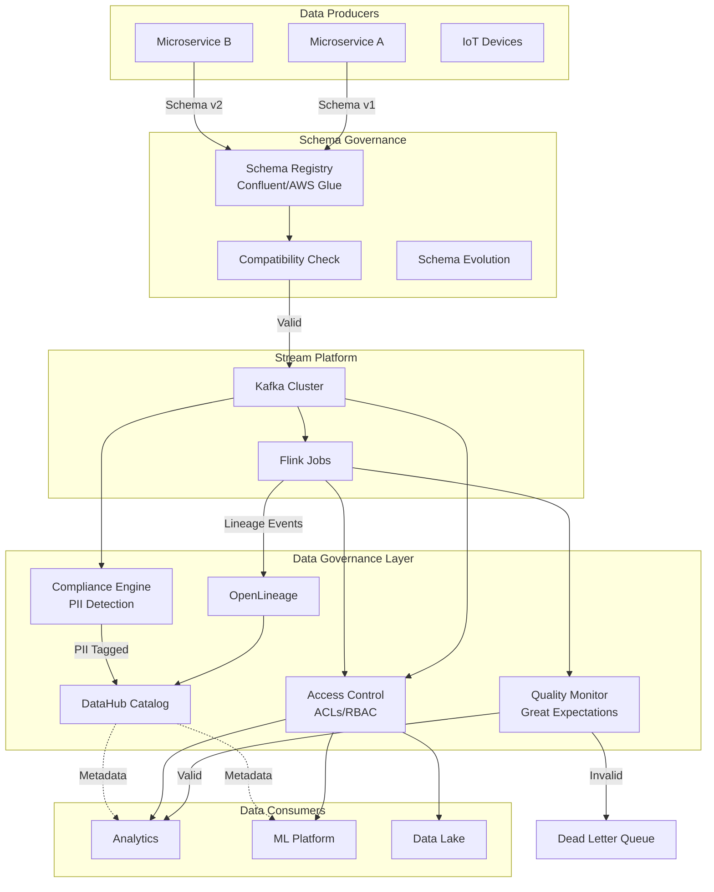
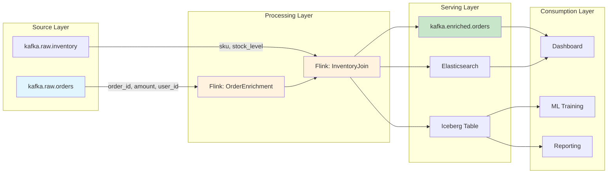
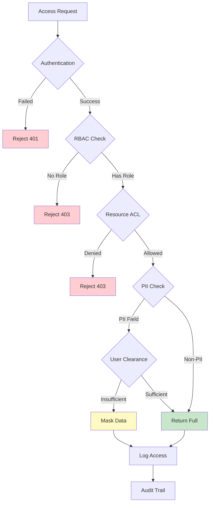
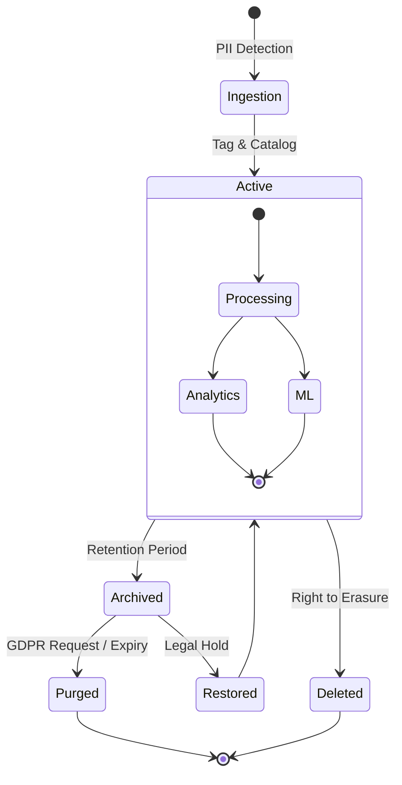
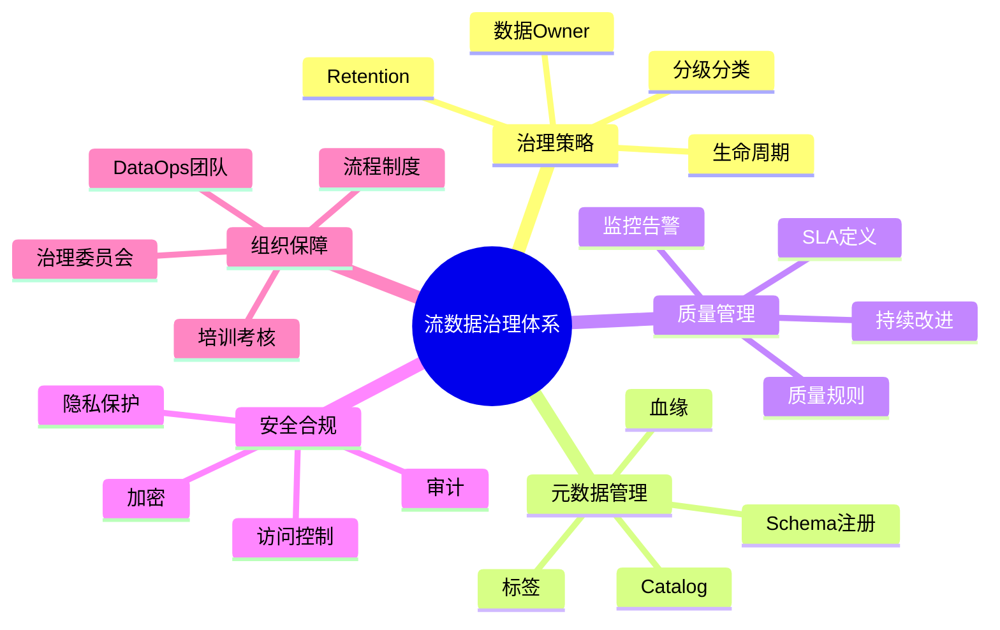
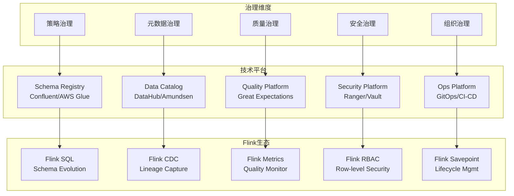
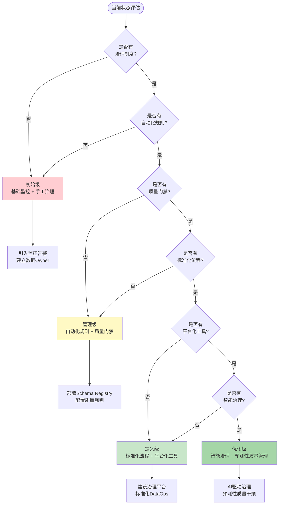
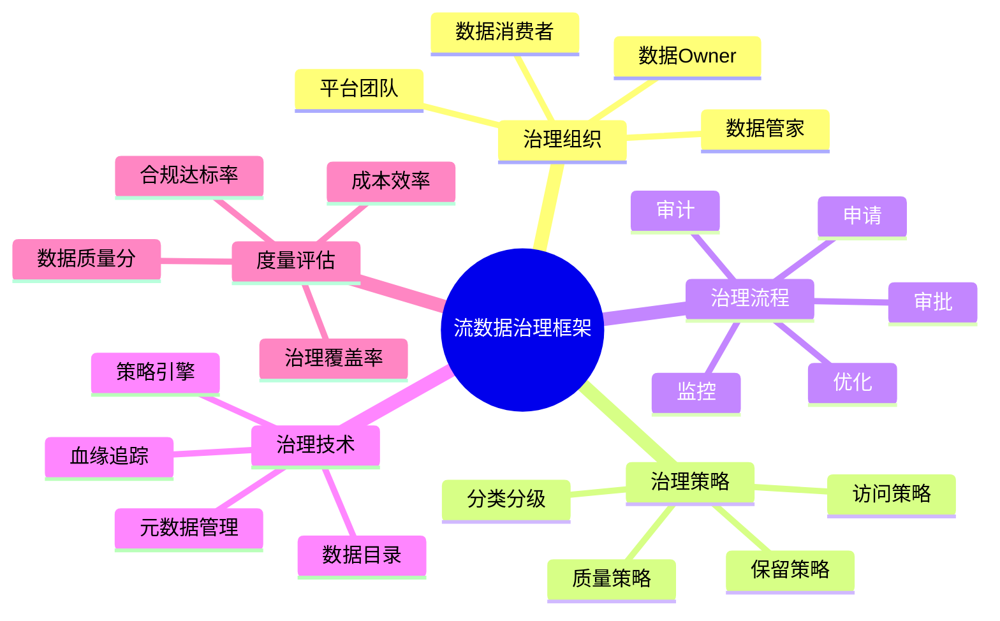
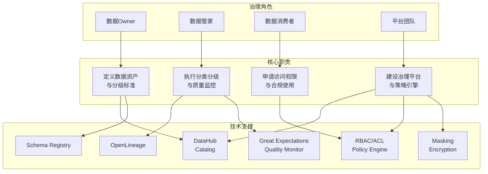
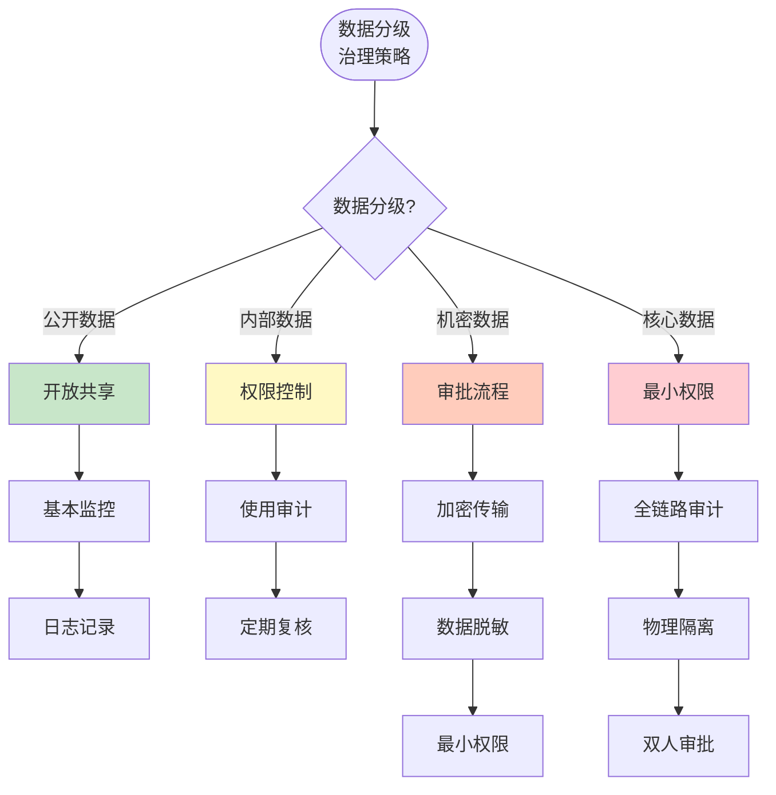

# 流数据治理 (Streaming Data Governance)

> **所属阶段**: Knowledge | **前置依赖**: [07-security/streaming-security-model.md](./streaming-security-compliance.md) | **形式化等级**: L4

---

## 1. 概念定义 (Definitions)

### Def-K-08-20: 流数据治理 (Streaming Data Governance)

流数据治理是对实时数据流的全生命周期管理框架，包含数据**可用性**、**完整性**、**安全性**与**合规性**的系统性保障机制。

$$
\text{StreamingGovernance} = \langle D, S, P, A, Q, C \rangle
$$

其中：

- $D$: 数据资产集合 (Data Assets)
- $S$: Schema 管理 (Schema Registry)
- $P$: 血缘追踪 (Provenance/Lineage)
- $A$: 访问控制 (Access Control)
- $Q$: 质量监控 (Quality)
- $C$: 合规引擎 (Compliance)

### Def-K-08-21: 流数据与批处理治理差异

| 维度 | 批处理治理 (Batch) | 流数据治理 (Streaming) |
|------|-------------------|----------------------|
| **时间粒度** | T+1 / 小时级 | 秒级 / 毫秒级 |
| **Schema变更** | 离线协调 | 实时兼容策略 |
| **血缘追踪** | 作业级依赖 | 事件级追踪 |
| **质量验证** | 事后校验 | 在线断言 |
| **合规审计** | 批量扫描 | 实时PII检测 |

### Def-K-08-22: 三大治理支柱 (Three Pillars)

```
┌─────────────────────────────────────────────────────────────┐
│                    流数据治理架构                             │
├─────────────────┬─────────────────┬─────────────────────────┤
│   Schema Registry │   Data Lineage   │    Access Control       │
│     结构治理      │     血缘追踪      │      访问治理           │
├─────────────────┼─────────────────┼─────────────────────────┤
│ • Avro/Protobuf  │ • 字段级血缘     │ • Kafka ACLs           │
│ • JSON Schema    │ • 作业依赖图     │ • RBAC模型              │
│ • 兼容性检查     │ • 影响分析       │ • 数据脱敏              │
│ • 演进策略       │ • OpenLineage   │ • 行级权限              │
└─────────────────┴─────────────────┴─────────────────────────┘
```

---

## 2. 属性推导 (Properties)

### Prop-K-08-12: 治理覆盖率边界

对于流数据系统 $S$ 的治理覆盖度 $Coverage(S)$：

$$
Coverage(S) = \frac{|D_{governed}|}{|D_{total}|} \times \frac{|E_{tracked}|}{|E_{total}|}
$$

其中 $E$ 表示血缘边。工程实践中，覆盖率目标通常设定为 $Coverage(S) \geq 0.95$。

### Prop-K-08-13: Schema兼容性传递性

若 Schema $v_1 \rightarrow v_2$ 向后兼容，且 $v_2 \rightarrow v_3$ 向后兼容，则 $v_1 \rightarrow v_3$ 向后兼容（在忽略新增字段默认值约束时）。

### Prop-K-08-14: 合规延迟上界

GDPR "right to be forgotten" 在流系统中的实现延迟 $T_{compliance}$ 满足：

$$
T_{compliance} \leq T_{retention} + T_{propagation} + T_{checkpoint}
$$

其中：

- $T_{retention}$: 数据保留期
- $T_{propagation}$: 删除指令传播延迟
- $T_{checkpoint}$: 检查点周期

---

## 3. 关系建立 (Relations)

### 与 Data Mesh 的关系

```
┌────────────────────────────────────────────────────────────────┐
│                      Data Mesh 架构                             │
├──────────────┬──────────────┬──────────────┬───────────────────┤
│   Domain A   │   Domain B   │   Domain C   │   Platform Team    │
│   (Order)    │  (Customer)  │  (Inventory) │   (Governance)     │
├──────────────┼──────────────┼──────────────┼───────────────────┤
│ Schema Reg.  │ Schema Reg.  │ Schema Reg.  │  Global Schema      │
│  (Local)     │   (Local)    │   (Local)    │   Governance       │
├──────────────┼──────────────┼──────────────┼───────────────────┤
│ Domain ACLs  │ Domain ACLs  │ Domain ACLs  │  Federated Policy   │
│  Self-serve  │  Self-serve  │  Self-serve  │   Enforcement      │
└──────────────┴──────────────┴──────────────┴───────────────────┘
              ↑ Governance as Code (GaC)
```

### 与 Data Fabric 的关系

Data Fabric 提供**统一元数据层**，流数据治理作为其**实时执行引擎**：

```
┌─────────────────────────────────────────┐
│          Data Fabric 层                  │
│    (统一元数据 / AI驱动 / 自动化)         │
├─────────────────────────────────────────┤
│  ┌──────────┐  ┌──────────┐  ┌────────┐ │
│  │ Knowledge│  │ Semantic │  │ Active │ │
│  │  Graph   │  │  Layer   │  │Metadata│ │
│  └────┬─────┘  └────┬─────┘  └───┬────┘ │
│       └─────────────┴────────────┘      │
│                   ↓                     │
│  ┌──────────────────────────────────┐   │
│  │     流数据治理执行层               │   │
│  │  Schema | Lineage | ACL | Quality │   │
│  └──────────────────────────────────┘   │
└─────────────────────────────────────────┘
```

---

## 4. 论证过程 (Argumentation)

### Thm-K-08-15: 流数据治理的必要性

**陈述**: 对于生产级流数据平台，缺乏治理将导致系统性风险不可控。

**论证**:

1. **Schema漂移风险**:
   - 生产者 Schema 变更 $\rightarrow$ 消费者解析失败
   - 历史数据与新 Schema 不兼容

2. **血缘断裂风险**:
   - 无法追溯数据质量问题根源
   - 变更影响范围不可评估

3. **合规失效风险**:
   - PII 数据无标记 $\rightarrow$ 审计失败
   - 删除权无法落实 $\rightarrow$ 法律风险

4. **权限蔓延风险**:
   - 缺乏细粒度 ACL $\rightarrow$ 数据泄露
   - 过度授权 $\rightarrow$ 内部威胁

---

### 反例分析: 无治理的流系统

某电商平台 Kafka 集群：

```
问题链:
OrderService v2.1 新增字段 "discount_amount" (double)
         ↓
Flink 作业未声明该字段 → 反序列化异常 → 订单流中断
         ↓
无 Schema 兼容性检查 → 生产事故 → 30分钟 P0 故障
         ↓
无血缘追踪 → 无法定位下游影响 → 全面回滚
```

**根因**: 缺少 Schema Registry + 兼容性策略前置校验。

---

## 5. 工程论证 (Engineering Argument)

### 5.1 Schema Registry 选型

#### Confluent Schema Registry

```yaml
# docker-compose.yml 部署 services:
  schema-registry:
    image: confluentinc/cp-schema-registry:7.5.0
    environment:
      SCHEMA_REGISTRY_HOST_NAME: schema-registry
      SCHEMA_REGISTRY_KAFKASTORE_BOOTSTRAP_SERVERS: kafka:9092
      SCHEMA_REGISTRY_AVRO_COMPATIBILITY_LEVEL: BACKWARD
```

**兼容性策略**:

| 策略 | 定义 | 适用场景 |
|-----|------|---------|
| `BACKWARD` | 新 Schema 可读旧数据 | 消费者先升级 |
| `FORWARD` | 旧 Schema 可读新数据 | 生产者先升级 |
| `FULL` | 双向兼容 | 推荐默认 |
| `NONE` | 无检查 | 紧急修复 |

**Schema 演进最佳实践**:

```java
// [伪代码片段 - 不可直接运行] 仅展示核心逻辑
// 向后兼容: 新增可选字段 + 默认值
{
  "type": "record",
  "name": "Order",
  "fields": [
    {"name": "order_id", "type": "string"},
    {"name": "amount", "type": "double"},
    // 新增字段: 带默认值确保兼容
    {"name": "discount", "type": ["null", "double"], "default": null}
  ]
}
```

#### AWS Glue Schema Registry

```python
# boto3 集成示例 import boto3
from aws_schema_registry import SchemaRegistryClient

client = boto3.client('glue', region_name='us-east-1')
registry = SchemaRegistryClient(client, registry_name='streaming-registry')

# 注册 Schema schema_version = registry.register_schema(
    schema_name='OrderEvent',
    data_format='AVRO',
    schema_definition=avro_schema_json,
    compatibility='BACKWARD_ALL'  # 检查所有历史版本
)
```

### 5.2 数据血缘实现

#### OpenLineage 集成

```python
# Flink OpenLineage 集成 from pyflink.datastream import StreamExecutionEnvironment
from openlineage.client import OpenLineageClient

env = StreamExecutionEnvironment.get_execution_environment()

# 发送血缘事件 client.emit(
    RunEvent(
        eventType=RunState.START,
        eventTime=datetime.now(),
        run=Run(runId=str(uuid4())),
        job=Job(namespace="prod-flink", name="order-enrichment"),
        inputs=[
            InputDataset(namespace="kafka", name="orders-topic"),
            InputDataset(namespace="redis", name="user-cache")
        ],
        outputs=[
            OutputDataset(namespace="kafka", name="enriched-orders")
        ]
    )
)
```

#### 字段级血缘追踪

```sql
-- Marquez / DataHub 字段级血缘
CREATE VIEW enriched_orders AS
SELECT
    o.order_id,                    -- ← orders-topic.order_id
    o.amount,                      -- ← orders-topic.amount
    u.user_segment,                -- ← user-cache.segment
    o.amount * 0.9 as final_amount -- 派生字段
FROM orders o
JOIN users u ON o.user_id = u.id;

-- 血缘输出:
-- final_amount → 依赖: [orders.amount]
-- user_segment → 依赖: [user-cache.segment]
```

### 5.3 数据目录工具对比

| 特性 | DataHub | Amundsen | Alation |
|-----|---------|----------|---------|
| **流数据原生支持** | ⭐⭐⭐ | ⭐⭐ | ⭐⭐ |
| **OpenLineage集成** | ✅ 原生 | ⚠️ 插件 | ⚠️ 企业版 |
| **字段级血缘** | ✅ | ✅ | 企业版 |
| **实时元数据** | ✅ | ⚠️ | ❌ |
| **开源/商业** | 开源 | 开源 | 商业 |
| **部署复杂度** | 中 | 低 | 高 |

**推荐**: DataHub 作为流数据治理的首选目录。

### 5.4 访问控制实现

#### Kafka ACLs

```bash
# 基于 Principal 的 ACL 管理
# 1. 授予生产者权限 kafka-acls --bootstrap-server kafka:9092 \
  --add --allow-principal User:order-service \
  --producer --topic orders

# 2. 授予消费者组权限 kafka-acls --bootstrap-server kafka:9092 \
  --add --allow-principal User:analytics-service \
  --consumer --topic orders --group analytics-group

# 3. 前缀匹配(多主题授权)
kafka-acls --bootstrap-server kafka:9092 \
  --add --allow-principal User:etl-service \
  --operation Read --topic-prefix 'raw.'
```

#### Flink SQL 权限

```sql
-- 基于 RBAC 的 Flink SQL 权限
-- 创建角色
CREATE ROLE data_analyst;
CREATE ROLE data_engineer;

-- 授权表级权限
GRANT SELECT ON TABLE user_events TO ROLE data_analyst;
GRANT SELECT, INSERT, DELETE ON TABLE user_events TO ROLE data_engineer;

-- 行级安全 (RLS)
CREATE POLICY region_isolation ON user_events
  FOR SELECT
  USING (region = CURRENT_USER_REGION());
```

### 5.5 数据 Masking

```java
// Flink UDF 实现动态脱敏
public class MaskPII extends ScalarFunction {
    public String eval(String value, String piiType) {
        switch (piiType) {
            case "EMAIL":
                return value.replaceAll("(?<=.{2}).(?=@)", "*");
            case "PHONE":
                return value.replaceAll("(?<=.{3}).(?=.{4})", "*");
            case "SSN":
                return "***-**-" + value.substring(7);
            default:
                return value;
        }
    }
}

// SQL 应用
SELECT
    user_id,
    MaskPII(email, 'EMAIL') as email_masked,
    MaskPII(phone, 'PHONE') as phone_masked
FROM users;
```

### 5.6 数据质量监控

```python
# Great Expectations + Kafka 实时验证 from great_expectations.core import ExpectationSuite
from great_expectations.expectations import (
    ExpectColumnValuesToNotBeNull,
    ExpectColumnValuesToBeBetween,
    ExpectColumnValuesToMatchRegex
)

# 定义流数据质量规则 order_expectations = ExpectationSuite(
    name="order_event_expectations",
    expectations=[
        ExpectColumnValuesToNotBeNull(column="order_id"),
        ExpectColumnValuesToBeBetween(column="amount", min_value=0),
        ExpectColumnValuesToMatchRegex(
            column="email",
            regex=r"^[a-zA-Z0-9._%+-]+@[a-zA-Z0-9.-]+\.[a-zA-Z]{2,}$"
        )
    ]
)

# Flink 集成: 实时断言 class QualityValidator(MapFunction):
    def map(self, event):
        validation_result = self.validator.validate(event)
        if not validation_result.success:
            # 发送到死信队列
            context.output(DEAD_LETTER_TAG, validation_result)
        return event
```

**质量 SLA 定义**:

| 指标 | 定义 | 目标值 |
|-----|------|-------|
| 完整性 | 非空字段占比 | ≥ 99.9% |
| 准确性 | 规则通过率 | ≥ 99.5% |
| 及时性 | 端到端延迟 | ≤ 5s |
| 一致性 | 跨系统校验一致率 | ≥ 99.99% |

---

## 6. 实例验证 (Examples)

### 完整治理实现: 金融交易流

```yaml
# 治理即代码 (Governance as Code)
# governance/trade-events.yaml

schema:
  name: TradeEvent
  format: AVRO
  compatibility: FULL
  registry: confluent://schema-registry:8081
  definition: |
    {
      "type": "record",
      "name": "TradeEvent",
      "fields": [
        {"name": "trade_id", "type": "string", "doc": "唯一交易ID"},
        {"name": "symbol", "type": "string", "doc": "交易标的"},
        {"name": "quantity", "type": "long", "doc": "交易数量"},
        {"name": "price", "type": "double", "doc": "成交价格"},
        {"name": "trader_id", "type": "string", "pii": true},
        {"name": "client_id", "type": "string", "pii": true, "sensitive": true}
      ]
    }

lineage:
  source: kafka://trading-cluster/trade-events
  processors:
    - name: trade-validation
      type: flink-job
      inputs: [trade-events]
      outputs: [validated-trades, trade-rejects]
    - name: risk-calculation
      type: flink-job
      inputs: [validated-trades, risk-limits]
      outputs: [risk-enriched-trades]
  sink: kafka://analytics-cluster/enriched-trades

access_control:
  roles:
    - name: trader
      permissions:
        - topic: trade-events
          operations: [READ, WRITE]
          row_filter: "trader_id = '${user.id}'"
      field_masking:
        - field: client_id
          mask_type: HASH  # 哈希脱敏
    - name: risk_manager
      permissions:
        - topic: "*"
          operations: [READ]
      field_masking: []  # 无脱敏
    - name: auditor
      permissions:
        - topic: "*"
          operations: [READ]
      field_masking:
        - field: trader_id
          mask_type: FULL  # 完全脱敏
        - field: client_id
          mask_type: FULL

quality:
  checks:
    - name: price_positive
      type: ExpectColumnValuesToBeBetween
      column: price
      min: 0
      on_failure: DLQ
    - name: symbol_valid
      type: ExpectColumnValuesToBeInSet
      column: symbol
      value_set_ref: listed_symbols  # 动态从数据库加载
      on_failure: ALERT

compliance:
  gdpr:
    - field: trader_id
      purpose: contract_performance
      retention_days: 2555  # 7年
    - field: client_id
      purpose: legal_obligation
      retention_days: 3650  # 10年
  audit:
    enabled: true
    log_topics: [audit-events]
    retention_days: 2555
```

### 血缘影响分析示例

```
场景: 需要修改 trade-events Schema (新增 settlement_date 字段)

影响分析流程:
┌────────────────────────────────────────────────────────────┐
│ Step 1: Schema Registry 检查兼容性                          │
│         FULL 兼容 → 继续                                    │
├────────────────────────────────────────────────────────────┤
│ Step 2: DataHub 血缘查询                                    │
│         上游: trading-service (生产者)                      │
│         下游:                                               │
│           ├─ trade-validation (Flink) → 需更新 SQL          │
│           ├─ risk-calculation (Flink) → 无影响              │
│           ├─ trade-analytics (Dashboard) → 需添加字段       │
│           └─ regulatory-report (Spark Batch) → 需回归测试   │
├────────────────────────────────────────────────────────────┤
│ Step 3: 生成变更工单                                         │
│         1. 更新 trading-service 发布 v2.3                   │
│         2. 更新 trade-validation SQL                        │
│         3. 更新 analytics 仪表盘                             │
│         4. 执行 regression test                             │
└────────────────────────────────────────────────────────────┘
```

---

## 5. 形式证明 / 工程论证 (Proof / Engineering Argument)

本文档的证明或工程论证已在正文中完成。详见相关章节。

## 7. 可视化 (Visualizations)

### 治理架构全景图



### 数据血缘追踪图



### 访问控制决策树



### 合规数据生命周期



### 流数据治理体系思维导图

以下思维导图展示流数据治理的五大核心领域及其关键要素：



### 治理维度与技术平台映射

以下多维关联树展示治理维度到技术平台再到Flink生态的完整映射：



### 治理成熟度演进决策树

以下决策树展示从初始级到优化级的治理成熟度演进路径：



### 流数据治理框架思维导图

以下思维导图以"流数据治理框架"为中心，放射展开治理组织、策略、流程、技术与度量评估五大核心领域：



### 治理角色-职责-技术支撑关联树

以下多维关联树展示治理角色、核心职责与技术支撑之间的映射关系：



### 数据分级治理策略决策树

以下决策树展示基于数据敏感度级别的差异化治理策略：



---

## 8. 引用参考 (References)


---

*文档版本: v1.0 | 创建日期: 2026-04-20*
