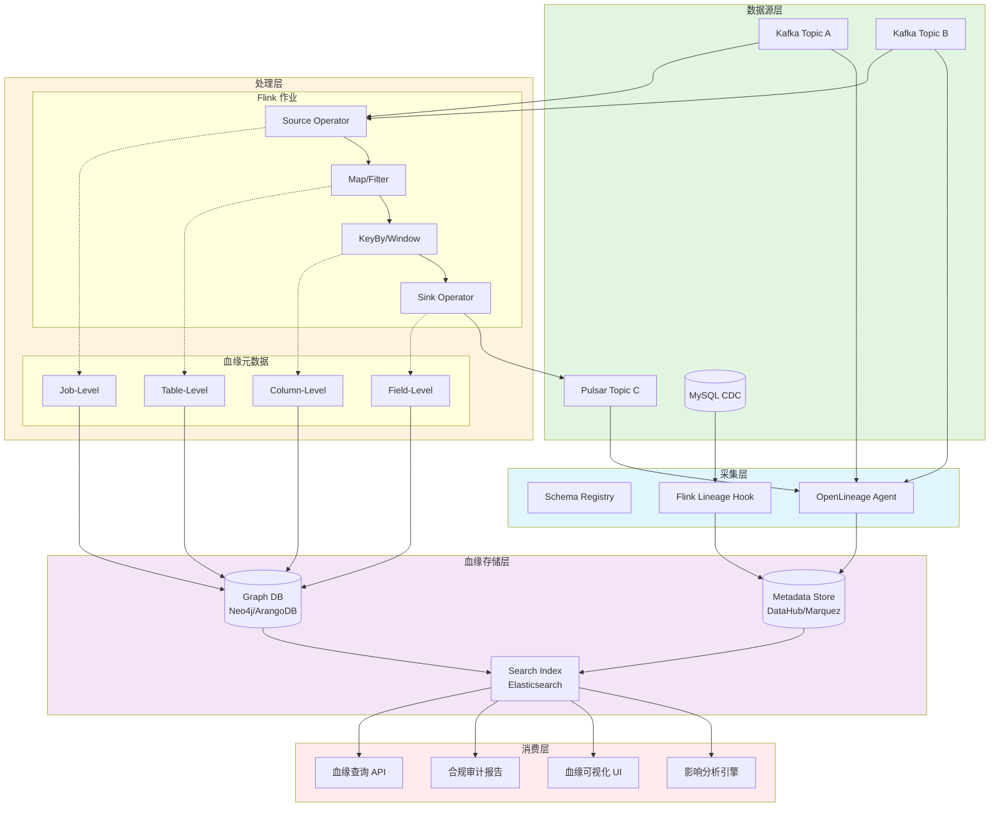
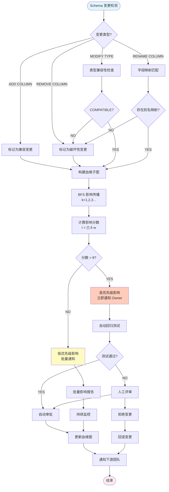
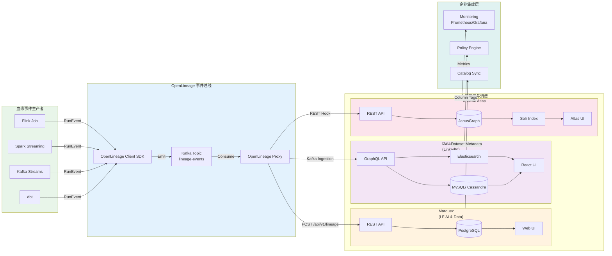

# 流计算数据血缘与影响分析深度指南 (Streaming Data Lineage & Impact Analysis Deep Guide)

> **所属阶段**: Knowledge | **前置依赖**: [streaming-data-governance.md](./streaming-data-governance.md), [streaming-data-governance-quality.md](./streaming-data-governance-quality.md) | **形式化等级**: L4

---

## 1. 概念定义 (Definitions)

### Def-K-08-40: 流数据血缘图 (Streaming Data Lineage Graph)

流数据血缘图是一个带时间戳的有向属性图，用于形式化描述数据元素在流计算系统中的来源、变换与去向。

$$
\mathcal{L}(t) = \langle V(t), E(t), \Lambda_V, \Lambda_E, \tau \rangle
$$

其中：

- $V(t) = V_{ds}(t) \cup V_{op}(t)$: 时刻 $t$ 的节点集合，$V_{ds}$ 为数据集节点（Topic、Table、Stream），$V_{op}$ 为操作节点（Job、Operator、Function）
- $E(t) \subseteq V(t) \times V(t)$: 有向数据流边，$e = (u, v)$ 表示数据从 $u$ 流向 $v$
- $\Lambda_V: V \to \mathcal{P}(Attributes)$: 节点属性映射，包含 Schema、Owner、SLA 等
- $\Lambda_E: E \to \mathcal{P}(TransformMeta)$: 边属性映射，包含变换类型、表达式、时间窗口
- $\tau: E \to \mathbb{R}_{\geq 0}$: 边的时间戳函数，记录血缘关系生效时间

血缘图具有**时间演化性**：$\mathcal{L}(t_1) \neq \mathcal{L}(t_2)$ 当且仅当拓扑、Schema 或处理逻辑发生变更。

### Def-K-08-41: 血缘粒度层次 (Lineage Granularity Hierarchy)

流数据血缘按追踪精度划分为四个层次，形成偏序关系 $\preceq$：

$$
\text{Field-Level} \preceq \text{Column-Level} \preceq \text{Table-Level} \preceq \text{Job-Level}
$$

**Def-K-08-41a - 作业级血缘 (Job-Level Lineage)**：

$$
L_{job} = \langle V_{job}, E_{job} \rangle, \quad V_{job} = \{Job_1, Job_2, \ldots, Job_n\}
$$

仅追踪作业（Job/Pipeline）之间的数据依赖关系，不解析内部字段映射。粒度最粗，开销最低。

**Def-K-08-41b - 表级血缘 (Table-Level Lineage)**：

$$
L_{table} = \langle V_{table}, E_{table}, \phi_{table} \rangle
$$

其中 $\phi_{table}: E_{table} \to \{SELECT, INSERT, JOIN, AGGREGATE, \ldots\}$ 标记表间操作类型。追踪物理表/Topic 级别的读写关系。

**Def-K-08-41c - 列级血缘 (Column-Level Lineage)**：

$$
L_{column} = \langle V_{col}, E_{col}, \pi \rangle, \quad \pi: E_{col} \to 2^{Expr}
$$

追踪输出列与输入列之间的派生关系，$\pi$ 记录变换表达式集合。例如 `SELECT a+b AS c` 产生边 $(a, c)$ 和 $(b, c)$，表达式为 $\{a+b\}$。

**Def-K-08-41d - 字段级血缘 (Field-Level Lineage)**：

$$
L_{field} = \langle V_{field}, E_{field}, \pi, \delta \rangle, \quad \delta: E_{field} \to [0, 1]
$$

在列级基础上引入**影响系数** $\delta$，量化输入字段对输出字段的贡献度。例如 `COALESCE(a, b) AS c` 中，$\delta(a, c) = 0.5, \delta(b, c) = 0.5$；而 `CAST(a AS STRING) AS c` 中，$\delta(a, c) = 1.0$。

### Def-K-08-42: 动态血缘拓扑 (Dynamic Lineage Topology)

流计算系统的血缘拓扑具有运行时动态演化特性。定义动态血缘拓扑为时变图：

$$
\mathcal{G}_L(t) = (\mathcal{L}(t), \Delta(t), \mathcal{R}(t))
$$

其中：

- $\mathcal{L}(t)$: 时刻 $t$ 的静态血缘快照
- $\Delta(t) = \{\delta_1, \delta_2, \ldots\}$: 拓扑变更事件序列，$\delta_i \in \{ADD, REMOVE, MODIFY, SPLIT, MERGE\}$
- $\mathcal{R}(t)$: 血缘版本寄存器，$\mathcal{R}(t) = \{v_1, v_2, \ldots, v_k\}$，维护历史版本的有序集合

**动态性来源**：

1. **算子扩缩容**：并行度调整导致 $V_{op}$ 中节点分裂或合并
2. **动态分区**：Kafka 分区增减改变 $V_{ds}$ 的子节点结构
3. **状态迁移**：Flink Savepoint 恢复可能引入新的状态算子
4. **规则热更新**：CEP 模式或动态过滤条件的运行时变更

### Def-K-08-43: 版本漂移与血缘一致性 (Version Drift & Lineage Consistency)

当数据生产者与消费者的 Schema 或处理逻辑以不同节奏演进时，产生**版本漂移**。

定义版本漂移度量为：

$$
Drift(v_{prod}, v_{cons}, t) = \frac{|Schema_{prod}(t) \setminus Schema_{cons}(t)| + |Schema_{cons}(t) \setminus Schema_{prod}(t)|}{|Schema_{prod}(t) \cup Schema_{cons}(t)|}
$$

**Def-K-08-43a - 血缘一致性 (Lineage Consistency)**：

在时间区间 $[t_0, t_1]$ 内，若对所有数据流边 $e \in E(t)$ 满足：

$$
\forall e = (u, v): Schema_u(t) \triangleright Schema_v(t)
$$

其中 $\triangleright$ 表示 Schema 兼容关系（向前兼容 $\to$ 或向后兼容 $\leftarrow$），则称血缘在 $[t_0, t_1]$ 内是**一致的**。

**Def-K-08-43b - 漂移检测窗口 (Drift Detection Window)**：

定义检测窗口 $W_{drift} = [t - \Delta t, t]$，当窗口内版本漂移超过阈值 $\theta_{drift}$ 时触发血缘重计算：

$$
\exists t' \in W_{drift}: Drift(v_{prod}(t'), v_{cons}(t')) > \theta_{drift} \Rightarrow \text{Recalculate}(\mathcal{L}(t))
$$

### Def-K-08-44: 影响分析模型 (Impact Analysis Model)

影响分析是在血缘图上进行的变更传播预测，形式化为图传播函数：

$$
\text{Impact}(v_{change}, k) = \{u \in V \mid d_{\mathcal{L}}(v_{change}, u) \leq k\}
$$

其中 $d_{\mathcal{L}}(v_{change}, u)$ 表示在血缘图 $\mathcal{L}$ 中从变更节点 $v_{change}$ 到节点 $u$ 的最短路径距离（以跳数计量），$k$ 为影响半径。

**影响强度量化**：

$$
I(v_{change} \leadsto u) = \prod_{e \in Path(v_{change}, u)} \delta(e) \times w(e)
$$

其中 $\delta(e)$ 为 Def-K-08-41d 定义的影响系数，$w(e) \in [0, 1]$ 为边的置信权重（由采集方式决定：静态解析 $w=0.9$，动态观测 $w=0.95$，人工标注 $w=0.7$）。

**影响分类**：

- **直接影响** ($k=1$)：下游直接消费变更节点的数据
- **间接影响** ($k=2$)：通过中间节点传递的变更
- **潜在影响** ($k \geq 3$ 或跨系统边界)：需要人工评估的远距离依赖

### Def-K-08-45: 血缘采集模式 (Lineage Collection Modes)

血缘信息按采集时机与方式分为三类：

**Def-K-08-45a - 静态采集 (Static Collection)**：

$$
\mathcal{C}_{static}(Q) = Parse(Q) \to AST \to LineageGraph
$$

通过解析查询语句（SQL、DSL）或代码（Java/Python API 调用链）提取血缘，不依赖运行时数据。优点：零运行时开销、100% 覆盖声明式逻辑。缺点：无法捕获动态条件分支、UDF 黑盒。

**Def-K-08-45b - 动态采集 (Dynamic Collection)**：

$$
\mathcal{C}_{dynamic}(S, t_0, t_1) = \{(e, f(e), t) \mid e \in E_{actual}, t \in [t_0, t_1]\}
$$

通过在运行时拦截数据流或元数据变更来捕获实际执行的血缘。优点：捕获真实数据流、动态条件结果。缺点：采样开销、可能遗漏低频率路径。

**Def-K-08-45c - 混合采集 (Hybrid Collection)**：

$$
\mathcal{C}_{hybrid} = \mathcal{C}_{static} \cup \mathcal{C}_{dynamic} \cup ConflictResolution(\mathcal{C}_{static} \cap \mathcal{C}_{dynamic})
$$

静态解析提供基线血缘，动态追踪补充运行时特定路径，冲突解决策略（如动态优先或人工仲裁）处理不一致。

---

## 2. 属性推导 (Properties)

### Prop-K-08-25: 血缘粒度与存储复杂度权衡

对于包含 $|V|$ 个节点、平均出度 $d$ 的血缘图，不同粒度的存储复杂度满足：

$$
|L_{field}| \geq |L_{column}| \geq |L_{table}| \geq |L_{job}|
$$

具体地，设平均每个表包含 $c$ 列，每列涉及 $f$ 个字段映射关系：

$$
\begin{aligned}
|L_{job}| &= O(|V_{job}| + |E_{job}|) = O(|V|) \\
|L_{table}| &= O(|V_{table}| \cdot c + |E_{table}|) = O(c|V|) \\
|L_{column}| &= O(|V_{col}| + |E_{col}|) = O(c^2 d |V|) \\
|L_{field}| &= O(|V_{field}| + |E_{field}|) = O(f c^2 d |V|)
\end{aligned}
$$

**工程推论**：在 $|V| = 10^4, c=50, d=3, f=2$ 的中型流平台中，字段级血缘的边数约为作业级血缘的 $10^5$ 倍。因此工业实践通常采用**表级为主、列级按需、字段级关键路径**的混合策略。

### Prop-K-08-26: 动态拓扑的单调性约束

在标准流处理语义（无算子删除、无逻辑变更）下，血缘图的节点和边集合随时间单调不减：

$$
\forall t_1 < t_2: V(t_1) \subseteq V(t_2) \land E(t_1) \subseteq E(t_2)
$$

**证明概要**：流处理系统的物理拓扑仅在以下情况变更：

1. **扩缩容**：增加或减少并行实例。增加时 $V \uparrow$；减少时 $V \downarrow$，但血缘关注的是逻辑算子而非物理实例
2. **动态表**：新分区注册。单调增加
3. **规则更新**：条件分支变更，可能导致边集合非单调

因此，在**逻辑层**且**无规则热更新**的前提下，血缘拓扑单调不减成立。若存在规则热更新，则需引入版本快照维护历史视图。

### Lemma-K-08-15: 影响传播的衰减引理

设影响系数 $\delta(e) \leq 1$ 且置信权重 $w(e) \leq 1$，对于长度为 $n$ 的影响路径：

$$
I(v_0 \leadsto v_n) = \prod_{i=1}^{n} \delta(e_i) \cdot w(e_i) \leq \left(\delta_{max} \cdot w_{max}\right)^n
$$

若 $\delta_{max} \cdot w_{max} < 1$，则影响强度随距离指数衰减：

$$
\lim_{n \to \infty} I(v_0 \leadsto v_n) = 0
$$

**工程含义**：超过 3-5 跳的间接影响通常可以归类为"潜在影响"，其量化值低于阈值 $\theta_{impact}$，在变更评估中优先级降低。该引理为影响分析算法提供了有效的剪枝策略。

### Lemma-K-08-16: 混合采集的完备性下界

设静态采集覆盖率为 $\gamma_{static}$（声明式逻辑占比），动态采集采样率为 $\rho_{dynamic}$，实际执行路径中声明式逻辑占比为 $\eta$：

$$
\gamma_{hybrid} = \eta \cdot \gamma_{static} + (1 - \eta) \cdot \rho_{dynamic} \cdot \gamma_{dynamic}
$$

在 $\gamma_{static} = 1$（完整解析）、$\gamma_{dynamic} = 1$（全量追踪）、且冲突以动态结果为准的假设下：

$$
\gamma_{hybrid} \geq \max(\eta, (1-\eta)\rho_{dynamic})
$$

当 $\rho_{dynamic} \to 1$（全量动态追踪）时，$\gamma_{hybrid} \to 1$，即混合模式在理论上可达完备。

**实际约束**：UDF 内部逻辑通常仍属黑盒，需依赖代码静态分析或运行时反射才能达到 $\gamma_{udf} > 0$。

---

## 3. 关系建立 (Relations)

### 3.1 血缘与数据治理框架的关系

数据血缘是数据治理的核心支柱之一，与 Schema 管理、质量监控、访问控制形成正交但相互依赖的关系矩阵：

| 治理维度 | 血缘提供的支撑 | 依赖血缘的信息 |
|---------|--------------|--------------|
| **Schema 管理** | 变更影响范围预测 | 字段级映射关系 |
| **质量监控** | 异常溯源路径 | 上游质量分数传播 |
| **访问控制** | 敏感数据流向追踪 | PII 字段扩散图谱 |
| **合规审计** | 完整处理链证明 | GDPR 处理活动记录 |
| **成本优化** | 冗余作业识别 | 未被消费的输出节点 |

形式化地，定义治理支撑函数：

$$
\text{GovernanceSupport}(dim, \mathcal{L}) = \{info \mid \exists g \in \mathcal{L}: g \vDash requirement_{dim}\}
$$

### 3.2 流血缘与批处理血缘的映射

流批一体架构（如 Flink Table API / Spark Structured Streaming）中，同一逻辑查询可能以批或流模式执行。血缘的流批映射关系为：

$$
\Phi: L_{batch} \leftrightarrow L_{streaming}, \quad \Phi(Q_{batch}) = Q_{streaming}
$$

映射保持以下不变性：

- **字段映射不变**：$\forall c_{in}, c_{out}: (c_{in}, c_{out}) \in L_{batch} \iff (c_{in}, c_{out}) \in L_{streaming}$
- **算子语义不变**：WindowAgg(batch) $\to$ Tumble/Slide Window(streaming)，血缘结构同构
- **时态扩展**：流血缘增加时间窗口边 $E_{temporal}$，批血缘无此时态维度

### 3.3 OpenLineage 与通用血缘模型的关系

OpenLineage 作为行业标准的血缘事件规范，与通用血缘模型的关系为实例化映射：

$$
OpenLineageEvent \subset LineageGraph \times Time \times RunContext
$$

OpenLineage 的核心抽象——`Run`、`Job`、`Dataset`——分别映射到通用模型的：

| OpenLineage 概念 | 通用模型映射 | 说明 |
|-----------------|------------|------|
| `Dataset` | $V_{ds}(t)$ | 输入/输出数据集节点 |
| `Job` | $V_{op}(t)$ | 执行作业/操作节点 |
| `Run` | $\tau^{-1}(t)$ | 特定时间戳的运行实例 |
| `InputFacet` | $\Lambda_E(e_{in})$ | 输入边的元数据属性 |
| `OutputFacet` | $\Lambda_E(e_{out})$ | 输出边的元数据属性 |
| `ColumnLineageDatasetFacet` | $L_{column} \subset \mathcal{L}$ | 列级血缘子图 |

### 3.4 血缘与 Flink 架构的嵌入关系

Flink 的运行时血缘可以通过 JobGraph / ExecutionGraph 间接导出：

$$
Embed: ExecutionGraph \hookrightarrow \mathcal{L}_{flink}
$$

具体嵌入规则：

- `JobVertex` $\to$ $V_{op}$（操作节点）
- `IntermediateResultPartition` $\to$ $V_{ds}$（中间数据集）
- `JobEdge` $\to$ $E_{flow}$（数据流边）
- `StreamConfig` 中的 `OperatorID` 和 `UserCodeClassLoader` $\to$ $\Lambda_V$（节点属性）

对于 Flink SQL，血缘在 `FlinkChangelogModeInferenceProgram` 和 `RelMetadataQuery` 阶段即可通过 `RelNode` 树解析获得，早于物理执行图生成。

---

## 4. 论证过程 (Argumentation)

### 4.1 流计算血缘的独特挑战分析

#### 4.1.1 动态拓扑挑战

批处理系统的血缘通常在编译期完全确定：$L_{batch} = Parse(Q)$。而流系统面临持续数据流入，拓扑可能因以下原因动态变更：

1. **KeyBy 动态重分区**：数据分布倾斜触发 Flink 的弹性扩缩容，子任务数 $p$ 从 $p_1$ 变为 $p_2$，逻辑血缘不变但物理血缘发生分裂/合并
2. **动态表函数 (Temporal Table Function)**：`LATERAL TABLE` 关联的维表可能随时间切换版本，产生时变边权重
3. **CEP 模式匹配**：复杂事件处理的模式序列在运行时编译，静态分析难以提取完整分支

**应对策略**：引入**逻辑血缘层**与**物理血缘层**的解耦。逻辑层保持静态稳定性，物理层记录运行时实例映射：

$$
\mathcal{L}_{physical}(t) = Map(\mathcal{L}_{logical}, ExecutionGraph(t))
$$

#### 4.1.2 运行时变化挑战

流处理的运行时状态（如聚合窗口内容）影响输出结果，但传统血缘不追踪状态依赖。扩展状态血缘：

$$
L_{stateful} = L \cup E_{state}, \quad E_{state} = \{(State_K, v_{out})\}
$$

其中 $State_K$ 为键控状态（KeyedState）。例如 Flink 的 `ValueState<T>` 在每次输入到达时更新，输出不仅依赖当前输入，还依赖历史累积状态。这种**隐式血缘**在故障恢复时必须通过 Checkpoint 完整性保证。

#### 4.1.3 版本漂移挑战

典型场景：上游 Kafka Topic 的 Schema 从 V1 升级到 V2（新增字段 `user_location`），但下游 Flink 作业仍按 V1 消费。此时：

$$
Drift(V2, V1) = \frac{|\{user_location\}|}{|V1 \cup V2|} > 0
$$

若血缘系统未及时更新，将产生**幽灵边**（指向不存在的字段）或**断链**（新增字段未被追踪）。

**缓解方案**：

- Schema Registry 与血缘系统联动（Confluent Schema Registry + DataHub）
- 在血缘变更检测窗口 $W_{drift}$ 内自动触发全量重解析
- 引入**兼容性预测**：$Compat(V_{new}, V_{current}) \in \{FULL, BACKWARD, FORWARD, NONE\}$

### 4.2 血缘采集技术的边界讨论

#### 4.2.1 静态分析的边界

静态 SQL 解析（基于 Apache Calcite / Flink SQL Parser）能够完备提取声明式变换的血缘，但面临以下边界：

| 场景 | 可解析性 | 血缘精度 | 说明 |
|------|---------|---------|------|
| 标准 SQL (SELECT/JOIN/AGG) | 完备 | 列级 | AST 遍历即可 |
| UDF/UDAF | 黑盒 | 作业级 | 除非内联分析字节码 |
| 动态 SQL (EXECUTE IMMEDIATE) | 不可行 | N/A | 运行时才能确定 |
| 反射/元编程 | 不可行 | N/A | 代码生成在运行时 |
| 外部系统调用 (HTTP/RPC) | 不可行 | N/A | 超出系统边界 |

#### 4.2.2 动态追踪的边界

动态追踪通过字节码增强（Java Agent）或 API Hook 捕获运行时数据流：

- **采样偏差**：若采样率 $\rho < 1$，低频路径可能被遗漏，导致血缘不完整
- **性能开销**：字节码插桩通常引入 5%-15% 的吞吐量下降
- **数据隐私**：全量追踪可能捕获敏感字段值，与 GDPR 最小化原则冲突

**折中方案**：仅追踪元数据（字段名、类型、长度）而非字段值，即 **Metadata-Only Lineage**。

#### 4.2.3 混合模式的冲突案例

静态分析表明列 `revenue` 由 `price * quantity` 派生，但动态观测发现某 UDF 分支中 `revenue` 实际来自外部 API 调用。此时静态与动态结果冲突：

$$
\mathcal{C}_{static}(revenue) = \{price, quantity\} \neq \{api\_response\} = \mathcal{C}_{dynamic}(revenue)
$$

冲突解决策略：

1. **动态优先**：运行时实际发生的路径优先
2. **合并策略**：$\{price, quantity, api\_response\}$，标记冲突待人工确认
3. **置信加权**：根据历史准确率动态调整 $w(e)$

---

## 5. 形式证明 / 工程论证 (Proof / Engineering Argument)

### Thm-K-08-30: 流血缘影响分析的传递闭包完备性

**定理陈述**：对于一致的流血缘图 $\mathcal{L}$（满足 Def-K-08-43 的一致性定义），基于传递闭包的影响分析算法能够完备识别所有可达影响节点。

**形式化**：

设变更节点为 $v_c$，影响半径为 $k$，定义传递闭包：

$$
TC(v_c, k) = \{v \in V \mid \exists P = v_c \to \cdots \to v: |P| \leq k\}
$$

算法 `ImpactBFS` 从 $v_c$ 出发执行限定深度的 BFS。则：

$$
\text{Impact}(v_c, k) = TC(v_c, k)
$$

**证明**：

1. **Soundness**（无假阳性）：BFS 仅沿 $E$ 中的实际边遍历，每个被访问节点 $v$ 都存在路径 $P(v_c, v)$，因此 $v \in TC(v_c, k) \Rightarrow v \in \text{Impact}(v_c, k)$
2. **Completeness**（无假阴性）：假设存在 $v \in TC(v_c, k)$ 但 BFS 未访问。由于 $\mathcal{L}$ 一致且边集 $E$ 完备（混合采集已达饱和），BFS 必然遍历所有出边。矛盾。故 $\text{Impact}(v_c, k) \subseteq TC(v_c, k)$

综上，$\text{Impact}(v_c, k) = TC(v_c, k)$。$\blacksquare$

**工程注记**：该定理假设血缘图 $E$ 完备。实际中因 UDF 黑盒、外部系统调用等因素，完备性假设可能不成立。工程上通过引入**置信阈值**和**人工审核队列**处理不确定性。

### Thm-K-08-31: 混合采集策略的最优性

**定理陈述**：在固定资源预算 $B$ 下，混合采集策略 $\mathcal{C}_{hybrid}$ 的血缘覆盖率不低于纯静态或纯动态策略。

**形式化**：

设静态解析成本为 $C_s$（一次性），动态追踪单位时间成本为 $C_d(t)$，预算约束：

$$
C_s + \int_{0}^{T} C_d(t) \, dt \leq B
$$

纯静态策略覆盖 $\gamma_s$，纯动态策略覆盖 $\gamma_d(t)$，混合策略覆盖 $\gamma_h$。

**证明**：

混合策略可退化为纯静态（令 $C_d = 0$）或纯动态（令 $C_s = 0$）。由于优化目标为最大化覆盖率：

$$
\gamma_h^* = \max_{\mathcal{C}_{static}, \mathcal{C}_{dynamic}} \gamma_h \geq \max(\gamma_s^*, \bar{\gamma}_d)
$$

其中 $\gamma_s^*$ 为最优静态配置，$\bar{\gamma}_d$ 为预算约束下最优动态配置。$\blacksquare$

**推论**：在资源允许时，优先部署静态基线（覆盖声明式逻辑），再以动态追踪补充 UDF 和外部调用路径，是帕累托最优策略。

---

## 6. 实例验证 (Examples)

### 6.1 Flink SQL 血缘解析实例

以下示例展示如何通过 Flink SQL Parser + Calcite RelNode 树提取列级血缘。

```java
import org.apache.calcite.rel.RelNode;
import org.apache.calcite.rel.logical.*;
import org.apache.calcite.rex.*;
import java.util.*;
import java.util.stream.*;

/**
 * Flink SQL 血缘解析器 —— 基于 Calcite RelNode 遍历
 */
public class FlinkSqlLineageExtractor {

    public LineageGraph extractLineage(RelNode relNode) {
        LineageGraph graph = new LineageGraph();
        extractRecursively(relNode, graph);
        return graph;
    }

    private void extractRecursively(RelNode node, LineageGraph graph) {
        if (node instanceof LogicalProject) {
            LogicalProject project = (LogicalProject) node;
            List<String> outNames = project.getRowType().getFieldNames();
            for (int i = 0; i < project.getProjects().size(); i++) {
                RexNode expr = project.getProjects().get(i);
                Set<String> inputs = extractColumns(expr);
                for (String in : inputs) {
                    graph.addEdge(in, outNames.get(i),
                        new TransformMeta("PROJECT", expr.toString()));
                }
            }
        } else if (node instanceof LogicalJoin) {
            LogicalJoin join = (LogicalJoin) node;
            extractJoinLineage(join, graph);
        } else if (node instanceof LogicalAggregate) {
            LogicalAggregate agg = (LogicalAggregate) node;
            List<String> inNames = agg.getInput().getRowType().getFieldNames();
            List<String> outNames = agg.getRowType().getFieldNames();
            int groupCount = agg.getGroupSet().cardinality();
            // GROUP BY keys propagate to all outputs
            for (int g : agg.getGroupSet()) {
                for (int o = 0; o < outNames.size(); o++) {
                    graph.addEdge(inNames.get(g), outNames.get(o),
                        new TransformMeta("GROUP_KEY", null));
                }
            }
            // Aggregate calls
            for (int i = 0; i < agg.getAggCallList().size(); i++) {
                AggregateCall call = agg.getAggCallList().get(i);
                String outCol = outNames.get(groupCount + i);
                for (int arg : call.getArgList()) {
                    graph.addEdge(inNames.get(arg), outCol,
                        new TransformMeta("AGG", call.getAggregation().getName()));
                }
            }
        }
        for (RelNode input : node.getInputs()) {
            extractRecursively(input, graph);
        }
    }

    private Set<String> extractColumns(RexNode expr) {
        Set<String> cols = new HashSet<>();
        if (expr instanceof RexInputRef) {
            cols.add(((RexInputRef) expr).getName());
        } else if (expr instanceof RexCall) {
            for (RexNode op : ((RexCall) expr).getOperands()) {
                cols.addAll(extractColumns(op));
            }
        }
        return cols;
    }

    private void extractJoinLineage(LogicalJoin join, LineageGraph graph) {
        // Join preserves all columns from both sides
        // Equi-join conditions establish key relationships
        RexNode condition = join.getCondition();
        // Simplified: mark all inputs as contributing to all outputs
        List<String> leftNames = join.getLeft().getRowType().getFieldNames();
        List<String> rightNames = join.getRight().getRowType().getFieldNames();
        List<String> outNames = join.getRowType().getFieldNames();
        for (int i = 0; i < leftNames.size(); i++) {
            graph.addEdge(leftNames.get(i), outNames.get(i),
                new TransformMeta("JOIN_LEFT", join.getJoinType().name()));
        }
        for (int i = 0; i < rightNames.size(); i++) {
            graph.addEdge(rightNames.get(i), outNames.get(leftNames.size() + i),
                new TransformMeta("JOIN_RIGHT", join.getJoinType().name()));
        }
    }
}
```

**SQL 血缘提取结果**：

```sql
INSERT INTO sales_summary
SELECT
    d.region,
    p.category,
    SUM(o.amount * o.quantity) AS total_revenue,
    COUNT(DISTINCT o.order_id) AS order_count
FROM orders o
JOIN customers c ON o.customer_id = c.id
JOIN products p ON o.product_id = p.id
JOIN dim_region d ON c.region_code = d.code
WHERE o.order_time > TIMESTAMP '2025-01-01'
GROUP BY d.region, p.category
```

| 输出列 | 输入列来源 | 变换类型 |
|--------|----------|---------|
| `region` | `dim_region.region` | PROJECT |
| `category` | `products.category` | PROJECT |
| `total_revenue` | `orders.amount`, `orders.quantity` | AGGREGATE(SUM) |
| `order_count` | `orders.order_id` | AGGREGATE(COUNT DISTINCT) |
| `region` (GROUP_KEY) | `dim_region.code` | JOIN CONDITION |

### 6.2 DataStream API 血缘追踪实例

```java
import org.apache.flink.streaming.api.datastream.DataStream;
import org.apache.flink.streaming.api.environment.StreamExecutionEnvironment;
import org.apache.flink.api.common.eventtime.WatermarkStrategy;
import java.time.Duration;
import java.util.Map;
import java.util.List;

/**
 * DataStream API 血缘追踪 —— 基于算子链元数据注册
 */
public class DataStreamLineageTracker {

    public void trackLineage() throws Exception {
        StreamExecutionEnvironment env =
            StreamExecutionEnvironment.getExecutionEnvironment();

        // 输入源
        DataStream<OrderEvent> orders = env
            .fromSource(new KafkaSource<OrderEvent>()
                    .setTopics("orders-topic").build(),
                WatermarkStrategy.forBoundedOutOfOrderness(Duration.ofSeconds(5)),
                "orders-source")
            .uid("orders-source-uid").name("OrdersSource");

        LineageRecorder.recordEdge("kafka:orders-topic",
            "operator:OrdersSource", EdgeType.READ);

        // Map 变换
        DataStream<ParsedOrder> parsed = orders
            .map(new ParseOrderFunction())
            .uid("parse-order-uid").name("ParseOrder");
        LineageRecorder.recordEdge("operator:OrdersSource",
            "operator:ParseOrder", EdgeType.TRANSFORM);

        // KeyBy + Window 聚合
        DataStream<CustomerSummary> summary = parsed
            .keyBy(o -> o.getCustomerId())
            .window(TumblingEventTimeWindows.of(Time.hours(1)))
            .aggregate(new CustomerAggregateFunction())
            .uid("customer-summary-uid").name("CustomerSummary");
        LineageRecorder.recordEdge("operator:ParseOrder",
            "operator:CustomerSummary", EdgeType.STATEFUL_AGG,
            Map.of("window", "1h", "keyBy", "customerId"));

        // 输出 Sink
        summary.addSink(new KafkaSink<CustomerSummary>()
                .setTopic("summary-topic").build())
            .uid("output-sink-uid").name("OutputSink");
        LineageRecorder.recordEdge("operator:CustomerSummary",
            "kafka:summary-topic", EdgeType.WRITE);

        // 导出血缘
        LineageRecorder.buildGraph().exportToOpenLineage("http://marquez:5000");
        env.execute("Lineage-Tracked Pipeline");
    }
}
```

### 6.3 OpenLineage 集成与事件发送实例

```java
import io.openlineage.client.OpenLineage;
import io.openlineage.client.OpenLineageClient;
import java.net.URI;
import java.time.ZonedDateTime;
import java.util.*;
import java.util.stream.*;

/**
 * OpenLineage 流作业集成：发送带列级血缘的事件
 */
public class OpenLineageStreamingIntegration {

    private final OpenLineage ol;
    private final OpenLineageClient client;
    private final URI producer = URI.create("http://flink-lineage-producer");

    public OpenLineageStreamingIntegration() {
        this.ol = new OpenLineage(URI.create("https://w3id.org/openlineage/1.0.0"));
        this.client = OpenLineageClient.builder()
            .uri(URI.create("http://marquez:5000")).build();
    }

    public void emitRunEvent(String jobName, String runId,
            List<DatasetMeta> inputs, List<DatasetMeta> outputs,
            OpenLineage.RunEvent.EventType eventType) {

        OpenLineage.Run run = ol.newRunBuilder()
            .runId(UUID.fromString(runId)).build();
        OpenLineage.Job job = ol.newJobBuilder()
            .namespace("flink-production").name(jobName).build();

        var inputDatasets = inputs.stream()
            .map(this::buildInputDataset).collect(Collectors.toList());
        var outputDatasets = outputs.stream()
            .map(this::buildOutputDataset).collect(Collectors.toList());

        client.emit(ol.newRunEventBuilder()
            .eventType(eventType)
            .eventTime(ZonedDateTime.now())
            .run(run).job(job).producer(producer)
            .inputs(inputDatasets).outputs(outputDatasets)
            .build());
    }

    private OpenLineage.InputDataset buildInputDataset(DatasetMeta meta) {
        var schemaFacet = ol.newSchemaDatasetFacetBuilder()
            .fields(meta.fields.stream()
                .map(f -> ol.newSchemaDatasetFacetFieldsBuilder()
                    .name(f.name).type(f.type).build())
                .collect(Collectors.toList()))
            .build();
        return ol.newInputDatasetBuilder()
            .namespace(meta.namespace).name(meta.name)
            .facetsBuilder().schema(schemaFacet).build()
            .build();
    }

    private OpenLineage.OutputDataset buildOutputDataset(DatasetMeta meta) {
        // 核心：ColumnLineageDatasetFacet 定义输入到输出的列映射
        var fields = meta.columnMappings.stream().map(m ->
            ol.newColumnLineageDatasetFacetFieldsAdditionalBuilder()
                .name(m.outputColumn)
                .inputFields(m.sourceColumns.stream().map(src ->
                    ol.newColumnLineageDatasetFacetFieldsAdditionalInputFieldsBuilder()
                        .namespace(src.namespace)
                        .name(src.dataset + "." + src.column)
                        .transform(m.transformExpr).build()
                ).collect(Collectors.toList()))
                .build()
        ).collect(Collectors.toList());

        var columnLineage = ol.newColumnLineageDatasetFacetBuilder()
            .fields(fields).build();

        return ol.newOutputDatasetBuilder()
            .namespace(meta.namespace).name(meta.name)
            .facetsBuilder().columnLineage(columnLineage).build()
            .build();
    }
}
```

### 6.4 血缘查询 API 与影响分析实现

```python
import networkx as nx
from dataclasses import dataclass
from typing import Set, List, Dict, Optional
from enum import Enum

class ImpactLevel(Enum):
    DIRECT = 1
    INDIRECT = 2
    POTENTIAL = 3

@dataclass
class ImpactResult:
    node_id: str
    level: ImpactLevel
    impact_score: float
    path: List[str]
    confidence: float

class LineageQueryEngine:
    """流数据血缘查询引擎 —— 基于 NetworkX 实现影响分析"""

    def __init__(self, graph: nx.DiGraph):
        self.graph = graph
        self.reverse_graph = graph.reverse()

    def impact_analysis(self, changed_node: str,
                        max_depth: int = 5,
                        score_threshold: float = 0.1) -> List[ImpactResult]:
        """影响分析：预测上游变更的下游传播范围"""
        results = []
        visited = {changed_node: 1.0}
        queue = [(changed_node, 0, 1.0, [changed_node])]

        while queue:
            current, depth, score, path = queue.pop(0)
            if depth >= max_depth or score < score_threshold:
                continue
            for successor in self.graph.successors(current):
                edge = self.graph.edges[current, successor]
                new_score = score * edge.get('impact_coefficient', 1.0) \
                                 * edge.get('confidence', 0.9)
                if successor not in visited or visited[successor] < new_score:
                    visited[successor] = new_score
                    level = (ImpactLevel.DIRECT if depth == 0
                             else ImpactLevel.INDIRECT if depth == 1
                             else ImpactLevel.POTENTIAL)
                    results.append(ImpactResult(
                        successor, level, new_score,
                        path + [successor], edge.get('confidence', 0.9)))
                    queue.append((successor, depth + 1, new_score,
                                  path + [successor]))

        results.sort(key=lambda x: x.impact_score, reverse=True)
        return results

    def lineage_trace(self, target_node: str,
                      direction: str = "upstream",
                      max_depth: int = 10) -> nx.DiGraph:
        """血缘溯源或去向追踪"""
        g = self.reverse_graph if direction == "upstream" else self.graph
        nodes = set()
        queue = [(target_node, 0)]
        visited = {target_node}
        while queue:
            current, depth = queue.pop(0)
            nodes.add(current)
            if depth >= max_depth:
                continue
            for neighbor in g.successors(current):
                if neighbor not in visited:
                    visited.add(neighbor)
                    queue.append((neighbor, depth + 1))
        return self.graph.subgraph(nodes).copy()

    def gdpr_deletion_paths(self, subject_field: str,
                            subject_value: str) -> List[List[str]]:
        """GDPR 被遗忘权：追踪个人数据的完整处理链"""
        sources = [n for n, attr in self.graph.nodes(data=True)
                   if subject_field in attr.get('pii_fields', [])]
        sinks = [n for n, attr in self.graph.nodes(data=True)
                 if attr.get('is_sink', False)]
        all_paths = []
        for source in sources:
            for sink in sinks:
                try:
                    all_paths.extend(
                        list(nx.all_simple_paths(
                            self.graph, source, sink, cutoff=10)))
                except nx.NetworkXNoPath:
                    continue
        return all_paths
```

### 6.5 合规审计日志链实例

```python
import hashlib
import json
import time
from dataclasses import dataclass, asdict
from typing import Optional, List

@dataclass
class AuditRecord:
    """审计日志记录 —— 满足 GDPR / 金融监管要求"""
    record_id: str
    timestamp: float
    actor: str
    action: str
    target_dataset: str
    target_field: Optional[str]
    operation_type: str
    source_ip: str
    session_id: str
    previous_hash: str
    signature: Optional[str] = None

    def canonical(self) -> str:
        d = asdict(self)
        d.pop('signature')
        return json.dumps(d, sort_keys=True, ensure_ascii=False)

    def compute_hash(self) -> str:
        return hashlib.sha256(self.canonical().encode()).hexdigest()

class TamperProofAuditLog:
    """防篡改审计日志链 —— 结合血缘图实现合规审计"""

    def __init__(self):
        self.records: List[AuditRecord] = []
        self.last_hash = "0" * 64

    def append(self, actor: str, action: str, target_dataset: str,
               operation_type: str, target_field: Optional[str] = None,
               source_ip: str = "unknown", session_id: str = "") -> AuditRecord:
        record = AuditRecord(
            record_id=f"AUD-{int(time.time()*1000)}-{len(self.records)}",
            timestamp=time.time(), actor=actor, action=action,
            target_dataset=target_dataset, target_field=target_field,
            operation_type=operation_type, source_ip=source_ip,
            session_id=session_id, previous_hash=self.last_hash)
        self.last_hash = record.compute_hash()
        self.records.append(record)
        return record

    def verify_integrity(self) -> bool:
        """验证审计链完整性"""
        prev = "0" * 64
        for r in self.records:
            if r.previous_hash != prev:
                return False
            prev = r.compute_hash()
        return True

    def query_by_dataset(self, dataset: str,
                         start: float = 0,
                         end: float = float('inf')) -> List[AuditRecord]:
        return [r for r in self.records
                if r.target_dataset == dataset and start <= r.timestamp <= end]

    def export_gdpr_ropa(self, controller: str) -> dict:
        """导出 GDPR Article 30 处理活动记录"""
        activities = {}
        for r in self.records:
            key = (r.target_dataset, r.operation_type)
            if key not in activities:
                activities[key] = {
                    'controller': controller, 'dataset': r.target_dataset,
                    'purpose': r.action, 'data_subjects': 'End Users',
                    'categories': [r.target_field] if r.target_field else ['all'],
                    'recipients': [r.actor], 'retention': '6 years',
                    'security': ['encryption', 'access_control'],
                    'first': r.timestamp, 'last': r.timestamp}
            else:
                a = activities[key]
                a['last'] = max(a['last'], r.timestamp)
                if r.actor not in a['recipients']:
                    a['recipients'].append(r.actor)
        return {'controller': controller,
                'record_date': time.strftime('%Y-%m-%d'),
                'processing_activities': list(activities.values())}
```

---

## 7. 可视化 (Visualizations)

### 7.1 流数据血缘架构层次图

以下 Mermaid 图展示了流数据血缘系统的完整架构层次，从数据源到消费端的五层血缘追踪体系：



### 7.2 影响分析流程与变更传播决策树

以下流程图展示了从上游 Schema 变更触发到下游影响评估完成的完整决策流程：



### 7.3 工具集成拓扑与数据流

以下架构图展示了 OpenLineage、Marquez、DataHub、Apache Atlas 在流计算场景中的集成拓扑和数据流向：



---

## 8. 引用参考 (References)

---

*文档版本: v1.0 | 创建日期: 2026-04-19*
