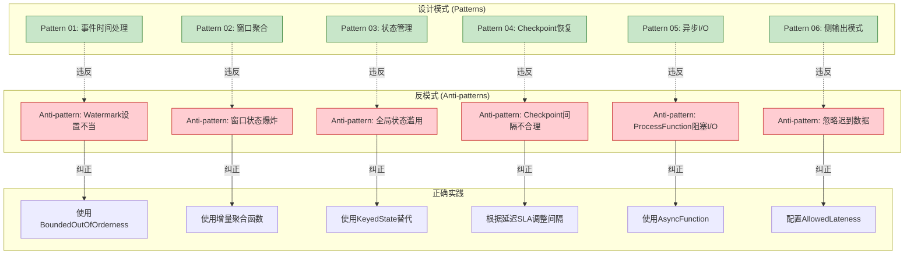

# 流处理反模式目录 (Anti-patterns Catalog)

> **所属阶段**: Knowledge/09-anti-patterns | **前置依赖**: [02-design-patterns](../02-design-patterns/) | **形式化等级**: L3-L5
>
> 本目录汇集流处理系统中常见但低效、有风险的设计实践，与设计模式形成互补，帮助工程师识别并避免生产环境中的典型陷阱。

---

## 目录

- [流处理反模式目录 (Anti-patterns Catalog)](#流处理反模式目录-anti-patterns-catalog)
  - [目录](#目录)
  - [1. 什么是反模式？](#1-什么是反模式)
  - [2. 反模式与设计模式的关系](#2-反模式与设计模式的关系)
  - [3. 反模式分类矩阵](#3-反模式分类矩阵)
    - [按影响域分类](#按影响域分类)
    - [按严重程度分类](#按严重程度分类)
    - [按检测难度分类](#按检测难度分类)
  - [4. 反模式清单](#4-反模式清单)
    - [时间语义类](#时间语义类)
    - [状态管理类](#状态管理类)
    - [容错配置类](#容错配置类)
    - [数据分布类](#数据分布类)
    - [I/O 处理类](#io-处理类)
    - [资源管理类](#资源管理类)
  - [5. 检测清单速查](#5-检测清单速查)
  - [6. 引用参考 (References)](#6-引用参考-references)

---

## 1. 什么是反模式？

**定义 (Def-K-09-01)**:

> 反模式（Anti-pattern）是指在特定上下文中**看似合理但实践中被证明低效或有害**的设计实践。它通常源于对系统机制的误解、短期便利优先于长期维护，或对边界条件的忽视。

反模式与设计模式的关键区别 [^1]：

| 维度 | 设计模式 | 反模式 |
|------|----------|--------|
| **性质** | 最佳实践，应主动采用 | 常见问题，应主动避免 |
| **识别难度** | 需要学习才能应用 | 看似直观，容易误入 |
| **后果** | 提升可维护性和性能 | 导致技术债务和故障 |
| **文档作用** | 指导正确实现 | 警示常见陷阱 |

**流处理反模式的特殊性** [^2]：

流处理系统的分布式、有状态、实时性特征使得反模式的后果往往具有以下特点：

1. **延迟暴露**：状态积累、资源泄漏等问题不会立即显现
2. **级联放大**：单点问题会通过数据流拓扑扩散
3. **恢复困难**：有状态算子的修复涉及 Checkpoint 管理和状态重建
4. **难以调试**：分布式环境下的时序和并发问题难以复现

---

## 2. 反模式与设计模式的关系



**设计原则 vs 反模式** [^3]：

| 设计原则 | 对应的反模式 |
|----------|--------------|
| 算子应尽量无状态 | 全局状态滥用 |
| Watermark 需平衡延迟与完整性 | Watermark 设置不当 |
| Checkpoint 频率应与恢复SLA匹配 | Checkpoint 间隔不合理 |
| 数据分布应均匀 | 热点 Key 未处理 |
| 异步处理外部请求 | ProcessFunction 中阻塞 I/O |
| 注册自定义类型优化序列化 | 序列化开销忽视 |
| 窗口状态需有界管理 | 窗口函数中状态爆炸 |
| 尊重背压信号进行流控 | 忽略背压信号 |
| Join 操作需时间对齐 | 多流 Join 未处理时间对齐 |
| 资源预估需留足余量 | 资源估算不足导致 OOM |

---

## 3. 反模式分类矩阵

### 按影响域分类

| 分类 | 描述 | 包含反模式 |
|------|------|------------|
| **时间语义类** | 与时间处理相关的误用 | AP-02 (Watermark), AP-09 (多流Join) |
| **状态管理类** | 状态使用不当导致的性能/稳定性问题 | AP-01 (全局状态), AP-07 (窗口状态爆炸) |
| **容错配置类** | Checkpoint 与恢复机制配置错误 | AP-03 (Checkpoint间隔) |
| **数据分布类** | 数据倾斜与分区问题 | AP-04 (热点Key) |
| **I/O处理类** | 外部交互的性能陷阱 | AP-05 (阻塞I/O), AP-06 (序列化) |
| **资源管理类** | 资源规划与背压处理 | AP-08 (忽略背压), AP-10 (资源估算) |

### 按严重程度分类

```
┌─────────────────────────────────────────────────────────────────────────┐
│                        反模式严重程度金字塔                              │
├─────────────────────────────────────────────────────────────────────────┤
│                                                                         │
│                              ▲                                          │
│                             /█\     P0 - 灾难性                         │
│                            /███\    可导致系统完全不可用                │
│                           /█████\   例如: AP-10 OOM, AP-08 背压失控      │
│                          /███████\                                      │
│                         ▔▔▔▔▔▔▔▔▔                                       │
│                                                                         │
│                            ▲                                            │
│                           /██\      P1 - 高危                           │
│                          /████\     可导致严重性能退化或数据丢失        │
│                         /██████\    例如: AP-02 Watermark, AP-07 状态爆炸│
│                        ▔▔▔▔▔▔▔▔                                         │
│                                                                         │
│                          ▲                                              │
│                         /██\        P2 - 中等                           │
│                        /████\       可导致资源浪费或维护困难            │
│                       ▔▔▔▔▔▔                                            │
│                                                                         │
│                        ▲                                                │
│                       /██\          P3 - 低危                           │
│                      ▔▔▔▔                                               │
│                                                                         │
└─────────────────────────────────────────────────────────────────────────┘
```

### 按检测难度分类

| 检测难度 | 反模式 | 检测手段 |
|----------|--------|----------|
| **易** | AP-05 阻塞I/O, AP-01 全局状态 | 代码审查 |
| **中** | AP-03 Checkpoint间隔, AP-06 序列化 | 配置审计 + 性能分析 |
| **难** | AP-04 热点Key, AP-07 窗口状态爆炸 | 运行时监控 + 指标分析 |
| **极难** | AP-02 Watermark, AP-08 背压 | 专业工具 + 专家经验 |

---

## 4. 反模式清单

### 时间语义类

| 编号 | 反模式名称 | 严重程度 | 检测难度 | 文档链接 |
|------|------------|----------|----------|----------|
| AP-02 | Watermark 设置不当 | P1 | 极难 | [anti-pattern-02-watermark-misconfiguration.md](anti-pattern-02-watermark-misconfiguration.md) |
| AP-09 | 多流 Join 时间未对齐 | P1 | 难 | [anti-pattern-09-multi-stream-join-misalignment.md](anti-pattern-09-multi-stream-join-misalignment.md) |

### 状态管理类

| 编号 | 反模式名称 | 严重程度 | 检测难度 | 文档链接 |
|------|------------|----------|----------|----------|
| AP-01 | 全局状态滥用 | P2 | 易 | [anti-pattern-01-global-state-abuse.md](anti-pattern-01-global-state-abuse.md) |
| AP-07 | 窗口函数状态爆炸 | P1 | 难 | [anti-pattern-07-window-state-explosion.md](anti-pattern-07-window-state-explosion.md) |

### 容错配置类

| 编号 | 反模式名称 | 严重程度 | 检测难度 | 文档链接 |
|------|------------|----------|----------|----------|
| AP-03 | Checkpoint 间隔不合理 | P1 | 中 | [anti-pattern-03-checkpoint-interval-misconfig.md](anti-pattern-03-checkpoint-interval-misconfig.md) |

### 数据分布类

| 编号 | 反模式名称 | 严重程度 | 检测难度 | 文档链接 |
|------|------------|----------|----------|----------|
| AP-04 | 热点 Key 未处理 | P1 | 难 | [anti-pattern-04-hot-key-skew.md](anti-pattern-04-hot-key-skew.md) |

### I/O 处理类

| 编号 | 反模式名称 | 严重程度 | 检测难度 | 文档链接 |
|------|------------|----------|----------|----------|
| AP-05 | ProcessFunction 中阻塞 I/O | P1 | 易 | [anti-pattern-05-blocking-io-processfunction.md](anti-pattern-05-blocking-io-processfunction.md) |
| AP-06 | 序列化开销忽视 | P2 | 中 | [anti-pattern-06-serialization-overhead.md](anti-pattern-06-serialization-overhead.md) |

### 资源管理类

| 编号 | 反模式名称 | 严重程度 | 检测难度 | 文档链接 |
|------|------------|----------|----------|----------|
| AP-08 | 忽略背压信号 | P0 | 极难 | [anti-pattern-08-ignoring-backpressure.md](anti-pattern-08-ignoring-backpressure.md) |
| AP-10 | 资源估算不足导致 OOM | P0 | 难 | [anti-pattern-10-resource-estimation-oom.md](anti-pattern-10-resource-estimation-oom.md) |

---

## 5. 检测清单速查

详见 [anti-pattern-checklist.md](anti-pattern-checklist.md)

快速检测入口：

```
┌─────────────────────────────────────────────────────────────────────────┐
│                        反模式快速检测入口                                │
├─────────────────────────────────────────────────────────────────────────┤
│                                                                         │
│  【代码审查】                                                           │
│   □ ProcessFunction 中是否存在阻塞调用？                               │
│   □ 是否使用了 ValueState 而非 KeyedState？                            │
│   □ 是否注册了 Kryo 序列化器？                                         │
│                                                                         │
│  【配置审计】                                                           │
│   □ Checkpoint 间隔是否匹配恢复SLA？                                   │
│   □ Watermark 延迟是否与业务乱序容忍度匹配？                           │
│   □ 是否配置了空闲源处理？                                             │
│                                                                         │
│  【运行时监控】                                                         │
│   □ 各 subtask 输入速率是否均匀？                                      │
│   □ 状态大小是否持续增长？                                             │
│   □ 是否存在背压信号？                                                 │
│   □ GC 频率和暂停时间是否正常？                                        │
│                                                                         │
│  【性能分析】                                                           │
│   □ 序列化是否占总CPU时间的显著比例？                                  │
│   □ Checkpoint 持续时间是否在可接受范围？                              │
│   □ 内存使用是否符合预估？                                             │
│                                                                         │
└─────────────────────────────────────────────────────────────────────────┘
```

---

## 6. 引用参考 (References)

[^1]: W. J. Brown et al., "AntiPatterns: Refactoring Software, Architectures, and Projects in Crisis," John Wiley & Sons, 1998.

[^2]: M. Kleppmann, "Designing Data-Intensive Applications," O'Reilly Media, 2017. Chapter 11: Stream Processing.

[^3]: Apache Flink Documentation, "Flink Best Practices," 2025. <https://nightlies.apache.org/flink/flink-docs-stable/docs/learn-flink/>


---

*文档版本: v1.0 | 更新日期: 2026-04-03 | 状态: 已完成*
