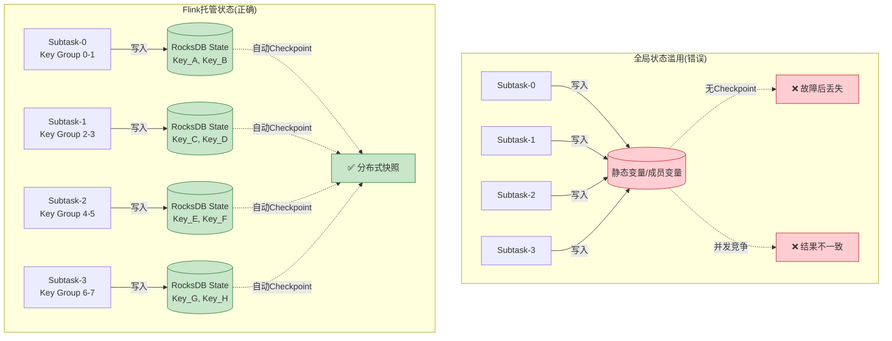
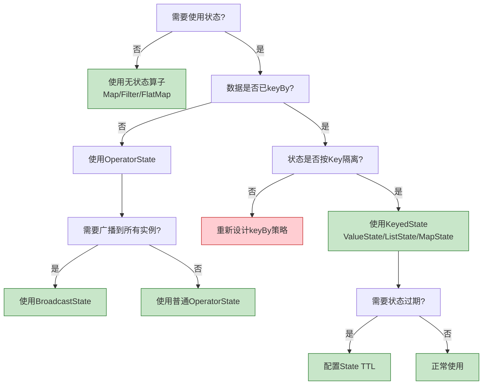

# 反模式 AP-01: 全局状态滥用 (Global State Abuse)

> 所属阶段: Knowledge | 前置依赖: [相关文档] | 形式化等级: L3

> **反模式编号**: AP-01 | **所属分类**: 状态管理类 | **严重程度**: P2 | **检测难度**: 易
>
> 在应该保持无状态的算子中使用全局可变状态，导致并发问题、恢复困难和结果不确定性。

---

## 目录

- [反模式 AP-01: 全局状态滥用 (Global State Abuse)](#反模式-ap-01-全局状态滥用-global-state-abuse)
  - [目录](#目录)
  - [1. 反模式定义 (Definition)](#1-反模式定义-definition)
  - [2. 症状/表现 (Symptoms)](#2-症状表现-symptoms)
    - [2.1 运行时症状](#21-运行时症状)
    - [2.2 代码审查中的危险信号](#22-代码审查中的危险信号)
    - [2.3 监控指标异常](#23-监控指标异常)
  - [3. 负面影响 (Negative Impacts)](#3-负面影响-negative-impacts)
    - [3.1 正确性影响](#31-正确性影响)
    - [3.2 性能影响](#32-性能影响)
    - [3.3 运维影响](#33-运维影响)
  - [4. 解决方案 (Solution)](#4-解决方案-solution)
    - [4.1 使用 KeyedState（推荐）](#41-使用-keyedstate推荐)
    - [4.2 使用 OperatorState](#42-使用-operatorstate)
    - [4.3 使用 Broadcast State](#43-使用-broadcast-state)
    - [4.4 重构检查清单](#44-重构检查清单)
  - [5. 代码示例 (Code Examples)](#5-代码示例-code-examples)
    - [5.1 错误示例：全局计数器](#51-错误示例全局计数器)
    - [5.2 正确示例：KeyedState 计数器](#52-正确示例keyedstate-计数器)
    - [5.3 错误示例：成员变量缓存](#53-错误示例成员变量缓存)
    - [5.4 正确示例：带 Checkpoint 的缓冲](#54-正确示例带-checkpoint-的缓冲)
  - [6. 实例验证 (Examples)](#6-实例验证-examples)
    - [6.1 案例：电商实时统计](#61-案例电商实时统计)
  - [7. 可视化 (Visualizations)](#7-可视化-visualizations)
    - [7.1 全局状态 vs 托管状态对比](#71-全局状态-vs-托管状态对比)
    - [7.2 决策树：何时使用哪种状态](#72-决策树何时使用哪种状态)
  - [8. 引用参考 (References)](#8-引用参考-references)

---

## 1. 反模式定义 (Definition)

**定义 (Def-K-09-01)**:

> 全局状态滥用是指在 Flink 算子中使用**非 Keyed 的全局可变状态**（如静态变量、成员变量、外部共享存储）来维护跨记录或跨 Key 的上下文，而不是使用 Flink 提供的 KeyedState 或 OperatorState。

**形式化描述** [^1]：

设算子实例为 $O_i$，其处理的数据记录为 $r$，Key 提取函数为 $k(r)$。全局状态滥用表现为：

$$
\exists O_i, \exists r_1, r_2: k(r_1) \neq k(r_2) \land \text{State}(O_i, r_1) \cap \text{State}(O_i, r_2) \neq \emptyset
$$

即不同 Key 的记录共享了同一块状态，违反了 Keyed Stream 的隔离语义。

**常见表现形式** [^2]：

| 类型 | 示例 | 问题 |
|------|------|------|
| **静态变量** | `static Map<String, Counter> globalCounters` | 跨算子实例共享，并发不安全 |
| **成员变量** | `private List<Event> buffer` | 并行实例间不共享，但无法 Checkpoint |
| **外部存储** | Redis / MySQL 作为状态存储 | 无本地性，无一致性保证 |
| **ThreadLocal** | `ThreadLocal<State>` | Checkpoint 时不被捕获 |

---

## 2. 症状/表现 (Symptoms)

### 2.1 运行时症状

```
┌─────────────────────────────────────────────────────────────────────────┐
│                         全局状态滥用症状雷达                             │
├─────────────────────────────────────────────────────────────────────────┤
│                                                                         │
│   结果不一致 ◄─────────────────────────────────────────────► 可复现性   │
│        │                                                       │        │
│        │    【静态变量并发问题】                               │        │
│        │    • 并行度>1时计数结果随机                           │        │
│        │    • 相同输入多次运行结果不同                         │        │
│        │    • 偶尔出现数组越界或空指针                         │        │
│        │                                                       │        │
│   恢复失败 ◄─────────────────────────────────────────────► 一致性     │
│        │                                                       │        │
│        │    【成员变量状态丢失】                               │        │
│        │    • Checkpoint 恢复后状态重置                        │        │
│        │    • Exactly-Once 语义被破坏                          │        │
│        │    • 重复处理或数据丢失                               │        │
│        │                                                       │        │
│   性能下降 ◄─────────────────────────────────────────────► 可用性     │
│        │                                                       │        │
│        │    【外部存储依赖】                                   │        │
│        │    • 每条记录触发外部网络请求                         │        │
│        │    • 网络I/O成为瓶颈                                  │        │
│        │    • 外部服务故障导致算子失败                         │        │
│        │                                                       │        │
└─────────────────────────────────────────────────────────────────────────┘
```

### 2.2 代码审查中的危险信号

```scala
// 🚨 危险信号 1: 静态集合作为状态
object GlobalStateHolder {
  val userSessionMap = new ConcurrentHashMap[String, Session]() // ❌ 全局状态
}

// 🚨 危险信号 2: 成员变量缓存未使用状态后端
class MyFlatMap extends RichFlatMapFunction[Event, Result] {
  private var localBuffer = new ArrayList[Event]() // ❌ 无法 Checkpoint

  override def flatMap(value: Event, out: Collector[Result]): Unit = {
    localBuffer.add(value) // 恢复时 buffer 为空！
  }
}

// 🚨 危险信号 3: 外部存储作为状态
class MyProcessFunction extends ProcessFunction[Event, Result] {
  private val redis = new Jedis("localhost") // ❌ 外部依赖

  override def processElement(event: Event, ctx: Context, out: Collector[Result]): Unit = {
    val count = redis.incr(event.userId) // ❌ 无一致性保证
  }
}
```

### 2.3 监控指标异常

| 指标 | 异常表现 | 根因 |
|------|----------|------|
| `numRecordsInPerSecond` | 各 subtask 严重不均衡 | 静态变量导致热点 |
| `checkpointDuration` | 时长不稳定或持续增长 | 状态未托管，增量无效 |
| `numFailedCheckpoints` | 周期性失败 | 外部存储连接断开 |

---

## 3. 负面影响 (Negative Impacts)

### 3.1 正确性影响

**并发竞争导致结果错误** [^3]：

```
场景: 并行度=2,统计用户点击次数

Subtask-0 处理 user_1: globalCount++ (读取: 0, 写入: 1)
Subtask-1 处理 user_1: globalCount++ (读取: 0, 写入: 1)  // 竞争！

预期结果: globalCount = 2
实际结果: globalCount = 1 (覆盖丢失)
```

**状态恢复不一致** [^4]：

```
场景: Checkpoint 后故障恢复

Checkpoint N:
  - Kafka offset: 1000
  - 成员变量 buffer: [event_1, event_2, ...]  // 未保存！

故障后从 Checkpoint N 恢复:
  - Kafka offset: 1000 (正确恢复)
  - 成员变量 buffer: [] (重置为空！)

后果: event_1, event_2 被重复处理或丢失
```

### 3.2 性能影响

| 影响类型 | 具体表现 | 量化估算 |
|----------|----------|----------|
| **网络开销** | 每条记录访问外部存储 | RTT 1-10ms/record |
| **序列化开销** | 自定义状态无高效序列化 | 比 Kryo 慢 10-100x |
| **GC压力** | 大对象长期存活 | Full GC 频率增加 |
| **并行瓶颈** | 静态变量竞争 | 吞吐量下降 50-90% |

### 3.3 运维影响

- **故障恢复困难**：无法依赖 Checkpoint 自动恢复
- **扩容限制**：外部存储成为单点瓶颈
- **调试复杂**：状态分布不可见，难以追踪

---

## 4. 解决方案 (Solution)

### 4.1 使用 KeyedState（推荐）

适用于 Keyed Stream 场景，状态按 Key 分区 [^4][^5]：

```scala
// ✅ 正确做法: 使用 KeyedState
class CorrectStatefulFunction
  extends KeyedProcessFunction[String, Event, Result] {

  // 声明 ValueState
  private var countState: ValueState[Long] = _
  private var sessionState: ValueState[Session] = _

  override def open(parameters: Configuration): Unit = {
    val countDescriptor = new ValueStateDescriptor(
      "count",
      classOf[Long]
    )
    countState = getRuntimeContext.getState(countDescriptor)

    val sessionDescriptor = new ValueStateDescriptor(
      "session",
      classOf[Session]
    )
    sessionState = getRuntimeContext.getState(sessionDescriptor)
  }

  override def processElement(
    event: Event,
    ctx: Context,
    out: Collector[Result]
  ): Unit = {
    // 读取当前 Key 的状态
    val currentCount = countState.value() match {
      case null => 0L
      case c => c
    }

    // 更新状态
    countState.update(currentCount + 1)

    // 更新会话状态
    val currentSession = sessionState.value() match {
      case null => Session(event.userId, event.timestamp, 1)
      case s => s.copy(
        lastActivity = event.timestamp,
        eventCount = s.eventCount + 1
      )
    }
    sessionState.update(currentSession)

    out.collect(Result(event.userId, currentCount + 1))
  }
}

// 使用方式
stream
  .keyBy(_.userId)  // 必须 keyBy
  .process(new CorrectStatefulFunction())
```

### 4.2 使用 OperatorState

适用于非 Keyed Stream 或广播状态场景 [^4]：

```scala
// ✅ 正确做法: 使用 OperatorState(用于非 Keyed 场景)
class CorrectOperatorStateFunction
  extends ProcessFunction[Event, Result]
  with CheckpointedFunction {

  private var operatorState: ListState[Event] = _
  private var localBuffer = new ArrayList[Event]() // 本地缓存

  override def open(parameters: Configuration): Unit = {
    // 初始化
  }

  override def processElement(
    event: Event,
    ctx: Context,
    out: Collector[Result]
  ): Unit = {
    localBuffer.add(event)
    if (localBuffer.size() >= 1000) {
      flushBuffer(out)
    }
  }

  // Checkpoint 时保存状态
  override def snapshotState(context: FunctionSnapshotContext): Unit = {
    operatorState.clear()
    localBuffer.forEach(event => operatorState.add(event))
  }

  // 初始化或恢复状态
  override def initializeState(context: FunctionInitializationContext): Unit = {
    val descriptor = new ListStateDescriptor[Event](
      "buffer",
      classOf[Event]
    )
    operatorState = context.getOperatorStateStore.getListState(descriptor)

    // 恢复时从 Checkpoint 加载
    if (context.isRestored) {
      localBuffer.clear()
      operatorState.get().forEach(event => localBuffer.add(event))
    }
  }

  private def flushBuffer(out: Collector[Result]): Unit = {
    // 处理并清空 buffer
    localBuffer.clear()
  }
}
```

### 4.3 使用 Broadcast State

适用于配置广播场景 [^5]：

```scala
// ✅ 正确做法: 使用 Broadcast State 处理动态配置
val configStream: BroadcastStream[Config] = env
  .addSource(new ConfigSource())
  .broadcast(CONFIG_STATE_DESCRIPTOR)

class DynamicConfigFunction
  extends KeyedBroadcastProcessFunction[String, Event, Config, Result] {

  private var userState: ValueState[UserProfile] = _

  override def open(parameters: Configuration): Unit = {
    userState = getRuntimeContext.getState(
      new ValueStateDescriptor("user-profile", classOf[UserProfile])
    )
  }

  // 处理数据流
  override def processElement(
    event: Event,
    ctx: ReadOnlyContext,
    out: Collector[Result]
  ): Unit = {
    // 读取广播配置(只读)
    val config = ctx.getBroadcastState(CONFIG_STATE_DESCRIPTOR).get("config")
    val profile = userState.value()

    // 应用配置处理事件
    out.collect(processWithConfig(event, profile, config))
  }

  // 处理配置流
  override def processBroadcastElement(
    config: Config,
    ctx: Context,
    out: Collector[Result]
  ): Unit = {
    // 更新广播状态
    ctx.getBroadcastState(CONFIG_STATE_DESCRIPTOR).put("config", config)
  }
}
```

### 4.4 重构检查清单

| 原反模式 | 重构目标 | 关键改动 |
|----------|----------|----------|
| 静态变量 | KeyedState | 添加 `keyBy()` + `getRuntimeContext.getState()` |
| 成员变量缓存 | OperatorState | 实现 `CheckpointedFunction` 接口 |
| 外部存储访问 | 异步 I/O + State | 使用 `AsyncFunction` + 本地缓存状态 |
| ThreadLocal | KeyedState | 状态托管到 Flink 状态后端 |

---

## 5. 代码示例 (Code Examples)

### 5.1 错误示例：全局计数器

```scala
// ❌ 错误: 使用静态变量作为全局计数器
object BadGlobalCounter {
  val counters = new ConcurrentHashMap[String, AtomicLong]()
}

class BadCounterFunction extends RichFlatMapFunction[Event, CountResult] {
  override def flatMap(event: Event, out: Collector[CountResult]): Unit = {
    val counter = BadGlobalCounter.counters.computeIfAbsent(
      event.category,
      _ => new AtomicLong(0)
    )
    val newCount = counter.incrementAndGet()
    out.collect(CountResult(event.category, newCount))
  }
}

// 问题:
// 1. 并行实例共享 counters,并发竞争导致计数不准确
// 2. counters 不参与 Checkpoint,故障后计数重置
// 3. 无法水平扩展,所有实例竞争同一数据结构
```

### 5.2 正确示例：KeyedState 计数器

```scala
// ✅ 正确: 使用 KeyedState
class CorrectCounterFunction
  extends KeyedProcessFunction[String, Event, CountResult] {

  private var countState: ValueState[Long] = _

  override def open(parameters: Configuration): Unit = {
    countState = getRuntimeContext.getState(
      new ValueStateDescriptor("count", classOf[Long])
    )
  }

  override def processElement(
    event: Event,
    ctx: Context,
    out: Collector[CountResult]
  ): Unit = {
    val current = countState.value() match {
      case null => 0L
      case c => c
    }
    val newCount = current + 1
    countState.update(newCount)
    out.collect(CountResult(ctx.getCurrentKey, newCount))
  }
}

// 使用
stream
  .keyBy(_.category)
  .process(new CorrectCounterFunction())

// 优势:
// 1. 每个 Key 的状态独立,无并发竞争
// 2. 状态自动参与 Checkpoint,故障可恢复
// 3. Flink 自动管理状态分区和迁移
```

### 5.3 错误示例：成员变量缓存

```scala
// ❌ 错误: 使用成员变量缓存未 Checkpoint 数据
class BadBufferFunction
  extends KeyedProcessFunction[String, Event, BatchResult] {

  private val buffer = new ArrayList[Event]() // ❌ 普通成员变量

  override def processElement(
    event: Event,
    ctx: Context,
    out: Collector[BatchResult]
  ): Unit = {
    buffer.add(event)

    if (buffer.size() >= 100) {
      out.collect(BatchResult(ctx.getCurrentKey, new ArrayList(buffer)))
      buffer.clear()
    }
  }
}

// 问题:
// Checkpoint 时 buffer 内容不被保存,故障恢复后数据丢失
```

### 5.4 正确示例：带 Checkpoint 的缓冲

```scala
// ✅ 正确: 使用 ListState 实现可 Checkpoint 的缓冲
class CorrectBufferFunction
  extends KeyedProcessFunction[String, Event, BatchResult]
  with CheckpointedFunction {

  private var listState: ListState[Event] = _
  @transient private var localBuffer = new ArrayList[Event]()

  override def processElement(
    event: Event,
    ctx: Context,
    out: Collector[BatchResult]
  ): Unit = {
    localBuffer.add(event)

    if (localBuffer.size() >= 100) {
      out.collect(BatchResult(ctx.getCurrentKey, new ArrayList(localBuffer)))
      localBuffer.clear()
    }
  }

  override def snapshotState(context: FunctionSnapshotContext): Unit = {
    listState.clear()
    localBuffer.forEach(e => listState.add(e))
  }

  override def initializeState(context: FunctionInitializationContext): Unit = {
    listState = context.getKeyedStateStore.getListState(
      new ListStateDescriptor("buffer", classOf[Event])
    )

    if (context.isRestored) {
      localBuffer.clear()
      listState.get().forEach(e => localBuffer.add(e))
    }
  }
}
```

---

## 6. 实例验证 (Examples)

### 6.1 案例：电商实时统计

**业务场景**：统计每个商品类目的实时订单金额

**反模式实现**（生产故障）：

```scala
// 故障代码(某电商平台真实案例)
object OrderStats {
  val categoryAmounts = new ConcurrentHashMap[String, BigDecimal]()
}

class OrderStatsFunction extends RichFlatMapFunction[Order, Stats] {
  override def flatMap(order: Order, out: Collector[Stats]): Unit = {
    val current = OrderStats.categoryAmounts.getOrDefault(
      order.category,
      BigDecimal.ZERO
    )
    OrderStats.categoryAmounts.put(
      order.category,
      current.add(order.amount)
    )

    // 每分钟输出统计
    if (shouldEmit()) {
      OrderStats.categoryAmounts.forEach { (cat, amount) =>
        out.collect(Stats(cat, amount, System.currentTimeMillis()))
      }
    }
  }
}
```

**故障现象** [^6]：

- 并行度从 4 扩容到 8 后，统计结果出现负值
- 故障恢复后，所有类目金额归零
- 高峰期统计结果波动剧烈

**根因分析**：

1. 多个 TaskManager JVM 各自拥有 `OrderStats.categoryAmounts` 副本
2. `ConcurrentHashMap` 仅在单个 JVM 内同步，跨 JVM 无同步
3. Checkpoint 不包含静态变量，恢复时状态丢失

**重构方案**：

```scala
class CorrectOrderStatsFunction
  extends KeyedProcessFunction[String, Order, Stats] {

  private var amountState: ValueState[BigDecimal] = _
  private var timerState: ValueState[Long] = _

  override def open(parameters: Configuration): Unit = {
    amountState = getRuntimeContext.getState(
      new ValueStateDescriptor("amount", classOf[BigDecimal])
    )
    timerState = getRuntimeContext.getState(
      new ValueStateDescriptor("timer", classOf[Long])
    )
  }

  override def processElement(
    order: Order,
    ctx: Context,
    out: Collector[Stats]
  ): Unit = {
    val current = amountState.value() match {
      case null => BigDecimal.ZERO
      case a => a
    }
    amountState.update(current.add(order.amount))

    // 注册定时器每分钟输出
    if (timerState.value() == null) {
      val nextMinute = (ctx.timestamp() / 60000 + 1) * 60000
      ctx.timerService().registerEventTimeTimer(nextMinute)
      timerState.update(nextMinute)
    }
  }

  override def onTimer(
    timestamp: Long,
    ctx: OnTimerContext,
    out: Collector[Stats]
  ): Unit = {
    val amount = amountState.value()
    if (amount != null) {
      out.collect(Stats(ctx.getCurrentKey, amount, timestamp))
    }

    // 注册下一个定时器
    val nextMinute = timestamp + 60000
    ctx.timerService().registerEventTimeTimer(nextMinute)
    timerState.update(nextMinute)
  }
}

// 使用
orders
  .keyBy(_.category)
  .process(new CorrectOrderStatsFunction())
```

**效果验证**：

- 扩容后统计结果一致
- 故障恢复后从 Checkpoint 自动恢复
- 高峰期统计稳定，无波动

---

## 7. 可视化 (Visualizations)

### 7.1 全局状态 vs 托管状态对比



### 7.2 决策树：何时使用哪种状态



---

## 8. 引用参考 (References)

[^1]: Apache Flink Documentation, "State Backends," 2025. <https://nightlies.apache.org/flink/flink-docs-stable/docs/ops/state/state_backends/>

[^2]: Apache Flink Documentation, "Working with State," 2025. <https://nightlies.apache.org/flink/flink-docs-stable/docs/dev/datastream/fault-tolerance/state/>

[^3]: T. Akidau et al., "The Dataflow Model: A Practical Approach to Balancing Correctness, Latency, and Cost in Massive-Scale, Unbounded, Out-of-Order Data Processing," *PVLDB*, 8(12), 2015.

[^4]: Apache Flink Documentation, "Operator State," 2025. <https://nightlies.apache.org/flink/flink-docs-stable/docs/dev/datastream/fault-tolerance/state/#operator-state>

[^5]: Apache Flink Documentation, "Broadcast State Pattern," 2025. <https://nightlies.apache.org/flink/flink-docs-stable/docs/dev/datastream/fault-tolerance/broadcast_state/>

[^6]: Flink 设计模式: 状态管理，详见 [Knowledge/02-design-patterns/pattern-stateful-computation.md](../02-design-patterns/pattern-stateful-computation.md)


---

*文档版本: v1.0 | 更新日期: 2026-04-03 | 状态: 已完成*

---

*文档版本: v1.0 | 创建日期: 2026-04-20*
