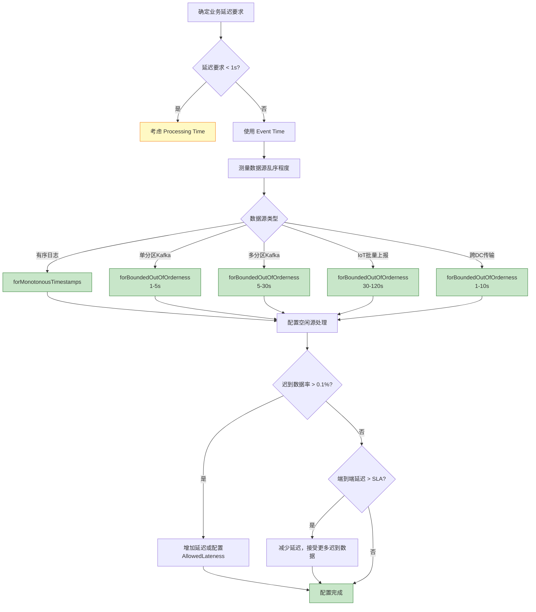

# 反模式 AP-02: Watermark 设置不当 (Watermark Misconfiguration)

> **反模式编号**: AP-02 | **所属分类**: 时间语义类 | **严重程度**: P1 | **检测难度**: 极难
>
> Watermark 延迟设置过长导致端到端延迟增加，或设置过短导致数据丢失/结果不准确。

---

## 目录

- [反模式 AP-02: Watermark 设置不当 (Watermark Misconfiguration)](#反模式-ap-02-watermark-设置不当-watermark-misconfiguration)
  - [目录](#目录)
  - [1. 反模式定义 (Definition)](#1-反模式定义-definition)
  - [2. 症状/表现 (Symptoms)](#2-症状表现-symptoms)
    - [2.1 过度延迟症状](#21-过度延迟症状)
    - [2.2 延迟不足症状](#22-延迟不足症状)
    - [2.3 诊断指标](#23-诊断指标)
  - [3. 负面影响 (Negative Impacts)](#3-负面影响-negative-impacts)
    - [3.1 过度延迟的影响](#31-过度延迟的影响)
    - [3.2 延迟不足的影响](#32-延迟不足的影响)
    - [3.3 量化影响](#33-量化影响)
  - [4. 解决方案 (Solution)](#4-解决方案-solution)
    - [4.1 数据驱动的 Watermark 配置](#41-数据驱动的-watermark-配置)
    - [4.2 分层 Watermark 策略](#42-分层-watermark-策略)
    - [4.3 动态 Watermark 调整](#43-动态-watermark-调整)
    - [4.4 迟到数据处理策略](#44-迟到数据处理策略)
  - [5. 代码示例 (Code Examples)](#5-代码示例-code-examples)
    - [5.1 错误示例：过度保守配置](#51-错误示例过度保守配置)
    - [5.2 正确示例：精细配置](#52-正确示例精细配置)
    - [5.3 错误示例：延迟不足](#53-错误示例延迟不足)
    - [5.4 正确示例：多分区乱序处理](#54-正确示例多分区乱序处理)
  - [6. 实例验证 (Examples)](#6-实例验证-examples)
    - [6.1 案例：金融实时风控](#61-案例金融实时风控)
  - [7. 可视化 (Visualizations)](#7-可视化-visualizations)
    - [7.1 Watermark 延迟决策流程](#71-watermark-延迟决策流程)
    - [7.2 Watermark 传播与窗口触发时序](#72-watermark-传播与窗口触发时序)
  - [8. 引用参考 (References)](#8-引用参考-references)

---

## 1. 反模式定义 (Definition)

**定义 (Def-K-09-02)**:

> Watermark 设置不当是指 Watermark 生成策略的参数（如最大乱序延迟 `maxOutOfOrderness`、空闲超时 `idlenessTimeout`）与数据源的实际乱序特性、业务延迟要求不匹配，导致系统延迟或数据完整性受损。

**形式化描述** [^1]：

设数据源的实际最大乱序延迟为 $\Delta_{real}$，配置的 Watermark 延迟为 $\Delta_{config}$，业务可接受的最大延迟为 $L_{max}$：

**过度延迟（Over-delay）**：
$$
\Delta_{config} \gg \Delta_{real} \Rightarrow \text{Latency} \approx \Delta_{config} \gg L_{max}
$$

**延迟不足（Under-delay）**：
$$
\Delta_{config} < \Delta_{real} \Rightarrow P(\text{Late Data}) > 0 \Rightarrow \text{Data Loss}
$$

**Watermak 配置空间** [^2]：

```
┌─────────────────────────────────────────────────────────────────────────┐
│                        Watermark 配置空间                               │
├─────────────────────────────────────────────────────────────────────────┤
│                                                                         │
│  Watermark 延迟 ▲                                                       │
│                │                                                        │
│    高风险      │   ┌─────────────────────┐                              │
│    (数据丢失)  │   │   延迟不足区域      │                              │
│                │   │   Δ < Δ_real        │                              │
│                │   │   迟到数据被丢弃    │                              │
│                │   └─────────────────────┘                              │
│                │              │                                         │
│    最优区域    │──────────────┼─────────────────────►                   │
│                │   平衡区域   │                                         │
│                │              ▼                                         │
│                │   ┌─────────────────────┐                              │
│    高风险      │   │   过度延迟区域      │                              │
│    (高延迟)    │   │   Δ >> Δ_real       │                              │
│                │   │   窗口触发延迟      │                              │
│                │   └─────────────────────┘                              │
│                │                                                        │
│                └────────────────────────────────────────► 实际乱序程度   │
│                              Δ_real                                     │
│                                                                         │
│  最优配置: Δ_config ≈ Δ_real + ε (ε 为安全余量)                        │
│                                                                         │
└─────────────────────────────────────────────────────────────────────────┘
```

**常见错误配置** [^3]：

| 错误类型 | 配置示例 | 场景 | 后果 |
|----------|----------|------|------|
| **过度保守** | `forBoundedOutOfOrderness(5min)` | 实际乱序<10s | 延迟增加5分钟 |
| **过于激进** | `forBoundedOutOfOrderness(100ms)` | Kafka多分区 | 大量迟到数据 |
| **无空闲处理** | 未配置 `withIdleness()` | 夜间低流量 | 窗口永不触发 |
| **统一配置** | 所有源使用相同延迟 | 不同源乱序差异大 | 部分源延迟或丢失 |

---

## 2. 症状/表现 (Symptoms)

### 2.1 过度延迟症状

```
┌─────────────────────────────────────────────────────────────────────────┐
│                        过度延迟 Watermark 症状                          │
├─────────────────────────────────────────────────────────────────────────┤
│                                                                         │
│  【业务指标】                                                           │
│   □ 端到端延迟持续高于 Watermark 延迟配置                              │
│   □ 窗口结果输出时间显著晚于窗口结束时间                               │
│   □ 实时性要求无法满足（如"5秒延迟"承诺无法兑现）                      │
│                                                                         │
│  【Flink指标】                                                          │
│   □ currentOutputWatermark 落后 currentInputWatermark 固定差值         │
│   □ watermarkLag 持续增长                                              │
│   □ records_late 为 0 或极低（不是好事！说明延迟容忍过度）             │
│                                                                         │
│  【数据特征】                                                           │
│   □ 99% 数据到达时 Watermark 还在"等待"未来数据                        │
│   □ 窗口内数据早已到齐，但迟迟不触发                                   │
│                                                                         │
└─────────────────────────────────────────────────────────────────────────┘
```

### 2.2 延迟不足症状

```
┌─────────────────────────────────────────────────────────────────────────┐
│                        延迟不足 Watermark 症状                          │
├─────────────────────────────────────────────────────────────────────────┤
│                                                                         │
│  【业务指标】                                                           │
│   □ 窗口结果在不同运行间不一致                                         │
│   □ 聚合结果比预期偏小                                                 │
│   □ 用户反馈"数据缺失"或"统计不全"                                    │
│                                                                         │
│  【Flink指标】                                                          │
│   □ records_late 持续增长                                              │
│   □ 侧输出流（Side Output）有大量数据                                  │
│   □ numLateRecordsDropped 非零                                         │
│                                                                         │
│  【数据特征】                                                           │
│   □ 网络抖动期间数据丢失增加                                           │
│   □ 跨数据中心传输的数据经常迟到                                       │
│   □ 批量上报的数据（如IoT边缘网关）大量进入侧输出                      │
│                                                                         │
└─────────────────────────────────────────────────────────────────────────┘
```

### 2.3 诊断指标

| 指标 | 正常范围 | 过度延迟 | 延迟不足 |
|------|----------|----------|----------|
| `watermarkLag` | < 2×配置延迟 | > 3×配置延迟 | 接近0（但数据丢失） |
| `records_late` / `records_in` | < 0.1% | 接近0 | > 1% |
| `currentOutputWatermark` | 稳定推进 | 推进缓慢 | 推进过快 |
| 端到端延迟 | < 配置延迟 + 处理时间 | >> 配置延迟 | 低但数据丢失 |

---

## 3. 负面影响 (Negative Impacts)

### 3.1 过度延迟的影响

**延迟放大效应** [^4]：

```
场景: 5层窗口聚合，每层 Watermark 延迟 1 分钟

数据到达 ──► [Window-1] ──► [Window-2] ──► [Window-3]
             delay: 1min      delay: 1min      delay: 1min

端到端延迟 = 1min (Window-1等待)
          + 1min (Window-2等待)
          + 1min (Window-3等待)
          + 处理时间
          = 至少 3 分钟！
```

**业务影响**：

- 实时告警延迟，错过最佳响应时间
- 实时推荐时效性差，用户体验下降
- 监控仪表板数据滞后，影响运维决策

### 3.2 延迟不足的影响

**数据丢失的级联效应** [^5]：

```
场景: 金融交易统计，Watermark 延迟 1 秒，实际网络延迟可达 5 秒

交易 T1 (ts=10:00:00) ──► 因网络延迟 10:00:05 到达

Watermark 在 10:00:01 时已经推进到 10:00:00

T1 到达时，10:00:00 的窗口已经触发关闭

结果: T1 被标记为迟到数据，丢弃或进入侧输出
      交易统计遗漏，风控规则误判
```

**数据一致性影响**：

- 批处理结果与流处理结果不一致
- 重跑作业结果不同，无法复现
- 审计数据不完整，合规风险

### 3.3 量化影响

| 场景 | 配置 | 影响 |
|------|------|------|
| 实时风控 | 延迟10s配置成60s | 告警延迟50秒，资金损失增加 |
| IoT监控 | 延迟60s配置成5s | 10%数据丢失，设备状态误判 |
| 实时报表 | 延迟30s配置成5min | 用户流失率增加 15% |
| 多源Join | 无空闲源处理 | 夜间窗口永不触发，报表中断 |

---

## 4. 解决方案 (Solution)

### 4.1 数据驱动的 Watermark 配置

**步骤1: 测量实际乱序程度** [^6]：

```scala
// 使用 Flink 的指标系统测量乱序延迟
class LatencyMeasurementFunction
  extends ProcessFunction[Event, Event] {

  private val arrivalTimeHistogram =
    getRuntimeContext.getMetricGroup.histogram(
      "eventDelayMs",
      new DropwizardHistogramWrapper(
        new com.codahale.metrics.Histogram(
          new SlidingWindowReservoir(5000)
        )
      )
    )

  override def processElement(
    event: Event,
    ctx: Context,
    out: Collector[Event]
  ): Unit = {
    // 计算事件时间与处理时间的差值
    val delay = System.currentTimeMillis() - event.timestamp
    arrivalTimeHistogram.update(delay)
    out.collect(event)
  }
}

// 测量后分析指标：
// - p50延迟：典型乱序程度
// - p99延迟：极端乱序需要覆盖
// - max延迟：决定是否需要特殊处理
```

**步骤2: 基于百分位数配置** [^3]：

```scala
// 推荐配置: Watermark 延迟 = p99乱序延迟 + 安全余量
// 例如：p99 = 5s，配置为 8s (余量 3s)

val optimalWatermarkStrategy =
  WatermarkStrategy
    .forBoundedOutOfOrderness[Event](Duration.ofSeconds(8))
    .withTimestampAssigner((event, _) => event.timestamp)
    .withIdleness(Duration.ofMinutes(2))  // 空闲源处理
```

### 4.2 分层 Watermark 策略

不同数据源使用不同配置 [^4]：

```scala
// 源 A: 有序日志，乱序 < 100ms
val sourceA = env.fromSource(
  kafkaSourceA,
  WatermarkStrategy
    .forBoundedOutOfOrderness[EventA](Duration.ofMillis(200))
    .withTimestampAssigner((e, _) => e.timestamp),
  "Source-A-Ordered"
)

// 源 B: 跨数据中心，乱序 1-5s
val sourceB = env.fromSource(
  kafkaSourceB,
  WatermarkStrategy
    .forBoundedOutOfOrderness[EventB](Duration.ofSeconds(8))
    .withTimestampAssigner((e, _) => e.timestamp)
    .withIdleness(Duration.ofMinutes(2)),
  "Source-B-DC-Crossing"
)

// 源 C: IoT边缘网关，批量上报，乱序可达 1min
val sourceC = env.fromSource(
  kafkaSourceC,
  WatermarkStrategy
    .forBoundedOutOfOrderness[EventC](Duration.ofSeconds(90))
    .withTimestampAssigner((e, _) => e.timestamp)
    .withIdleness(Duration.ofMinutes(5)),
  "Source-C-IoT-Batch"
)

// Union 后 Watermark 取最小值
val unioned = sourceA.union(sourceB).union(sourceC)
// 注意: Source C 的 90s 延迟会阻塞整体进度！
```

**优化: 延迟敏感与非敏感流分离** [^5]：

```scala
// 方案: 延迟敏感的流单独处理，避免被慢流阻塞

// 快流：低延迟要求
val fastStream = sourceA
  .keyBy(_.key)
  .window(TumblingEventTimeWindows.of(Time.seconds(5)))
  .aggregate(new FastAggregation())

// 慢流：允许高延迟
val slowStream = sourceC
  .keyBy(_.key)
  .window(TumblingEventTimeWindows.of(Time.minutes(1)))
  .aggregate(new SlowAggregation())

// 需要 Join 时，使用 Interval Join 允许时间差
fastStream
  .keyBy(_.key)
  .intervalJoin(slowStream.keyBy(_.key))
  .between(Time.seconds(-10), Time.seconds(10))
  .process(new JoinFunction())
```

### 4.3 动态 Watermark 调整

根据流量模式自动调整 [^6]：

```scala
// 自定义 Watermark 生成器，支持动态调整
class AdaptiveWatermarkGenerator(
  private val initialDelay: Long,
  private val maxDelay: Long
) extends WatermarkGenerator[Event] {

  private var maxTimestamp = Long.MinValue
  @volatile private var currentDelay = initialDelay

  // 动态延迟调整接口
  def updateDelay(newDelay: Long): Unit = {
    currentDelay = Math.min(newDelay, maxDelay)
  }

  override def onEvent(
    event: Event,
    eventTimestamp: Long,
    output: WatermarkOutput
  ): Unit = {
    maxTimestamp = Math.max(maxTimestamp, eventTimestamp)
  }

  override def onPeriodicEmit(output: WatermarkOutput): Unit = {
    if (maxTimestamp > Long.MinValue) {
      output.emitWatermark(new Watermark(maxTimestamp - currentDelay))
    }
  }
}

// 根据指标反馈调整
// 例如：如果迟到数据率 > 1%，增加延迟；如果 < 0.01%，减少延迟
```

### 4.4 迟到数据处理策略

当 Watermark 延迟无法覆盖所有乱序时 [^4][^5]：

```scala
val lateDataTag = OutputTag[Event]("late-data")

val result = stream
  .assignTimestampsAndWatermarks(
    WatermarkStrategy
      .forBoundedOutOfOrderness[Event](Duration.ofSeconds(10))
      .withTimestampAssigner((e, _) => e.timestamp)
  )
  .keyBy(_.userId)
  .window(TumblingEventTimeWindows.of(Time.minutes(1)))
  .allowedLateness(Time.minutes(5))  // 额外允许5分钟延迟
  .sideOutputLateData(lateDataTag)   // 完全迟到的数据
  .aggregate(new CountAggregate())

// 处理迟到数据
val lateData = result.getSideOutput(lateDataTag)
lateData.addSink(new LateDataHandler())
```

---

## 5. 代码示例 (Code Examples)

### 5.1 错误示例：过度保守配置

```scala
// ❌ 错误: 对所有源使用过度保守的延迟
val conservativeStrategy =
  WatermarkStrategy
    .forBoundedOutOfOrderness[Event](Duration.ofMinutes(5))  // 5分钟延迟！
    .withTimestampAssigner((e, _) => e.timestamp)

// 业务场景: 实时监控告警，要求延迟 < 30s
// 结果: 告警延迟 5 分钟，完全失去实时性

// ❌ 错误: 未配置空闲源处理
val noIdlenessStrategy =
  WatermarkStrategy
    .forBoundedOutOfOrderness[Event](Duration.ofSeconds(10))
    .withTimestampAssigner((e, _) => e.timestamp)
    // 缺少 withIdleness()

// 场景: 夜间流量骤降，某分区无数据
// 结果: 该分区 Watermark 停滞，全局窗口永不触发
```

### 5.2 正确示例：精细配置

```scala
// ✅ 正确: 基于实际测量配置
// 测量结果: p50=100ms, p99=5s, max=30s
val optimizedStrategy =
  WatermarkStrategy
    .forBoundedOutOfOrderness[Event](Duration.ofSeconds(8))  // p99 + 3s余量
    .withTimestampAssigner((e, _) => e.timestamp)
    .withIdleness(Duration.ofMinutes(2))  // 2分钟无数据视为空闲

// ✅ 正确: 不同源不同配置
// 有序日志源
val orderedSource = env.fromSource(
  kafkaSource1,
  WatermarkStrategy.forMonotonousTimestamps[LogEvent]()
    .withTimestampAssigner((e, _) => e.timestamp),
  "Ordered-Logs"
)

// 乱序业务事件源
val outOfOrderSource = env.fromSource(
  kafkaSource2,
  WatermarkStrategy
    .forBoundedOutOfOrderness[BusinessEvent](Duration.ofSeconds(10))
    .withTimestampAssigner((e, _) => e.timestamp)
    .withIdleness(Duration.ofMinutes(1)),
  "Business-Events"
)
```

### 5.3 错误示例：延迟不足

```scala
// ❌ 错误: 忽略跨数据中心延迟
val aggressiveStrategy =
  WatermarkStrategy
    .forBoundedOutOfOrderness[Event](Duration.ofMillis(100))  // 仅100ms
    .withTimestampAssigner((e, _) => e.timestamp)

// 场景: 数据从海外 DC 传输，典型延迟 500ms-2s
// 结果: 大量数据迟到，统计结果严重偏低

// ❌ 错误: 单分区有序但多分区无序时未处理
val singlePartitionStrategy =
  WatermarkStrategy
    .forMonotonousTimestamps[KafkaEvent]()  // 假设有序
    .withTimestampAssigner((e, _) => e.timestamp)

// 场景: Kafka 多分区消费，分区间无序
// 结果: 迟到数据率 5-10%，结果不一致
```

### 5.4 正确示例：多分区乱序处理

```scala
// ✅ 正确: 多分区场景使用 BoundedOutOfOrderness
val multiPartitionStrategy =
  WatermarkStrategy
    .forBoundedOutOfOrderness[KafkaEvent](Duration.ofSeconds(5))
    .withTimestampAssigner((e, _) => e.timestamp)
    .withIdleness(Duration.ofMinutes(2))

// ✅ 正确: 完整配置含迟到数据处理
val completeStrategy =
  WatermarkStrategy
    .forBoundedOutOfOrderness[Event](Duration.ofSeconds(10))
    .withTimestampAssigner((e, _) => e.timestamp)
    .withIdleness(Duration.ofMinutes(2))

val lateTag = OutputTag[Event]("late")

val windowed = stream
  .assignTimestampsAndWatermarks(completeStrategy)
  .keyBy(_.key)
  .window(TumblingEventTimeWindows.of(Time.minutes(1)))
  .allowedLateness(Time.minutes(5))    // 允许额外延迟
  .sideOutputLateData(lateTag)         // 捕获完全迟到数据
  .aggregate(new Aggregation())

// 处理完全迟到数据（如写入补录队列）
windowed.getSideOutput(lateTag).addSink(new LateDataSink())
```

---

## 6. 实例验证 (Examples)

### 6.1 案例：金融实时风控

**业务场景**：检测可疑交易，要求告警延迟 < 3 秒

**初始配置**（问题）：

```scala
// 保守配置，来自批处理思维
val watermarkStrategy =
  WatermarkStrategy
    .forBoundedOutOfOrderness[Transaction](Duration.ofSeconds(30))
    .withTimestampAssigner((txn, _) => txn.timestamp)
```

**问题现象** [^7]：

- 端到端延迟：35-40 秒（远超过 3 秒 SLA）
- 风控告警严重滞后，欺诈交易已完成才触发告警
- 业务方投诉实时性不达标

**优化方案**：

```scala
// 步骤1: 测量实际乱序
// 结果: p50=50ms, p99=800ms, max=2s

// 步骤2: 优化配置
val optimizedStrategy =
  WatermarkStrategy
    .forBoundedOutOfOrderness[Transaction](Duration.ofSeconds(2))
    .withTimestampAssigner((txn, _) => txn.timestamp)
    .withIdleness(Duration.ofSeconds(10))

// 步骤3: 处理极端迟到数据
val lateTag = OutputTag[Transaction]("suspicious-late")

val alerts = transactions
  .assignTimestampsAndWatermarks(optimizedStrategy)
  .keyBy(_.userId)
  .process(new FraudDetectionFunction())
  .getSideOutput(lateTag)
  .process(new HighLatencyFraudHandler())  // 特殊处理迟到的高风险交易
```

**效果验证**：

- 端到端延迟：2.5 秒（满足 SLA）
- 迟到数据率：0.05%（可接受）
- 极端迟到交易通过旁路处理，无遗漏

---

## 7. 可视化 (Visualizations)

### 7.1 Watermark 延迟决策流程



### 7.2 Watermark 传播与窗口触发时序

```mermaid
timeline
    title Watermark 延迟配置对比（假设窗口大小10s，事件时间10:00:05-10:00:15）

    section 过度延迟 (Δ=60s)
        10:00:15 : 事件时间到达窗口结束
        10:00:16 : Watermark 仍停留在 10:00:14
        10:00:17 : 所有数据已到齐
        10:01:15 : Watermark 推进到 10:00:15
                 : 窗口触发（延迟60s）

    section 最优配置 (Δ=5s)
        10:00:15 : 事件时间到达窗口结束
        10:00:17 : 最后数据到达
        10:00:20 : Watermark 推进到 10:00:15
                 : 窗口触发（延迟5s）

    section 延迟不足 (Δ=1s)
        10:00:15 : 事件时间到达窗口结束
        10:00:16 : Watermark 推进到 10:00:14
                 : 窗口触发（丢失迟到数据）
        10:00:17 : 最后数据到达
                 : 被标记为迟到，丢弃或进入侧输出
```

---

## 8. 引用参考 (References)

[^1]: T. Akidau et al., "The Dataflow Model: A Practical Approach to Balancing Correctness, Latency, and Cost in Massive-Scale, Unbounded, Out-of-Order Data Processing," *PVLDB*, 8(12), 2015.

[^2]: Apache Flink Documentation, "Event Time and Watermarks," 2025. <https://nightlies.apache.org/flink/flink-docs-stable/docs/concepts/time/>

[^3]: Apache Flink Documentation, "Generating Watermarks," 2025. <https://nightlies.apache.org/flink/flink-docs-stable/docs/dev/datastream/event-time/generating_watermarks/>

[^4]: Flink 设计模式: 事件时间处理，详见 [Knowledge/02-design-patterns/pattern-event-time-processing.md](../02-design-patterns/pattern-event-time-processing.md)

[^5]: Apache Flink Documentation, "Allowed Lateness," 2025. <https://nightlies.apache.org/flink/flink-docs-stable/docs/dev/datastream/operators/windows/#allowed-lateness>

[^6]: M. Kleppmann, "Designing Data-Intensive Applications," O'Reilly Media, 2017. Chapter 11: Stream Processing.

[^7]: 金融风控实时欺诈检测案例，详见 [Flink/07-case-studies/case-financial-realtime-risk-control.md](Flink/09-practices/09.01-case-studies/case-financial-realtime-risk-control.md)

---

*文档版本: v1.0 | 更新日期: 2026-04-03 | 状态: 已完成*
