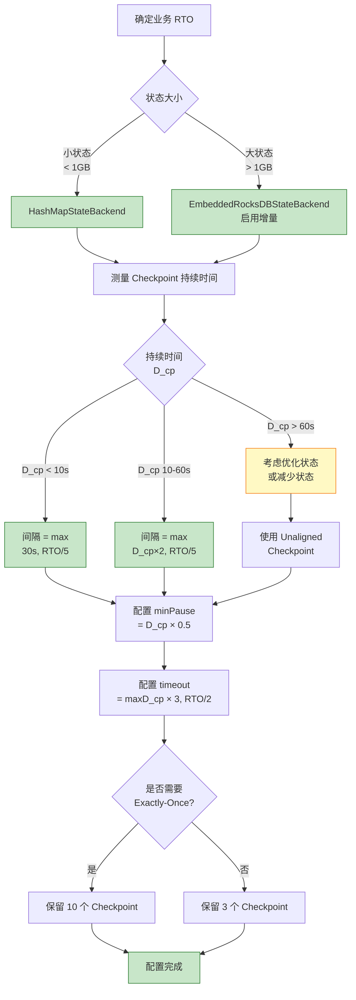
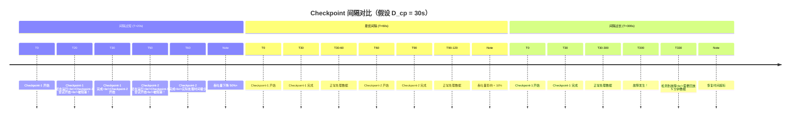

# 反模式 AP-03: Checkpoint 间隔设置不合理 (Checkpoint Interval Misconfiguration)

> **反模式编号**: AP-03 | **所属分类**: 容错配置类 | **严重程度**: P1 | **检测难度**: 中
>
> Checkpoint 间隔过长导致故障恢复时数据回放大，间隔过短导致系统吞吐量下降和存储成本增加。

---

## 目录

- [反模式 AP-03: Checkpoint 间隔设置不合理 (Checkpoint Interval Misconfiguration)](#反模式-ap-03-checkpoint-间隔设置不合理-checkpoint-interval-misconfiguration)
  - [目录](#目录)
  - [1. 反模式定义 (Definition)](#1-反模式定义-definition)
  - [2. 症状/表现 (Symptoms)](#2-症状表现-symptoms)
    - [2.1 间隔过长症状](#21-间隔过长症状)
    - [2.2 间隔过短症状](#22-间隔过短症状)
    - [2.3 诊断指标](#23-诊断指标)
  - [3. 负面影响 (Negative Impacts)](#3-负面影响-negative-impacts)
    - [3.1 间隔过长的影响](#31-间隔过长的影响)
    - [3.2 间隔过短的影响](#32-间隔过短的影响)
    - [3.3 量化影响](#33-量化影响)
  - [4. 解决方案 (Solution)](#4-解决方案-solution)
    - [4.1 基于 SLA 的配置公式](#41-基于-sla-的配置公式)
    - [4.2 分层的 Checkpoint 策略](#42-分层的-checkpoint-策略)
    - [4.3 增量 Checkpoint 与压缩](#43-增量-checkpoint-与压缩)
    - [4.4 动态调整策略](#44-动态调整策略)
  - [5. 代码示例 (Code Examples)](#5-代码示例-code-examples)
    - [5.1 错误示例：间隔过长](#51-错误示例间隔过长)
    - [5.2 错误示例：间隔过短](#52-错误示例间隔过短)
    - [5.3 正确示例：基于 SLA 的配置](#53-正确示例基于-sla-的配置)
    - [5.4 正确示例：分层配置](#54-正确示例分层配置)
  - [6. 实例验证 (Examples)](#6-实例验证-examples)
    - [6.1 案例：电商订单处理](#61-案例电商订单处理)
  - [7. 可视化 (Visualizations)](#7-可视化-visualizations)
    - [7.1 Checkpoint 间隔决策流程](#71-checkpoint-间隔决策流程)
    - [7.2 Checkpoint 生命周期与间隔影响](#72-checkpoint-生命周期与间隔影响)
  - [8. 引用参考 (References)](#8-引用参考-references)

---

## 1. 反模式定义 (Definition)

**定义 (Def-K-09-03)**:

> Checkpoint 间隔设置不合理是指 Checkpoint 触发间隔（`checkpointInterval`）与业务恢复时间目标（RTO）、数据重放容忍度、系统处理能力不匹配，导致恢复成本过高或运行时性能受损。

**形式化描述** [^1]：

设 Checkpoint 间隔为 $T_{cp}$，单次 Checkpoint 持续时间为 $D_{cp}$，故障恢复时间目标为 $RTO$，数据回放延迟为 $R_{replay}$：

**间隔过长（Over-interval）**：
$$
T_{cp} \gg RTO \Rightarrow R_{replay} \approx T_{cp} \gg RTO
$$

故障恢复时需要回放大量数据，超出业务可接受范围。

**间隔过短（Under-interval）**：
$$
T_{cp} < D_{cp} \times k \Rightarrow \text{Checkpoint 重叠} \Rightarrow \text{吞吐量下降}
$$

其中 $k$ 为安全因子（通常 2-3），间隔过短导致 Checkpoint 持续进行，占用系统资源。

**Checkpoint 配置空间** [^2]：

```
┌─────────────────────────────────────────────────────────────────────────┐
│                      Checkpoint 间隔配置空间                            │
├─────────────────────────────────────────────────────────────────────────┤
│                                                                         │
│  Checkpoint 间隔 ▲                                                      │
│                 │                                                       │
│    高风险       │   ┌──────────────────────┐                           │
│    (恢复困难)   │   │   间隔过长区域       │                           │
│                 │   │   T >> RTO           │                           │
│                 │   │   回放数据量大       │                           │
│                 │   │   恢复时间超标       │                           │
│                 │   └──────────────────────┘                           │
│                 │              │                                        │
│    最优区域     │──────────────┼─────────────────────►                  │
│                 │   平衡区域   │                                        │
│                 │              ▼                                        │
│                 │   ┌──────────────────────┐                           │
│    高风险       │   │   间隔过短区域       │                           │
│    (性能下降)   │   │   T < D_cp × 2       │                           │
│                 │   │   Checkpoint 重叠    │                           │
│                 │   │   吞吐量下降         │                           │
│                 │   └──────────────────────┘                           │
│                 │                                                       │
│                 └────────────────────────────────────────► 系统负载     │
│                                                                         │
│  最优配置: max(RTO/10, D_cp × 2) < T < RTO/2                          │
│                                                                         │
└─────────────────────────────────────────────────────────────────────────┘
```

**常见错误配置** [^3]：

| 错误类型 | 配置示例 | 典型场景 | 后果 |
|----------|----------|----------|------|
| **过度保守** | `checkpointInterval=1min` | 大状态作业（10GB+） | 存储成本暴增，GC 压力 |
| **过于激进** | `checkpointInterval=1hour` | 金融交易系统 | 故障丢失1小时数据 |
| **一刀切** | 所有作业统一 10 分钟 | 不同 SLA 要求 | 部分作业恢复慢，部分性能差 |
| **忽略超时** | `checkpointTimeout < interval` | 大状态首次 Checkpoint | 持续超时失败 |

---

## 2. 症状/表现 (Symptoms)

### 2.1 间隔过长症状

```
┌─────────────────────────────────────────────────────────────────────────┐
│                      Checkpoint 间隔过长症状                            │
├─────────────────────────────────────────────────────────────────────────┤
│                                                                         │
│  【故障恢复场景】                                                       │
│   □ 故障恢复后 Kafka 消费回溯量巨大（GB级）                            │
│   □ 恢复时间远超业务承诺的 RTO                                         │
│   □ 恢复期间数据重复处理导致下游去重压力                               │
│   □ 用户投诉"丢数据"（实际为重复或延迟）                               │
│                                                                         │
│  【Flink指标】                                                          │
│   □ 两次 Checkpoint 之间的时间差 >> 配置间隔                           │
│   □ lastCheckpointDuration 远小于 interval                             │
│   □ Checkpoint 大小持续增长（状态积累）                                │
│                                                                         │
│  【业务指标】                                                           │
│   □ 故障后数据回放导致下游系统过载                                     │
│   □ 重跑作业时批处理结果与流处理不一致                                 │
│                                                                         │
└─────────────────────────────────────────────────────────────────────────┘
```

### 2.2 间隔过短症状

```
┌─────────────────────────────────────────────────────────────────────────┐
│                      Checkpoint 间隔过短症状                            │
├─────────────────────────────────────────────────────────────────────────┤
│                                                                         │
│  【运行时性能】                                                         │
│   □ 吞吐量下降 20-50%                                                  │
│   □ CPU 使用率周期性飙升（Checkpoint 期间）                            │
│   □ 延迟呈现锯齿状波动                                                 │
│   □ 网络带宽被 Checkpoint 数据占用                                     │
│                                                                         │
│  【Flink指标】                                                          │
│   □ Checkpoint 频繁触发，间隔 < 持续时间                               │
│   □ numCompletedCheckpoints 增长过快                                   │
│   □ Checkpoint 存储目录文件数量爆炸                                    │
│   □ 异步阶段持续时间占比过高                                           │
│                                                                         │
│  【存储系统】                                                           │
│   □ HDFS/S3 小文件过多，NameNode 压力                                  │
│   □ 存储成本异常增长                                                   │
│   □ 历史 Checkpoint 清理压力                                           │
│                                                                         │
└─────────────────────────────────────────────────────────────────────────┘
```

### 2.3 诊断指标

| 指标 | 计算公式 | 间隔过长 | 间隔过短 |
|------|----------|----------|----------|
| `checkpointInterval` / `lastCheckpointDuration` | 比值 | > 10 | < 2 |
| 恢复时间估计 | `interval × throughput` | > RTO | N/A |
| 存储成本/天 | `checkpointSize × 24h/interval × retention` | 低但恢复慢 | 高 |
| `backPressuredTimeMsPerSecond` | 背压时间占比 | 低 | 高（Checkpoint 期间） |

---

## 3. 负面影响 (Negative Impacts)

### 3.1 间隔过长的影响

**故障恢复数据回放** [^4]：

```
场景: 处理速率 100,000 records/s，Checkpoint 间隔 30 分钟

故障发生时间: T
最后成功 Checkpoint: T - 30min
故障检测时间: T + 30s (假设)
恢复完成时间: T + 2min

需要回放的数据量:
= 30min × 100,000 records/s × 60s/min
= 180,000,000 条记录
= 约 180M 条（假设每条 1KB，约 180GB）

恢复时间:
= 检测时间(30s) + 状态加载时间 + 数据回放时间
= 30s + 60s + (180GB / 网络带宽)
= 可能超过 10 分钟（远超典型 RTO 1-2min）
```

**业务影响**：

- 金融交易：故障期间订单状态不确定，重复支付风险
- 实时监控：故障后长时间无数据，告警盲区
- 实时推荐：用户看到过期推荐，体验下降

### 3.2 间隔过短的影响

**吞吐量下降分析** [^5]：

```
场景: Checkpoint 持续时间 30s，间隔设置为 30s

时间线:
T0:  Checkpoint-1 开始
T30: Checkpoint-1 完成，Checkpoint-2 立即开始
T60: Checkpoint-2 完成，Checkpoint-3 立即开始

结果: 系统几乎一直在做 Checkpoint，处理时间被严重挤压

理论吞吐量损失:
= CheckpointDuration / (CheckpointDuration + ProcessingTime)
= 30s / (30s + 0s) ≈ 100% (极端情况)

实际影响:
- 同步阶段（快照状态）阻塞处理
- 异步阶段（写入存储）占用网络/磁盘
- JVM GC 压力增加
```

**存储成本计算** [^3]：

```
场景: Checkpoint 大小 10GB，间隔 1 分钟，保留 10 个

存储消耗（峰值）:
= 10GB × 10 = 100GB

每日 Checkpoint 写入量:
= 10GB × (24 × 60) = 14,400GB/天 ≈ 14TB/天

对比（间隔 10 分钟）:
= 10GB × (24 × 6) = 1,440GB/天 ≈ 1.4TB/天

成本差异: 10 倍！
```

### 3.3 量化影响

| 场景 | 配置 | 影响 |
|------|------|------|
| 大状态作业 | 间隔 1 分钟 | 存储成本增加 10 倍，吞吐下降 30% |
| 金融核心交易 | 间隔 30 分钟 | 故障恢复需 15 分钟，SLA 违约 |
| 日志处理 | 间隔 1 小时 | 故障丢失 1 小时日志，审计风险 |
| 实时推荐 | 间隔 5 分钟 | 状态 10GB，GC 停顿增加 |

---

## 4. 解决方案 (Solution)

### 4.1 基于 SLA 的配置公式

**基础公式** [^6]：

```
┌─────────────────────────────────────────────────────────────────────────┐
│                     Checkpoint 间隔配置公式                             │
├─────────────────────────────────────────────────────────────────────────┤
│                                                                         │
│  最小间隔:                                                              │
│  T_min = max(30s, D_cp × 2)                                             │
│                                                                         │
│  最大间隔:                                                              │
│  T_max = RTO / 2                                                        │
│                                                                         │
│  推荐间隔:                                                              │
│  T_optimal = min(T_max, max(T_min, RTO / 5))                            │
│                                                                         │
│  其中:                                                                  │
│  - D_cp: 实测 Checkpoint 持续时间                                       │
│  - RTO: 业务恢复时间目标                                                │
│  - 分母 5: 确保故障时最多回放 20% RTO 的数据                            │
│                                                                         │
│  示例:                                                                  │
│  - D_cp = 45s, RTO = 5min (300s)                                        │
│  - T_min = max(30s, 90s) = 90s                                          │
│  - T_max = 300s / 2 = 150s                                              │
│  - T_optimal = min(150s, max(90s, 60s)) = 90s-150s                      │
│  - 推荐: 120s (2分钟)                                                   │
│                                                                         │
└─────────────────────────────────────────────────────────────────────────┘
```

### 4.2 分层的 Checkpoint 策略

不同业务优先级使用不同配置 [^4][^5]：

```scala
// 配置 1: 金融核心交易（RTO = 1min）
env.enableCheckpointing(20000)  // 20s 间隔
env.getCheckpointConfig.setCheckpointTimeout(60000)
env.getCheckpointConfig.setMinPauseBetweenCheckpoints(5000)
env.setStateBackend(new EmbeddedRocksDBStateBackend(true))  // 增量

// 配置 2: 实时推荐（RTO = 5min）
env.enableCheckpointing(60000)  // 1min 间隔
env.getCheckpointConfig.setCheckpointTimeout(300000)
env.getCheckpointConfig.setMinPauseBetweenCheckpoints(30000)
env.setStateBackend(new HashMapStateBackend())  // 小状态用内存

// 配置 3: 日志分析（RTO = 30min）
env.enableCheckpointing(300000)  // 5min 间隔
env.getCheckpointConfig.setCheckpointTimeout(600000)
env.getCheckpointConfig.setMinPauseBetweenCheckpoints(60000)
env.setStateBackend(new EmbeddedRocksDBStateBackend(true))
env.getCheckpointConfig.enableUnalignedCheckpoints()  // 反压场景
```

### 4.3 增量 Checkpoint 与压缩

大状态作业优化 [^3][^6]：

```scala
// 启用增量 Checkpoint
env.setStateBackend(new EmbeddedRocksDBStateBackend(true))

// 配置 RocksDB 调优
val config = new Configuration()
config.setString("state.backend.incremental", "true")
config.setString("state.backend.rocksdb.predefined-options", "FLASH_SSD_OPTIMIZED")
config.setString("state.backend.rocksdb.memory.fixed-per-slot", "256mb")
env.configure(config)

// 启用 Checkpoint 压缩（减少网络传输）
env.getCheckpointConfig.enableUnalignedCheckpoints()
env.getCheckpointConfig.setAlignmentTimeout(Duration.ofSeconds(30))

// 配置本地恢复（加速恢复）
env.getCheckpointConfig.setPreferCheckpointForRecovery(true)
```

### 4.4 动态调整策略

根据运行时指标自动调整 [^6]：

```scala
// 自定义 Checkpoint 监听器
class AdaptiveCheckpointListener extends CheckpointListener {
  private var lastCheckpointDuration = 0L
  private var consecutiveSlowCheckpoints = 0

  override def notifyCheckpointComplete(checkpointId: Long): Unit = {
    // 从指标系统获取持续时间
    val duration = getLastCheckpointDuration()
    val interval = getCurrentCheckpointInterval()

    // 如果 Checkpoint 持续超过间隔的 80%，增加间隔
    if (duration > interval * 0.8) {
      consecutiveSlowCheckpoints += 1
      if (consecutiveSlowCheckpoints >= 3) {
        increaseCheckpointInterval()
        consecutiveSlowCheckpoints = 0
      }
    } else {
      consecutiveSlowCheckpoints = 0
    }

    // 如果 Checkpoint 很快且资源充裕，可以考虑减少间隔
    if (duration < interval * 0.2 && hasSpareResources()) {
      decreaseCheckpointInterval()
    }
  }

  override def notifyCheckpointAborted(checkpointId: Long): Unit = {
    // Checkpoint 失败时增加超时时间
    increaseCheckpointTimeout()
  }
}
```

---

## 5. 代码示例 (Code Examples)

### 5.1 错误示例：间隔过长

```scala
// ❌ 错误: 金融交易系统配置过长的 Checkpoint 间隔
val env = StreamExecutionEnvironment.getExecutionEnvironment

env.enableCheckpointing(3600000)  // 1小时！
env.getCheckpointConfig.setCheckpointTimeout(600000)

// 业务场景: 支付交易处理，要求故障恢复 < 2分钟
// 问题: 故障后需回放1小时数据，恢复时间 > 10分钟
// 后果: 重复支付、资金不一致
```

### 5.2 错误示例：间隔过短

```scala
// ❌ 错误: 大状态作业配置过短的 Checkpoint 间隔
val env = StreamExecutionEnvironment.getExecutionEnvironment

env.setStateBackend(new EmbeddedRocksDBStateBackend(true))
// 状态大小: 50GB

env.enableCheckpointing(10000)  // 10秒！
env.getCheckpointConfig.setCheckpointTimeout(300000)

// 问题: Checkpoint 持续时间约 60s，间隔仅 10s
// 结果: Checkpoint 持续重叠，吞吐量下降 70%
// 存储成本: 50GB × 6 × 24 = 7.2TB/天
```

### 5.3 正确示例：基于 SLA 的配置

```scala
// ✅ 正确: 根据业务 SLA 配置 Checkpoint
val env = StreamExecutionEnvironment.getExecutionEnvironment

// 业务要求: 故障恢复 RTO = 2分钟，数据回放不超过 30s
// 实测: Checkpoint 持续时间约 20s

val checkpointInterval = 30000L  // 30s，满足 RTO/4
val minPauseBetweenCheckpoints = 10000L  // 至少间隔 10s
val checkpointTimeout = 120000L  // 2分钟超时

env.enableCheckpointing(checkpointInterval)
env.getCheckpointConfig.setMinPauseBetweenCheckpoints(minPauseBetweenCheckpoints)
env.getCheckpointConfig.setCheckpointTimeout(checkpointTimeout)

// 启用增量 Checkpoint 减少存储
env.setStateBackend(new EmbeddedRocksDBStateBackend(true))

// 配置最多并行 Checkpoint 数
env.getCheckpointConfig.setMaxConcurrentCheckpoints(1)

// 配置外部化 Checkpoint 清理策略
env.getCheckpointConfig.enableExternalizedCheckpoints(
  ExternalizedCheckpointCleanup.RETAIN_ON_CANCELLATION
)
```

### 5.4 正确示例：分层配置

```scala
// ✅ 正确: 不同优先级作业不同配置
object CheckpointConfigs {

  // 金融核心: 最高可靠性要求
  def applyFinancialConfig(env: StreamExecutionEnvironment): Unit = {
    env.enableCheckpointing(20000)  // 20s
    env.getCheckpointConfig.setCheckpointTimeout(60000)
    env.getCheckpointConfig.setMinPauseBetweenCheckpoints(5000)
    env.getCheckpointConfig.setTolerableCheckpointFailureNumber(0)  // 不允许失败
    env.setStateBackend(new EmbeddedRocksDBStateBackend(true))
    env.getCheckpointConfig.setCheckpointStorage("hdfs:///checkpoints/financial")
  }

  // 实时分析: 平衡可靠性和性能
  def applyAnalyticsConfig(env: StreamExecutionEnvironment): Unit = {
    env.enableCheckpointing(60000)  // 1min
    env.getCheckpointConfig.setCheckpointTimeout(180000)
    env.getCheckpointConfig.setMinPauseBetweenCheckpoints(30000)
    env.getCheckpointConfig.setTolerableCheckpointFailureNumber(3)
    env.setStateBackend(new EmbeddedRocksDBStateBackend(true))
    env.getCheckpointConfig.setCheckpointStorage("hdfs:///checkpoints/analytics")
  }

  // 日志处理: 可接受一定数据丢失
  def applyLoggingConfig(env: StreamExecutionEnvironment): Unit = {
    env.enableCheckpointing(300000)  // 5min
    env.getCheckpointConfig.setCheckpointTimeout(600000)
    env.getCheckpointConfig.setMinPauseBetweenCheckpoints(60000)
    env.getCheckpointConfig.setTolerableCheckpointFailureNumber(5)
    env.setStateBackend(new HashMapStateBackend())  // 小状态
    env.getCheckpointConfig.setCheckpointStorage("hdfs:///checkpoints/logging")
  }
}

// 使用
CheckpointConfigs.applyFinancialConfig(env)
```

---

## 6. 实例验证 (Examples)

### 6.1 案例：电商订单处理

**业务场景**：实时订单状态追踪，状态大小约 20GB

**初始配置**（问题）：

```scala
env.enableCheckpointing(300000)  // 5 分钟
env.setStateBackend(new EmbeddedRocksDBStateBackend())  // 非增量
```

**问题现象** [^7]：

- 故障恢复时间：15-20 分钟（超出 SLA 5 分钟）
- 每次 Checkpoint 写入 20GB，存储压力大
- 高峰期 Checkpoint 持续时间 3 分钟

**优化方案**：

```scala
// 分析: RTO = 5min，实测 D_cp = 60s
// 计算: T_optimal = min(150s, max(120s, 60s)) = 120s

env.enableCheckpointing(120000)  // 2 分钟，满足 RTO/2.5
env.setStateBackend(new EmbeddedRocksDBStateBackend(true))  // 增量

// RocksDB 调优
val config = new Configuration()
config.setString("state.backend.rocksdb.predefined-options", "FLASH_SSD_OPTIMIZED")
config.setString("state.checkpoint-storage", "hdfs:///checkpoints/orders")
config.setString("state.checkpoints.num-retained", "10")
env.configure(config)

// 启用本地恢复
env.getCheckpointConfig.setPreferCheckpointForRecovery(true)
```

**效果验证**：

- Checkpoint 间隔：2 分钟，持续时间：30-40 秒
- 增量 Checkpoint 大小：平均 500MB（vs 之前 20GB）
- 故障恢复时间：2.5 分钟（满足 SLA）
- 存储成本降低 90%

---

## 7. 可视化 (Visualizations)

### 7.1 Checkpoint 间隔决策流程



### 7.2 Checkpoint 生命周期与间隔影响



---

## 8. 引用参考 (References)

[^1]: Apache Flink Documentation, "Checkpointing," 2025. <https://nightlies.apache.org/flink/flink-docs-stable/docs/dev/datastream/fault-tolerance/checkpointing/>

[^2]: Apache Flink Documentation, "Checkpointing under backpressure," 2025. <https://nightlies.apache.org/flink/flink-docs-stable/docs/ops/state/checkpointing_under_backpressure/>

[^3]: Apache Flink Documentation, "RocksDB State Backend," 2025. <https://nightlies.apache.org/flink/flink-docs-stable/docs/ops/state/state_backends/>

[^4]: Flink 设计模式: Checkpoint 恢复，详见 [Knowledge/02-design-patterns/pattern-checkpoint-recovery.md](../02-design-patterns/pattern-checkpoint-recovery.md)

[^5]: Apache Flink Documentation, "Incremental Checkpointing," 2025. <https://nightlies.apache.org/flink/flink-docs-stable/docs/ops/state/incremental_checkpoints/>

[^6]: P. Carbone et al., "Apache Flink: Stream and Batch Processing in a Single Engine," *IEEE Data Engineering Bulletin*, 38(4), 2015.

[^7]: 实时 ETL 深度解析案例，详见 [AcotorCSPWorkflow/case-studies/CS-Realtime-ETL-Deep-Dive.md](../../AcotorCSPWorkflow/case-studies/CS-Realtime-ETL-Deep-Dive.md)

---

*文档版本: v1.0 | 更新日期: 2026-04-03 | 状态: 已完成*
