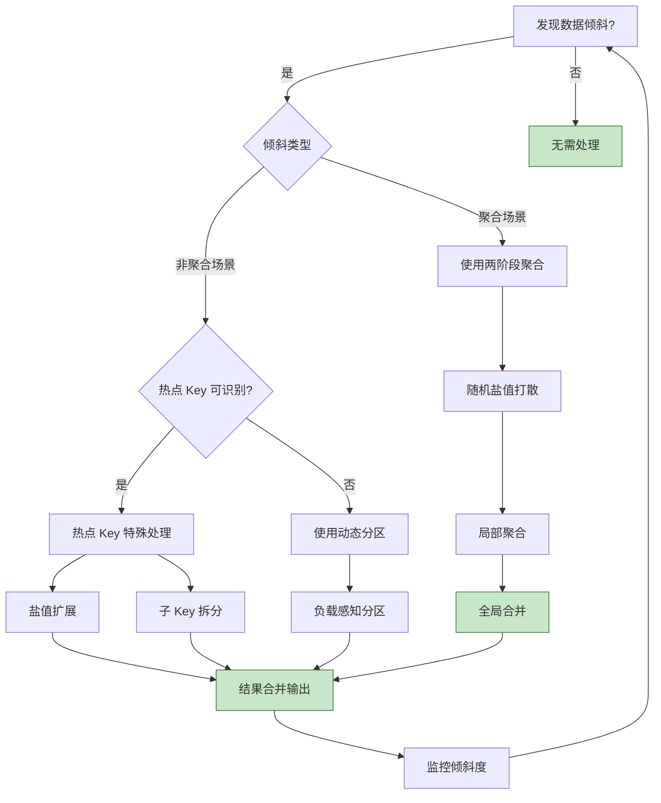
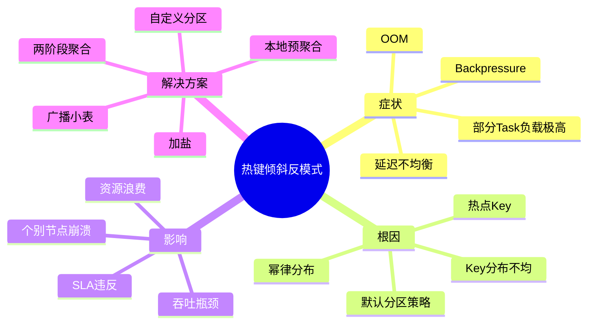
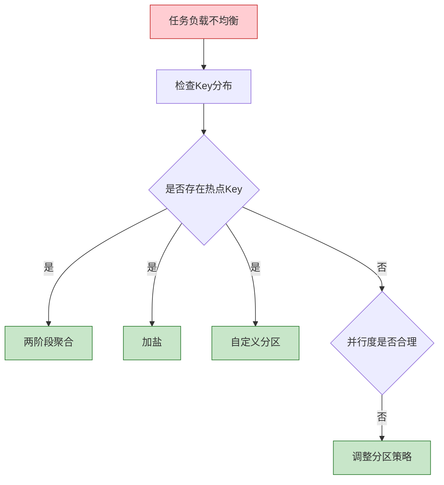

# 反模式 AP-04: 热点 Key 未处理 (Hot Key Skew)

> 所属阶段: Knowledge | 前置依赖: [相关文档] | 形式化等级: L3

> **反模式编号**: AP-04 | **所属分类**: 数据分布类 | **严重程度**: P1 | **检测难度**: 难
>
> 数据倾斜导致某些 subtask 负载过高，形成处理瓶颈，整体吞吐受限于最慢的 subtask。

---

## 目录

- [反模式 AP-04: 热点 Key 未处理 (Hot Key Skew)](#反模式-ap-04-热点-key-未处理-hot-key-skew)
  - [目录](#目录)
  - [1. 反模式定义 (Definition)](#1-反模式定义-definition)
  - [2. 症状/表现 (Symptoms)](#2-症状表现-symptoms)
    - [2.1 运行时症状](#21-运行时症状)
    - [2.2 Flink Web UI 观察](#22-flink-web-ui-观察)
    - [2.3 诊断查询](#23-诊断查询)
  - [3. 负面影响 (Negative Impacts)](#3-负面影响-negative-impacts)
    - [3.1 吞吐量影响](#31-吞吐量影响)
    - [3.2 资源浪费](#32-资源浪费)
    - [3.3 状态管理影响](#33-状态管理影响)
    - [3.4 业务影响](#34-业务影响)
  - [4. 解决方案 (Solution)](#4-解决方案-solution)
    - [4.1 两阶段聚合（Two-Phase Aggregation）](#41-两阶段聚合two-phase-aggregation)
    - [4.2 热点 Key 加盐（Salting）](#42-热点-key-加盐salting)
    - [4.3 局部聚合 + 全局合并（Map-Side Combine）](#43-局部聚合--全局合并map-side-combine)
    - [4.4 动态重分区](#44-动态重分区)
    - [4.5 Key 拆分与重组](#45-key-拆分与重组)
  - [5. 代码示例 (Code Examples)](#5-代码示例-code-examples)
    - [5.1 错误示例：直接按热点 Key 分组](#51-错误示例直接按热点-key-分组)
    - [5.2 正确示例：两阶段聚合](#52-正确示例两阶段聚合)
    - [5.3 错误示例：在热点 Key 上使用状态](#53-错误示例在热点-key-上使用状态)
    - [5.4 正确示例：热点 Key 状态拆分](#54-正确示例热点-key-状态拆分)
  - [6. 实例验证 (Examples)](#6-实例验证-examples)
    - [6.1 案例：社交平台用户行为统计](#61-案例社交平台用户行为统计)
  - [7. 可视化 (Visualizations)](#7-可视化-visualizations)
    - [7.1 数据倾斜 vs 均衡处理对比](#71-数据倾斜-vs-均衡处理对比)
    - [7.2 热点 Key 处理决策树](#72-热点-key-处理决策树)
    - [7.3 热键倾斜反模式思维导图](#73-热键倾斜反模式思维导图)
    - [7.4 数据倾斜诊断决策树](#74-数据倾斜诊断决策树)
  - [8. 引用参考 (References](#8-引用参考-references)

---

## 1. 反模式定义 (Definition)

**定义 (Def-K-09-04)**:

> 热点 Key 未处理是指数据分区键（Key）分布不均匀，导致某些 Key 的数据量远大于其他 Key，进而使得处理这些 Key 的 subtask 成为系统瓶颈，整体吞吐量受限于最慢的 subtask。

**形式化描述** [^1]：

设 Key 空间为 $\mathcal{K}$，数据流为 $D$，Key 提取函数为 $k: D \to \mathcal{K}$，并行度为 $P$。数据倾斜度定义为：

$$
\text{Skew} = \frac{\max_{p \in [1,P]} |D_p|}{\frac{1}{P}\sum_{p=1}^{P} |D_p|}
$$

其中 $D_p = \{d \in D : \text{hash}(k(d)) \mod P = p\}$ 为分配给 subtask $p$ 的数据。

当 $\text{Skew} > 2$ 时，认为存在明显数据倾斜；当 $\text{Skew} > 5$ 时，严重倾斜需要处理。

**数据分布模型** [^2]：

```
┌─────────────────────────────────────────────────────────────────────────┐
│                       数据分布与倾斜度量                                 │
├─────────────────────────────────────────────────────────────────────────┤
│                                                                         │
│  均匀分布                    轻微倾斜              严重倾斜             │
│                                                                         │
│  │                           │                     │                    │
│  │    ┌─┐                    │   ┌───┐             │   ┌────────┐       │
│  │    ├─┤ ┌─┐                │   │   │ ┌─┐         │   │        │ ┌┐    │
│  │ ┌─┐├─┤┌┴┐│                │ ┌─┤   │┌┴┐│         │ ┌─┤        │┌┘└┐   │
│  │ ├─┤├─┤├─┤│                │ ├─┤   │├─┤│         │ ├─┤        │├──┤   │
│  └─┴─┴┴─┴┴─┴┘                └─┴─┴───┴┴─┴┘         └─┴─┴────────┴┴──┘   │
│                                                                         │
│  Skew ≈ 1.0                  Skew ≈ 2.5            Skew > 5.0           │
│  (健康)                      (需关注)              (必须处理)           │
│                                                                         │
│  典型场景:                   典型场景:             典型场景:              │
│  - UUID 用户ID               - 长尾用户            - 头部大V/大卖家      │
│  - 随机设备ID                - 热门商品            - 节假日/促销热点     │
│  - 均匀分区的订单            - 地理热点            - 全局配置/元数据      │
│                                                                         │
└─────────────────────────────────────────────────────────────────────────┘
```

**常见热点场景** [^3]：

| 场景 | 热点 Key 示例 | 成因 |
|------|---------------|------|
| **社交应用** | 大V用户ID | 粉丝数差异导致互动量悬殊 |
| **电商平台** | 爆品SKU、大卖家 | 促销集中，马太效应 |
| **IoT 监控** | 故障设备ID | 故障设备频繁上报异常 |
| **金融交易** | 热门股票代码 | 市场关注度差异 |
| **日志处理** | 错误类型、热门URL | 错误集中或流量不均 |
| **全局配置** | "config"、"default" | 配置广播到单一 Key |

---

## 2. 症状/表现 (Symptoms)

### 2.1 运行时症状

```
┌─────────────────────────────────────────────────────────────────────────┐
│                        数据倾斜症状雷达                                  │
├─────────────────────────────────────────────────────────────────────────┤
│                                                                         │
│   吞吐量瓶颈 ◄─────────────────────────────────────────────► 资源利用   │
│        │                                                       │        │
│        │    【不均衡的 subtask 表现】                          │        │
│        │    • 部分 subtask 背压严重,其余空闲                  │        │
│        │    • 整体吞吐量 = 最慢 subtask 的吞吐量               │        │
│        │    • 增加并行度效果不明显                             │        │
│        │                                                       │        │
│   延迟不均 ◄─────────────────────────────────────────────► 状态大小   │
│        │                                                       │        │
│        │    【延迟分布特征】                                     │        │
│        │    • 延迟百分位差距大(p50 vs p99)                   │        │
│        │    • 某些 subtask 延迟持续增长                        │        │
│        │    • 热点 Key 的处理延迟累积                          │        │
│        │                                                       │        │
│   GC异常 ◄─────────────────────────────────────────────► 内存压力     │
│        │                                                       │        │
│        │    【热点 subtask 资源问题】                            │        │
│        │    • 热点 subtask GC 频率高                           │        │
│        │    • 热点 subtask OOM 风险                            │        │
│        │    • 状态后端写入热点 Key 状态耗时增加                │        │
│        │                                                       │        │
└─────────────────────────────────────────────────────────────────────────┘
```

### 2.2 Flink Web UI 观察

| 指标 | 健康状态 | 数据倾斜状态 |
|------|----------|--------------|
| `Records Received` (各 subtask) | 差值 < 20% | 差值 > 5 倍 |
| `Records Sent` (各 subtask) | 差值 < 20% | 部分 subtask 极低 |
| `Backpressure` | 均匀分布 | 集中在少数 subtask |
| `Checkpoint Duration` | 各 subtask 相近 | 热点 subtask 显著更长 |
| `State Size` | 各 subtask 相近 | 热点 subtask 显著更大 |

### 2.3 诊断查询

```scala
// 使用 Flink SQL 分析数据分布
val distributionAnalysis = tableEnv.sqlQuery("""
  SELECT
    key,
    COUNT(*) as record_count,
    COUNT(*) * 100.0 / SUM(COUNT(*)) OVER () as percentage
  FROM data_stream
  GROUP BY key
  ORDER BY record_count DESC
  LIMIT 20
""")

// 预期结果:如果 top 10 keys 占比 > 50%,存在严重倾斜
```

---

## 3. 负面影响 (Negative Impacts)

### 3.1 吞吐量影响

**阿姆达尔定律在数据倾斜中的体现** [^4]：

```
场景: 并行度=8,数据分布极度倾斜

Subtask 分布:
- Subtask-0: 50% 数据(热点 Key)
- Subtask-1~7: 各 7.1% 数据

理论最大吞吐量:
= 单 subtask 吞吐量 × 8 (如果均匀)

实际最大吞吐量:
= 单 subtask 吞吐量 × 2 (Subtask-0 成为瓶颈)

吞吐量损失:
= (8 - 2) / 8 = 75%

即使将并行度增加到 16,
如果热点 Key 仍集中在一个 subtask,
吞吐量不会提升！
```

### 3.2 资源浪费

```
资源利用率分布:

Subtask-0 (热点): CPU 100%, 内存 90%, 网络 80%  → 瓶颈
Subtask-1:        CPU 15%,  内存 20%, 网络 10%  → 空闲
Subtask-2:        CPU 15%,  内存 20%, 网络 10%  → 空闲
...
Subtask-7:        CPU 15%,  内存 20%, 网络 10%  → 空闲

整体资源利用率: ~25%(严重浪费)
```

### 3.3 状态管理影响

| 影响 | 说明 | 量化 |
|------|------|------|
| **状态大小不均** | 热点 subtask 状态快速增长 | 可达其他 subtask 的 10-100 倍 |
| **Checkpoint 延迟** | 热点 subtask Checkpoint 耗时 | 增加 3-10 倍 |
| **状态恢复慢** | 热点 subtask 恢复时间长 | 拖慢整体恢复 |
| **RocksDB 压缩** | 热点 Key 触发频繁压缩 | CPU 飙升 |

### 3.4 业务影响

- **实时性下降**：热点 Key 数据延迟累积，告警延迟
- **超时失败**：热点数据处理超时，导致失败重试
- **数据不一致**：热点 Key 状态更新滞后

---

## 4. 解决方案 (Solution)

### 4.1 两阶段聚合（Two-Phase Aggregation）

适用于聚合场景，先局部聚合再全局聚合 [^3][^5]：

```scala
// ✅ 正确: 两阶段聚合解决热点 Key
object TwoPhaseAggregation {

  // 阶段1: 随机预聚合(打散热点)
  def preAggregate(input: DataStream[Event]): DataStream[PartialResult] = {
    input
      .map(event => (event.key, Random.nextInt(100), event.value))  // 添加随机后缀
      .keyBy(t => (t._1, t._2))  // 按 (key, random) 分组
      .window(TumblingProcessingTimeWindows.of(Time.seconds(5)))
      .aggregate(new PreAggregateFunction())  // 局部聚合
      .map(result => (result.key, result.partialSum))  // 去掉随机后缀
  }

  // 阶段2: 全局聚合
  def globalAggregate(partial: DataStream[(String, Long)]): DataStream[FinalResult] = {
    partial
      .keyBy(_._1)  // 按原始 Key 分组
      .window(TumblingProcessingTimeWindows.of(Time.seconds(5)))
      .aggregate(new GlobalAggregateFunction())  // 全局聚合
  }

  // 使用
  val result = globalAggregate(preAggregate(input))
}

// 效果:
// 阶段1: 热点 Key 被随机拆分到 100 个桶,并行处理
// 阶段2: 每个 Key 只有 100 条部分聚合结果,无热点
```

### 4.2 热点 Key 加盐（Salting）

适用于非聚合场景，将热点 Key 拆分为多个虚拟 Key [^5]：

```scala
// ✅ 正确: 热点 Key 加盐处理
class SaltedKeyProcessFunction extends KeyedProcessFunction[String, Event, Result] {

  private val SALT_COUNT = 100  // 盐值数量

  // 判断是否为热点 Key(需要预先分析或动态检测)
  private val hotKeys = Set("user_123", "product_456")

  override def processElement(
    event: Event,
    ctx: Context,
    out: Collector[Result]
  ): Unit = {
    if (hotKeys.contains(event.key)) {
      // 热点 Key: 随机选择盐值,分散到多个虚拟 Key
      val salt = Random.nextInt(SALT_COUNT)
      val saltedKey = s"${event.key}#${salt}"
      // 转发到加盐后的 Key 处理
      forwardToSaltedSubtask(saltedKey, event)
    } else {
      // 普通 Key: 正常处理
      processNormal(event)
    }
  }

  // 定时合并热点 Key 的结果
  override def onTimer(
    timestamp: Long,
    ctx: OnTimerContext,
    out: Collector[Result]
  ): Unit = {
    // 收集所有盐值的结果并合并
    val mergedResult = collectAndMergeSaltedResults(ctx.getCurrentKey)
    out.collect(mergedResult)
  }
}
```

### 4.3 局部聚合 + 全局合并（Map-Side Combine）

适用于窗口聚合，Flink 内置优化 [^3]：

```scala
// ✅ 正确: 使用 AggregateFunction 实现 Map-Side Combine
class OptimizedWindowAggregation {

  // 使用 AggregateFunction 而非 ProcessWindowFunction
  // AggregateFunction 会先在窗口内局部聚合
  val result = stream
    .keyBy(_.key)
    .window(TumblingEventTimeWindows.of(Time.minutes(1)))
    .aggregate(
      // 增量聚合函数
      new AggregateFunction[Event, Long, Long] {
        override def createAccumulator(): Long = 0L
        override def add(value: Event, accumulator: Long): Long =
          accumulator + value.amount
        override def getResult(accumulator: Long): Long = accumulator
        override def merge(a: Long, b: Long): Long = a + b
      },
      // 可选:ProcessWindowFunction 处理窗口元数据
      new ProcessWindowFunction[Long, Result, String, TimeWindow] {
        override def process(
          key: String,
          context: Context,
          elements: Iterable[Long],
          out: Collector[Result]
        ): Unit = {
          // 此时 elements 只有一条(已聚合),无热点问题
          out.collect(Result(key, elements.head, context.window))
        }
      }
    )
}
```

### 4.4 动态重分区

根据负载动态调整分区策略 [^6]：

```scala
// ✅ 正确: 自定义分区器实现动态重分区
class DynamicPartitioner extends Partitioner[String] {

  private val loadTracker = new ConcurrentHashMap[String, AtomicLong]()

  override def partition(key: String, numPartitions: Int): Int = {
    val load = loadTracker.computeIfAbsent(key, _ => new AtomicLong(0))
    load.incrementAndGet()

    // 对于高负载 Key,使用一致性哈希分散
    if (load.get() > HIGH_LOAD_THRESHOLD) {
      // 使用 key + 时间戳后缀进行分区
      val distributedKey = s"${key}_${System.currentTimeMillis() % 10}"
      Math.abs(distributedKey.hashCode) % numPartitions
    } else {
      // 普通 Key 直接哈希
      Math.abs(key.hashCode) % numPartitions
    }
  }
}

// 使用自定义分区器
stream
  .partitionCustom(new DynamicPartitioner(), _.key)
  .map(process)
```

### 4.5 Key 拆分与重组

适用于可拆分的大 Key [^5]：

```scala
// ✅ 正确: 将大 Key 拆分为子 Key,处理后重组
class KeySplitProcessFunction extends ProcessFunction[Event, Result] {

  // 状态:存储子 Key 的部分结果
  private var partialResults: MapState[String, PartialResult] = _

  override def open(parameters: Configuration): Unit = {
    partialResults = getRuntimeContext.getMapState(
      new MapStateDescriptor("partial-results", classOf[String], classOf[PartialResult])
    )
  }

  override def processElement(event: Event, ctx: Context, out: Collector[Result]): Unit = {
    // 将大 Key 拆分为多个子 Key 处理
    val subKeys = splitKey(event.key, SUB_KEY_COUNT)

    subKeys.foreach { subKey =>
      val current = Option(partialResults.get(subKey)).getOrElse(PartialResult.empty)
      val updated = current.merge(processSubEvent(event, subKey))
      partialResults.put(subKey, updated)
    }

    // 检查是否可以输出完整结果
    if (canEmitCompleteResult(event.key)) {
      out.collect(mergeAndEmit(event.key))
    }
  }

  private def splitKey(key: String, count: Int): List[String] = {
    (0 until count).map(i => s"${key}_sub${i}").toList
  }
}
```

---

## 5. 代码示例 (Code Examples)

### 5.1 错误示例：直接按热点 Key 分组

```scala
// ❌ 错误: 直接使用热点 Key 分组
val result = eventStream
  .keyBy(_.userId)  // userId 可能是热点(大V用户)
  .window(TumblingEventTimeWindows.of(Time.minutes(1)))
  .process(new UserStatsFunction())

// 问题:
// 1. 大V用户的 subtask 处理量可能是其他 subtask 的 100 倍
// 2. 该 subtask 背压严重,影响整体吞吐量
// 3. 大V用户的状态持续增长,Checkpoint 变慢
```

### 5.2 正确示例：两阶段聚合

```scala
// ✅ 正确: 两阶段聚合处理热点
class TwoPhaseUserStats {

  // 第一阶段:随机预聚合
  def preAggregate(input: DataStream[UserEvent]): DataStream[PartialUserStats] = {
    input
      .map { event =>
        val salt = Random.nextInt(PRE_AGGREGATE_PARALLELISM)
        (event.userId, salt, event)
      }
      .keyBy(t => (t._1, t._2))  // (userId, salt) 分组
      .window(TumblingEventTimeWindows.of(Time.seconds(10)))
      .aggregate(new PreAggregateFunction())
  }

  // 第二阶段:按 userId 全局聚合
  def globalAggregate(partial: DataStream[PartialUserStats]): DataStream[UserStats] = {
    partial
      .keyBy(_.userId)
      .window(TumblingEventTimeWindows.of(Time.minutes(1)))
      .aggregate(
        new AggregateFunction[PartialUserStats, UserAccumulator, UserStats] {
          override def createAccumulator() = UserAccumulator(0, 0, 0)
          override def add(value: PartialUserStats, acc: UserAccumulator) =
            UserAccumulator(
              acc.clickCount + value.clickCount,
              acc.purchaseCount + value.purchaseCount,
              acc.totalAmount + value.totalAmount
            )
          override def getResult(acc: UserAccumulator) =
            UserStats(acc.clickCount, acc.purchaseCount, acc.totalAmount)
          override def merge(a: UserAccumulator, b: UserAccumulator) =
            UserAccumulator(
              a.clickCount + b.clickCount,
              a.purchaseCount + b.purchaseCount,
              a.totalAmount + b.totalAmount
            )
        }
      )
  }
}
```

### 5.3 错误示例：在热点 Key 上使用状态

```scala
// ❌ 错误: 在热点 Key 上累积大量状态
class BadHotKeyStateFunction extends KeyedProcessFunction[String, Event, Result] {

  private var eventListState: ListState[Event] = _

  override def open(parameters: Configuration): Unit = {
    eventListState = getRuntimeContext.getListState(
      new ListStateDescriptor("events", classOf[Event])
    )
  }

  override def processElement(event: Event, ctx: Context, out: Collector[Result]): Unit = {
    // 热点 Key 会累积大量事件,导致状态爆炸
    eventListState.add(event)

    // 每小时输出一次,中间状态持续增长
    if (shouldEmit(ctx.timestamp())) {
      val events = eventListState.get().asScala.toList
      out.collect(Result(ctx.getCurrentKey, events))
      eventListState.clear()
    }
  }
}
```

### 5.4 正确示例：热点 Key 状态拆分

```scala
// ✅ 正确: 使用定时器和增量聚合避免状态累积
class OptimizedHotKeyFunction extends KeyedProcessFunction[String, Event, Result] {

  private var accumulatorState: ValueState[Accumulator] = _
  private var timerState: ValueState[Long] = _

  override def open(parameters: Configuration): Unit = {
    accumulatorState = getRuntimeContext.getState(
      new ValueStateDescriptor("accumulator", classOf[Accumulator])
    )
    timerState = getRuntimeContext.getState(
      new ValueStateDescriptor("timer", classOf[Long])
    )
  }

  override def processElement(event: Event, ctx: Context, out: Collector[Result]): Unit = {
    // 增量更新,不累积原始事件
    val current = accumulatorState.value() match {
      case null => Accumulator.empty
      case acc => acc
    }
    accumulatorState.update(current.add(event))

    // 注册定时器
    if (timerState.value() == null) {
      val nextEmit = (ctx.timestamp() / 60000 + 1) * 60000
      ctx.timerService().registerEventTimeTimer(nextEmit)
      timerState.update(nextEmit)
    }
  }

  override def onTimer(timestamp: Long, ctx: OnTimerContext, out: Collector[Result]): Unit = {
    val acc = accumulatorState.value()
    if (acc != null) {
      out.collect(Result(ctx.getCurrentKey, acc.toStats()))
      accumulatorState.clear()
    }
    timerState.clear()
  }
}
```

---

## 6. 实例验证 (Examples)

### 6.1 案例：社交平台用户行为统计

**业务场景**：统计每个用户的实时互动数（点赞、评论、分享）

**问题分析** [^7]：

- 用户 ID 分布极度不均：头部 1% 用户产生 50% 互动
- 明星用户 ID 的单条 subtask 处理量是普通用户的 500 倍
- 并行度 20，但有效吞吐量仅相当于并行度 5

**优化方案**：

```scala
// 优化前:直接按 userId 分组
// 优化后:两阶段聚合 + 热点 Key 特殊处理

object OptimizedUserStats {

  val HOT_KEY_THRESHOLD = 10000  // 每秒事件数阈值
  val PRE_AGGREGATE_PARALLELISM = 50

  def process(input: DataStream[InteractionEvent]): DataStream[UserStats] = {
    input
      // 步骤1: 为热点 Key 添加盐值
      .map { event =>
        if (isHotKey(event.userId)) {
          val salt = Random.nextInt(PRE_AGGREGATE_PARALLELISM)
          event.copy(userId = s"${event.userId}#${salt}")
        } else {
          event
        }
      }
      // 步骤2: 预聚合窗口(10秒)
      .keyBy(_.userId)
      .window(TumblingEventTimeWindows.of(Time.seconds(10)))
      .aggregate(new PreAggregateFunction())
      // 步骤3: 去掉盐值,全局聚合
      .map(_.copy(userId = removeSalt(_.userId)))
      .keyBy(_.userId)
      .window(TumblingEventTimeWindows.of(Time.minutes(1)))
      .aggregate(new GlobalAggregateFunction())
  }

  private def isHotKey(userId: String): Boolean = {
    // 动态检测或从配置加载热点 Key 列表
    HotKeyDetector.isHot(userId)
  }

  private def removeSalt(userId: String): String = {
    userId.split("#").head
  }
}
```

**效果验证**：

- 吞吐量：从 50K events/s 提升到 200K events/s（4倍）
- 延迟：p99 从 30s 降低到 5s
- 资源利用率：从 25% 提升到 70%

---

## 7. 可视化 (Visualizations)

### 7.1 数据倾斜 vs 均衡处理对比

```mermaid
graph TB
    subgraph "数据倾斜(错误)"
        I1[Input Stream] -->|hash(key) % 4| S1[Subtask-0<br/>80% 数据<br/>瓶颈!]
        I1 -->|hash(key) % 4| S2[Subtask-1<br/>7% 数据]
        I1 -->|hash(key) % 4| S3[Subtask-2<br/>7% 数据]
        I1 -->|hash(key) % 4| S4[Subtask-3<br/>6% 数据]

        S1 --> O1[Output<br/>延迟高]
        S2 --> O1
        S3 --> O1
        S4 --> O1

        style S1 fill:#ffcdd2,stroke:#c62828
        style S2 fill:#c8e6c9,stroke:#2e7d32
        style S3 fill:#c8e6c9,stroke:#2e7d32
        style S4 fill:#c8e6c9,stroke:#2e7d32
    end

    subgraph "两阶段聚合(正确)"
        I2[Input Stream] -->|随机盐值| P1[Pre-aggregate<br/>Subtask-0]
        I2 -->|随机盐值| P2[Pre-aggregate<br/>Subtask-1]
        I2 -->|随机盐值| P3[Pre-aggregate<br/>Subtask-2]
        I2 -->|随机盐值| P4[Pre-aggregate<br/>Subtask-3]

        P1 -->|均匀分布| G1[Global Aggregate<br/>Subtask-0]
        P2 --> G2[Global Aggregate<br/>Subtask-1]
        P3 --> G3[Global Aggregate<br/>Subtask-2]
        P4 --> G4[Global Aggregate<br/>Subtask-3]

        G1 --> O2[Output<br/>均衡]
        G2 --> O2
        G3 --> O2
        G4 --> O2

        style P1 fill:#c8e6c9,stroke:#2e7d32
        style P2 fill:#c8e6c9,stroke:#2e7d32
        style P3 fill:#c8e6c9,stroke:#2e7d32
        style P4 fill:#c8e6c9,stroke:#2e7d32
        style G1 fill:#c8e6c9,stroke:#2e7d32
        style G2 fill:#c8e6c9,stroke:#2e7d32
        style G3 fill:#c8e6c9,stroke:#2e7d32
        style G4 fill:#c8e6c9,stroke:#2e7d32
    end
```

### 7.2 热点 Key 处理决策树



### 7.3 热键倾斜反模式思维导图

以下思维导图以"热键倾斜反模式"为中心，系统梳理其症状、根因、影响与解决方案。



### 7.4 数据倾斜诊断决策树

以下决策树展示从任务负载不均衡出发，逐步诊断并选择处理策略的过程。



---

## 8. 引用参考 (References

[^1]: Apache Flink Documentation, "Parallel Execution," 2025. <https://nightlies.apache.org/flink/flink-docs-stable/docs/dev/datastream/execution/parallel/>

[^2]: M. Kleppmann, "Designing Data-Intensive Applications," O'Reilly Media, 2017. Chapter 6: Partitioning.

[^3]: Apache Flink Documentation, "Windows," 2025. <https://nightlies.apache.org/flink/flink-docs-stable/docs/dev/datastream/operators/windows/>

[^4]: G. M. Amdahl, "Validity of the Single Processor Approach to Achieving Large Scale Computing Capabilities," *AFIPS*, 1967.

[^5]: Apache Flink Best Practices, "Handling Data Skew," 2025. <<https://nightlies.apache.org/flink/flink-docs-stable/docs/learn-flink/>

[^6]: P. Carbone et al., "Apache Flink: Stream and Batch Processing in a Single Engine," *IEEE Data Engineering Bulletin*, 38(4), 2015.

[^7]: 用户行为分析案例，详见 [Knowledge/02-design-patterns/pattern-realtime-feature-engineering.md](../02-design-patterns/pattern-realtime-feature-engineering.md)

---

*文档版本: v1.0 | 更新日期: 2026-04-03 | 状态: 已完成*

---

*文档版本: v1.0 | 创建日期: 2026-04-20*
