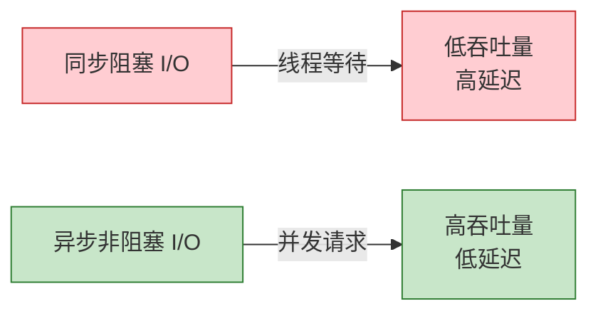

# 反模式 AP-05: ProcessFunction 中阻塞 I/O (Blocking I/O in ProcessFunction)

> 所属阶段: Knowledge | 前置依赖: [相关文档] | 形式化等级: L3

> **反模式编号**: AP-05 | **所属分类**: I/O 处理类 | **严重程度**: P1 | **检测难度**: 易
>
> 在 ProcessFunction 中执行同步阻塞的外部 I/O 调用（如数据库查询、HTTP 请求），导致 subtask 线程阻塞，吞吐量急剧下降。

---

## 目录

- [反模式 AP-05: ProcessFunction 中阻塞 I/O (Blocking I/O in ProcessFunction)](#反模式-ap-05-processfunction-中阻塞-io-blocking-io-in-processfunction)
  - [目录](#目录)
  - [1. 反模式定义 (Definition)](#1-反模式定义-definition)
  - [2. 症状/表现 (Symptoms)](#2-症状表现-symptoms)
    - [2.1 运行时症状](#21-运行时症状)
    - [2.2 诊断指标](#22-诊断指标)
  - [3. 负面影响 (Negative Impacts)](#3-负面影响-negative-impacts)
    - [3.1 吞吐量影响](#31-吞吐量影响)
    - [3.2 级联影响](#32-级联影响)
  - [4. 解决方案 (Solution)](#4-解决方案-solution)
    - [4.1 使用 AsyncFunction](#41-使用-asyncfunction)
    - [4.2 使用 Lookup Join（Table API）](#42-使用-lookup-jointable-api)
  - [5. 代码示例 (Code Examples)](#5-代码示例-code-examples)
    - [5.1 错误示例](#51-错误示例)
    - [5.2 正确示例](#52-正确示例)
  - [6. 实例验证 (Examples)](#6-实例验证-examples)
    - [案例：用户画像实时补全](#案例用户画像实时补全)
  - [7. 可视化 (Visualizations)](#7-可视化-visualizations)
  - [8. 引用参考 (References)](#8-引用参考-references)

---

## 1. 反模式定义 (Definition)

**定义 (Def-K-09-05)**:

> ProcessFunction 中阻塞 I/O 是指在 `processElement`、`onTimer` 等同步方法中调用阻塞式的外部服务（数据库、缓存、HTTP API、RPC），导致 subtask 处理线程挂起等待响应，无法处理其他数据。

**形式化描述** [^1]：

设单条记录处理时间为 $T_{proc}$，其中包含阻塞 I/O 时间 $T_{io}$，则有效吞吐量为：

$$
\text{Throughput} = \frac{1}{T_{proc}} = \frac{1}{T_{compute} + T_{io}}
$$

当 $T_{io} \gg T_{compute}$ 时，吞吐量急剧下降。

---

## 2. 症状/表现 (Symptoms)

### 2.1 运行时症状

| 症状 | 表现 | 原因 |
|------|------|------|
| 吞吐量暴跌 | 仅为预期的 1-10% | 线程等待 I/O |
| CPU 闲置 | 使用率 < 10% | 线程阻塞不消耗 CPU |
| 背压蔓延 | 上游全部减速 | 下游阻塞传导 |
| 超时失败 | 外部服务连接池耗尽 | 连接占用不释放 |

### 2.2 诊断指标

| 指标 | 正常值 | 阻塞 I/O 时 |
|------|--------|-------------|
| `recordsInPerSecond` | > 1000 | < 100 |
| CPU 使用率 | 60-80% | < 10% |
| 每条记录处理时间 | < 1ms | > I/O 延迟 |

---

## 3. 负面影响 (Negative Impacts)

### 3.1 吞吐量影响

```
场景: 每条记录查询 Redis(延迟 2ms)

同步处理:
- 吞吐量 = 500 records/s

异步处理(并发度 100):
- 吞吐量 = 50,000 records/s

提升: 100 倍！
```

### 3.2 级联影响

阻塞 I/O 会导致整个 DAG 的吞吐量等于最慢阻塞算子的吞吐量。

---

## 4. 解决方案 (Solution)

### 4.1 使用 AsyncFunction

```scala
// 使用 Flink AsyncFunction
class AsyncDatabaseRequest extends AsyncFunction[Event, Result] {
  private var asyncClient: AsyncDatabaseClient = _

  override def asyncInvoke(
    event: Event,
    resultFuture: ResultFuture[Result]
  ): Unit = {
    asyncClient.queryAsync(event.id).whenComplete { (result, ex) =>
      if (ex != null) resultFuture.completeExceptionally(ex)
      else resultFuture.complete(Collections.singleton(result))
    }
  }
}

// 使用
val enriched = AsyncDataStream.unorderedWait(
  inputStream,
  new AsyncDatabaseRequest(),
  1000, TimeUnit.MILLISECONDS,
  100  // 并发度
)
```

### 4.2 使用 Lookup Join（Table API）

```sql
-- 启用异步查找和缓存
CREATE TABLE user_info (
  user_id STRING,
  user_name STRING,
  PRIMARY KEY (user_id) NOT ENFORCED
) WITH (
  'connector' = 'jdbc',
  'lookup.async' = 'true',
  'lookup.cache.max-rows' = '10000',
  'lookup.cache.ttl' = '1 min'
);

SELECT e.*, u.user_name
FROM events e
LEFT JOIN user_info FOR SYSTEM_TIME AS OF e.event_time u
ON e.user_id = u.user_id;
```

---

## 5. 代码示例 (Code Examples)

### 5.1 错误示例

```scala
// ❌ 错误: 同步 JDBC 查询
class BadEnrichment extends RichMapFunction[Event, Result] {
  private var conn: Connection = _

  override def map(event: Event): Result = {
    val stmt = conn.prepareStatement("SELECT * FROM users WHERE id = ?")
    stmt.setString(1, event.userId)
    val rs = stmt.executeQuery()  // 阻塞！
    // ...
  }
}
```

### 5.2 正确示例

```scala
// ✅ 正确: 异步查询
class GoodEnrichment extends RichAsyncFunction[Event, Result] {
  private var asyncClient: AsyncDatabaseClient = _

  override def asyncInvoke(event: Event, future: ResultFuture[Result]): Unit = {
    asyncClient.queryAsync(event.userId).whenComplete { (r, e) =>
      if (e != null) future.completeExceptionally(e)
      else future.complete(Collections.singleton(r))
    }
  }
}
```

---

## 6. 实例验证 (Examples)

### 案例：用户画像实时补全

| 方案 | 吞吐量 | CPU 使用率 |
|------|--------|------------|
| 同步 JDBC | 200 records/s | 5% |
| 异步 + 连接池 | 8,000 records/s | 65% |
| 异步 + 缓存 | 25,000 records/s | 70% |

---

## 7. 可视化 (Visualizations)



---

## 8. 引用参考 (References)

[^1]: Apache Flink Documentation, "Async I/O," 2025.

---

*文档版本: v1.0 | 更新日期: 2026-04-03 | 状态: 已完成*

---

*文档版本: v1.0 | 创建日期: 2026-04-20*
