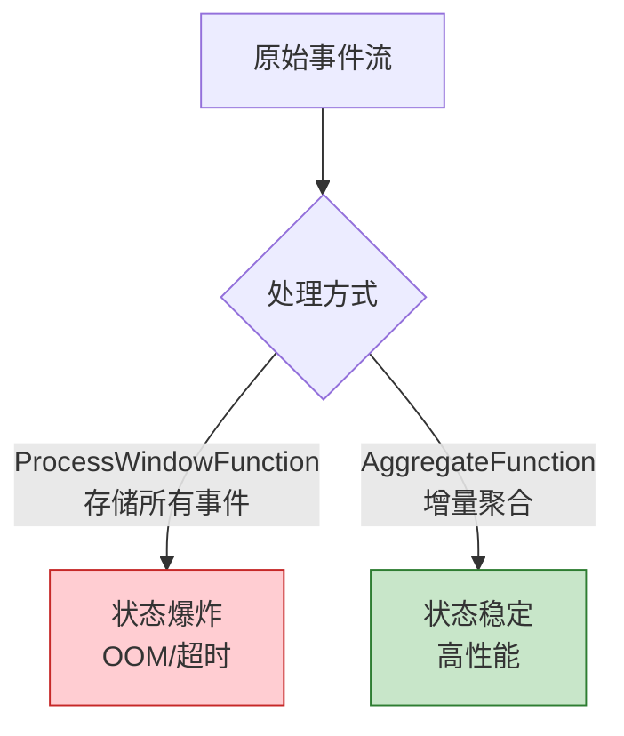

# 反模式 AP-07: 窗口函数状态爆炸 (Window State Explosion)

> 所属阶段: Knowledge | 前置依赖: [相关文档] | 形式化等级: L3

> **反模式编号**: AP-07 | **所属分类**: 状态管理类 | **严重程度**: P1 | **检测难度**: 难
>
> 在窗口函数中累积大量原始事件而未使用增量聚合，导致窗口状态无限增长，最终 OOM 或 Checkpoint 超时。

---

## 目录

- [反模式 AP-07: 窗口函数状态爆炸 (Window State Explosion)](#反模式-ap-07-窗口函数状态爆炸-window-state-explosion)
  - [目录](#目录)
  - [1. 反模式定义 (Definition)](#1-反模式定义-definition)
  - [2. 症状/表现 (Symptoms)](#2-症状表现-symptoms)
  - [3. 负面影响 (Negative Impacts)](#3-负面影响-negative-impacts)
    - [3.1 内存影响](#31-内存影响)
  - [4. 解决方案 (Solution)](#4-解决方案-solution)
    - [4.1 使用 AggregateFunction](#41-使用-aggregatefunction)
    - [4.2 结合使用 Aggregate + ProcessWindow]()
    - [4.3 使用 Evictor 限制状态](#43-使用-evictor-限制状态)
  - [5. 代码示例 (Code Examples)](#5-代码示例-code-examples)
    - [5.1 错误示例](#51-错误示例)
    - [5.2 正确示例](#52-正确示例)
  - [6. 实例验证 (Examples)](#6-实例验证-examples)
    - [案例：实时用户行为统计](#案例实时用户行为统计)
  - [7. 可视化 (Visualizations)](#7-可视化-visualizations)
  - [8. 引用参考 (References)](#8-引用参考-references)

---

## 1. 反模式定义 (Definition)

**定义 (Def-K-09-07)**:

> 窗口函数状态爆炸是指在窗口算子中使用 `ProcessWindowFunction` 存储所有原始事件，而未使用 `AggregateFunction` 进行增量聚合，导致窗口状态随输入数据量线性增长。

**状态增长模型** [^1]：

```
状态大小 = 窗口数量 × 每窗口事件数 × 单条事件大小

错误做法:
- 1分钟窗口 × 100万事件/分钟 × 1KB = 1GB/窗口

正确做法:
- 1分钟窗口 × 1个累加器 × 100字节 = 100字节/窗口

优化比: 1GB / 100B = 10,000,000 倍！
```

---

## 2. 症状/表现 (Symptoms)

| 症状 | 表现 | 原因 |
|------|------|------|
| 堆内存不足 | OOM 频繁 | 窗口存储大量事件 |
| Checkpoint 超时 | 持续时间增长 | 状态过大序列化慢 |
| GC 停顿 | Full GC 频繁 | 大对象老年代累积 |
| 吞吐量下降 | 随时间递减 | 状态访问变慢 |

---

## 3. 负面影响 (Negative Impacts)

### 3.1 内存影响

```
场景: 1小时窗口,每秒 1 万事件,每条 500 字节

错误做法(存储原始事件):
- 状态大小 = 10,000 × 3,600 × 500B = 18GB/窗口

正确做法(增量聚合):
- 状态大小 = 累加器 ≈ 100 字节/窗口

节省: 18,000,000 倍！
```

---

## 4. 解决方案 (Solution)

### 4.1 使用 AggregateFunction

```scala
// ✅ 正确: 使用 AggregateFunction 增量聚合
val result = stream
  .keyBy(_.userId)
  .window(TumblingEventTimeWindows.of(Time.minutes(1)))
  .aggregate(new CountAggregate)

// 增量聚合函数
class CountAggregate extends AggregateFunction[Event, CountAcc, CountResult] {
  override def createAccumulator(): CountAcc = CountAcc(0, 0.0)

  override def add(value: Event, accumulator: CountAcc): CountAcc =
    CountAcc(accumulator.count + 1, accumulator.sum + value.amount)

  override def getResult(accumulator: CountAcc): CountResult =
    CountResult(accumulator.count, accumulator.sum)

  override def merge(a: CountAcc, b: CountAcc): CountAcc =
    CountAcc(a.count + b.count, a.sum + b.sum)
}

case class CountAcc(count: Int, sum: Double)
case class CountResult(count: Int, sum: Double)
```

### 4.2 结合使用 Aggregate + ProcessWindow

```scala
// 需要窗口元数据时使用
val result = stream
  .keyBy(_.userId)
  .window(TumblingEventTimeWindows.of(Time.minutes(1)))
  .aggregate(
    new CountAggregate,  // 增量聚合
    new WindowResultFunction  // 处理窗口元数据
  )

// WindowResultFunction 接收已聚合结果
class WindowResultFunction extends ProcessWindowFunction[
  CountResult, Output, String, TimeWindow
] {
  override def process(
    key: String,
    context: Context,
    elements: Iterable[CountResult],  // 只有 1 个元素
    out: Collector[Output]
  ): Unit = {
    val result = elements.head
    out.collect(Output(
      key,
      result.count,
      result.sum,
      context.window.getStart,
      context.window.getEnd
    ))
  }
}
```

### 4.3 使用 Evictor 限制状态

```scala
// 限制窗口内保留的事件数
stream
  .keyBy(_.userId)
  .window(TumblingEventTimeWindows.of(Time.minutes(10)))
  .evictor(CountEvictor.of(1000))  // 只保留最近 1000 条
  .process(new LimitedWindowFunction())
```

---

## 5. 代码示例 (Code Examples)

### 5.1 错误示例

```scala
// ❌ 错误: 存储所有原始事件
class BadWindowFunction extends ProcessWindowFunction[
  Event, Output, String, TimeWindow
] {
  override def process(
    key: String,
    context: Context,
    elements: Iterable[Event],  // 存储所有事件！
    out: Collector[Output]
  ): Unit = {
    // 状态大小 = elements.size × Event 大小
    val count = elements.size
    val sum = elements.map(_.amount).sum
    out.collect(Output(key, count, sum))
  }
}
```

### 5.2 正确示例

```scala
// ✅ 正确: 增量聚合 + 元数据处理
val result = stream
  .keyBy(_.userId)
  .window(TumblingEventTimeWindows.of(Time.minutes(1)))
  .aggregate(
    new SumAggregate,  // 仅存储累加器
    new OutputFunction // 仅接收聚合结果
  )
```

---

## 6. 实例验证 (Examples)

### 案例：实时用户行为统计

| 方案 | 状态大小 | Checkpoint 时间 | GC 频率 |
|------|----------|-----------------|---------|
| ProcessWindowFunction | 20GB | 180s | 频繁 |
| AggregateFunction | 50MB | 5s | 极少 |

---

## 7. 可视化 (Visualizations)



---

## 8. 引用参考 (References)

[^1]: Apache Flink Documentation, "Windows," 2025.

---

*文档版本: v1.0 | 更新日期: 2026-04-03 | 状态: 已完成*

---

*文档版本: v1.0 | 创建日期: 2026-04-20*
