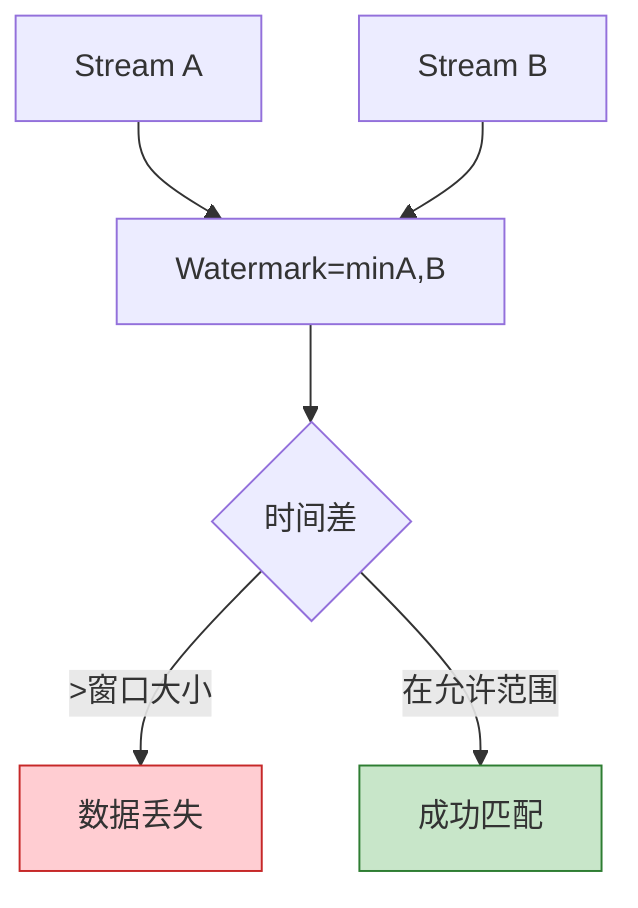

# 反模式 AP-09: 多流 Join 时间未对齐 (Multi-Stream Join Misalignment)

> **反模式编号**: AP-09 | **所属分类**: 时间语义类 | **严重程度**: P1 | **检测难度**: 难
>
> 多流 Join 时未处理各流的时间进度差异，导致 Join 结果缺失或过期数据匹配错误。

---

## 目录

- [反模式 AP-09: 多流 Join 时间未对齐 (Multi-Stream Join Misalignment)](#反模式-ap-09-多流-join-时间未对齐-multi-stream-join-misalignment)
  - [目录](#目录)
  - [1. 反模式定义 (Definition)](#1-反模式定义-definition)
  - [2. 症状/表现 (Symptoms)](#2-症状表现-symptoms)
  - [3. 负面影响 (Negative Impacts)](#3-负面影响-negative-impacts)
    - [3.1 数据丢失](#31-数据丢失)
  - [4. 解决方案 (Solution)](#4-解决方案-solution)
    - [4.1 使用 Interval Join](#41-使用-interval-join)
    - [4.2 配置空闲源](#42-配置空闲源)
    - [4.3 使用 CoGroup 处理不平衡流](#43-使用-cogroup-处理不平衡流)
  - [5. 代码示例 (Code Examples)](#5-代码示例-code-examples)
    - [5.1 错误示例](#51-错误示例)
    - [5.2 正确示例](#52-正确示例)
  - [6. 实例验证 (Examples)](#6-实例验证-examples)
    - [案例：订单支付实时匹配](#案例订单支付实时匹配)
  - [7. 可视化 (Visualizations)](#7-可视化-visualizations)
  - [8. 引用参考 (References)](#8-引用参考-references)

---

## 1. 反模式定义 (Definition)

**定义 (Def-K-09-09)**:

> 多流 Join 时间未对齐是指在多个数据流 Join 操作中，未考虑各流的事件时间进度差异（Watermark 推进速度不同），导致窗口提前触发、数据丢失或错误匹配。

**时间进度差异场景** [^1]：

```
场景: Stream A 和 Stream B Join

时间线:
Stream A: ──► A1(t=10) ──► A2(t=20) ──► A3(t=30) ──► Watermark=30
              │
Stream B: ──►              B1(t=15) ──► Watermark=15

问题:
- Stream A 的 Watermark 推进到 30
- Stream B 的 Watermark 停留在 15
- Join 窗口取 min(30, 15) = 15
- A2(t=20) 和 A3(t=30) 等待的 B 侧数据可能已到达但无法匹配
```

---

## 2. 症状/表现 (Symptoms)

| 症状 | 表现 |
|------|------|
| Join 结果缺失 | 明显匹配的数据未 Join 上 |
| 结果不一致 | 多次运行结果不同 |
| 延迟数据增多 | 一侧流数据进入侧输出 |
| 窗口永不触发 | 某侧流 Watermark 停滞 |

---

## 3. 负面影响 (Negative Impacts)

### 3.1 数据丢失

```
场景: 订单流 Join 支付流

订单(t=10) ──► 等待支付确认
                    │
支付(t=11) ──► 到达，但订单窗口已关闭
                    │
结果: 订单被标记为"未支付"
      实际支付存在，但时间差导致未匹配
```

---

## 4. 解决方案 (Solution)

### 4.1 使用 Interval Join

```scala
// ✅ 正确: 使用 Interval Join 允许时间差
val joined = orders
  .keyBy(_.orderId)
  .intervalJoin(payments.keyBy(_.orderId))
  .between(Time.seconds(-10), Time.seconds(10))  // 允许 ±10s 偏差
  .process(new OrderPaymentJoinFunction())
```

### 4.2 配置空闲源

```scala
// 为可能停滞的流配置空闲源
val watermarkStrategy = WatermarkStrategy
  .forBoundedOutOfOrderness[Event](Duration.ofSeconds(5))
  .withIdleness(Duration.ofMinutes(2))  // 2分钟无数据视为空闲
```

### 4.3 使用 CoGroup 处理不平衡流

```scala
// 处理不平衡的双流 Join
streamA
  .coGroup(streamB)
  .where(_.key)
  .equalTo(_.key)
  .window(TumblingEventTimeWindows.of(Time.minutes(5)))
  .apply(new CoGroupFunction[EventA, EventB, Result] {
    override def coGroup(
      as: Iterable[EventA],
      bs: Iterable[EventB],
      out: Collector[Result]
    ): Unit = {
      // 即使一侧为空也输出结果
      if (as.nonEmpty && bs.nonEmpty) {
        out.collect(Result(as.head, Some(bs.head)))
      } else if (as.nonEmpty) {
        out.collect(Result(as.head, None))  // 标记为未匹配
      }
    }
  })
```

---

## 5. 代码示例 (Code Examples)

### 5.1 错误示例

```scala
// ❌ 错误: 使用窗口 Join 但不处理时间对齐
val joined = streamA
  .join(streamB)
  .where(_.key)
  .equalTo(_.key)
  .window(TumblingEventTimeWindows.of(Time.minutes(5)))
  .apply((a, b) => Result(a, b))

// 问题: 如果 streamA 和 streamB Watermark 推进不一致
// 窗口会过早或过晚触发
```

### 5.2 正确示例

```scala
// ✅ 正确: Interval Join + 空闲源处理
val joined = streamA
  .keyBy(_.key)
  .intervalJoin(streamB.keyBy(_.key))
  .between(Time.seconds(-5), Time.seconds(5))
  .lowerBoundExclusive()
  .upperBoundExclusive()
  .process(new ProcessJoinFunction[A, B, Result] {
    override def processElement(
      a: A,
      b: B,
      ctx: ProcessJoinFunction.Context,
      out: Collector[Result]
    ): Unit = {
      out.collect(Result(a, b, ctx.getLeftTimestamp, ctx.getRightTimestamp))
    }
  })
```

---

## 6. 实例验证 (Examples)

### 案例：订单支付实时匹配

| 方案 | 匹配率 | 延迟 |
|------|--------|------|
| 普通窗口 Join | 75% | 高 |
| Interval Join | 98% | 低 |

---

## 7. 可视化 (Visualizations)



---

## 8. 引用参考 (References)

[^1]: Apache Flink Documentation, "Joins," 2025.

---

*文档版本: v1.0 | 更新日期: 2026-04-03 | 状态: 已完成*
