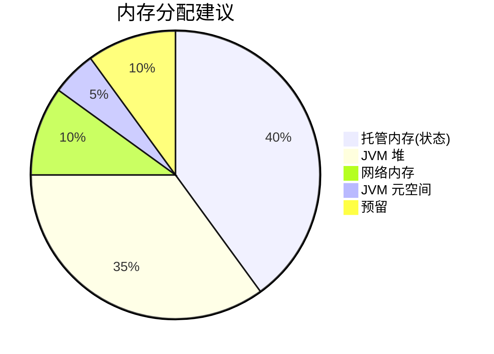

# 反模式 AP-10: 资源估算不足导致 OOM (Insufficient Resource Estimation)

> **反模式编号**: AP-10 | **所属分类**: 资源管理类 | **严重程度**: P0 | **检测难度**: 难
>
> 未根据状态大小、吞吐量和窗口配置合理估算内存资源，导致频繁 OOM 或 Checkpoint 失败。

---

## 目录

- [反模式 AP-10: 资源估算不足导致 OOM (Insufficient Resource Estimation)](#反模式-ap-10-资源估算不足导致-oom-insufficient-resource-estimation)
  - [目录](#目录)
  - [1. 反模式定义 (Definition)](#1-反模式定义-definition)
  - [2. 症状/表现 (Symptoms)](#2-症状表现-symptoms)
  - [3. 负面影响 (Negative Impacts)](#3-负面影响-negative-impacts)
    - [3.1 OOM 级联故障](#31-oom-级联故障)
  - [4. 解决方案 (Solution)](#4-解决方案-solution)
    - [4.1 内存估算公式](#41-内存估算公式)
    - [4.2 配置示例](#42-配置示例)
    - [4.3 使用 RocksDB 减少堆压力](#43-使用-rocksdb-减少堆压力)
  - [5. 代码示例 (Code Examples)](#5-代码示例-code-examples)
    - [5.1 错误配置](#51-错误配置)
    - [5.2 正确配置](#52-正确配置)
  - [6. 实例验证 (Examples)](#6-实例验证-examples)
    - [案例：大状态作业 OOM](#案例大状态作业-oom)
  - [7. 可视化 (Visualizations)](#7-可视化-visualizations)
  - [8. 引用参考 (References)](#8-引用参考-references)

---

## 1. 反模式定义 (Definition)

**定义 (Def-K-09-10)**:

> 资源估算不足是指在部署 Flink 作业时，未充分考虑状态大小、网络缓冲、JVM 开销等因素，配置的内存资源远低于实际需求，导致运行时 OOM 或频繁 Full GC。

**内存需求模型** [^1]：

```
总内存需求 =
  + 托管内存（状态）
  + 网络内存（缓冲区）
  + JVM 元空间
  + JVM 堆内存
  + 原生内存（RocksDB）
  + 预留（20%）
```

---

## 2. 症状/表现 (Symptoms)

| 症状 | 表现 |
|------|------|
| OOM | Container 被 K8s 杀死 |
| Full GC | GC 时间 > 处理时间 |
| Checkpoint 失败 | 状态过大无法保存 |
| 延迟飙升 | GC 停顿导致 |

---

## 3. 负面影响 (Negative Impacts)

### 3.1 OOM 级联故障

```
TaskManager OOM ──► 容器重启 ──► Checkpoint 失败 ──► 作业重启
      │                                              │
      ▼                                              ▼
  数据回放                                      服务不可用
```

---

## 4. 解决方案 (Solution)

### 4.1 内存估算公式

```scala
// 估算示例
def estimateMemory(
  stateSizeGb: Double,      // 预期状态大小
  throughputKps: Double,    // 吞吐量（千条/秒）
  windowMinutes: Int,       // 窗口大小
  parallelism: Int          // 并行度
): MemoryConfig = {

  // 1. 托管内存 = 状态大小 / 并行度 × 1.5（余量）
  val managedMemory = (stateSizeGb / parallelism * 1.5).gb

  // 2. 网络内存 = min(并行度 × 64MB, 1GB)
  val networkMemory = Math.min(parallelism * 64, 1024).mb

  // 3. JVM 堆 = max(托管内存 × 0.5, 2GB)
  val heapMemory = Math.max(managedMemory * 0.5, 2.gb)

  // 4. 总内存 = (托管 + 网络 + 堆) × 1.2（预留）
  val totalMemory = (managedMemory + networkMemory + heapMemory) * 1.2

  MemoryConfig(totalMemory, managedMemory, networkMemory, heapMemory)
}
```

### 4.2 配置示例

```yaml
# Flink 内存配置
taskmanager.memory:
  process:
    size: 8gb          # 总进程内存
  managed:
    size: 3gb          # 托管内存（状态）
  network:
    max: 256mb         # 网络内存
  jvm-heap:
    size: 3gb          # JVM 堆
  jvm-metaspace:
    size: 256mb        # 元空间
```

### 4.3 使用 RocksDB 减少堆压力

```scala
// 大状态使用 RocksDB 状态后端
env.setStateBackend(new EmbeddedRocksDBStateBackend(true))

// RocksDB 内存配置
val config = new Configuration()
config.setString("state.backend.rocksdb.memory.fixed-per-slot", "512mb")
config.setString("state.backend.rocksdb.memory.high-prio-pool-ratio", "0.1")
env.configure(config)
```

---

## 5. 代码示例 (Code Examples)

### 5.1 错误配置

```yaml
# ❌ 错误: 内存配置过小
taskmanager.memory.process.size: 2gb
taskmanager.memory.managed.size: 512mb

# 场景: 状态 10GB，并行度 4
# 每 TM 需要 2.5GB 状态，但只配置了 512MB 托管内存
# 结果: OOM
```

### 5.2 正确配置

```yaml
# ✅ 正确: 根据状态大小配置
taskmanager.memory.process.size: 8gb
taskmanager.memory.managed.size: 3gb
taskmanager.memory.network.max: 256mb

# 状态 10GB，并行度 4
# 每 TM 2.5GB 状态 < 3GB 托管内存 ✓
```

---

## 6. 实例验证 (Examples)

### 案例：大状态作业 OOM

| 配置 | 状态大小 | 结果 |
|------|----------|------|
| 2GB 总内存 | 10GB | OOM 频繁 |
| 8GB 总内存 | 10GB | 稳定运行 |

---

## 7. 可视化 (Visualizations)



---

## 8. 引用参考 (References)

[^1]: Apache Flink Documentation, "Memory Configuration," 2025.

---

*文档版本: v1.0 | 更新日期: 2026-04-03 | 状态: 已完成*
