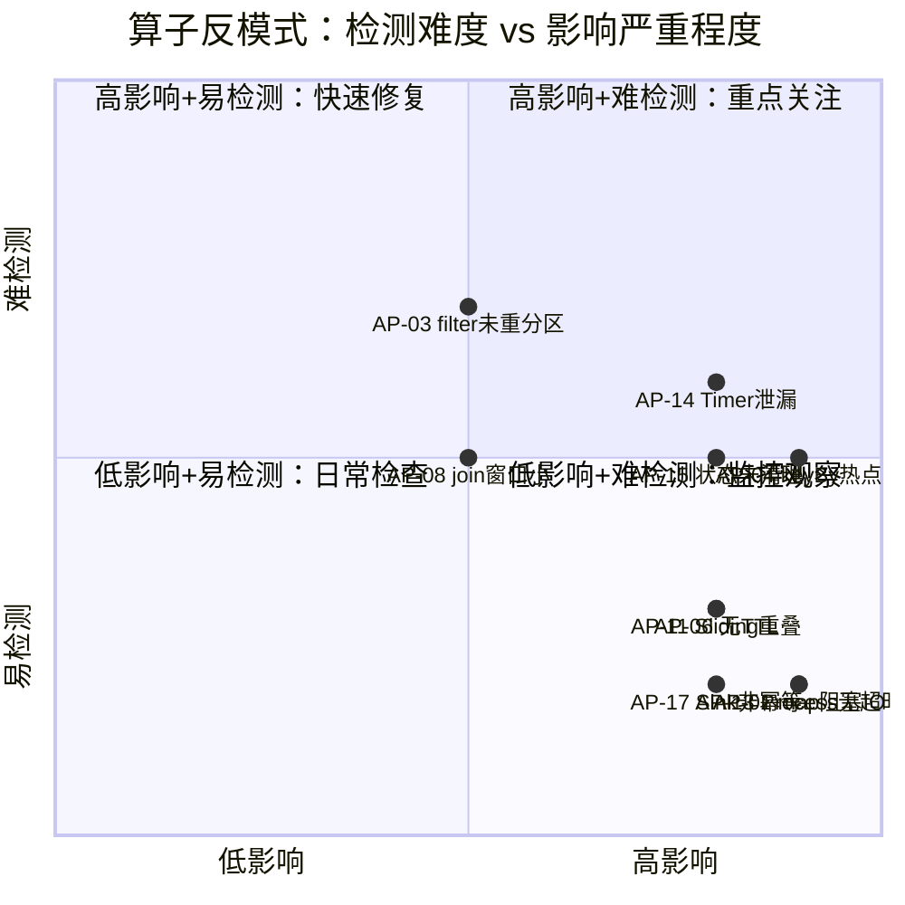
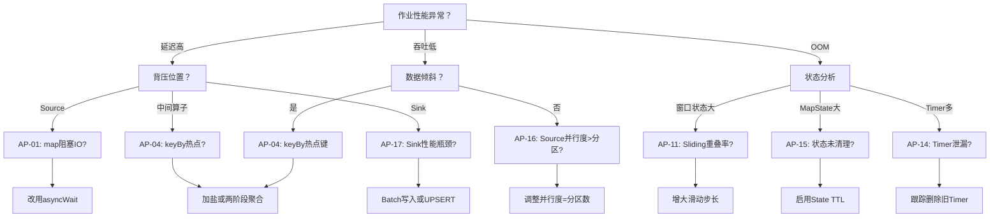

# 算子反模式与常见陷阱

> **所属阶段**: Knowledge/09-anti-patterns | **前置依赖**: [01.06-single-input-operators.md](../01-concept-atlas/operator-deep-dive/01.06-single-input-operators.md), [01.10-process-and-async-operators.md](../01-concept-atlas/operator-deep-dive/01.10-process-and-async-operators.md) | **形式化等级**: L2-L3
> **文档定位**: 流处理算子层面的常见误用模式、陷阱分析与纠正方案
> **版本**: 2026.04

---

## 目录

- [算子反模式与常见陷阱](#算子反模式与常见陷阱)
  - [目录](#目录)
  - [1. 反模式总览](#1-反模式总览)
  - [2. 单输入算子反模式](#2-单输入算子反模式)
    - [AP-01: 在map中做阻塞IO](#ap-01-在map中做阻塞io)
    - [AP-02: flatMap滥用导致状态爆炸](#ap-02-flatmap滥用导致状态爆炸)
    - [AP-03: filter后未重新分区](#ap-03-filter后未重新分区)
  - [3. 分组聚合反模式](#3-分组聚合反模式)
    - [AP-04: keyBy热点键](#ap-04-keyby热点键)
    - [AP-05: reduce输出中间结果导致下游抖动](#ap-05-reduce输出中间结果导致下游抖动)
    - [AP-06: aggregate状态无TTL](#ap-06-aggregate状态无ttl)
  - [4. 多流算子反模式](#4-多流算子反模式)
    - [AP-07: union后未keyBy直接聚合](#ap-07-union后未keyby直接聚合)
    - [AP-08: join窗口过小导致关联率低下](#ap-08-join窗口过小导致关联率低下)
    - [AP-09: connect后未CoProcessFunction处理](#ap-09-connect后未coprocessfunction处理)
  - [5. 窗口算子反模式](#5-窗口算子反模式)
    - [AP-10: Session窗口间隙设置不当](#ap-10-session窗口间隙设置不当)
    - [AP-11: Sliding窗口重叠率过高](#ap-11-sliding窗口重叠率过高)
    - [AP-12: 全局窗口无自定义Trigger](#ap-12-全局窗口无自定义trigger)
  - [6. 过程函数反模式](#6-过程函数反模式)
    - [AP-13: ProcessFunction中访问外部服务无超时](#ap-13-processfunction中访问外部服务无超时)
    - [AP-14: Timer泄漏](#ap-14-timer泄漏)
    - [AP-15: 状态未清理导致OOM](#ap-15-状态未清理导致oom)
  - [7. Source/Sink反模式](#7-sourcesink反模式)
    - [AP-16: Source并行度大于Kafka分区数](#ap-16-source并行度大于kafka分区数)
    - [AP-17: Sink非幂等且无事务](#ap-17-sink非幂等且无事务)
  - [8. 可视化 (Visualizations)](#8-可视化-visualizations)
    - [反模式严重程度矩阵](#反模式严重程度矩阵)
    - [反模式检测决策树](#反模式检测决策树)
  - [9. 引用参考 (References)](#9-引用参考-references)

---

## 1. 反模式总览

| 反模式ID | 名称 | 影响算子 | 严重程度 | 检测难度 |
|---------|------|---------|---------|---------|
| AP-01 | 在map中做阻塞IO | map | 🔴 高 | 低 |
| AP-02 | flatMap滥用 | flatMap | 🟡 中 | 中 |
| AP-03 | filter后未重新分区 | filter + keyBy | 🟡 中 | 高 |
| AP-04 | keyBy热点键 | keyBy | 🔴 高 | 中 |
| AP-05 | reduce输出中间结果 | reduce | 🟡 中 | 低 |
| AP-06 | aggregate状态无TTL | aggregate | 🔴 高 | 低 |
| AP-07 | union后未keyBy | union | 🟡 中 | 中 |
| AP-08 | join窗口过小 | join | 🟡 中 | 中 |
| AP-09 | connect后未CoProcess | connect | 🟡 中 | 低 |
| AP-10 | Session间隙不当 | session window | 🟡 中 | 中 |
| AP-11 | Sliding重叠率过高 | sliding window | 🔴 高 | 低 |
| AP-12 | 全局窗口无Trigger | global window | 🟡 中 | 低 |
| AP-13 | ProcessFunction无超时 | ProcessFunction | 🔴 高 | 低 |
| AP-14 | Timer泄漏 | KeyedProcessFunction | 🔴 高 | 中 |
| AP-15 | 状态未清理 | 所有有状态算子 | 🔴 高 | 中 |
| AP-16 | Source并行度>分区数 | Source | 🟡 中 | 低 |
| AP-17 | Sink非幂等无事务 | Sink | 🔴 高 | 低 |

---

## 2. 单输入算子反模式

### AP-01: 在map中做阻塞IO

**症状**:

```java
stream.map(event -> {
    // ❌ 错误：在map中同步调用外部HTTP服务
    Result result = httpClient.call(event.getId());
    return enrich(event, result);
});
```

**后果**:

- 单个事件阻塞导致整个并行子任务停滞
- 背压传导至Source，吞吐降至接近0
- 检查点超时，作业频繁重启

**根因**: `map` 是同步单线程执行模型，每个元素处理完才能处理下一个。

**纠正方案**:

```java
// ✅ 正确：使用asyncWait
AsyncDataStream.unorderedWait(
    stream,
    new AsyncFunction<Event, EnrichedEvent>() {
        public void asyncInvoke(Event event, ResultFuture<EnrichedEvent> resultFuture) {
            asyncHttpClient.call(event.getId(), result -> {
                resultFuture.complete(Collections.singletonList(enrich(event, result)));
            });
        }
    },
    Time.milliseconds(100),  // timeout
    50  // 并发容量
);
```

**形式化解释**: 设外部服务延迟为 $L$，map的吞吐上限为 $1/L$。asyncWait通过并发将有效吞吐提升至 $C/L$（$C$为并发容量）。

---

### AP-02: flatMap滥用导致状态爆炸

**症状**: 用flatMap生成大量中间事件，但后续聚合未做预聚合。

```java
// ❌ 错误：一条事件生成1000条子事件，直接窗口聚合
stream.flatMap(event -> generateSubEvents(event, 1000))
    .keyBy(sub -> sub.getKey())
    .window(TumblingEventTimeWindows.of(Time.minutes(1)))
    .aggregate(new CountAggregate());
```

**后果**:

- 窗口内事件量膨胀1000倍
- 窗口状态内存占用爆炸
- GC压力导致Full GC停顿

**纠正方案**:

```java
// ✅ 正确：在flatMap后立即做预聚合（map-side aggregation）
stream.flatMap(event -> generateSubEvents(event, 1000))
    .keyBy(sub -> sub.getKey())
    .map(new PreAggregateFunction())  // 预聚合减少下游数据量
    .keyBy(pre -> pre.getKey())
    .window(TumblingEventTimeWindows.of(Time.minutes(1)))
    .aggregate(new FinalAggregate());
```

---

### AP-03: filter后未重新分区

**症状**: filter后数据分布改变，但继续使用旧的keyBy分区。

```java
// ❌ 错误：filter后数据倾斜可能更严重
stream.keyBy(event -> event.getUserId())
    .filter(event -> event.getAmount() > 1000)  // 仅保留大额交易
    .window(TumblingEventTimeWindows.of(Time.minutes(1)))
    .aggregate(new SumAggregate());
```

**后果**:

- filter后某些分区可能完全无数据，其他分区数据密度增加
- 数据倾斜加剧，部分Task成为瓶颈

**纠正方案**:

```java
// ✅ 正确：filter后重新keyBy（如果业务允许）
stream.filter(event -> event.getAmount() > 1000)
    .keyBy(event -> event.getCategory())  // 使用更均匀分布的键
    .window(TumblingEventTimeWindows.of(Time.minutes(1)))
    .aggregate(new SumAggregate());
```

---

## 3. 分组聚合反模式

### AP-04: keyBy热点键

**症状**:

```java
// ❌ 错误：按国家代码keyBy，中国(86)占90%数据
stream.keyBy(phone -> phone.getCountryCode())
```

**后果**:

- 单个Subtask处理90%数据
- 该Task CPU 100%，其他Task空闲
- 背压导致整体延迟飙升

**根因**: key的分布不均匀（Zipf分布常见）。

**纠正方案**:

```java
// ✅ 方案1：加盐（Salting）
stream.map(event -> {
    int salt = ThreadLocalRandom.current().nextInt(10);
    event.setSaltedKey(event.getUserId() + "_" + salt);
    return event;
})
.keyBy(event -> event.getSaltedKey())
.aggregate(new PartialAggregate())
// 下游再按原始key去盐聚合
.keyBy(event -> event.getOriginalKey())
.aggregate(new FinalAggregate());

// ✅ 方案2：两阶段聚合（先本地聚合，再全局聚合）
stream.keyBy(event -> event.getUserId())
    .map(new LocalSum())  // 本地预聚合
    .keyBy(event -> event.getUserId())
    .window(...)
    .aggregate(new GlobalSum());
```

---

### AP-05: reduce输出中间结果导致下游抖动

**症状**:

```java
// ❌ 错误：reduce每次滚动聚合都输出
stream.keyBy(Event::getKey)
    .reduce((a, b) -> new Event(a.getValue() + b.getValue()))
    .addSink(new PrintSink());
// 输出: 1, 3, 6, 10, 15... 每个事件都触发一次输出
```

**后果**:

- 下游接收大量冗余中间结果
- Sink吞吐被压垮
- 结果不可读

**纠正方案**:

```java
// ✅ 正确：reduce只在窗口结束时输出
stream.keyBy(Event::getKey)
    .window(TumblingEventTimeWindows.of(Time.minutes(1)))
    .reduce((a, b) -> new Event(a.getValue() + b.getValue()))
    .addSink(new PrintSink());
// 输出: 窗口结束时的一次最终结果
```

---

### AP-06: aggregate状态无TTL

**症状**:

```java
// ❌ 错误：聚合状态永不过期
stream.keyBy(Order::getUserId)
    .window(EventTimeSessionWindows.withGap(Time.minutes(30)))
    .aggregate(new UserStatsAggregate());
```

**后果**:

- 用户ID不断增长（特别是新用户注册）
- 状态 backend 存储线性增长
- 最终OOM或磁盘满

**纠正方案**:

```java
// ✅ 正确：设置State TTL
StateTtlConfig ttlConfig = StateTtlConfig
    .newBuilder(Time.hours(24))
    .setUpdateType(StateTtlConfig.UpdateType.OnCreateAndWrite)
    .setStateVisibility(StateTtlConfig.StateVisibility.NeverReturnExpired)
    .build();

// 在AggregateFunction的open方法中配置
@Override
public void open(Configuration parameters) {
    ValueStateDescriptor<Accumulator> descriptor =
        new ValueStateDescriptor<>("stats", Accumulator.class);
    descriptor.enableTimeToLive(ttlConfig);
    state = getRuntimeContext().getState(descriptor);
}
```

---

## 4. 多流算子反模式

### AP-07: union后未keyBy直接聚合

**症状**:

```java
// ❌ 错误：union后直接windowAll
DataStream<Event> merged = stream1.union(stream2);
merged.windowAll(TumblingEventTimeWindows.of(Time.minutes(1)))
    .aggregate(new SumAggregate());
```

**后果**:

- windowAll单并行度处理，无法扩展
- 吞吐上限为单核能力

**纠正方案**:

```java
// ✅ 正确：union后先keyBy再window
DataStream<Event> merged = stream1.union(stream2);
merged.keyBy(Event::getCategory)
    .window(TumblingEventTimeWindows.of(Time.minutes(1)))
    .aggregate(new SumAggregate());
```

---

### AP-08: join窗口过小导致关联率低下

**症状**:

```java
// ❌ 错误：订单流和支付流关联，窗口仅5秒
stream1.join(stream2)
    .where(Order::getId)
    .equalTo(Payment::getOrderId)
    .window(TumblingEventTimeWindows.of(Time.seconds(5)))
    .apply(new JoinFunction());
```

**后果**:

- 支付通常延迟订单数秒到数分钟
- 5秒窗口内关联率<10%
- 90%数据被丢弃或进入side output

**纠正方案**:

```java
// ✅ 正确：使用intervalJoin或更大的窗口
stream1.keyBy(Order::getId)
    .intervalJoin(stream2.keyBy(Payment::getOrderId))
    .between(Time.seconds(-5), Time.minutes(5))  // 订单后5秒到5分钟内
    .process(new OrderPaymentJoin());
```

---

### AP-09: connect后未CoProcessFunction处理

**症状**:

```java
// ❌ 错误：connect后直接map
ConnectedStreams<A, B> connected = streamA.connect(streamB);
connected.map(
    a -> processA(a),
    b -> processB(b)
);
```

**后果**:

- 两个流独立处理，无法实现关联逻辑
- connect的优势（共享状态和定时器）被浪费

**纠正方案**:

```java
// ✅ 正确：使用CoProcessFunction
connected.process(new CoProcessFunction<A, B, Result>() {
    private ValueState<A> aState;
    private ValueState<B> bState;

    @Override
    public void processElement1(A a, Context ctx, Collector<Result> out) {
        B b = bState.value();
        if (b != null) {
            out.collect(new Result(a, b));
            bState.clear();
        } else {
            aState.update(a);
            ctx.timerService().registerEventTimeTimer(ctx.timestamp() + 60000);
        }
    }

    @Override
    public void onTimer(long timestamp, OnTimerContext ctx, Collector<Result> out) {
        if (aState.value() != null) aState.clear();
        if (bState.value() != null) bState.clear();
    }
});
```

---

## 5. 窗口算子反模式

### AP-10: Session窗口间隙设置不当

**症状**: Session间隙设置过大或过小。

```java
// ❌ 错误：用户行为Session，间隙设10秒（过小）
stream.keyBy(Event::getUserId)
    .window(EventTimeSessionWindows.withGap(Time.seconds(10)))
    .aggregate(new UserSessionStats());
// 用户阅读一篇文章超过10秒就被切成多个Session
```

**后果**:

- 间隙过小：一个用户Session被拆成多个，统计失真
- 间隙过大：不同用户Session合并，内存占用激增

**纠正方案**:

```java
// ✅ 正确：基于业务场景分析设置间隙
// 电商浏览：30分钟合理
stream.keyBy(Event::getUserId)
    .window(EventTimeSessionWindows.withGap(Time.minutes(30)))
    .aggregate(new UserSessionStats());
```

---

### AP-11: Sliding窗口重叠率过高

**症状**:

```java
// ❌ 错误：1小时窗口，1分钟滑动步长 → 60倍状态冗余
stream.keyBy(Event::getKey)
    .window(SlidingEventTimeWindows.of(Time.hours(1), Time.minutes(1)))
    .aggregate(new CountAggregate());
```

**后果**:

- 每个事件属于60个窗口
- 状态量膨胀60倍
- 单并行度GB级状态，RocksDB频繁compaction

**纠正方案**:

```java
// ✅ 正确：增大滑动步长，或改用增量聚合
stream.keyBy(Event::getKey)
    .window(SlidingEventTimeWindows.of(Time.hours(1), Time.minutes(15)))
    .aggregate(new IncrementalCountAggregate());
```

---

### AP-12: 全局窗口无自定义Trigger

**症状**:

```java
// ❌ 错误：GlobalWindow + 默认Trigger（永不过期）
stream.keyBy(Event::getKey)
    .window(GlobalWindows.create())
    .aggregate(new SumAggregate());
```

**后果**:

- 全局窗口默认Trigger是NeverTrigger
- 窗口永不过期，状态无限增长
- 结果永远不输出

**纠正方案**:

```java
// ✅ 正确：自定义Trigger
stream.keyBy(Event::getKey)
    .window(GlobalWindows.create())
    .trigger(CountTrigger.of(1000))  // 每1000条触发
    .evictor(CountEvictor.of(100))   // 只保留最近100条
    .aggregate(new SumAggregate());
```

---

## 6. 过程函数反模式

### AP-13: ProcessFunction中访问外部服务无超时

**症状**:

```java
// ❌ 错误：同步调用外部服务，无超时设置
public void processElement(Event event, Context ctx, Collector<Result> out) {
    Result result = externalService.call(event);  // 可能永久阻塞
    out.collect(result);
}
```

**后果**:

- 外部服务故障时processElement永久阻塞
- 检查点无法完成（barrier无法通过）
- 作业崩溃

**纠正方案**:

```java
// ✅ 正确：使用异步调用或Future.get(timeout)
public void processElement(Event event, Context ctx, Collector<Result> out) {
    Future<Result> future = asyncExternalService.call(event);
    try {
        Result result = future.get(100, TimeUnit.MILLISECONDS);
        out.collect(result);
    } catch (TimeoutException e) {
        ctx.output(timeoutTag, event);  // 发送到side output
    }
}
```

---

### AP-14: Timer泄漏

**症状**:

```java
// ❌ 错误：注册Timer但不删除旧Timer
public void processElement(Event event, Context ctx, Collector<Result> out) {
    ctx.timerService().registerEventTimeTimer(event.getTimestamp() + 60000);
    // 每条事件都注册一个Timer，旧Timer从不删除
}
```

**后果**:

- Timer队列无限增长
- Checkpoint时Timer状态爆炸
- 恢复时大量Timer同时触发（Timer Storm）

**纠正方案**:

```java
// ✅ 正确：跟踪并删除旧Timer
private ValueState<Long> timerState;

public void processElement(Event event, Context ctx, Collector<Result> out) {
    Long oldTimer = timerState.value();
    if (oldTimer != null) {
        ctx.timerService().deleteEventTimeTimer(oldTimer);
    }
    long newTimer = event.getTimestamp() + 60000;
    ctx.timerService().registerEventTimeTimer(newTimer);
    timerState.update(newTimer);
}

public void onTimer(long timestamp, OnTimerContext ctx, Collector<Result> out) {
    timerState.clear();
    // 处理Timer逻辑
}
```

---

### AP-15: 状态未清理导致OOM

**症状**: 使用MapState/ListState但不清理过期数据。

```java
// ❌ 错误：MapState只增不减
private MapState<String, Event> eventMap;

public void processElement(Event event, Context ctx, Collector<Result> out) {
    eventMap.put(event.getId(), event);  // 只put不remove
}
```

**后果**:

- MapState线性增长
- eventually OOM

**纠正方案**:

```java
// ✅ 方案1：State TTL
StateTtlConfig ttl = StateTtlConfig.newBuilder(Time.hours(1)).build();
mapStateDescriptor.enableTimeToLive(ttl);

// ✅ 方案2：定时清理
public void onTimer(long timestamp, OnTimerContext ctx, Collector<Result> out) {
    Iterator<Map.Entry<String, Event>> iter = eventMap.iterator();
    while (iter.hasNext()) {
        Map.Entry<String, Event> entry = iter.next();
        if (entry.getValue().getTimestamp() < timestamp - 3600000) {
            iter.remove();
        }
    }
    // 注册下一个清理Timer
    ctx.timerService().registerEventTimeTimer(timestamp + 60000);
}
```

---

## 7. Source/Sink反模式

### AP-16: Source并行度大于Kafka分区数

**症状**:

```java
// ❌ 错误：Kafka topic只有4个分区，但Source并行度设为8
KafkaSource<String> source = KafkaSource.builder()...build();
env.fromSource(source, ...).setParallelism(8);
```

**后果**:

- 4个Subtask实际消费数据，4个Subtask空闲
- 资源浪费，但吞吐不增加

**纠正方案**:

```java
// ✅ 正确：Source并行度 ≤ Kafka分区数
int kafkaPartitions = 4;
env.fromSource(source, ...).setParallelism(kafkaPartitions);
// 或设置与分区数一致
```

---

### AP-17: Sink非幂等且无事务

**症状**:

```java
// ❌ 错误：JDBC Sink纯INSERT，无幂等保证
JdbcSink.sink(
    "INSERT INTO results (id, value) VALUES (?, ?)",
    (ps, event) -> { ps.setString(1, event.getId()); ps.setLong(2, event.getValue()); },
    ...
);
```

**后果**:

- 故障恢复后数据重复插入
- 主键冲突导致作业失败

**纠正方案**:

```java
// ✅ 正确：UPSERT或两阶段提交
JdbcSink.sink(
    "INSERT INTO results (id, value) VALUES (?, ?) " +
    "ON CONFLICT (id) DO UPDATE SET value = EXCLUDED.value",  // PostgreSQL
    (ps, event) -> { ps.setString(1, event.getId()); ps.setLong(2, event.getValue()); },
    ...
);
```

---

## 8. 可视化 (Visualizations)

### 反模式严重程度矩阵



### 反模式检测决策树



---

## 9. 引用参考 (References)


---

*关联文档*: [01.06-single-input-operators.md](../01-concept-atlas/operator-deep-dive/01.06-single-input-operators.md) | [01.10-process-and-async-operators.md](../01-concept-atlas/operator-deep-dive/01.10-process-and-async-operators.md) | [streaming-operator-selection-decision-tree.md](../04-technology-selection/operator-decision-tools/streaming-operator-selection-decision-tree.md)
