# 流处理反模式专题 (Streaming Anti-patterns)

> **所属阶段**: Knowledge/09-anti-patterns | **前置依赖**: [02-design-patterns](../02-design-patterns/README.md) | **形式化等级**: L3-L5
>
> 本文档系统梳理流处理系统中最常见的10大反模式，每个反模式包含问题描述、错误示例、负面影响、解决方案及关联设计模式，帮助工程师识别并避免生产环境中的典型陷阱。

---

## 目录

- [流处理反模式专题 (Streaming Anti-patterns) {#流处理反模式专题-streaming-anti-patterns}](#流处理反模式专题-streaming-anti-patterns)
  - [目录 {#目录}](#目录)
  - [反模式速查表 {#反模式速查表}](#反模式速查表)
  - [AP-01: 过度依赖处理时间而非事件时间 {#ap-01-过度依赖处理时间而非事件时间}](#ap-01-过度依赖处理时间而非事件时间)
    - [问题描述 {#问题描述}](#问题描述)
    - [错误示例 {#错误示例}](#错误示例)
    - [负面影响 {#负面影响}](#负面影响)
    - [解决方案 {#解决方案}](#解决方案)
    - [关联设计模式 {#关联设计模式}](#关联设计模式)
  - [AP-02: 忽略背压信号 {#ap-02-忽略背压信号}](#ap-02-忽略背压信号)
    - [问题描述 {#问题描述-1}](#问题描述-1)
    - [错误示例 {#错误示例-1}](#错误示例-1)
    - [负面影响 {#负面影响-1}](#负面影响-1)
    - [解决方案 {#解决方案-1}](#解决方案-1)
    - [关联设计模式 {#关联设计模式-1}](#关联设计模式-1)
  - [AP-03: 状态无限增长无TTL {#ap-03-状态无限增长无ttl}](#ap-03-状态无限增长无ttl)
    - [问题描述 {#问题描述-2}](#问题描述-2)
    - [错误示例 {#错误示例-2}](#错误示例-2)
    - [负面影响 {#负面影响-2}](#负面影响-2)
    - [解决方案 {#解决方案-2}](#解决方案-2)
    - [关联设计模式 {#关联设计模式-2}](#关联设计模式-2)
  - [AP-04: 错误的Checkpoint配置 {#ap-04-错误的checkpoint配置}](#ap-04-错误的checkpoint配置)
    - [问题描述 {#问题描述-3}](#问题描述-3)
    - [负面影响 {#负面影响-3}](#负面影响-3)
    - [解决方案 {#解决方案-3}](#解决方案-3)
    - [关联设计模式 {#关联设计模式-3}](#关联设计模式-3)
  - [AP-05: 数据倾斜未处理 {#ap-05-数据倾斜未处理}](#ap-05-数据倾斜未处理)
    - [问题描述 {#问题描述-4}](#问题描述-4)
    - [错误示例 {#错误示例-3}](#错误示例-3)
    - [负面影响 {#负面影响-4}](#负面影响-4)
    - [解决方案 {#解决方案-4}](#解决方案-4)
    - [关联设计模式 {#关联设计模式-4}](#关联设计模式-4)
  - [AP-06: 滥用全局窗口 {#ap-06-滥用全局窗口}](#ap-06-滥用全局窗口)
    - [问题描述 {#问题描述-5}](#问题描述-5)
    - [负面影响 {#负面影响-5}](#负面影响-5)
    - [解决方案 {#解决方案-5}](#解决方案-5)
    - [关联设计模式 {#关联设计模式-5}](#关联设计模式-5)
  - [AP-07: 忽略迟到数据 {#ap-07-忽略迟到数据}](#ap-07-忽略迟到数据)
    - [问题描述 {#问题描述-6}](#问题描述-6)
    - [错误示例 {#错误示例-4}](#错误示例-4)
    - [负面影响 {#负面影响-6}](#负面影响-6)
    - [解决方案 {#解决方案-6}](#解决方案-6)
    - [关联设计模式 {#关联设计模式-6}](#关联设计模式-6)
  - [AP-08: 不恰当的并行度设置 {#ap-08-不恰当的并行度设置}](#ap-08-不恰当的并行度设置)
    - [问题描述 {#问题描述-7}](#问题描述-7)
    - [负面影响 {#负面影响-7}](#负面影响-7)
    - [解决方案 {#解决方案-7}](#解决方案-7)
    - [关联设计模式 {#关联设计模式-7}](#关联设计模式-7)
  - [AP-09: 缺乏幂等性考虑 {#ap-09-缺乏幂等性考虑}](#ap-09-缺乏幂等性考虑)
    - [问题描述 {#问题描述-8}](#问题描述-8)
    - [错误示例 {#错误示例-5}](#错误示例-5)
    - [负面影响 {#负面影响-8}](#负面影响-8)
    - [解决方案 {#解决方案-8}](#解决方案-8)
    - [关联设计模式 {#关联设计模式-8}](#关联设计模式-8)
  - [AP-10: 监控和可观测性不足 {#ap-10-监控和可观测性不足}](#ap-10-监控和可观测性不足)
    - [问题描述 {#问题描述-9}](#问题描述-9)
    - [负面影响 {#负面影响-9}](#负面影响-9)
    - [解决方案 {#解决方案-9}](#解决方案-9)
    - [关联设计模式 {#关联设计模式-9}](#关联设计模式-9)
  - [关联设计模式索引 {#关联设计模式索引}](#关联设计模式索引)
  - [引用参考 (References) {#引用参考-references}](#引用参考-references)

---

## 反模式速查表

```
┌─────────────────────────────────────────────────────────────────────────┐
│                      流处理十大反模式严重程度矩阵                        │
├─────────────────────────────────────────────────────────────────────────┤
│                                                                         │
│  P0 - 灾难性 ▲                                                          │
│            /██\    AP-02 忽略背压信号, AP-10 监控不足                   │
│           /████\                                                        │
│          ▔▔▔▔▔▔▔                                                       │
│                                                                         │
│  P1 - 高危   ▲                                                          │
│            /██\    AP-03 状态无TTL, AP-05 数据倾斜                      │
│           /████\   AP-06 全局窗口滥用, AP-07 忽略迟到数据               │
│          /██████\  AP-04 错误Checkpoint配置                             │
│         ▔▔▔▔▔▔▔▔▔                                                      │
│                                                                         │
│  P2 - 中等   ▲                                                          │
│            /██\    AP-01 过度依赖处理时间, AP-08 并行度不当             │
│           /████\   AP-09 缺乏幂等性                                    │
│          ▔▔▔▔▔▔▔                                                       │
│                                                                         │
└─────────────────────────────────────────────────────────────────────────┘
```

| 编号 | 反模式名称 | 严重程度 | 检测难度 | 核心问题 |
|------|------------|----------|----------|----------|
| AP-01 | 过度依赖处理时间 | P2 | 中 | 结果不确定，不可复现 |
| AP-02 | 忽略背压信号 | P0 | 极难 | 级联故障，系统崩溃 |
| AP-03 | 状态无限增长无TTL | P1 | 难 | OOM，状态膨胀 |
| AP-04 | 错误的Checkpoint配置 | P1 | 中 | 恢复失败，数据丢失 |
| AP-05 | 数据倾斜未处理 | P1 | 难 | 热点问题，性能退化 |
| AP-06 | 滥用全局窗口 | P1 | 中 | 状态爆炸，延迟不可控 |
| AP-07 | 忽略迟到数据 | P1 | 难 | 数据丢失，结果不完整 |
| AP-08 | 不恰当的并行度设置 | P2 | 中 | 资源浪费或不足 |
| AP-09 | 缺乏幂等性考虑 | P2 | 难 | 重复处理，结果错误 |
| AP-10 | 监控和可观测性不足 | P0 | 易 | 故障发现延迟，定位困难 |

---

## AP-01: 过度依赖处理时间而非事件时间

> **反模式编号**: AP-01 | **所属分类**: 时间语义类 | **严重程度**: P2 | **检测难度**: 中
>
> 在需要结果确定性和可复现性的场景中使用 Processing Time，导致窗口计算结果随执行时机变化。

### 问题描述

**定义 (Def-K-09-AP01)**:

> 过度依赖处理时间是指在业务逻辑需要结果确定性的场景中，使用算子本地系统时间（Processing Time）作为窗口触发和聚合的时间基准，而非数据携带的事件时间（Event Time）。

**形式化描述** [^1]：

设记录 $r$ 的事件时间为 $t_e(r)$，处理时间为 $t_p(r)$，窗口函数为 $W(t, \Delta)$。使用 Processing Time 时：

$$
\text{Output}(W) = f(\{ r \mid t_p(r) \in W \}) \neq f(\{ r \mid t_e(r) \in W \})
$$

即同一批数据在不同时间运行可能产生不同结果。

### 错误示例

```scala
// ❌ 错误: 使用 Processing Time 进行窗口聚合
val env = StreamExecutionEnvironment.getExecutionEnvironment

// 默认使用 Processing Time(Flink 1.12 之前)
env.setStreamTimeCharacteristic(TimeCharacteristic.ProcessingTime)  // 危险！

val result = stream
  .keyBy(_.userId)
  .window(TumblingProcessingTimeWindows.of(Time.minutes(5)))  // ❌ 处理时间窗口
  .aggregate(new CountAggregate())

// 问题:
// 1. 作业重启后,相同数据产生不同窗口结果
// 2. 网络延迟导致数据归属错误窗口
// 3. 无法处理乱序数据
```

**业务场景错误** [^2]：

```scala
// ❌ 错误: 实时交易统计使用 Processing Time
class TransactionStatsJob {
  def run(): Unit = {
    transactions
      .keyBy(_.merchantId)
      .window(TumblingProcessingTimeWindows.of(Time.hours(1)))  // ❌ 严重错误
      .aggregate(new SumAggregate())
      .addSink(new DatabaseSink())
  }
}

// 故障场景:
// - 交易发生在 10:59:59 (事件时间)
// - 网络延迟导致 11:00:01 到达 (处理时间)
// - 结果被归入 11:00-12:00 窗口,而非正确的 10:00-11:00 窗口
// - 财务对账时出现金额不符
```

### 负面影响

| 影响维度 | 具体表现 | 业务后果 |
|----------|----------|----------|
| **结果不确定性** | 相同输入多次运行结果不同 | 无法复现问题，调试困难 |
| **窗口归属错误** | 迟到数据被归入错误窗口 | 统计数据不准确 |
| **乱序敏感** | 无法处理乱序到达的数据 | 数据丢失或重复计算 |
| **对账困难** | 不同系统统计结果不一致 | 财务风险 |

### 解决方案

**正确实践：使用 Event Time** [^3][^4]：

```scala
// ✅ 正确: 使用 Event Time 进行窗口聚合
val env = StreamExecutionEnvironment.getExecutionEnvironment

// 明确使用 Event Time
env.setStreamTimeCharacteristic(TimeCharacteristic.EventTime)

val result = stream
  .assignTimestampsAndWatermarks(
    WatermarkStrategy
      .forBoundedOutOfOrderness[Transaction](Duration.ofSeconds(30))
      .withTimestampAssigner((txn, _) => txn.timestamp)  // 提取事件时间
  )
  .keyBy(_.merchantId)
  .window(TumblingEventTimeWindows.of(Time.hours(1)))  // ✅ 事件时间窗口
  .allowedLateness(Time.minutes(10))  // 允许迟到数据
  .sideOutputLateData(lateDataTag)    // 侧输出完全迟到的数据
  .aggregate(new SumAggregate())
```

**决策矩阵** [^2]：

| 场景 | 推荐时间语义 | 理由 |
|------|-------------|------|
| 金融交易统计 | Event Time | 资金计算必须精确 |
| 用户行为分析 | Event Time | 需要准确的会话归属 |
| 实时监控告警 | Processing Time | 延迟优先，近似即可 |
| 日志聚合分析 | Ingestion Time | 简化配置，可容忍小误差 |

### 关联设计模式

| 设计模式 | 关系 | 说明 |
|----------|------|------|
| [Pattern 01: 事件时间处理](../02-design-patterns/pattern-event-time-processing.md) | 正确实践 | 提供 Watermark 和迟到数据处理的完整方案 |
| [Pattern 02: 窗口聚合](../02-design-patterns/pattern-windowed-aggregation.md) | 依赖 | 窗口聚合应基于 Event Time 实现 |

---

## AP-02: 忽略背压信号

> **反模式编号**: AP-02 | **所属分类**: 资源管理类 | **严重程度**: P0 | **检测难度**: 极难
>
> 无视 Flink 的背压信号，持续增加输入速率或拒绝扩容，导致系统级联故障、数据丢失或服务不可用。

### 问题描述 {#问题描述-1}

**定义 (Def-K-09-AP02)**:

> 忽略背压信号是指在 Flink 作业出现背压时，不采取任何缓解措施（扩容、优化、限流），反而继续增加输入负载或拒绝资源调整，导致系统从局部过载演变为全局故障。

**背压传播机制** [^5]：

```
下游慢 ──► 缓冲区满 ──► 暂停读取 ──► 上游缓冲区满 ──► 逐级传播
     │                                                    │
     └── 背压信号 ◄───────────────────────────────────────┘
```

### 错误示例 {#错误示例-1}

```scala
// ❌ 错误: 无视背压继续增加负载
class DataProducer {
  def produce(): Unit = {
    while (true) {
      kafkaProducer.send(new ProducerRecord("input-topic", event))
      // 不检查 Flink 消费速度,持续全速生产
    }
  }
}

// ❌ 错误: 生产环境配置
val kafkaSource = KafkaSource.builder()
  .setProperty("max.poll.records", "10000")  // 过大,超出处理能力
  .setProperty("fetch.min.bytes", "1")       // 不等待,立即返回
  .build()
```

### 负面影响 {#负面影响-1}

**级联故障链** [^5][^6]：

```
[Sink 慢] ──► [Window 阻塞] ──► [Map 阻塞] ──► [Source 阻塞]
     │                                               │
     ▼                                               ▼
 缓冲区满                                       Kafka Lag 增长
     │                                               │
     ▼                                               ▼
 Checkpoint 超时                              数据过期丢失
     │                                               │
     ▼                                               ▼
 作业重启                                        业务中断
```

| 影响 | 描述 |
|------|------|
| Checkpoint 超时 | 屏障无法通过阻塞算子，状态无法持久化 |
| OOM | 缓冲区占满堆内存，触发 Full GC 或崩溃 |
| 数据丢失 | Kafka 数据因消费滞后超过 retention 而丢失 |
| 业务中断 | 实时流变为"小时级延迟"，失去实时性 |

### 解决方案 {#解决方案-1}

**1. 监控背压指标** [^5]：

```scala
// 关键背压指标监控
// - backPressuredTimeMsPerSecond: 每秒背压时间
// - outputQueueLength: 输出队列长度
// - numRecordsInPerSecond: 输入速率
```

**2. 自动扩缩容** [^6]：

```yaml
# Flink Kubernetes Operator 自动伸缩配置
spec:
  autoScaler:
    enabled: true
    targetUtilization: 0.7
    scaleUpDelay: 5m
    scaleDownDelay: 10m
```

**3. Source 限流** [^5]：

```scala
// ✅ 正确: 根据处理能力动态调整
val kafkaSource = KafkaSource.builder()
  .setProperty("max.poll.records", "500")    // 限制单次拉取量
  .setProperty("fetch.max.wait.ms", "500")   // 增加等待时间
  .build()
```

### 关联设计模式 {#关联设计模式-1}

| 设计模式 | 关系 | 说明 |
|----------|------|------|
| [Pattern 07: Checkpoint 与故障恢复](../02-design-patterns/pattern-checkpoint-recovery.md) | 依赖 | 背压会导致 Checkpoint 超时 |

---

## AP-03: 状态无限增长无TTL

> **反模式编号**: AP-03 | **所属分类**: 状态管理类 | **严重程度**: P1 | **检测难度**: 难
>
> 为有状态算子配置无限状态生命周期，导致状态持续膨胀，最终引发 OOM 或 Checkpoint 失败。

### 问题描述 {#问题描述-2}

**定义 (Def-K-09-AP03)**:

> 状态无限增长无TTL是指在状态计算中不为状态设置生存时间（Time-To-Live），导致无效状态累积，存储成本持续增长，最终影响作业稳定性。

**形式化描述** [^7]：

设状态集合为 $S$，状态创建时间为 $t_c(s)$，当前时间为 $t$，TTL 为 $\tau$。无 TTL 时：

$$
|S| = \sum_{i=1}^{n} \mathbb{1}(t_c(s_i) \leq t) \to \infty \quad \text{as } t \to \infty
$$

### 错误示例 {#错误示例-2}

```scala
// ❌ 错误: 状态未配置 TTL
class UserSessionFunction extends KeyedProcessFunction[String, Event, Session] {
  private var sessionState: ValueState[SessionInfo] = _

  override def open(parameters: Configuration): Unit = {
    val descriptor = new ValueStateDescriptor[SessionInfo](
      "session",
      classOf[SessionInfo]
    )
    // ❌ 未配置 TTL,状态永久保留
    sessionState = getRuntimeContext.getState(descriptor)
  }

  override def processElement(
    event: Event,
    ctx: Context,
    out: Collector[Session]
  ): Unit = {
    val session = sessionState.value() match {
      case null => SessionInfo(event.userId, event.timestamp)
      case s => s.copy(lastActivity = event.timestamp)
    }
    sessionState.update(session)  // 状态只增不减！
  }
}

// 后果:
// - 用户量增长 → 状态线性增长
// - 沉默用户的状态永久占用存储
// - 最终 OOM 或 Checkpoint 超时
```

### 负面影响 {#负面影响-2}

| 阶段 | 状态大小 | 表现 |
|------|----------|------|
| 初期 | < 100MB | 正常运行 |
| 中期 | 1-10GB | Checkpoint 时间增长，GC 频繁 |
| 后期 | > 50GB | Checkpoint 超时，OOM，作业崩溃 |

### 解决方案 {#解决方案-2}

**正确实践：配置 State TTL** [^7][^8]：

```scala
// ✅ 正确: 为状态配置 TTL
class CorrectUserSessionFunction extends KeyedProcessFunction[String, Event, Session] {
  private var sessionState: ValueState[SessionInfo] = _

  override def open(parameters: Configuration): Unit = {
    // 配置 TTL: 30分钟无活动则清理
    val ttlConfig = StateTtlConfig
      .newBuilder(Time.minutes(30))
      .setUpdateType(OnCreateAndWrite)     // 每次写入更新过期时间
      .setStateVisibility(NeverReturnExpired)  // 不返回过期状态
      .cleanupFullSnapshot()               // Checkpoint 时清理
      .build()

    val descriptor = new ValueStateDescriptor[SessionInfo](
      "session",
      classOf[SessionInfo]
    )
    descriptor.enableTimeToLive(ttlConfig)  // ✅ 启用 TTL
    sessionState = getRuntimeContext.getState(descriptor)
  }
  // ...
}
```

**TTL 配置策略** [^8]：

| 状态类型 | 推荐 TTL | 清理策略 |
|----------|----------|----------|
| 用户会话 | 30分钟无活动 | OnCreateAndWrite |
| 去重状态 | 24小时 | OnCreateAndWrite |
| 临时计算 | 1小时 | OnReadAndWrite |
| 聚合缓存 | 窗口大小 + 宽限期 | OnCreateAndWrite |

### 关联设计模式 {#关联设计模式-2}

| 设计模式 | 关系 | 说明 |
|----------|------|------|
| [Pattern 05: 有状态计算](../02-design-patterns/pattern-stateful-computation.md) | 正确实践 | 提供状态管理和 TTL 配置指南 |

---

## AP-04: 错误的Checkpoint配置

> **反模式编号**: AP-04 | **所属分类**: 容错配置类 | **严重程度**: P1 | **检测难度**: 中
>
> Checkpoint 间隔、超时或存储配置不合理，导致恢复时间超出 SLA 或 Checkpoint 频繁失败。

### 问题描述 {#问题描述-3}

**定义 (Def-K-09-AP04)**:

> 错误的Checkpoint配置是指 Checkpoint 参数（间隔、超时、存储）与业务恢复 SLA、数据量和系统资源不匹配，导致要么恢复时间超出容忍度，要么 Checkpoint 本身成为系统瓶颈。

**常见错误配置** [^9]：

```scala
// ❌ 错误: Checkpoint 间隔过短
env.enableCheckpointing(1000)  // 1秒一次,过于频繁

// ❌ 错误: 超时时间过短
env.getCheckpointConfig.setCheckpointTimeout(60000)  // 1分钟,大状态可能不够

// ❌ 错误: 未启用增量 Checkpoint
env.setStateBackend(new EmbeddedRocksDBStateBackend(false))  // false=全量

// ❌ 错误: Checkpoint 存储与作业同机
env.getCheckpointConfig.setCheckpointStorage("file:///local/checkpoints")  // 危险！
```

### 负面影响 {#负面影响-3}

| 错误配置 | 后果 |
|----------|------|
| 间隔过短 | CPU/IO 开销过大，影响正常处理 |
| 间隔过长 | 故障恢复时需重放大量数据 |
| 超时过短 | 大状态作业 Checkpoint 频繁失败 |
| 非增量 | 全量上传，网络带宽占满 |
| 本地存储 | 节点故障时 Checkpoint 丢失 |

### 解决方案 {#解决方案-3}

**正确配置示例** [^9][^10]：

```scala
// ✅ 正确: 合理的 Checkpoint 配置
val env = StreamExecutionEnvironment.getExecutionEnvironment

// 1. 根据恢复 SLA 设置间隔
// 如果需要 5分钟内恢复,Checkpoint 间隔应 <= 2-3分钟
env.enableCheckpointing(120000)  // 2分钟

// 2. 充足的超时时间
env.getCheckpointConfig.setCheckpointTimeout(600000)  // 10分钟

// 3. 使用 RocksDB 增量 Checkpoint
env.setStateBackend(new EmbeddedRocksDBStateBackend(true))  // true=增量

// 4. 独立的分布式存储
env.getCheckpointConfig.setCheckpointStorage("hdfs:///flink-checkpoints")

// 5. 并发 Checkpoint 数限制
env.getCheckpointConfig.setMaxConcurrentCheckpoints(1)

// 6. 两次 Checkpoint 最小间隔
env.getCheckpointConfig.setMinPauseBetweenCheckpoints(60000)  // 1分钟

// 7. 外部化 Checkpoint(作业取消后保留)
env.getCheckpointConfig.enableExternalizedCheckpoints(
  ExternalizedCheckpointCleanup.RETAIN_ON_CANCELLATION
)
```

**配置决策矩阵** [^9]：

| 场景 | 推荐间隔 | 推荐超时 | 增量 |
|------|----------|----------|------|
| 小状态 (<100MB) | 30s-1min | 2min | 可选 |
| 中状态 (100MB-10GB) | 1-2min | 5min | 建议 |
| 大状态 (>10GB) | 3-5min | 10min+ | 必须 |
| 金融交易 | 10-30s | 1min | 建议 |
| 日志分析 | 5-10min | 10min | 可选 |

### 关联设计模式 {#关联设计模式-3}

| 设计模式 | 关系 | 说明 |
|----------|------|------|
| [Pattern 07: Checkpoint 与故障恢复](../02-design-patterns/pattern-checkpoint-recovery.md) | 正确实践 | 提供完整的 Checkpoint 配置指南 |

---

## AP-05: 数据倾斜未处理

> **反模式编号**: AP-05 | **所属分类**: 数据分布类 | **严重程度**: P1 | **检测难度**: 难
>
> 某些 Key 的数据量远超其他 Key，导致部分 Task 负载过高，成为系统瓶颈。

### 问题描述 {#问题描述-4}

**定义 (Def-K-09-AP05)**:

> 数据倾斜是指 Keyed Stream 中某些 Key 的数据量分布极不均匀，导致特定 Task 实例处理负载远高于其他实例，形成性能瓶颈。

**形式化描述** [^11]：

设 Key 空间为 $K$，数据分布为 $D: K \to \mathbb{N}$，并行度为 $P$。理想情况下每个 subtask 处理量应为：

$$
L_{ideal} = \frac{\sum_{k \in K} D(k)}{P}
$$

数据倾斜时存在某个 subtask $i$：

$$
L_i \gg L_{ideal} \quad \text{且} \quad L_i / L_{min} > 10
$$

### 错误示例 {#错误示例-3}

```scala
// ❌ 错误: 直接按热点 Key 分区
val result = transactions
  .keyBy(_.merchantId)  // 大商户数据量是小商户的 1000 倍
  .window(TumblingEventTimeWindows.of(Time.minutes(1)))
  .aggregate(new CountAggregate())

// 后果:
// - 处理大商户的 Task 成为瓶颈
// - 其他 Task 空闲,资源利用率低
// - 整体延迟由最慢的 Task 决定
```

### 负面影响 {#负面影响-4}

```
┌─────────────────────────────────────────────────────────────┐
│                     数据倾斜影响示意图                       │
├─────────────────────────────────────────────────────────────┤
│                                                             │
│  Subtask-0  ████████████████████████████████  95% 负载     │
│  Subtask-1  ██                                   2% 负载    │
│  Subtask-2  ██                                   2% 负载    │
│  Subtask-3  ██                                   1% 负载    │
│                                                             │
│  【后果】                                                   │
│  • 整体吞吐量 = min(各 subtask 吞吐量)                      │
│  • 延迟 = 由 Subtask-0 决定                                 │
│  • 资源浪费 = 75% 的 TaskManager 资源闲置                   │
│                                                             │
└─────────────────────────────────────────────────────────────┘
```

### 解决方案 {#解决方案-4}

**方案 1: 两阶段聚合** [^11]：

```scala
// ✅ 正确: 两阶段聚合解决热点 Key 问题
val result = transactions
  // 第一阶段: 加随机前缀局部聚合
  .map(txn => (s"${txn.merchantId}_${Random.nextInt(10)}", txn.amount))
  .keyBy(_._1)
  .window(TumblingEventTimeWindows.of(Time.seconds(10)))
  .aggregate(new PreAggregate())  // 局部聚合

  // 第二阶段: 去掉前缀全局聚合
  .map { case (key, amount) => (key.split("_")(0), amount) }
  .keyBy(_._1)
  .window(TumblingEventTimeWindows.of(Time.minutes(1)))
  .aggregate(new FinalAggregate())
```

**方案 2: 自定义分区器** [^11]：

```scala
// ✅ 正确: 大商户拆分到多个 subtask
class BalancedPartitioner extends Partitioner[String] {
  override def partition(key: String, numPartitions: Int): Int = {
    if (isHotKey(key)) {
      // 热点 Key 使用哈希 + 轮询
      (key.hashCode + System.currentTimeMillis() % 10) % numPartitions
    } else {
      key.hashCode % numPartitions
    }
  }
}
```

**方案 3: 本地缓存 + 异步更新** [^8]：

```scala
// ✅ 正确: 热点 Key 使用本地缓存减少状态访问
class CachedAggregationFunction extends KeyedProcessFunction[String, Event, Result] {
  private var state: ValueState[Aggregate] = _
  @transient private var localCache: Cache[String, Aggregate] = _  // Guava Cache

  override def open(parameters: Configuration): Unit = {
    localCache = CacheBuilder.newBuilder()
      .maximumSize(10000)
      .expireAfterWrite(10, TimeUnit.SECONDS)
      .build()
    // ...
  }
}
```

### 关联设计模式 {#关联设计模式-4}

| 设计模式 | 关系 | 说明 |
|----------|------|------|
| [Pattern 05: 有状态计算](../02-design-patterns/pattern-stateful-computation.md) | 依赖 | 数据倾斜影响 KeyedState 的分布 |

---

## AP-06: 滥用全局窗口

> **反模式编号**: AP-06 | **所属分类**: 窗口类 | **严重程度**: P1 | **检测难度**: 中
>
> 使用 GlobalWindow 而未配置合适的触发器和清理策略，导致状态无限累积。

### 问题描述 {#问题描述-5}

**定义 (Def-K-09-AP06)**:

> 滥用全局窗口是指在不需要全局聚合的场景中使用 GlobalWindow，且未配置合适的触发器（Trigger）和清理策略（Evictor/Purger），导致窗口状态持续增长。

**错误模式** [^12]：

```scala
// ❌ 错误: 无触发器的全局窗口
val result = stream
  .keyBy(_.userId)
  .window(GlobalWindows.create())  // 全局窗口,永不关闭！
  .aggregate(new CountAggregate())  // 没有触发器,永远不输出

// ❌ 错误: 基于处理时间的触发器
  .trigger(ProcessingTimeTrigger.create())  // 不适用于事件时间
```

### 负面影响 {#负面影响-5}

| 问题 | 描述 |
|------|------|
| 状态爆炸 | 窗口永不清理，状态持续增长 |
| 无输出 | 无触发器时，永远不会输出结果 |
| 延迟不可控 | 处理时间触发器与事件时间脱节 |

### 解决方案 {#解决方案-5}

**正确实践** [^12]：

```scala
// ✅ 正确: 全局窗口 + 计数触发器 + 清理
val result = stream
  .keyBy(_.userId)
  .window(GlobalWindows.create())
  .trigger(CountTrigger.of(1000))  // 每1000条触发一次
  .evictor(CountEvictor.of(1000))  // 触发后清理这1000条
  .aggregate(new CountAggregate())

// ✅ 正确: 使用事件时间触发器
  .trigger(
    EventTimeTrigger.create()  // 基于事件时间
      .withEarlyFirings(ProcessingTimeTrigger.create())  // 早触发
      .withLateFirings(CountTrigger.of(10))  // 迟到数据触发
  )
```

**窗口选型决策树** [^12]：

```
需要窗口聚合?
├── 否 ──► 使用无窗口操作 (map/filter)
└── 是 ──► 需要按时间划分?
            ├── 是 ──► 使用 Tumbling/Sliding/Session 窗口
            └── 否 ──► 使用 GlobalWindow + 明确触发器
                         ├── 按数量触发 ──► CountTrigger
                         ├── 按时间触发 ──► EventTimeTrigger
                         └── 自定义逻辑 ──► 自定义 Trigger
```

### 关联设计模式 {#关联设计模式-5}

| 设计模式 | 关系 | 说明 |
|----------|------|------|
| [Pattern 02: 窗口聚合](../02-design-patterns/pattern-windowed-aggregation.md) | 正确实践 | 提供窗口类型和触发器选择指南 |

---

## AP-07: 忽略迟到数据

> **反模式编号**: AP-07 | **所属分类**: 时间语义类 | **严重程度**: P1 | **检测难度**: 难
>
> 不为窗口配置 allowedLateness 和 sideOutput，导致迟到数据被静默丢弃。

### 问题描述 {#问题描述-6}

**定义 (Def-K-09-AP07)**:

> 忽略迟到数据是指在事件时间窗口计算中，不配置迟到数据处理机制（allowedLateness 和 sideOutput），导致 Watermark 之后的迟到数据被静默丢弃，造成数据丢失和统计结果不完整。

**形式化描述** [^3]：

设窗口结束时间为 $t_w$，Watermark 为 $w$，迟到阈值为 $L$。对于记录 $r$ 的事件时间 $t_e(r)$：

$$
\text{Dropped}(r) \iff t_e(r) < w \land t_e(r) > t_w - L
$$

即事件时间在窗口范围内但 Watermark 已越过窗口的数据被丢弃。

### 错误示例 {#错误示例-4}

```scala
// ❌ 错误: 不处理迟到数据
val result = stream
  .assignTimestampsAndWatermarks(
    WatermarkStrategy.forBoundedOutOfOrderness(Duration.ofSeconds(10))
  )
  .keyBy(_.userId)
  .window(TumblingEventTimeWindows.of(Time.minutes(5)))
  // ❌ 未配置 allowedLateness
  // ❌ 未配置 sideOutputLateData
  .aggregate(new CountAggregate())

// 后果:
// - 迟到数据被静默丢弃
// - 统计结果比实际少
// - 无法审计和补录
```

### 负面影响 {#负面影响-6}

| 场景 | 数据丢失率 | 业务影响 |
|------|------------|----------|
| 网络抖动 | 0.1-1% | 统计误差 |
| 重传机制 | 1-5% | 明显数据缺失 |
| 跨数据中心 | 5-10% | 严重数据不完整 |

### 解决方案 {#解决方案-6}

**正确实践** [^3][^4]：

```scala
// ✅ 正确: 完整的迟到数据处理
val lateDataTag = OutputTag[Event]("late-data")

val result = stream
  .assignTimestampsAndWatermarks(
    WatermarkStrategy
      .forBoundedOutOfOrderness[Event](Duration.ofSeconds(10))
      .withIdleness(Duration.ofMinutes(2))
  )
  .keyBy(_.userId)
  .window(TumblingEventTimeWindows.of(Time.minutes(5)))
  .allowedLateness(Time.minutes(2))      // ✅ 允许2分钟延迟
  .sideOutputLateData(lateDataTag)       // ✅ 完全迟到的数据侧输出
  .aggregate(new CountAggregate())

// 处理完全迟到的数据
val lateData = result.getSideOutput(lateDataTag)
lateData.addSink(new LateDataAuditSink())  // 审计或离线补录
```

**迟到数据处理策略** [^3]：

| 策略 | 适用场景 | 配置 |
|------|----------|------|
| 更新窗口结果 | 允许修正 | `.allowedLateness()` |
| 侧输出审计 | 合规要求 | `.sideOutputLateData()` |
| 离线补录 | 数据完整性优先 | 侧输出 + 批量作业 |

### 关联设计模式 {#关联设计模式-6}

| 设计模式 | 关系 | 说明 |
|----------|------|------|
| [Pattern 01: 事件时间处理](../02-design-patterns/pattern-event-time-processing.md) | 正确实践 | 提供迟到数据处理的完整方案 |
| [Pattern 06: 侧输出模式](../02-design-patterns/pattern-side-output.md) | 依赖 | 使用侧输出捕获迟到数据 |

---

## AP-08: 不恰当的并行度设置

> **反模式编号**: AP-08 | **所属分类**: 资源配置类 | **严重程度**: P2 | **检测难度**: 中
>
> 并行度过高或过低，导致资源浪费、竞争加剧或处理能力不足。

### 问题描述 {#问题描述-7}

**定义 (Def-K-09-AP08)**:

> 不恰当的并行度设置是指作业的并行度与数据量、计算复杂度和可用资源不匹配，导致要么资源利用率低下，要么处理能力不足。

**常见错误** [^6][^13]：

```scala
// ❌ 错误: 并行度固定为过高值
env.setParallelism(1000)  // 小集群,资源不足

// ❌ 错误: 所有算子使用相同并行度
stream
  .map(parseJson).setParallelism(100)   // 轻量级操作,无需100
  .keyBy(_.userId)
  .window(TumblingEventTimeWindows.of(Time.minutes(1)))
  .aggregate(heavyComputation).setParallelism(100)  // 重计算,可能需要更多

// ❌ 错误: Source 并行度超过 Kafka 分区数
kafkaSource.setParallelism(20)  // 但 Kafka topic 只有 10 个分区
```

### 负面影响 {#负面影响-7}

| 问题 | 描述 | 后果 |
|------|------|------|
| 并行度过高 | 空转 Task 消耗资源 | CPU/内存浪费，调度开销 |
| 并行度过低 | 处理能力不足 | 延迟增加，背压 |
| 不均衡 | 某些算子成为瓶颈 | 整体性能受限于最慢节点 |

### 解决方案 {#解决方案-7}

**正确实践** [^6][^13]：

```scala
// ✅ 正确: 根据场景设置并行度

// Source 并行度 = Kafka 分区数
val kafkaSource = KafkaSource.builder()
  .setTopics("input-topic")
  .build()
  .setParallelism(10)  // Kafka topic 有 10 个分区

// 轻量级转换:较低并行度
val parsed = kafkaSource
  .map(parseJson)
  .setParallelism(10)

// 重计算:根据 CPU 核心数调整
val aggregated = parsed
  .keyBy(_.userId)
  .window(TumblingEventTimeWindows.of(Time.minutes(1)))
  .aggregate(complexAggregation)
  .setParallelism(20)  // 需要更多 CPU

// Sink:根据下游吞吐量
aggregated
  .addSink(elasticsearchSink)
  .setParallelism(5)   // ES 写入能力有限
```

**并行度设置原则** [^13]：

| 算子类型 | 并行度建议 |
|----------|------------|
| Kafka Source | = Kafka 分区数 |
| 轻量转换 | 10-20 |
| 有状态计算 | 20-50 |
| 复杂聚合 | 50-100 |
| Sink | 根据下游能力 |

### 关联设计模式 {#关联设计模式-7}

| 设计模式 | 关系 | 说明 |
|----------|------|------|
| [Pattern 07: Checkpoint 与故障恢复](../02-design-patterns/pattern-checkpoint-recovery.md) | 依赖 | 并行度影响 Checkpoint 分布 |

---

## AP-09: 缺乏幂等性考虑

> **反模式编号**: AP-09 | **所属分类**: 一致性类 | **严重程度**: P2 | **检测难度**: 难
>
> Sink 算子未实现幂等写入，导致故障恢复后数据重复输出。

### 问题描述 {#问题描述-8}

**定义 (Def-K-09-AP09)**:

> 缺乏幂等性考虑是指在端到端流处理中，Sink 算子未实现幂等写入机制，当作业从 Checkpoint 恢复时，可能导致数据重复输出到外部系统。

**形式化描述** [^10]：

设 Sink 写入操作为 $W$，数据为 $d$。幂等性要求：

$$
W(d) \circ W(d) = W(d)
$$

即多次执行与一次执行结果相同。

### 错误示例 {#错误示例-5}

```scala
// ❌ 错误: 非幂等的 Sink
class SimpleJdbcSink extends RichSinkFunction[Record] {
  private var connection: Connection = _

  override def open(parameters: Configuration): Unit = {
    connection = DriverManager.getConnection(jdbcUrl)
  }

  override def invoke(record: Record): Unit = {
    val stmt = connection.prepareStatement(
      "INSERT INTO results (id, value) VALUES (?, ?)"
    )
    stmt.setString(1, record.id)
    stmt.setDouble(2, record.value)
    stmt.executeUpdate()  // ❌ 故障恢复后可能重复插入
  }
}
```

### 负面影响 {#负面影响-8}

| 场景 | 重复数据影响 |
|------|--------------|
| 交易统计 | 金额重复计算，财务报表错误 |
| 用户计数 | UV 被高估 |
| 消息通知 | 用户收到重复通知 |
| 库存扣减 | 超卖或库存错误 |

### 解决方案 {#解决方案-8}

**方案 1: 幂等写入（推荐）** [^10]：

```scala
// ✅ 正确: 使用 UPSERT 实现幂等
class IdempotentJdbcSink extends RichSinkFunction[Record] {
  override def invoke(record: Record): Unit = {
    val stmt = connection.prepareStatement(
      """INSERT INTO results (id, value, checkpoint_id)
         VALUES (?, ?, ?)
         ON CONFLICT (id) DO UPDATE SET
         value = EXCLUDED.value,
         checkpoint_id = EXCLUDED.checkpoint_id
         WHERE results.checkpoint_id < EXCLUDED.checkpoint_id
      """.stripMargin
    )
    stmt.setString(1, record.id)
    stmt.setDouble(2, record.value)
    stmt.setLong(3, context.getCurrentCheckpointId)  // 携带 Checkpoint ID
    stmt.executeUpdate()
  }
}
```

**方案 2: 两阶段提交（2PC）** [^10]：

```scala
// ✅ 正确: 使用 Flink 的两阶段提交 Sink
class TwoPhaseCommitKafkaSink extends TwoPhaseCommitSinkFunction[Record, KafkaTransaction, Void] {

  override def beginTransaction(): KafkaTransaction = {
    // 开启 Kafka 事务
    val transaction = kafkaProducer.beginTransaction()
    transaction
  }

  override def invoke(transaction: KafkaTransaction, value: Record, context: Context): Unit = {
    transaction.send(new ProducerRecord("output-topic", value))
  }

  override def preCommit(transaction: KafkaTransaction): Unit = {
    // Checkpoint 成功前预提交
    transaction.flush()
  }

  override def commit(transaction: KafkaTransaction): Unit = {
    // Checkpoint 成功后正式提交
    transaction.commitTransaction()
  }

  override def abort(transaction: KafkaTransaction): Unit = {
    // Checkpoint 失败时回滚
    transaction.abortTransaction()
  }
}
```

### 关联设计模式 {#关联设计模式-8}

| 设计模式 | 关系 | 说明 |
|----------|------|------|
| [Pattern 07: Checkpoint 与故障恢复](../02-design-patterns/pattern-checkpoint-recovery.md) | 依赖 | 幂等性是实现 Exactly-Once 的关键 |

---

## AP-10: 监控和可观测性不足

> **反模式编号**: AP-10 | **所属分类**: 运维类 | **严重程度**: P0 | **检测难度**: 易
>
> 未配置关键指标监控和告警，导致故障发现延迟，问题定位困难。

### 问题描述 {#问题描述-9}

**定义 (Def-K-09-AP10)**:

> 监控和可观测性不足是指生产环境的 Flink 作业缺乏关键指标监控、日志记录和告警机制，导致系统异常无法及时发现，故障根因难以定位。

**常见遗漏** [^5][^6]：

```scala
// ❌ 错误: 无自定义指标
class BusinessLogicFunction extends ProcessFunction[Event, Result] {
  override def processElement(event: Event, ctx: Context, out: Collector[Result]): Unit = {
    // 业务处理,但无任何指标记录
    val result = process(event)
    out.collect(result)
  }
}

// ❌ 错误: 关键业务异常未记录
try {
  externalService.call(event)
} catch {
  case e: Exception =>
    // 静默吞掉异常
}
```

### 负面影响 {#负面影响-9}

| 阶段 | 问题 | 后果 |
|------|------|------|
| 故障前 | 无预警 | 无法提前扩容或优化 |
| 故障时 | 无告警 | 业务方先于运维发现问题 |
| 故障后 | 无日志 | 无法定位根因，无法复盘 |

### 解决方案 {#解决方案-9}

**1. 业务指标监控** [^5]：

```scala
// ✅ 正确: 自定义业务指标
class MonitoredFunction extends ProcessFunction[Event, Result] {
  private var processedCounter: Counter = _
  private var latencyHistogram: Histogram = _
  private var errorMeter: Meter = _

  override def open(parameters: Configuration): Unit = {
    val metrics = getRuntimeContext.getMetricGroup
    processedCounter = metrics.counter("events.processed")
    latencyHistogram = metrics.histogram("events.latency", new DropwizardHistogramWrapper(
      new com.codahale.metrics.Histogram(new SlidingWindowReservoir(500))
    ))
    errorMeter = metrics.meter("errors.rate")
  }

  override def processElement(event: Event, ctx: Context, out: Collector[Result]): Unit = {
    val startTime = System.currentTimeMillis()

    try {
      val result = process(event)
      out.collect(result)

      processedCounter.inc()
      latencyHistogram.update(System.currentTimeMillis() - startTime)
    } catch {
      case e: Exception =>
        errorMeter.markEvent()
        LOG.error(s"Failed to process event: ${event.id}", e)  // ✅ 记录错误
        throw e  // 抛出异常触发失败恢复
    }
  }
}
```

**2. 关键指标清单** [^5][^6]：

| 指标类别 | 关键指标 | 告警阈值 |
|----------|----------|----------|
| 延迟 | records-lag-max, checkpoint-duration | > 5min |
| 吞吐量 | numRecordsInPerSecond | < 预期的 50% |
| 背压 | backPressuredTimeMsPerSecond | > 20% |
| 错误 | numRecordsInErrors | > 0 |
| 资源 | heap-used, gc-time | > 80% |
| 业务 | 自定义业务指标 | 依业务而定 |

**3. 链路追踪** [^5]：

```scala
// ✅ 正确: 关键路径记录追踪信息
class TracedFunction extends ProcessFunction[Event, Result] {
  override def processElement(event: Event, ctx: Context, out: Collector[Result]): Unit = {
    MDC.put("traceId", event.traceId)
    MDC.put("eventId", event.id)
    MDC.put("processingTime", System.currentTimeMillis().toString)

    LOG.info(s"Processing event: ${event.id}")

    val result = process(event)

    LOG.info(s"Event processed successfully: ${event.id}, latency: ${latency}ms")

    MDC.clear()
    out.collect(result)
  }
}
```

### 关联设计模式 {#关联设计模式-9}

| 设计模式 | 关系 | 说明 |
|----------|------|------|
| [Pattern 07: Checkpoint 与故障恢复](../02-design-patterns/pattern-checkpoint-recovery.md) | 配合 | 监控 Checkpoint 状态是运维关键 |

---

## 关联设计模式索引

```mermaid
graph TB
    subgraph "反模式"
        AP01[AP-01: 过度依赖处理时间]
        AP02[AP-02: 忽略背压信号]
        AP03[AP-03: 状态无TTL]
        AP04[AP-04: 错误Checkpoint配置]
        AP05[AP-05: 数据倾斜]
        AP06[AP-06: 滥用全局窗口]
        AP07[AP-07: 忽略迟到数据]
        AP08[AP-08: 并行度不当]
        AP09[AP-09: 缺乏幂等性]
        AP10[AP-10: 监控不足]
    end

    subgraph "设计模式"
        P01[Pattern 01: 事件时间处理]
        P02[Pattern 02: 窗口聚合]
        P05[Pattern 05: 有状态计算]
        P06[Pattern 06: 侧输出模式]
        P07[Pattern 07: Checkpoint恢复]
    end

    AP01 -->|纠正| P01
    AP02 -->|纠正| P07
    AP03 -->|纠正| P05
    AP04 -->|纠正| P07
    AP05 -->|纠正| P05
    AP06 -->|纠正| P02
    AP07 -->|纠正| P01
    AP07 -->|纠正| P06
    AP08 -->|纠正| P07
    AP09 -->|纠正| P07
    AP10 -->|纠正| P07

    style AP01 fill:#ffcdd2,stroke:#c62828
    style AP02 fill:#ffcdd2,stroke:#c62828
    style AP03 fill:#ffcdd2,stroke:#c62828
    style AP04 fill:#ffcdd2,stroke:#c62828
    style AP05 fill:#ffcdd2,stroke:#c62828
    style AP06 fill:#ffcdd2,stroke:#c62828
    style AP07 fill:#ffcdd2,stroke:#c62828
    style AP08 fill:#ffcdd2,stroke:#c62828
    style AP09 fill:#ffcdd2,stroke:#c62828
    style AP10 fill:#ffcdd2,stroke:#c62828
    style P01 fill:#c8e6c9,stroke:#2e7d32
    style P02 fill:#c8e6c9,stroke:#2e7d32
    style P05 fill:#c8e6c9,stroke:#2e7d32
    style P06 fill:#c8e6c9,stroke:#2e7d32
    style P07 fill:#c8e6c9,stroke:#2e7d32
```



---

## 引用参考 (References)

[^1]: T. Akidau et al., "The Dataflow Model: A Practical Approach to Balancing Correctness, Latency, and Cost in Massive-Scale, Unbounded, Out-of-Order Data Processing," *PVLDB*, 8(12), 2015. <https://doi.org/10.14778/2824032.2824076>

[^2]: M. Kleppmann, "Designing Data-Intensive Applications," O'Reilly Media, 2017. Chapter 11: Stream Processing.

[^3]: Apache Flink Documentation, "Event Time and Watermarks," 2025. <https://nightlies.apache.org/flink/flink-docs-stable/docs/concepts/time/>

[^4]: Flink 设计模式: 事件时间处理，详见 [Knowledge/02-design-patterns/pattern-event-time-processing.md](../02-design-patterns/pattern-event-time-processing.md)

[^5]: Apache Flink Documentation, "Backpressure Monitoring," 2025. <https://nightlies.apache.org/flink/flink-docs-stable/docs/ops/monitoring/backpressure/>

[^6]: Apache Flink Documentation, "Flink Kubernetes Operator Auto-scaling," 2025. <https://nightlies.apache.org/flink/flink-kubernetes-operator-docs-main/docs/operations//>

[^7]: Apache Flink Documentation, "State TTL," 2025. <https://nightlies.apache.org/flink/flink-docs-stable/docs/dev/datastream/fault-tolerance/state/#state-time-to-live-ttl>

[^8]: Flink 设计模式: 有状态计算，详见 [Knowledge/02-design-patterns/pattern-stateful-computation.md](../02-design-patterns/pattern-stateful-computation.md)

[^9]: Apache Flink Documentation, "Checkpointing," 2025. <https://nightlies.apache.org/flink/flink-docs-stable/docs/dev/datastream/fault-tolerance/checkpointing/>

[^10]: Carbone et al., "State Management in Apache Flink," *PVLDB*, 2017.

[^11]: Apache Flink Documentation, "Data Skew," 2025. <https://nightlies.apache.org/flink/flink-docs-stable/docs/learn-flink/etl/#data-skew>

[^12]: Apache Flink Documentation, "Windows," 2025. <https://nightlies.apache.org/flink/flink-docs-stable/docs/dev/datastream/operators/windows/>

[^13]: Apache Flink Documentation, "Parallelism," 2025. <https://nightlies.apache.org/flink/flink-docs-stable/docs/dev/datastream/execution/parallel/>

---

*文档版本: v1.0 | 更新日期: 2026-04-03 | 状态: 已完成*
