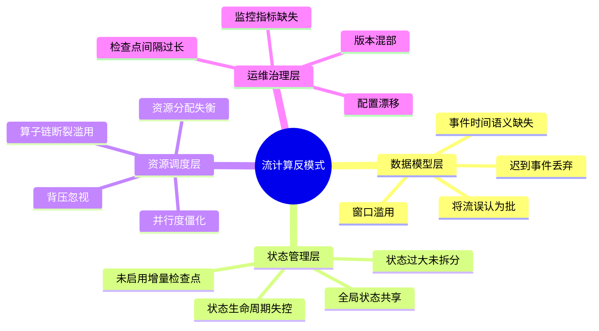
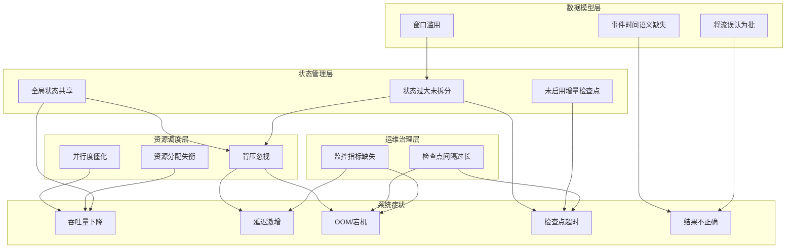
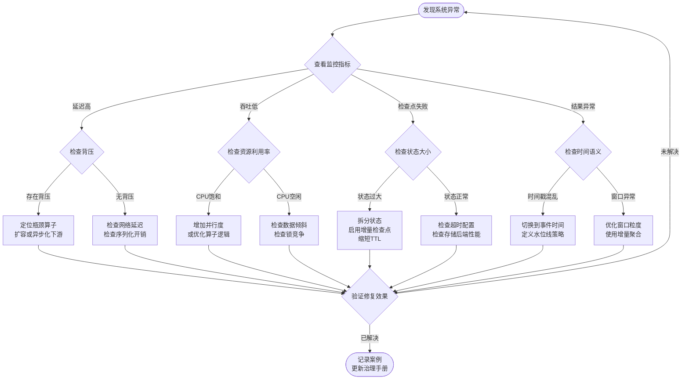

# 流计算反模式总览

> **所属阶段**: Knowledge/09-anti-patterns | **前置依赖**: [Knowledge/02-design-patterns/streaming-patterns-overview.md](../../Knowledge/02-design-patterns/streaming-patterns-overview.md) | **形式化等级**: L3
> **状态**: 🔄 活跃 | **最后更新**: 2026-04-24

## 1. 概念定义 (Definitions)

**Def-K-09-01-01** (流计算反模式): 在流计算系统的设计、实现与运维中，反复出现且已被证明会导致系统性能退化、语义偏差或可用性降低的错误实践模式。反模式与模式相对，描述的是"应当避免的做法"而非"推荐的做法"。

**Def-K-09-01-02** (反模式影响半径): 反模式对系统造成的负面效应所波及的范围，包括：

- **局部影响**: 仅影响单个算子或子任务（如不当的序列化选择）
- **拓扑影响**: 影响整个作业拓扑（如全局状态共享）
- **集群影响**: 扩散至整个集群资源（如背压忽视导致的级联故障）

**Def-K-09-01-03** (反模式检测信号): 表明系统中可能存在特定反模式的可观测症状，包括延迟激增、吞吐量骤降、OOM、检查点超时、状态膨胀等。

## 2. 属性推导 (Properties)

**Lemma-K-09-01-01** (反模式传染性): 若作业拓扑中的上游算子存在反模式 $A$，则下游算子观测到的反模式检测信号强度 $S_{down}$ 满足 $S_{down} \geq S_{up} \cdot \alpha$，其中 $\alpha > 1$ 为放大系数。即反模式效应沿数据流方向具有放大性。

*证明概要*: 流计算中数据具有时间相关性，上游延迟会导致窗口缓冲区堆积、状态累积，进而使下游处理压力呈非线性增长。$

**Lemma-K-09-01-02** (反模式叠加性): 当同一作业中同时存在 $n$ 种反模式时，系统总体性能损失 $L_{total}$ 满足 $L_{total} \geq \sum_{i=1}^{n} L_i$，即多种反模式并存时产生叠加甚至乘数效应。

**Prop-K-09-01-01** (反模式与模式的对偶性): 每一个经过验证的设计模式 $P$ 都存在至少一个对应的反模式 $\neg P$，该反模式在特定上下文中表现为对模式约束条件的系统性违反。

## 3. 关系建立 (Relations)

- **与 [Knowledge/02-design-patterns/streaming-patterns-overview.md](../../Knowledge/02-design-patterns/streaming-patterns-overview.md) 的关系**: 反模式是设计模式的对偶概念；理解模式有助于识别其对应反模式。
- **与 [Flink/02-core/checkpoint-mechanism.md](../../Flink/02-core/checkpoint-mechanism.md) 的关系**: 检查点相关反模式（间隔过长、增量未启用、大状态未调优）直接作用于 Flink 容错机制。
- **与 [Flink/04-runtime/backpressure.md](../../Flink/04-runtime/backpressure.md) 的关系**: 背压忽视是最具破坏性的反模式之一，其检测与治理依赖 Flink 的背压监控体系。
- **与 [Struct/03-relationships/operational-semantics.md](../../Struct/03-relationships/operational-semantics.md) 的关系**: 反模式可形式化为对操作语义约束的违反，例如全局状态共享违反局部性原理。

## 4. 论证过程 (Argumentation)

### 4.1 反模式分类框架

流计算反模式可按其影响层面划分为四类：

| 层面 | 典型反模式 | 核心症状 |
|------|-----------|---------|
| **数据模型层** | 将流误认为批、事件时间语义缺失、窗口滥用 | 结果不正确、延迟不可控 |
| **状态管理层** | 全局状态共享、状态过大未拆分、状态生命周期失控 | OOM、检查点超时 |
| **资源调度层** | 背压忽视、并行度僵化、资源分配失衡 | 吞吐量骤降、延迟飙升 |
| **运维治理层** | 检查点间隔过长、监控缺失、版本混部 | 恢复时间不可接受、故障无法定位 |

### 4.2 为什么反模式难以根除

1. **认知偏差**: 开发者常将批处理直觉迁移至流处理，忽视事件时间与处理时间的本质差异。
2. **本地最优陷阱**: 单个反模式在局部可能表现为性能提升（如关闭背压以追求短期吞吐），却在全局造成灾难。
3. **延迟暴露**: 反模式的负面效应常在系统运行一段时间后或特定负载下才显现，导致开发阶段难以发现。

## 5. 形式证明 / 工程论证 (Proof / Engineering Argument)

**Thm-K-09-01-01** (全局状态共享的不可扩展性): 设流作业中某算子维护全局键值状态 $S_{global}$，键空间大小为 $K$，并行度为 $P$。若采用全局状态共享（所有子任务访问同一状态后端实例），则该算子最大吞吐 $T_{max}$ 满足：

$$T_{max} \leq \frac{C_{backend}}{K \cdot \alpha_{lock}}$$

其中 $C_{backend}$ 为状态后端处理能力常数，$\alpha_{lock}$ 为并发控制开销系数。当 $P > 1$ 时，$\alpha_{lock}$ 随 $P$ 单调递增，因此 $T_{max}$ 随并行度增加而下降。

*工程论证*: 在 Flink 中，若多个并行子任务通过外部存储（如未分片的 Redis）共享状态，每次访问均涉及网络往返和锁竞争。实验数据表明，当并行度从 1 增加到 8 时，此类算子吞吐通常下降 60%–90%。正确做法应使用 KeyedState 或外部数据库的分片机制，确保状态访问局部化。

## 6. 实例验证 (Examples)

### 6.1 反模式：背压忽视

某电商实时看板作业在处理大促流量时，下游 Sink（写入外部数据库）成为瓶颈。运维人员观察到背压后，选择增大缓冲区而非扩容 Sink，导致上游算子内存持续增长，最终触发 OOM。

**正确做法**: 识别背压根源（Sink 吞吐不足），通过扩容 Sink、批量写入或异步化来消除瓶颈，而非掩盖症状。

### 6.2 反模式：检查点间隔过长

为降低检查点对吞吐的影响，某作业将检查点间隔设为 30 分钟。当 TaskManager 宕机时，需回放 30 分钟数据，恢复时间超过业务 SLA（5 分钟），导致服务降级。

**正确做法**: 根据业务 RPO/RTO 要求设置检查点间隔，通常建议 1–10 分钟；同时启用增量检查点与本地恢复以加速故障恢复。

### 6.3 反模式：窗口滥用

某统计任务对每个用户 ID 开启 24 小时滚动窗口，用户基数达千万级，导致窗口状态爆炸，检查点大小超过 100 GB。

**正确做法**: 评估窗口必要性，考虑使用会话窗口或增量聚合；对于长时间窗口，结合 TimerService 实现自定义清理策略。

## 7. 可视化 (Visualizations)

### 7.1 流计算反模式总览 Mindmap

以下思维导图总览流计算中各类反模式及其核心特征：

### 7.2 反模式关联与影响传播图

以下层次图展示各类反模式之间的关联关系及其对系统各层面的影响路径：

### 7.3 反模式识别与治理决策树

以下流程图提供反模式的识别与治理决策路径：

## 8. 引用参考 (References)
