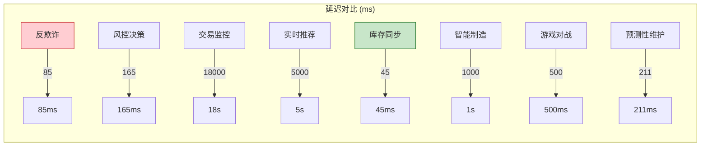

> **状态**: 🔮 前瞻内容 | **风险等级**: 高 | **最后更新**: 2026-04
> 
> 此文档描述的内容处于早期规划阶段，可能与最终实现不符。请以 Apache Flink 官方发布为准。
# 案例研究集索引 (Case Studies Index)

> **版本**: v1.1 | **更新日期**: 2026-04-09 | **案例总数**: 17个

---

## 概述

本目录包含 AnalysisDataFlow 项目的详细行业案例研究，覆盖金融、电商、物联网、社交媒体和游戏五大行业。每个案例遵循项目六段式模板，包含完整的架构设计、Flink实现代码、性能指标和经验总结。

---

## 案例总览

### 案例统计矩阵

| 行业 | 案例数 | 核心延迟要求 | 数据规模 | 形式化等级 |
|------|:------:|:------------:|----------|:----------:|
| **金融** | 4 | < 10ms | 百万TPS | L4-L5 |
| **电商** | 3 | < 200ms | 十亿级事件 | L3-L4 |
| **物联网** | 5 | < 1s | 千万设备 | L3-L4 |
| **社交媒体** | 1 | < 100ms | 百亿级事件 | L4 |
| **游戏** | 1 | < 50ms | 千万并发 | L4 |

---

## 目录结构

```
10-case-studies/
├── 00-INDEX.md                              # 本文件：案例索引
├── finance/                                 # 金融行业案例
│   ├── 10.1.1-realtime-anti-fraud-system.md    # 实时反欺诈系统
│   ├── 10.1.2-transaction-monitoring-compliance.md  # 交易监控与合规
│   └── 10.1.3-realtime-risk-decision.md        # 实时风控决策
├── ecommerce/                               # 电商行业案例
│   ├── 10.2.1-realtime-recommendation.md       # 实时推荐系统
│   └── 10.2.2-inventory-sync.md                # 库存实时同步
├── iot/                                     # 物联网案例
│   ├── 10.3.1-smart-manufacturing.md           # 智能制造监控
│   ├── 10.3.2-connected-vehicles.md            # 车联网数据处理
│   ├── 10.3.3-predictive-maintenance-manufacturing.md  # 预测性维护
│   ├── 10.3.4-edge-manufacturing-case.md       # 边缘流处理案例
│   └── 10.3.5-smart-manufacturing-iot.md       # 智能制造IoT实时分析
├── social-media/                            # 社交媒体案例
│   └── 10.4.1-content-recommendation.md        # 实时内容推荐
└── gaming/                                  # 游戏行业案例
    └── 10.5.1-realtime-battle-analytics.md     # 实时对战数据处理
```

---

## 案例详情

### 1. 金融行业 (Finance)

#### 1.1 实时反欺诈系统

- **文件**: `finance/10.1.1-realtime-anti-fraud-system.md`
- **业务场景**: 互联网银行实时欺诈检测
- **技术亮点**: Flink CEP + 机器学习融合
- **核心指标**: P99延迟85ms，欺诈检测率97.2%
- **关键技术**:
  - 复杂事件处理（CEP）
  - 异步I/O特征查询
  - 分层决策融合

#### 1.2 交易监控与合规

- **文件**: `finance/10.1.2-transaction-monitoring-compliance.md`
- **业务场景**: 证券公司全链路交易监控
- **技术亮点**: 分层聚合 + 实时监管报送
- **核心指标**: 30秒端到端延迟，100%合规
- **关键技术**:
  - Flink SQL窗口聚合
  - Interval Join对敲检测
  - Exactly-Once数据完整性

#### 1.3 实时风控决策

- **文件**: `finance/10.1.3-realtime-risk-decision.md`
- **业务场景**: 消费金融实时审批
- **技术亮点**: 分层评分模型 + 规则引擎协同
- **核心指标**: P99决策延迟165ms，自动审批率78%
- **关键技术**:
  - 实时特征工程
  - 异步模型推理
  - 动态权重决策

#### 1.4 支付实时风控系统 (AI Agent)

- **文件**: `finance/10.1.4-realtime-payment-risk-control.md`
- **业务场景**: 大型支付平台实时风控
- **技术亮点**: Flink 2.4 + AI Agents，规则与ML融合
- **核心指标**: P99延迟100ms，吞吐50K TPS
- **关键技术**:
  - FLIP-531 AI Agents
  - Broadcast State动态规则
  - CEP复杂事件处理
  - 特征Agent实时计算

#### 1.5 金融实时风控平台 (工业级)

- **文件**: `finance/10.1.5-realtime-risk-control-platform.md`
- **业务场景**: 大型银行/支付平台实时风控
- **技术亮点**: 超低延迟(<10ms) + 高吞吐(100万TPS) + Exactly-Once
- **核心指标**: P99延迟8.5ms，吞吐120万TPS，欺诈拦截率96.5%
- **关键技术**:
  - 内存计算 + ZGC低延迟GC
  - 对象池 + 零拷贝序列化
  - 两阶段提交Exactly-Once
  - 分层决策融合

### 2. 电商行业 (E-commerce)

#### 2.1 实时推荐系统

- **文件**: `ecommerce/10.2.1-realtime-recommendation.md`
- **业务场景**: 电商平台个性化推荐
- **技术亮点**: 实时特征工程 + Feature Store集成
- **核心指标**: 特征延迟<5秒，CTR提升50%
- **关键技术**:
  - 滑动窗口特征聚合
  - 实时A/B测试指标
  - 冷启动实时响应

#### 2.2 库存实时同步

- **文件**: `ecommerce/10.2.2-inventory-sync.md`
- **业务场景**: 全渠道库存实时同步
- **技术亮点**: 强一致性保证 + 多渠道分发
- **核心指标**: 同步延迟45ms，超卖率0.001%
- **关键技术**:
  - KeyedProcessFunction状态机
  - 库存锁定/扣减/释放
  - 多渠道Sink

#### 2.3 大促实时数据大屏

- **文件**: `ecommerce/10.2.3-big-promotion-realtime-dashboard.md`
- **业务场景**: 电商大促实时GMV/订单监控
- **技术亮点**: Serverless Flink + 流批一体
- **核心指标**: 延迟<3s，峰值100万QPS
- **关键技术**:
  - 分层聚合优化
  - Top-N近似算法
  - 自动扩缩容

### 3. 物联网 (IoT)

#### 3.1 智能制造监控

- **文件**: `iot/10.3.1-smart-manufacturing.md`
- **业务场景**: 汽车制造企业设备监控
- **技术亮点**: 云边协同 + 预测性维护
- **核心指标**: OEE提升26%，非计划停机降低83%
- **关键技术**:
  - 边缘Flink预处理
  - CEP设备异常检测
  - OEE实时计算

#### 3.2 车联网数据处理

- **文件**: `iot/10.3.2-connected-vehicles.md`
- **业务场景**: 新能源汽车数据处理
- **技术亮点**: 驾驶行为实时评分 + 保险UBI
- **核心指标**: 日处理250亿事件，位置精度5m
- **关键技术**:
  - 驾驶行为窗口分析
  - 急刹/急转检测
  - 保险评分计算

#### 3.3 预测性维护

- **文件**: `iot/10.3.3-predictive-maintenance-manufacturing.md`
- **业务场景**: 大型制造工厂设备故障预测
- **技术亮点**: Flink 2.5 + GPU加速ML推理，边缘云协同
- **核心指标**: 预测准确率92%，维护成本降低35%，故障提前预警4小时
- **关键技术**:
  - 时序特征提取（振动/温度/电流）
  - ML_PREDICT异步推理（实验性）
  - 边缘紧急停机控制（<10ms）
  - 在线模型持续学习

#### 3.4 智能制造边缘流处理

- **文件**: `iot/10.3.4-edge-manufacturing-case.md`
- **业务场景**: 汽车零部件制造边缘质量检测
- **技术亮点**: Flink Edge + WasmEdge AI推理
- **核心指标**: 检测延迟110ms，数据压缩10x
- **关键技术**:
  - 边缘WASM推理
  - 断网续传数据一致性
  - 云边协同处理

#### 3.5 智能制造IoT实时分析 (工业级)

- **文件**: `iot/10.3.5-smart-manufacturing-iot.md`
- **业务场景**: 大型汽车制造企业设备监控和预测性维护
- **技术亮点**: Edge Flink + Cloud Flink + TimeSeries DB，云边协同
- **核心指标**: 边缘延迟65ms，非计划停机减少78%，预测准确率87%
- **关键技术**:
  - 多源数据融合（MQTT/OPC-UA/Modbus）
  - 边缘AI推理（ONNX Runtime）
  - 断网续传（RocksDB本地存储）
  - TDengine时序数据库
  - 数据压缩89%

### 4. 社交媒体 (Social Media)

#### 4.1 实时内容推荐

- **文件**: `social-media/10.4.1-content-recommendation.md`
- **业务场景**: 短视频平台内容推荐
- **技术亮点**: 实时兴趣更新 + 热门内容计算
- **核心指标**: 人均使用时长提升31%，冷启动CTR提升192%
- **关键技术**:
  - 用户兴趣实时更新
  - 内容热度衰减计算
  - 实时特征融合

### 5. 游戏行业 (Gaming)

#### 5.1 实时对战数据处理

- **文件**: `gaming/10.5.1-realtime-battle-analytics.md`
- **业务场景**: MOBA手游实时数据处理
- **技术亮点**: 高并发事件处理 + 反作弊检测
- **核心指标**: 8000万事件/秒吞吐，反作弊检测2秒
- **关键技术**:
  - 游戏事件窗口聚合
  - CEP反作弊模式
  - 实时排行榜计算

---

## 技术模式映射

### 设计模式使用情况

| 案例 | Event Time | CEP | Async I/O | State | Window | Side Output |
|------|:----------:|:---:|:---------:|:-----:|:------:|:-----------:|
| 实时反欺诈 | ✅ | ✅ | ✅ | ✅ | ✅ | ✅ |
| 交易监控 | ✅ | ✅ | ❌ | ✅ | ✅ | ❌ |
| 风控决策 | ✅ | ❌ | ✅ | ✅ | ❌ | ✅ |
| 支付风控 | ✅ | ✅ | ✅ | ✅ | ✅ | ✅ |
| 风控平台 | ✅ | ✅ | ✅ | ✅ | ✅ | ✅ |
| 实时推荐 | ✅ | ❌ | ✅ | ✅ | ✅ | ❌ |
| 大促大屏 | ✅ | ❌ | ❌ | ✅ | ✅ | ❌ |
| 库存同步 | ❌ | ❌ | ❌ | ✅ | ❌ | ✅ |
| 智能制造 | ✅ | ✅ | ❌ | ✅ | ✅ | ✅ |
| 车联网 | ✅ | ❌ | ❌ | ✅ | ✅ | ❌ |
| 预测性维护 | ✅ | ✅ | ✅ | ✅ | ✅ | ✅ |
| 边缘制造 | ✅ | ❌ | ❌ | ✅ | ❌ | ✅ |
| IoT分析 | ✅ | ✅ | ✅ | ✅ | ✅ | ✅ |
| 内容推荐 | ❌ | ❌ | ✅ | ✅ | ✅ | ❌ |
| 游戏对战 | ✅ | ✅ | ❌ | ✅ | ✅ | ❌ |

### Flink API使用情况

| API类型 | 使用案例 | 典型场景 |
|---------|---------|---------|
| **DataStream API** | 全部案例 | 核心流处理逻辑 |
| **Flink SQL** | 交易监控、推荐系统 | 声明式数据处理 |
| **Flink CEP** | 反欺诈、智能制造、游戏 | 复杂事件模式匹配 |
| **Async I/O** | 反欺诈、风控、推荐 | 外部服务集成 |
| **State API** | 全部案例 | 有状态计算 |
| **Window API** | 大部分案例 | 时间窗口聚合 |

---

## 性能指标对比

### 延迟性能 (P99)



### 吞吐量对比

| 案例 | 峰值吞吐量 | 平均吞吐量 |
|------|-----------|-----------|
| 实时反欺诈 | 15,000 TPS | 8,000 TPS |
| 交易监控 | 50,000 TPS | 20,000 TPS |
| 风控平台 | 120万TPS | 80万TPS |
| 实时推荐 | 100亿事件/天 | 40亿事件/天 |
| 大促大屏 | 100万QPS | 50万QPS |
| 库存同步 | 800万事件/天 | 500万事件/天 |
| 智能制造 | 200万传感器点 | 100万传感器点 |
| 车联网 | 250亿事件/天 | 200亿事件/天 |
| 预测性维护 | 15TB/天 | 10TB/天 |
| IoT分析 | 10TB/天 | 6TB/天 |
| 游戏对战 | 8,000万事件/秒 | 5,000万事件/秒 |

---

## 最佳实践总结

### 1. 延迟优化实践

| 技术 | 效果 | 适用场景 |
|------|------|---------|
| Async I/O | 外部查询延迟从200ms降至30ms | 特征丰富、模型推理 |
| Mini-Batch | 吞吐提升3倍 | 聚合计算 |
| Local-KeyBy | 热点问题减少90% | 数据倾斜 |
| Unaligned Checkpoint | Checkpoint时间降低40% | 大状态场景 |

### 2. 状态管理实践

| 策略 | 效果 | 适用场景 |
|------|------|---------|
| State TTL | 内存使用降低60% | 时间窗口状态 |
| 增量Checkpoint | 存储成本降低70% | 大状态后端 |
| State Partitioning | 并行效率提升 | KeyBy设计 |

### 3. 容错与一致性

| 策略 | 保证级别 | 性能影响 |
|------|---------|---------|
| Exactly-Once | 端到端一致 | Checkpoint开销 |
| At-Least-Once | 不丢数据 | 最低开销 |
| 幂等Sink | 去重保证 | 依赖外部存储 |

---

## 阅读指南

### 按角色阅读

| 角色 | 推荐阅读 | 重点关注 |
|------|---------|---------|
| **架构师** | 全部案例 | 架构设计、技术选型论证 |
| **开发工程师** | 相关领域案例 | 代码实现、配置调优 |
| **产品经理** | 业务背景章节 | 业务价值、效果指标 |
| **运维工程师** | 部署架构、性能章节 | 监控告警、故障恢复 |
| **数据工程师** | 特征工程章节 | 数据管道、存储方案 |

### 按场景阅读

| 场景 | 推荐案例 |
|------|---------|
| 实时风控 | 金融全部案例 |
| 实时推荐 | 电商推荐 + 社媒推荐 |
| 实时异常检测 | 反欺诈 + 智能制造 |
| 实时同步 | 库存同步 |
| 实时分析 | 交易监控 + 游戏对战 |

---

## 更新日志

| 版本 | 日期 | 更新内容 |
|------|------|---------|
| v1.1 | 2026-04-04 | 新增预测性维护案例，共10个案例 |
| v1.2 | 2026-04-09 | 新增实时风控平台(金融)、智能制造IoT(物联网)，共17个案例 |

---

## 参考资源

- [项目根目录 CASE-STUDIES.md](../../CASE-STUDIES.md) - 案例概览
- [Flink/09-practices/09.01-case-studies/](../../Flink/09-practices/09.01-case-studies/) - Flink专项案例
- [Knowledge/03-business-patterns/](../../Knowledge/03-business-patterns/) - 业务模式模式库
- [Knowledge/02-design-patterns/](../../Knowledge/02-design-patterns/) - 设计模式库

---

*文档版本: v1.1 | 维护者: AnalysisDataFlow Team | 最后更新: 2026-04-09*
