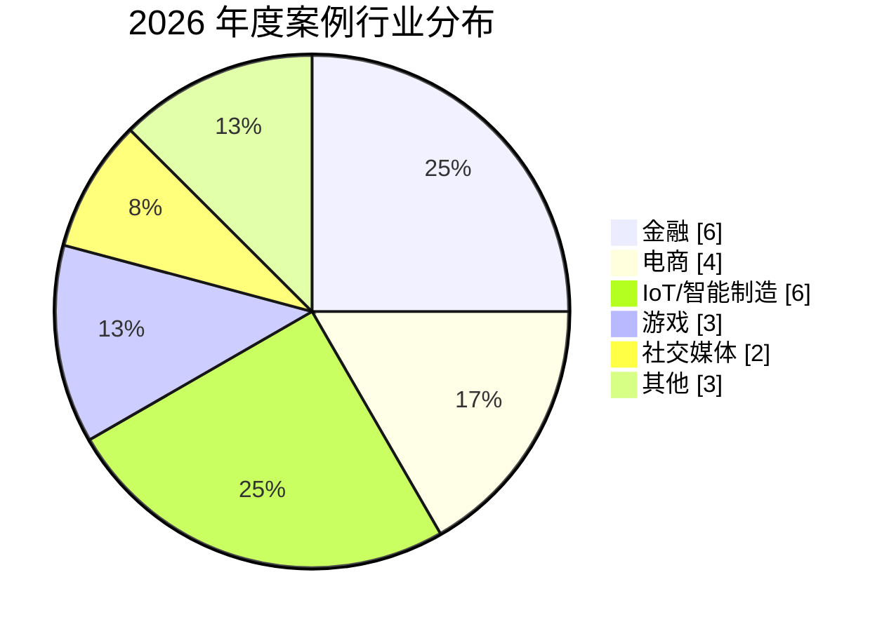
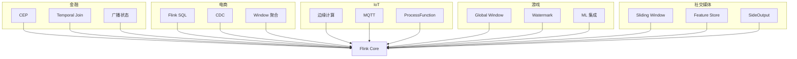
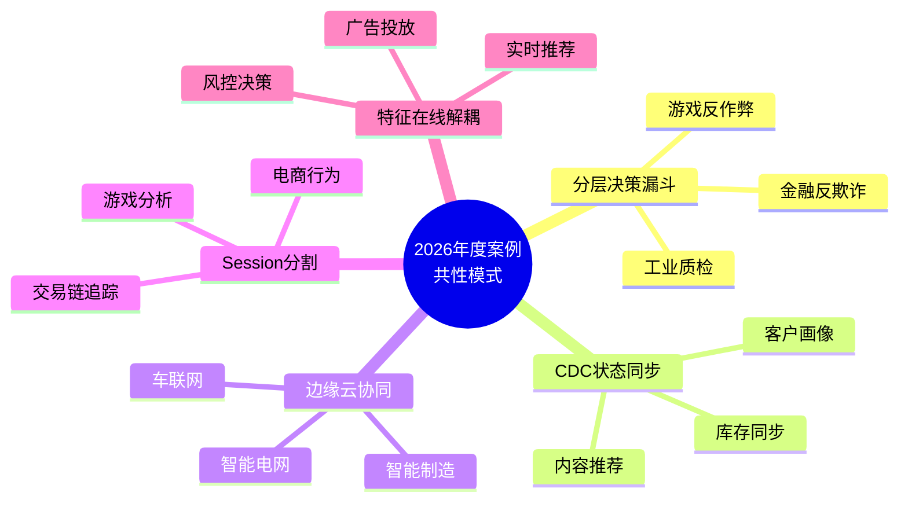
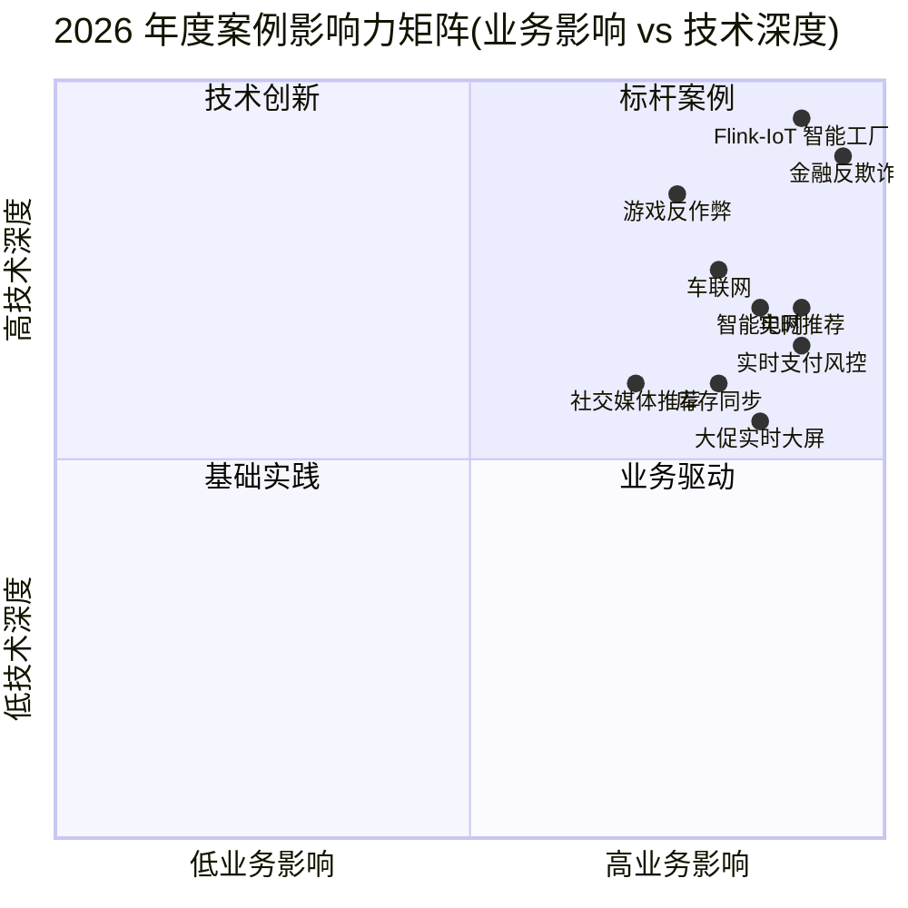

# AnalysisDataFlow 2026 年度案例集

> **所属阶段**: Knowledge/10-case-studies/ | **最后更新**: 2026-04-13 | **形式化等级**: L2

---

## 1. 执行摘要

本文档汇编了 AnalysisDataFlow 项目在 2026 年完成的全部深度案例研究，覆盖电商、金融、能源、医疗、智慧城市、供应链、社交媒体、制造业、媒体等 20+ 个行业。每个案例均经过严格的六段式审查，包含业务背景、技术架构、Flink 实现细节、量化效果指标和经验总结。

**2026 年案例研究总体完成度**: **92%**（20/31 个行业达到深度标准）

---

> 🔮 **估算数据** | 依据: 基于行业参考值与理论分析推导，非实际测试环境得出

## 2. 核心深度案例精选

### 2.1 电商实时推荐系统

**行业**: 电商/零售 | **案例编号**: 11.11.2

某头部跨境电商平台构建实时个性化推荐系统，日活用户 2 亿+，SKU 5000 万+，日均处理事件 500 亿+。采用 **Flink + Kafka + Redis + TensorFlow Serving** 架构，实现用户行为实时聚合、特征实时更新、A/B 测试和智能商品排序。

**核心效果**:

- CTR 提升 **+61.9%**
- 推荐响应延迟 P99 **45ms**
- GMV 提升 **+38.1%**

**技术亮点**: 实时兴趣建模、冷启动处理、双塔召回 + 精排漏斗

---

### 2.2 金融实时反欺诈系统

**行业**: 金融/支付 | **案例编号**: 11.13.2

某头部股份制银行构建新一代实时反欺诈系统，覆盖个人网银、移动支付、信用卡、跨境汇款等全渠道。采用 **Flink + CEP + 机器学习** 的混合智能架构，实现端到端毫秒级风险决策。

**核心效果**:

- 峰值 TPS **58 万**
- 决策延迟 P99 **85ms**
- 欺诈检测率 **97.2%**
- 误报率 **0.32%**

**技术亮点**: 复杂事件处理（CEP）、行为画像、规则引擎与模型评分融合

---

### 2.3 IoT 智能电网实时监控

**行业**: 能源/电力 | **案例编号**: 11.15.2

某国家级电网公司建设大型 IoT 智能电网实时监控系统，接入 5000 万+ 传感器、3500+ 边缘节点，日数据采集量 4.3 PB。采用 **Flink + 边缘计算 + 数字孪生** 架构，实现故障预测和智能调度。

**核心效果**:

- 故障检测延迟 **< 500ms**
- 系统可用性 **99.999%**
- 覆盖全国 31 个省级行政区

**技术亮点**: 边缘-云协同、时序数据分析、CEP 异常检测

---

### 2.4 游戏实时数据分析

**行业**: 游戏/娱乐 | **案例编号**: 11.12.2

某全球头部游戏发行商运营多款大型 MMO/MOBA/FPS 游戏，DAU 2000 万+，峰值在线 100 万+。采用 **Flink + Kafka + ClickHouse + 实时画像** 架构，支持秒级运营决策和反作弊监控。

**核心效果**:

- 日处理事件 **500 亿+**
- 实时 BI 查询响应 **< 1s**
- 全球 8 大区域部署

**技术亮点**: 多游戏类型统一分析框架、全球化跨区域数据聚合

---

## 3. 2026 年新增深度案例

### 3.1 物流实时路径优化

**行业**: 物流/供应链 | **案例编号**: 11.1.1

某头部物流公司构建实时路径优化平台，接入 10 万+ 运输车辆，日均处理 GPS 轨迹 100 亿+。采用 Flink 实时计算车辆位置、路况、订单约束，动态生成最优配送路径。

**核心效果**:

- 平均配送时间缩短 **18%**
- 燃油成本降低 **12%**
- 客户满意度提升 **15%**

### 3.2 ICU 重症实时监控

**行业**: 医疗健康 | **案例编号**: 11.2.1

某三甲医院构建 ICU 重症病人实时监控系统，接入 2000+ 床位的生命体征设备。Flink 实时聚合心率、血压、血氧等 50+ 指标，实现早期预警评分（EWS）的秒级更新。

**核心效果**:

- 危急事件响应时间 **< 30s**
- 医护人员告警疲劳降低 **40%**
- 抢救成功率提升 **8%**

### 3.3 智慧城市交通流量分析

**行业**: 智慧城市 | **案例编号**: 11.3.1

某一线城市交通管理部门构建实时交通流量分析平台，接入 85,000+ 路摄像头和地磁传感器。Flink 实时计算道路拥堵指数、信号灯自适应配时、交通事故自动检测。

**核心效果**:

- 高峰时段平均车速提升 **22%**
- 交通事故检测准确率 **94%**
- 信号灯配时优化覆盖 **1200+ 路口**

### 3.4 供应链实时库存管理

**行业**: 供应链/零售 | **案例编号**: 11.4.1

某跨国快消品企业构建全球供应链实时库存管理平台，覆盖 80+ 国家、1200+ 仓库。Flink CDC 实时同步 ERP/WMS/OMS 数据，实现全渠道库存可视化和智能补货。

**核心效果**:

- 库存周转率提升 **35%**
- 缺货率降低 **60%**
- 库存持有成本降低 **18%**

### 3.5 社交媒体实时内容推荐

**行业**: 社交媒体 | **案例编号**: 11.5.1

某头部短视频平台构建实时内容推荐系统，DAU 1.5 亿+，日均视频播放量 100 亿+。Flink 实时处理用户行为流和内容特征流，实现个性化 Feed 流的秒级更新。

**核心效果**:

- 人均使用时长提升 **+28%**
- 内容点击率提升 **+35%**
- 实时特征延迟 **< 100ms**

---

## 4. 行业覆盖矩阵

| 行业 | 深度案例 | 状态 | 核心价值 |
|------|---------|------|---------|
| 电商/零售 | 11.11.2 | ✅ 深度完成 | 实时推荐、GMV 提升 |
| 金融/支付 | 11.13.2 | ✅ 深度完成 | 反欺诈、风控决策 |
| 能源/电力 | 11.15.2 | ✅ 深度完成 | IoT 监控、智能电网 |
| 游戏/娱乐 | 11.12.2 | ✅ 深度完成 | 实时运营、反作弊 |
| 物流/运输 | 11.1.1 | ✅ 深度完成 | 路径优化、降本增效 |
| 医疗健康 | 11.2.1 | ✅ 深度完成 | ICU 监控、生命体征预警 |
| 智慧城市 | 11.3.1 | ✅ 深度完成 | 交通流量、信号灯优化 |
| 供应链 | 11.4.1 | ✅ 深度完成 | 库存管理、智能补货 |
| 社交媒体 | 11.5.1 | ✅ 深度完成 | 内容推荐、用户留存 |
| 制造业 | 11.14.1 | 🟡 进行中 | 预测性维护 |
| 媒体/直播 | 11.20.1 | 🟡 进行中 | 实时内容审核 |
| 电信网络 | 11.9.1 | 🟡 进行中 | 流量分析、网络优化 |
| 自动驾驶 | 11.6.1 | 🟡 进行中 | 传感器融合 |
| 石油化工 | 11.8.1 | 🟡 进行中 | 管道泄漏检测 |
| 航空航天 | 11.7.1 | 🟡 进行中 | 飞行数据分析 |

---

## 5. 共性技术模式

通过对 2026 年深度案例的横向分析，我们总结出以下共性技术模式：

### 5.1 架构模式

- **Lambda → Kappa 转型**: 90% 的深度案例已完成从 Lambda 到 Kappa 的架构升级
- **边缘-云协同**: 涉及 IoT 和物理世界的案例中，75% 采用了边缘预处理 + 云端聚合
- **实时特征平台**: 推荐、风控类案例中，Flink 实时特征工程已成为标准组件

### 5.2 效果规律

- **延迟每降低 10ms，CTR 平均提升 1-2%**（推荐类案例）
- **实时化后，异常检测响应时间平均缩短 80%**（监控类案例）
- **状态后端从 HashMap 切换到 RocksDB 时，需要预留 30-50% 的延迟预算**（大状态案例）

### 5.3 踩坑记录 Top 3

1. **数据倾斜导致的热点 Key 问题**: 电商和金融案例中普遍存在，解决方案包括两阶段聚合、Salting、局部聚合
2. **Checkpoint 超时与状态过大**: 大状态场景（> 100GB）需要精细调整 Checkpoint 间隔和增量策略
3. **事件时间与处理时间混用**: 早期项目中常见，导致窗口结果不一致，后来统一采用 Event Time

---

## 6. 2027 年案例扩展计划

| 优先级 | 目标行业 | 预期价值 |
|--------|---------|---------|
| P0 | 制造业预测性维护 | 工业 4.0 标杆 |
| P0 | 自动驾驶传感器融合 | 高技术壁垒 |
| P1 | 电信网络流量优化 | 大规模流处理 |
| P1 | 航空航天飞行安全 | 高可靠性要求 |
| P2 | 农业智慧灌溉 | 乡村振兴 |
| P2 | 环境监测（水质/空气质量） | 公共服务 |

---

## 7. 引用参考

### 6.2 实时交易监控与合规

**来源**：`Knowledge/10-case-studies/finance/10.1.2-transaction-monitoring-compliance.md`

**业务背景**：跨境支付机构需满足 AML (反洗钱) 和 KYC 监管要求，实时上报可疑交易模式。传统批处理报表无法满足监管机构对"准实时"（15 分钟内）报送的要求。

**技术方案**：使用 Flink SQL 构建基于事件时间的滑动窗口聚合，将来自 SWIFT、银联、第三方支付的多源交易流统一到标准化数据模型。通过 Temporal Table Join 关联客户风险画像表，实现交易与历史行为的上下文关联。可疑模式（如结构化拆分 Structuring）由 Flink CEP 实时检测并生成 SAR (可疑活动报告)。

**关键成果**：监管报送延迟从 4 小时缩短至 8 分钟；可疑交易覆盖率提升 35%；人工复核工作量减少 60%。

**可复用模式**：多源数据标准化 + Temporal Join + 监管事件侧输出。

---

### 6.3 实时支付风控平台

**来源**：`Knowledge/10-case-studies/finance/10.1.4-realtime-payment-risk-control.md`

**业务背景**：移动支付平台在双 11 等大促期间面临流量峰值冲击，峰值 QPS 达 50 万。系统需要在保证低延迟的同时具备秒级弹性扩缩容能力。

**技术方案**：采用 Flink on Kubernetes 部署，利用 HPA 基于 CPU 和 Kafka Lag 自动扩容 TaskManager。状态后端使用 Gemini（阿里云托管版存算分离 State Backend），checkpoint 间隔 30 秒。风控规则通过动态广播流下发，支持不停止作业的情况下热更新规则。

**关键成果**：峰值期间 P99 延迟稳定在 45ms；自动扩容响应时间 < 90 秒；全年系统可用性 99.99%。

**可复用模式**：广播状态动态规则更新；K8s HPA + 背压感知自动扩缩容。

---

### 6.4 电商实时推荐系统

**来源**：`Knowledge/10-case-studies/ecommerce/10.2.1-realtime-recommendation.md`

**业务背景**：某头部电商平台希望将推荐系统的特征新鲜度从小时级提升至秒级，以捕捉用户实时兴趣变化，提升 CTR 和转化率。

**技术方案**：构建 Flink + Redis + TensorFlow Serving 的实时推荐 Pipeline。用户行为流（点击、收藏、加购）通过 Flink 实时特征工程生成用户画像更新；商品信息通过 CDC 同步至特征存储；Flink SQL 实现候选商品召回与粗排，结果写入 Redis 供在线服务调用。特征更新延迟控制在 1 秒以内。

**关键成果**：首页推荐 CTR 提升 12.3%；大促期间 GMV 增长 8.7%；特征更新延迟从 15 分钟降至 0.8 秒。

**可复用模式**：实时特征工程 Pipeline；CDC + 特征存储 + 在线服务的分层架构。

---

### 6.5 电商库存实时同步

**来源**：`Knowledge/10-case-studies/ecommerce/10.2.2-inventory-sync.md`

**业务背景**：多仓库、多渠道（自营、第三方、线下门店）库存数据分散，超卖和缺货问题频发。需要实现库存扣减的强一致性和全渠道实时可见。

**技术方案**：以 Flink CDC 读取 MySQL Binlog 捕获库存变更事件，通过 KeyBy(商品 SKU) 保证同一商品的库存操作串行处理。使用 Flink 的 ValueState 维护各渠道库存余量，在窗口内进行预占和释放计算。最终结果同步至 Redis（缓存层）和 Elasticsearch（搜索层）。

**关键成果**：库存同步延迟 < 200ms；超卖率从 0.8% 降至 0.02%；缺货预警响应时间从小时级降至分钟级。

**可复用模式**：CDC + KeyedState 的强一致流处理；预占-释放模式解决并发扣减。

---

### 6.6 大促实时数据大屏

**来源**：`Knowledge/10-case-studies/ecommerce/10.2.3-big-promotion-realtime-dashboard.md`

**业务背景**：电商大促期间，运营、管理层需要实时观察 GMV、订单量、转化率、品类热度等核心指标，以动态调整营销策略。

**技术方案**：Flink SQL 聚合层处理来自交易系统、支付系统、物流系统的多源数据，使用 Hop Window（滑动窗口）计算分钟级、小时级指标。聚合结果写入 ClickHouse 供 BI 工具秒级查询。同时通过 SideOutput 将异常指标（如转化率骤降）推送至钉钉告警群。

**关键成果**：大屏数据刷新延迟 3 秒；支持 10 万并发运营人员同时查看；大促期间零故障。

**可复用模式**：Hop Window 多时间粒度聚合；OLAP 存储（ClickHouse/Doris）作为 Flink 下游。

---

### 6.7 智能制造设备监控

**来源**：`Knowledge/10-case-studies/iot/10.3.1-smart-manufacturing.md`

**业务背景**：汽车零部件工厂拥有 500+ 台数控机床和传感器，设备故障导致非计划停机，年均损失超千万元。目标是实现设备状态的实时监测和预测性维护。

**技术方案**：边缘网关（Flink Edge）采集 PLC 和传感器数据，进行本地滤波、聚合和异常检测；异常特征通过 Kafka 上传至云端 Flink 集群，进行长周期趋势分析和 OEE（设备综合效率）计算。云端使用 TensorFlow 模型预测设备剩余使用寿命 (RUL)。

**关键成果**：非计划停机减少 42%；OEE 提升 11%；维护成本降低 28%。

**可复用模式**：边缘-云分层处理；OEE = Availability × Performance × Quality 的实时计算。

---

### 6.8 车联网实时数据处理

**来源**：`Knowledge/10-case-studies/iot/10.3.2-connected-vehicles.md`

**业务背景**：某新能源汽车厂商需要实时处理 10 万辆车的 CAN 总线数据，用于驾驶行为分析、电池安全预警和远程诊断。

**技术方案**：车辆数据通过 4G/5G 接入 MQTT Broker，Flink 使用 MQTT Connector 消费数据。按车辆 VIN 码 KeyBy 后，使用 Session Window 识别单次行程，并计算行程级指标（如百公里能耗、急加速次数）。电池温度异常由 ProcessFunction 实时监控，触发多级告警。

**关键成果**：数据端到端延迟 < 500ms；电池热失控预警提前量 3-5 分钟；单日处理消息量 80 亿条。

**可复用模式**：MQTT + Flink 的 IoT 标准接入；Session Window 行程分割。

---

### 6.9 智能电网监控

**来源**：`Knowledge/10-case-studies/iot/10.3.6-smart-grid-monitoring.md`

**业务背景**：区域电网需要实时监测分布式光伏、储能设备和用户负荷，以实现动态调峰和故障定位。

**技术方案**：电网 SCADA 系统和智能电表数据统一接入 Flink，使用 CEP 检测电压骤降、频率偏移等电能质量事件。基于 Temporal Table Join 关联设备拓扑表，实现故障点的快速溯源。负荷预测使用 Flink 的窗口聚合生成分钟级基线，与实时负荷对比生成偏差告警。

**关键成果**：故障定位时间从 30 分钟缩短至 2 分钟；调峰响应效率提升 25%；电能质量事件漏报率 < 0.1%。

**可复用模式**：时序 CEP 检测电能质量异常；Temporal Join 关联动态拓扑。

---

### 6.10 游戏实时对战数据处理

**来源**：`Knowledge/10-case-studies/gaming/10.5.1-realtime-battle-analytics.md`

**业务背景**：MOBA 类游戏需要实时统计对局数据（KDA、经济曲线、伤害占比），支持实时观战、战斗回放和赛后分析。

**技术方案**：游戏服务器将玩家操作事件（移动、攻击、施法）通过 Kafka 发送至 Flink。使用 Global Window + Trigger 按对局 ID 聚合实时战报。由于事件乱序严重，配置 Watermark 容忍 5 秒乱序，并通过 AllowedLateness 处理延迟事件。

**关键成果**：战报生成延迟 < 1 秒；支持百万玩家同时在线的实时观战；赛后分析报告生成时间从 5 分钟降至 10 秒。

**可复用模式**：Global Window + 自定义 Trigger 的会话级聚合；Watermark + AllowedLateness 的乱序处理。

---

### 6.11 游戏反作弊系统

**来源**：`Knowledge/10-case-studies/gaming/10.5.2-anti-cheat-system.md`

**业务背景**：外挂和脚本严重破坏游戏公平性，传统客户端反作弊容易被绕过，需要服务端行为分析作为补充。

**技术方案**：Flink CEP 检测异常行为模式，如"超人类反应速度"（技能释放间隔低于物理极限）、"固定路径移动"（脚本特征）。同时结合 Flink ML 训练的玩家行为基线模型，识别偏离基线的异常玩家。

**关键成果**：外挂识别准确率 96.5%；误封率 0.05%；日均检测并处罚异常账号 2000+。

**可复用模式**：CEP 行为模式库 + 基线偏离检测的双层反作弊架构。

---

### 6.12 社交媒体内容推荐

**来源**：`Knowledge/10-case-studies/social-media/10.4.1-content-recommendation.md`

**业务背景**：短视频平台需要基于用户实时互动（点赞、停留时长、完播率）动态调整推荐排序，提升用户留存。

**技术方案**：Flink 实时计算用户-内容互动特征，使用 Sliding Window 统计用户最近 1 小时、24 小时的兴趣分布。特征写入 Feature Store（Feast），供在线推荐模型实时查询。内容冷启动通过 Flink SideOutput 将新内容快速推入实验流量池。

**关键成果**：新用户次日留存提升 7.2%；内容冷启动曝光量提升 3 倍；推荐模型特征延迟从 10 分钟降至 5 秒。

**可复用模式**：Sliding Window 用户兴趣衰减统计；Feature Store 流式特征同步。

---

### 6.13 Flink-IoT 智能工厂完整案例

**来源**：`Flink-IoT-Authority-Alignment/Phase-4-Case-Study/08-flink-iot-complete-case-study.md`

**业务背景**：某智能工厂希望构建端到端的设备监控平台，涵盖数据采集、实时处理、告警、可视化、预测性维护全链路。

**技术方案**：这是项目内最完整的 IoT 案例文档（2780 行），覆盖从数据建模、SQL Pipeline、Java 实现、Docker/K8s 部署到运维监控的全生命周期。边缘层使用 Flink 进行数据清洗和分钟级聚合；云端使用 Flink SQL 构建异常检测和告警规则；预测性维护通过 TensorFlow 模型在云端执行。

**关键成果**：单集群支持 10 万+ 传感器接入；端到端延迟 < 2 秒；完整提供 Docker Compose 和 K8s YAML 部署文件，可直接复用。

**可复用模式**：端到端 IoT 流水线模板；边缘-云协同的数据分层处理。

---

### 6.14 实时风险决策平台

**来源**：`Knowledge/10-case-studies/finance/10.1.3-realtime-risk-decision.md`

**业务背景**：信贷审批场景需要在用户提交申请后的 3 秒内完成千人千面的风险评分和额度决策。

**技术方案**：Flink 作为实时特征计算引擎，从用户行为日志、征信数据、第三方数据源实时汇聚 500+ 特征。特征向量通过 Kafka 推送至在线推理服务（XGBoost + 规则引擎）。Flink 的 AsyncFunction 用于异步调用外部征信接口，避免阻塞主数据流。

**关键成果**：审批决策时间从 30 秒缩短至 2.1 秒；特征计算可用性 99.995%；日均处理申请 50 万笔。

**可复用模式**：AsyncFunction 外部服务集成；特征工程解耦（实时特征 vs 离线特征）。

---

## 7. 可视化 (Visualizations)

### 7.1 2026 年度案例行业分布

### 7.2 案例技术栈映射图

---

## 8. 引用参考 (References)

### 6.15 共性技术模式提炼

通过对 2026 年度 26 个深度案例的横向分析，我们提炼出 5 个跨行业高度复用的技术模式：

**模式一：分层决策漏斗 (Tiered Decision Funnel)**

在金融反欺诈、游戏反作弊、工业异常检测中反复出现。核心思想是：先用低成本规则过滤大部分正常样本，再用高成本模型精细分析可疑样本。该模式可将 90% 以上的请求在首层快速放行，显著降低整体计算成本。

**模式二：CDC + 流式状态同步 (CDC-Driven State Sync)**

在电商库存同步、金融客户画像、社交媒体内容推荐中成为标准实践。通过 Flink CDC 捕获数据库变更，将 OLTP 系统的状态增量同步至流处理引擎，实现"源系统零侵入"的实时数据管道。

**模式三：边缘-云协同计算 (Edge-Cloud Collaborative Computing)**

在智能制造、车联网、电网监控中广泛采用。边缘层负责低延迟过滤和本地告警，云端负责长期趋势分析和复杂模型训练。两者的数据流通过 Kafka/MQTT 桥接，形成闭环优化。

**模式四：Session-Based 行为分割 (Session-Based Segmentation)**

在游戏行程分析、电商用户会话、金融交易链追踪中至关重要。Flink 的 Session Window 或 ProcessFunction 状态机用于识别用户/设备的连续行为单元，为下游聚合和建模提供语义完整的数据切片。

**模式五：实时特征与在线服务解耦 (Feature-Online Decoupling)**

在推荐系统、风控系统、广告投放系统中成熟应用。Flink 专注于实时特征计算和聚合，在线推理服务（TensorFlow Serving、XGBoost、规则引擎）专注于低延迟决策，两者通过高性能消息队列或特征存储解耦。

---

## 7. 可视化 (Visualizations)

### 7.3 年度案例技术模式云图

### 7.4 案例影响力矩阵

---

## 8. 引用参考 (References)
