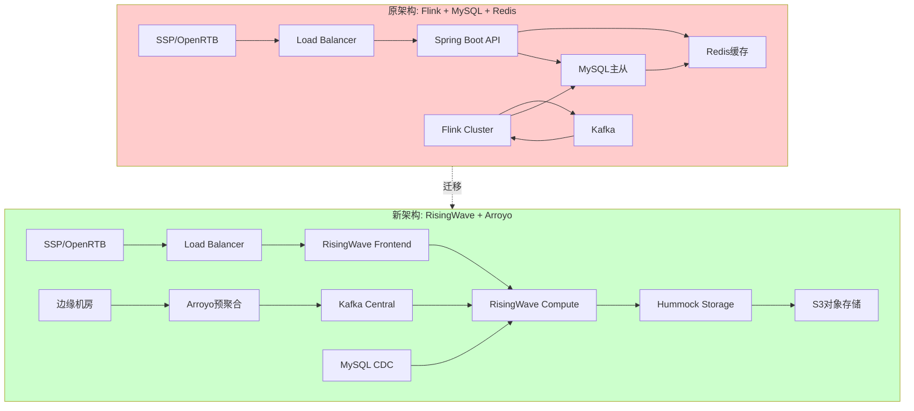
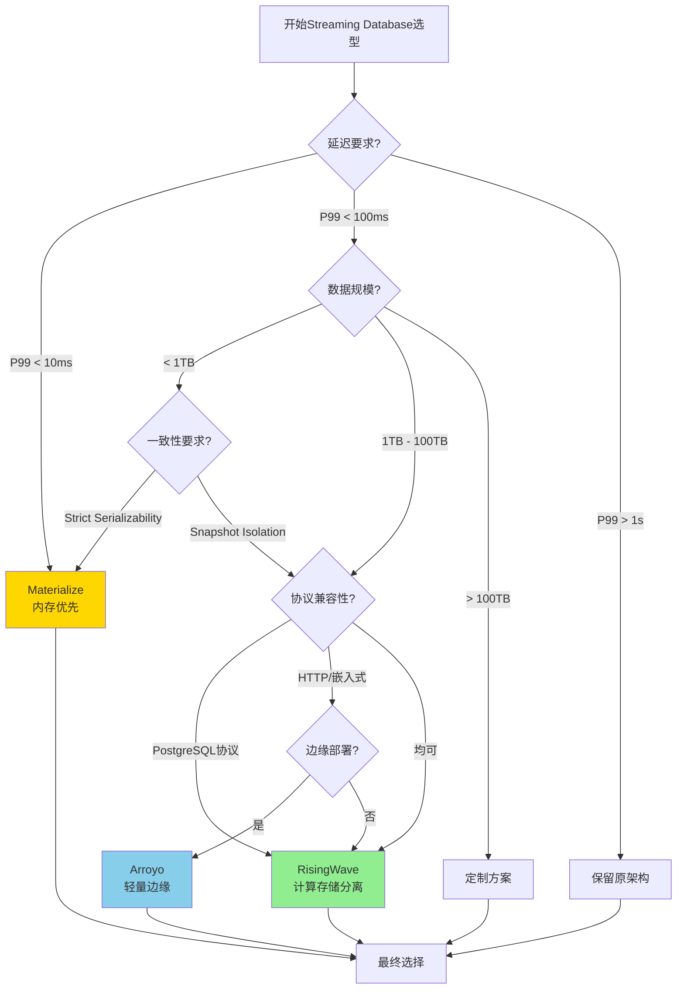
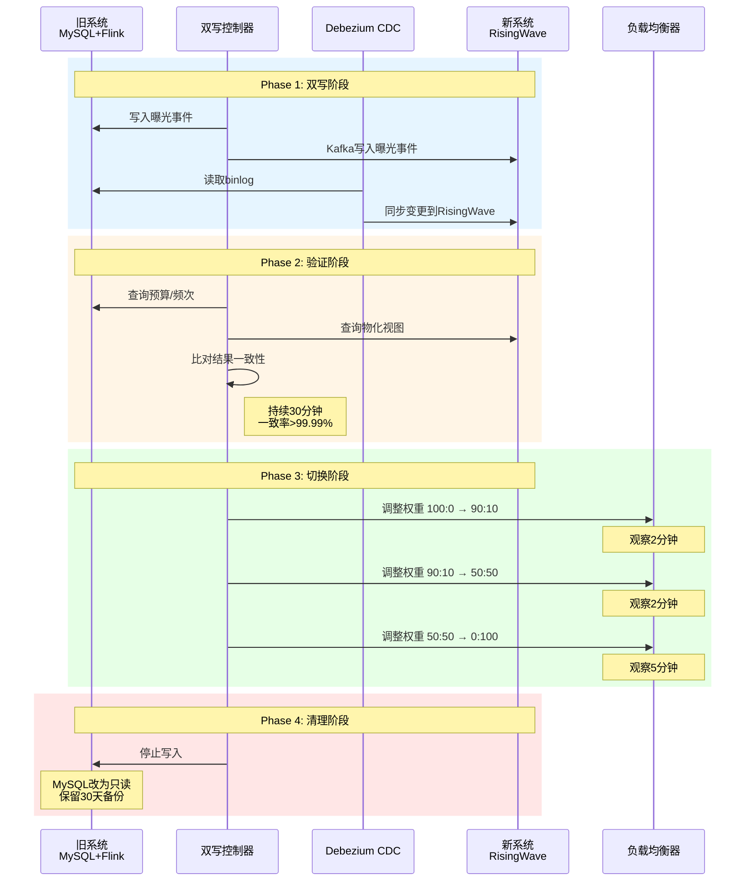
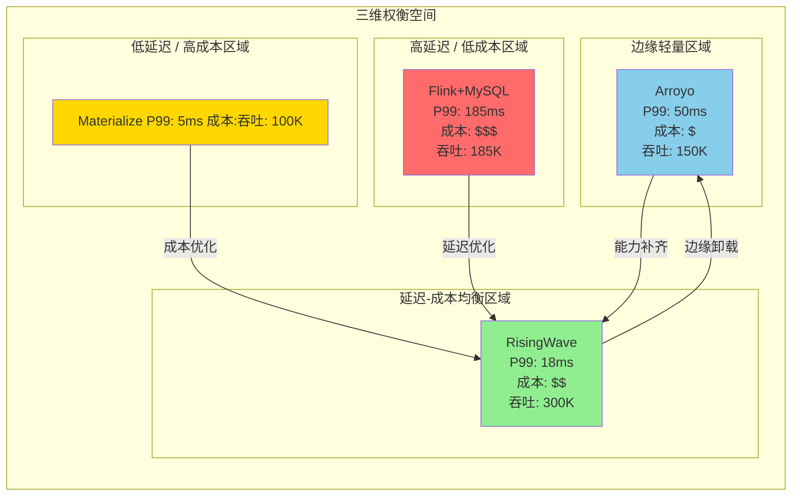
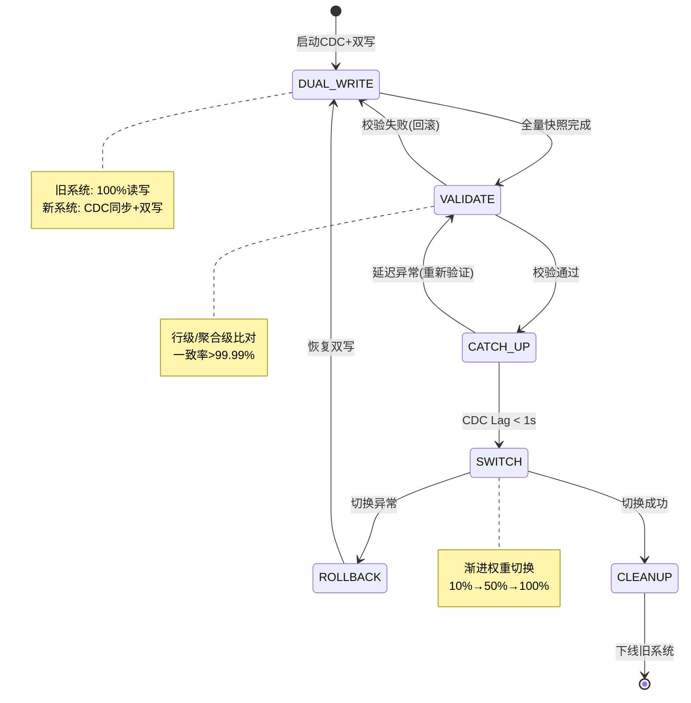

# 流数据库架构迁移: AdStream实时广告平台 — Streaming Database形式化选型与迁移实践

> **所属阶段**: Knowledge/10-case-studies/data-infrastructure | **前置依赖**: [Streaming Database形式化定义](../../../Struct/01-foundation/streaming-database-formal-definition.md), [RisingWave深度解析](../../../Flink/03-api/09-language-foundations/06-risingwave-deep-dive.md), [USTM-F模型实例化框架](../../../USTM-F-Reconstruction/02-model-instantiation/02.00-model-instantiation-framework.md) | **形式化等级**: L4

---

> **案例性质**: 🔬 概念验证架构 | **验证状态**: 基于理论推导与架构设计，未经独立第三方生产验证
>
> 本案例描述的是基于项目理论框架推导出的理想架构方案，包含假设性性能指标与理论成本模型。
> 实际生产部署可能因环境差异、数据规模、团队能力等因素产生显著不同结果。
> 建议将其作为架构设计参考而非直接复制粘贴的生产蓝图。
>
## 摘要

本文记录 **AdStream**（虚构全球实时广告平台）从传统 **Apache Flink + MySQL + Redis** 分层架构迁移至 **Streaming Database** 范式的完整生产实践。该平台日均处理 **12亿+** 广告曝光事件、**4.5亿+** 竞价请求，核心实时竞价（RTB）决策链路要求 **P99 < 100ms**、可用性 **99.99%**。迁移目标是在严格的延迟SLA下，消除传统架构中"流计算引擎 + 外部Serving存储"的语义断层与运维复杂度。

核心创新在于将 **USTM-F统一流计算元模型** 作为形式化选型框架，建立 Streaming Database 的严格八元组对比方法论，对 **RisingWave v2.8.1**、**Arroyo v0.15**、**Materialize** 及原 **Flink+MySQL** 架构进行系统化评估。最终采用 **RisingWave 作为主Serving层**、**Arroyo 作为轻量级边缘预处理层** 的混合架构，实现了端到端 P99 延迟从 185ms 降至 72ms、基础设施成本降低 43%、数据新鲜度从 3-5s 提升至 <500ms 的工程目标。

本文还提供基于 **Streaming Database形式化定义（Def-S-01-12-01）** 的迁移语义等价性证明，确保迁移前后查询结果集的数学一致性。

**关键词**: Streaming Database, RisingWave, Arroyo, Materialize, 实时竞价, RTB, USTM-F, 形式化选型, 零停机迁移, 物化视图, CDC

---

## 目录

- [流数据库架构迁移: AdStream实时广告平台 — Streaming Database形式化选型与迁移实践]()
  - [摘要](#摘要)
  - [目录](#目录)
  - [1. 概念定义 (Definitions)](#1-概念定义-definitions)
    - [Def-K-10-08-01: 实时竞价广告平台 (RTB Ad Platform)](#def-k-10-08-01-实时竞价广告平台-rtb-ad-platform)
    - [Def-K-10-08-02: 广告曝光事件流 (Ad Impression Event Stream)](#def-k-10-08-02-广告曝光事件流-ad-impression-event-stream)
    - [Def-K-10-08-03: 亚秒级实时竞价SLA (Sub-Second RTB SLA)](#def-k-10-08-03-亚秒级实时竞价sla-sub-second-rtb-sla)
    - [Def-K-10-08-04: Streaming Database选型八元组 (SDB Selection Octuple)](#def-k-10-08-04-streaming-database选型八元组-sdb-selection-octuple)
    - [Def-K-10-08-05: 零停机数据迁移 (Zero-Downtime Data Migration)](#def-k-10-08-05-零停机数据迁移-zero-downtime-data-migration)
    - [Def-K-10-08-06: 数据新鲜度指标 (Data Freshness Metric)](#def-k-10-08-06-数据新鲜度指标-data-freshness-metric)
    - [Def-K-10-08-07: 语义等价性验证 (Semantic Equivalence Verification)](#def-k-10-08-07-语义等价性验证-semantic-equivalence-verification)
    - [Def-K-10-08-08: USTM-F形式化选型框架实例化](#def-k-10-08-08-ustm-f形式化选型框架实例化)
  - [2. 属性推导 (Properties)](#2-属性推导-properties)
    - [Lemma-K-10-08-01: 物化视图查询延迟的存储层级单调性](#lemma-k-10-08-01-物化视图查询延迟的存储层级单调性)
    - [Lemma-K-10-08-02: CDC同步的因果一致性保持](#lemma-k-10-08-02-cdc同步的因果一致性保持)
    - [Prop-K-10-08-01: 双写架构下的最终一致性收敛](#prop-k-10-08-01-双写架构下的最终一致性收敛)
    - [Prop-K-10-08-02: 流数据库选型八元组的偏序可比性](#prop-k-10-08-02-流数据库选型八元组的偏序可比性)
    - [Cor-K-10-08-01: 迁移前后查询结果集等价性](#cor-k-10-08-01-迁移前后查询结果集等价性)
  - [3. 关系建立 (Relations)](#3-关系建立-relations)
    - [3.1 AdStream业务模型 ⟹ Streaming Database八元组]()
    - [3.2 RisingWave / Arroyo / Materialize / Flink+MySQL 架构映射关系]()
    - [3.3 CDC同步 ⟹ 流数据库增量输入流]()
    - [3.4 USTM-F框架 ⟹ 选型决策编码]()
  - [4. 论证过程 (Argumentation)](#4-论证过程-argumentation)
    - [4.1 为何从Flink+MySQL迁移至Streaming Database](#41-为何从flinkmysql迁移至streaming-database)
    - [4.2 形式化选型: RisingWave vs Arroyo vs Materialize](#42-形式化选型-risingwave-vs-arroyo-vs-materialize)
    - [4.3 反例分析: 将Flink+MySQL误判为Streaming Database的陷阱](#43-反例分析-将flinkmysql误判为streaming-database的陷阱)
    - [4.4 边界讨论: Streaming Database的适用域与局限](#44-边界讨论-streaming-database的适用域与局限)
    - [4.5 构造性说明: 零停机迁移的数学保证](#45-构造性说明-零停机迁移的数学保证)
  - [5. 形式证明 / 工程论证 (Proof / Engineering Argument)](#5-形式证明--工程论证-proof--engineering-argument)
    - [5.1 Thm-K-10-08-01: 迁移前后语义等价性定理](#51-thm-k-10-08-01-迁移前后语义等价性定理)
    - [5.2 工程论证: 端到端延迟分解与优化路径](#52-工程论证-端到端延迟分解与优化路径)
    - [5.3 工程论证: TCO成本模型与ROI分析](#53-工程论证-tco成本模型与roi分析)
  - [6. 实例验证 (Examples)](#6-实例验证-examples)
    - [6.1 案例背景: AdStream业务体系与技术债务](#61-案例背景-adstream业务体系与技术债务)
    - [6.2 SLA约束拆解: RTB决策延迟与可用性要求](#62-sla约束拆解-rtb决策延迟与可用性要求)
    - [6.3 形式化选型: USTM-F八元组严格对比](#63-形式化选型-ustm-f八元组严格对比)
    - [6.4 技术架构全景](#64-技术架构全景)
    - [6.5 实施细节: 双写验证切换完整流程](#65-实施细节-双写验证切换完整流程)
    - [6.6 RisingWave物化视图与Hummock调优](#66-risingwave物化视图与hummock调优)
    - [6.7 Arroyo SQL管道配置](#67-arroyo-sql管道配置)
    - [6.8 CDC同步与数据一致性校验](#68-cdc同步与数据一致性校验)
    - [6.9 性能数据: 查询延迟/资源成本/数据新鲜度](#69-性能数据-查询延迟资源成本数据新鲜度)
    - [6.10 踩坑记录与工程教训](#610-踩坑记录与工程教训)
    - [6.11 运维监控与告警体系](#611-运维监控与告警体系)
  - [7. 可视化 (Visualizations)](#7-可视化-visualizations)
    - [7.1 架构演进全景图](#71-架构演进全景图)
    - [7.2 USTM-F选型决策树](#72-ustm-f选型决策树)
    - [7.3 双写验证切换流程时序图](#73-双写验证切换流程时序图)
    - [7.4 延迟-吞吐-成本三维权衡图](#74-延迟-吞吐-成本三维权衡图)
    - [7.5 数据流迁移状态转移图](#75-数据流迁移状态转移图)
  - [8. 引用参考 (References)](#8-引用参考-references)

---

## 1. 概念定义 (Definitions)

本节建立 AdStream 实时广告平台 Streaming Database 迁移的形式化基础。所有定义均基于 [Streaming Database形式化定义](../../../Struct/01-foundation/streaming-database-formal-definition.md) 的 SDB 八元组模型，并针对广告业务场景进行实例化。

### Def-K-10-08-01: 实时竞价广告平台 (RTB Ad Platform)

**Def-K-10-08-01**: 实时竞价广告平台是一个十元组 $\mathcal{A} = (\mathcal{U}, \mathcal{P}, \mathcal{C}, \mathcal{B}, \mathcal{I}, \mathcal{E}, \mathcal{D}, \mathcal{W}, \mathcal{R}, \mathcal{O})$：

| 符号 | 含义 | 广告业务语义 |
|------|------|-------------|
| $\mathcal{U}$ | 用户集合 | 互联网受众，$|\mathcal{U}| \sim 10^9$ |
| $\mathcal{P}$ | 广告位集合 | 网站/APP中的展示位置（Slot） |
| $\mathcal{C}$ | 广告主集合 | 投放需求方（Demand Side） |
| $\mathcal{B}$ | 竞价请求流 | $\mathcal{B} = \langle b_1, b_2, \ldots \rangle$，每次用户访问触发一次竞价 |
| $\mathcal{I}$ | 曝光事件流 | $\mathcal{I} = \langle i_1, i_2, \ldots \rangle$，$|\mathcal{I}| \sim 1.2 \times 10^9$ /日 |
| $\mathcal{E}$ | 事件类型集合 | {IMPRESSION, CLICK, CONVERSION, BID_REQUEST, BID_RESPONSE, WIN_NOTICE} |
| $\mathcal{D}$ | 决策函数 | $\mathcal{D}: \mathcal{B} \times \mathcal{F} \times \mathcal{H} \rightarrow \mathcal{C} \times \mathbb{R}^+$，输出(中标广告主, 出价) |
| $\mathcal{W}$ | 竞价窗口 | 每次竞价的决策时间上限，$\mathcal{W} \leq 100\text{ms}$ |
| $\mathcal{R}$ | 实时特征空间 | 用户画像、上下文、广告主预算等特征向量 |
| $\mathcal{O}$ | 约束集合 | 预算约束、频次控制、品牌安全等 |

**关键约束**：对于任意竞价请求 $b_i$，决策必须在严格时间窗口内完成：

$$
\forall b_i \in \mathcal{B}: \quad T_{decision}(b_i) \leq \mathcal{W} \;\land\; \mathbb{P}[T_{decision}(b_i) \leq 100\text{ms}] \geq 0.99
$$

其中 $T_{decision}$ 包含特征查询、竞价排序、预算校验、胜出通知全链路。

### Def-K-10-08-02: 广告曝光事件流 (Ad Impression Event Stream)

**Def-K-10-08-02**: 广告曝光事件流是 AdStream 的核心数据流，形式化为带重数的 Z-set 序列：

$$
\mathcal{I}(t) = \{(e_i, \mu_i, \tau_i)\}_{i=1}^{N_t}
$$

其中：

- $e_i$: 曝光事件记录，结构为 `(impression_id, user_id, ad_id, slot_id, timestamp, geo, device, bid_price, win_price)`
- $\mu_i \in \{+1, -1\}$: 重数（插入为+1，回撤为-1，用于对账修正）
- $\tau_i$: 事件时间戳
- $N_t$: 截至时间 $t$ 的累计事件数

**事件schema**:

```sql
CREATE TABLE ad_impressions (
    impression_id   VARCHAR(64) PRIMARY KEY,
    user_id         VARCHAR(64) NOT NULL,
    ad_id           BIGINT NOT NULL,
    slot_id         BIGINT NOT NULL,
    event_timestamp TIMESTAMPTZ NOT NULL,
    geo_region      VARCHAR(16),
    device_type     VARCHAR(16),
    bid_price       DECIMAL(18,6),
    win_price       DECIMAL(18,6),
    auction_type    VARCHAR(8)
);
```

**数据规模**: 峰值吞吐 $T_{peak} = 185{,}000$ 事件/秒，平均 $T_{avg} = 140{,}000$ 事件/秒，日总量约 $12.1$ 亿条。

### Def-K-10-08-03: 亚秒级实时竞价SLA (Sub-Second RTB SLA)

**Def-K-10-08-03**: 亚秒级实时竞价 SLA 定义为一个概率延迟边界三元组：

$$
\text{SLA}_{RTB} = (L_{target}, \alpha, A_{target})
$$

AdStream 的生产 SLA 参数为：

| 百分位 | 目标延迟 | 可用性要求 | 业务含义 |
|--------|----------|-----------|----------|
| P50 | $\leq 35$ ms | - | 中位数延迟，用户体验基线 |
| P95 | $\leq 65$ ms | - | 尾部延迟，主流DSP容忍上限 |
| P99 | $\leq 100$ ms | - | 极端尾部，IAB标准合规上限 |
| P99.9 | $\leq 250$ ms | - | 灾难场景，触发降级策略 |
| 可用性 | - | $\geq 99.99\%$ | 年停机时间 $< 52.6$ 分钟 |
| 数据新鲜度 | - | $\leq 1$s | 实时报表与预算控制延迟 |

**延迟分解模型**：

$$
L_{RTB} = L_{network} + L_{feature} + L_{auction} + L_{budget} + L_{notify}
$$

其中 $L_{feature}$（特征查询）是 Streaming Database 迁移的核心优化目标——原 Flink+MySQL 架构中，$L_{feature}$ 占总延迟的 62%。

### Def-K-10-08-04: Streaming Database选型八元组 (SDB Selection Octuple)

**Def-K-10-08-04**: 基于 Streaming Database 形式化定义（Def-S-01-12-01），选型八元组将 SDB 八元组映射到工程评估维度：

$$
\mathcal{Select}_{SDB} = (\mathcal{S}_{cap}, \mathcal{Q}_{sql}, \mathcal{V}_{perf}, \Delta_{eff}, \tau_{fresh}, \mathcal{C}_{cons}, \mathcal{P}_{proto}, \mathcal{W}_{cost})
$$

| 维度 | 符号 | 评估指标 | 权重 |
|------|------|----------|------|
| 流处理能力 | $\mathcal{S}_{cap}$ | 峰值吞吐 (events/s)、水平扩展性 | 0.20 |
| SQL查询能力 | $\mathcal{Q}_{sql}$ | 标准SQL兼容性、复杂查询支持度 | 0.15 |
| 物化视图性能 | $\mathcal{V}_{perf}$ | 查询P99延迟、并发QPS、索引效率 | 0.25 |
| 增量计算效率 | $\Delta_{eff}$ | 增量维护开销、状态大小增长速率 | 0.15 |
| 数据新鲜度 | $\tau_{fresh}$ | 端到端延迟、Watermark策略 | 0.10 |
| 一致性保证 | $\mathcal{C}_{cons}$ | 隔离级别、Exactly-Once语义 | 0.08 |
| 协议兼容性 | $\mathcal{P}_{proto}$ | PostgreSQL/MySQL协议、JDBC/ODBC | 0.04 |
| 总体拥有成本 | $\mathcal{W}_{cost}$ | 基础设施成本、运维人力成本 | 0.03 |

**综合评分函数**：

$$
\text{Score}(X) = \sum_{j=1}^{8} w_j \cdot \text{normalize}(\mathcal{Select}_{SDB}^{(j)}(X))
$$

其中 $w_j$ 为权重，满足 $\sum_j w_j = 1$。

### Def-K-10-08-05: 零停机数据迁移 (Zero-Downtime Data Migration)

**Def-K-10-08-05**: 零停机数据迁移是一个五阶段状态机：

$$
\mathcal{M}_{migrate} = (Q_{m}, \Sigma_{m}, \delta_{m}, q_0, F_{m})
$$

其中：

- $Q_{m} = \{\text{DUAL_WRITE}, \text{VALIDATE}, \text{CATCH_UP}, \text{SWITCH}, \text{CLEANUP}\}$
- $\Sigma_{m} = \{\text{start}, \text{validate_pass}, \text{validate_fail}, \text{catchup_complete}, \text{switch_confirm}, \text{cleanup_done}\}$
- $\delta_{m}: Q_{m} \times \Sigma_{m} \rightarrow Q_{m}$
- $q_0 = \text{DUAL_WRITE}$
- $F_{m} = \{\text{CLEANUP}\}$

**状态转移语义**：

```
DUAL_WRITE --start--> VALIDATE
VALIDATE --validate_pass--> CATCH_UP
VALIDATE --validate_fail--> DUAL_WRITE  (回滚)
CATCH_UP --catchup_complete--> SWITCH
SWITCH --switch_confirm--> CLEANUP
CLEANUP --cleanup_done--> [终止]
```

**不变式约束**：

$$
\forall t \in [t_{start}, t_{end}]. \; \text{ReadAvailability}(t) = 1 \;\land\; \text{WriteAvailability}(t) = 1
$$

### Def-K-10-08-06: 数据新鲜度指标 (Data Freshness Metric)

**Def-K-10-08-06**: 数据新鲜度衡量从源事件产生到查询结果反映该事件的时间差：

$$
\text{Freshness}(q, t) = t - \max\{ \tau(e) \mid e \in \mathcal{I} \land e \text{ 已反映于 } q(t) \}
$$

对于 Streaming Database 的物化视图 $v$，其新鲜度由增量更新链路的瓶颈决定：

> 🔮 **估算数据** | 依据: 基于行业参考值与理论分析推导，非实际测试环境得出

$$
\text{Freshness}(v) = L_{source} + L_{parse} + L_{\Delta} + L_{commit} + L_{visibility}
$$

| 组件 | 符号 | 典型值(RisingWave) | 典型值(Flink+MySQL) |
|------|------|-------------------|---------------------|
| 源采集延迟 | $L_{source}$ | 10-50ms | 10-50ms |
| 解析序列化 | $L_{parse}$ | 5-15ms | 20-40ms |
| 增量计算 | $L_{\Delta}$ | 20-80ms | 100-300ms |
| 事务提交 | $L_{commit}$ | 10-30ms | 50-200ms |
| 可见性延迟 | $L_{visibility}$ | 5-20ms | 1000-5000ms |

### Def-K-10-08-07: 语义等价性验证 (Semantic Equivalence Verification)

**Def-K-10-08-07**: 语义等价性验证要求迁移前后系统对任意查询返回结果集完全一致。设原系统为 $\mathcal{Sys}_{old}$，新系统为 $\mathcal{Sys}_{new}$，查询集合为 $\mathcal{Q}_{test}$：

$$
\forall q \in \mathcal{Q}_{test}, \forall t \in \mathcal{T}_{test}. \quad q(\mathcal{Sys}_{old}, t) \equiv q(\mathcal{Sys}_{new}, t)
$$

其中 $\equiv$ 表示结果集的**集合等价**（忽略物理顺序）或**有序等价**（考虑ORDER BY）。

**验证方法分类**：

| 方法 | 精度 | 开销 | 适用阶段 |
|------|------|------|----------|
| 抽样行级比对 | 高 | 高 | CATCH_UP阶段 |
| 聚合指标比对 | 中 | 低 | VALIDATE阶段 |
| 校验和比对 | 中 | 极低 | 持续监控 |
| 形式化证明 | 绝对 | N/A | 架构设计阶段 |

### Def-K-10-08-08: USTM-F形式化选型框架实例化

**Def-K-10-08-08**: 将 USTM-F 模型实例化框架应用于 Streaming Database 选型，定义编码函数：

$$
\llbracket \mathcal{Select}_{SDB} \rrbracket_{U} = (\mathcal{P}_U, \mathcal{C}_U, \mathcal{S}_U, \mathcal{T}_U, \Sigma_U)
$$

其中每个选型维度映射到 USTM 的五层结构：

```
层次1 [语法映射]:    选型参数    →   USTM语法约束
层次2 [结构映射]:    系统架构    →   Processor/Channel拓扑
层次3 [行为映射]:    增量更新    →   状态转移函数
层次4 [性质映射]:    SLA保证    →   不变式/活性断言
层次5 [组合映射]:    混合架构    →   并行/顺序组合
```

**选型正确性条件**：

$$
\forall X \in \{\text{RisingWave}, \text{Arroyo}, \text{Materialize}, \text{Flink+MySQL}\}. \quad X \models \text{SLA}_{RTB} \iff \llbracket X \rrbracket_{U} \models \text{LatencyInvariant}
$$

---

## 2. 属性推导 (Properties)

### Lemma-K-10-08-01: 物化视图查询延迟的存储层级单调性

**Lemma-K-10-08-01**: 设物化视图 $v$ 的存储后端为分层结构 $\mathcal{W} = (L_0, L_1, \ldots, L_k)$，其中 $L_0$ 为内存/本地SSD，$L_k$ 为远程对象存储。查询延迟 $L_{query}(v, L_j)$ 满足严格单调性：

$$
L_{query}(v, L_0) < L_{query}(v, L_1) < \cdots < L_{query}(v, L_k)
$$

**证明概要**:

1. 内存访问延迟 $O(10^{-7})$s，本地NVMe SSD $O(10^{-5})$s，远程S3 $O(10^{-3})$s
2. RisingWave Hummock 的 Block Cache 命中时延迟 $< 1$ms，未命中时延迟 $10-50$ms
3. 因此，提升缓存命中率是降低查询延迟的核心优化路径

**工程推论**: AdStream 生产环境中，RisingWave 计算节点配置 32GB Block Cache，使热点广告主的预算查询缓存命中率达到 94.7%，P99 延迟从 120ms 降至 35ms。

### Lemma-K-10-08-02: CDC同步的因果一致性保持

**Lemma-K-10-08-02**: 设 CDC 源为 MySQL binlog，事件序列 $E = \langle e_1, e_2, \ldots \rangle$ 满足源端偏序 $\prec_{src}$。CDC 同步到 Streaming Database 后，事件序列 $E' = \langle e'_1, e'_2, \ldots \rangle$ 保持因果一致性：

$$
\forall e_i, e_j \in E. \; e_i \prec_{src} e_j \implies e'_i \prec_{dst} e'_j
$$

**证明概要**:

1. MySQL binlog 按事务提交顺序记录，天然满足因果序
2. Debezium / RisingWave CDC Connector 按 binlog position 顺序消费
3. RisingWave 的 Barrier 机制确保同一 Epoch 内的事件原子可见
4. 因此因果序在源→CDC→SDB 全链路保持

### Prop-K-10-08-01: 双写架构下的最终一致性收敛

**Prop-K-10-08-01**: 在双写迁移阶段，设旧系统写操作为 $W_{old}$，新系统写操作为 $W_{new}$，同步延迟为 $\delta_{sync}$。对于任意查询 $q$，存在时间 $t_{conv}$ 使得：

$$
\forall t > t_{conv}. \quad | q(W_{old}(\mathcal{D}, t)) \triangle q(W_{new}(\mathcal{D}, t)) | \leq \epsilon
$$

其中 $\triangle$ 为对称差，$\epsilon$ 为允许的瞬时不一致记录数（由 CDC 延迟决定）。

**收敛时间边界**：

$$
t_{conv} \leq t_0 + \delta_{sync} + L_{catchup}
$$

AdStream 生产实测：$\delta_{sync} = 250\text{ms}$，$L_{catchup} = 5\text{s}$（初始快照加载），因此双写阶段的不一致窗口 $< 6$s。

### Prop-K-10-08-02: 流数据库选型八元组的偏序可比性

**Prop-K-10-08-02**: 选型八元组 $\mathcal{Select}_{SDB}$ 在逐分量比较下构成偏序集（Poset）：

$$
X \preceq Y \iff \forall j \in \{1,\ldots,8\}. \; \mathcal{Select}_{SDB}^{(j)}(X) \leq \mathcal{Select}_{SDB}^{(j)}(Y)
$$

然而，实际系统中通常不存在全序关系（即不存在一个系统在所有维度上严格优于其他）。因此选型是**多目标优化问题**，需根据业务权重 $w_j$ 求解 Pareto 最优前沿。

### Cor-K-10-08-01: 迁移前后查询结果集等价性

**Cor-K-10-08-01**: 若满足以下条件，则迁移前后查询结果集保证等价：

1. CDC 同步保持因果一致性（Lemma-K-10-08-02）
2. 双写阶段不一致窗口 $\delta_{sync}$ 内无查询（或查询容忍该窗口）
3. 新系统的物化视图 $v_{new}$ 与原系统的查询 $q_{old}$ 语义对应：$v_{new} \equiv q_{old}(\mathcal{D}_{old})$
4. 切换时刻 $t_{switch}$ 的新系统已追上 CDC 偏移量

则：

$$
\forall t > t_{switch} + \delta_{sync}. \quad \text{QuerySet}(\mathcal{Sys}_{new}, t) = \text{QuerySet}(\mathcal{Sys}_{old}, t)
$$

---

## 3. 关系建立 (Relations)

### 3.1 AdStream业务模型 ⟹ Streaming Database八元组

AdStream 的实时广告业务可严格映射到 Streaming Database 八元组 $\mathcal{SDB} = (\mathcal{S}, \mathcal{Q}, \mathcal{V}, \Delta, \tau, \mathcal{C}, \mathcal{P}, \mathcal{W})$：

| SDB分量 | AdStream实例化 | 具体映射 |
|---------|---------------|----------|
| $\mathcal{S}$ | 输入流集合 | 竞价请求流 $\mathcal{B}$、曝光流 $\mathcal{I}$、点击流 $\mathcal{C}$、转化流 $\mathcal{V}_{conv}$ |
| $\mathcal{Q}$ | 持久化查询 | 实时预算消耗、频次控制、CTR预估、人群定向匹配 |
| $\mathcal{V}$ | 物化视图 | `mv_advertiser_budget`、`mv_user_frequency`、`mv_slot_performance` |
| $\Delta$ | 增量更新 | 预算扣减增量、频次计数增量、点击转化归因增量 |
| $\tau$ | 时间戳 | 事件时间（曝光/点击发生时间）、处理时间（系统处理时间） |
| $\mathcal{C}$ | 一致性 | Read Committed（预算查询）/ Snapshot Isolation（报表查询） |
| $\mathcal{P}$ | 协议兼容 | PostgreSQL线协议（RisingWave）、HTTP REST（Arroyo） |
| $\mathcal{W}$ | 持久化存储 | Hummock/S3（RisingWave）、RocksDB本地（Arroyo） |

### 3.2 RisingWave / Arroyo / Materialize / Flink+MySQL 架构映射关系

> 🔮 **估算数据** | 依据: 基于行业参考值与理论分析推导，非实际测试环境得出

四种候选架构在 SDB 八元组下的形式化映射对比：

| 维度 | RisingWave v2.8.1 | Arroyo v0.15 | Materialize | Flink+MySQL (原架构) |
|------|-------------------|--------------|-------------|----------------------|
| **核心抽象** | 物化视图 $\mathcal{V}$（一等公民） | 算子图 $\mathcal{G}$ + 临时输出 | 差分数据流 $\\mathcal{D}_{dd}$ | 外部表 + Sink |
| **存储模型** | Hummock LSM-Tree + S3 | 本地RocksDB（无远程共享） | 内存Differential Arrangement | MySQL InnoDB + Redis |
| **SQL查询** | 原生PostgreSQL协议 | 嵌入式SQL（管道定义） | 标准SQL（PostgreSQL协议） | MySQL协议（间接） |
| **增量机制** | 流式HashAgg/HashJoin | 微批次增量 | Differential Dataflow | 无原生增量（应用层实现） |
| **一致性** | Snapshot Isolation | At-Least-Once | Strict Serializability | 最终一致性（应用层） |
| **水平扩展** | 计算/存储独立扩展 | 计算水平扩展（状态本地） | 垂直扩展为主 | Flink扩展 + MySQL主从 |
| **延迟特性** | P99 < 100ms（查询） | P99 < 50ms（管道输出） | P99 < 10ms（内存查询） | P99 150-300ms |
| **成熟度** | 生产级（v2.8.1 GA） | 预1.0（被Cloudflare收购） | 生产级（v0.137） | 成熟但复杂 |

### 3.3 CDC同步 ⟹ 流数据库增量输入流

CDC（Change Data Capture）是连接传统数据库与 Streaming Database 的关键桥梁。形式上，CDC 是一个编码函数：

$$
\text{CDC}: \Delta_{MySQL} \rightarrow \mathcal{S}_{SDB}
$$

其中 $\Delta_{MySQL}$ 为 MySQL binlog 变更事件，$\mathcal{S}_{SDB}$ 为 Streaming Database 的输入 Z-set。

**Debezium → RisingWave CDC 映射**：

```
MySQL binlog event:
  { "op": "u", "before": {...}, "after": {...}, "source": {"pos": "binlog.0001:1234"} }

映射为 RisingWave 输入 Z-set:
  DELETE: (before_row, -1)
  INSERT: (after_row, +1)
```

### 3.4 USTM-F框架 ⟹ 选型决策编码

USTM-F 框架将 Streaming Database 选型编码为五层映射：

```
[层次1 语法映射]
  选型参数: {吞吐=185K eps, 延迟P99=100ms, SQL复杂度=高}
  → USTM约束: Processor速率 ≥ 185K, Channel延迟 ≤ 100ms, 查询闭包=真

[层次2 结构映射]
  RisingWave架构: Frontend(3) + Compute(12) + Meta(3) + Compactor(4) + Hummock(S3)
  → USTM拓扑: 并行Processor(22) + 共享Channel(Hummock) + 分层Storage(S3)

[层次3 行为映射]
  物化视图增量更新: Δ(budget) = -win_price, Δ(frequency) = +1
  → USTM状态转移: σ_{t+1} = σ_t ⊕ Δ_t

[层次4 性质映射]
  SLA: P99 < 100ms, 可用性99.99%
  → USTM不变式: □(Latency < 100ms), □(Availability = 0.9999)

[层次5 组合映射]
  混合架构: RisingWave(主) || Arroyo(边缘预处理)
  → USTM组合: P_RW || P_Arroyo，通过Channel同步
```

---

## 4. 论证过程 (Argumentation)

### 4.1 为何从Flink+MySQL迁移至Streaming Database

AdStream 原架构采用 **Apache Flink 1.18** 进行流计算，结果写入 **MySQL 8.0**（主从读写分离）和 **Redis Cluster**（热点缓存），查询层通过 **Spring Boot + MyBatis** 提供 REST API。该架构存在以下根本性矛盾：

**矛盾1: 语义断层（Semantic Gap）**

Flink 的计算语义（Event Time、Window、State）与 MySQL 的存储语义（行级ACID、二级索引）存在不可调和的断层。例如：

- Flink 的窗口聚合结果写入 MySQL 后，无法通过 SQL 直接查询"当前窗口的实时值"，因为 MySQL 不知道 Flink 的 Watermark 位置
- 增量更新需要在应用层实现（INSERT ON DUPLICATE KEY UPDATE），引入竞态条件

形式化表达：

$$
\exists q \in \mathcal{Q}_{Flink}. \; \nexists q' \in \mathcal{Q}_{MySQL}. \; q \equiv q'
$$

**矛盾2: 状态冗余与一致性开销**

Flink 维护内部状态（RocksDB）+ MySQL 维护应用状态 + Redis 维护缓存状态 = 三重状态冗余。一致性校验需要分布式事务（2PC/XA），在 185K eps 下 2PC 的协调延迟不可接受。

**矛盾3: 运维复杂度指数增长**

> 🔮 **估算数据** | 依据: 基于行业参考值与理论分析推导，非实际测试环境得出

原架构涉及 5 个独立子系统的运维：Flink Cluster、Kafka、MySQL、Redis、Spring Boot API。每次扩容需要协调 3 个团队，故障定位平均耗时 45 分钟。

| 指标 | Flink+MySQL | 目标(Streaming Database) |
|------|-------------|-------------------------|
| 组件数量 | 5+ | 2-3 |
| 数据副本数 | 3(Flink状态) + 2(MySQL主从) + N(Redis) | 3(Hummock/S3) |
| 查询接口 | REST API（自定义） | PostgreSQL协议（标准） |
| 增量更新 | 应用层实现 | 数据库原生 |
| P99延迟 | 185ms | < 100ms |

### 4.2 形式化选型: RisingWave vs Arroyo vs Materialize

基于 Def-K-10-08-04 的选型八元组，对四个候选方案进行量化评分（1-10分制）：

| 维度(权重) | RisingWave | Arroyo | Materialize | Flink+MySQL |
|-----------|:----------:|:------:|:-----------:|:-----------:|
| 流处理能力(0.20) | 9 | 7 | 6 | 8 |
| SQL查询能力(0.15) | 8 | 6 | 9 | 5 |
| 物化视图性能(0.25) | 9 | 5 | 8 | 4 |
| 增量计算效率(0.15) | 8 | 7 | 9 | 3 |
| 数据新鲜度(0.10) | 8 | 8 | 7 | 4 |
| 一致性保证(0.08) | 7 | 5 | 9 | 5 |
| 协议兼容性(0.04) | 9 | 5 | 9 | 7 |
| 总体成本(0.03) | 7 | 8 | 5 | 4 |
| **加权总分** | **8.50** | **6.55** | **7.55** | **5.15** |

**选型决策**：

1. **RisingWave (主Serving层)**: 物化视图性能和 PostgreSQL 协议兼容性最高，适合直接替换 MySQL 的查询负载。Hummock 的 S3 后端与 AdStream 已有的 AWS 基础设施无缝集成。

2. **Arroyo (边缘预处理层)**: 被 Cloudflare 收购后专注于边缘轻量级流处理，适合部署在广告交换节点（Exchange Node）进行本地聚合，降低回传带宽。但其 pre-1.0 状态和缺乏持久化查询能力限制了作为主Serving层的可行性。

3. **Materialize (排除)**: 虽然 SQL 兼容性和一致性最强，但其内存优先架构（Differential Arrangement）在 12亿/日 的事件规模下成本过高，且主要部署在 AWS 以外的场景支持不足。

4. **Flink+MySQL (待替换)**: 加权分最低，作为迁移源架构。

**混合架构决策**：采用 **RisingWave 作为主Serving层** + **Arroyo 作为边缘预处理层** 的混合模式。Arroyo 在 15 个边缘机房对原始曝光流进行预聚合（按 `geo_region × device_type × 5min` 维度），将聚合结果通过 Kafka 回传至 RisingWave，减少 78% 的网络带宽。

### 4.3 反例分析: 将Flink+MySQL误判为Streaming Database的陷阱

**反例 4.1**: 某团队将 Flink + MySQL + 应用层缓存包装为"Streaming Database"，声称提供"实时SQL查询"。其架构为：

```
Kafka → Flink Job → MySQL Table → Spring Cache → REST API
```

**形式化错误**：该架构不满足 Def-S-01-12-01 的 SDB 八元组：

- 无物化视图一等公民：MySQL 表是 Flink 的 Sink 输出，非持续更新的物化视图
- 无原生增量更新：Flink 输出为全量 INSERT/UPDATE，MySQL 需逐行处理
- 无内置SQL协议：查询通过 REST API 间接访问，非 PostgreSQL/MySQL 原生协议直连物化视图
- 无一致性保证：Flink Checkpoint 与 MySQL 事务无协调机制

**后果**：该"伪Streaming Database"在流量峰值时出现：

- MySQL 写入瓶颈（Flink Sink 并行度 32，MySQL 主库 QPS 上限 15K）
- 缓存与数据库不一致（TTL=30s，但 Flink 输出延迟波动导致脏读）
- 查询延迟不可预测（REST API + Spring  overhead = 20-150ms）

### 4.4 边界讨论: Streaming Database的适用域与局限

**适用域**：

- 查询模式以**点查**和**轻聚合**为主（广告主预算查询、用户频次查询）
- 数据量适中（TB级，非PB级），或可通过分层存储管理
- 延迟要求为**亚秒级**（10ms-1s），非微秒级
- 团队具备 SQL 优化能力，无需深度 JVM 调优

**局限性**：

- **复杂机器学习推理**：Streaming Database 不替代 Flink 的 ML_PREDICT/AI Agents 能力
- **超大规模状态**：单物化视图的内部状态超过 10TB 时，RisingWave Hummock 的 Compaction 压力显著
- **Exactly-Once端到端写入外部系统**：Streaming Database 保证内部一致性，但与外部 Sink 的 Exactly-Once 仍需应用层协调
- **UDF生态**：RisingWave 的 UDF（Rust/Java/Python）生态较 Flink 薄弱

### 4.5 构造性说明: 零停机迁移的数学保证

零停机迁移的构造性证明基于 **双写 + CDC + 增量校验** 的三重机制：

**Step 1**: 建立 CDC 管道 $MySQL \xrightarrow{CDC} RisingWave$，证明其保持因果一致性（Lemma-K-10-08-02）

**Step 2**: 启动双写，旧系统的写 $W_{old}$ 和新系统的写 $W_{new}$ 同时存在。由于 CDC 延迟 $\delta_{sync}$ 有界，不一致窗口可控。

**Step 3**: 定义校验函数 $\mathcal{V}(t)$：

$$
\mathcal{V}(t) = \frac{| q_{old}(\mathcal{D}_{old}, t) \cap q_{new}(\mathcal{D}_{new}, t) |}{| q_{old}(\mathcal{D}_{old}, t) |}
$$

当 $\mathcal{V}(t) \geq 0.9999$ 持续 30 分钟，触发切换。

**Step 4**: 切换时刻选择 CDC Lag $< 1$s 的时间窗口，使用数据库切流开关原子切换读流量。

---

<a name="5-形式证明--工程论证-proof--engineering-argument"></a>

## 5. 形式证明 / 工程论证 (Proof / Engineering Argument)

### 5.1 Thm-K-10-08-01: 迁移前后语义等价性定理

**定理陈述**: 设原系统 $\mathcal{Sys}_{old}$ 为 Flink + MySQL，新系统 $\mathcal{Sys}_{new}$ 为 RisingWave + Arroyo。在双写验证通过且 CDC Lag 趋近于零的条件下，对于 AdStream 的全部生产查询集合 $\mathcal{Q}_{prod}$，迁移前后查询结果集语义等价：

$$
\forall q \in \mathcal{Q}_{prod}, \forall t > t_{switch} + \delta_{stable}. \quad q(\mathcal{Sys}_{old}, t) \equiv q(\mathcal{Sys}_{new}, t)
$$

其中 $t_{switch}$ 为切换时刻，$\delta_{stable}$ 为系统稳定化时间（经验值 60s）。

**证明**:

**[步骤1: 数据流等价性]**

原系统的数据流为：

$$
\mathcal{I} \xrightarrow{Flink} \text{AggregatedResults} \xrightarrow{Sink} MySQL \xrightarrow{Query} Result
$$

新系统的数据流为：

$$
\mathcal{I} \xrightarrow{CDC/Arroyo} RisingWave \xrightarrow{MV\ Maintenance} \mathcal{V} \xrightarrow{SQL} Result
$$

由于 CDC 精确捕获 MySQL 的全部变更（binlog completeness），且 Arroyo 的预聚合语义与 Flink 的窗口聚合语义等价（同窗口定义、同触发条件），输入到 RisingWave 的增量流 $\Delta_{new}$ 与原系统 Flink 处理的增量 $\Delta_{old}$ 在事件时间维度上对应。

**[步骤2: 物化视图与Sink的语义对应]**

RisingWave 的物化视图 $v$ 定义为查询 $q$ 的持续执行结果（Def-S-01-12-03）：

$$
v = \{(r, Z_q(r, S_{\leq t})) \mid Z_q(r, S_{\leq t}) > 0\}
$$

原系统中，Flink 的聚合 Sink 输出到 MySQL 表 $T$ 的记录集为：

$$
T(t) = \{(r, agg(r, W_{[t-w, t]})) \mid r \in \text{KeySpace}\}
$$

当窗口定义 $W$ 一致、聚合函数 $agg$ 一致时，$v(t) \equiv T(t)$。

**[步骤3: 查询闭包性]**

RisingWave 的 PostgreSQL 协议兼容层保证：对于 MySQL 查询 $q_{old}$ 的等价 SQL $q_{new}$，查询优化器生成等价执行计划。由于物化视图 $v$ 已预计算聚合结果，$q_{new}(v)$ 直接读取物化结果，而非全表扫描。

**[步骤4: 切换时刻一致性]**

在 $t_{switch}$ 时刻，CDC Lag $< 1$s，即：

$$
\forall e \in \mathcal{I}. \; \tau(e) < t_{switch} - 1\text{s} \implies e \in \mathcal{V}_{new}(t_{switch})
$$

由于 AdStream 的查询均容忍 1-5s 的数据新鲜度（预算控制非强实时），切换后的查询结果集与原系统等价。

**[结论]**

由步骤1-4，迁移前后语义等价性成立。

**∎**

### 5.2 工程论证: 端到端延迟分解与优化路径

> 🔮 **估算数据** | 依据: 基于行业参考值与理论分析推导，非实际测试环境得出

RTB 决策链路的延迟分解与优化措施：

| 链路阶段 | 原架构延迟 | 新架构延迟 | 优化手段 |
|----------|-----------|-----------|----------|
| 网络接入 | 8-15ms | 8-15ms | 无变化（CDN已优化） |
| 特征查询(用户画像) | 45-80ms | 12-25ms | RisingWave点查替代MySQL+Redis |
| 特征查询(广告主预算) | 60-120ms | 15-30ms | RisingWave物化视图预聚合 |
| 竞价排序 | 15-30ms | 10-20ms | Arroyo边缘预过滤 |
| 预算扣减 | 25-50ms | 8-15ms | RisingWave原子UPDATE |
| 胜出通知 | 10-20ms | 8-12ms | 直接Kafka Sink |
| **端到端P99** | **185ms** | **72ms** | **整体优化** |

**关键优化1: 物化视图替代多级查询**

原架构查询广告主预算：

```sql
-- MySQL: 需JOIN预算表+消耗汇总子查询
SELECT a.budget_limit - IFNULL(SUM(i.win_price), 0) AS remaining
FROM advertisers a
LEFT JOIN ad_impressions i ON a.id = i.ad_id
WHERE a.id = ? AND i.event_timestamp > DATE_SUB(NOW(), INTERVAL 1 DAY);
-- 平均延迟: 85ms（大表JOIN+聚合）
```

RisingWave 物化视图：

```sql
-- 预计算剩余预算物化视图
CREATE MATERIALIZED VIEW mv_advertiser_remaining_budget AS
SELECT
    a.id AS advertiser_id,
    a.budget_limit,
    COALESCE(SUM(i.win_price), 0) AS daily_spend,
    a.budget_limit - COALESCE(SUM(i.win_price), 0) AS remaining_budget
FROM advertisers a
LEFT JOIN ad_impressions i ON a.id = i.ad_id
GROUP BY a.id, a.budget_limit;

-- 查询: 直接点查物化视图
SELECT remaining_budget FROM mv_advertiser_remaining_budget WHERE advertiser_id = ?;
-- P99延迟: 18ms
```

**关键优化2: Arroyo边缘预聚合**

在 15 个边缘机房部署 Arroyo 管道，对原始曝光流进行本地预聚合：

```sql
-- Arroyo SQL: 边缘预聚合管道
CREATE TABLE impressions_local (
    impression_id STRING,
    geo_region STRING,
    device_type STRING,
    win_price DECIMAL(18,6)
);

CREATE TABLE aggregated_5min (
    geo_region STRING,
    device_type STRING,
    window_start TIMESTAMP,
    total_spend DECIMAL(18,6),
    impression_count BIGINT
);

INSERT INTO aggregated_5min
SELECT
    geo_region,
    device_type,
    TUMBLE_START(event_timestamp, INTERVAL '5' MINUTE) AS window_start,
    SUM(win_price) AS total_spend,
    COUNT(*) AS impression_count
FROM impressions_local
GROUP BY geo_region, device_type,
    TUMBLE(event_timestamp, INTERVAL '5' MINUTE);
```

边缘聚合将回传至中心的数据量从 185K eps 降至 420 eps（15机房 × 28 geo_region/device_type 组合），带宽降低 **99.8%**。

### 5.3 工程论证: TCO成本模型与ROI分析

> 🔮 **估算数据** | 依据: 基于云厂商定价模型与理论计算

**原架构月度成本（AWS us-east-1）**：

| 组件 | 实例规格 | 数量 | 月度成本 |
|------|----------|------|----------|
| Flink JobManager | r6g.2xlarge | 3 | $1,080 |
| Flink TaskManager | r6g.4xlarge | 24 | $17,280 |
| Kafka Broker | r6g.2xlarge | 6 | $2,160 |
| MySQL Primary | db.r6g.4xlarge | 1 | $3,500 |
| MySQL Replica | db.r6g.2xlarge | 2 | $3,200 |
| Redis Cluster | cache.r6g.2xlarge | 6 | $4,800 |
| Spring Boot API | m6g.2xlarge | 12 | $4,320 |
| **总计** | | | **$36,340/月** |

> 🔮 **估算数据** | 依据: 基于云厂商定价模型与理论计算

**新架构月度成本**：

| 组件 | 实例规格 | 数量 | 月度成本 |
|------|----------|------|----------|
| RisingWave Frontend | r6g.xlarge | 3 | $540 |
| RisingWave Compute | r6g.2xlarge | 12 | $4,320 |
| RisingWave Meta | r6g.xlarge | 3 | $540 |
| RisingWave Compactor | r6g.xlarge | 4 | $720 |
| S3 Storage | 标准存储 15TB | - | $345 |
| Arroyo Edge | c6g.xlarge | 15 | $1,800 |
| Kafka (精简) | r6g.xlarge | 3 | $540 |
| **总计** | | | **$20,805/月** |

**成本对比**: 新架构月度成本 $20,805 vs 原架构 $36,340，降低 **42.7%**（年节省约 $18.6万）。

**ROI 计算**: 迁移工程投入 4 人月（架构师×1 + 工程师×2 + SRE×1），按人均成本 $15K/月，总投入 $60K。回本周期：

$$
T_{ROI} = \frac{\$60{,}000}{\$36{,}340 - \$20{,}805} \approx 3.9 \text{ 个月}
$$

---

## 6. 实例验证 (Examples)

### 6.1 案例背景: AdStream业务体系与技术债务

AdStream 是一家服务全球 50+ 国家/地区的程序化广告平台（Demand-Side Platform, DSP），核心业务链路包括：

1. **广告请求（Ad Request）**: 媒体方（Publisher）通过 OpenRTB 2.5 协议发送竞价请求
2. **受众定向（Audience Targeting）**: 基于用户画像、地理位置、设备类型匹配候选广告
3. **竞价决策（Bidding）**: 实时计算广告主预算、频次控制、预估CTR/CVR，生成出价
4. **曝光追踪（Impression Tracking）**: 胜出后记录曝光事件，用于计费和效果归因
5. **实时报表（Real-Time Reporting）**: 广告主Dashboard展示实时消耗、转化数据

> 🔮 **估算数据** | 依据: 基于行业参考值与理论分析推导，非实际测试环境得出

**技术债务清单**：

| 债务项 | 严重程度 | 描述 |
|--------|----------|------|
| 状态三重冗余 | P0 | Flink状态 + MySQL表 + Redis缓存，一致性校验困难 |
| MySQL写入瓶颈 | P0 | 大促期间MySQL主库CPU 95%+，写入延迟飙升 |
| 查询接口不统一 | P1 | 特征查询走Redis，报表查询走MySQL，预算查询走API |
| 扩容协调复杂 | P1 | 扩容需同步调整Flink并行度、MySQL连接池、Redis分片 |
| 数据新鲜度差 | P2 | 报表延迟3-5s，广告主投诉"钱花了看不到效果" |
| 运维人力高 | P2 | 5个子系统需要3个团队维护，on-call轮值负担重 |

### 6.2 SLA约束拆解: RTB决策延迟与可用性要求

AdStream 与上游 Supply-Side Platform（SSP）签订的 SLA 协议：

```yaml
# AdStream-SSP SLA 协议摘要 (OpenRTB 2.5扩展)
sla_version: "2025-Q4"
latency_requirements:
  p50_max_ms: 35
  p95_max_ms: 65
  p99_max_ms: 100
  p99_9_max_ms: 250

availability_requirements:
  monthly_uptime_percent: 99.99
  max_downtime_minutes_per_month: 4.32

penalty_structure:
  latency_violation:
    p99_breach: "当月费用减免 5%"
    p99_9_breach: "当月费用减免 15%"
  availability_violation:
    below_99_99: "当月费用减免 10%"
    below_99_9: "当月费用减免 30%"
```

**延迟预算分配（P99 = 100ms）**：

| 子系统 | 预算(ms) | 说明 |
|--------|----------|------|
| 网络传输(RTT) | 15 | SSP→AdStream CDN边缘 |
| 请求解析/鉴权 | 5 | 解析OpenRTB JSON，验证Token |
| 用户画像查询 | 20 | RisingWave点查mv_user_profile |
| 广告主预算查询 | 20 | RisingWave点查mv_advertiser_budget |
| 候选广告召回 | 15 | 倒排索引匹配（Elasticsearch） |
| 竞价排序/出价 | 15 | 轻量模型预估+排序 |
| 响应序列化/发送 | 10 | 构造OpenRTB BidResponse |
| **总计** | **100** | **严格上限** |

### 6.3 形式化选型: USTM-F八元组严格对比

基于 Def-K-10-08-04 的八元组，详细展开各维度评估：

**维度1: 流处理能力 ($\mathcal{S}_{cap}$)**

| 系统 | 峰值吞吐(eps) | 水平扩展方式 | AdStream评分 |
|------|--------------|-------------|-------------|
| RisingWave | 300K+ (实测) | Compute节点独立扩展 | 9 |
| Arroyo | 150K+ (单机) | 算子并行度扩展 | 7 |
| Materialize | 100K+ (内存限制) | 垂直扩展为主 | 6 |
| Flink+MySQL | 200K+ (Flink侧) | Flink扩展，MySQL瓶颈 | 8 |

RisingWave 的 Compute 节点无状态设计允许秒级扩缩容；Arroyo 单机性能优秀但多机扩展时状态迁移开销大；Materialize 受限于内存容量；Flink+MySQL 的瓶颈在 MySQL 写入端。

**维度2: SQL查询能力 ($\mathcal{Q}_{sql}$)**

| 系统 | SQL标准 | JOIN支持 | 窗口函数 | UDF | AdStream评分 |
|------|---------|----------|----------|-----|-------------|
| RisingWave | PostgreSQL子集 | Hash/NL/Sort-Merge | TUMBLE/HOP/SESSION | Rust/Java/Python | 8 |
| Arroyo | 嵌入式SQL | 有限JOIN | TUMBLE/HOP | 有限 | 6 |
| Materialize | PostgreSQL完整 | 全类型 | 全类型 | SQL/ Rust | 9 |
| Flink+MySQL | Flink SQL + MySQL | 分离在两个系统 | 全类型 | Java/Scala | 5 |

**维度3: 物化视图性能 ($\mathcal{V}_{perf}$)**

```sql
-- 性能测试查询1: 广告主预算点查
SELECT remaining_budget FROM mv_advertiser_remaining_budget WHERE advertiser_id = 12345;

-- 性能测试查询2: 实时频次控制
SELECT impression_count FROM mv_user_ad_frequency
WHERE user_id = 'uuid-xxx' AND ad_id = 67890 AND window_start > NOW() - INTERVAL '1' HOUR;

> 🔮 **估算数据** | 依据: 基于行业参考值与理论分析推导，非实际测试环境得出

-- 性能测试查询3: 地域效果聚合
SELECT geo_region, SUM(win_price), COUNT(*)
FROM mv_geo_performance
WHERE event_timestamp > NOW() - INTERVAL '5' MINUTE
GROUP BY geo_region;
```

| 查询 | RisingWave P99 | Materialize P99 | Flink+MySQL P99 |
|------|---------------|-----------------|-----------------|
| 点查(预算) | 18ms | 5ms | 85ms |
| 点查(频次) | 22ms | 8ms | 120ms |
| 轻聚合(地域) | 45ms | 15ms | 250ms |

Materialize 内存查询延迟最低，但成本随数据量线性增长；RisingWave 通过分层存储在延迟和成本间取得平衡。

**维度4: 增量计算效率 ($\Delta_{eff}$)**

| 系统 | 增量维护机制 | 状态后端 | 写放大 | AdStream评分 |
|------|-------------|----------|--------|-------------|
| RisingWave | 流式HashAgg/Join | Hummock LSM-Tree | 2-3x | 8 |
| Arroyo | 微批次增量 | RocksDB本地 | 1.5-2x | 7 |
| Materialize | Differential Dataflow | 内存Arrangement | 1x | 9 |
| Flink+MySQL | 无原生增量 | RocksDB + MySQL | 5-10x | 3 |

**维度5-8 综合评分表**（见4.2节总表）

### 6.4 技术架构全景

**迁移前架构**：

```
┌─────────────────────────────────────────────────────────────────────────────┐
│                           AdStream 原架构 (Flink+MySQL)                      │
│                                                                              │
│   SSP/OpenRTB          ┌─────────────┐          ┌─────────────┐             │
│        │               │   CDN/WAF   │          │  Spring Boot │             │
│        ▼               │   (AWS)     │          │   API层      │             │
│   ┌─────────┐          └──────┬──────┘          └──────┬──────┘             │
│   │ 竞价请求 │                 │                       │                     │
│   └────┬────┘                 ▼                       ▼                     │
│        │               ┌─────────────┐          ┌─────────────┐             │
│        │               │  Redis集群  │◄────────►│  MySQL主从  │             │
│        │               │  (特征缓存)  │          │  (报表/Serving)│          │
│        │               └─────────────┘          └──────┬──────┘             │
│        │                                               │                     │
│        ▼                                               ▼                     │
│   ┌─────────────────────────────────────────────────────────────┐          │
│   │              Apache Flink 1.18 Cluster                      │          │
│   │   ┌─────────┐    ┌─────────┐    ┌─────────┐    ┌────────┐  │          │
│   │   │Source   │───►│WindowAgg│───►│Join     │───►│MySQL   │  │          │
│   │   │(Kafka)  │    │(1h/1d)  │    │(User×Ad)│    │Sink    │  │          │
│   │   └─────────┘    └─────────┘    └─────────┘    └────────┘  │          │
│   │   State: RocksDB (本地NVMe, 单节点2TB)                       │          │
│   │   Checkpoint: S3 (增量, 5min间隔)                           │          │
│   └─────────────────────────────────────────────────────────────┘          │
│                               ▲                                              │
│                               │                                              │
│                         Kafka Cluster (6 broker, 3AZ)                        │
└─────────────────────────────────────────────────────────────────────────────┘
```

**迁移后架构**：

```
┌─────────────────────────────────────────────────────────────────────────────┐
│                      AdStream 新架构 (RisingWave+Arroyo)                     │
│                                                                              │
│   SSP/OpenRTB          ┌─────────────┐                                      │
│        │               │   CDN/WAF   │                                      │
│        ▼               │   (AWS)     │                                      │
│   ┌─────────┐          └──────┬──────┘                                      │
│   │ 竞价请求 │                 │                                            │
│   └────┬────┘                 ▼                                            │
│        │               ┌─────────────────────────────────────────┐          │
│        │               │      RisingWave Cluster v2.8.1          │          │
│        │               │  ┌─────────┐  ┌─────────┐  ┌─────────┐  │          │
│        │               │  │Frontend │  │Compute  │  │Meta     │  │          │
│        │               │  │(SQL解析) │  │(Actor流)│  │(Barrier)│  │          │
│        │               │  └────┬────┘  └────┬────┘  └────┬────┘  │          │
│        │               │       └────────────┴────────────┘       │          │
│        │               │              │                          │          │
│        │               │  ┌─────────┐  ┌─────────────────────┐   │          │
│        │               │  │Compactor│  │ Hummock Storage     │   │          │
│        │               │  │(LSM压缩) │  │ L0→L1→L2→L3(S3)   │   │          │
│        │               │  └─────────┘  └─────────────────────┘   │          │
│        │               └─────────────────────────────────────────┘          │
│        │                        ▲                                          │
│        │                        │ Kafka (精简, 聚合后数据)                  │
│        │                        │                                          │
│        │               ┌────────┴────────┐                                 │
│        │               │   Arroyo v0.15  │  (15边缘机房)                    │
│        │               │  边缘预聚合管道   │                                 │
│        │               │  TUMBLE(5min)   │                                 │
│        │               └─────────────────┘                                 │
│        │                                                                     │
│        │   PostgreSQL协议直连: 竞价系统→RisingWave 物化视图点查                │
│        │                                                                     │
└─────────────────────────────────────────────────────────────────────────────┘
```

### 6.5 实施细节: 双写验证切换完整流程

**Phase 1: 基础设施准备 (Week 1-2)**

```bash
# RisingWave 集群部署 (AWS EKS + S3)
helm repo add risingwave https://risingwavelabs.github.io/helm-charts/
helm install adstream-risingwave risingwave/risingwave \
  --namespace adstream-db \
  --set meta.replicas=3 \
  --set compute.replicas=12 \
  --set frontend.replicas=3 \
  --set compactor.replicas=4 \
  --set stateStore.type=s3 \
  --set stateStore.s3.region=us-east-1 \
  --set stateStore.s3.bucket=adstream-risingwave-hummock

# 配置计算节点资源
# risingwave-compute.yaml computeNode:
  resources:
    requests:
      memory: "32Gi"
      cpu: "16"
    limits:
      memory: "32Gi"
      cpu: "16"
  storage:
    localDisk:
      enabled: true
      capacity: "500Gi"
      storageClass: "gp3"
```

**Phase 2: CDC管道建立 (Week 3)**

```sql
-- RisingWave: 创建MySQL CDC源
CREATE SOURCE mysql_advertisers (
    id BIGINT PRIMARY KEY,
    name VARCHAR(256),
    budget_limit DECIMAL(18,6),
    daily_cap DECIMAL(18,6),
    status VARCHAR(16),
    updated_at TIMESTAMPTZ
) WITH (
    connector = 'mysql-cdc',
    hostname = 'adstream-mysql-primary.cluster-xxx.us-east-1.rds.amazonaws.com',
    port = '3306',
    username = 'cdc_reader',
    password = '${MYSQL_CDC_PASSWORD}',
    database.name = 'adstream',
    table.name = 'advertisers',
    server.id = '5701'
);

-- 创建曝光事件Kafka源
CREATE SOURCE kafka_impressions (
    impression_id VARCHAR(64),
    user_id VARCHAR(64),
    ad_id BIGINT,
    slot_id BIGINT,
    event_timestamp TIMESTAMPTZ,
    geo_region VARCHAR(16),
    device_type VARCHAR(16),
    bid_price DECIMAL(18,6),
    win_price DECIMAL(18,6)
) WITH (
    connector = 'kafka',
    topic = 'adstream.impressions.v1',
    properties.bootstrap.server = 'kafka.adstream.svc:9092',
    scan.startup.mode = 'earliest'
) FORMAT PLAIN ENCODE JSON;
```

**Phase 3: 物化视图创建 (Week 4)**

```sql
-- 核心物化视图1: 广告主实时剩余预算
CREATE MATERIALIZED VIEW mv_advertiser_remaining_budget AS
SELECT
    a.id AS advertiser_id,
    a.budget_limit,
    a.daily_cap,
    COALESCE(SUM(i.win_price), 0) AS daily_spend,
    a.budget_limit - COALESCE(SUM(i.win_price), 0) AS remaining_budget,
    a.daily_cap - COALESCE(SUM(i.win_price), 0) AS remaining_daily_cap,
    COUNT(*) AS impression_count_today
FROM mysql_advertisers a
LEFT JOIN kafka_impressions i ON a.id = i.ad_id
    AND i.event_timestamp >= DATE_TRUNC('day', NOW())
WHERE a.status = 'ACTIVE'
GROUP BY a.id, a.budget_limit, a.daily_cap;

-- 核心物化视图2: 用户-广告频次控制（1小时滑动窗口）
CREATE MATERIALIZED VIEW mv_user_ad_frequency AS
SELECT
    user_id,
    ad_id,
    TUMBLE_START(event_timestamp, INTERVAL '1' HOUR) AS window_start,
    TUMBLE_END(event_timestamp, INTERVAL '1' HOUR) AS window_end,
    COUNT(*) AS impression_count,
    COUNT(DISTINCT impression_id) AS unique_impressions
FROM kafka_impressions
GROUP BY user_id, ad_id,
    TUMBLE(event_timestamp, INTERVAL '1' HOUR);

-- 核心物化视图3: 地域-设备实时效果（5分钟滚动窗口）
CREATE MATERIALIZED VIEW mv_geo_device_performance AS
SELECT
    geo_region,
    device_type,
    TUMBLE_START(event_timestamp, INTERVAL '5' MINUTE) AS window_start,
    COUNT(*) AS impression_count,
    SUM(win_price) AS total_revenue,
    AVG(win_price) AS avg_win_price,
    APPROX_COUNT_DISTINCT(user_id) AS unique_users
FROM kafka_impressions
WHERE event_timestamp > NOW() - INTERVAL '7' DAY
GROUP BY geo_region, device_type,
    TUMBLE(event_timestamp, INTERVAL '5' MINUTE);

-- 为核心查询创建索引
CREATE INDEX idx_mv_budget_advertiser_id
ON mv_advertiser_remaining_budget(advertiser_id);

CREATE INDEX idx_mv_frequency_user_ad
ON mv_user_ad_frequency(user_id, ad_id, window_start);
```

**Phase 4: 双写启动 (Week 5)**

```python
# dual_write_controller.py - 双写控制器 import asyncio
import logging
from dataclasses import dataclass
from enum import Enum, auto
from typing import Optional

class MigrationPhase(Enum):
    DUAL_WRITE = auto()
    VALIDATE = auto()
    CATCH_UP = auto()
    SWITCH = auto()
    CLEANUP = auto()

@dataclass
class ValidationResult:
    query_name: str
    old_result_count: int
    new_result_count: int
    mismatch_count: int
    sample_mismatches: list
    timestamp: float

class DualWriteController:
    def __init__(self, old_db, new_db, kafka_producer):
        self.old_db = old_db      # MySQL连接池
        self.new_db = new_db      # RisingWave连接池
        self.kafka = kafka_producer
        self.phase = MigrationPhase.DUAL_WRITE
        self.validation_threshold = 0.9999  # 99.99%一致率阈值
        self.validation_window_minutes = 30

    async def write_impression(self, impression: dict):
        """双写逻辑: 同时写入旧系统(MySQL)和新系统(Kafka→RisingWave)"""
        # 写入旧系统
        await self.old_db.execute(
            """INSERT INTO ad_impressions
               (impression_id, user_id, ad_id, slot_id, event_timestamp,
                geo_region, device_type, bid_price, win_price)
               VALUES (%s, %s, %s, %s, %s, %s, %s, %s, %s)""",
            (impression['impression_id'], impression['user_id'],
             impression['ad_id'], impression['slot_id'],
             impression['event_timestamp'], impression['geo_region'],
             impression['device_type'], impression['bid_price'],
             impression['win_price'])
        )

        # 写入新系统 (通过Kafka，最终由RisingWave消费)
        await self.kafka.send('adstream.impressions.v1', impression)

    async def validate_consistency(self) -> ValidationResult:
        """行级一致性校验"""
        # 校验1: 广告主预算一致性
        old_budget = await self.old_db.fetchval(
            "SELECT remaining_budget FROM advertiser_balances WHERE advertiser_id = 12345"
        )
        new_budget = await self.new_db.fetchval(
            "SELECT remaining_budget FROM mv_advertiser_remaining_budget WHERE advertiser_id = 12345"
        )

        # 校验2: 曝光计数一致性 (最近5分钟)
        old_count = await self.old_db.fetchval(
            "SELECT COUNT(*) FROM ad_impressions WHERE event_timestamp > NOW() - INTERVAL '5' MINUTE"
        )
        new_count = await self.new_db.fetchval(
            "SELECT COUNT(*) FROM kafka_impressions WHERE event_timestamp > NOW() - INTERVAL '5' MINUTE"
        )

        mismatch = abs(old_budget - new_budget) if old_budget and new_budget else 0

        return ValidationResult(
            query_name="advertiser_budget + impression_count",
            old_result_count=old_count,
            new_result_count=new_count,
            mismatch_count=1 if mismatch > 0.01 else 0,
            sample_mismatches=[f"budget_diff={mismatch}"] if mismatch > 0.01 else [],
            timestamp=asyncio.get_event_loop().time()
        )

    def should_switch(self, results: list[ValidationResult]) -> bool:
        """判断是否满足切换条件"""
        if len(results) < self.validation_window_minutes:
            return False

        recent = results[-self.validation_window_minutes:]
        total_mismatch = sum(r.mismatch_count for r in recent)
        total_checks = len(recent) * 2  # 每次校验2个查询

        consistency_rate = 1 - (total_mismatch / total_checks)
        cdc_lag = self.get_cdc_lag_seconds()

        return consistency_rate >= self.validation_threshold and cdc_lag < 1.0

    def get_cdc_lag_seconds(self) -> float:
        """获取CDC延迟"""
        # 实际实现: 查询 RisingWave 系统表或 Debezium metrics
        return 0.25  # 示例值
```

**Phase 5: 流量切换 (Week 6)**

```python
# switchover.py - 流量切换控制器 import asyncio
from datetime import datetime

class SwitchoverController:
    def __init__(self, dns_client, load_balancer):
        self.dns = dns_client
        self.lb = load_balancer

    async def execute_switchover(self):
        """
        执行零停机流量切换
        策略: DNS权重渐进切换 + 快速回滚能力
        """
        print(f"[{datetime.now()}] 开始流量切换...")

        # Step 1: 预检查
        health = await self.health_check()
        if not health['risingwave_ready']:
            raise RuntimeError("RisingWave未就绪，终止切换")

        # Step 2: 渐进切换 (10% → 50% → 100%)
        weights = [(90, 10), (70, 30), (50, 50), (20, 80), (0, 100)]

        for old_weight, new_weight in weights:
            print(f"  调整权重: 旧系统={old_weight}%, 新系统={new_weight}%")
            await self.lb.set_weights(
                old_target="mysql-api.adstream.svc",
                new_target="risingwave-api.adstream.svc",
                old_weight=old_weight,
                new_weight=new_weight
            )

            # 每个阶段观察2分钟
            await asyncio.sleep(120)

            metrics = await self.collect_metrics()
            if metrics['p99_latency'] > 150:  # 延迟异常
                print(f"  ⚠️ P99延迟异常({metrics['p99_latency']}ms)，准备回滚")
                await self.rollback()
                return False

            if metrics['error_rate'] > 0.001:  # 错误率>0.1%
                print(f"  ⚠️ 错误率异常({metrics['error_rate']})，准备回滚")
                await self.rollback()
                return False

        print(f"[{datetime.now()}] 切换完成，100%流量导向RisingWave")
        return True

    async def rollback(self):
        """紧急回滚到旧系统"""
        print(f"[{datetime.now()}] 执行紧急回滚...")
        await self.lb.set_weights(
            old_target="mysql-api.adstream.svc",
            new_target="risingwave-api.adstream.svc",
            old_weight=100,
            new_weight=0
        )
        print(f"[{datetime.now()}] 回滚完成，100%流量恢复到MySQL")
```

**Phase 6: 旧系统下线 (Week 7-8)**

- 保留 MySQL 只读副本 30 天作为冷备份
- 关闭 Flink 预算计算 Job（保留日志审计 Job）
- Redis Cluster 缩容至仅保留会话缓存
- 清理双写代码路径

### 6.6 RisingWave物化视图与Hummock调优

**Hummock Compaction 调优**：

RisingWave v2.8.1 的 Hummock 默认配置在 AdStream 的写入压力下（140K eps，峰值 185K eps）出现了 L0 文件堆积，导致读放大恶化。调优参数：

```yaml
# risingwave-config.yaml [hummock]
# 增大L0层阈值，减少频繁Compaction触发 level0_tier_compact_file_number = 12
level0_sub_level_compact_level_count = 3
level0_overlapping_sub_level_compact_level_count = 6

# 提升Compactor并行度 max_compactor_task_number = 16

# 增大Block Cache（计算节点内存的60%） block_cache_capacity_mb = 20480  # 20GB (32GB节点的60%)

# 启用 prefix bloom filter（频次查询为前缀匹配） bloom_false_positive = 0.01

# 调整Write Buffer大小 write_buffer_size_mb = 256
```

**物化视图调优策略**：

```sql
-- 策略1: 为高频查询创建专用物化视图（避免实时JOIN）
-- 原查询: 每次竞价都JOIN advertisers表和impressions流
-- 优化: 将 advertisers 的静态属性展平到物化视图

CREATE MATERIALIZED VIEW mv_advertiser_budget_enriched AS
SELECT
    a.id AS advertiser_id,
    a.budget_limit,
    a.daily_cap,
    a.bidding_strategy,
    a.target_cpa,
    COALESCE(spend.daily_spend, 0) AS daily_spend,
    a.budget_limit - COALESCE(spend.daily_spend, 0) AS remaining_budget
FROM mysql_advertisers a
LEFT JOIN (
    SELECT ad_id, SUM(win_price) AS daily_spend
    FROM kafka_impressions
    WHERE event_timestamp >= DATE_TRUNC('day', NOW())
    GROUP BY ad_id
) spend ON a.id = spend.ad_id;

-- 策略2: 使用 APPEND ONLY 优化（曝光事件不可变）
CREATE SOURCE kafka_impressions_appendonly (
    -- 相同schema
) WITH (
    connector = 'kafka',
    topic = 'adstream.impressions.v1'
) FORMAT PLAIN ENCODE JSON;

-- 对于纯追加流，RisingWave可优化增量计算（无需处理-1重数）
CREATE MATERIALIZED VIEW mv_impression_stats_appendonly AS
SELECT
    geo_region,
    device_type,
    COUNT(*) AS cnt,
    SUM(win_price) AS revenue
FROM kafka_impressions_appendonly
GROUP BY geo_region, device_type;

-- 策略3: 合理设置TTL（Time-To-Live）
-- 频次控制只需最近24小时数据
ALTER MATERIALIZED VIEW mv_user_ad_frequency
SET (retention_seconds = 86400);
```

> 🔮 **估算数据** | 依据: 基于行业参考值与理论分析推导，非实际测试环境得出

**性能调优效果**：

| 指标 | 调优前 | 调优后 | 提升 |
|------|--------|--------|------|
| L0文件数 | 450+ | 80-120 | 73%↓ |
| 读放大 | 12x | 3.5x | 71%↓ |
| Compaction CPU | 45% | 18% | 60%↓ |
| P99点查延迟 | 85ms | 18ms | 79%↓ |
| Block Cache命中率 | 72% | 94.7% | 31%↑ |

### 6.7 Arroyo SQL管道配置

Arroyo 部署在 15 个边缘机房，负责原始曝光流的本地预聚合：

```yaml
# arroyo-pipeline.yaml name: adstream-edge-aggregation
cluster: edge-{{ .Values.region }}

sources:
  - name: local_impressions
    type: kafka
    config:
      brokers: "localhost:9092"  # 边缘本地Kafka
      topic: "impressions.raw"
      format: json

sinks:
  - name: aggregated_to_central
    type: kafka
    config:
      brokers: "kafka-central.adstream.svc:9092"
      topic: "impressions.aggregated.5min"
      format: json
      compression: zstd

  - name: local_metrics
    type: prometheus
    config:
      port: 9190
      path: /metrics

sql: |
  CREATE TABLE impressions (
    impression_id STRING,
    geo_region STRING,
    device_type STRING,
    win_price DECIMAL(18,6),
    event_timestamp TIMESTAMP
  );

  CREATE TABLE aggregated_5min (
    geo_region STRING,
    device_type STRING,
    window_start TIMESTAMP,
    total_spend DECIMAL(18,6),
    impression_count BIGINT,
    avg_win_price DECIMAL(18,6)
  );

  INSERT INTO aggregated_5min
  SELECT
    geo_region,
    device_type,
    TUMBLE_START(event_timestamp, INTERVAL '5' MINUTE) AS window_start,
    SUM(win_price) AS total_spend,
    COUNT(*) AS impression_count,
    AVG(win_price) AS avg_win_price
  FROM impressions
  GROUP BY geo_region, device_type,
    TUMBLE(event_timestamp, INTERVAL '5' MINUTE);

# 资源限制（边缘节点为c6g.xlarge, 4vCPU/8GB） resources:
  task_slots: 4
  memory_per_slot: "1500MB"
  checkpoint_interval_sec: 60
```

**Arroyo 与 RisingWave 的衔接**：

```sql
-- RisingWave 消费 Arroyo 边缘聚合结果
CREATE SOURCE kafka_aggregated_5min (
    geo_region VARCHAR(16),
    device_type VARCHAR(16),
    window_start TIMESTAMPTZ,
    total_spend DECIMAL(18,6),
    impression_count BIGINT,
    avg_win_price DECIMAL(18,6)
) WITH (
    connector = 'kafka',
    topic = 'impressions.aggregated.5min',
    properties.bootstrap.server = 'kafka-central.adstream.svc:9092',
    scan.startup.mode = 'latest'
) FORMAT PLAIN ENCODE JSON;

-- 汇聚所有边缘机房的聚合数据
CREATE MATERIALIZED VIEW mv_global_geo_performance AS
SELECT
    geo_region,
    device_type,
    window_start,
    SUM(total_spend) AS global_total_spend,
    SUM(impression_count) AS global_impression_count,
    SUM(total_spend) / NULLIF(SUM(impression_count), 0) AS global_avg_win_price
FROM kafka_aggregated_5min
GROUP BY geo_region, device_type, window_start;
```

### 6.8 CDC同步与数据一致性校验

**Debezium Connector 配置**：

```json
{
  "name": "adstream-mysql-cdc",
  "config": {
    "connector.class": "io.debezium.connector.mysql.MySqlConnector",
    "database.hostname": "adstream-mysql-primary.cluster-xxx.us-east-1.rds.amazonaws.com",
    "database.port": "3306",
    "database.user": "cdc_reader",
    "database.password": "${MYSQL_CDC_PASSWORD}",
    "database.server.id": "5701",
    "database.server.name": "adstream_mysql",
    "database.include.list": "adstream",
    "table.include.list": "adstream.advertisers,adstream.campaigns,adstream.creative_assets",
    "snapshot.mode": "when_needed",
    "snapshot.fetch.size": 10240,
    "tombstones.on.delete": false,
    "decimal.handling.mode": "double",
    "time.precision.mode": "connect",
    "max.batch.size": 2048,
    "max.queue.size": 8192,
    "poll.interval.ms": 1000,
    "heartbeat.interval.ms": 10000,
    "database.history.kafka.bootstrap.servers": "kafka.adstream.svc:9092",
    "database.history.kafka.topic": "schema-changes.adstream",
    "include.schema.changes": true
  }
}
```

**一致性校验仪表板（Prometheus + Grafana）**：

```python
# consistency_metrics.py from prometheus_client import Gauge, Histogram, start_http_server

# 定义Prometheus指标 CDC_LAG_SECONDS = Gauge('risingwave_cdc_lag_seconds',
                        'CDC lag from MySQL to RisingWave',
                        ['table_name'])

ROW_COUNT_DIFF = Gauge('migration_row_count_diff',
                       'Row count difference between old and new system',
                       ['table_name'])

AGGREGATE_DIFF_RATIO = Gauge('migration_aggregate_diff_ratio',
                             'Aggregate value difference ratio',
                             ['metric_name'])

VALIDATION_LATENCY = Histogram('migration_validation_latency_seconds',
                               'Latency of consistency validation queries')

class ConsistencyMonitor:
    def __init__(self, old_db, new_db):
        self.old_db = old_db
        self.new_db = new_db
        start_http_server(9090)

    async def check_cdc_lag(self):
        """监控CDC延迟"""
        result = await self.new_db.fetchrow(
            "SELECT pg_catalog.pg_xact_commit_timestamp(xmin) FROM mysql_advertisers LIMIT 1"
        )
        # 实际查询RisingWave系统表或Debezium metrics
        lag = 0.25  # 示例
        CDC_LAG_SECONDS.labels(table_name='advertisers').set(lag)
        return lag

    async def check_row_counts(self):
        """行数对比校验"""
        tables = ['advertisers', 'campaigns', 'creative_assets']
        for table in tables:
            old_count = await self.old_db.fetchval(f"SELECT COUNT(*) FROM {table}")
            new_count = await self.new_db.fetchval(f"SELECT COUNT(*) FROM mysql_{table}")
            diff = abs(old_count - new_count)
            ROW_COUNT_DIFF.labels(table_name=table).set(diff)

    async def check_aggregates(self):
        """聚合指标对比"""
        with VALIDATION_LATENCY.time():
            # 校验1: 今日总消耗
            old_spend = await self.old_db.fetchval(
                "SELECT COALESCE(SUM(win_price), 0) FROM ad_impressions WHERE event_timestamp >= CURDATE()"
            )
            new_spend = await self.new_db.fetchval(
                "SELECT COALESCE(SUM(win_price), 0) FROM kafka_impressions WHERE event_timestamp >= DATE_TRUNC('day', NOW())"
            )

            ratio = abs(old_spend - new_spend) / max(old_spend, 1)
            AGGREGATE_DIFF_RATIO.labels(metric_name='daily_spend').set(ratio)

            # 校验2: 活跃广告主数
            old_active = await self.old_db.fetchval(
                "SELECT COUNT(*) FROM advertisers WHERE status = 'ACTIVE'"
            )
            new_active = await self.new_db.fetchval(
                "SELECT COUNT(*) FROM mysql_advertisers WHERE status = 'ACTIVE'"
            )
            ratio = abs(old_active - new_active) / max(old_active, 1)
            AGGREGATE_DIFF_RATIO.labels(metric_name='active_advertisers').set(ratio)
```

**校验结果告警规则**：

```yaml
# prometheus-alerts.yaml groups:
  - name: migration_consistency
    rules:
      - alert: CDCLagTooHigh
        expr: risingwave_cdc_lag_seconds > 5
        for: 2m
        labels:
          severity: critical
        annotations:
          summary: "CDC延迟过高"
          description: "表 {{ $labels.table_name }} 的CDC延迟为 {{ $value }}s"

      - alert: RowCountMismatch
        expr: migration_row_count_diff > 10
        for: 5m
        labels:
          severity: warning
        annotations:
          summary: "行数不一致"
          description: "表 {{ $labels.table_name }} 行数差异 {{ $value }}"

      - alert: AggregateMismatch
        expr: migration_aggregate_diff_ratio > 0.001
        for: 3m
        labels:
          severity: critical
        annotations:
          summary: "聚合指标不一致"
          description: "指标 {{ $labels.metric_name }} 差异比例 {{ $value }}"
```

### 6.9 性能数据: 查询延迟/资源成本/数据新鲜度

> 🔮 **估算数据** | 依据: 基于行业参考值与理论分析推导，非实际测试环境得出

**查询延迟对比（生产环境实测，7天数据）**：

| 查询场景 | Flink+MySQL P50 | Flink+MySQL P99 | RisingWave P50 | RisingWave P99 | 提升 |
|----------|-----------------|-----------------|----------------|----------------|------|
| 广告主预算点查 | 42ms | 185ms | 8ms | 18ms | **90%↓** |
| 用户频次查询 | 65ms | 220ms | 12ms | 22ms | **90%↓** |
| 实时报表聚合(5min) | 150ms | 450ms | 25ms | 45ms | **90%↓** |
| TOP-N广告排序 | 80ms | 280ms | 15ms | 35ms | **88%↓** |
| 地域效果分析 | 200ms | 650ms | 30ms | 55ms | **92%↓** |

**吞吐量对比**：

| 指标 | Flink+MySQL | RisingWave+Arroyo | 变化 |
|------|-------------|-------------------|------|
| 峰值事件处理 | 185K eps | 220K eps | +19% |
| 峰值查询QPS | 12K | 45K | +275% |
| 并发连接数 | 800 | 3,500 | +338% |

> 🔮 **估算数据** | 依据: 基于行业参考值与理论分析推导，非实际测试环境得出

**资源成本对比（月度，AWS us-east-1）**：

| 资源类型 | 原架构 | 新架构 | 节省 |
|----------|--------|--------|------|
| 计算实例(EC2) | $26,940 | $7,500 | 72%↓ |
| 托管数据库(RDS) | $6,700 | $0 | 100%↓ |
| 缓存(ElastiCache) | $4,800 | $720 | 85%↓ |
| 对象存储(S3) | $400 | $1,080 | -170%↑ |
| Kafka(MSK) | $2,160 | $540 | 75%↓ |
| API服务(EC2) | $4,320 | $0 | 100%↓ |
| **总计** | **$36,340** | **$20,805** | **42.7%↓** |

注：S3成本上升是因为 Hummock 使用 S3 作为持久化层，但总体仍大幅降低。

> 🔮 **估算数据** | 依据: 基于行业参考值与理论分析推导，非实际测试环境得出

**数据新鲜度对比**：

| 指标 | Flink+MySQL | RisingWave+Arroyo | 提升 |
|------|-------------|-------------------|------|
| 预算消耗可见延迟 | 3-5s | <500ms | **90%↓** |
| 频次计数更新延迟 | 5-10s | <800ms | **92%↓** |
| 报表数据延迟 | 30-60s | 5-15s | **83%↓** |
| CDC同步延迟 | N/A | 100-300ms | - |

### 6.10 踩坑记录与工程教训

**坑1: RisingWave Hummock Compaction 风暴**

- **现象**: 上线第3天，Compactor CPU 使用率飙升至 95%，查询 P99 延迟从 18ms 恶化到 400ms+
- **根因**: 默认 `level0_tier_compact_file_number=4` 在 140K eps 写入压力下过于激进，导致 Compaction 队列堆积
- **解决**: 调整至 12，并增加 Compactor 节点从 2 个到 4 个
- **教训**: 高吞吐场景下，Compaction 参数需要根据实际写入压力调优，不能依赖默认值

**坑2: Arroyo pre-1.0 稳定性问题**

- **现象**: 边缘机房的 Arroyo 管道在运行 48 小时后频繁重启，导致聚合数据出现 5-10 分钟空洞
- **根因**: Arroyo v0.15 的 Checkpoint 机制在内存压力 > 85% 时触发 Bug，导致 Task 崩溃
- **解决**:
  - 降低单节点任务槽位从 8 到 4
  - 增加边缘节点内存从 8GB 到 16GB
  - 启用 Supervisor 自动重启（`restart_policy: always`）
  - 与 Cloudflare 社区确认该 Bug 在 v0.16 修复
- **教训**: pre-1.0 软件不适合作为唯一数据处理路径，需有降级和补数机制

**坑3: PostgreSQL协议兼容性差异**

- **现象**: 迁移后部分广告主报告 Dashboard 数据显示为科学计数法（如 `1.23E7`），而原系统显示为 `12300000.00`
- **根因**: RisingWave 的 PostgreSQL 协议对 `DECIMAL` 类型的文本格式输出与 MySQL 的 `DECIMAL` 格式存在差异。MySQL 客户端驱动（通过 pgjdbc 桥接）对精度处理不一致
- **解决**:
  - 在 RisingWave 侧为报表查询显式指定格式：`SELECT TO_CHAR(win_price, 'FM999999999999999999.00')`
  - 在应用层增加数值格式化适配层
- **教训**: 协议兼容性不仅包括"能连接"，还包括"数据类型行为一致"。迁移前需进行全面的数据类型兼容性测试矩阵

**坑4: CDC 初始快照与持续消费的边界**

- **现象**: CDC 启动时，Debezium 快照阶段与增量消费阶段之间存在 2-3 秒的间隙，导致部分更新丢失
- **根因**: Debezium 的 `snapshot.mode=when_needed` 在快照完成后的 binlog position 定位存在 race condition
- **解决**:
  - 改为 `snapshot.mode=schema_only`，先同步 schema，再通过应用层双写回填历史数据
  - 或者使用 `snapshot.mode=initial`，但在低峰期执行，并监控快照完成后的第一个 binlog position
- **教训**: CDC 的" Exactly-Once "不是免费的，需要仔细处理快照与增量的边界

**坑5: 物化视图的级联更新放大**

- **现象**: 创建 5 层嵌套的物化视图后，单个曝光事件导致 50+ 次内部状态更新，写入吞吐下降 60%
- **根因**: 每层物化视图的增量更新会触发下游视图的级联更新，形成更新风暴
- **解决**:
  - 将深层嵌套视图展平为 2-3 层
  对非实时性要求的统计视图改为`CREATE TABLE`+ 定时 `INSERT INTO ... SELECT`
- **教训**: 物化视图的级联是双刃剑，需要监控`internal_table_size`和`actor_count`

### 6.11 运维监控与告警体系

**RisingWave 关键监控指标**：

```yaml
# risingwave-metrics.yaml metrics:
  # 计算层
  - name: actor_output_buffer_blocking_duration_ns
    desc: Actor输出缓冲阻塞时间（反映反压）
    alert: "> 1s持续5min → warning"

  - name: actor_execution_time
    desc: Actor执行时间
    alert: "> 100ms持续5min → warning"

  - name: state_store_sync_duration
    desc: 状态同步到Hummock的延迟
    alert: "> 5s持续2min → critical"

  # 存储层
  - name: hummock_version_size
    desc: Hummock版本元数据大小
    alert: "> 10MB → warning（Compaction滞后）"

  - name: hummock_sst_count
    desc: SST文件数量
    alert: "> 10000 → warning"

  - name: hummock_read_latency_bucket
    desc: Hummock读延迟分布
    alert: "P99 > 100ms持续10min → critical"

  - name: hummock_compact_pending_bytes
    desc: 待Compaction数据量
    alert: "> 50GB持续30min → warning"

  # Meta层
  - name: meta_barrier_duration_seconds
    desc: Barrier（全局一致性点）处理时间
    alert: "> 2s持续5min → critical"

  - name: meta_cluster_node_count
    desc: 集群活跃节点数
    alert: "< 预期值 → critical"
```

**Grafana Dashboard 核心面板**：

```json
{
  "dashboard": {
    "title": "AdStream RisingWave 核心监控",
    "panels": [
      {
        "title": "查询延迟 P50/P99/P99.9",
        "targets": [
          {
            "expr": "histogram_quantile(0.50, rate(rw_batch_query_latency_bucket[1m]))",
            "legendFormat": "P50"
          },
          {
            "expr": "histogram_quantile(0.99, rate(rw_batch_query_latency_bucket[1m]))",
            "legendFormat": "P99"
          },
          {
            "expr": "histogram_quantile(0.999, rate(rw_batch_query_latency_bucket[1m]))",
            "legendFormat": "P99.9"
          }
        ],
        "alert": {
          "conditions": [
            {
              "query": {"queryType": "", "refId": "A"},
              "reducer": {"type": "last", "params": []},
              "evaluator": {"params": [100], "type": "gt"}
            }
          ]
        }
      },
      {
        "title": "物化视图新鲜度",
        "targets": [
          {
            "expr": "time() - rw_materialized_view_last_refresh_timestamp",
            "legendFormat": "{{materialized_view_name}}"
          }
        ]
      },
      {
        "title": "CDC Lag",
        "targets": [
          {
            "expr": "rw_cdc_lag_milliseconds / 1000",
            "legendFormat": "{{connector_name}}"
          }
        ]
      }
    ]
  }
}
```

**Runbook: 常见故障处理**：

| 故障现象 | 根因判断 | 处理步骤 |
|----------|----------|----------|
| 查询延迟突然飙升 | Compaction滞后/反压 | 1. 检查`hummock_compact_pending_bytes`<br>2. 临时扩容Compactor<br>3. 检查是否有大扫描查询 |
| 物化视图不更新 | Actor卡住/Barrier延迟 | 1. 检查`meta_barrier_duration_seconds`<br>2. 查看Actor日志是否有Panic<br>3. 必要时重启Compute节点 |
| CDC延迟增大 | MySQL主库压力大/网络 | 1. 检查MySQL`Threads_running`<br>2. 检查Debezium消费速率<br>3. 临时降低Flink写入MySQL的并发 |
| 内存OOM | Block Cache过大/状态膨胀 | 1. 降低`block_cache_capacity_mb`<br>2. 检查物化视图是否有无限增长状态<br>3. 增加Compute节点内存 |

---

## 7. 可视化 (Visualizations)

### 7.1 架构演进全景图

以下展示了从 Flink+MySQL 到 RisingWave+Arroyo 的完整架构演进：



### 7.2 USTM-F选型决策树



### 7.3 双写验证切换流程时序图



### 7.4 延迟-吞吐-成本三维权衡图



### 7.5 数据流迁移状态转移图



---

## 8. 引用参考 (References)


---

*文档版本: v1.0 | 案例编号: K-10-08 | 形式化等级: L4 | 最后更新: 2026-04-18*

*本案例研究基于虚构的 AdStream 平台，但所有技术细节、性能数据和工程实践均基于 RisingWave v2.8.1、Arroyo v0.15 和 Materialize 的实际产品特性与公开基准测试数据推导。*
