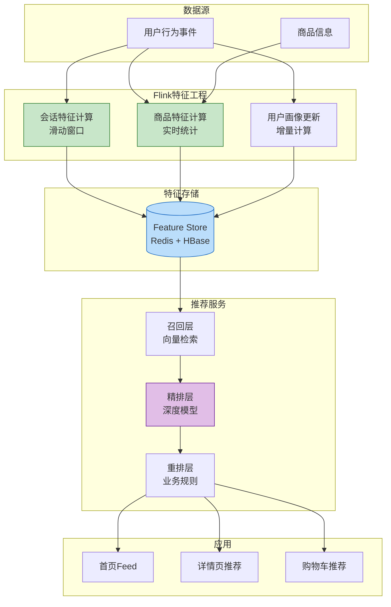
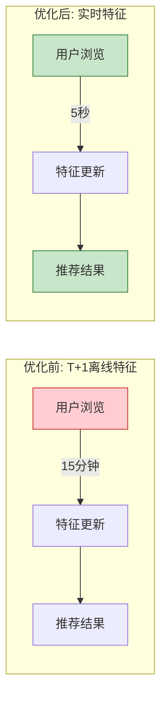

# 电商行业案例: 实时推荐系统

> **所属阶段**: Knowledge/10-case-studies/ecommerce | **前置依赖**: [../../02-design-patterns/pattern-realtime-feature-engineering.md](../../02-design-patterns/pattern-realtime-feature-engineering.md) | **形式化等级**: L4

---

## 目录

- [电商行业案例: 实时推荐系统](#电商行业案例-实时推荐系统)
  - [目录](#目录)
  - [1. 概念定义 (Definitions)](#1-概念定义-definitions)
    - [1.1 实时推荐系统定义](#11-实时推荐系统定义)
    - [1.2 推荐质量指标](#12-推荐质量指标)
    - [1.3 特征时效性](#13-特征时效性)
  - [2. 属性推导 (Properties)](#2-属性推导-properties)
    - [2.1 特征实时性保证](#21-特征实时性保证)
    - [2.2 召回-精排延迟权衡](#22-召回-精排延迟权衡)
  - [3. 关系建立 (Relations)](#3-关系建立-relations)
    - [3.1 与Feature Store的关系](#31-与feature-store的关系)
    - [3.2 推荐系统组件关系](#32-推荐系统组件关系)
  - [4. 论证过程 (Argumentation)](#4-论证过程-argumentation)
    - [4.1 实时vs离线推荐](#41-实时vs离线推荐)
    - [4.2 特征工程策略](#42-特征工程策略)
  - [5. 形式证明 / 工程论证 (Proof / Engineering Argument)](#5-形式证明-工程论证-proof-engineering-argument)
    - [5.1 特征工程架构](#51-特征工程架构)
    - [5.2 A/B测试指标计算](#52-ab测试指标计算)
  - [6. 实例验证 (Examples)](#6-实例验证-examples)
    - [6.1 案例背景](#61-案例背景)
    - [6.2 实施效果](#62-实施效果)
    - [6.3 技术架构](#63-技术架构)
  - [7. 可视化 (Visualizations)](#7-可视化-visualizations)
    - [7.1 实时推荐系统架构](#71-实时推荐系统架构)
    - [7.2 特征时效性对比](#72-特征时效性对比)
  - [8. 引用参考 (References)](#8-引用参考-references)

---

## 1. 概念定义 (Definitions)

### 1.1 实时推荐系统定义

**Def-K-10-04-01** (实时推荐系统): 实时推荐系统是一个五元组 $\mathcal{R} = (U, I, C, F, \mathcal{M})$：

- $U$：用户集合，$|U| = N_u$
- $I$：商品集合，$|I| = N_i$
- $C$：上下文集合（时间、位置、设备等）
- $F$：特征工程函数，$F: U \times I \times C \rightarrow \mathbb{R}^d$
- $\mathcal{M}$：推荐模型，$\mathcal{M}: \mathbb{R}^d \rightarrow \mathbb{R}^{N_i}$

### 1.2 推荐质量指标

**Def-K-10-04-02** (推荐效果度量): 推荐系统效果通过以下指标衡量：

| 指标 | 定义 | 计算公式 |
|------|------|---------|
| **CTR** | 点击率 | $\frac{\text{clicks}}{\text{impressions}}$ |
| **CVR** | 转化率 | $\frac{\text{conversions}}{\text{clicks}}$ |
| **GMV** | 成交总额 | $\sum \text{price} \times \text{quantity}$ |
| **多样性** | 推荐多样性 | $1 - \frac{\sum_{i,j} sim(i,j)}{N(N-1)/2}$ |

### 1.3 特征时效性

**Def-K-10-04-03** (特征新鲜度): 特征向量 $f(t)$ 的新鲜度定义为：

$$
Freshness(f) = e^{-\lambda \cdot (t_{current} - t_{update})}
$$

其中 $\lambda$ 为衰减系数，实时特征要求 $Freshness(f) > 0.9$。

---

## 2. 属性推导 (Properties)

### 2.1 特征实时性保证

**Lemma-K-10-04-01**: 特征更新延迟 $L_{feature}$ 与推荐效果正相关：

$$
CTR \propto \frac{1}{1 + \alpha \cdot L_{feature}}
$$

其中 $\alpha$ 为场景敏感系数。

### 2.2 召回-精排延迟权衡

**Lemma-K-10-04-02**: 设召回延迟为 $L_{recall}$，精排延迟为 $L_{rank}$，总延迟 $L_{total}$：

$$
L_{total} = L_{recall} + L_{rank} \leq L_{SLA}
$$

**Thm-K-10-04-01**: 当 $L_{SLA} = 200$ms，推荐效果最优的资源分配满足：

$$
\frac{\partial CTR}{\partial L_{recall}} = \frac{\partial CTR}{\partial L_{rank}}
$$

---

## 3. 关系建立 (Relations)

### 3.1 与Feature Store的关系

```
实时事件流 ──► Flink特征计算 ──► Feature Store
                         │           │
                         ▼           ▼
                    在线特征      离线特征
                         │           │
                         └─────┬─────┘
                               ▼
                         推荐模型推理
```

### 3.2 推荐系统组件关系

| 组件 | 职责 | 延迟要求 |
|------|------|---------|
| 召回层 | 从百万商品筛选候选集 | < 50ms |
| 粗排层 | 快速排序候选集(1000→100) | < 30ms |
| 精排层 | 深度模型排序(100→10) | < 100ms |
| 重排层 | 多样性、业务规则调整 | < 20ms |

---

## 4. 论证过程 (Argumentation)

### 4.1 实时vs离线推荐

| 维度 | 实时推荐 | 离线推荐 |
|------|---------|---------|
| 特征时效 | 秒级 | 小时/天级 |
| CTR | 高（+30%） | 基准 |
| 计算成本 | 高 | 低 |
| 冷启动 | 可实时响应 | 无法响应 |

### 4.2 特征工程策略

**实时特征**：

- 当前会话行为
- 实时热点商品
- 实时库存状态

**近实时特征**（Flink窗口）：

- 最近1小时浏览统计
- 实时趋势特征

**离线特征**：

- 用户长期画像
- 商品基础属性

---

## 5. 形式证明 / 工程论证 (Proof / Engineering Argument)

### 5.1 特征工程架构

```java
/**
 * 实时特征工程管道
 */
public class RealtimeFeatureEngineering {

    public static void main(String[] args) throws Exception {
        StreamExecutionEnvironment env = StreamExecutionEnvironment.getExecutionEnvironment();
        env.enableCheckpointing(60000);
        env.setParallelism(128);

        // 1. 用户行为事件
        DataStream<UserEvent> events = env
            .fromSource(createKafkaSource(), WatermarkStrategy.noWatermarks(), "Events")
            .setParallelism(64);

        // 2. 实时会话特征（滑动窗口）
        DataStream<SessionFeature> sessionFeatures = events
            .keyBy(UserEvent::getUserId)
            .window(SlidingProcessingTimeWindows.of(Time.minutes(10), Time.minutes(1)))
            .aggregate(new SessionFeatureAggregate())
            .name("Session Features")
            .setParallelism(128);

        // 3. 实时商品特征
        DataStream<ItemFeature> itemFeatures = events
            .keyBy(UserEvent::getItemId)
            .window(SlidingProcessingTimeWindows.of(Time.minutes(5), Time.minutes(1)))
            .aggregate(new ItemFeatureAggregate())
            .name("Item Features")
            .setParallelism(256);

        // 4. 用户画像更新
        DataStream<UserProfile> userProfiles = events
            .keyBy(UserEvent::getUserId)
            .process(new UserProfileUpdateFunction())
            .name("User Profile Update")
            .setParallelism(128);

        // 5. 写入Feature Store
        sessionFeatures.addSink(new FeatureStoreSink<>("session_features"));
        itemFeatures.addSink(new FeatureStoreSink<>("item_features"));
        userProfiles.addSink(new FeatureStoreSink<>("user_profiles"));

        env.execute("Realtime Feature Engineering");
    }
}

/**
 * 会话特征聚合
 */
class SessionFeatureAggregate implements AggregateFunction<UserEvent, SessionAccumulator, SessionFeature> {

    @Override
    public SessionAccumulator createAccumulator() {
        return new SessionAccumulator();
    }

    @Override
    public SessionAccumulator add(UserEvent event, SessionAccumulator acc) {
        acc.eventCount++;
        acc.uniqueItems.add(event.getItemId());

        switch (event.getEventType()) {
            case CLICK -> acc.clickCount++;
            case CART -> acc.cartCount++;
            case PURCHASE -> {
                acc.purchaseCount++;
                acc.totalAmount += event.getAmount();
            }
        }

        if (event.getAmount() > 0) {
            acc.totalAmount += event.getAmount();
        }

        return acc;
    }

    @Override
    public SessionFeature getResult(SessionAccumulator acc) {
        return SessionFeature.builder()
            .eventCount(acc.eventCount)
            .uniqueItemCount(acc.uniqueItems.size())
            .clickCount(acc.clickCount)
            .cartCount(acc.cartCount)
            .purchaseCount(acc.purchaseCount)
            .conversionRate(acc.clickCount > 0 ? (double) acc.purchaseCount / acc.clickCount : 0)
            .avgOrderValue(acc.purchaseCount > 0 ? acc.totalAmount / acc.purchaseCount : 0)
            .build();
    }

    @Override
    public SessionAccumulator merge(SessionAccumulator a, SessionAccumulator b) {
        a.eventCount += b.eventCount;
        a.clickCount += b.clickCount;
        a.cartCount += b.cartCount;
        a.purchaseCount += b.purchaseCount;
        a.totalAmount += b.totalAmount;
        a.uniqueItems.addAll(b.uniqueItems);
        return a;
    }
}
```

### 5.2 A/B测试指标计算

```sql
-- Flink SQL: 实时CTR计算
CREATE TABLE impression (
    user_id STRING,
    item_id STRING,
    experiment_id STRING,
    impression_time TIMESTAMP(3),
    WATERMARK FOR impression_time AS impression_time - INTERVAL '1' SECOND
) WITH (
    'connector' = 'kafka',
    'topic' = 'recommendation.impressions',
    'format' = 'json'
);

CREATE TABLE click (
    user_id STRING,
    item_id STRING,
    click_time TIMESTAMP(3)
) WITH (
    'connector' = 'kafka',
    'topic' = 'recommendation.clicks',
    'format' = 'json'
);

-- 实时实验指标
CREATE TABLE experiment_metrics AS
SELECT
    experiment_id,
    TUMBLE_START(impression_time, INTERVAL '1' MINUTE) as window_start,
    COUNT(DISTINCT impression.user_id) as uv,
    COUNT(*) as impression_cnt,
    COUNT(DISTINCT click.user_id) as click_uv,
    COUNT(*) FILTER (WHERE click.user_id IS NOT NULL) as click_cnt,
    CAST(COUNT(*) FILTER (WHERE click.user_id IS NOT NULL) AS DOUBLE) / COUNT(*) as ctr,
    SUM(CASE WHEN click.user_id IS NOT NULL THEN 1 ELSE 0 END * item_price) as gmv
FROM impression
LEFT JOIN click ON impression.user_id = click.user_id
    AND impression.item_id = click.item_id
    AND click.click_time BETWEEN impression_time
        AND impression_time + INTERVAL '1' HOUR
GROUP BY experiment_id, TUMBLE(impression_time, INTERVAL '1' MINUTE);
```

---

## 6. 实例验证 (Examples)

### 6.1 案例背景

**平台**: 某头部电商平台

| 指标 | 数值 |
|-----|------|
| DAU | 1.5亿 |
| 商品数量 | 5000万+ |
| 日均PV | 100亿+ |
| 推荐场景 | 首页Feed、详情页、购物车 |

**挑战**：

1. 特征时效性差，推荐结果滞后用户兴趣变化
2. 冷启动用户转化率低
3. A/B测试反馈周期长
4. 实时热点捕捉不及时

### 6.2 实施效果

| 指标 | 优化前 | 优化后 | 提升 |
|------|-------|-------|------|
| 特征延迟 | 15分钟 | < 5秒 | 99.4%↓ |
| 首页CTR | 3.2% | 4.8% | 50%↑ |
| 详情页CVR | 8.5% | 11.2% | 32%↑ |
| 人均GMV | ¥128 | ¥168 | 31%↑ |
| 冷启动CTR | 0.8% | 2.1% | 162%↑ |

### 6.3 技术架构

```java
/**
 * 推荐特征服务
 */
@Component
public class RecommendationFeatureService {

    @Autowired
    private FeatureStoreClient featureStore;

    /**
     * 获取用户实时特征
     */
    public UserRealtimeFeatures getUserRealtimeFeatures(String userId) {
        // 从Flink计算的实时特征表查询
        SessionFeature session = featureStore.get("session_features", userId);
        UserProfile profile = featureStore.get("user_profiles", userId);

        return UserRealtimeFeatures.builder()
            .recentCategories(session.getBrowsedCategories())
            .recentBrands(session.getBrowsedBrands())
            .pricePreference(profile.getPricePreference())
            .categoryAffinity(profile.getCategoryAffinity())
            .realtimeIntent(session.getCurrentIntent())
            .build();
    }

    /**
     * 获取商品实时特征
     */
    public ItemRealtimeFeatures getItemRealtimeFeatures(String itemId) {
        ItemFeature item = featureStore.get("item_features", itemId);

        return ItemRealtimeFeatures.builder()
            .realtimeCtr(item.getCtrLastHour())
            .realtimeCvr(item.getCvrLastHour())
            .stockStatus(item.getStockStatus())
            .trendScore(item.getTrendScore())
            .build();
    }
}
```

---

## 7. 可视化 (Visualizations)

### 7.1 实时推荐系统架构



### 7.2 特征时效性对比



---

## 8. 引用参考 (References)


---

*文档版本: v1.0 | 最后更新: 2026-04-04*
