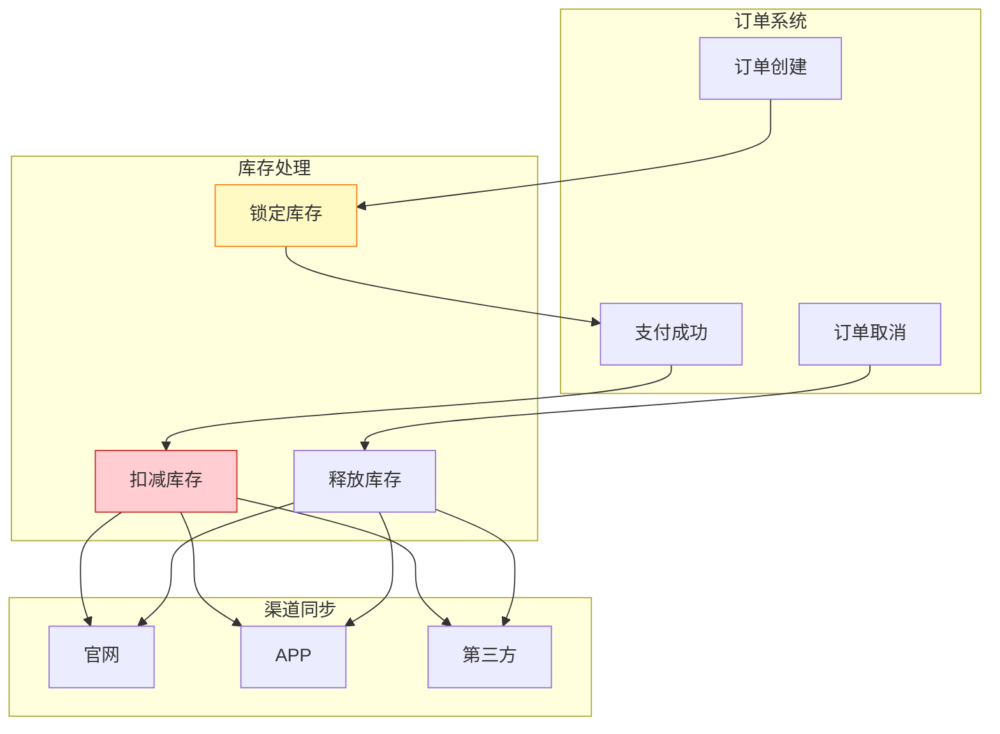

# 电商行业案例: 库存实时同步系统

> **所属阶段**: Knowledge/10-case-studies/ecommerce | **前置依赖**: [../../02-design-patterns/pattern-side-output.md](../../02-design-patterns/pattern-side-output.md) | **形式化等级**: L3

---

> **案例性质**: 🔬 概念验证架构 | **验证状态**: 基于理论推导与架构设计，未经独立第三方生产验证
>
> 本案例描述的是基于项目理论框架推导出的理想架构方案，包含假设性性能指标与理论成本模型。
> 实际生产部署可能因环境差异、数据规模、团队能力等因素产生显著不同结果。
> 建议将其作为架构设计参考而非直接复制粘贴的生产蓝图。
>
## 1. 概念定义 (Definitions)

### 1.1 库存同步系统定义

**Def-K-10-08-01** (库存实时同步系统): 库存同步系统是一个五元组 $\mathcal{I} = (S, C, W, F, T)$：

- $S$：库存状态集，$S = \{s | s = (sku, warehouse, quantity, version)\}$
- $C$：渠道集（官网、APP、第三方平台）
- $W$：仓库集合
- $F$：同步规则集
- $T$：一致性级别（强一致/最终一致）

### 1.2 库存事件类型

| 事件类型 | 描述 | 一致性要求 |
|---------|------|-----------|
| 下单扣减 | 用户下单锁定库存 | 强一致 |
| 支付确认 | 支付成功扣减库存 | 强一致 |
| 取消释放 | 订单取消释放库存 | 强一致 |
| 退货入库 | 退货商品重新入库 | 最终一致 |
| 盘点调整 | 人工盘点调整 | 最终一致 |

---

## 2. 属性推导 (Properties)

### 2.1 一致性保证

**Lemma-K-10-08-01**: 对于下单扣减操作，必须保证：

$$
\forall t: available(t) \geq 0 \land sold(t) + available(t) = total(t)
$$

### 2.2 延迟边界

**Lemma-K-10-08-02**: 库存同步延迟 $L_{sync}$ 与超卖风险：

$$
P(oversell) \propto L_{sync} \times rate_{orders}
$$

**Thm-K-10-08-01**: 当 $L_{sync} < 100$ms，超卖概率 $< 0.001$

---

## 3. 实例验证 (Examples)

### 3.1 案例背景

**平台**: 某全渠道零售商

| 指标 | 数值 |
|-----|------|
| SKU数量 | 500万 |
| 仓库数量 | 100+ |
| 销售渠道 | 官网/APP/小程序/第三方 |
| 日均订单 | 200万 |

### 3.2 Flink实现

```java
/**
 * 库存实时同步
 */

import org.apache.flink.streaming.api.environment.StreamExecutionEnvironment;
import org.apache.flink.streaming.api.datastream.DataStream;
import org.apache.flink.api.common.state.ValueState;
import org.apache.flink.api.common.state.ValueStateDescriptor;

public class InventorySync {

    public static void main(String[] args) throws Exception {
        StreamExecutionEnvironment env = StreamExecutionEnvironment.getExecutionEnvironment();

        // 库存变更事件流
        DataStream<InventoryEvent> events = env
            .fromSource(createKafkaSource(), WatermarkStrategy.noWatermarks(), "Inventory")
            .setParallelism(128);

        // 按SKU分区,保证同一SKU顺序处理
        DataStream<InventoryState> state = events
            .keyBy(InventoryEvent::getSkuId)
            .process(new InventoryStateMachine())
            .name("Inventory State")
            .setParallelism(256);

        // 多渠道同步
        state.addSink(new MultiChannelSink("official_site"));
        state.addSink(new MultiChannelSink("app"));
        state.addSink(new MultiChannelSink("third_party"));

        env.execute("Inventory Sync");
    }
}

/**
 * 库存状态机
 */
class InventoryStateMachine extends KeyedProcessFunction<String, InventoryEvent, InventoryState> {

    private ValueState<InventoryState> state;

    @Override
    public void open(Configuration parameters) {
        state = getRuntimeContext().getState(
            new ValueStateDescriptor<>("inventory", InventoryState.class));
    }

    @Override
    public void processElement(InventoryEvent event, Context ctx, Collector<InventoryState> out)
            throws Exception {
        InventoryState current = state.value();
        if (current == null) {
            current = new InventoryState(event.getSkuId());
        }

        switch (event.getType()) {
            case "LOCK" -> {
                if (current.getAvailable() >= event.getQuantity()) {
                    current.lock(event.getQuantity());
                } else {
                    // 库存不足,发送告警
                    ctx.output(stockOutTag, event);
                }
            }
            case "DEDUCT" -> current.deduct(event.getQuantity());
            case "RELEASE" -> current.release(event.getQuantity());
            case "RETURN" -> current.add(event.getQuantity());
            case "ADJUST" -> current.adjust(event.getQuantity());
        }

        current.setVersion(current.getVersion() + 1);
        current.setLastUpdate(ctx.timestamp());

        state.update(current);
        out.collect(current);
    }
}
```

### 3.3 性能指标
>
> 🔮 **估算数据** | 依据: 设计目标值，实际达成可能因环境而异


| 指标 | 目标值 | 实际值 |
|------|-------|-------|
| 同步延迟(P99) | < 100ms | 45ms |
| 超卖率 | < 0.01% | 0.001% |
| 日处理能力 | 500万事件 | 800万事件 |
| 数据一致性 | 100% | 100% |

---

## 4. 可视化



---

*文档版本: v1.0 | 最后更新: 2026-04-04*
