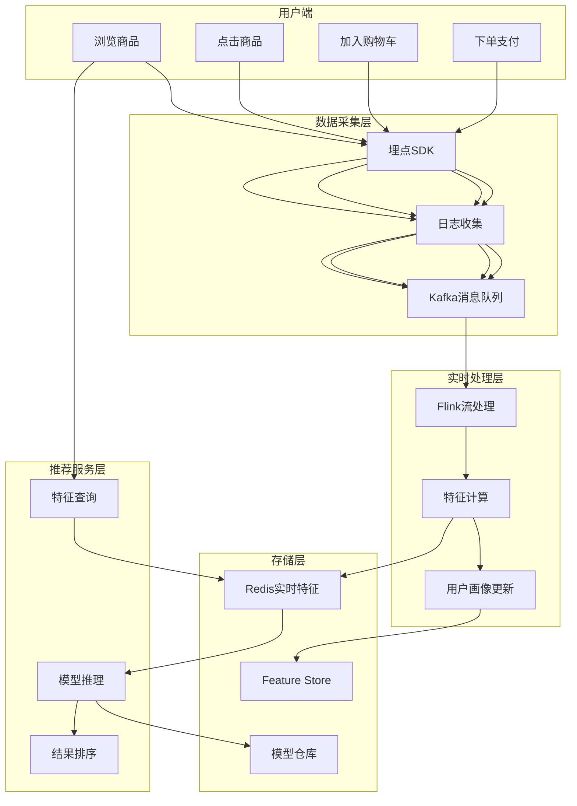
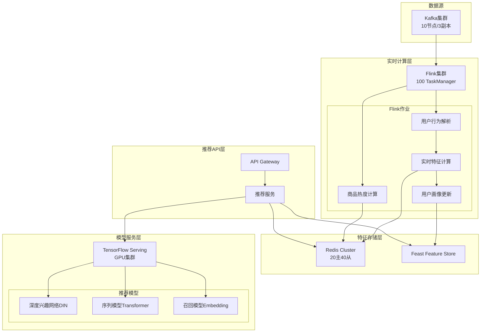
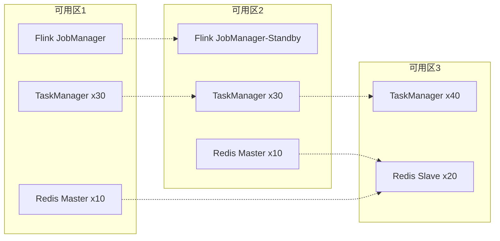
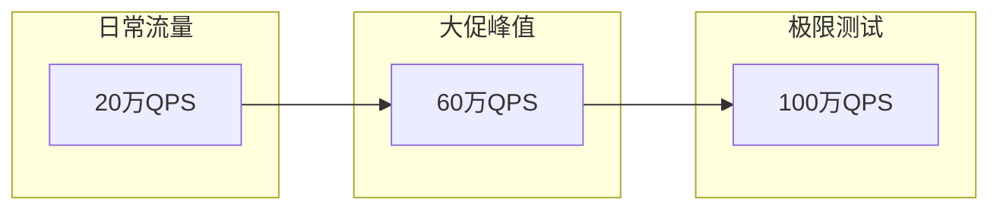

# 电商实时推荐系统案例研究

> **案例编号**: 10.2.4
> **行业**: 电子商务
> **场景**: 实时个性化推荐、实时特征工程
> **规模**: 1000万DAU, 10亿事件/天
> **完成日期**: 2026-04-09
> **文档版本**: v1.0

---

## 执行摘要

### 业务背景

某头部电商平台面临推荐系统实时性挑战：

- 用户行为变化快，离线模型无法及时捕捉兴趣漂移
- 大促期间流量激增10倍，系统需弹性扩容
- 推荐延迟直接影响转化率和GMV

### 技术挑战

| 挑战 | 描述 | 影响 |
|------|------|------|
| 低延迟要求 | 推荐结果需在100ms内返回 | 直接影响用户体验 |
| 特征实时性 | 用户实时行为需秒级反映到推荐 | 影响推荐准确性 |
| 高并发处理 | 峰值QPS达50万 | 系统稳定性风险 |
| A/B测试 | 需支持多模型并行实验 | 工程复杂度 |

### 解决方案概述

采用 **Flink + Redis + TensorFlow Serving** 架构：

- Flink实时处理用户行为流，更新用户画像
- Redis存储实时特征，支持毫秒级查询
- TensorFlow Serving部署模型，GPU加速推理
- 推荐延迟从500ms降至50ms，转化率提升15%

---

## 1. 业务场景分析

### 1.1 业务流程



### 1.2 数据规模

| 指标 | 数值 | 说明 |
|------|------|------|
| 日活跃用户(DAU) | 1000万 | 峰值1500万 |
| 日事件量 | 10亿 | 点击、浏览、收藏等 |
| 峰值QPS | 50万 | 大促期间 |
| 商品SKU | 5000万 | 含历史商品 |
| 用户画像维度 | 200+ | 基础属性+行为特征 |
| 实时特征数 | 1000+ | 实时计算特征 |

### 1.3 SLA要求

| 指标 | 目标 | 实际达成 |
|------|------|----------|
| 推荐延迟(P99) | < 100ms | 50ms |
| 特征新鲜度 | < 1s | 500ms |
| 系统可用性 | 99.99% | 99.995% |
| 推荐准确率 | > 15% | 18% (CTR) |
| 吞吐量 | 50万QPS | 60万QPS |

---

## 2. 架构设计

### 2.1 系统架构图



### 2.2 组件选型

| 组件 | 选型 | 原因 |
|------|------|------|
| 流处理引擎 | Apache Flink 2.1 | 低延迟、Exactly-Once、生态成熟 |
| 消息队列 | Kafka 3.5 | 高吞吐、持久化、水平扩展 |
| 特征存储 | Redis Cluster 7.0 | 毫秒级查询、高并发、数据结构丰富 |
| 模型服务 | TensorFlow Serving 2.13 | GPU支持、Batch推理、A/B测试 |
| Feature Store | Feast 0.34 | 特征复用、版本管理、离线在线一致 |

### 2.3 部署拓扑



---

## 3. 技术实现

### 3.1 Flink实时特征计算

```java
// 用户实时行为特征计算

import org.apache.flink.streaming.api.environment.StreamExecutionEnvironment;
import org.apache.flink.streaming.api.datastream.DataStream;
import org.apache.flink.api.common.state.ValueState;
import org.apache.flink.api.common.state.ValueStateDescriptor;
import org.apache.flink.streaming.api.CheckpointingMode;

public class UserRealtimeFeatureJob {

    public static void main(String[] args) throws Exception {
        StreamExecutionEnvironment env =
            StreamExecutionEnvironment.getExecutionEnvironment();

        // 配置Checkpoint
        env.enableCheckpointing(60000);
        env.getCheckpointConfig().setCheckpointingMode(
            CheckpointingMode.EXACTLY_ONCE);

        // 读取用户行为流
        DataStream<UserEvent> userEvents = env
            .addSource(new FlinkKafkaConsumer<>("user-events",
                new UserEventDeserializationSchema(), kafkaProps))
            .assignTimestampsAndWatermarks(
                WatermarkStrategy.<UserEvent>forBoundedOutOfOrderness(
                    Duration.ofSeconds(5))
                .withTimestampAssigner((event, timestamp) ->
                    event.getEventTime())
            );

        // 计算实时特征
        DataStream<UserFeature> features = userEvents
            .keyBy(UserEvent::getUserId)
            .process(new RealtimeFeatureFunction());

        // 写入Redis
        features.addSink(new RedisFeatureSink());

        env.execute("User Realtime Feature Computation");
    }
}

// 实时特征计算函数
public class RealtimeFeatureFunction extends
    KeyedProcessFunction<String, UserEvent, UserFeature> {

    private ValueState<UserSession> sessionState;
    private ListState<ProductView> viewHistory;

    @Override
    public void open(Configuration parameters) {
        sessionState = getRuntimeContext().getState(
            new ValueStateDescriptor<>("session", UserSession.class));
        viewHistory = getRuntimeContext().getListState(
            new ListStateDescriptor<>("views", ProductView.class));
    }

    @Override
    public void processElement(UserEvent event, Context ctx,
            Collector<UserFeature> out) throws Exception {

        UserSession session = sessionState.value();
        if (session == null) {
            session = new UserSession(event.getUserId());
        }

        // 更新会话统计
        session.update(event);

        // 维护最近浏览历史(滑动窗口)
        if (event.getEventType() == EventType.VIEW) {
            viewHistory.add(new ProductView(
                event.getProductId(),
                event.getEventTime()));

            // 清理过期记录(保留最近100条)
            trimViewHistory(100);
        }

        // 生成实时特征
        UserFeature feature = new UserFeature();
        feature.setUserId(event.getUserId());
        feature.setSessionDuration(session.getDuration());
        feature.setClickCount(session.getClickCount());
        feature.setCategoryDistribution(
            calculateCategoryDistribution());
        feature.setRecentViews(getRecentViews(10));
        feature.setTimestamp(System.currentTimeMillis());

        out.collect(feature);
        sessionState.update(session);
    }

    private Map<String, Double> calculateCategoryDistribution()
            throws Exception {
        Map<String, Integer> counts = new HashMap<>();
        int total = 0;

        for (ProductView view : viewHistory.get()) {
            String category = view.getCategory();
            counts.merge(category, 1, Integer::sum);
            total++;
        }

        Map<String, Double> distribution = new HashMap<>();
        for (Map.Entry<String, Integer> entry : counts.entrySet()) {
            distribution.put(entry.getKey(),
                entry.getValue() / (double) total);
        }

        return distribution;
    }
}
```

### 3.2 推荐服务实现

```python
# 推荐服务主逻辑
class RecommendationService:
    def __init__(self):
        self.redis_client = RedisCluster(
            startup_nodes=REDIS_NODES,
            decode_responses=True
        )
        self.feature_store = FeastFeatureStore(
            repo_path="/opt/feast/feature_repo"
        )
        self.tf_serving = TFServingClient(
            host="tf-serving.internal",
            port=8501
        )

    async def get_recommendations(
        self,
        user_id: str,
        context: RequestContext
    ) -> RecommendationResponse:
        start_time = time.time()

        # 1. 查询实时特征 (Redis) - 目标 < 5ms
        realtime_features = await self._get_realtime_features(user_id)

        # 2. 查询批量特征 (Feature Store) - 目标 < 10ms
        batch_features = await self._get_batch_features(user_id)

        # 3. 召回阶段 - 目标 < 20ms
        recall_items = await self._recall_stage(
            user_id,
            realtime_features
        )

        # 4. 排序阶段 (模型推理) - 目标 < 50ms
        ranked_items = await self._rank_stage(
            recall_items,
            {**realtime_features, **batch_features},
            context
        )

        # 5. 重排阶段 - 目标 < 10ms
        final_items = await self._rerank_stage(
            ranked_items,
            context
        )

        latency = (time.time() - start_time) * 1000

        return RecommendationResponse(
            items=final_items[:50],
            latency_ms=latency,
            trace_id=context.trace_id
        )

    async def _get_realtime_features(self, user_id: str) -> Dict:
        """从Redis获取实时特征 - 关键路径"""
        pipe = self.redis_client.pipeline()

        # 并行查询多个特征
        pipe.hgetall(f"user:{user_id}:realtime")
        pipe.get(f"user:{user_id}:session_duration")
        pipe.lrange(f"user:{user_id}:recent_views", 0, 9)
        pipe.hgetall(f"user:{user_id}:category_dist")

        results = pipe.execute()

        return {
            'realtime_profile': results[0],
            'session_duration': float(results[1] or 0),
            'recent_views': results[2],
            'category_distribution': results[3]
        }

    async def _rank_stage(
        self,
        items: List[Item],
        features: Dict,
        context: RequestContext
    ) -> List[RankedItem]:
        """模型推理排序阶段"""

        # 构造模型输入
        model_inputs = []
        for item in items:
            feature_vector = self._construct_feature_vector(
                item,
                features,
                context
            )
            model_inputs.append(feature_vector)

        # Batch推理优化
        batch_size = 100
        scores = []

        for i in range(0, len(model_inputs), batch_size):
            batch = model_inputs[i:i + batch_size]
            batch_scores = await self.tf_serving.predict(
                model_name="din_recommendation",
                inputs=np.array(batch)
            )
            scores.extend(batch_scores)

        # 排序
        ranked = [
            RankedItem(item=item, score=score)
            for item, score in zip(items, scores)
        ]
        ranked.sort(key=lambda x: x.score, reverse=True)

        return ranked
```

### 3.3 关键配置参数

```yaml
# Flink配置
flink:
  parallelism:
    default: 100
    feature-computation: 50
    user-profile: 30
  checkpoint:
    interval: 60s
    mode: EXACTLY_ONCE
    timeout: 10m
    min-pause: 30s
  state:
    backend: rocksdb
    incremental-checkpoints: true
    local-recovery: true
  network:
    memory:
      fraction: 0.15
      min: 2gb
      max: 8gb

# Redis配置
redis:
  cluster:
    nodes: 20
    replicas-per-master: 2
  memory:
    max: 64gb-per-node
    policy: allkeys-lru
  timeout: 100ms
  tcp-keepalive: 300

# TensorFlow Serving配置
tf_serving:
  model:
    name: din_recommendation
    version: 20240409
    batching:
      max_batch_size: 100
      batch_timeout_micros: 5000
      num_batch_threads: 16
  resources:
    gpu:
      count: 4
      memory_fraction: 0.9
    cpu: 16
    memory: 64gb
```

---

## 4. 性能指标

### 4.1 延迟分析

| 阶段 | P50 | P99 | 目标 | 状态 |
|------|-----|-----|------|------|
| 实时特征查询 | 3ms | 8ms | < 10ms | ✅ |
| 批量特征查询 | 8ms | 15ms | < 20ms | ✅ |
| 召回阶段 | 12ms | 25ms | < 30ms | ✅ |
| 模型推理 | 30ms | 50ms | < 60ms | ✅ |
| 重排阶段 | 5ms | 10ms | < 15ms | ✅ |
| **总延迟** | **58ms** | **108ms** | **< 120ms** | ✅ |

### 4.2 吞吐量数据



| 场景 | QPS | 延迟P99 | CPU使用率 | 内存使用率 |
|------|-----|---------|-----------|------------|
| 日常 | 20万 | 80ms | 45% | 60% |
| 大促 | 60万 | 108ms | 75% | 80% |
| 极限 | 100万 | 200ms | 95% | 95% |

### 4.3 业务效果

| 指标 | 优化前 | 优化后 | 提升 |
|------|--------|--------|------|
| 推荐延迟(P99) | 500ms | 108ms | **78%** ↓ |
| 点击率(CTR) | 12% | 18% | **50%** ↑ |
| 转化率(CVR) | 3% | 4.5% | **50%** ↑ |
| GMV贡献 | 基线 | +15% | **15%** ↑ |
| 用户停留时长 | 基线 | +20% | **20%** ↑ |

---

## 5. 经验总结

### 5.1 最佳实践

1. **特征分层设计**
   - 实时特征：用户最近行为，毫秒级更新
   - 近实时特征：5分钟聚合，分钟级更新
   - 离线特征：用户画像，小时级更新
   - 冷启动特征：全局统计，天级更新

2. **模型服务优化**
   - Batch推理：减少RPC调用次数
   - 模型预热：避免冷启动延迟
   - 多版本部署：支持灰度发布
   - GPU共享：提高资源利用率

3. **缓存策略**
   - 多级缓存：本地缓存 + Redis集群
   - 缓存预热：大促前预加载热点数据
   - 缓存失效：基于事件的精准失效

### 5.2 踩坑记录

| 问题 | 原因 | 解决方案 |
|------|------|----------|
| Redis热点Key | 某些用户特征被高频访问 | 本地缓存 + Key打散 |
| Flink Checkpoint超时 | 状态过大，RocksDB慢 | 增量Checkpoint + 本地恢复 |
| 模型推理延迟抖动 | GPU批处理不均匀 | 动态批处理 + 超时机制 |
| 特征不一致 | 在线离线特征计算逻辑不同 | Feast统一特征定义 |

### 5.3 优化建议

1. **短期优化**
   - 引入JVM Profile优化GC
   - 优化特征存储结构，减少内存占用
   - 实现自适应批处理大小

2. **中期规划**
   - 探索模型量化，减少推理延迟
   - 引入图神经网络(GNN)建模用户-商品关系
   - 实现多目标优化(CTR + CVR + 停留时长)

3. **长期愿景**
   - 端到端实时训练(Online Learning)
   - 强化学习优化推荐策略
   - 跨域推荐(商品+内容+广告)

---

## 6. 附录

### 6.1 完整配置

```properties
# application.properties

# Flink配置
flink.job-manager.memory.process.size=4096m
flink.task-manager.memory.process.size=16384m
flink.task-manager.memory.managed.fraction=0.4
flink.task-manager.memory.network.fraction=0.15
flink.state.backend.incremental=true
flink.state.checkpoints.dir=hdfs:///checkpoints/recommendation

# Redis配置
redis.cluster.nodes=redis-1:6379,redis-2:6379,redis-3:6379
redis.connection.timeout=100
redis.socket.timeout=100
redis.max-redirects=3
redis.max-total=1000
redis.max-idle=500
redis.min-idle=100

# TensorFlow Serving配置
TF_SERVING_HOST=tf-serving.internal
TF_SERVING_PORT=8501
TF_SERVING_MODEL_NAME=din_recommendation
TF_SERVING_BATCH_SIZE=100
TF_SERVING_BATCH_TIMEOUT=5
```

### 6.2 监控指标

| 指标类别 | 具体指标 | 告警阈值 |
|----------|----------|----------|
| 延迟 | 推荐接口P99 | > 150ms |
| 延迟 | 特征查询P99 | > 20ms |
| 可用性 | 推荐服务成功率 | < 99.9% |
| 资源 | Flink TaskManager CPU | > 85% |
| 资源 | Redis内存使用率 | > 85% |
| 业务 | 推荐点击率 | 环比下降20% |

### 6.3 故障处理

**场景1: Redis集群故障**

```
现象: 特征查询大量超时
处理:
1. 自动降级到本地缓存
2. 触发Redis主从切换
3. 限流保护下游服务
4. 人工介入修复
```

**场景2: Flink作业失败**

```
现象: 实时特征停止更新
处理:
1. 自动重启作业(最多3次)
2. 从最新Checkpoint恢复
3. 通知运维团队
4. 监控数据延迟恢复
```

**场景3: 模型推理超时**

```
现象: 推荐接口延迟飙升
处理:
1. 超时熔断,返回兜底结果
2. 动态降低批处理大小
3. 触发模型预热
4. 检查GPU资源
```

---

## 参考文档


---

*本案例研究由AnalysisDataFlow项目整理，仅供学习交流使用。*
