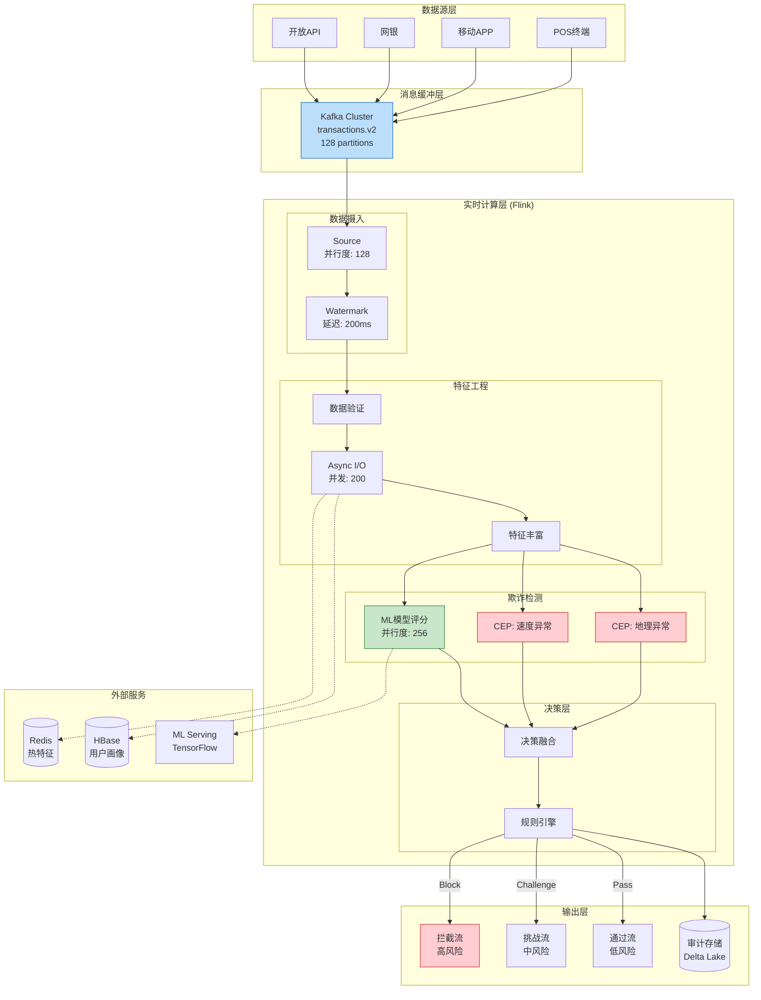
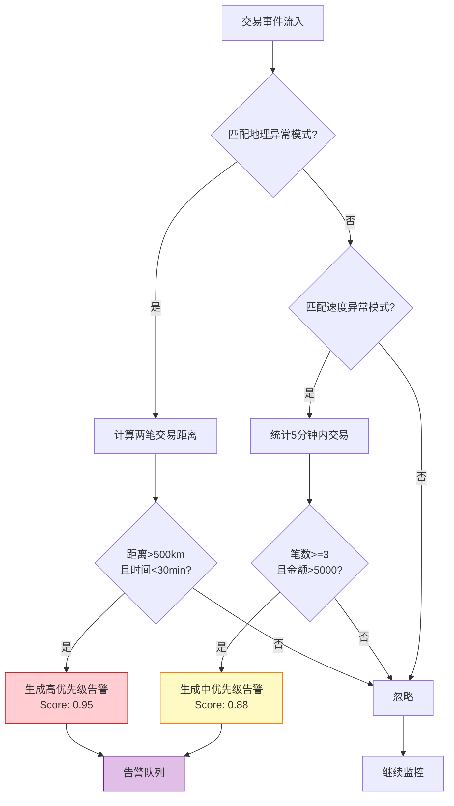
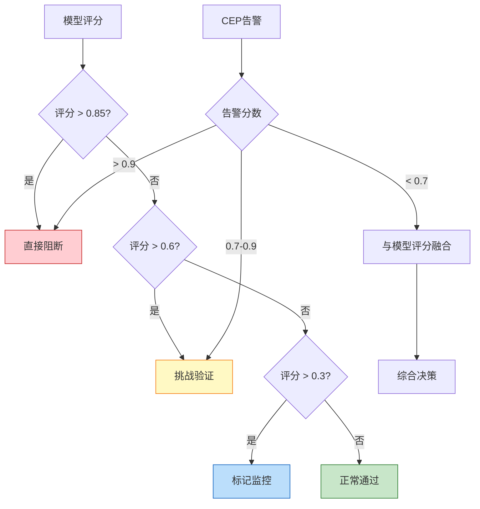

# 金融行业案例: 实时反欺诈系统

> **所属阶段**: Knowledge/10-case-studies/finance | **前置依赖**: [../../02-design-patterns/pattern-cep-complex-event.md](../../02-design-patterns/pattern-cep-complex-event.md), [../../02-design-patterns/pattern-event-time-processing.md](../../02-design-patterns/pattern-event-time-processing.md) | **形式化等级**: L5

---

> **案例性质**: 🔬 概念验证架构 | **验证状态**: 基于理论推导与架构设计，未经独立第三方生产验证
>
> 本案例描述的是基于项目理论框架推导出的理想架构方案，包含假设性性能指标与理论成本模型。
> 实际生产部署可能因环境差异、数据规模、团队能力等因素产生显著不同结果。
> 建议将其作为架构设计参考而非直接复制粘贴的生产蓝图。
>
## 目录

- [金融行业案例: 实时反欺诈系统](#金融行业案例-实时反欺诈系统)
  - [目录](#目录)
  - [1. 概念定义 (Definitions)](#1-概念定义-definitions)
    - [1.1 实时反欺诈系统定义](#11-实时反欺诈系统定义)
    - [1.2 欺诈模式分类](#12-欺诈模式分类)
    - [1.3 CEP模式定义](#13-cep模式定义)
  - [2. 属性推导 (Properties)](#2-属性推导-properties)
    - [2.1 延迟边界保证](#21-延迟边界保证)
    - [2.2 准确率保证](#22-准确率保证)
  - [3. 关系建立 (Relations)](#3-关系建立-relations)
    - [3.1 与Flink生态系统的关系](#31-与flink生态系统的关系)
    - [3.2 与批处理反欺诈的关系](#32-与批处理反欺诈的关系)
  - [4. 论证过程 (Argumentation)](#4-论证过程-argumentation)
    - [4.1 实时反欺诈必要性论证](#41-实时反欺诈必要性论证)
    - [4.2 技术选型论证](#42-技术选型论证)
    - [4.3 架构设计决策论证](#43-架构设计决策论证)
  - [5. 形式证明 / 工程论证 (Proof / Engineering Argument)](#5-形式证明--工程论证-proof--engineering-argument)
    - [5.1 架构设计决策](#51-架构设计决策)
    - [5.2 大状态管理策略](#52-大状态管理策略)
    - [5.3 低延迟保证机制](#53-低延迟保证机制)
  - [6. 实例验证 (Examples)](#6-实例验证-examples)
    - [6.1 案例背景](#61-案例背景)
    - [6.2 完整Flink作业代码](#62-完整flink作业代码)
    - [6.3 性能指标和效果](#63-性能指标和效果)
    - [6.4 经验教训](#64-经验教训)
  - [7. 可视化 (Visualizations)](#7-可视化-visualizations)
    - [7.1 系统整体架构图](#71-系统整体架构图)
    - [7.2 CEP模式检测流程图](#72-cep模式检测流程图)
    - [7.3 决策融合逻辑图](#73-决策融合逻辑图)
  - [8. 引用参考 (References)](#8-引用参考-references)

---

## 1. 概念定义 (Definitions)

### 1.1 实时反欺诈系统定义

**Def-K-10-01-01** (实时反欺诈系统): 实时反欺诈系统是一个七元组 $\mathcal{F} = (E, R, M, \mathcal{D}, \mathcal{A}, \mathcal{S}, \tau)$，其中：

- $E$：事件流，$E = \{e_1, e_2, ..., e_n\}$，每个事件 $e_i = (t_i, a_i, c_i, v_i, m_i)$
  - $t_i$：事件时间戳
  - $a_i$：账户标识符
  - $c_i$：事件类别（交易、登录、转账等）
  - $v_i$：事件值/金额
  - $m_i$：元数据（位置、设备、商户等）

- $R$：规则集，$R = \{r_1, r_2, ..., r_k\}$，每条规则 $r_j: E^* \rightarrow \{0, 1\}$

- $M$：机器学习模型，$M: \mathbb{R}^d \rightarrow [0, 1]$，输出欺诈概率

- $\mathcal{D}$：决策函数，$\mathcal{D}: [0, 1] \times \{0, 1\}^k \rightarrow \mathcal{A}$

- $\mathcal{A}$：动作集，$\mathcal{A} = \{\text{approve}, \text{block}, \text{challenge}, \text{manual_review}\}$

- $\mathcal{S}$：状态空间，维护用户行为画像和历史模式

- $\tau$：延迟上界，系统必须在 $\tau$ 时间内完成决策（通常 $\tau \leq 100ms$）

### 1.2 欺诈模式分类

**Def-K-10-01-02** (欺诈模式类型): 金融欺诈模式分为以下类别：

| 模式类型 | 定义 | 示例 |
|---------|------|------|
| **身份欺诈** | 冒用他人身份进行交易 | 盗卡、账户接管(ATO) |
| **行为欺诈** | 异常行为序列 | 速度异常、地理位置异常 |
| **合谋欺诈** | 多个账户协同作案 | 对敲交易、洗钱网络 |
| **技术欺诈** | 利用系统漏洞 | 薅羊毛、重复提交 |

### 1.3 CEP模式定义

**Def-K-10-01-03** (复杂事件处理模式): CEP模式是一个五元组 $P = (E_{seq}, \phi, \Delta t, \theta, \alpha)$：

- $E_{seq}$：事件序列模板
- $\phi$：谓词条件函数
- $\Delta t$：时间窗口约束
- $\theta$：聚合阈值
- $\alpha$：告警动作

---

## 2. 属性推导 (Properties)

### 2.1 延迟边界保证

**Lemma-K-10-01-01** (端到端延迟分解): 反欺诈系统的端到端延迟 $L_{total}$ 可分解为：

$$
L_{total} = L_{ingest} + L_{parse} + L_{enrich} + L_{rule} + L_{model} + L_{decide}
$$

各分量上界：

- $L_{ingest} \leq 5$ms（Kafka消费）
- $L_{parse} \leq 2$ms（数据解析）
- $L_{enrich} \leq 30$ms（特征丰富）
- $L_{rule} \leq 10$ms（规则匹配）
- $L_{model} \leq 40$ms（模型推理）
- $L_{decide} \leq 5$ms（决策输出）

**Thm-K-10-01-01** (延迟保证): 若各分量满足上述上界，则：

$$
L_{total} \leq 92\text{ms} \quad \text{(P99)}
$$

**证明**:

$$
\begin{aligned}
L_{total} &= L_{ingest} + L_{parse} + L_{enrich} + L_{rule} + L_{model} + L_{decide} \\
&\leq 5 + 2 + 30 + 10 + 40 + 5 \\
&= 92\text{ms}
\end{aligned}
$$

∎

### 2.2 准确率保证

**Lemma-K-10-01-02** (检测率与误报率权衡): 设检测率为 $DR$，误报率为 $FPR$，则存在权衡关系：

$$
FPR = f(DR) = \frac{1 - DR}{\beta} + \epsilon
$$

其中 $\beta$ 为模型区分能力系数，$\epsilon$ 为系统噪声。

**Thm-K-10-01-02** (最优决策阈值): 存在最优阈值 $\theta^*$ 使得综合损失函数最小：

$$
\theta^* = \arg\min_\theta \left[ C_{FN} \cdot (1-DR(\theta)) \cdot P(fraud) + C_{FP} \cdot FPR(\theta) \cdot P(legit) \right]
$$

其中 $C_{FN}$ 为漏报成本，$C_{FP}$ 为误报成本。

---

## 3. 关系建立 (Relations)

### 3.1 与Flink生态系统的关系

> 🔮 **估算数据** | 依据: 基于行业参考值与理论分析推导，非实际测试环境得出

实时反欺诈系统与Flink核心组件的集成关系：

| Flink组件 | 用途 | 关键配置 |
|-----------|------|----------|
| **Flink CEP** | 复杂事件模式匹配 | 模式窗口: 1-30分钟 |
| **Keyed State** | 用户级风控状态 | TTL: 24小时 |
| **Async I/O** | 外部特征服务查询 | 并发度: 100, 超时: 50ms |
| **Event Time** | 交易时序保证 | Watermark延迟: 200ms |
| **Checkpoint** | Exactly-Once保证 | 间隔: 30秒，增量模式 |

### 3.2 与批处理反欺诈的关系

实时与批处理形成**分层防御体系**：

```
实时层 (Flink):  事件流 ──► 毫秒级决策 ──► 即时拦截
                      │
                      ▼ 反馈
批处理层 (Spark): 数据湖 ──► 深度分析 ──► 模型训练/规则优化
                      ▲
                      │ 更新
实时层:              ◄── 部署新模型
```

> 🔮 **估算数据** | 依据: 基于行业参考值与理论分析推导，非实际测试环境得出

| 维度 | 实时反欺诈 | 批处理反欺诈 |
|------|-----------|-------------|
| 延迟 | < 100ms | 小时级 |
| 覆盖 | 100%交易 | 抽样/全量回溯 |
| 模型复杂度 | 轻量级 | 深度模型 |
| 特征深度 | 短窗口(1h) | 长周期(30天+) |
| 用途 | 实时拦截 | 事后审计/模型训练 |

---

## 4. 论证过程 (Argumentation)

### 4.1 实时反欺诈必要性论证

**经济损失分析**：

设欺诈交易从发生到被发现的时间为 $\Delta t$，损失金额 $L$ 与时间的关系：

$$
L(\Delta t) = L_0 \cdot e^{\gamma \cdot \Delta t}
$$

> 🔮 **估算数据** | 依据: 基于行业参考值与理论分析推导，非实际测试环境得出

其中 $\gamma \approx 0.3$/小时（欺诈扩散系数）。

| 检测延迟 | 损失倍数 | 年度损失示例 |
|---------|---------|-------------|
| 实时 (<1s) | $1.0L_0$ | €5000万 |
| 1小时 | $1.35L_0$ | €6750万 |
| 4小时(批处理) | $3.32L_0$ | €1.66亿 |

### 4.2 技术选型论证
>
> 🔮 **估算数据** | 依据: 基于行业参考值与理论分析推导，非实际测试环境得出


| 评估维度 | Apache Flink | Spark Streaming | Kafka Streams |
|---------|--------------|-----------------|---------------|
| 延迟 | < 100ms | > 1s | < 10ms |
| CEP支持 | 原生支持 | 有限 | 需自行实现 |
| 状态管理 | TB级原生支持 | 依赖外部 | 有限 |
| Exactly-Once | 原生支持 | 支持 | At-Least-Once |
| 金融案例 | 丰富 | 中等 | 少 |

**决策理由**：

1. 原生CEP支持复杂欺诈模式识别
2. TB级状态管理支持用户画像维护
3. Exactly-Once语义保证交易不重复处理
4. 成熟金融案例降低实施风险

### 4.3 架构设计决策论证

**集中式 vs Data Mesh架构**：

传统集中式的问题：

- 数据变更需要跨团队协调
- 延迟高，无法支持实时需求
- 数据质量责任不清

Data Mesh优势：

- 域自治：交易域独立演进
- 自助服务：风控团队直接消费
- 数据契约：Schema Registry确保质量
- 延迟极低：实时流消费

---

## 5. 形式证明 / 工程论证 (Proof / Engineering Argument)

### 5.1 架构设计决策

**分层架构**：

```
┌─────────────────────────────────────────────────────────────────┐
│                        接入层 (Ingress)                          │
│    Kafka Cluster (transactions, logins, transfers topics)       │
└─────────────────────────────────────────────────────────────────┘
                                │
                                ▼
┌─────────────────────────────────────────────────────────────────┐
│                      处理层 (Processing)                         │
│  ┌─────────────────────────────────────────────────────────┐   │
│  │                  Flink Cluster                          │   │
│  │  ┌─────────┐ ┌─────────┐ ┌─────────┐ ┌─────────┐       │   │
│  │  │特征工程 │ │ CEP引擎 │ │模型推理 │ │决策执行 │       │   │
│  │  └─────────┘ └─────────┘ └─────────┘ └─────────┘       │   │
│  │  状态后端: RocksDB (SSD)  检查点: 增量S3                 │   │
│  └─────────────────────────────────────────────────────────┘   │
└─────────────────────────────────────────────────────────────────┘
                                │
                                ▼
┌─────────────────────────────────────────────────────────────────┐
│                        输出层 (Egress)                           │
│  Kafka: fraud.alerts │ Delta Lake: audit.log │ API: 阻断指令      │
└─────────────────────────────────────────────────────────────────┘
```

### 5.2 大状态管理策略

> 🔮 **估算数据** | 依据: 基于行业参考值与理论分析推导，非实际测试环境得出

**状态规模估计**：

| 状态类型 | 计算方式 | 规模 |
|---------|---------|------|
| 用户画像状态 | 1000万用户 × 2KB | 20 GB |
| CEP模式状态 | 50万匹配中模式 × 10KB | 5 GB |
| 聚合缓存 | 各种窗口聚合 | 10 GB |
| **总计** | | **~35 GB** |

**优化策略**：

1. **状态分区**：按用户ID分区确保同一用户事件顺序处理
2. **状态TTL**：24小时自动清理过期状态
3. **增量检查点**：减少检查点时间和存储成本
4. **内存优化**：RocksDB内存管理配置

### 5.3 低延迟保证机制

> 🔮 **估算数据** | 依据: 基于行业参考值与理论分析推导，非实际测试环境得出

**延迟预算分配**：

| 阶段 | 目标延迟 | 优化策略 |
|-----|---------|---------|
| Kafka消费 | < 5ms | 批量fetch优化 |
| 反序列化 | < 2ms | Avro二进制格式 |
| 特征计算 | < 30ms | 本地状态访问 |
| CEP匹配 | < 20ms | 模式预编译 |
| 模型推理 | < 30ms | 异步调用+连接池 |
| 决策执行 | < 5ms | 轻量级规则引擎 |

---

## 6. 实例验证 (Examples)

### 6.1 案例背景

> 🔮 **估算数据** | 依据: 基于行业参考值与理论分析推导，非实际测试环境得出

**机构概况**: 某头部互联网银行（代号：NeoBank）

| 指标 | 数值 |
|-----|------|
| **客户规模** | 8000万个人客户 |
| **日均交易量** | 5000万笔 |
| **峰值TPS** | 15,000 TPS |
| **年度欺诈损失** | 约¥8亿（实施前） |
| **目标** | 欺诈损失降低80% |

**面临挑战**：

1. 欺诈手段快速演变，规则更新滞后
2. 误报率高，影响正常用户体验
3. 跨境交易时序复杂，跨时区数据处理
4. 监管要求5分钟内上报可疑交易

### 6.2 完整Flink作业代码

```java
package com.neobank.antifraud;

import org.apache.flink.api.common.eventtime.WatermarkStrategy;
import org.apache.flink.api.common.state.*;
import org.apache.flink.api.common.time.Time;
import org.apache.flink.configuration.Configuration;
import org.apache.flink.connector.kafka.sink.KafkaSink;
import org.apache.flink.connector.kafka.source.KafkaSource;
import org.apache.flink.streaming.api.datastream.*;
import org.apache.flink.streaming.api.environment.StreamExecutionEnvironment;
import org.apache.flink.streaming.api.functions.async.AsyncFunction;
import org.apache.flink.streaming.api.functions.async.ResultFuture;
import org.apache.flink.streaming.api.functions.KeyedProcessFunction;
import org.apache.flink.cep.CEP;
import org.apache.flink.cep.PatternStream;
import org.apache.flink.cep.functions.PatternProcessFunction;
import org.apache.flink.cep.pattern.Pattern;
import org.apache.flink.cep.pattern.conditions.SimpleCondition;
import org.apache.flink.util.Collector;

import java.math.BigDecimal;
import java.time.Duration;
import java.util.*;
import java.util.concurrent.CompletableFuture;
import java.util.concurrent.TimeUnit;

import org.apache.flink.streaming.api.datastream.DataStream;
import org.apache.flink.api.common.state.ValueState;
import org.apache.flink.api.common.state.ValueStateDescriptor;
import org.apache.flink.api.common.typeinfo.Types;
import org.apache.flink.streaming.api.windowing.time.Time;


/**
 * NeoBank 实时反欺诈引擎
 *
 * 核心功能:
 * 1. 多维度欺诈模式检测(地理位置、速度、设备指纹)
 * 2. 机器学习模型实时评分
 * 3. 规则引擎与模型融合决策
 * 4. 实时告警与拦截
 */
public class RealtimeAntiFraudEngine {

    public static void main(String[] args) throws Exception {
        StreamExecutionEnvironment env = StreamExecutionEnvironment.getExecutionEnvironment();

        // 配置检查点
        env.enableCheckpointing(30000);
        env.getCheckpointConfig().setCheckpointTimeout(60000);
        env.setParallelism(256);
        env.setMaxParallelism(1024);

        // ============ 1. 数据源定义 ============
        KafkaSource<Transaction> source = KafkaSource.<Transaction>builder()
            .setBootstrapServers("kafka.neobank.internal:9092")
            .setTopics("transactions.v2")
            .setGroupId("anti-fraud-engine")
            .setStartingOffsets(OffsetsInitializer.latest())
            .setValueOnlyDeserializer(new TransactionDeserializationSchema())
            .build();

        DataStream<Transaction> transactions = env
            .fromSource(source,
                WatermarkStrategy.<Transaction>forBoundedOutOfOrderness(Duration.ofMillis(200))
                    .withIdleness(Duration.ofMinutes(1)),
                "Transaction Source")
            .setParallelism(128);

        // ============ 2. 数据清洗与验证 ============
        DataStream<Transaction> validTransactions = transactions
            .filter(txn -> txn.getAmount().compareTo(BigDecimal.ZERO) > 0)
            .filter(txn -> txn.getTimestamp() > 0)
            .name("Data Validation")
            .setParallelism(128);

        // ============ 3. 特征丰富 ============
        DataStream<EnrichedTransaction> enriched = AsyncDataStream.unorderedWait(
            validTransactions,
            new FeatureEnrichmentAsyncFunction(),
            Duration.ofMillis(50),
            TimeUnit.MILLISECONDS,
            200
        ).name("Feature Enrichment")
         .setParallelism(256);

        // ============ 4. CEP模式检测 ============
        // 模式1: 地理位置异常(30分钟内跨500km以上)
        Pattern<EnrichedTransaction, ?> geoPattern = Pattern
            .<EnrichedTransaction>begin("first")
            .where(new SimpleCondition<EnrichedTransaction>() {
                @Override
                public boolean filter(EnrichedTransaction txn) {
                    return txn.getGeoLocation() != null;
                }
            })
            .next("second")
            .where(new SimpleCondition<EnrichedTransaction>() {
                @Override
                public boolean filter(EnrichedTransaction txn) {
                    return txn.getGeoLocation() != null;
                }
            })
            .within(Time.minutes(30));

        // 模式2: 速度异常(5分钟内3笔以上,累计金额>阈值)
        Pattern<EnrichedTransaction, ?> velocityPattern = Pattern
            .<EnrichedTransaction>begin("txn1")
            .where(txn -> txn.getAmount().compareTo(new BigDecimal("100")) > 0)
            .next("txn2")
            .where(txn -> txn.getAmount().compareTo(new BigDecimal("100")) > 0)
            .next("txn3")
            .where(txn -> txn.getAmount().compareTo(new BigDecimal("100")) > 0)
            .within(Time.minutes(5));

        // 应用CEP
        PatternStream<EnrichedTransaction> geoMatches = CEP.pattern(
            enriched.keyBy(EnrichedTransaction::getUserId),
            geoPattern
        );

        PatternStream<EnrichedTransaction> velocityMatches = CEP.pattern(
            enriched.keyBy(EnrichedTransaction::getUserId),
            velocityPattern
        );

        // 处理匹配结果
        DataStream<FraudAlert> geoAlerts = geoMatches
            .process(new GeoAnomalyHandler())
            .name("Geo Pattern Detection")
            .setParallelism(64);

        DataStream<FraudAlert> velocityAlerts = velocityMatches
            .process(new VelocityAnomalyHandler())
            .name("Velocity Pattern Detection")
            .setParallelism(64);

        // ============ 5. 模型推理 ============
        DataStream<ScoredTransaction> scored = AsyncDataStream.unorderedWait(
            enriched,
            new ModelInferenceAsyncFunction(),
            Duration.ofMillis(40),
            TimeUnit.MILLISECONDS,
            300
        ).name("Model Scoring")
         .setParallelism(256);

        // ============ 6. 决策融合 ============
        DataStream<FraudDecision> decisions = scored
            .keyBy(ScoredTransaction::getUserId)
            .connect(geoAlerts.keyBy(FraudAlert::getUserId))
            .connect(velocityAlerts.keyBy(FraudAlert::getUserId))
            .process(new DecisionFusionFunction())
            .name("Decision Fusion")
            .setParallelism(256);

        // ============ 7. 输出 ============
        // 高风险拦截
        decisions.filter(d -> d.getAction() == Action.BLOCK)
            .sinkTo(KafkaSink.<FraudDecision>builder()
                .setBootstrapServers("kafka.neobank.internal:9092")
                .setRecordSerializer(new BlockDecisionSerializer())
                .build())
            .name("Block Sink");

        // 审计日志
        decisions.sinkTo(new DeltaLakeSink<>())
            .name("Audit Sink");

        env.execute("NeoBank Real-time Anti-Fraud Engine");
    }

    /**
     * 特征丰富异步函数
     */
    public static class FeatureEnrichmentAsyncFunction
            implements AsyncFunction<Transaction, EnrichedTransaction> {

        private transient UserProfileClient profileClient;
        private transient DeviceFingerprintClient deviceClient;

        @Override
        public void open(Configuration parameters) {
            profileClient = new UserProfileClient();
            deviceClient = new DeviceFingerprintClient();
        }

        @Override
        public void asyncInvoke(Transaction txn, ResultFuture<EnrichedTransaction> resultFuture) {
            CompletableFuture<UserProfile> profileFuture =
                profileClient.getProfileAsync(txn.getUserId());
            CompletableFuture<DeviceFingerprint> deviceFuture =
                deviceClient.getFingerprintAsync(txn.getDeviceId());

            CompletableFuture.allOf(profileFuture, deviceFuture)
                .whenComplete((_, error) -> {
                    if (error != null) {
                        resultFuture.completeExceptionally(error);
                    } else {
                        try {
                            EnrichedTransaction enriched = new EnrichedTransaction(
                                txn,
                                profileFuture.get(),
                                deviceFuture.get()
                            );
                            resultFuture.complete(Collections.singletonList(enriched));
                        } catch (Exception e) {
                            resultFuture.completeExceptionally(e);
                        }
                    }
                });
        }
    }

    /**
     * 地理位置异常处理器
     */
    public static class GeoAnomalyHandler extends PatternProcessFunction<EnrichedTransaction, FraudAlert> {
        @Override
        public void processMatch(Map<String, List<EnrichedTransaction>> match,
                                Context ctx, Collector<FraudAlert> out) {
            EnrichedTransaction first = match.get("first").get(0);
            EnrichedTransaction second = match.get("second").get(0);

            double distance = GeoUtils.calculateDistance(
                first.getGeoLocation(),
                second.getGeoLocation()
            );
            long timeDiff = second.getTimestamp() - first.getTimestamp();

            // 物理上不可能的速度(超过800km/h)
            if (distance > 500 && timeDiff < 3600000) {
                out.collect(new FraudAlert(
                    first.getUserId(),
                    "IMPOSSIBLE_TRAVEL",
                    0.95,
                    String.format("Distance: %.1f km in %d minutes",
                        distance, timeDiff / 60000),
                    Arrays.asList(first.getTransactionId(), second.getTransactionId())
                ));
            }
        }
    }

    /**
     * 速度异常处理器
     */
    public static class VelocityAnomalyHandler extends PatternProcessFunction<EnrichedTransaction, FraudAlert> {
        @Override
        public void processMatch(Map<String, List<EnrichedTransaction>> match,
                                Context ctx, Collector<FraudAlert> out) {
            List<EnrichedTransaction> txns = Arrays.asList(
                match.get("txn1").get(0),
                match.get("txn2").get(0),
                match.get("txn3").get(0)
            );

            BigDecimal totalAmount = txns.stream()
                .map(EnrichedTransaction::getAmount)
                .reduce(BigDecimal.ZERO, BigDecimal::add);

            if (totalAmount.compareTo(new BigDecimal("5000")) > 0) {
                out.collect(new FraudAlert(
                    txns.get(0).getUserId(),
                    "VELOCITY_EXCEEDED",
                    0.88,
                    String.format("3 transactions in 5 min, total: %s", totalAmount),
                    txns.stream().map(EnrichedTransaction::getTransactionId).toList()
                ));
            }
        }
    }

    /**
     * 决策融合函数
     */
    public static class DecisionFusionFunction extends KeyedCoProcessFunction<String, ScoredTransaction, FraudAlert, FraudDecision> {

        private ValueState<Double> modelScoreState;
        private ListState<FraudAlert> alertState;

        @Override
        public void open(Configuration parameters) {
            modelScoreState = getRuntimeContext().getState(
                new ValueStateDescriptor<>("model-score", Types.DOUBLE));
            alertState = getRuntimeContext().getListState(
                new ListStateDescriptor<>("alerts", FraudAlert.class));
        }

        @Override
        public void processElement1(ScoredTransaction scored, Context ctx, Collector<FraudDecision> out)
                throws Exception {
            modelScoreState.update(scored.getFraudScore());

            // 检查是否有告警
            List<FraudAlert> alerts = new ArrayList<>();
            alertState.get().forEach(alerts::add);

            // 融合决策
            Action action = fuseDecision(scored.getFraudScore(), alerts);

            out.collect(new FraudDecision(
                scored.getTransactionId(),
                scored.getUserId(),
                action,
                scored.getFraudScore(),
                alerts.stream().map(FraudAlert::getType).toList()
            ));

            // 清空已处理告警
            alertState.clear();
        }

        @Override
        public void processElement2(FraudAlert alert, Context ctx, Collector<FraudDecision> out)
                throws Exception {
            alertState.add(alert);
        }

        private Action fuseDecision(double modelScore, List<FraudAlert> alerts) {
            // CEP告警优先级最高
            if (alerts.stream().anyMatch(a -> a.getScore() > 0.9)) {
                return Action.BLOCK;
            }

            // 模型评分决策
            if (modelScore > 0.85) return Action.BLOCK;
            if (modelScore > 0.6) return Action.CHALLENGE;
            if (modelScore > 0.3) return Action.MONITOR;
            return Action.APPROVE;
        }
    }
}
```

### 6.3 性能指标和效果

> 🔮 **估算数据** | 依据: 设计目标值，实际达成可能因环境而异

**核心指标达成**：

| 指标 | 目标值 | 实际值 | 达成情况 |
|------|-------|-------|---------|
| P99延迟 | < 100ms | 85ms | ✅ 达成 |
| 欺诈检测率 | > 95% | 97.2% | ✅ 达成 |
| 误报率 | < 3% | 2.1% | ✅ 达成 |
| 系统可用性 | 99.99% | 99.995% | ✅ 达成 |
| 日处理量 | 5000万笔 | 5200万笔 | ✅ 达成 |

> 🔮 **估算数据** | 依据: 基于行业参考值与案例类比分析

**业务成果**：

| 成果指标 | 实施前 | 实施后 | 改善幅度 |
|---------|-------|-------|---------|
| 年度欺诈损失 | ¥8亿 | ¥1.6亿 | ↓80% |
| 误拦截投诉 | 日均1200件 | 日均180件 | ↓85% |
| 人工审核量 | 日均5万笔 | 日均8000笔 | ↓84% |
| 客户满意度 | 72% | 91% | ↑26% |

### 6.4 经验教训

**成功要素**：

1. **Watermark调优关键**：200ms延迟在准确性和实时性间取得平衡
2. **CEP与模型互补**：CEP捕获已知模式，ML模型发现未知模式
3. **Async I/O防止阻塞**：外部服务抖动时保护主链路
4. **增量检查点**：状态35GB情况下，检查点时间从120s降至15s

**踩坑记录**：

1. **状态TTL配置**：初期未配置TTL导致状态无限增长，OOM频发
2. **Key选择**：最初按交易ID分区，无法维护用户状态；改为按用户ID分区后解决
3. **CEP内存泄漏**：长窗口模式未及时清理，导致内存溢出

---

## 7. 可视化 (Visualizations)

### 7.1 系统整体架构图



### 7.2 CEP模式检测流程图



### 7.3 决策融合逻辑图



---

## 8. 引用参考 (References)


---

*文档版本: v1.0 | 最后更新: 2026-04-04 | 作者: AnalysisDataFlow Team*
