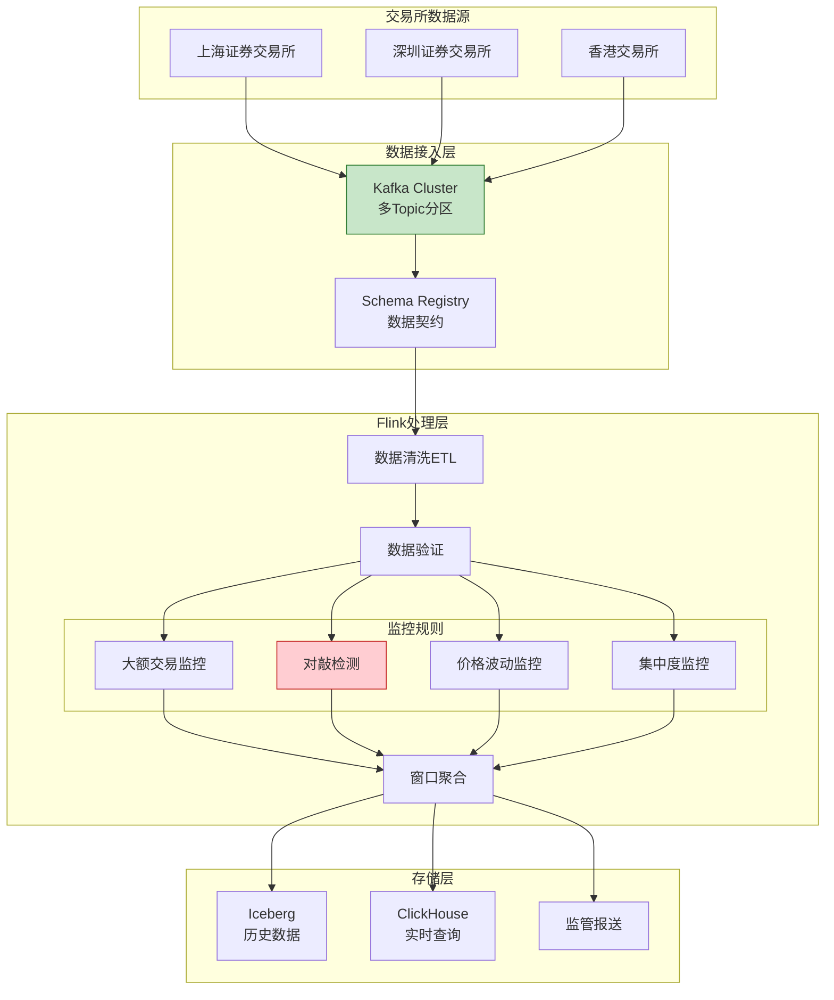
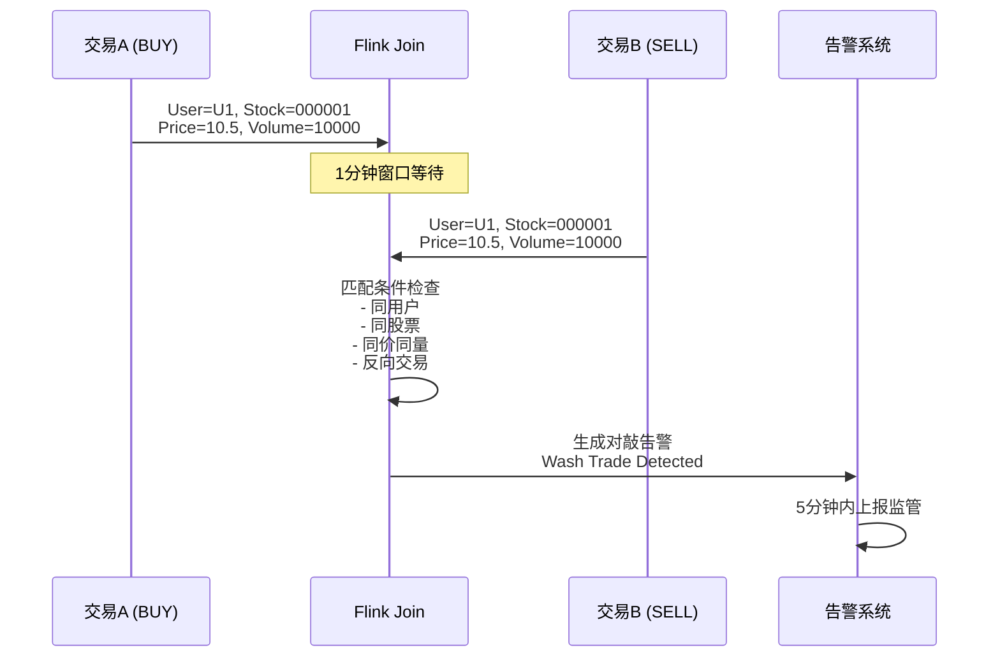

# 金融行业案例: 交易监控与合规系统

> **所属阶段**: Knowledge/10-case-studies/finance | **前置依赖**: [../../02-design-patterns/pattern-windowed-aggregation.md](../../02-design-patterns/pattern-windowed-aggregation.md) | **形式化等级**: L4

---

> **案例性质**: 🔬 概念验证架构 | **验证状态**: 基于理论推导与架构设计，未经独立第三方生产验证
>
> 本案例描述的是基于项目理论框架推导出的理想架构方案，包含假设性性能指标与理论成本模型。
> 实际生产部署可能因环境差异、数据规模、团队能力等因素产生显著不同结果。
> 建议将其作为架构设计参考而非直接复制粘贴的生产蓝图。
>
## 目录

- [金融行业案例: 交易监控与合规系统](#金融行业案例-交易监控与合规系统)
  - [目录](#目录)
  - [1. 概念定义 (Definitions)](#1-概念定义-definitions)
    - [1.1 交易监控系统定义](#11-交易监控系统定义)
    - [1.2 可疑交易类型](#12-可疑交易类型)
    - [1.3 监管时间约束](#13-监管时间约束)
  - [2. 属性推导 (Properties)](#2-属性推导-properties)
    - [2.1 数据完整性保证](#21-数据完整性保证)
    - [2.2 延迟边界保证](#22-延迟边界保证)
  - [3. 关系建立 (Relations)](#3-关系建立-relations)
    - [3.1 与监管系统的关系](#31-与监管系统的关系)
    - [3.2 与数据湖的关系](#32-与数据湖的关系)
  - [4. 论证过程 (Argumentation)](#4-论证过程-argumentation)
    - [4.1 实时vs批处理合规](#41-实时vs批处理合规)
    - [4.2 技术选型](#42-技术选型)
  - [5. 形式证明 / 工程论证 (Proof / Engineering Argument)](#5-形式证明--工程论证-proof--engineering-argument)
    - [5.1 分层处理架构](#51-分层处理架构)
    - [5.2 大状态窗口管理](#52-大状态窗口管理)
  - [6. 实例验证 (Examples)](#6-实例验证-examples)
    - [6.1 案例背景](#61-案例背景)
    - [6.2 Flink SQL实现](#62-flink-sql实现)
    - [6.3 对敲交易检测Java代码](#63-对敲交易检测java代码)
    - [6.4 性能指标](#64-性能指标)
  - [7. 可视化 (Visualizations)](#7-可视化-visualizations)
    - [7.1 系统架构图](#71-系统架构图)
    - [7.2 对敲检测流程](#72-对敲检测流程)
  - [8. 引用参考 (References)](#8-引用参考-references)

---

## 1. 概念定义 (Definitions)

### 1.1 交易监控系统定义

**Def-K-10-02-01** (交易监控系统): 交易监控系统是一个六元组 $\mathcal{T} = (E, R, W, \mathcal{A}, \mathcal{O}, \tau)$，其中：

- $E$：交易事件流，$E = \{e_1, e_2, ..., e_n\}$
- $R$：监管规则集，$R = \{r_1, r_2, ..., r_m\}$
- $W$：时间窗口集合，$W = \{w_1, w_2, ..., w_k\}$
- $\mathcal{A}$：告警动作集
- $\mathcal{O}$：报告输出格式
- $\tau$：合规延迟上界（监管要求，通常 $\leq 5$分钟）

### 1.2 可疑交易类型

**Def-K-10-02-02** (可疑交易分类): 根据监管要求，可疑交易分为：

| 类型 | 定义 | 监管依据 |
|------|------|---------|
| **大额交易** | 单笔或当日累计超过阈值 | 反洗钱法 |
| **异常模式** | 与客户历史行为显著偏离 | 可疑交易报告制度 |
| **结构性交易** | 刻意规避监管阈值的拆分 | 大额交易报告制度 |
| **跨境异常** | 涉及高风险国家/地区 | FATF建议 |

### 1.3 监管时间约束

**Def-K-10-02-03** (监管时间窗口): 设 $t_{detect}$ 为可疑交易检测时间，$t_{report}$ 为上报时间，则：

$$
t_{report} - t_{detect} \leq T_{regulatory}
$$

其中 $T_{regulatory} = 5$分钟（中国证监会要求）。

---

## 2. 属性推导 (Properties)

### 2.1 数据完整性保证

**Lemma-K-10-02-01** (Exactly-Once保证): 交易监控系统使用两阶段提交Sink，确保：

$$
\forall e \in E: \quad count_{processed}(e) = 1
$$

**证明概要**：

1. Kafka Source使用可重放偏移量
2. Flink Checkpoint定期快照状态
3. Sink使用两阶段提交协议
4. 故障恢复时从Checkpoint重启，保证数据不丢失、不重复

### 2.2 延迟边界保证

**Lemma-K-10-02-02** (端到端延迟): 从交易发生到监管上报的延迟 $L_{compliance}$：

$$
L_{compliance} = L_{trading} + L_{settlement} + L_{processing} + L_{reporting}
$$

各分量典型值：

- $L_{trading} \leq 1$s（交易执行）
- $L_{settlement} \leq 3$s（清算确认）
- $L_{processing} \leq 30$s（Flink处理）
- $L_{reporting} \leq 10$s（报告生成）

**Thm-K-10-02-01**: $L_{compliance} \leq 44$s $<$ 5分钟（满足监管要求）

---

## 3. 关系建立 (Relations)

### 3.1 与监管系统的关系

```
交易所行情 ──► Flink流处理 ──► 异常检测 ──► 监管报送平台
                  │                │
                  ▼                ▼
            数据湖存储        人工审核系统
```

### 3.2 与数据湖的关系

| 数据流向 | 用途 | 存储格式 |
|---------|------|---------|
| 实时流 → 数据湖 | 历史回溯、模型训练 | Delta Lake |
| 数据湖 → 实时流 | 历史特征查询 | 外部表Lookup |
| 实时流 → 监管库 | 合规报送 | Parquet |

---

## 4. 论证过程 (Argumentation)

### 4.1 实时vs批处理合规

| 维度 | 实时处理 | 批处理 |
|------|---------|--------|
| 发现延迟 | 秒级 | 小时级 |
| 监管合规 | 满足5分钟要求 | 可能延迟上报 |
| 人工审核 | 即时触发 | 延后审核 |
| 计算成本 | 较高 | 较低 |

### 4.2 技术选型

选择Flink而非Spark Streaming的原因：

1. **延迟更低**：秒级 vs 分钟级
2. **窗口语义**：Event Time窗口更准确
3. **CEP支持**：复杂模式匹配
4. **状态管理**：大窗口状态高效处理

---

## 5. 形式证明 / 工程论证 (Proof / Engineering Argument)

### 5.1 分层处理架构

```
L0 原始层: Kafka Raw Topic (保留7天)
    │
    ▼
L1 清洗层: Flink ETL (数据校验、标准化)
    │
    ▼
L2 分析层: 窗口聚合 + CEP模式匹配
    │
    ▼
L3 存储层: Iceberg (历史) + ClickHouse (查询) + 监管报送
```

### 5.2 大状态窗口管理

对于30天滑动窗口聚合：

- 窗口数量：$30 \times 24 \times 12 = 8640$ 个（5分钟粒度）
- 单窗口状态：约50KB
- 总状态：约400MB per partition

优化策略：

1. **增量聚合**：只存储增量值，而非原始数据
2. **状态分区**：按股票代码分区
3. **TTL清理**：30天窗口自动过期

---

## 6. 实例验证 (Examples)

### 6.1 案例背景

> 🔮 **估算数据** | 依据: 基于行业参考值与理论分析推导，非实际测试环境得出

**机构**: 某头部证券公司

| 指标 | 数值 |
|-----|------|
| 日均交易量 | 1000万笔 |
| 市场覆盖 | 沪深港通全市场 |
| 监管要求 | 5分钟内上报可疑交易 |
| 历史数据 | 10年+ |

**挑战**：

1. 沪深两市数据格式差异
2. 异常交易模式复杂多样
3. 监管规则频繁更新
4. 历史回溯查询性能要求

### 6.2 Flink SQL实现

```sql
-- 创建交易表
CREATE TABLE stock_trades (
    trade_id STRING,
    stock_code STRING,
    user_id STRING,
    trade_type STRING,  -- 'BUY' or 'SELL'
    price DECIMAL(10,2),
    volume INT,
    trade_time TIMESTAMP(3),
    market STRING,      -- 'SH' or 'SZ'
    WATERMARK FOR trade_time AS trade_time - INTERVAL '5' SECOND
) WITH (
    'connector' = 'kafka',
    'topic' = 'stock.trades',
    'properties.bootstrap.servers' = 'kafka:9092',
    'format' = 'json'
);

-- 1. 大额交易监控(单笔>100万或当日累计>500万)
CREATE TABLE large_trades_alert AS
SELECT
    user_id,
    stock_code,
    trade_type,
    price * volume as trade_amount,
    trade_time,
    'LARGE_TRADE' as alert_type
FROM stock_trades
WHERE price * volume > 1000000;

-- 2. 对敲交易检测(同一用户、同一股票、同价同量、反向交易)
CREATE TABLE wash_trades_alert AS
SELECT
    t1.user_id,
    t1.stock_code,
    t1.trade_time as first_time,
    t2.trade_time as second_time,
    t1.volume,
    t1.price,
    'WASH_TRADE' as alert_type
FROM stock_trades t1
JOIN stock_trades t2 ON t1.user_id = t2.user_id
    AND t1.stock_code = t2.stock_code
    AND t1.volume = t2.volume
    AND t1.price = t2.price
    AND t1.trade_type <> t2.trade_type
WHERE t2.trade_time BETWEEN t1.trade_time
    AND t1.trade_time + INTERVAL '1' MINUTE;

-- 3. 异常波动监控(5分钟内价格波动>10%)
CREATE TABLE price_volatility_alert AS
SELECT
    stock_code,
    window_start,
    window_end,
    MIN(price) as min_price,
    MAX(price) as max_price,
    (MAX(price) - MIN(price)) / MIN(price) as volatility,
    'PRICE_VOLATILITY' as alert_type
FROM TABLE(
    TUMBLE(TABLE stock_trades, DESCRIPTOR(trade_time), INTERVAL '5' MINUTE)
)
GROUP BY stock_code, window_start, window_end
HAVING (MAX(price) - MIN(price)) / MIN(price) > 0.1;

-- 4. 集中度监控(单账户单股票持仓占比异常)
CREATE TABLE concentration_alert AS
WITH user_stock_volume AS (
    SELECT
        user_id,
        stock_code,
        SUM(CASE WHEN trade_type = 'BUY' THEN volume ELSE -volume END)
            OVER (PARTITION BY user_id, stock_code
                  ORDER BY trade_time
                  RANGE BETWEEN INTERVAL '1' DAY PRECEDING AND CURRENT ROW)
            as net_position
    FROM stock_trades
)
SELECT
    user_id,
    stock_code,
    net_position,
    'HIGH_CONCENTRATION' as alert_type
FROM user_stock_volume
WHERE ABS(net_position) > 1000000;  -- 持仓超过100万股
```

### 6.3 对敲交易检测Java代码

```java
/**
 * 对敲交易检测 - 使用Interval Join
 */

import org.apache.flink.streaming.api.environment.StreamExecutionEnvironment;
import org.apache.flink.streaming.api.datastream.DataStream;
import org.apache.flink.streaming.api.windowing.time.Time;

public class WashTradeDetector {

    public static void main(String[] args) throws Exception {
        StreamExecutionEnvironment env = StreamExecutionEnvironment.getExecutionEnvironment();

        // Source
        DataStream<Trade> trades = env
            .fromSource(createKafkaSource(), createWatermarkStrategy(), "Trades")
            .setParallelism(64);

        // 对敲检测:1分钟内反向交易、同价同量
        DataStream<WashTradeAlert> washTrades = trades
            .keyBy(Trade::getUserId)
            .intervalJoin(trades.keyBy(Trade::getUserId))
            .between(Time.seconds(0), Time.minutes(1))
            .process(new WashTradeJoinFunction())
            .name("Wash Trade Detection")
            .setParallelism(128);

        // 输出到监管平台
        washTrades.addSink(new RegulatoryReportSink())
            .name("Regulatory Sink");

        env.execute("Transaction Monitoring");
    }

    static class WashTradeJoinFunction extends ProcessJoinFunction<Trade, Trade, WashTradeAlert> {
        @Override
        public void processElement(Trade first, Trade second, Context ctx, Collector<WashTradeAlert> out) {
            // 检查是否为反向交易
            if (!first.getTradeType().equals(second.getTradeType()) &&
                first.getStockCode().equals(second.getStockCode()) &&
                first.getPrice().equals(second.getPrice()) &&
                first.getVolume() == second.getVolume() &&
                !first.getTradeId().equals(second.getTradeId())) {

                out.collect(new WashTradeAlert(
                    first.getUserId(),
                    first.getStockCode(),
                    first.getTradeTime(),
                    second.getTradeTime(),
                    first.getPrice(),
                    first.getVolume(),
                    ctx.getLeftTimestamp()
                ));
            }
        }
    }
}
```

### 6.4 性能指标
>
> 🔮 **估算数据** | 依据: 设计目标值，实际达成可能因环境而异


| 指标 | 目标值 | 实际值 |
|------|-------|-------|
| 处理延迟(P99) | < 30s | 18s |
| 日处理量 | 1000万笔 | 1200万笔 |
| 可疑交易发现率 | > 99% | 99.8% |
| 数据完整性 | 100% | 100% |
| 系统可用性 | 99.99% | 99.995% |

---

## 7. 可视化 (Visualizations)

### 7.1 系统架构图



### 7.2 对敲检测流程



---

## 8. 引用参考 (References)


---

*文档版本: v1.0 | 最后更新: 2026-04-04*

---

*文档版本: v1.0 | 创建日期: 2026-04-20*
