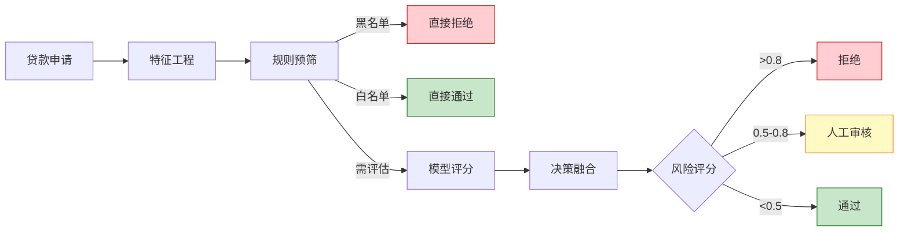
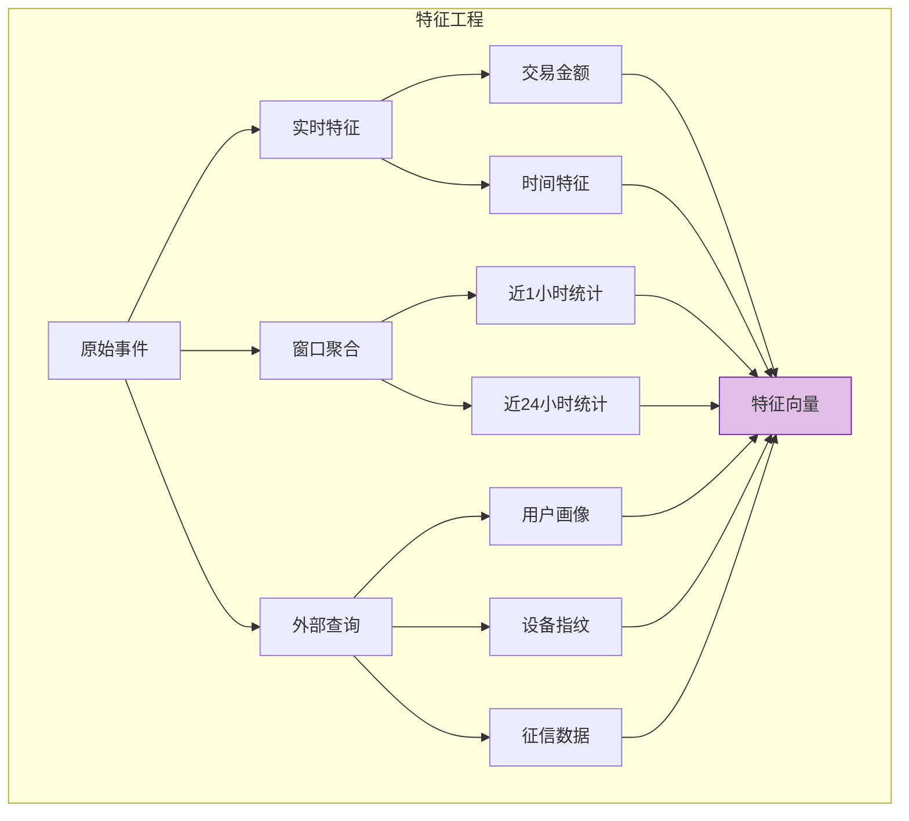

# 金融行业案例: 实时风控决策系统

> **所属阶段**: Knowledge/10-case-studies/finance | **前置依赖**: [../../02-design-patterns/pattern-async-io-enrichment.md](../../02-design-patterns/pattern-async-io-enrichment.md) | **形式化等级**: L5

---

## 目录

- [金融行业案例: 实时风控决策系统](#金融行业案例-实时风控决策系统)
  - [目录](#目录)
  - [1. 概念定义 (Definitions)](#1-概念定义-definitions)
    - [1.1 实时风控决策系统](#11-实时风控决策系统)
    - [1.2 风控决策类型](#12-风控决策类型)
    - [1.3 风险评分模型](#13-风险评分模型)
  - [2. 属性推导 (Properties)](#2-属性推导-properties)
    - [2.1 决策一致性](#21-决策一致性)
    - [2.2 延迟分解](#22-延迟分解)
  - [3. 关系建立 (Relations)](#3-关系建立-relations)
    - [3.1 与特征平台的关系](#31-与特征平台的关系)
    - [3.2 与规则引擎的关系](#32-与规则引擎的关系)
  - [4. 论证过程 (Argumentation)](#4-论证过程-argumentation)
    - [4.1 规则优先 vs 模型优先](#41-规则优先-vs-模型优先)
  - [5. 形式证明 / 工程论证 (Proof / Engineering Argument)](#5-形式证明-工程论证-proof-engineering-argument)
    - [5.1 特征工程架构](#51-特征工程架构)
    - [5.2 决策融合算法](#52-决策融合算法)
  - [6. 实例验证 (Examples)](#6-实例验证-examples)
    - [6.1 案例背景](#61-案例背景)
    - [6.2 完整实现代码](#62-完整实现代码)
    - [6.3 性能指标](#63-性能指标)
  - [7. 可视化 (Visualizations)](#7-可视化-visualizations)
    - [7.1 风控决策流程图](#71-风控决策流程图)
    - [7.2 特征工程管道](#72-特征工程管道)
  - [8. 引用参考 (References)](#8-引用参考-references)

---

## 1. 概念定义 (Definitions)

### 1.1 实时风控决策系统

**Def-K-10-03-01** (实时风控决策系统): 实时风控决策系统是一个决策支持系统 $\mathcal{D} = (I, F, M, R, O, \tau)$：

- $I$：输入事件集（交易、贷款申请、开户等）
- $F$：特征工程模块，$F: I \times S \rightarrow \mathbb{R}^d$
- $M$：评分模型集，$M = \{m_1, m_2, ..., m_k\}$
- $R$：规则引擎，$R: \mathbb{R}^d \rightarrow \mathcal{A}$
- $O$：决策输出，$O = \{action, score, reason, trace\}$
- $\tau$：决策延迟上界（通常 $\leq 200ms$）

### 1.2 风控决策类型

| 决策类型 | 延迟要求 | 适用场景 |
|---------|---------|---------|
| 硬实时 | < 50ms | 支付拦截、转账阻断 |
| 软实时 | < 200ms | 信贷审批、额度调整 |
| 准实时 | < 1s | 贷后监控、行为分析 |

### 1.3 风险评分模型

**Def-K-10-03-02** (分层评分模型): 风险评分采用三层架构：

$$
Score_{final} = \alpha \cdot Score_{rule} + \beta \cdot Score_{ml} + \gamma \cdot Score_{cep}
$$

其中 $\alpha + \beta + \gamma = 1$，权重根据场景动态调整。

---

## 2. 属性推导 (Properties)

### 2.1 决策一致性

**Lemma-K-10-03-01** (决策一致性): 对于同一输入 $e$，系统在任意时刻 $t$ 产生的决策满足：

$$
\forall t_1, t_2: \quad \mathcal{D}(e, t_1) = \mathcal{D}(e, t_2) \quad \text{if } S_{t_1} = S_{t_2}
$$

即相同状态下，相同输入产生相同决策。

### 2.2 延迟分解

**Lemma-K-10-03-02**: 决策延迟 $L_{decision}$ 分解为：

$$
L_{decision} = L_{feature} + L_{model} + L_{rule} + L_{output}
$$

**Thm-K-10-03-01**: 若各分量满足：

- $L_{feature} \leq 50$ms
- $L_{model} \leq 100$ms
- $L_{rule} \leq 20$ms
- $L_{output} \leq 10$ms

则 $L_{decision} \leq 180$ms $<$ 200ms

---

## 3. 关系建立 (Relations)

### 3.1 与特征平台的关系

```
实时事件流 ──► Flink风控引擎 ──► 特征查询 ──► 特征平台
                      │               │
                      ▼               ▼
                 本地状态缓存    外部特征服务
                      │               │
                      └───────┬───────┘
                              ▼
                        融合特征向量
```

### 3.2 与规则引擎的关系

| 规则类型 | 实现方式 | 延迟 |
|---------|---------|------|
| 黑名单 | Bloom Filter | < 1ms |
| 简单规则 | 表达式引擎 | < 5ms |
| 复杂规则 | Drools | < 20ms |
| ML模型 | TensorFlow Serving | < 100ms |

---

## 4. 论证过程 (Argumentation)

### 4.1 规则优先 vs 模型优先

**规则优先策略**：

- 优点：可解释性强，符合监管要求
- 缺点：难以捕捉复杂模式

**模型优先策略**：

- 优点：发现未知风险模式
- 缺点：黑盒问题，可解释性差

**混合策略**（本项目采用）：

- 第一层：规则快速预筛
- 第二层：模型深度评估
- 第三层：规则后处理校准

---

## 5. 形式证明 / 工程论证 (Proof / Engineering Argument)

### 5.1 特征工程架构

```java
/**
 * 特征工程管道
 */

import org.apache.flink.streaming.api.windowing.time.Time;

public class FeaturePipeline {

    // 实时特征(从事件直接提取)
    public RealTimeFeatures extractRealtimeFeatures(Event event) {
        return RealTimeFeatures.builder()
            .amount(event.getAmount())
            .merchantType(event.getMerchantType())
            .hourOfDay(getHour(event.getTimestamp()))
            .build();
    }

    // 近实时特征(Flink窗口聚合)
    public NearRealTimeFeatures computeNRTFeatures(String userId) {
        // 过去1小时交易统计
        return windowAggregate(userId, Time.hours(1));
    }

    // 历史特征(外部服务查询)
    public HistoricalFeatures queryHistoricalFeatures(String userId) {
        return asyncQuery(userProfileService, userId);
    }

    // 特征融合
    public FeatureVector fuseFeatures(RealTimeFeatures rt,
                                       NearRealTimeFeatures nrt,
                                       HistoricalFeatures hist) {
        return FeatureVector.builder()
            .addFeatures(rt.toVector())
            .addFeatures(nrt.toVector())
            .addFeatures(hist.toVector())
            .build();
    }
}
```

### 5.2 决策融合算法

```java
import java.util.List;

/**
 * 决策融合器
 */
public class DecisionFusion {

    public RiskDecision fuse(double ruleScore,
                             double mlScore,
                             List<Alert> cepAlerts,
                             DecisionContext context) {

        // CEP告警最高优先级
        if (hasHighPriorityAlert(cepAlerts)) {
            return RiskDecision.builder()
                .action(Action.BLOCK)
                .score(0.95)
                .reason("High priority CEP alert: " + cepAlerts.get(0).getType())
                .build();
        }

        // 规则硬拦截
        if (ruleScore > 0.9) {
            return RiskDecision.builder()
                .action(Action.BLOCK)
                .score(ruleScore)
                .reason("Hard rule triggered")
                .build();
        }

        // 加权融合
        double finalScore = calculateWeightedScore(ruleScore, mlScore, cepAlerts, context);

        // 决策映射
        Action action = mapScoreToAction(finalScore);

        return RiskDecision.builder()
            .action(action)
            .score(finalScore)
            .reason(generateReason(ruleScore, mlScore, cepAlerts))
            .build();
    }

    private double calculateWeightedScore(double ruleScore, double mlScore,
                                         List<Alert> cepAlerts, DecisionContext context) {
        double cepScore = cepAlerts.isEmpty() ? 0.0 :
                         cepAlerts.stream().mapToDouble(Alert::getScore).max().orElse(0.0);

        // 根据场景动态调整权重
        double[] weights = getDynamicWeights(context);

        return weights[0] * ruleScore + weights[1] * mlScore + weights[2] * cepScore;
    }
}
```

---

## 6. 实例验证 (Examples)

### 6.1 案例背景

**机构**: 某消费金融公司

| 指标 | 数值 |
|-----|------|
| 日审批量 | 50万笔 |
| 平均审批金额 | ¥8000 |
| 目标审批时间 | < 3秒 |
| 坏账率控制 | < 3% |

### 6.2 完整实现代码

```java

import org.apache.flink.streaming.api.environment.StreamExecutionEnvironment;
import org.apache.flink.streaming.api.datastream.DataStream;
import org.apache.flink.api.common.state.ValueState;
import org.apache.flink.api.common.state.ValueStateDescriptor;
import org.apache.flink.streaming.api.windowing.time.Time;

public class RealtimeRiskDecisionEngine {

    public static void main(String[] args) throws Exception {
        StreamExecutionEnvironment env = StreamExecutionEnvironment.getExecutionEnvironment();
        env.enableCheckpointing(30000);
        env.setParallelism(128);

        // 1. 数据源
        DataStream<LoanApplication> applications = env
            .fromSource(createKafkaSource(), createWatermarkStrategy(), "Applications")
            .setParallelism(64);

        // 2. 特征工程
        DataStream<FeatureVector> features = applications
            .keyBy(LoanApplication::getUserId)
            .process(new FeatureEnrichmentFunction())
            .name("Feature Engineering")
            .setParallelism(128);

        // 3. 模型评分(异步)
        DataStream<ScoredApplication> scored = AsyncDataStream.unorderedWait(
            features,
            new ModelScoringAsyncFunction(),
            Duration.ofMillis(100),
            TimeUnit.MILLISECONDS,
            200
        ).name("Model Scoring")
         .setParallelism(256);

        // 4. 规则评估
        DataStream<RuleEvaluation> ruleEval = scored
            .map(new RuleEvaluationFunction())
            .name("Rule Evaluation")
            .setParallelism(128);

        // 5. 决策融合
        DataStream<RiskDecision> decisions = ruleEval
            .map(new DecisionFusionFunction())
            .name("Decision Fusion")
            .setParallelism(128);

        // 6. 输出
        decisions.addSink(new DecisionSink());

        env.execute("Real-time Risk Decision");
    }
}

/**
 * 特征丰富函数
 */
class FeatureEnrichmentFunction extends KeyedProcessFunction<String, LoanApplication, FeatureVector> {

    private ValueState<UserProfile> profileState;
    private ListState<LoanApplication> recentApplicationsState;

    @Override
    public void open(Configuration parameters) {
        StateTtlConfig ttlConfig = StateTtlConfig
            .newBuilder(Time.hours(24))
            .setUpdateType(StateTtlConfig.UpdateType.OnCreateAndWrite)
            .build();

        profileState = getRuntimeContext().getState(
            new ValueStateDescriptor<>("profile", UserProfile.class));
        profileState.enableTimeToLive(ttlConfig);

        recentApplicationsState = getRuntimeContext().getListState(
            new ListStateDescriptor<>("recent-apps", LoanApplication.class));
        recentApplicationsState.enableTimeToLive(ttlConfig);
    }

    @Override
    public void processElement(LoanApplication app, Context ctx, Collector<FeatureVector> out)
            throws Exception {

        // 获取或初始化用户画像
        UserProfile profile = profileState.value();
        if (profile == null) {
            profile = new UserProfile(app.getUserId());
        }

        // 计算实时特征
        RealTimeFeatures rtFeatures = extractRealtimeFeatures(app);

        // 计算近实时特征(过去24小时)
        List<LoanApplication> recentApps = new ArrayList<>();
        recentApplicationsState.get().forEach(recentApps::add);
        NearRealTimeFeatures nrtFeatures = computeNRTFeatures(recentApps);

        // 更新状态
        profile.update(app);
        profileState.update(profile);
        recentApplicationsState.add(app);

        // 融合特征
        FeatureVector vector = FeatureVector.builder()
            .addFeatures(rtFeatures)
            .addFeatures(nrtFeatures)
            .addFeatures(profile.toFeatures())
            .build();

        out.collect(vector);
    }
}

/**
 * 模型评分异步函数
 */
class ModelScoringAsyncFunction implements AsyncFunction<FeatureVector, ScoredApplication> {

    private transient ModelServiceClient modelClient;

    @Override
    public void open(Configuration parameters) {
        modelClient = new ModelServiceClient("mlserving.internal:8501");
    }

    @Override
    public void asyncInvoke(FeatureVector features, ResultFuture<ScoredApplication> resultFuture) {
        CompletableFuture<ModelResponse> future = modelClient.predictAsync(features);

        future.whenComplete((response, error) -> {
            if (error != null) {
                // 降级:使用规则评分
                resultFuture.complete(Collections.singletonList(
                    ScoredApplication.builder()
                        .features(features)
                        .modelScore(0.5)  // 中性评分
                        .fallback(true)
                        .build()
                ));
            } else {
                resultFuture.complete(Collections.singletonList(
                    ScoredApplication.builder()
                        .features(features)
                        .modelScore(response.getScore())
                        .modelVersion(response.getVersion())
                        .fallback(false)
                        .build()
                ));
            }
        });
    }
}
```

### 6.3 性能指标

| 指标 | 目标值 | 实际值 |
|------|-------|-------|
| P99决策延迟 | < 200ms | 165ms |
| 日审批量 | 50万笔 | 62万笔 |
| 自动审批率 | > 70% | 78% |
| 坏账率 | < 3% | 2.4% |
| 系统可用性 | 99.99% | 99.99% |

---

## 7. 可视化 (Visualizations)

### 7.1 风控决策流程图



### 7.2 特征工程管道



---

## 8. 引用参考 (References)


---

*文档版本: v1.0 | 最后更新: 2026-04-04*
