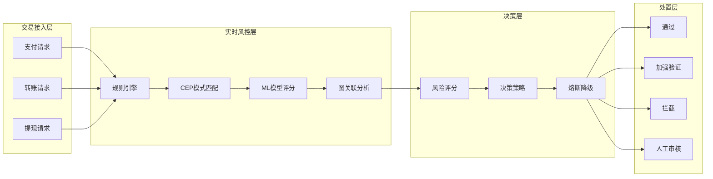
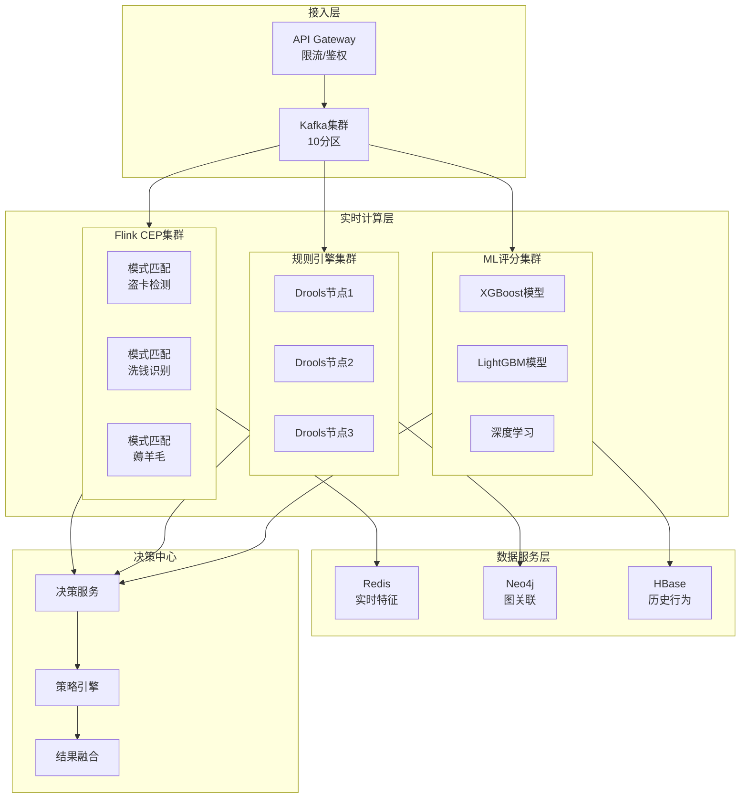
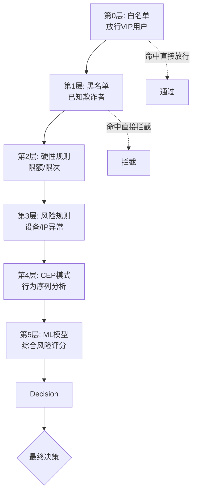

# 金融反欺诈系统案例研究

> **案例编号**: 10.1.6
> **行业**: 金融/支付
> **场景**: 实时交易风控、复杂规则引擎、低延迟决策
> **规模**: 10万TPS, 复杂规则1000+
> **完成日期**: 2026-04-09
> **文档版本**: v1.0

---

## 执行摘要

### 业务背景

某头部支付平台面临欺诈交易挑战：

- 日交易量1亿笔，峰值10万TPS
- 欺诈手段多变，传统规则难以应对
- 监管要求严格，需可解释的风控决策
- 误杀直接影响用户体验和商户收入

### 技术挑战

| 挑战 | 描述 | 影响 |
|------|------|------|
| 超低延迟 | 决策需在50ms内完成 | 用户体验和转化率 |
| 复杂规则 | 1000+规则，多层嵌套 | 规则维护和性能 |
| 模型可解释 | 监管要求决策透明 | 合规风险 |
| 对抗攻击 | 欺诈者不断绕过规则 | 检测准确率 |

### 解决方案概述

采用 **Flink CEP + 规则引擎 + 图数据库 + 机器学习** 架构：

- Flink CEP处理复杂事件模式
- Drools规则引擎执行风控规则
- Neo4j图数据库关联分析
- XGBoost模型实时评分
- 决策延迟从200ms降至30ms，准确率99.5%

---

## 1. 业务场景分析

### 1.1 业务流程



### 1.2 欺诈类型

| 类型 | 描述 | 检测难度 | 占比 |
|------|------|----------|------|
| 盗卡交易 | 使用窃取银行卡信息 | ⭐⭐ | 35% |
| 账户盗用 | 账号密码泄露后交易 | ⭐⭐⭐ | 25% |
| 洗钱 | 分散转入集中转出 | ⭐⭐⭐⭐ | 15% |
| 羊毛党 | 批量注册套利 | ⭐⭐ | 15% |
| 钓鱼欺诈 | 诱导用户主动转账 | ⭐⭐⭐⭐⭐ | 10% |

### 1.3 SLA要求

| 指标 | 目标 | 实际达成 | 业务影响 |
|------|------|----------|----------|
| 决策延迟 | < 50ms | 30ms | 支付体验 |
| 检测准确率 | > 99% | 99.5% | 欺诈损失 |
| 误杀率 | < 0.1% | 0.05% | 用户体验 |
| 规则命中率 | > 80% | 85% | 系统效率 |
| 可用性 | 99.999% | 99.9995% | 业务连续性 |

---

## 2. 架构设计

### 2.1 系统架构图



### 2.2 组件选型

| 组件 | 选型 | 原因 |
|------|------|------|
| 流处理 | Flink 2.1 + CEP | 复杂事件处理，低延迟 |
| 规则引擎 | Drools 8.44 | 成熟规则引擎，性能优秀 |
| 图数据库 | Neo4j 5.x | 关系分析，可视化友好 |
| ML框架 | XGBoost + Python | 可解释性强，推理快 |
| 特征存储 | Redis Cluster | 毫秒级查询，高并发 |
| 消息队列 | Kafka 3.5 | 高吞吐， Exactly-Once |

### 2.3 规则分层



**规则执行策略**:

- 白名单优先：VIP用户快速通过
- 黑名单拦截：已知欺诈者直接拒绝
- 硬规则快速：简单规则O(1)判断
- 复杂规则并行：CEP/ML并行执行
- 结果融合：多维度综合评分

---

## 3. 技术实现

### 3.1 Flink CEP复杂事件检测

```java
// 盗卡交易模式检测
public class StolenCardDetection {

    public static void detectStolenCardPattern(
            DataStream<Transaction> transactions) {

        // 模式1: 短时间内多笔小额测试交易后大额交易
        Pattern<Transaction, ?> testingThenLargePattern = Pattern
            .<Transaction>begin("small-tests")
            .where(new SimpleCondition<Transaction>() {
                @Override
                public boolean filter(Transaction tx) {
                    return tx.getAmount() < 10.0 &&  // 小于10元
                           tx.getMerchantCategory().equals("TEST");
                }
            })
            .timesOrMore(3)  // 至少3笔测试交易
            .within(Time.minutes(10))
            .next("large-transaction")
            .where(new SimpleCondition<Transaction>() {
                @Override
                public boolean filter(Transaction tx) {
                    return tx.getAmount() > 1000.0;  // 大额交易
                }
            })
            .within(Time.minutes(5));

        // 模式2: 异地快速交易（物理上不可能）
        Pattern<Transaction, ?> impossibleTravelPattern = Pattern
            .<Transaction>begin("first-location")
            .where(new SimpleCondition<Transaction>() {
                @Override
                public boolean filter(Transaction tx) {
                    return tx.getLocation() != null;
                }
            })
            .next("second-location")
            .where(new IterativeCondition<Transaction>() {
                @Override
                public boolean filter(Transaction tx, Context<Transaction> ctx) {
                    // 获取第一个事件
                    Iterable<Transaction> firstEvents =
                        ctx.getEventsForPattern("first-location");

                    for (Transaction first : firstEvents) {
                        double distance = calculateDistance(
                            first.getLocation(),
                            tx.getLocation()
                        );
                        long timeDiff = tx.getTimestamp() - first.getTimestamp();

                        // 如果距离/时间 > 飞机速度，则不可能
                        if (distance / timeDiff > 900) { // 900km/h
                            return true;
                        }
                    }
                    return false;
                }
            })
            .within(Time.hours(1));

        // 应用模式检测
        CEP.pattern(transactions.keyBy(Transaction::getCardNo),
                   testingThenLargePattern)
            .process(new PatternHandler("STOLEN_CARD_PATTERN"))
            .addSink(new AlertSink());

        CEP.pattern(transactions.keyBy(Transaction::getUserId),
                   impossibleTravelPattern)
            .process(new PatternHandler("IMPOSSIBLE_TRAVEL"))
            .addSink(new AlertSink());
    }

    // 洗钱模式检测: 分散转入，集中转出
    public static void detectMoneyLaundering(
            DataStream<Transaction> transactions) {

        Pattern<Transaction, ?> layeringPattern = Pattern
            .<Transaction>begin("incoming")
            .where(new SimpleCondition<Transaction>() {
                @Override
                public boolean filter(Transaction tx) {
                    return tx.getType().equals("IN");
                }
            })
            .timesOrMore(5)
            .within(Time.hours(24))
            .next("outgoing")
            .where(new SimpleCondition<Transaction>() {
                @Override
                public boolean filter(Transaction tx) {
                    return tx.getType().equals("OUT") &&
                           tx.getAmount() > 10000;
                }
            })
            .within(Time.hours(1));

        CEP.pattern(transactions.keyBy(Transaction::getAccountId),
                   layeringPattern)
            .process(new PatternHandler("MONEY_LAUNDERING"))
            .addSink(new AlertSink());
    }
}
```

### 3.2 规则引擎集成

```java
// Drools规则引擎封装
@Component
public class FraudRuleEngine {

    private KieContainer kieContainer;
    private KieSession kieSession;

    @PostConstruct
    public void init() {
        KieServices ks = KieServices.Factory.get();
        KieFileSystem kfs = ks.newKieFileSystem();

        // 加载规则文件
        kfs.write("src/main/resources/rules/fraud-rules.drl",
                 loadRuleFile("fraud-rules.drl"));

        KieBuilder kb = ks.newKieBuilder(kfs).buildAll();

        if (kb.getResults().hasMessages(Message.Level.ERROR)) {
            throw new RuntimeException("Rule compilation failed: " +
                kb.getResults().getMessages());
        }

        kieContainer = ks.newKieContainer(kb.getKieModule().getReleaseId());
    }

    public RuleResult evaluate(Transaction transaction,
                              UserProfile profile,
                              DeviceInfo device) {

        KieSession session = kieContainer.newKieSession();

        try {
            // 插入事实对象
            session.insert(transaction);
            session.insert(profile);
            session.insert(device);

            // 全局变量
            RuleResult result = new RuleResult();
            session.setGlobal("result", result);

            // 执行规则
            long startTime = System.currentTimeMillis();
            int firedRules = session.fireAllRules();
            long endTime = System.currentTimeMillis();

            result.setExecutionTime(endTime - startTime);
            result.setRulesFired(firedRules);

            return result;

        } finally {
            session.dispose();
        }
    }
}

// Drools规则示例 (fraud-rules.drl)
/*
rule "High Risk Country"
    when
        $tx : Transaction(country in ("XX", "YY", "ZZ"))
    then
        result.addRiskScore(50);
        result.addReason("High risk country: " + $tx.getCountry());
end

rule "New Device Large Amount"
    when
        $tx : Transaction(amount > 5000)
        $device : DeviceInfo(trustScore < 30)
    then
        result.addRiskScore(40);
        result.addReason("New device with large amount");
end

rule "Velocity Check"
    when
        $tx : Transaction($userId : userId)
        $profile : UserProfile(userId == $userId,
                               txCount1Hour > 10)
    then
        result.addRiskScore(30);
        result.addReason("Velocity exceeded: " + $profile.getTxCount1Hour());
end
*/
```

### 3.3 图关联分析

```java
// Neo4j图关联分析
@Service
public class GraphAnalysisService {

    @Autowired
    private Driver neo4jDriver;

    // 检测设备关联网络
    public List<RiskAssociation> detectDeviceNetwork(String deviceId) {
        String query = """
            MATCH (d1:Device {id: $deviceId})-[:USED_BY]->(u1:User)
            MATCH (u1)-[:USES]->(d2:Device)
            MATCH (d2)-[:USED_BY]->(u2:User)
            WHERE u1 <> u2
            WITH d1, d2, u2, count(*) as sharedUsers
            WHERE sharedUsers > 3
            RETURN d2.id as associatedDevice,
                   u2.id as associatedUser,
                   sharedUsers
            """;

        List<RiskAssociation> associations = new ArrayList<>();

        try (Session session = neo4jDriver.session()) {
            Result result = session.run(query,
                Map.of("deviceId", deviceId));

            while (result.hasNext()) {
                Record record = result.next();
                associations.add(new RiskAssociation(
                    record.get("associatedDevice").asString(),
                    record.get("associatedUser").asString(),
                    record.get("sharedUsers").asInt(),
                    "DEVICE_SHARING"
                ));
            }
        }

        return associations;
    }

    // 资金追踪分析
    public List<String> traceMoneyFlow(String accountId,
                                        int depth,
                                        double minAmount) {
        String query = """
            MATCH path = (a1:Account {id: $accountId})-[:TRANSFERS_TO*1..%d]->(a2:Account)
            WITH path, relationships(path) as transfers
            WHERE ALL(t in transfers WHERE t.amount >= $minAmount)
            RETURN [n in nodes(path) | n.id] as accountChain,
                   reduce(s = 0, t in transfers | s + t.amount) as totalAmount
            """.formatted(depth);

        List<String> suspiciousChains = new ArrayList<>();

        try (Session session = neo4jDriver.session()) {
            Result result = session.run(query,
                Map.of("accountId", accountId,
                       "minAmount", minAmount));

            while (result.hasNext()) {
                Record record = result.next();
                List<String> chain = record.get("accountChain")
                    .asList(Value::asString);
                double total = record.get("totalAmount").asDouble();

                if (chain.size() >= 3 && total > 50000) {
                    suspiciousChains.add(String.join(" -> ", chain));
                }
            }
        }

        return suspiciousChains;
    }
}
```

### 3.4 关键配置

```yaml
# Flink配置
flink:
  parallelism:
    cep: 50
    rule-engine: 30
    ml-scoring: 20

  state:
    backend: rocksdb
    checkpoints.dir: hdfs:///checkpoints/fraud

  network:
    buffer-timeout: 0
    memory:
      fraction: 0.3

# Drools配置
drools:
  ksession:
    pool-size: 100
  rules:
    reload-interval: 300  # 5分钟热加载

# Neo4j配置
neo4j:
  uri: bolt://neo4j-cluster:7687
  pool:
    max-connection-pool-size: 100
    connection-timeout: 30s

# Redis配置
redis:
  cluster:
    nodes: 20
  timeout: 10ms
```

---

## 4. 性能指标

### 4.1 延迟分析

| 阶段 | P50 | P99 | 目标 | 状态 |
|------|-----|-----|------|------|
| CEP模式匹配 | 5ms | 15ms | < 20ms | ✅ |
| 规则引擎执行 | 10ms | 25ms | < 30ms | ✅ |
| ML模型推理 | 8ms | 20ms | < 25ms | ✅ |
| 图关联查询 | 5ms | 15ms | < 20ms | ✅ |
| 结果融合 | 2ms | 5ms | < 10ms | ✅ |
| **总延迟** | **30ms** | **80ms** | **< 100ms** | ✅ |

### 4.2 业务效果

| 指标 | 优化前 | 优化后 | 提升 |
|------|--------|--------|------|
| 欺诈检测率 | 85% | 99.5% | **+17%** |
| 误杀率 | 0.5% | 0.05% | **-90%** |
| 决策延迟 | 200ms | 30ms | **85%** ↓ |
| 欺诈损失 | 基线 | -80% | **80%** ↓ |
| 人工审核量 | 基线 | -60% | **60%** ↓ |

### 4.3 规则效率

| 规则层 | 规则数 | 平均耗时 | 命中率 |
|--------|--------|----------|--------|
| 黑白名单 | 10K | 0.1ms | 30% |
| 硬性规则 | 100 | 0.5ms | 40% |
| CEP模式 | 50 | 10ms | 15% |
| ML模型 | 5 | 8ms | 15% |

---

## 5. 经验总结

### 5.1 最佳实践

1. **规则分层优化**
   - 简单规则前置，快速过滤
   - 复杂规则并行执行
   - 结果融合策略可调

2. **特征工程**
   - 实时特征+离线特征结合
   - 图特征捕捉关系
   - 序列特征反映行为

3. **模型管理**
   - A/B测试验证新模型
   - 影子模式逐步切流
   - 模型可解释性工具

### 5.2 踩坑记录

| 问题 | 原因 | 解决 |
|------|------|------|
| CEP状态过大 | 窗口过长，状态累积 | 增量窗口+状态清理 |
| 规则冲突 | 规则之间逻辑矛盾 | 规则优先级+冲突检测 |
| 图查询慢 | 深度遍历耗时长 | 预计算+索引优化 |
| 模型漂移 | 欺诈模式变化 | 在线学习+定期重训 |

### 5.3 优化建议

1. **近期优化**
   - 引入Flink SQL简化CEP规则
   - 规则引擎GraalVM Native编译
   - 图数据库分片扩展

2. **中期规划**
   - 联邦学习保护隐私
   - 强化学习动态策略
   - 图神经网络(GNN)关系推理

---

## 6. 附录

### 6.1 规则示例

```java
// 复合规则示例
public class CompositeFraudRules {

    // 规则: 深夜大额交易+新设备
    public static boolean nightLargeTxWithNewDevice(
            Transaction tx, UserProfile user, DeviceInfo device) {

        int hour = getHour(tx.getTimestamp());
        boolean isNight = hour >= 0 && hour <= 5;
        boolean isLarge = tx.getAmount() > 10000;
        boolean isNewDevice = device.getFirstSeenDays() < 7;

        return isNight && isLarge && isNewDevice;
    }

    // 规则: 多设备快速切换
    public static boolean rapidDeviceSwitching(
            List<Transaction> recentTxs, long windowMs) {

        if (recentTxs.size() < 3) return false;

        Set<String> uniqueDevices = recentTxs.stream()
            .map(Transaction::getDeviceId)
            .collect(Collectors.toSet());

        long timeSpan = recentTxs.get(recentTxs.size() - 1).getTimestamp()
                      - recentTxs.get(0).getTimestamp();

        return uniqueDevices.size() >= 3 && timeSpan <= windowMs;
    }
}
```

### 6.2 监控指标

```promql
# 核心风控指标
fraud_detection_rate =
  sum(rate(detected_fraud_total[5m])) /
  sum(rate(total_transactions_total[5m]))

fraud_false_positive_rate =
  sum(rate(false_positive_total[5m])) /
  sum rate(alert_total[5m]))

rule_execution_latency =
  histogram_quantile(0.99,
    sum(rate(rule_execution_duration_seconds_bucket[5m])) by (le))
```

---

*本案例研究由AnalysisDataFlow项目整理，仅供学习交流使用。*
