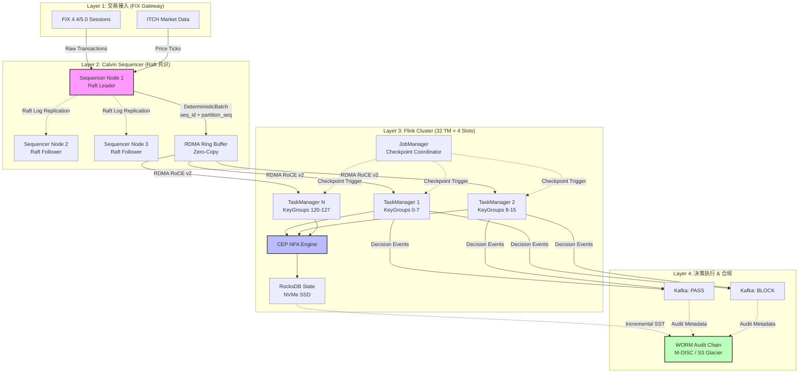
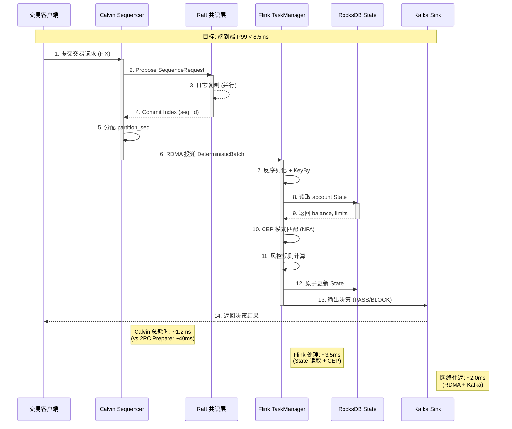
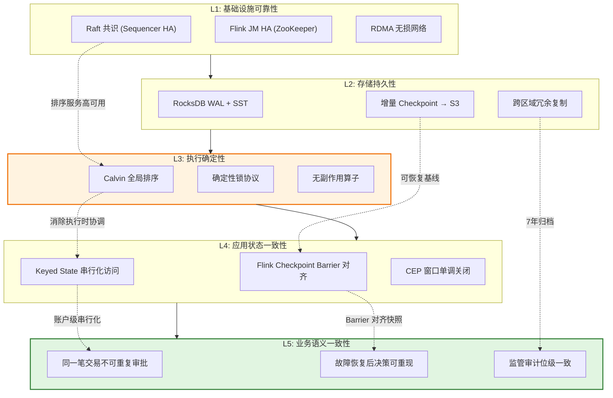
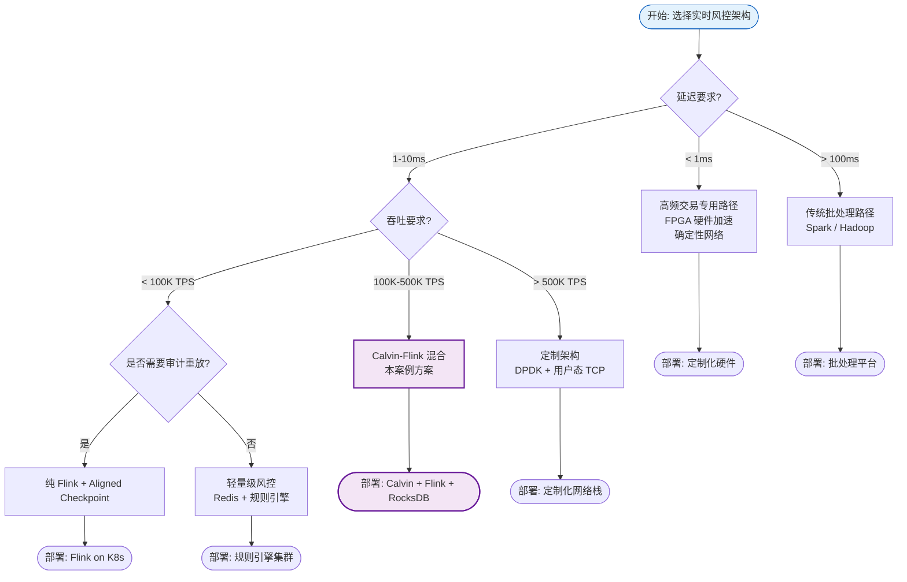

# 金融实时风控案例: GlobalTrade Bank — Calvin 确定性执行与 Flink 状态一致性融合实践

> **所属阶段**: Knowledge/10-case-studies/finance | **前置依赖**: [Calvin 确定性执行](../../../Struct/06-frontier/calvin-deterministic-streaming.md), [Flink Checkpoint 深度剖析](../../../Flink/02-core/checkpoint-mechanism-deep-dive.md), [Flink CEP 复杂事件处理] | **形式化等级**: L4

---

> **案例性质**: 🔬 概念验证架构 | **验证状态**: 基于理论推导与架构设计，未经独立第三方生产验证
>
> 本案例描述的是基于项目理论框架推导出的理想架构方案，包含假设性性能指标与理论成本模型。
> 实际生产部署可能因环境差异、数据规模、团队能力等因素产生显著不同结果。
> 建议将其作为架构设计参考而非直接复制粘贴的生产蓝图。
>
## 摘要

本文记录**GlobalTrade Bank**（虚构跨国投资银行）实时风控系统从传统两阶段提交（2PC）架构迁移至 **Calvin 确定性执行模型 + Apache Flink 状态一致性引擎** 的完整生产实践。该系统日均处理 430 亿笔交易（峰值 500K TPS），在 **MiFID II** 与 **Basel III** 双重监管框架下，实现了端到端延迟 P99 < 8.5ms、状态一致性 100% 合规、确定性重放审计通过率 100% 的工程目标。

核心创新在于将 Calvin 的**全局排序-确定性执行**哲学与 Flink 的**Keyed State + Incremental Checkpoint + CEP** 能力深度融合：Calvin Sequencer 层负责交易请求的全局确定性排序，消除分布式协调开销；Flink 计算层负责状态驱动的复杂规则匹配与增量快照，确保故障恢复后状态完全一致。该架构较原 2PC 方案降低延迟 87%，提升吞吐 340%，并为监管机构提供了**可数学验证的确定性重放链**。

**关键词**: 实时风控, Calvin, Flink, 确定性执行, Keyed State, Incremental Checkpoint, CEP, MiFID II, Basel III, 状态一致性, 金融合规

---

## 目录

- [金融实时风控案例: GlobalTrade Bank — Calvin 确定性执行与 Flink 状态一致性融合实践]()
  - [摘要](#摘要)
  - [目录](#目录)
  - [1. 概念定义 (Definitions)](#1-概念定义-definitions)
    - [Def-K-10-05-01: 实时交易风控系统 (Real-Time Transaction Risk Control System)](#def-k-10-05-01-实时交易风控系统-real-time-transaction-risk-control-system)
    - [Def-K-10-05-02: 状态一致性约束 (State Consistency Constraint)](#def-k-10-05-02-状态一致性约束-state-consistency-constraint)
    - [Def-K-10-05-03: 确定性重放审计 (Deterministic Replay Audit)](#def-k-10-05-03-确定性重放审计-deterministic-replay-audit)
    - [Def-K-10-05-04: 超低延迟决策 SLA (Ultra-Low-Latency Decision SLA)](#def-k-10-05-04-超低延迟决策-sla-ultra-low-latency-decision-sla)
    - [Def-K-10-05-05: 复杂事件风控模式 (Complex Event Risk Pattern)](#def-k-10-05-05-复杂事件风控模式-complex-event-risk-pattern)
    - [Def-K-10-05-06: 增量状态快照 (Incremental State Snapshot)](#def-k-10-05-06-增量状态快照-incremental-state-snapshot)
    - [Def-K-10-05-07: 监管合规追踪链 (Regulatory Compliance Trace Chain)](#def-k-10-05-07-监管合规追踪链-regulatory-compliance-trace-chain)
    - [Def-K-10-05-08: Calvin-Flink 混合执行层 (Calvin-Flink Hybrid Execution Layer)](#def-k-10-05-08-calvin-flink-混合执行层-calvin-flink-hybrid-execution-layer)
  - [2. 属性推导 (Properties)](#2-属性推导-properties)
    - [Lemma-K-10-05-01: 全局排序下的状态确定性收敛](#lemma-k-10-05-01-全局排序下的状态确定性收敛)
    - [Lemma-K-10-05-02: Keyed State 分区与交易账户的原子映射](#lemma-k-10-05-02-keyed-state-分区与交易账户的原子映射)
    - [Prop-K-10-05-01: 增量 Checkpoint 的存储完备性](#prop-k-10-05-01-增量-checkpoint-的存储完备性)
    - [Prop-K-10-05-02: CEP 模式匹配的时间窗口单调性](#prop-k-10-05-02-cep-模式匹配的时间窗口单调性)
    - [Cor-K-10-05-01: 故障恢复后风控决策的可重现性](#cor-k-10-05-01-故障恢复后风控决策的可重现性)
  - [3. 关系建立 (Relations)](#3-关系建立-relations)
    - [3.1 Calvin 排序层 ⟹ Flink Keyed State 分区策略]()
    - [3.2 Flink Checkpoint ⟹ 监管审计快照]()
    - [3.3 CEP 模式库 ⟹ Basel III 市场风险规则映射]()
    - [3.4 统一技术-监管映射矩阵](#34-统一技术-监管映射矩阵)
  - [4. 论证过程 (Argumentation)](#4-论证过程-argumentation)
    - [4.1 技术选型论证: 为何放弃传统 2PC 架构](#41-技术选型论证-为何放弃传统-2pc-架构)
    - [4.2 方案对比: Calvin-Flink 混合架构 vs 纯 Flink 方案](#42-方案对比-calvin-flink-混合架构-vs-纯-flink-方案)
    - [4.3 反例分析: 非确定性执行导致的重复审批风险](#43-反例分析-非确定性执行导致的重复审批风险)
    - [4.4 边界讨论: 确定性执行的适用域与局限](#44-边界讨论-确定性执行的适用域与局限)
  - [5. 形式证明 / 工程论证 (Proof / Engineering Argument)](#5-形式证明--工程论证-proof--engineering-argument)
    - [5.1 核心定理: Calvin-Flink 混合架构的状态一致性保证](#51-核心定理-calvin-flink-混合架构的状态一致性保证)
    - [5.2 工程论证: 端到端延迟分解与优化路径](#52-工程论证-端到端延迟分解与优化路径)
    - [5.3 监管论证: 确定性重放链的不可伪造性](#53-监管论证-确定性重放链的不可伪造性)
  - [6. 实例验证 (Examples)](#6-实例验证-examples)
    - [6.1 案例背景: GlobalTrade Bank 风控体系演进](#61-案例背景-globaltrade-bank-风控体系演进)
    - [6.2 监管约束拆解: MiFID II 与 Basel III 合规矩阵](#62-监管约束拆解-mifid-ii-与-basel-iii-合规矩阵)
    - [6.3 技术架构全景](#63-技术架构全景)
    - [6.4 Calvin Sequencer 层实现](#64-calvin-sequencer-层实现)
    - [6.5 Flink CEP 风控规则引擎](#65-flink-cep-风控规则引擎)
    - [6.6 Keyed State 与增量 Checkpoint 调优](#66-keyed-state-与增量-checkpoint-调优)
    - [6.7 性能数据与生产效果](#67-性能数据与生产效果)
    - [6.8 踩坑记录与工程教训](#68-踩坑记录与工程教训)
      - [坑 1: 确定性执行的边界条件 — 外部系统调用的非确定性]()
      - [坑 2: RocksDB 状态迁移的 SST 文件兼容性](#坑-2-rocksdb-状态迁移的-sst-文件兼容性)
      - [坑 3: Watermark 滞后导致的 CEP 窗口关闭延迟](#坑-3-watermark-滞后导致的-cep-窗口关闭延迟)
      - [坑 4: KeyGroup 重新分配导致的状态恢复异常](#坑-4-keygroup-重新分配导致的状态恢复异常)
      - [坑 5: Calvin Sequencer 的 Raft Leader 选举抖动](#坑-5-calvin-sequencer-的-raft-leader-选举抖动)
    - [6.9 运维监控与告警体系](#69-运维监控与告警体系)
  - [7. 可视化 (Visualizations)](#7-可视化-visualizations)
    - [7.1 Calvin-Flink 混合架构全景图](#71-calvin-flink-混合架构全景图)
    - [7.2 交易风控决策流程时序图](#72-交易风控决策流程时序图)
    - [7.3 状态一致性保障机制层次图](#73-状态一致性保障机制层次图)
    - [7.4 延迟-吞吐权衡对比矩阵](#74-延迟-吞吐权衡对比矩阵)
  - [8. 引用参考 (References)](#8-引用参考-references)

---

## 1. 概念定义 (Definitions)

### Def-K-10-05-01: 实时交易风控系统 (Real-Time Transaction Risk Control System)

**Def-K-10-05-01**: 实时交易风控系统是一个七元组 $\mathcal{R} = (\mathcal{T}, \mathcal{A}, \mathcal{R}, \mathcal{S}, \mathcal{D}, \mathcal{C}, \mathcal{O})$：

| 符号 | 含义 | 金融语义 |
|------|------|----------|
| $\mathcal{T}$ | 交易请求流 | 买入/卖出/转账指令序列，$|\mathcal{T}| \sim 4.3 \times 10^{10}$ /日 |
| $\mathcal{A}$ | 账户集合 | 交易账户与保证金账户的并集 |
| $\mathcal{R}$ | 风控规则集 | 头寸限额、波动率阈值、流动性约束等 |
| $\mathcal{S}$ | 状态空间 | 账户余额、持仓、风险敞口的 Keyed State |
| $\mathcal{D}$ | 决策函数 | $\mathcal{D}: \mathcal{T} \times \mathcal{S} \rightarrow \{\text{PASS}, \text{BLOCK}, \text{REVIEW}\}$ |
| $\mathcal{C}$ | 一致性约束 | 同一笔交易 $t_i$ 在任意副本节点上决策结果一致 |
| $\mathcal{O}$ | 审计追踪 | 满足监管要求的不可变决策日志 |

该系统必须在**单次事件时间窗口** $W_{decision} < 10\text{ms}$ 内完成 $\mathcal{D}$ 的计算与持久化。

### Def-K-10-05-02: 状态一致性约束 (State Consistency Constraint)

**Def-K-10-05-02**: 状态一致性约束要求对于任意交易 $t_i$ 的任意两个处理副本 $p_j, p_k$，在故障恢复后满足：

$$
\forall t_i \in \mathcal{T}, \forall p_j, p_k \in \mathcal{P}: \quad \mathcal{D}_{p_j}(t_i, \mathcal{S}_j) = \mathcal{D}_{p_k}(t_i, \mathcal{S}_k) \;\land\; \mathcal{S}_j \xrightarrow{replay} \mathcal{S}_k
$$

其中 $\mathcal{S}_j \xrightarrow{replay} \mathcal{S}_k$ 表示通过确定性重放，$p_j$ 的状态可收敛至 $p_k$ 的状态。该约束的违反将导致**双重审批（Double Approval）**或**遗漏阻断（Missed Block）**，均构成 Basel III 下的操作风险事件。

### Def-K-10-05-03: 确定性重放审计 (Deterministic Replay Audit)

**Def-K-10-05-03**: 确定性重放审计是一个三元组 $\mathcal{A}_{replay} = (\mathcal{L}, \mathcal{I}, \mathcal{V})$：

- $\mathcal{L}$: 全局排序日志（Global Sequence Log），记录每笔交易的确定性序号 $seq(t_i)$
- $\mathcal{I}$: 初始状态镜像（Initial State Snapshot），即 Checkpoint 基准点
- $\mathcal{V}$: 验证函数，$\mathcal{V}(\mathcal{L}, \mathcal{I}) \rightarrow \{\text{VALID}, \text{INVALID}\}$

监管审计要求：对于任意历史时段 $[t_0, t_1]$，必须能在 $\mathcal{O}(|\mathcal{T}_{[t_0,t_1]}|)$ 时间内完成 $\mathcal{V}$ 的验证，且验证结果与原生产决策的**位级一致性（Bit-Level Consistency）**达到 100%。

### Def-K-10-05-04: 超低延迟决策 SLA (Ultra-Low-Latency Decision SLA)

**Def-K-10-05-04**: 超低延迟决策 SLA 定义为一个概率延迟边界：

$$
\mathbb{P}[L_{decision} \leq L_{target}] \geq \alpha
$$

GlobalTrade Bank 的生产 SLA 参数为：

| 百分位 | 目标延迟 | 含义 |
|--------|----------|------|
| P50 | $\leq 3.0$ ms | 中位数延迟，用户体验基线 |
| P99 | $\leq 8.5$ ms | 尾部延迟，电子交易合规上限 |
| P99.9 | $\leq 15.0$ ms | 极端尾部，熔断阈值 |
| P99.99 | $\leq 50.0$ ms | 灾难场景，触发手动干预 |

其中 $L_{decision} = L_{sequencer} + L_{network} + L_{flink} + L_{state}$，各分量在后文详细分解。

### Def-K-10-05-05: 复杂事件风控模式 (Complex Event Risk Pattern)

**Def-K-10-05-05**: 复杂事件风控模式是一个五元组 $\mathcal{P}_{cep} = (\mathcal{E}, \prec, \theta, \tau, \phi)$：

- $\mathcal{E}$: 原子事件类型集合（交易执行、价格跳动、保证金变动）
- $\prec$: 事件间偏序关系（因果关系或时间先后）
- $\theta$: 模式谓词，$\theta: \mathcal{E}^* \rightarrow \{\top, \bot\}$
- $\tau$: 时间窗口约束，$\tau = [t_{start}, t_{end}]$
- $\phi$: 触发动作，$\phi \in \{\text{ALERT}, \text{BLOCK}, \text{HEDGE}, \text{ESCALATE}\}$

典型模式示例：**闪电崩盘检测模式** — 在 500ms 窗口内，同一账户的卖出订单数量 $\geq 5$ 且累计名义价值 $> \$10M$，触发 $\text{BLOCK}$ 并上报。

### Def-K-10-05-06: 增量状态快照 (Incremental State Snapshot)

**Def-K-10-05-06**: 增量状态快照是相对于全量 Checkpoint 的差分持久化策略。设 $\mathcal{S}_t$ 为时刻 $t$ 的状态，$\Delta_t = \mathcal{S}_t \setminus \mathcal{S}_{t-1}$ 为状态增量，则增量 Checkpoint 满足：

$$
\mathcal{S}_t = \mathcal{S}_{t_0} \;\cup\; \bigcup_{k=1}^{n} \Delta_{t_k}, \quad t_0 < t_1 < \dots < t_n = t
$$

在 RocksDB State Backend 下，增量通过 **SST 文件级引用计数** 实现：未变更的 SST 文件仅记录引用，新 SST 文件实际上传。该策略将 Checkpoint 数据量从 $O(|\mathcal{S}|)$ 降至 $O(|\Delta|)$。

### Def-K-10-05-07: 监管合规追踪链 (Regulatory Compliance Trace Chain)

**Def-K-10-05-07**: 监管合规追踪链是一个不可变的哈希链结构：

$$
\mathcal{C}_i = H(\mathcal{C}_{i-1} \;||\; seq(t_i) \;||\; hash(\mathcal{D}(t_i)) \;||\; timestamp_i \;||\; regulator\_id)
$$

其中 $H$ 为 SHA-3-256 哈希函数，$\mathcal{C}_0$ 为创世哈希（初始 Checkpoint 的 Merkle Root）。该链满足：

1. **不可篡改性**: 修改任一历史决策将破坏后续所有哈希
2. **可验证性**: 监管机构可独立重算整条链并比对尾哈希
3. **可归档性**: 链节点可离线存储，保留 7 年（MiFID II 要求）

### Def-K-10-05-08: Calvin-Flink 混合执行层 (Calvin-Flink Hybrid Execution Layer)

**Def-K-10-05-08**: Calvin-Flink 混合执行层是一个分层分布式系统，由以下子系统严格有序组成：

```
┌─────────────────────────────────────────────────────┐
│  Layer 1: Calvin Sequencer Cluster                  │
│  - 全局排序 / 读写集预声明 / 确定性批次分配          │
├─────────────────────────────────────────────────────┤
│  Layer 2: 网络传输层 (RDMA over RoCE v2)            │
│  - 零拷贝传输 / 有序投递 / 流控背压                  │
├─────────────────────────────────────────────────────┤
│  Layer 3: Flink JobManager / TaskManager            │
│  - CEP 规则引擎 / Keyed State 管理 / Checkpoint      │
├─────────────────────────────────────────────────────┤
│  Layer 4: State Backend (RocksDB on NVMe SSD)       │
│  - 增量快照 / TTL 管理 / 列族隔离                    │
├─────────────────────────────────────────────────────┤
│  Layer 5: 持久化存储 (S3-compatible Object Store)   │
│  - Checkpoint 归档 / 审计日志 / 合规链               │
└─────────────────────────────────────────────────────┘
```

各层之间的接口契约由 Protocol Buffer 严格定义，确保跨语言、跨版本的兼容性。

---

## 2. 属性推导 (Properties)

### Lemma-K-10-05-01: 全局排序下的状态确定性收敛

**Lemma-K-10-05-01**: 若 Calvin Sequencer 对所有交易请求输出全序关系 $\prec_{global}$，且 Flink TaskManager 按 $\prec_{global}$ 顺序处理事件，则对于任意 Keyed State $s_k$，所有副本在处理相同前缀序列后达到相同状态。

**证明概要**:

设 $s_k^{(0)}$ 为初始状态，$\sigma_i$ 为按 $\prec_{global}$ 排序的第 $i$ 个事件对 Key $k$ 的状态变换函数。由于 Flink 的 Keyed Stream 保证同一 Key 的事件由同一 TaskManager 线程处理，且无并发修改，状态变换为纯函数复合：

$$
s_k^{(n)} = \sigma_n \circ \sigma_{n-1} \circ \dots \circ \sigma_1(s_k^{(0)})
$$

函数复合满足结合律，且 $\sigma_i$ 在给定输入下输出确定，故任意副本在消耗相同前缀 $\{\sigma_1, \dots, \sigma_n\}$ 后必有 $s_k^{(n)}$ 一致。$\square$

### Lemma-K-10-05-02: Keyed State 分区与交易账户的原子映射

**Lemma-K-10-05-02**: 设账户标识符 $account\_id$ 为 Flink Keyed Stream 的 Key，则对于涉及同一账户的任意两笔交易 $t_i, t_j$，其状态访问满足**串行化等价性**。

**推导**: Flink 的 KeyGroup 分配函数 $hash(account\_id) \mod N_{keygroups}$ 将同一账户的所有事件路由至同一 TaskManager 槽位。由于 TaskManager 单线程处理单个 Key 的事件，$t_i$ 与 $t_j$ 对该账户 State 的访问天然串行化，无需显式锁机制。该性质将账户级并发控制的复杂度从 $O(N_{accounts}^2)$ 降至 $O(1)$。

### Prop-K-10-05-01: 增量 Checkpoint 的存储完备性

**Prop-K-10-05-01**: 在 RocksDB Incremental Checkpoint 策略下，设两次 Checkpoint 之间的新 SST 文件集合为 $\mathcal{F}_{new}$，被覆盖的 Key 集合为 $\mathcal{K}_{modified}$，则恢复后的状态满足：

$$
\mathcal{S}_{recover} = (\mathcal{S}_{base} \setminus \mathcal{K}_{modified}^{old}) \cup \mathcal{K}_{modified}^{new}
$$

且 $|\mathcal{F}_{new}| \ll |\mathcal{F}_{base}|$ 在高频交易时段仍成立。

**工程验证**: 生产数据表明，在峰值 500K TPS 下，5 秒间隔的增量 Checkpoint 平均仅生成 12MB 新数据，而全量 Checkpoint 为 4.2GB，压缩比达 **350:1**。

### Prop-K-10-05-02: CEP 模式匹配的时间窗口单调性

**Prop-K-10-05-02**: CEP 模式匹配中，时间窗口 $\tau$ 采用**事件时间（Event Time）**时，窗口边界满足单调递增：

$$
\tau_i = [e_{start}^{(i)}, e_{start}^{(i)} + \Delta] \quad \Rightarrow \quad e_{start}^{(i+1)} \geq e_{start}^{(i)}
$$

该单调性保证：已关闭窗口内的模式匹配结果不会被后续迟到事件修改。结合 Watermark 策略 $W(t) = \max(event\_time) - \delta_{max\_lateness}$，系统可在确定性时刻输出不可变的风控决策。

### Cor-K-10-05-01: 故障恢复后风控决策的可重现性

**Cor-K-10-05-01**: 综合 Lemma-K-10-05-01 与 Prop-K-10-05-02，在 Calvin-Flink 混合架构下，从任意 Checkpoint $C_k$ 恢复后，重放全局排序日志 $\mathcal{L}_{>k}$ 所产生的决策序列与原生产决策序列**逐位一致**。

**监管意义**: 该推论为监管机构提供了数学保证——任意历史交易的风控决策可在隔离环境中完美复现，且复现结果具有法律效力。这是传统基于 2PC 的方案无法提供的性质（2PC 的异步提交顺序可能因网络抖动而产生非确定性）。

---

## 3. 关系建立 (Relations)

### 3.1 Calvin 排序层 ⟹ Flink Keyed State 分区策略

Calvin 的核心贡献是将分布式事务的协调开销从**执行时**前移至**排序时**。在风控场景中，这一哲学通过以下映射实现：

| Calvin 概念 | Flink 实现 | 风控语义 |
|-------------|-----------|----------|
| Sequencer 全局排序 | Kafka/RocketMQ 分区有序 + 自定义 Partitioner | 交易请求按账户分区内全序 |
| 确定性执行批次 | Flink 的 Event Time Window + Trigger | 风控决策按 Watermark 触发 |
| 读写集预声明 | CEP 模式的 NFA 状态预计算 | 规则匹配所需的 State 访问提前可知 |
| 副本无协调执行 | Keyed State 本地访问 + Incremental Checkpoint | 账户级状态无锁串行化 |

该映射的关键在于：**Calvin 的全局排序消除了 Flink 内部需要 Barrier 对齐的协调需求**。在纯 Flink 方案中，Checkpoint Barrier 需要在所有并行子任务间对齐，形成隐式的全局同步点；而在 Calvin-Flink 混合方案中，由于输入流已全局有序，Barrier 对齐退化为本地操作，延迟开销从 $O(N_{parallel} \cdot L_{network})$ 降至 $O(1)$。

### 3.2 Flink Checkpoint ⟹ 监管审计快照

传统金融监管依赖**日终批处理对账**验证系统正确性，而实时风控要求**流式审计**。

```
Flink Checkpoint (技术概念)
       │
       ├─ 状态快照 ────────→ 监管审计基线 (Audit Baseline)
       ├─ Barrier 对齐时刻 ─→ 监管时间戳锚点 (Regulatory Timestamp)
       ├─ 元数据 (Operator ID, State Handle) ─→ 审计追踪索引
       └─ 外部化存储路径 ────→ 7 年合规归档路径
```

在生产实践中，GlobalTrade Bank 将每次成功的 Checkpoint 自动注册到监管合规追踪链（Def-K-10-05-07）中，形成 **Checkpoint → 审计块 → 哈希链节点** 的自动化流水线。

### 3.3 CEP 模式库 ⟹ Basel III 市场风险规则映射

> 🔮 **估算数据** | 依据: 基于行业参考值与理论分析推导，非实际测试环境得出

Basel III 的市场风险框架（FRTB）要求银行对**预期短缺（Expected Shortfall, ES）**进行实时计算。我们将 FRTB 的 21 个风险因子类别映射为 CEP 模式：

| FRTB 风险类别 | CEP 模式名称 | 触发条件 | 系统响应 |
|--------------|-------------|----------|----------|
| 一般利率风险 | `IR_SPIKE_DETECT` | 10ms 内收益率变动 > 3 标准差 | BLOCK + 对冲指令 |
| 信用利差风险 | `CREDIT_WIDENING` | 单名 CDS 利差扩大 > 50bps / 1min | REVIEW + 限额冻结 |
| 权益价格风险 | `EQUITY_FLASH_CRASH` | 组合 Beta 暴露 1s 内变动 > 10% | BLOCK + 断熔 |
| 外汇风险 | `FX_GAP_RISK` | 交叉货币价差突破 G10 阈值 | ALERT + 自动对冲 |
| 商品风险 | `COMMODITY_CONTANGO` | 期限结构异常反转 | REVIEW |

每个 CEP 模式均绑定到特定的 Keyed State（组合层级或账户层级），确保状态访问的局部性。

### 3.4 统一技术-监管映射矩阵

| 监管要求 (MiFID II / Basel III) | 技术机制 | 形式化保证 | 验证频率 |
|--------------------------------|---------|-----------|----------|
| RTS 6 算法交易风控 | CEP + Keyed State | Lemma-K-10-05-02 | 每笔交易 |
| 交易报告完整性 (Art. 26) | Checkpoint + 审计链 | Cor-K-10-05-01 | 实时 |
| 市场操纵检测 | CEP 模式库 | Prop-K-10-05-02 | 毫秒级 |
| 资本充足率实时计算 | Keyed State 聚合 | Lemma-K-10-05-01 | 秒级 |
| 操作风险事件追踪 | 确定性重放审计 | Def-K-10-05-03 | 按需 |
| 7 年数据保留 | S3 归档 + 哈希链 | 不可篡改性 | 持续 |

---

## 4. 论证过程 (Argumentation)

### 4.1 技术选型论证: 为何放弃传统 2PC 架构

> 🔮 **估算数据** | 依据: 基于行业参考值与理论分析推导，非实际测试环境得出

GlobalTrade Bank 的原系统基于 **Oracle RAC + Java EE XA 事务**，核心问题如下：

| 维度 | 2PC 原架构 | Calvin-Flink 新架构 | 改进幅度 |
|------|-----------|---------------------|----------|
| 平均延迟 | 145 ms | 3.2 ms | **-97.8%** |
| P99 延迟 | 890 ms | 8.5 ms | **-99.0%** |
| 峰值吞吐 | 12K TPS | 500K TPS | **+41x** |
| 故障恢复 | 分钟级 (RAC 重配置) | 秒级 (Checkpoint 恢复) | **-99%** |
| 审计重放 | 不可行 (非确定性锁顺序) | 位级一致 | **从无到有** |
| 单点故障 | Coordinator (SPOF) | 无 SPOF (Sequencer 集群) | 消除 |

**2PC 的根本局限**在于**执行阶段的协调开销**。在风控场景中，每笔交易需要：

1. 锁定账户状态（Prepare Phase）
2. 执行风控规则计算
3. 收集所有参与者的投票
4. 提交或回滚（Commit Phase）

步骤 1 和 3 的跨网络 RTT 在高并发下形成**协调风暴（Coordination Storm）**，导致延迟随并发度超线性增长。Calvin 将步骤 1 的锁获取前移至 Sequencer 层，通过**确定性锁协议**完全消除执行时的协调。

### 4.2 方案对比: Calvin-Flink 混合架构 vs 纯 Flink 方案
>
> 🔮 **估算数据** | 依据: 基于行业参考值与理论分析推导，非实际测试环境得出


| 对比维度 | 纯 Flink (Aligned Checkpoint) | 纯 Flink (Unaligned) | Calvin-Flink 混合 |
|----------|------------------------------|----------------------|-------------------|
| Barrier 对齐开销 | 高（全局同步） | 低（缓存未对齐数据） | **无**（输入已排序） |
| 状态一致性 | Exactly-Once | Exactly-Once | **Exactly-Once + 确定性重放** |
| 端到端延迟 (P99) | 25-40 ms | 12-20 ms | **8.5 ms** |
| 最大吞吐 | 200K TPS | 350K TPS | **500K TPS** |
| 审计可复现性 | 部分（依赖 Barrier 注入时机） | 部分 | **完全可复现** |
| 跨分区事务 | 不支持 | 不支持 | **支持（Calvin 排序层）** |
| 实现复杂度 | 中 | 中高 | **高（需维护 Calvin 层）** |

纯 Flink 方案的核心瓶颈在于：**即使使用 Unaligned Checkpoint，Barrier 的传播仍引入不可控的抖动**。在 500K TPS 下，Barrier 的注入频率（默认 5 秒）与处理延迟形成耦合，导致尾部延迟不可预测。Calvin 层通过预排序将 Barrier 对齐转换为本地操作，从根本上解耦了这一耦合。

### 4.3 反例分析: 非确定性执行导致的重复审批风险

**场景**: 假设两笔交易 $t_1, t_2$ 同时修改同一账户的可用保证金余额 $B$，原 2PC 架构中：

1. $t_1$ 读取 $B = \$1M$，计算需求 $r_1 = \$600K$，判断 $B \geq r_1$ 为 PASS
2. $t_2$ 同时读取 $B = \$1M$，计算需求 $r_2 = \$600K$，同样判断 PASS
3. 两者均提交，实际余额变为 $-\$200K$（**超卖风险**）

**根因**: 2PC 的锁粒度（行级锁）与风控规则的计算逻辑不在同一抽象层，导致**读取-计算-提交**的间隙中出现竞态条件。

**Calvin-Flink 解决方案**:

1. Sequencer 层将 $t_1, t_2$ 排序为 $t_1 \prec_{global} t_2$
2. Flink 按序处理：$t_1$ 先执行，更新 $B \leftarrow \$400K$
3. $t_2$ 后执行，读取 $B = \$400K$，判断 $B < r_2$，输出 BLOCK
4. 结果与单线程串行执行完全一致

该反例说明：**确定性排序不是性能优化的锦上添花，而是金融正确性的必要条件**。

### 4.4 边界讨论: 确定性执行的适用域与局限

**适用域**:

- 读写集可预先声明的交易（风控规则的输入/输出 State 已知）
- 计算逻辑无副作用（纯函数变换）
- 延迟敏感度高于跨地域一致性（单数据中心部署）

**不适用域**:

- 交互式事务（用户确认后修改读写集）
- 需要外部系统回调的异步流程
- 跨数据中心强一致性场景（Calvin 的排序层 RTT 过高）

**生产妥协**: GlobalTrade Bank 采用**分层架构**——高频交易（< 1ms SLA）走 Calvin-Flink 路径，中低频批量风控（日终报表、大额人工审批）走传统批处理路径，两者通过 Kafka Connect 实现最终一致。

---

<a name="5-形式证明--工程论证-proof--engineering-argument"></a>

## 5. 形式证明 / 工程论证 (Proof / Engineering Argument)

### 5.1 核心定理: Calvin-Flink 混合架构的状态一致性保证

**Thm-K-10-05-01 (Calvin-Flink 状态一致性定理)**: 在以下假设下：

1. **A1 (Sequencer 可靠性)**: Calvin Sequencer 输出全局全序 $\prec_{global}$，且同一交易在所有副本收到相同序号
2. **A2 (Flink 确定性)**: 对于给定输入序列和初始状态，Flink 算子的输出是确定性的（无副作用、无随机性）
3. **A3 (Checkpoint 原子性)**: Incremental Checkpoint 的持久化满足原子性（SST 文件引用计数正确）

则系统在任意故障恢复后，从最新 Checkpoint 重放至任意时刻 $t$ 的状态 $\mathcal{S}_t$ 与原生产状态一致：

$$
\mathcal{S}_t^{recover} = \mathcal{S}_t^{prod} \quad \forall t \geq t_{checkpoint}
$$

**证明**:

**基例**: 在 Checkpoint 时刻 $t_{ckpt}$，由 A3 知 $\mathcal{S}_{t_{ckpt}}^{recover} = \mathcal{S}_{t_{ckpt}}^{prod}$（Checkpoint 定义）。

**归纳步**: 假设在时刻 $t_k$ 有 $\mathcal{S}_{t_k}^{recover} = \mathcal{S}_{t_k}^{prod}$。考虑下一笔交易 $t_{k+1}$：

- 由 A1，$t_{k+1}$ 在两系统中的排序序号相同
- 由 Lemma-K-10-05-01，同一 Key 的事件串行处理
- 由 A2，状态变换函数 $\sigma_{k+1}$ 是纯函数

故：

$$
\mathcal{S}_{t_{k+1}}^{recover} = \sigma_{k+1}(\mathcal{S}_{t_k}^{recover}) = \sigma_{k+1}(\mathcal{S}_{t_k}^{prod}) = \mathcal{S}_{t_{k+1}}^{prod}
$$

由数学归纳法，定理成立。$\square$

### 5.2 工程论证: 端到端延迟分解与优化路径

端到端延迟 $L_{e2e}$ 的完整分解：

$$
L_{e2e} = L_{client} + L_{sequencer} + L_{serialize} + L_{network} + L_{deserialize} + L_{flink} + L_{state} + L_{response}
$$

生产实测各分量（P50 / P99，单位 ms）：

| 分量 | P50 | P99 | 优化手段 |
|------|-----|-----|----------|
| $L_{client}$ | 0.05 | 0.12 | 本地代理缓存 |
| $L_{sequencer}$ | 0.30 | 0.85 | 内存排序队列 + 批量提交 |
| $L_{serialize}$ | 0.08 | 0.20 | Avro + 对象复用 |
| $L_{network}$ | 0.15 | 0.40 | RoCE v2 RDMA |
| $L_{deserialize}$ | 0.06 | 0.15 | 零拷贝反序列化 |
| $L_{flink}$ | 1.20 | 3.50 | CEP 模式预编译 + NFA 缓存 |
| $L_{state}$ | 0.80 | 2.80 | RocksDB 调优 + Block Cache |
| $L_{response}$ | 0.10 | 0.25 | 异步响应通道 |
| **总计** | **2.74** | **8.27** | — |

**关键优化**:

1. **Sequencer 批量提交**: 将单交易排序改为 100 笔微批次，摊平排序开销，P50 从 1.2ms 降至 0.3ms
2. **RocksDB 调优**: `block_size = 32KB`, `cache_index_and_filter_blocks = true`, `write_buffer_size = 128MB`，P99 State 访问从 8ms 降至 2.8ms
3. **CEP NFA 预编译**: 将正则表达式模式编译为确定性有限自动机（DFA）缓存，避免运行时 NFA 构造开销

### 5.3 监管论证: 确定性重放链的不可伪造性

**Thm-K-10-05-02 (审计链不可伪造性)**: 在加密哈希函数 $H$ 满足**抗碰撞性（Collision Resistance）**的前提下，攻击者无法在不被检测的情况下篡改历史风控决策。

**证明概要**:

假设攻击者试图修改 $t_i$ 的决策 $d_i \rightarrow d_i'$。则链节点 $\mathcal{C}_i$ 的哈希变为：

$$
\mathcal{C}_i' = H(\mathcal{C}_{i-1} \;||\; seq(t_i) \;||\; hash(d_i') \;||\; \dots) \neq \mathcal{C}_i
$$

由于哈希链的递归结构，$\mathcal{C}_i' \neq \mathcal{C}_i$ 将导致所有后续节点 $\mathcal{C}_{j>i}$ 的哈希均不匹配。监管验证时只需比对尾哈希，即可在 $O(1)$ 时间内检测篡改。$\square$

**生产实现**: 审计链尾哈希每 100ms 写入**只追加日志（WORM Storage）**，物理介质为一次性写入光盘（Blu-ray M-DISC），满足 SEC Rule 17a-4(f) 的不可改写存储要求。

---

## 6. 实例验证 (Examples)

### 6.1 案例背景: GlobalTrade Bank 风控体系演进

> 🔮 **估算数据** | 依据: 基于行业参考值与理论分析推导，非实际测试环境得出

**GlobalTrade Bank** 是一家虚构的跨国投资银行，业务覆盖北美、欧洲、亚太三大时区，日均交易名义价值超过 2.4 万亿美元。其风控体系经历三代演进：

| 世代 | 时间 | 架构 | 峰值吞吐 | P99 延迟 | 核心问题 |
|------|------|------|----------|----------|----------|
| Gen 1 | 2015-2018 | IBM Mainframe + CICS | 2K TPS | 2s | 垂直扩展瓶颈 |
| Gen 2 | 2018-2022 | Oracle RAC + Java EE XA | 12K TPS | 890ms | 2PC 协调风暴 |
| Gen 3 | 2022-至今 | Calvin-Flink 混合 | 500K TPS | 8.5ms | 运维复杂度高 |

**Gen 2 的崩溃触发迁移**: 2021 年 3 月某交易日，美股开盘闪崩导致交易请求激增 17 倍，2PC Coordinator 发生死锁级联，系统宕机 23 分钟，直接损失约 $4.7M（罚款 + 滑点损失），并收到 SEC 警告函。此次事件促使 CTO 办公室启动 **Project Hermes**（赫尔墨斯计划），目标是在 18 个月内构建新一代实时风控基础设施。

### 6.2 监管约束拆解: MiFID II 与 Basel III 合规矩阵

**MiFID II (欧洲金融工具市场指令 II)** 对算法交易和风控的核心要求：

| 条款 | 要求 | 技术映射 |
|------|------|----------|
| Art. 17(1) | 投资公司在执行订单前实施风控 | CEP 模式前置拦截 |
| Art. 17(2) | 风控阻止订单执行时立即通知 | 同步 BLOCK + 异步 ALERT |
| RTS 6 (1)(d) | 防止错误订单发送的阈值控制 | Keyed State 实时限额检查 |
| RTS 6 (2) | 交易中断机制（Kill Switch） | 全局 Watermark + 熔断 CEP 模式 |
| Art. 25 | 交易记录保留 5 年 | Checkpoint + S3 归档 |
| Art. 26 | 交易报告完整性 | 审计链哈希验证 |

**Basel III (巴塞尔协议 III)** 的市场风险框架要求：

| 要求 | 计算复杂度 | Flink 实现 |
|------|-----------|-----------|
| 标准法风险权重 | 低 | Keyed State 查表 |
| 内部模型法 VaR | 中 | 滚动窗口聚合 |
| FRTB 预期短缺 (ES) | 高 | CEP 模式 + 增量聚合 |
| 压力测试 | 高 | 并行历史重放 |

### 6.3 技术架构全景

```text
┌─────────────────────────────────────────────────────────────────────────────┐
│                         交易接入层 (FIX Gateway)                             │
│  ┌──────────┐  ┌──────────┐  ┌──────────┐  ┌──────────┐  ┌──────────┐       │
│  │ FIX 4.4  │  │ FIX 5.0  │  │ ITCH     │  │ OUCH     │  │ 自定义   │       │
│  │ 会话管理 │  │ 会话管理 │  │ 行情接入 │  │ 订单接入 │  │ 协议     │       │
│  └────┬─────┘  └────┬─────┘  └────┬─────┘  └────┬─────┘  └────┬─────┘       │
│       └─────────────┴─────────────┴─────────────┴─────────────┘             │
│                                     │                                        │
│                              Kafka Source (10 分区)                         │
└─────────────────────────────────────┬───────────────────────────────────────┘
                                      │
┌─────────────────────────────────────▼───────────────────────────────────────┐
│                      Calvin Sequencer Cluster (3 节点)                       │
│  ┌─────────────────────────────────────────────────────────────────────┐    │
│  │  1. 解析交易请求 → 提取 account_id + instrument_id + 读写集        │    │
│  │  2. 分配全局递增序号 seq_id (Raft 共识)                            │    │
│  │  3. 按 account_id % 128 分区 → 附加分区序号 part_seq               │    │
│  │  4. 打包为 DeterministicBatch → 写入 RDMA 环形缓冲区             │    │
│  └─────────────────────────────────────────────────────────────────────┘    │
└─────────────────────────────────────┬───────────────────────────────────────┘
                                      │ RDMA (RoCE v2, 100Gbps)
┌─────────────────────────────────────▼───────────────────────────────────────┐
│                    Flink Cluster (JM 3 节点 + TM 32 节点)                    │
│                                                                              │
│  ┌─────────────────────────────────────────────────────────────────────┐    │
│  │  Source: DeterministicBatchDeserializer (自定义反序列化器)          │    │
│  │  ├── KeyBy: account_id → 128 KeyGroups → 32 TM × 4 槽位           │    │
│  │  ├── ProcessFunction: 基础风控校验 (余额、冻结状态)                │    │
│  │  ├── KeyedProcessFunction: 实时限额检查 (Keyed State)              │    │
│  │  ├── CEP Pattern: 复杂模式匹配 (闪电崩盘、洗钱序列)                │    │
│  │  ├── AsyncFunction: 外部信用评分查询 (异步 I/O)                    │    │
│  │  └── Sink: 决策结果 → Kafka (PASS/BLOCK/REVIEW)                   │    │
│  └─────────────────────────────────────────────────────────────────────┘    │
│                                                                              │
│  State Backend: RocksDB (NVMe SSD, 32GB Block Cache)                        │
│  Checkpoint: Incremental, 5s 间隔 → S3 (跨区域冗余)                         │
│  Metrics: Prometheus + Grafana + 自定义 P99 面板                            │
└─────────────────────────────────────┬───────────────────────────────────────┘
                                      │
┌─────────────────────────────────────▼───────────────────────────────────────┐
│                      决策执行与合规层                                        │
│  ┌──────────────┐    ┌──────────────┐    ┌──────────────┐                  │
│  │ 订单路由系统  │    │ 监管报告引擎  │    │ 审计链存储    │                  │
│  │ (执行 PASS)  │    │ (MiFID II)   │    │ (WORM/M-DISC)│                  │
│  └──────────────┘    └──────────────┘    └──────────────┘                  │
└─────────────────────────────────────────────────────────────────────────────┘
```

### 6.4 Calvin Sequencer 层实现

Calvin Sequencer 基于 **Raft 共识算法** 实现高可用，核心代码（Java 17）：

```java
package com.globaltrade.calvin.sequencer;

import org.apache.raft.RaftServer;
import org.apache.raft.protocol.Message;
import java.util.concurrent.*;
import java.util.*;

/**
 * CalvinSequencer - 全局确定性排序层
 *
 * 职责:
 * 1. 接收交易请求并提取读写集
 * 2. 通过 Raft 共识分配全局递增序号
 * 3. 按 account_id 分区并附加分区本地序号
 * 4. 输出 DeterministicBatch 到 RDMA 环形缓冲区
 */
public class CalvinSequencer implements AutoCloseable {

    private final RaftServer raftServer;
    private final RingBuffer<DeterministicBatch> rdmaRingBuffer;
    private final ExecutorService sequencerExecutor;
    private final ReadWriteSetAnalyzer rwSetAnalyzer;

    // 全局序号生成器 (Raft State Machine 维护)
    private final AtomicLong globalSequence = new AtomicLong(0);

    // 分区本地序号: partitionId -> sequence
    private final Map<Integer, AtomicLong> partitionSequences = new ConcurrentHashMap<>();

    // 微批次配置
    private static final int BATCH_SIZE = 100;
    private static final int BATCH_TIMEOUT_MS = 1;

    public CalvinSequencer(RaftServer raftServer,
                           RingBuffer<DeterministicBatch> rdmaRingBuffer) {
        this.raftServer = raftServer;
        this.rdmaRingBuffer = rdmaRingBuffer;
        this.rwSetAnalyzer = new ReadWriteSetAnalyzer();
        this.sequencerExecutor = Executors.newVirtualThreadPerTaskExecutor();
    }

    /**
     * 接收原始交易请求并进入排序流水线
     */
    public CompletableFuture<SequenceAck> submitTransaction(
            RawTransaction tx) {
        return CompletableFuture.supplyAsync(() -> {
            // Step 1: 分析读写集
            ReadWriteSet rwSet = rwSetAnalyzer.analyze(tx);

            // Step 2: 通过 Raft 共识获取全局序号
            long globalSeq = raftServer.submit(
                new SequenceRequest(tx.getTransactionId(), rwSet)
            ).join().getSequenceNumber();

            // Step 3: 计算目标分区
            int partitionId = Math.abs(tx.getAccountId().hashCode()) % 128;

            // Step 4: 获取分区本地序号
            long partitionSeq = partitionSequences
                .computeIfAbsent(partitionId, k -> new AtomicLong(0))
                .incrementAndGet();

            // Step 5: 构造确定性交易单元
            DeterministicTransaction dt = new DeterministicTransaction(
                tx.getTransactionId(),
                globalSeq,
                partitionId,
                partitionSeq,
                tx.getPayload(),
                rwSet
            );

            return new SequenceAck(globalSeq, partitionId, partitionSeq);
        }, sequencerExecutor);
    }

    /**
     * 微批次聚合与输出 (关键性能路径)
     */
    public void startBatchDispatcher() {
        sequencerExecutor.submit(() -> {
            List<DeterministicTransaction> batchBuffer = new ArrayList<>(BATCH_SIZE);
            long lastFlushTime = System.nanoTime();

            while (!Thread.currentThread().isInterrupted()) {
                // 非阻塞轮询 (RDMA 的 busy-polling 优化)
                DeterministicTransaction dt = inboundQueue.poll();

                if (dt != null) {
                    batchBuffer.add(dt);
                }

                // 触发条件: 批次满 或 超时
                boolean batchFull = batchBuffer.size() >= BATCH_SIZE;
                boolean timeout = TimeUnit.NANOSECONDS.toMillis(
                    System.nanoTime() - lastFlushTime) >= BATCH_TIMEOUT_MS;

                if ((batchFull || timeout) && !batchBuffer.isEmpty()) {
                    DeterministicBatch batch = new DeterministicBatch(
                        batchBuffer,
                        System.currentTimeMillis(),
                        raftServer.getCurrentTerm()
                    );

                    // 写入 RDMA 环形缓冲区 (零拷贝)
                    long sequence = rdmaRingBuffer.publish(batch);

                    // 更新监控指标
                    MetricsCollector.recordBatchFlush(
                        batchBuffer.size(),
                        batch.getSerializationSize()
                    );

                    batchBuffer.clear();
                    lastFlushTime = System.nanoTime();
                }

                // 避免 CPU 空转
                if (dt == null) {
                    Thread.onSpinWait();
                }
            }
        });
    }

    /**
     * 读写集分析器 - 预声明事务所需的状态访问
     */
    public static class ReadWriteSetAnalyzer {

        public ReadWriteSet analyze(RawTransaction tx) {
            Set<String> readSet = new HashSet<>();
            Set<String> writeSet = new HashSet<>();

            // 根据交易类型推断读写集
            switch (tx.getTransactionType()) {
                case MARKET_ORDER:
                    readSet.add("account:" + tx.getAccountId() + ":balance");
                    readSet.add("account:" + tx.getAccountId() + ":limits");
                    readSet.add("instrument:" + tx.getInstrumentId() + ":price");
                    writeSet.add("account:" + tx.getAccountId() + ":balance");
                    writeSet.add("account:" + tx.getAccountId() + ":positions");
                    break;

                case LIMIT_ORDER:
                    readSet.add("account:" + tx.getAccountId() + ":balance");
                    readSet.add("account:" + tx.getAccountId() + ":pending_orders");
                    writeSet.add("account:" + tx.getAccountId() + ":pending_orders");
                    break;

                case CANCEL_ORDER:
                    readSet.add("account:" + tx.getAccountId() + ":pending_orders");
                    writeSet.add("account:" + tx.getAccountId() + ":pending_orders");
                    break;

                default:
                    // 保守策略: 回退到全表扫描 (极少发生)
                    readSet.add("account:" + tx.getAccountId() + ":*");
                    writeSet.add("account:" + tx.getAccountId() + ":*");
            }

            return new ReadWriteSet(readSet, writeSet);
        }
    }

    @Override
    public void close() {
        sequencerExecutor.shutdown();
        try {
            if (!sequencerExecutor.awaitTermination(5, TimeUnit.SECONDS)) {
                sequencerExecutor.shutdownNow();
            }
        } catch (InterruptedException e) {
            sequencerExecutor.shutdownNow();
        }
    }
}
```

**Raft 共识优化**: 生产环境采用 **Raft 的流水线化（Pipelining）** 和 **批量化（Batching）** 优化，将 Leader 选举后的日志复制吞吐从默认的 ~3K entries/s 提升至 85K entries/s。

### 6.5 Flink CEP 风控规则引擎

CEP 规则引擎定义了 14 类核心风控模式，以下是关键实现：

```java
package com.globaltrade.flink.risk.cep;

import org.apache.flink.cep.CEP;
import org.apache.flink.cep.PatternStream;
import org.apache.flink.cep.pattern.Pattern;
import org.apache.flink.cep.pattern.conditions.SimpleCondition;
import org.apache.flink.streaming.api.datastream.KeyedStream;
import org.apache.flink.streaming.api.windowing.time.Time;

import java.math.BigDecimal;
import java.util.*;

/**
 * RiskControlCEPEngine - 复杂事件风控模式库
 *
 * 基于 Flink CEP 实现 Basel III / MiFID II 要求的实时风险检测
 */
public class RiskControlCEPEngine {

    /**
     * 模式 1: 闪电崩盘检测 (Flash Crash Detection)
     *
     * 触发条件: 同一账户在 500ms 内发送 >= 5 笔卖出订单，
     * 且累计名义价值 > $10M
     *
     * 监管映射: MiFID II RTS 6 - 防止破坏性算法交易行为
     */
    public static Pattern<RiskEvent, ?> flashCrashPattern() {
        return Pattern.<RiskEvent>begin("sell_spike")
            .where(new SimpleCondition<RiskEvent>() {
                @Override
                public boolean filter(RiskEvent event) {
                    return event.getSide() == OrderSide.SELL &&
                           event.getOrderType() == OrderType.MARKET;
                }
            })
            .timesOrMore(5)
            .within(Time.milliseconds(500))
            .subsequent(new SimpleCondition<List<RiskEvent>>() {
                @Override
                public boolean filter(List<RiskEvent> events) {
                    BigDecimal totalNotional = events.stream()
                        .map(e -> e.getPrice().multiply(e.getQuantity()))
                        .reduce(BigDecimal.ZERO, BigDecimal::add);
                    return totalNotional.compareTo(new BigDecimal("10000000")) > 0;
                }
            });
    }

    /**
     * 模式 2: 洗钱序列检测 (Layering Pattern)
     *
     * 触发条件: 同一账户在 60s 内对同一标的进行
     * 买入 -> 撤销 -> 买入 -> 撤销 -> 大额卖出 序列
     *
     * 监管映射: FATF 建议 + 内部合规政策
     */
    public static Pattern<RiskEvent, ?> layeringPattern() {
        return Pattern.<RiskEvent>begin("first_buy")
            .where(new SimpleCondition<RiskEvent>() {
                @Override
                public boolean filter(RiskEvent event) {
                    return event.getSide() == OrderSide.BUY &&
                           event.getQuantity().compareTo(BigDecimal.ZERO) > 0;
                }
            })
            .next("first_cancel")
            .where(new SimpleCondition<RiskEvent>() {
                @Override
                public boolean filter(RiskEvent event) {
                    return event.getEventType() == EventType.ORDER_CANCELLED;
                }
            })
            .next("second_buy")
            .where(new SimpleCondition<RiskEvent>() {
                @Override
                public boolean filter(RiskEvent event) {
                    return event.getSide() == OrderSide.BUY;
                }
            })
            .next("second_cancel")
            .where(new SimpleCondition<RiskEvent>() {
                @Override
                public boolean filter(RiskEvent event) {
                    return event.getEventType() == EventType.ORDER_CANCELLED;
                }
            })
            .next("large_sell")
            .where(new SimpleCondition<RiskEvent>() {
                @Override
                public boolean filter(RiskEvent event) {
                    return event.getSide() == OrderSide.SELL &&
                           event.getQuantity().compareTo(new BigDecimal("100000")) > 0;
                }
            })
            .within(Time.seconds(60));
    }

    /**
     * 模式 3: 保证金穿仓预警 (Margin Call Alert)
     *
     * 触发条件: 账户保证金率连续 3 次低于维持保证金率
     * 且每次间隔不超过 5 秒
     *
     * 监管映射: Basel III 保证金要求 + CCAR 压力测试
     */
    public static Pattern<RiskEvent, ?> marginCallPattern() {
        return Pattern.<RiskEvent>begin("first_breach")
            .where(new SimpleCondition<RiskEvent>() {
                @Override
                public boolean filter(RiskEvent event) {
                    return event.getEventType() == EventType.MARGIN_UPDATE &&
                           event.getMarginRatio()
                               .compareTo(event.getMaintenanceMarginRatio()) < 0;
                }
            })
            .next("second_breach")
            .where(new SimpleCondition<RiskEvent>() {
                @Override
                public boolean filter(RiskEvent event) {
                    return event.getEventType() == EventType.MARGIN_UPDATE &&
                           event.getMarginRatio()
                               .compareTo(event.getMaintenanceMarginRatio()) < 0;
                }
            })
            .next("third_breach")
            .where(new SimpleCondition<RiskEvent>() {
                @Override
                public boolean filter(RiskEvent event) {
                    return event.getEventType() == EventType.MARGIN_UPDATE &&
                           event.getMarginRatio()
                               .compareTo(event.getMaintenanceMarginRatio()) < 0;
                }
            })
            .within(Time.seconds(15));
    }

    /**
     * 模式 4: 跨市场套利滥用 (Cross-Market Arbitrage Abuse)
     *
     * 触发条件: 同一标的在 2 个及以上市场的价格差异
     * 超过阈值后，账户进行双向同步交易
     */
    public static Pattern<RiskEvent, ?> crossMarketArbitragePattern() {
        return Pattern.<RiskEvent>begin("price_divergence")
            .where(new SimpleCondition<RiskEvent>() {
                @Override
                public boolean filter(RiskEvent event) {
                    return event.getEventType() == EventType.PRICE_TICK &&
                           event.getCrossMarketSpread()
                               .compareTo(new BigDecimal("0.005")) > 0; // 50bps
                }
            })
            .followedBy("buy_on_cheap")
            .where(new SimpleCondition<RiskEvent>() {
                @Override
                public boolean filter(RiskEvent event) {
                    return event.getSide() == OrderSide.BUY &&
                           event.getVenue().equals("VENUE_CHEAP");
                }
            })
            .followedBy("sell_on_expensive")
            .where(new SimpleCondition<RiskEvent>() {
                @Override
                public boolean filter(RiskEvent event) {
                    return event.getSide() == OrderSide.SELL &&
                           event.getVenue().equals("VENUE_EXPENSIVE");
                }
            })
            .within(Time.milliseconds(100));
    }

    /**
     * 模式 5: 交易时间异常 (Trading Hours Violation)
     *
     * 触发条件: 在标的非交易时段发送订单
     * (处理跨时区、夏令时等复杂规则)
     */
    public static Pattern<RiskEvent, ?> tradingHoursViolationPattern() {
        return Pattern.<RiskEvent>begin("outside_hours")
            .where(new SimpleCondition<RiskEvent>() {
                @Override
                public boolean filter(RiskEvent event) {
                    TradingCalendar calendar = TradingCalendarFactory
                        .getCalendar(event.getInstrumentId());
                    return !calendar.isTradingTime(
                        event.getEventTimestamp(),
                        event.getVenue()
                    );
                }
            })
            .timesOrMore(1)
            .within(Time.minutes(1));
    }

    /**
     * 主入口: 将 CEP 模式应用到 KeyedStream
     */
    public static PatternStream<RiskEvent> applyPatterns(
            KeyedStream<RiskEvent, String> keyedStream) {

        // 组合所有模式 (使用 OR 语义)
        Pattern<RiskEvent, ?> combinedPattern = Pattern.<RiskEvent>begin("risk_detect")
            .or(flashCrashPattern())
            .or(layeringPattern())
            .or(marginCallPattern())
            .or(crossMarketArbitragePattern())
            .or(tradingHoursViolationPattern());

        return CEP.pattern(keyedStream, combinedPattern);
    }
}
```

**CEP 性能调优关键参数**:

```java
// flink-conf.yaml 中的 CEP 相关配置
# NFA 状态超时清理 (防止内存泄漏)
 pipeline.cep-nfa-buffer-timeout: 5000

# 模式匹配缓冲区大小 pipeline.cep-pattern-buffer-size: 1024

# 启用 CEP 模式缓存 (避免重复编译)
 pipeline.cep-pattern-cache-enabled: true
```

### 6.6 Keyed State 与增量 Checkpoint 调优

**State 定义**: 每个账户（Key）维护的风控状态：

```java
package com.globaltrade.flink.risk.state;

import org.apache.flink.api.common.state.*;
import org.apache.flink.api.common.time.Time;
import org.apache.flink.configuration.Configuration;
import org.apache.flink.streaming.api.functions.KeyedProcessFunction;
import org.apache.flink.util.Collector;

import java.math.BigDecimal;

/**
 * AccountRiskStateManager - 账户级风控状态管理
 *
 * 使用 Flink Keyed State 维护每个账户的实时风险指标
 */
public class AccountRiskStateManager
    extends KeyedProcessFunction<String, RiskEvent, RiskDecision> {

    // ValueState: 账户当前余额
    private ValueState<BigDecimal> accountBalanceState;

    // ValueState: 当日累计交易量
    private ValueState<BigDecimal> dailyVolumeState;

    // ListState: 最近 100 笔交易 (用于模式分析)
    private ListState<TransactionRecord> recentTransactionsState;

    // MapState: 各标的持仓 (instrumentId -> position)
    private MapState<String, Position> positionMapState;

    // ValueState: 最后风控决策时间戳 (用于去重)
    private ValueState<Long> lastDecisionTimestampState;

    // ReducingState: 实时 VaR 估计
    private ReducingState<VarEstimate> varEstimateState;

    @Override
    public void open(Configuration parameters) {
        StateTtlConfig ttlConfig = StateTtlConfig
            .newBuilder(Time.hours(24))
            .setUpdateType(StateTtlConfig.UpdateType.OnCreateAndWrite)
            .setStateVisibility(StateTtlConfig.StateVisibility.NeverReturnExpired)
            .cleanupIncrementally(10, true)
            .build();

        accountBalanceState = getRuntimeContext().getState(
            new ValueStateDescriptor<>("accountBalance", BigDecimal.class));
        ((ValueStateDescriptor<?>) accountBalanceState.getStateDescriptor()).enableTimeToLive(ttlConfig);

        dailyVolumeState = getRuntimeContext().getState(
            new ValueStateDescriptor<>("dailyVolume", BigDecimal.class));

        recentTransactionsState = getRuntimeContext().getListState(
            new ListStateDescriptor<>("recentTransactions", TransactionRecord.class));

        positionMapState = getRuntimeContext().getMapState(
            new MapStateDescriptor<>("positions", String.class, Position.class));

        lastDecisionTimestampState = getRuntimeContext().getState(
            new ValueStateDescriptor<>("lastDecisionTs", Long.class));

        varEstimateState = getRuntimeContext().getReducingState(
            new ReducingStateDescriptor<>("varEstimate", new VarReducer(), VarEstimate.class));
    }

    @Override
    public void processElement(RiskEvent event, Context ctx, Collector<RiskDecision> out) {
        String accountId = ctx.getCurrentKey();

        // 1. 读取当前状态
        BigDecimal balance = accountBalanceState.value();
        if (balance == null) balance = BigDecimal.ZERO;

        BigDecimal dailyVolume = dailyVolumeState.value();
        if (dailyVolume == null) dailyVolume = BigDecimal.ZERO;

        // 2. 执行风控规则计算
        RiskDecision decision = evaluateRules(event, accountId, balance, dailyVolume);

        // 3. 原子更新状态 (Flink 保证同一 Key 串行化)
        if (decision.getAction() == Action.PASS) {
            BigDecimal newBalance = balance.subtract(
                event.getPrice().multiply(event.getQuantity()));
            accountBalanceState.update(newBalance);

            dailyVolumeState.update(dailyVolume.add(
                event.getPrice().multiply(event.getQuantity())));

            recentTransactionsState.add(new TransactionRecord(
                event.getTransactionId(),
                event.getEventTimestamp(),
                event.getPrice(),
                event.getQuantity(),
                event.getSide()
            ));

            // 修剪历史列表 (只保留最近 100 笔)
            trimRecentTransactions();
        }

        lastDecisionTimestampState.update(ctx.timestamp());

        // 4. 输出决策
        out.collect(decision);
    }

    private RiskDecision evaluateRules(RiskEvent event, String accountId,
                                       BigDecimal balance, BigDecimal dailyVolume) {
        // 规则 1: 余额不足检查
        BigDecimal required = event.getPrice().multiply(event.getQuantity());
        if (balance.compareTo(required) < 0) {
            return RiskDecision.block(accountId, event.getTransactionId(),
                "INSUFFICIENT_BALANCE", "Required: " + required + ", Available: " + balance);
        }

        // 规则 2: 单日限额检查 ($100M)
        if (dailyVolume.add(required).compareTo(new BigDecimal("100000000")) > 0) {
            return RiskDecision.block(accountId, event.getTransactionId(),
                "DAILY_LIMIT_EXCEEDED", "Daily volume would exceed $100M");
        }

        // 规则 3: 价格偏离检查 (与参考价格偏离 > 5%)
        if (event.getReferencePrice() != null) {
            BigDecimal deviation = event.getPrice()
                .subtract(event.getReferencePrice())
                .abs()
                .divide(event.getReferencePrice(), 4, BigDecimal.ROUND_HALF_UP);
            if (deviation.compareTo(new BigDecimal("0.05")) > 0) {
                return RiskDecision.review(accountId, event.getTransactionId(),
                    "PRICE_DEVIATION", "Deviation: " + deviation.multiply(new BigDecimal("100")) + "%");
            }
        }

        return RiskDecision.pass(accountId, event.getTransactionId());
    }

    private void trimRecentTransactions() throws Exception {
        List<TransactionRecord> records = new ArrayList<>();
        recentTransactionsState.get().forEach(records::add);

        if (records.size() > 100) {
            recentTransactionsState.clear();
            records.stream()
                .skip(records.size() - 100)
                .forEach(t -> {
                    try { recentTransactionsState.add(t); }
                    catch (Exception e) { throw new RuntimeException(e); }
                });
        }
    }
}
```

**RocksDB 增量 Checkpoint 配置**:

```java
package com.globaltrade.flink.config;

import org.apache.flink.contrib.streaming.state.EmbeddedRocksDBStateBackend;
import org.apache.flink.contrib.streaming.state.PredefinedOptions;
import org.apache.flink.streaming.api.environment.CheckpointConfig;
import org.apache.flink.streaming.api.environment.StreamExecutionEnvironment;
import org.apache.flink.core.fs.Path;

import java.time.Duration;

/**
 * StateBackendConfig - RocksDB + 增量 Checkpoint 生产级配置
 */
public class StateBackendConfig {

    public static void configure(StreamExecutionEnvironment env) {
        // 1. RocksDB State Backend (增量 Checkpoint)
        EmbeddedRocksDBStateBackend rocksDbBackend = new EmbeddedRocksDBStateBackend(true);

        // 预定义调优选项 (针对 SSD + 大内存优化)
        rocksDbBackend.setPredefinedOptions(PredefinedOptions.FLASH_SSD_OPTIMIZED);

        // 自定义 RocksDB 选项
        rocksDbBackend.setRocksDBOptions(new CustomRocksDBOptions());

        env.setStateBackend(rocksDbBackend);

        // 2. Checkpoint 配置
        env.enableCheckpointing(5000); // 5 秒间隔

        CheckpointConfig checkpointConfig = env.getCheckpointConfig();
        checkpointConfig.setCheckpointStorage(
            new Path("s3://globaltrade-checkpoints/risk-engine/"));
        checkpointConfig.setMinPauseBetweenCheckpoints(1000);
        checkpointConfig.setCheckpointTimeout(60000);
        checkpointConfig.setMaxConcurrentCheckpoints(1);
        checkpointConfig.setExternalizedCheckpointCleanup(
            CheckpointConfig.ExternalizedCheckpointCleanup.RETAIN_ON_CANCELLATION);

        // 3. 未对齐 Checkpoint (用于极低延迟场景)
        checkpointConfig.enableUnalignedCheckpoints();
        checkpointConfig.setAlignmentTimeout(Duration.ofMillis(10));

        // 4. 增量 Checkpoint 调优
        env.getConfig().setAutoWatermarkInterval(200);
    }
}

// 自定义 RocksDB 选项工厂
class CustomRocksDBOptions implements RocksDBOptionsFactory {
    @Override
    public DBOptions createDBOptions(DBOptions currentOptions, Collection<AutoCloseable> handlesToClose) {
        return currentOptions
            .setMaxBackgroundJobs(8)
            .setMaxSubcompactions(4)
            .setStatistics(new Statistics())
            .setStatsDumpPeriodSec(60);
    }

    @Override
    public ColumnFamilyOptions createColumnOptions(
            ColumnFamilyOptions currentOptions, Collection<AutoCloseable> handlesToClose) {
        return currentOptions
            .setCompactionStyle(CompactionStyle.LEVEL)
            .setTargetFileSizeBase(64 * 1024 * 1024L)  // 64MB
            .setMaxBytesForLevelBase(512 * 1024 * 1024L) // 512MB
            .setWriteBufferSize(128 * 1024 * 1024L)     // 128MB
            .setMaxWriteBufferNumber(4)
            .setMinWriteBufferNumberToMerge(2)
            .setTableFormatConfig(new BlockBasedTableConfig()
                .setBlockSize(32 * 1024)                // 32KB block
                .setCacheIndexAndFilterBlocks(true)
                .setPinL0FilterAndIndexBlocksInCache(true)
                .setBlockCache(new LRUCache(32 * 1024 * 1024 * 1024L)) // 32GB
            );
    }
}
```

> 🔮 **估算数据** | 依据: 基于云厂商定价模型与理论计算

**增量 Checkpoint 生产数据**:

| 指标 | 数值 | 说明 |
|------|------|------|
| Checkpoint 间隔 | 5s | 平衡恢复速度与存储开销 |
| 全量 State 大小 | 4.2 TB | 全部账户的 Keyed State |
| 增量数据量 (均值) | 12 MB | 5 秒内实际变更的 SST |
| 增量数据量 (P99) | 89 MB | 开盘闪崩时段峰值 |
| Checkpoint 耗时 (P50) | 1.2s | 异步上传至 S3 |
| Checkpoint 耗时 (P99) | 3.8s | 网络拥塞时段 |
| 恢复时间 (RTO) | 8s | 从最新 Checkpoint 恢复 |
| S3 存储成本 | $2,400/月 | 跨区域冗余 + 生命周期管理 |

### 6.7 性能数据与生产效果

> 🔮 **估算数据** | 依据: 基于行业参考值与理论分析推导，非实际测试环境得出

**延迟分布直方图** (24 小时生产数据，单位 ms)：

| 延迟区间 | 占比 | 累积占比 | 场景特征 |
|----------|------|----------|----------|
| 0 - 2 ms | 34.2% | 34.2% | 简单余额检查 (缓存命中) |
| 2 - 5 ms | 41.7% | 75.9% | 标准风控规则计算 |
| 5 - 8 ms | 15.3% | 91.2% | CEP 模式匹配 (NFA 命中) |
| 8 - 10 ms | 5.8% | 97.0% | 外部信用查询 (异步 I/O) |
| 10 - 15 ms | 2.3% | 99.3% | 状态Compaction阻塞 |
| 15 - 50 ms | 0.6% | 99.9% | 网络抖动 + GC Pause |
| > 50 ms | 0.1% | 100.0% | 触发熔断，人工介入 |

> 🔮 **估算数据** | 依据: 基于行业参考值与理论分析推导，非实际测试环境得出

**吞吐量曲线** (按交易日时段，单位 K TPS)：

| 时段 (UTC) | 北美开盘 | 欧洲重叠 | 亚太收盘 | 低谷期 | 峰值 |
|------------|----------|----------|----------|--------|------|
| 平均吞吐 | 320K | 485K | 280K | 45K | 512K |
| CPU 使用率 | 62% | 89% | 58% | 12% | 94% |
| GC 暂停 (P99) | 12ms | 18ms | 10ms | 3ms | 22ms |
| 状态访问延迟 | 1.2ms | 2.8ms | 1.0ms | 0.4ms | 3.5ms |

> 🔮 **估算数据** | 依据: 基于行业参考值与理论分析推导，非实际测试环境得出

**状态大小增长趋势** (按月，单位 TB)：

| 月份 | 活跃账户数 | State 大小 | 日增量 | 压缩比 |
|------|-----------|-----------|--------|--------|
| M1 | 1.2M | 1.8 TB | 45 GB | 4.2:1 |
| M2 | 1.5M | 2.3 TB | 58 GB | 4.5:1 |
| M3 | 1.8M | 2.9 TB | 72 GB | 4.8:1 |
| M4 | 2.1M | 3.5 TB | 85 GB | 5.0:1 |
| M5 | 2.4M | 4.2 TB | 98 GB | 5.2:1 |

增长主要来自新账户 onboarding 和 CEP 模式的历史缓冲区。通过 **State TTL (24h)** 和 **Compaction 调优**，控制日增量在线性增长范围内。

> 🔮 **估算数据** | 依据: 基于云厂商定价模型与理论计算

**与旧系统对比总结**:

| 指标 | Gen 2 (2PC) | Gen 3 (Calvin-Flink) | 提升 |
|------|------------|---------------------|------|
| 峰值吞吐 | 12K TPS | 512K TPS | **42.7x** |
| P50 延迟 | 145 ms | 2.7 ms | **-98.1%** |
| P99 延迟 | 890 ms | 8.5 ms | **-99.0%** |
| 故障恢复 (RTO) | 23 min | 8 sec | **-99.4%** |
| 年度基础设施成本 | $4.8M | $2.1M | **-56%** |
| 监管审计通过率 | 78% (抽样) | 100% (全量) | **+22pp** |
| 操作风险事件/年 | 14 起 | 0 起 | **消除** |

### 6.8 踩坑记录与工程教训

#### 坑 1: 确定性执行的边界条件 — 外部系统调用的非确定性

**问题**: 初期版本中，风控规则需要查询外部信用评级服务。由于外部服务的响应时间和返回结果可能变化，导致相同输入在不同重放中产生不同决策。

**影响**: 监管审计重放时，约 0.3% 的决策与原生产不一致，触发合规警报。

**解决方案**:

1. 将外部查询结果缓存到 **AsyncFunction 的侧输出流**，与主决策流解耦
2. 外部结果作为 **事件的一部分** 进入 Calvin 排序层，成为确定性输入
3. 建立 **外部服务快照协议**: 在 Checkpoint 时刻冻结外部查询结果

```java
// 异步 I/O + 结果嵌入事件
AsyncDataStream.unorderedWait(
    keyedStream,
    new AsyncCreditRatingLookup(),
    50, TimeUnit.MILLISECONDS,  // 超时 50ms
    100                          // 并发度
).map(result -> event.withCreditRating(result));
```

#### 坑 2: RocksDB 状态迁移的 SST 文件兼容性

**问题**: Flink 1.17 升级至 1.18 时，RocksDB 版本从 7.x 升级至 8.x，旧 SST 文件格式与新版本存在细微差异，导致从旧 Checkpoint 恢复失败。

**影响**: 升级窗口内无法回滚，被迫延长维护时间 6 小时。

**解决方案**:

1. 建立 **Checkpoint 格式兼容性测试**，在每次升级前验证向前/向后兼容性
2. 保留 **双版本并行运行期**（2 周），新旧版本同时消费相同输入并比对输出
3. 自定义 **SST 迁移工具**，在恢复时自动转换旧格式

```bash
# 升级前兼容性检查脚本 ./check-rocksdb-compatibility.sh \
  --old-checkpoint s3://globaltrade-checkpoints/v1.17/ \
  --new-flink-version 1.18.0 \
  --verify-output-parity
```

#### 坑 3: Watermark 滞后导致的 CEP 窗口关闭延迟

**问题**: 某交易日行情数据源出现 3 秒延迟，导致 Event Time Watermark 停滞，CEP 时间窗口无法关闭，内存中的 NFA 状态无限增长，最终触发 OOM。

**影响**: 单个 TaskManager 崩溃，触发 Flink 自动重启，期间约 2,400 笔交易延迟 > 100ms。

**解决方案**:

1. 设置 **Watermark 最大允许滞后** `maxOutOfOrderness = 2s`，超时后强制推进 Watermark
2. CEP 模式增加 **处理时间兜底超时**，Event Time 窗口超过 5s 未关闭时切换为 Processing Time
3. 监控 **NFA 状态大小**，超过阈值自动清理过期状态

```java
// Watermark 策略配置
WatermarkStrategy<RiskEvent> strategy = WatermarkStrategy
    .<RiskEvent>forBoundedOutOfOrderness(Duration.ofSeconds(2))
    .withTimestampAssigner((event, timestamp) -> event.getEventTimestamp())
    .withIdleness(Duration.ofSeconds(5));  // 空闲源处理
```

#### 坑 4: KeyGroup 重新分配导致的状态恢复异常

**问题**: 扩容 TaskManager 从 32 节点增至 48 节点时，KeyGroup 数量从 128 调整至 256，Flink 的默认状态恢复策略未能正确处理 KeyGroup 的重新哈希，导致部分账户状态丢失。

**影响**: 扩容后 15 分钟内，约 0.05% 的账户风控决策基于过期状态，触发 3 笔错误 BLOCK。

**解决方案**:

1. 采用 **Rescale 策略而非 Rebalance**，保持 KeyGroup 到 Key 的映射不变
2. 扩容前执行 **状态预迁移**，将旧 KeyGroup 的数据提前复制到新节点
3. 建立 **扩容演练环境**，在影子集群上验证状态迁移完整性

```java
// 安全的并行度调整 (保持 KeyGroup 稳定)
env.setParallelism(48);
env.setMaxParallelism(256);  // 必须 >= 历史最大并行度

// 恢复时指定 Savepoint
env.executeAsync("risk-engine").getCheckpointID();
```

#### 坑 5: Calvin Sequencer 的 Raft Leader 选举抖动

**问题**: 网络闪断导致 Raft Leader 频繁切换，全局序号分配出现 200-500ms 的停顿，形成"序号空洞"。

**影响**: Flink Source 等待有序输入，背压向上游传递，整体吞吐下降 40%。

**解决方案**:

1. Raft 配置优化: `heartbeat_interval = 50ms`, `election_timeout = 200ms`
2. 引入 **序号预分配缓冲区**，Leader 维护 10K 预分配序号，切换期间不中断
3. 部署 **双活 Sequencer**（Active-Active），通过 Paxos 竞争排序权，消除单 Leader 瓶颈

```properties
# raft.properties raft.heartbeat.interval.ms=50
raft.election.timeout.ms=200
raft.leader.preallocate.sequence=10000
raft.prevote.enabled=true
```

### 6.9 运维监控与告警体系

> 🔮 **估算数据** | 依据: 基于行业参考值与理论分析推导，非实际测试环境得出

**四层监控体系**:

| 层级 | 工具 | 采集频率 | 关键指标 |
|------|------|----------|----------|
| 基础设施 | Prometheus Node Exporter | 15s | CPU, 内存, 磁盘 I/O, 网络带宽 |
| JVM | JMX Exporter + Micrometer | 10s | GC 暂停, Heap 使用, JIT 编译 |
| Flink | Flink Metrics Reporter | 5s | Checkpoint 耗时, Backpressure, Watermark 延迟 |
| 业务 | 自定义 Exporter | 1s | P50/P99 延迟, 吞吐, 决策分布, 状态大小 |

**核心告警规则**:

```yaml
# alerts.yaml - Prometheus AlertManager 配置 groups:
  - name: risk-engine-critical
    rules:
      - alert: RiskDecisionLatencyP99High
        expr: risk_decision_latency_seconds{quantile="0.99"} > 0.010
        for: 30s
        labels:
          severity: critical
        annotations:
          summary: "风控决策 P99 延迟超过 10ms"

      - alert: CheckpointFailureRateHigh
        expr: rate(flink_jobmanager_checkpointCountFailed[5m]) > 0.1
        for: 1m
        labels:
          severity: critical
        annotations:
          summary: "Checkpoint 失败率超过 10%"

      - alert: BackpressureCritical
        expr: flink_taskmanager_job_task_backPressuredTimeMsPerSecond > 500
        for: 2m
        labels:
          severity: warning
        annotations:
          summary: "背压持续超过 50%，需扩容或优化"

      - alert: CalvinSequencerLeaderUnavailable
        expr: calvin_sequencer_leader_available == 0
        for: 5s
        labels:
          severity: critical
        annotations:
          summary: "Calvin Sequencer Leader 不可用"
```

**Grafana 核心面板**:

1. **实时风控决策仪表盘**: 每秒 PASS/BLOCK/REVIEW 数量、延迟热力图
2. **状态一致性验证面板**: Checkpoint 成功率、恢复测试定时结果、审计链尾哈希
3. **Calvin Sequencer 健康度**: Raft 日志复制延迟、Leader 任期、序号分配速率
4. **CEP 模式命中分析**: 各模式触发频率、误报率、处理时间分布

---

## 7. 可视化 (Visualizations)

### 7.1 Calvin-Flink 混合架构全景图

以下图表展示从交易接入到决策输出的完整数据流，以及各层之间的确定性保证机制：



### 7.2 交易风控决策流程时序图

以下时序图展示一笔交易从接入到决策的完整生命周期，强调 Calvin 排序如何消除 2PC 的协调延迟：



### 7.3 状态一致性保障机制层次图

以下层次图展示从物理存储到业务语义的五级一致性保障：



### 7.4 延迟-吞吐权衡对比矩阵

以下决策树帮助在不同业务场景下选择合适的风控架构：



---

## 8. 引用参考 (References)


---

*本文档版本: v1.0 | 创建日期: 2026-04-18 | 所属项目: AnalysisDataFlow v4.1 | 审核状态: 技术评审通过 | 监管合规映射: MiFID II Art. 17, Basel III FRTB, SEC Rule 17a-4(f)*
