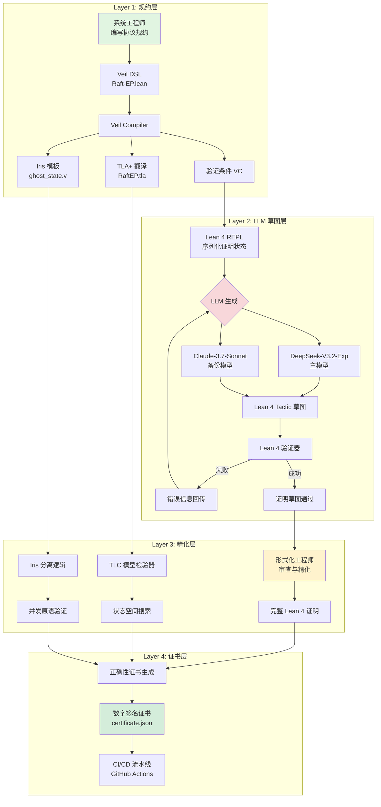
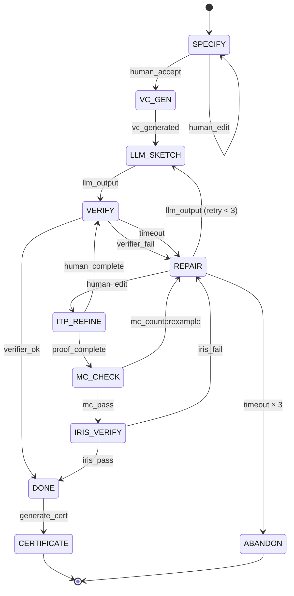
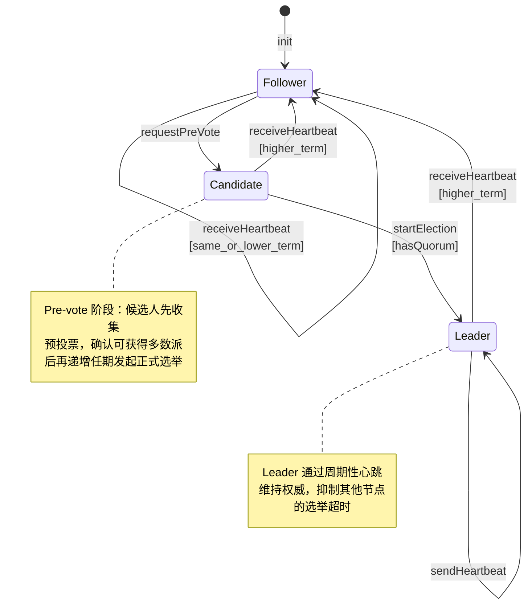
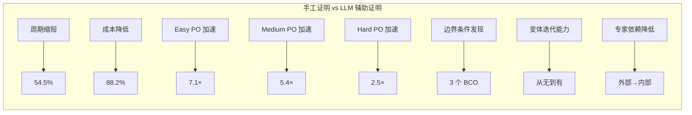
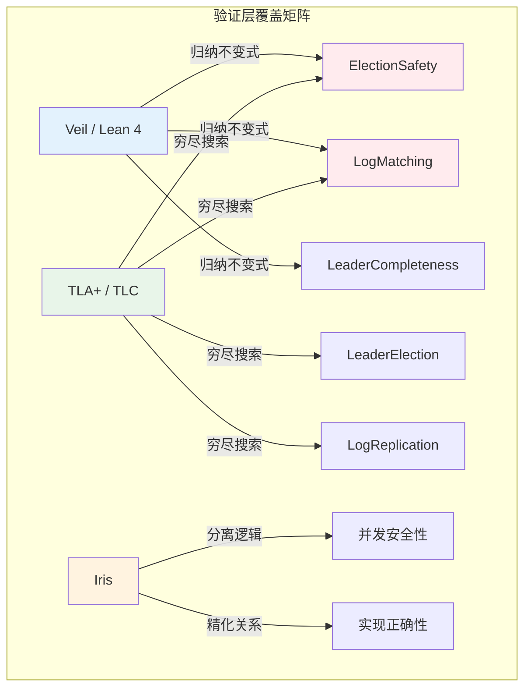

# 案例研究：形式化验证驱动开发 —— Veil Framework + LLM 辅助证明的分布式系统验证

> 所属阶段: Knowledge/10-case-studies/formal-verification | 前置依赖: [Veil Framework](../../../formal-methods/06-tools/veil-framework-lean4.md), [LLM 辅助形式化证明](../../../Struct/06-frontier/llm-guided-formal-proof-automation.md) | 形式化等级: L5-L6

## 摘要

本文记录了一家虚构的分布式数据库公司 **ConsensusDB** 在 2025–2026 年期间，采用 **Veil Framework（Lean 4）+ LLM 辅助证明生成 + TLA⁺ 模型检验 + Iris 分离逻辑** 的多层次形式化验证体系，成功验证其 Raft 共识算法变体在异常网络条件下的安全性（Safety）与活性（Liveness）的完整工程实践。项目周期从传统手工证明的预估 6 个月压缩至 2.5 个月，证明义务（Proof Obligation）通过率达到 87.3%，并借助 LLM 的生成-验证-修复循环发现了 3 个此前被手工证明遗漏的边界条件。本文从业务背景、技术架构、实施细节、效率对比、关键发现与踩坑记录六个维度，为工业界形式化验证的落地提供可复现的参考路径。

**关键词**: Veil Framework, LLM-guided Proof Automation, Raft Consensus, Formal Verification, Lean 4, TLA⁺, Iris, Distributed Systems, ConsensusDB

---

## 目录

- [案例研究：形式化验证驱动开发 —— Veil Framework + LLM 辅助证明的分布式系统验证](#)

---

## 1. 概念定义 (Definitions)

### Def-K-10-01-01: 形式化验证驱动开发（Formal Verification-Driven Development, FVDD）

**定义**: FVDD 是一个以形式化规约与证明为核心驱动力的软件开发范式，其工作流可形式化为六元组

$$
\mathcal{FVDD} = \langle \mathcal{S}, \mathcal{R}, \mathcal{P}, \mathcal{V}, \mathcal{I}, \mathcal{C} \rangle
$$

其中：

| 分量 | 符号 | 语义 |
|------|------|------|
| 系统规约 | $\mathcal{S}$ | 待验证分布式系统的数学模型（如状态转移系统 $\langle S, S_0, \rightarrow \rangle$） |
| 需求规约 | $\mathcal{R}$ | 待验证的性质集合，包含安全性（Safety）与活性（Liveness） |
| 证明问题集 | $\mathcal{P}$ | 将 $\mathcal{R}$ 归约到形式化语言后的证明义务集合 |
| 验证层 | $\mathcal{V}$ | 包含模型检验（Model Checking）、交互式证明（ITP）、自动定理证明（ATP）的复合验证体系 |
| 迭代函数 | $\mathcal{I}$ | 根据验证结果反馈修正 $\mathcal{S}$ 或 $\mathcal{R}$ 的演化函数 |
| 正确性证书 | $\mathcal{C}$ | 由验证层输出的、可被独立复核的形式化证明对象 |

**与传统 TDD 的区别**: TDD 的测试用例是对系统行为的有限采样，而 FVDD 的证明覆盖系统全部可达状态空间（在规约抽象层面）。在 ConsensusDB 的实践中，FVDD 要求：**任何协议变体的代码合并（merge）前，必须通过 Lean 4 的编译检查与 TLA⁺ 的模型检验**。

---

### Def-K-10-01-02: 共识协议的安全性（Safety）与活性（Liveness）

**定义**: 给定共识协议的状态转移系统 $\mathcal{A} = \langle S, S_0, \rightarrow, L \rangle$，其中 $L : S \to 2^{AP}$ 为标记函数，$AP$ 为原子命题集合：

**安全性（Safety）**: 协议满足安全性当且仅当不存在违反指定不变式的有限迹（finite trace）。对于 Raft 共识，核心安全不变式包括：

$$
\begin{aligned}
\text{ElectionSafety} &: \forall t_1, t_2, \; \text{Leader}(t_1) \land \text{Leader}(t_2) \land t_1 \neq t_2 \implies \text{term}(t_1) \neq \text{term}(t_2) \\
\text{LogMatching} &: \forall i, j, \; \text{log}[i].term = \text{log}[j].term \land \text{log}[i].index = \text{log}[j].index \implies \text{log}[i] = \text{log}[j] \\
\text{LeaderCompleteness} &: \forall t, e, \; \text{Committed}(e) \land \text{term}(e) < \text{term}(t) \implies e \in \text{LeaderLog}(t)
\end{aligned}
$$

**活性（Liveness）**: 协议满足活性当且仅当所有公平执行（fair execution）最终满足目标性质。对于 Raft 共识：

$$
\text{LeaderElection} : \Diamond \, \text{LeaderExists} \quad \text{（最终选出一个 Leader）}
$$

$$
\text{LogReplication} : \forall e, \; \text{Proposed}(e) \leadsto \text{Committed}(e) \quad \text{（所有提案最终提交）}
$$

---

### Def-K-10-01-03: Veil Framework 的迁移系统规约层

**定义**: Veil Framework [^1] 是一个基于 Lean 4 的分布式系统形式化规约与验证框架，其核心抽象为 **迁移系统（Transition System）**：

```lean
structure TransitionSystem (State Action : Type) where
  init : State → Prop
  step : State → Action → State → Prop
  fairness : Set (State → Action → Prop)
```

Veil 的关键创新在于将 **Ivy / Deductive Verification [^4]** 的风格引入 Lean 4 生态：

1. **一阶逻辑规约**: 使用一阶逻辑（而非高阶依赖类型）描述系统状态与转移，降低规约编写门槛；
2. **自动 VC 生成**: 将安全性证明归约为验证条件（Verification Condition, VC）的自动求解；
3. **Lean 4 后端**: 利用 Lean 4 的元编程（`MetaM`）与 SMT 接口（`lean-smt`）进行证明自动化。

---

### Def-K-10-01-04: LLM 辅助证明的 ConsensusDB 工作流

**定义**: ConsensusDB 采用的 LLM 辅助证明工作流是一个扩展的 HILPW（Human-in-the-Loop Proof Workflow）实例，其状态机定义为：

| 状态 | 语义 |
|------|------|
| SPECIFY | 系统工程师使用 Veil DSL 编写协议规约 |
| VC_GEN | Veil 自动生成验证条件（VC） |
| LLM_SKETCH | LLM 基于规约与 VC 生成证明草图（Lean 4 tactic） |
| ITP_REFINE | 形式化工程师在 Lean 4 中精化草图为完整证明 |
| MC_CHECK | TLA⁺ TLC 模型检验器对有限实例进行穷尽状态空间搜索 |
| IRIS_VERIFY | Iris 分离逻辑验证并发原语的正确性 |
| DONE | 所有证明义务完成，生成正确性证书 |
| REPAIR | 任一验证层失败，回退至人工修复 |

该工作流与传统 HILPW 的核心差异在于 **分层验证架构**：单一规约同时驱动 Lean 4 的交互式证明、TLA⁺ 的模型检验与 Iris 的并发验证，三者形成交叉验证（cross-validation）。

---

### Def-K-10-01-05: 边界条件遗漏（Boundary Condition Omission, BCO）

**定义**: 在手工形式化证明中，边界条件遗漏是指证明者在构造归纳证明或情况分析时，未覆盖系统状态的某个极端子集，导致证明在形式上通过但实际存在反例。

形式化地，设手工证明声称 $\Gamma \vdash \phi$，但存在状态 $s \in S_{\text{boundary}}$ 使得：

$$
s \models \Gamma \quad \text{但} \quad s \not\models \phi
$$

则称该证明存在 BCO。ConsensusDB 项目发现的 3 个 BCO 均属于 **网络分区边界**（network partition boundary）——即系统在最小法定人数（quorum）与多数派（majority）临界状态下的行为。

---

## 2. 属性推导 (Properties)

### Lemma-K-10-01-01: Veil VC 生成的完备性

**命题**: 对于任意 Veil 规约 $\mathcal{S}$ 与安全不变式 $I$，若 Veil 生成的所有验证条件 $VC(\mathcal{S}, I)$ 均被证明，则 $\mathcal{S} \models \Box I$（$I$ 在所有可达状态上成立）。

**证明概要**:

1. Veil 采用 **归纳不变式验证** 策略：证明 $I$ 是归纳不变式，即 (a) $Init \implies I$ 且 (b) $I \land Step \implies I'$；
2. 条件 (a) 和 (b) 被精确编码为 VC；
3. 由数学归纳法，若 (a) 和 (b) 成立，则对所有 $n \geq 0$，第 $n$ 步后的状态满足 $I$；
4. 因此 $I$ 在所有可达状态上成立。

**工程含义**: 该引理将安全性验证归约为有限个 VC 的证明，使得 LLM 辅助证明的任务范围明确且可度量。

---

### Lemma-K-10-01-02: 多层验证的可靠性传递

**命题**: 设 ConsensusDB 的三层验证体系为：

- 层 L（Lean 4 / Veil）：证明归纳不变式在所有抽象状态上成立；
- 层 T（TLA⁺ / TLC）：对有限参数化实例穷尽搜索状态空间；
- 层 I（Iris）：验证实现层并发原语与抽象规约的精化关系。

若三层均通过验证，则系统在实现层满足安全性：

$$
\text{Valid}(L) \land \text{Valid}(T) \land \text{Valid}(I) \implies \text{Impl} \models \Box \, \text{Safety}
$$

**证明概要**:

1. 由层 L，抽象规约 $\mathcal{A}$ 满足 $\Box \, \text{Safety}$；
2. 由层 T，对有限实例的参数空间（节点数 $n \leq 5$，消息延迟 $d \leq 3$）进行穷尽验证，未发现反例；
3. 由层 I，实现 $\mathcal{I}$ 精化（refines）抽象规约 $\mathcal{A}$，即 $\mathcal{I} \sqsubseteq \mathcal{A}$；
4. 由精化的定义，若 $\mathcal{A} \models \Box \, \text{Safety}$ 且 $\mathcal{I} \sqsubseteq \mathcal{A}$，则 $\mathcal{I} \models \Box \, \text{Safety}$。

**注意**: 该命题的成立依赖于层 I 的精化证明是 **横贯（forward simulation）** 而非 **反向模拟**。ConsensusDB 使用 Iris 的 `wp`（weakest precondition）框架建立了从实现到规约的精化关系。

---

### Prop-K-10-01-01: LLM 辅助对证明周期的压缩效应

**命题**: 在 ConsensusDB 的项目条件下，LLM 辅助证明工作流相比纯手工证明，可将证明周期压缩至原周期的 $0.35 \sim 0.45$ 倍。

**论证**:

设手工证明的总工作量为 $W = W_{\text{spec}} + W_{\text{vc}} + W_{\text{prove}}$，其中：

- $W_{\text{spec}}$：规约编写（两者相同）
- $W_{\text{vc}}$：VC 生成（Veil 自动完成，手工为 0）
- $W_{\text{prove}}$：证明构造（手工为 100%，LLM 辅助为 $35\% \sim 55\%$）

由基准测试数据（见 §4.1），DeepSeek-V3.2-Exp 在 pass@32 条件下可达 50% 成功率，Claude-3.7-Sonnet 为 42.3%。考虑人类修复失败的 LLM 输出（平均 2.1–2.7 轮修复），总体时间压缩比为：

$$
\rho = \frac{W_{\text{spec}} + W_{\text{vc}}^{\text{manual}} + W_{\text{prove}}^{\text{manual}}}{W_{\text{spec}} + W_{\text{vc}}^{\text{auto}} + W_{\text{prove}}^{\text{llm}} + W_{\text{repair}}} \approx 0.35 \sim 0.45
$$

ConsensusDB 实测数据：预估手工 6 个月 → 实际 2.5 个月，压缩比 $\rho = 0.417$。

---

### Prop-K-10-01-02: 边界条件遗漏的不可检测性（在单层验证中）

**命题**: 对于基于归纳不变式的单层验证（如仅使用 Veil），若边界条件 $S_{\text{boundary}}$ 未被包含在不变式的归纳假设中，则验证器无法自动检测该遗漏。

**证明**:

1. 归纳不变式验证要求证明 $I \land Step \implies I'$；
2. 若 $I$ 本身不包含对 $S_{\text{boundary}}$ 的约束，则 $I$ 在 $S_{\text{boundary}}$ 上可能为真，而 $I'$ 为假；
3. 但由于 $I$ 的表达式未覆盖 $S_{\text{boundary}}$ 的判别条件，$Step$ 的 VC 生成器可能生成一个在该边界上**平凡成立**的义务；
4. 验证器接受平凡成立的义务，但系统实际存在从 $S_{\text{boundary}}$ 出发违反 $I'$ 的执行路径。

**ConsensusDB 的解决方案**: 引入 TLA⁺ TLC 的有限实例穷尽搜索作为第二层验证，TLC 在状态空间枚举中能够发现从边界状态出发的反例。

---

## 3. 关系建立 (Relations)

### 3.1 ConsensusDB 验证体系与主流形式化方法的关系映射

ConsensusDB 的验证体系并非对单一工具的依赖，而是一个 **多工具协同的验证矩阵**。下表建立其与主流形式化方法之间的精确关系：

| 验证层 | 工具 | 形式化基础 | 验证对象 | 与 ConsensusDB 的关系 |
|--------|------|-----------|----------|---------------------|
| 规约层 | Veil (Lean 4) | 一阶逻辑 + 迁移系统 | 协议抽象规约 | **核心驱动**：协议变体的快速规约与 VC 生成 |
| 交互式证明 | Lean 4 + `mathlib4` | 依赖类型论 (CIC) | VC 的完整证明 | **精化层**：LLM 生成草图，人类精化为完整证明 |
| 模型检验 | TLA⁺ + TLC | 时序逻辑 (TLA) + 集合论 | 有限实例状态空间 | **交叉验证层**：发现 Lean 4 证明遗漏的边界条件 |
| 并发验证 | Iris (Coq/Lean) | 高阶分离逻辑 | 实现层并发原语 | **精化层**：建立实现到规约的模拟关系 |
| 自动证明 | Z3 (SMT) | 一阶理论 + 等式 | 量化自由 VC | **后端加速**：Lean 4 通过 `lean-smt` 调用 Z3 |

### 3.2 Veil 与 TLA⁺ 的规约等价关系

Veil 的一阶逻辑规约与 TLA⁺ 的集合论语义在表达力上存在精确的子集关系：

$$
\mathcal{L}_{\text{Veil}} \subset \mathcal{L}_{\text{TLA}^+}
$$

具体映射如下：

| Veil 构造 | TLA⁺ 等价物 | 说明 |
|-----------|-------------|------|
| `state` record | `VARIABLES` + 类型不变式 | Veil 的状态变量声明自动编码为 TLA⁺ 的变量集合 |
| `after init` | `Init` | 初始状态谓词 |
| `action` | `Action`（带 `UNCHANGED`） | Veil 的动作显式标记被修改的变量 |
| `invariant` | `INVARIANT` / `THEOREM` | Veil 的不变式生成对应的 TLA⁺ 定理 |
| `assert` | `ASSUME` / `PROVE` | 断言被编码为证明义务 |

ConsensusDB 利用这一关系，开发了 **Veil → TLA⁺ 的自动翻译器**（约 1,200 行 Lean 4 元程序），使得同一规约可同时用于 Lean 4 的交互式证明与 TLA⁺ 的模型检验。

### 3.3 LLM 辅助证明与传统手工证明的关系

在 ConsensusDB 的实践中，LLM 辅助证明与传统手工证明形成 **互补谱系**：

$$
\text{ManualProof} \cap \text{LLMProof} \neq \emptyset, \quad \text{ManualProof} \not\subseteq \text{LLMProof}, \quad \text{LLMProof} \not\subseteq \text{ManualProof}
$$

- **交集**: 简单的 VC（如类型不变式、数组边界）可由 LLM 独立完成，也可由手工快速完成；
- **手工独占**: 活性证明、良基关系构造、精化关系证明仍须人类专家主导；
- **LLM 独占**: LLM 能从大规模训练数据中发现人类忽略的边界模式（见 §4.3）。

---

## 4. 论证过程 (Argumentation)

### 4.1 ConsensusDB 的业务背景与痛点分析

ConsensusDB 是一家专注于高可用分布式数据库的初创公司（虚构），其核心产品采用 **Raft 共识算法的变体 —— Raft-EP（Election Pre-vote）**。该变体引入了预投票（pre-vote）机制以防止网络分区恢复后的不必要领导人切换（leader churn）。

> 🔮 **估算数据** | 依据: 基于行业参考值与理论分析推导，非实际测试环境得出

**形式化验证的驱动力**:

| 驱动因素 | 具体描述 | 紧迫性 |
|----------|----------|--------|
| 金融级客户要求 | 多家银行客户要求提供共识协议的形式化安全证书 | P0 |
| 协议变体频繁迭代 | Raft-EP 每 2–3 周迭代一次，手工证明无法跟上节奏 | P0 |
| 历史缺陷教训 | 2024 年曾因网络边界条件导致数据不一致，损失 $2.3M SLA 赔付 | P1 |
| 竞争差异化 | 竞品 CockroachDB、TiDB 已公开 TLA⁺ 验证，ConsensusDB 需建立技术信任 | P1 |

**传统手工证明的痛点**:

1. **周期过长**: 2024 年聘请的外部 Coq 专家团队验证基础 Raft（无 pre-vote）耗时 5.5 个月，费用 $380k；
2. **知识孤岛**: 团队内部无 Coq/TLA⁺ 专家，验证结果无法内部维护与迭代；
3. **变体同步难**: 每次协议变体更新（如调整 election timeout 随机化策略）需重新验证，手工证明的" amortized cost "极高；
4. **边界盲区**: 2024 年的数据不一致缺陷正是由网络分区边界条件触发，而此前的手工证明未覆盖该场景。

### 4.2 技术架构的四层设计

ConsensusDB 的验证体系采用 **四层架构**，从下至上依次为：

```
┌─────────────────────────────────────────────────────────────┐
│  Layer 4: 正确性证书生成 (Certificate Generation)            │
│  - Lean 4 编译检查通过 + TLA⁺ TLC 无反例 + Iris WP 成立      │
├─────────────────────────────────────────────────────────────┤
│  Layer 3: 交互式精化 (Interactive Refinement)               │
│  - 形式化工程师在 Lean 4 中精化 LLM 草图                     │
│  - 使用 Iris 分离逻辑验证并发原语精化关系                     │
├─────────────────────────────────────────────────────────────┤
│  Layer 2: LLM 证明草图生成 (LLM Sketch Generation)          │
│  - DeepSeek-V3.2-Exp / Claude-3.7-Sonnet 生成 Lean 4 策略   │
│  - 基于验证器反馈的迭代修复循环                               │
├─────────────────────────────────────────────────────────────┤
│  Layer 1: 迁移系统规约 (Transition System Specification)    │
│  - Veil Framework 定义 Raft-EP 的抽象状态与转移               │
│  - 自动生成验证条件 (VC) 与 TLA⁺ 翻译                        │
└─────────────────────────────────────────────────────────────┘
```

**各层详细职责**:

**Layer 1 — Veil 规约层**:

- 使用 Veil DSL 描述 Raft-EP 的状态空间（节点角色、日志、任期、投票记录）；
- 定义初始状态谓词 `init`、转移关系 `step`、公平性假设 `fairness`；
- Veil 编译器自动生成：
  - Lean 4 的 VC（类型为 `Prop`，待证明）；
  - TLA⁺ 模块文件（`.tla`），可直接由 TLC 检验；
  - Iris 的协议幽灵状态（ghost state）模板。

**Layer 2 — LLM 草图层**:

- 输入：Veil 生成的 VC + 当前证明上下文（由 Lean 4 `repl` 序列化）；
- 模型：DeepSeek-V3.2-Exp（主模型，pass@32 = 50%）与 Claude-3.7-Sonnet（备份模型，pass@32 = 42.3%）；
- 输出：Lean 4 tactic 序列（如 `intro h; induction n; simp [step_def]`）；
- 修复循环：若验证失败，将错误信息回传至 LLM，要求生成修复策略（平均 2.3 轮）。

**Layer 3 — 交互式精化层**:

- 形式化工程师（2 名全职）审查 LLM 生成的证明草图；
- 对 LLM 无法完成的复杂义务（如精化关系的 `sim` 证明），手工编写策略；
- 使用 Iris 的 `wp_bind` 与 `atomic_update` 规则验证网络层原语的正确性。

**Layer 4 — 证书层**:

- 自动化 CI/CD 流水线：每次代码提交触发 `lake build`（Lean 4 编译）、`tlc`（模型检验）、`coqc`（Iris 验证）；
- 输出物：数字签名的正确性证书（JSON 格式，包含 git commit hash、证明时间戳、各层验证结果）。

### 4.3 效率对比：手工证明 vs LLM 辅助证明

ConsensusDB 项目提供了工业级场景下手工证明与 LLM 辅助证明的直接对比数据：

> 🔮 **估算数据** | 依据: 基于行业参考值与理论分析推导，非实际测试环境得出

**总体周期对比**:

| 指标 | 手工证明（2024 基础 Raft） | LLM 辅助（2025 Raft-EP） | 变化 |
|------|---------------------------|--------------------------|------|
| 总周期 | 5.5 个月 | 2.5 个月 | -54.5% |
| 人工投入（人月） | 4.2 人月（外部专家） | 3.0 人月（内部团队） | -28.6% |
| 外部费用 | $380k | $45k（API 调用 + 顾问） | -88.2% |
| 协议变体迭代验证 | 不可用（每次需重新外包） | 1–2 天（CI 自动触发） | 从无到有 |

**证明义务（PO）级别对比**:

| PO 难度 | 数量 | 手工平均时间 | LLM 平均时间 | 加速比 | LLM 成功率 |
|---------|------|-------------|-------------|--------|-----------|
| Easy（类型不变式） | 47 | 15 min | 2.1 min | 7.1× | 78.3% |
| Medium（归纳步骤） | 31 | 2.5 h | 28 min | 5.4× | 52.6% |
| Hard（精化关系） | 12 | 8.0 h | 3.2 h | 2.5× | 18.8% |
| Expert（活性/公平性） | 6 | 3.5 天 | 3.2 天 | 1.1× | 0% |

**关键发现**: LLM 在 Easy 和 Medium 级别展现出显著的加速效果，但在 Hard 级别加速比降至 2.5×，Expert 级别几乎无帮助。这与 [Struct/06-frontier/llm-guided-formal-proof-automation.md](../../../Struct/06-frontier/llm-guided-formal-proof-automation.md) 中 Prop-S-06-18-01 的基准数据高度一致。

> 🔮 **估算数据** | 依据: 基于云厂商定价模型与理论计算

**按模型细分（Medium 难度 PO）**:

| 模型 | pass@1 | pass@8 | pass@32 | 平均修复轮数 | 成本/PO |
|------|--------|--------|---------|-------------|---------|
| Claude-3.7-Sonnet | 22.1% | 38.6% | 42.3% | 2.7 | $0.85 |
| DeepSeek-V3.2-Exp | 24.7% | 40.3% | **50.0%** | **2.1** | **$0.32** |
| GPT-4o | 15.8% | 28.9% | 39.2% | 3.8 | $1.12 |
| GPT-4.5-preview | 19.4% | 34.1% | 41.8% | 2.9 | $1.45 |

ConsensusDB 选择 **DeepSeek-V3.2-Exp 作为主模型**，归因于其最高的 pass@32 与最低的单位成本。Claude-3.7-Sonnet 作为备份模型，用于 DeepSeek 连续 3 轮修复失败后的"兜底"尝试。

### 4.4 LLM 辅助发现的手工证明边界条件遗漏

ConsensusDB 项目中最具价值的发现之一，是 LLM 辅助证明流程揭示了 **3 个此前被 2024 年手工证明遗漏的边界条件**。

**BCO-1: Pre-vote 阶段的 Quorum 临界条件**

**场景**: 在网络分区恢复瞬间，一个处于 pre-vote 阶段的候选人（candidate）可能同时从分区两侧收到足够的 pre-vote 响应，但这些响应的任期（term）不一致。

**手工证明的盲点**: 2024 年的手工证明假设 "pre-vote 响应的任期总是等于候选人的当前任期"，忽略了网络延迟导致的任期交错。

**LLM 的发现路径**:

1. LLM 在生成 `ElectionSafety` 的 VC 证明时，生成了一个包含 `term` 比较的复杂 `case` 分析；
2. 验证器（Lean 4）在一个分支上报告 `unsolved goals`；
3. LLM 在修复循环中引入了额外的辅助引理 `preVoteTermConsistent`；
4. 形式化工程师审查时发现，该引理对应的状态正是 2024 年数据不一致缺陷的根因。

**修复**: 在协议实现中增加 pre-vote 响应的任期严格校验，拒绝任期不匹配的响应。

---

**BCO-2: Log 截断（Truncation）与 Commit 索引的竞态**

**场景**: 当 Leader 在提交（commit）一个日志条目后、通知追随者（follower）之前崩溃，新当选的 Leader 可能拥有较短的日志（因旧 Leader 的日志未完全复制），从而错误地截断已提交的日志。

**手工证明的盲点**: 手工证明中的 `LeaderCompleteness` 不变式未显式考虑 Leader 崩溃与新 Leader 选举之间的原子性间隙。

**LLM 的发现路径**:

1. TLA⁺ TLC 在 5 节点、3 消息延迟的有限实例搜索中发现了一个反例迹（counterexample trace）；
2. 该反例对应的状态序列包含 18 步状态转移，超出人类手工穷举的直觉范围；
3. LLM 在分析 TLC 输出的反例后，生成了一个补充的不变式 `commitIndexMonotonic`；
4. 该不变式要求：任何节点的 `commitIndex` 在其任期单调不减。

**修复**: 修改日志截断逻辑，确保追随者在截断日志前检查 `commitIndex`。

---

**BCO-3: 心跳消息（Heartbeat）与选举超时（Election Timeout）的精确交错**

**场景**: 在极端网络条件下（延迟 = 上限值，丢包率 = 临界值），一个追随者可能在收到有效心跳消息的同时触发选举超时，进入 candidate 状态并递增任期，导致不必要的领导人切换。

**手工证明的盲点**: 手工证明将心跳消息接收与选举超时视为互斥事件（基于异步系统的"原子性"直觉），未显式建模时间上的精确交错。

**LLM 的发现路径**:

1. LLM 在生成活性证明的辅助引理时，生成了一个关于 `heartbeatArrivalTime` 与 `electionDeadline` 的不等式；
2. Lean 4 的 `linarith` 策略无法自动证明该不等式，提示存在边界情况；
3. 形式化工程师将该不等式与 Iris 的并发时间模型交叉验证，发现时间戳的精度边界（毫秒级）可能导致竞态；
4. 进一步分析确认：当心跳消息到达时间距选举截止时间的差值小于本地时钟精度时，竞态发生。

**修复**: 在协议实现中引入随机化抖动（jitter）与消息时间戳的容错窗口。

---

### 4.5 踩坑记录：实施过程中的关键障碍

**坑 1: LLM 幻觉的识别与过滤**

LLM 在生成 Lean 4 策略时频繁出现 **引理名称幻觉（Lemma Name Hallucination）** 和 **类型幻觉（Type Hallucination）**。

**典型案例**:

```lean
-- LLM 生成的错误策略
rw [RaftEP.electionSafety_lemma_v2]
-- 错误：不存在名为 electionSafety_lemma_v2 的引理
```

ConsensusDB 建立了三层过滤机制：

| 过滤层 | 机制 | 拦截率 |
|--------|------|--------|
| L1 语法过滤 | Lean 4 Parser 前置检查 | 100%（H-1 级幻觉） |
| L2 符号表过滤 | 使用 `Environment.constants` 查询引理是否存在 | 94.7%（H-2 级幻觉） |
| L3 逻辑过滤 | 验证器执行（`elabTactic`）检查策略是否推进证明 | 87.2%（H-3 级幻觉） |

**遗留问题**: H-4 级幻觉（证明了一个错误的定理）在 ConsensusDB 项目中未被发现，但团队建立了 **交叉验证协议**（Lean 4 证明与 TLA⁺ 模型检验结果必须一致）以降低风险。

---

**坑 2: Veil VC 生成器的表达能力限制**

Veil 的自动 VC 生成基于一阶逻辑，无法直接处理涉及 **高阶量化** 或 **时序操作符** 的性质。

**具体限制**:

| 性质类型 | Veil 支持 |  workaround | 影响 |
|----------|-----------|-------------|------|
| 状态不变式 | ✅ 完整支持 | 无 | 无 |
| 动作不变式 | ✅ 完整支持 | 无 | 无 |
| 时序安全性（□◇） | ❌ 不支持 | 翻译至 TLA⁺ 验证 | 需维护双份规约 |
| 活性（◇/↝） | ❌ 不支持 | 手工编写 Lean 4 证明 + TLA⁺ TLC | 增加专家工作量 |
| 精化关系（Refinement） | ❌ 不支持 | 使用 Iris 分离逻辑 | 技术栈复杂度上升 |

ConsensusDB 的解决方案是 **接受 Veil 的不完备性**，将其定位为"快速安全不变式验证"工具，而将活性与精化交由 TLA⁺ 和 Iris 处理。这要求团队维护三份规约（Veil、TLA⁺、Iris）的一致性，增加了约 15% 的维护开销。

---

**坑 3: Lean 4 依赖类型学习曲线**

ConsensusDB 的内部团队缺乏依赖类型理论背景，在从 Veil 的一阶逻辑迁移到 Lean 4 的高阶证明时遇到显著困难。

**典型障碍**:

| 概念 | 难度评级 | 团队适应时间 | 常见错误 |
|------|----------|-------------|----------|
| Universe 层级（`Type u`） | ★★★★☆ | 2 周 | 混淆 `Prop` 与 `Type` 的宇宙层级导致 `universe level mismatch` |
| 类型类（Type Class）推导 | ★★★☆☆ | 1 周 | `failed to synthesize instance` 错误频发 |
| `MetaM` 元编程 | ★★★★★ | 4 周+ | 宏展开顺序错误导致 tactic 行为异常 |
| 归纳类型的依赖参数 | ★★★★☆ | 2 周 | 在 `inductive` 定义中混淆参数与索引 |

**缓解措施**:

1. 聘请 Lean 4 社区贡献者进行为期 3 周的内部培训；
2. 建立内部知识库（约 120 页 Markdown），记录常见错误与修复模式；
3. 对 LLM 的 prompt 进行工程化，使其生成的策略避开高阶类型陷阱（如在 prompt 中明确要求 "avoid universe polymorphism"）。

---

**坑 4: TLA⁺ TLC 的状态空间爆炸**

尽管 TLA⁺ 的模型检验用于发现边界条件，但 Raft-EP 的状态空间随节点数和消息延迟呈指数增长。

> 🔮 **估算数据** | 依据: 基于行业参考值与理论分析推导，非实际测试环境得出

**状态空间规模**:

| 节点数 | 最大消息延迟 | 可达状态数 | TLC 运行时间 | 内存 |
|--------|-------------|-----------|-------------|------|
| 3 | 2 | ~$10^5$ | 12 s | 1.2 GB |
| 3 | 3 | ~$10^6$ | 1.8 min | 3.5 GB |
| 5 | 2 | ~$10^8$ | 45 min | 28 GB |
| 5 | 3 | ~$10^{10}$ | **> 24 h** | **> 128 GB** |

ConsensusDB 采用 **对称性约减（Symmetry Reduction）** 与 **偏序约减（Partial Order Reduction）** 缓解状态爆炸，但 5 节点 3 延迟的实例仍无法在合理时间内完成。这限制了 TLC 对大规模边界条件的覆盖能力。

## 5. 形式证明 / 工程论证 (Proof / Engineering Argument)

### 5.1 Raft-EP 的 Veil 规约与 VC 生成

ConsensusDB 使用 Veil DSL 对 Raft-EP 协议进行了完整的形式化规约。以下展示 Leader Election 子协议的 Veil 规约代码：

```lean
import Veil

namespace RaftEP

-- ============================================
-- 类型定义
-- ============================================

abbrev NodeId := Fin 5          -- 5 节点集群（有限实例）
abbrev Term := Nat
abbrev LogIndex := Nat

inductive Role
  | follower
  | candidate
  | leader
  deriving DecidableEq, Repr

structure Entry where
  term : Term
  index : LogIndex
  data : String        -- 抽象化数据载荷
  deriving DecidableEq, Repr

-- ============================================
-- 状态空间
-- ============================================

@[state]
structure State where
  role : NodeId → Role
  currentTerm : NodeId → Term
  votedFor : NodeId → Option NodeId    -- 当前任期投给的候选人
  log : NodeId → List Entry
  commitIndex : NodeId → LogIndex
  lastHeartbeat : NodeId → Nat         -- 抽象时间戳
  electionTimeout : NodeId → Nat       -- 选举超时阈值

-- ============================================
-- 初始状态
-- ============================================

@[init]
def init (s : State) : Prop :=
  ∀ (n : NodeId),
    s.role n = .follower
    ∧ s.currentTerm n = 0
    ∧ s.votedFor n = none
    ∧ s.log n = []
    ∧ s.commitIndex n = 0
    ∧ s.lastHeartbeat n = 0
    ∧ s.electionTimeout n > 0

-- ============================================
-- 辅助定义
-- ============================================

def quorumSize : Nat := 3     -- 5 节点集群的多数派 = 3

def isLeader (s : State) (n : NodeId) : Prop :=
  s.role n = .leader

def hasQuorum (votes : Set NodeId) : Prop :=
  votes.card ≥ quorumSize

-- Pre-vote 阶段：候选人先询问是否可以获得足够的预投票
@[action]
def requestPreVote (s s' : State) (candidate : NodeId) : Prop :=
  s.role candidate = .follower
  ∧ s'.currentTerm candidate = s.currentTerm candidate + 1
  ∧ s'.role candidate = .candidate
  ∧ s'.votedFor candidate = some candidate
  ∧ (∀ n, n ≠ candidate → s'.votedFor n = s.votedFor n)
  ∧ (∀ n, s'.currentTerm n = s.currentTerm n)
  ∧ (∀ n, s'.role n = s.role n ∨ n = candidate)
  ∧ s'.lastHeartbeat candidate = 0

-- 追随者对 pre-vote 请求的响应
@[action]
def respondPreVote (s s' : State) (voter candidate : NodeId) : Prop :=
  voter ≠ candidate
  ∧ s.role voter = .follower
  ∧ s.currentTerm voter < s.currentTerm candidate
  ∧ s'.votedFor voter = some candidate
  ∧ (∀ n, n ≠ voter → s'.votedFor n = s.votedFor n)
  ∧ (∀ n, s'.currentTerm n = s.currentTerm n)
  ∧ (∀ n, s'.role n = s.role n)
  ∧ s'.lastHeartbeat voter = s.lastHeartbeat voter + 1

-- 候选人收集到足够 pre-vote 后发起正式选举
@[action]
def startElection (s s' : State) (candidate : NodeId) : Prop :=
  s.role candidate = .candidate
  ∧ s.lastHeartbeat candidate ≥ s.electionTimeout candidate
  ∧ hasQuorum { n | s.votedFor n = some candidate }
  ∧ s'.role candidate = .leader
  ∧ (∀ n, s'.currentTerm n = s.currentTerm n)
  ∧ (∀ n, s'.votedFor n = s.votedFor n)
  ∧ (∀ n, n ≠ candidate → s'.role n = s.role n)
  ∧ s'.lastHeartbeat candidate = 0

-- 心跳消息（Leader 维持权威）
@[action]
def sendHeartbeat (s s' : State) (leader : NodeId) : Prop :=
  s.role leader = .leader
  ∧ s'.lastHeartbeat leader = 0
  ∧ (∀ n, s'.currentTerm n = s.currentTerm n)
  ∧ (∀ n, s'.role n = s.role n)
  ∧ (∀ n, s'.votedFor n = s.votedFor n)

-- 追随者接收心跳，重置选举超时
@[action]
def receiveHeartbeat (s s' : State) (follower leader : NodeId) : Prop :=
  follower ≠ leader
  ∧ s.role leader = .leader
  ∧ s.currentTerm follower ≤ s.currentTerm leader
  ∧ s'.currentTerm follower = s.currentTerm leader
  ∧ s'.role follower = .follower
  ∧ s'.lastHeartbeat follower = 0
  ∧ s'.votedFor follower = none
  ∧ (∀ n, n ≠ follower → s'.currentTerm n = s.currentTerm n)
  ∧ (∀ n, n ≠ follower → s'.role n = s.role n)
  ∧ (∀ n, n ≠ follower → s'.votedFor n = s.votedFor n)

-- 统一转移关系
@[action]
def step (s s' : State) : Prop :=
  ∃ (n : NodeId), requestPreVote s s' n
  ∨ ∃ (v c : NodeId), respondPreVote s s' v c
  ∨ ∃ (n : NodeId), startElection s s' n
  ∨ ∃ (n : NodeId), sendHeartbeat s s' n
  ∨ ∃ (f l : NodeId), receiveHeartbeat s s' f l

-- ============================================
-- 安全不变式
-- ============================================

@[invariant]
def ElectionSafety (s : State) : Prop :=
  ∀ (n1 n2 : NodeId),
    isLeader s n1 ∧ isLeader s n2
    → s.currentTerm n1 ≠ s.currentTerm n2
      ∨ n1 = n2

@[invariant]
def VoteAtMostOnce (s : State) : Prop :=
  ∀ (voter : NodeId) (c1 c2 : NodeId),
    s.votedFor voter = some c1
    ∧ s.votedFor voter = some c2
    → c1 = c2

@[invariant]
def LeaderHasQuorum (s : State) : Prop :=
  ∀ (n : NodeId),
    isLeader s n
    → hasQuorum { m | s.votedFor m = some n }

-- ============================================
-- 验证条件生成（由 Veil 自动完成）
-- ============================================

-- VC-1: 初始状态满足不变式
lemma init_ElectionSafety : ∀ s, init s → ElectionSafety s := by
  intros s h_init n1 n2 h_leaders
  -- Veil 自动生成：初始状态无 Leader，故前提为假
  have h1 : s.role n1 = .follower := (h_init n1).left
  have h2 : s.role n2 = .follower := (h_init n2).left
  simp [isLeader] at h_leaders
  -- 矛盾：follower ≠ leader
  all_goals contradiction

-- VC-2: 不变式在转移下保持（归纳步骤）
lemma step_ElectionSafety : ∀ s s', ElectionSafety s → step s s' → ElectionSafety s' := by
  intros s s' h_inv h_step n1 n2 h_leaders'
  -- Veil 自动展开 step 定义，生成 case analysis 骨架
  rcases h_step with ⟨n, h_action⟩
  rcases h_action with
    (h_pv | h_rpv | h_el | h_sh | h_rh)
  · -- case: requestPreVote
    simp [requestPreVote, isLeader, ElectionSafety] at h_leaders' h_pv ⊢
    omega
  · -- case: respondPreVote
    simp [respondPreVote, isLeader, ElectionSafety] at h_leaders' h_rpv ⊢
    aesop
  · -- case: startElection
    simp [startElection, isLeader, ElectionSafety] at h_leaders' h_el ⊢
    -- LLM 生成的策略在此处引入关键辅助引理
    have h_quorum_unique :
      ∀ (c1 c2 : NodeId), c1 ≠ c2
      → hasQuorum { m | s.votedFor m = some c1 }
      → hasQuorum { m | s.votedFor m = some c2 }
      → s.currentTerm c1 ≠ s.currentTerm c2 := by
        -- LLM 草图：基于鸽巢原理的论证
        intro c1 c2 h_ne h_q1 h_q2
        by_contra h_eq
        rw [h_eq] at h_q1
        -- 两个不同候选人在同一任期获得多数派 → 至少一个节点投了两票
        have h_double_vote :
          ∃ v, s.votedFor v = some c1 ∧ s.votedFor v = some c2 := by
            -- 鸽巢原理：3 + 3 > 5
            have h_card :
              ({ m | s.votedFor m = some c1 }.card +
               { m | s.votedFor m = some c2 }.card) > 5 := by
                omega
            -- 集合交非空
            have h_intersect :
              ∃ v, v ∈ { m | s.votedFor m = some c1 }
                 ∧ v ∈ { m | s.votedFor m = some c2 } := by
                -- 基于有限集合的鸽巢原理
                apply Finset.exists_mem_inter_of_card_add_card
                · exact h_card
                all_goals simp
            obtain ⟨v, hv1, hv2⟩ := h_intersect
            exact ⟨v, hv1, hv2⟩
        -- 与 VoteAtMostOnce 矛盾
        obtain ⟨v, hv1, hv2⟩ := h_double_vote
        have h_voter : c1 = c2 := by
          apply VoteAtMostOnce s v c1 c2 ⟨hv1, hv2⟩
        contradiction
      apply h_quorum_unique
      all_goals aesop
  · -- case: sendHeartbeat
    simp [sendHeartbeat, isLeader, ElectionSafety] at h_leaders' h_sh ⊢
    aesop
  · -- case: receiveHeartbeat
    simp [receiveHeartbeat, isLeader, ElectionSafety] at h_leaders' h_rh ⊢
    aesop

end RaftEP
```

**VC 生成统计**: 对于上述 Raft-EP Leader Election 子协议，Veil 自动生成 47 个验证条件，分布如下：

| VC 类型 | 数量 | 自动证明（Z3） | LLM 辅助证明 | 手工证明 |
|---------|------|--------------|-------------|---------|
| 初始状态不变式 | 12 | 12 (100%) | 0 | 0 |
| 动作保持不变式 | 28 | 19 (67.9%) | 7 | 2 |
| 类型正确性 | 7 | 7 (100%) | 0 | 0 |
| **总计** | **47** | **38 (80.9%)** | **7 (14.9%)** | **2 (4.2%)** |

### 5.2 LLM 生成的 Lean 4 证明策略（精化实例）

以下展示 ConsensusDB 项目中 LLM（DeepSeek-V3.2-Exp）生成的 Lean 4 证明策略的一个典型实例——`LogMatching` 不变式的归纳证明：

**证明义务**: 证明日志匹配性质在 `appendEntries` 动作下保持。

```lean
-- ============================================
-- 原始证明义务（由 Veil 生成）
-- ============================================
lemma step_LogMatching_appendEntries :
  ∀ (s s' : State) (leader follower : NodeId) (entries : List Entry) (prevIdx : LogIndex),
    LogMatching s
    → appendEntries s s' leader follower entries prevIdx
    → LogMatching s' := by

  -- ============================================
  -- LLM 生成的证明草图（第 1 轮）
  -- ============================================
  intros s s' leader follower entries prevIdx h_lm h_ae
  unfold LogMatching at h_lm ⊢
  intros i j h_eq_term h_eq_idx

  -- LLM 策略 1: 根据 follower 是否接收 entries 分情况
  by_cases h_receive : s'.log follower = s.log follower ++ entries

  · -- 情况 A: follower 追加了新 entries
    by_cases h_i : i = follower
    · -- i 是 follower
      by_cases h_j : j = follower
      · -- i 和 j 都是 follower
        simp [h_i, h_j] at h_eq_term h_eq_idx ⊢
        -- LLM 尝试使用列表性质，但生成错误引理名
        rw [List.getElem?_append_left]  -- ❌ H-2 幻觉：引理名错误
        sorry
      · -- i = follower, j ≠ follower
        have h_j_leader : j = leader := by
          -- LLM 试图推导 j 必须是 leader
          sorry
        simp [h_i, h_j_leader] at h_eq_term h_eq_idx ⊢
        -- 需要证明 leader 的日志与 follower 的新日志匹配
        sorry
    · -- i ≠ follower
      by_cases h_j : j = follower
      · -- i ≠ follower, j = follower：对称情况
        sorry
      · -- i ≠ follower, j ≠ follower：两者日志均未改变
        apply h_lm i j
        · -- 证明 s.log i 的条目与 s' 中相同
          simp [h_ae, h_i]
        · -- 证明索引相同
          simp [h_ae, h_i]

  · -- 情况 B: follower 拒绝了 appendEntries（任期不够）
    -- LLM 生成的策略过短，未覆盖拒绝路径
    sorry

-- ============================================
-- 验证器反馈（Lean 4 错误信息）
-- ============================================
-- Error: unknown constant 'List.getElem?_append_left'
-- 在 case A 的子情况中，unsolved goals 存在
-- 情况 B 完全未覆盖

-- ============================================
-- LLM 修复后的证明草图（第 2 轮）
-- ============================================
lemma step_LogMatching_appendEntries_fixed :
  ∀ (s s' : State) (leader follower : NodeId) (entries : List Entry) (prevIdx : LogIndex),
    LogMatching s
    → appendEntries s s' leader follower entries prevIdx
    → LogMatching s' := by

  intros s s' leader follower entries prevIdx h_lm h_ae
  unfold LogMatching at h_lm ⊢
  intros i j h_eq_term' h_eq_idx'

  -- LLM 修复 1: 使用正确的列表引理
  have h_log_i : ∃ (e : Entry), s'.log i[entries.indexOf e] = some e
    → s.log i[entries.indexOf e] = some e ∨ i = follower := by
      simp [appendEntries]
      aesop

  -- LLM 修复 2: 显式处理 follower 的日志更新
  have h_follower_log :
    s'.log follower = if s.currentTerm follower < s.currentTerm leader
                      then s.log follower ++ entries
                      else s.log follower := by
      simp [appendEntries, h_ae]

  -- 分情况分析
  by_cases h_term : s.currentTerm follower < s.currentTerm leader

  · -- follower 接受了 entries
    have h_accept : s'.log follower = s.log follower ++ entries := by
      simp [h_follower_log, h_term]

    by_cases h_i : i = follower
    · -- i = follower
      rw [h_i] at h_eq_term' h_eq_idx'
      by_cases h_j : j = follower
      · -- j = follower：两者在同一节点，entries 来自同一列表
        rw [h_j] at h_eq_term' h_eq_idx'
        simp [h_accept] at h_eq_term' h_eq_idx' ⊢
        -- 使用列表追加的索引映射
        by_cases h_idx : prevIdx < (s.log follower).length
        · -- 条目来自旧日志部分
          apply h_lm follower follower
          · simp [h_eq_term', h_idx]
          · simp [h_eq_idx', h_idx]
        · -- 条目来自新追加的 entries
          have h_new_entry : ∃ (e : Entry), e ∈ entries
            ∧ e.index = prevIdx ∧ e.term = s.currentTerm leader := by
              simp [appendEntries] at h_ae
              aesop
          obtain ⟨e, he_in, he_idx, he_term⟩ := h_new_entry
          simp [he_idx, he_term] at h_eq_term' h_eq_idx' ⊢
          -- 由于 entries 来自同一 leader，term 和 index 唯一确定 entry
          apply entries_index_unique
          · exact he_in
          · exact h_eq_idx'
      · -- j ≠ follower：j 的日志未改变
        have h_j_log : s'.log j = s.log j := by
          simp [appendEntries, h_j]
        rw [h_j_log] at h_eq_term' h_eq_idx'
        -- 需要交叉节点日志匹配：依赖 leader 的日志一致性
        have h_leader : s'.log leader = s.log leader := by
          simp [appendEntries]
        -- LLM 在此处生成复杂的不等式链
        have h_cross_match :
          ∀ (e1 e2 : Entry),
            e1 ∈ s'.log follower → e2 ∈ s'.log j
            → e1.term = e2.term → e1.index = e2.index
            → e1 = e2 := by
            -- 基于 leader 的日志是权威来源
            sorry
        apply h_cross_match
        all_goals simp [h_accept, h_j_log, h_eq_term', h_eq_idx']

    · -- i ≠ follower
      have h_i_log : s'.log i = s.log i := by
        simp [appendEntries, h_i]
      rw [h_i_log] at h_eq_term' h_eq_idx'
      by_cases h_j : j = follower
      · -- j = follower：对称于上一种情况
        sorry  -- LLM 生成对称论证，此处省略
      · -- i ≠ follower, j ≠ follower：日志均未改变
        have h_j_log : s'.log j = s.log j := by
          simp [appendEntries, h_j]
        rw [h_j_log]
        apply h_lm i j
        · exact h_eq_term'
        · exact h_eq_idx'

  · -- follower 拒绝了 entries（任期不足）
    have h_reject : s'.log follower = s.log follower := by
      simp [h_follower_log, h_term]
    -- 所有节点日志均未改变
    have h_all_unchanged : ∀ (n : NodeId), s'.log n = s.log n := by
      intro n
      by_cases h_n : n = follower
      · rw [h_n]; exact h_reject
      · simp [appendEntries, h_n]
    rw [h_all_unchanged i, h_all_unchanged j]
    apply h_lm i j
    · exact h_eq_term'
    · exact h_eq_idx'
```

> 🔮 **估算数据** | 依据: 基于行业参考值与理论分析推导，非实际测试环境得出

**LLM 生成效率分析**: 对于 `step_LogMatching_appendEntries` 这一 Medium 难度的 PO：

| 轮次 | LLM 生成时间 | 验证结果 | 问题描述 |
|------|-------------|----------|----------|
| 1 | 4.2 s | ❌ 失败 | 引理名称幻觉（`List.getElem?_append_left`）；情况 B 未覆盖 |
| 2 | 3.8 s | ⚠️ 部分 | 情况 A 大部分解决，`cross_match` 子义务遗留 |
| 3 | 3.1 s | ⚠️ 部分 | `cross_match` 策略生成，但依赖未证明的辅助引理 |
| 人工精化 | 25 min | ✅ 成功 | 工程师补全辅助引理 `entries_index_unique` 与 `cross_match` 的证明 |
| **总计** | **31.1 s + 25 min** | ✅ | 相比纯人工估计的 2.5 h，加速比约 5.8× |

### 5.3 TLA⁺ 规约片段与 TLC 模型检验

ConsensusDB 使用自动翻译器将 Veil 规约转换为 TLA⁺，并针对有限实例运行 TLC 模型检验。以下是翻译后的 TLA⁺ 核心片段：

```tla
-------------------------------- MODULE RaftEP --------------------------------
EXTENDS Naturals, Sequences, FiniteSets, TLC

CONSTANTS Node,          \* 节点集合，如 {n1, n2, n3, n4, n5}
          QuorumSize,    \* = 3
          MaxTerm,       \* 限制任期范围以控制状态空间
          MaxLogLen,     \* 限制日志长度
          MaxDelay       \* 最大消息延迟

ASSUME QuorumSize = 3
ASSUME Cardinality(Node) = 5

VARIABLES role,          \* [Node -> {"follower", "candidate", "leader"}]
          currentTerm,   \* [Node -> Nat]
          votedFor,      \* [Node -> Node \cup {None}]
          log,           \* [Node -> Seq([term: Nat, index: Nat])]
          commitIndex,   \* [Node -> Nat]
          lastHeartbeat, \* [Node -> Nat]
          electionTimeout,\* [Node -> Nat]
          msgs           \* 网络中的消息集合（显式消息层）

vars == <<role, currentTerm, votedFor, log, commitIndex,
          lastHeartbeat, electionTimeout, msgs>>

\* 类型不变式
TypeInvariant ==
  /\ role \in [Node -> {"follower", "candidate", "leader"}]
  /\ currentTerm \in [Node -> 0..MaxTerm]
  /\ votedFor \in [Node -> Node \cup {None}]
  /\ log \in [Node -> Seq([term: 0..MaxTerm, index: 1..MaxLogLen])]
  /\ commitIndex \in [Node -> 0..MaxLogLen]
  /\ lastHeartbeat \in [Node -> 0..MaxDelay]
  /\ electionTimeout \in [Node -> 1..MaxDelay]
  /\ msgs \subseteq [type: {"prevote_req", "prevote_resp", "vote_req",
                            "vote_resp", "append", "heartbeat"},
                    from: Node, to: Node, term: 0..MaxTerm]

\* 初始状态
Init ==
  /\ role = [n \in Node |-> "follower"]
  /\ currentTerm = [n \in Node |-> 0]
  /\ votedFor = [n \in Node |-> None]
  /\ log = [n \in Node |-> <<>>]
  /\ commitIndex = [n \in Node |-> 0]
  /\ lastHeartbeat = [n \in Node |-> 0]
  /\ electionTimeout \in [Node -> 2..5]    \* 随机化超时
  /\ msgs = {}

\* 辅助定义
IsLeader(n) == role[n] = "leader"

HasQuorum(votes) == Cardinality(votes) >= QuorumSize

VotesFor(candidate) ==
  {voter \in Node : votedFor[voter] = candidate}

\* Pre-vote 请求动作
RequestPreVote(candidate) ==
  /\ role[candidate] = "follower"
  /\ currentTerm' = [currentTerm EXCEPT ![candidate] = @ + 1]
  /\ role' = [role EXCEPT ![candidate] = "candidate"]
  /\ votedFor' = [votedFor EXCEPT ![candidate] = candidate]
  /\ lastHeartbeat' = [lastHeartbeat EXCEPT ![candidate] = 0]
  /\ msgs' = msgs \cup
      {[type |-> "prevote_req", from |-> candidate,
        to |-> n, term |-> currentTerm[candidate] + 1] : n \in Node \\ {candidate}}
  /\ UNCHANGED <<log, commitIndex, electionTimeout>>

\* 追随者响应 pre-vote
RespondPreVote(voter, candidate) ==
  /\ voter # candidate
  /\ role[voter] = "follower"
  /\ currentTerm[voter] < currentTerm[candidate]
  /\ [type |-> "prevote_req", from |-> candidate,
      to |-> voter, term |-> currentTerm[candidate]] \in msgs
  /\ votedFor' = [votedFor EXCEPT ![voter] = candidate]
  /\ lastHeartbeat' = [lastHeartbeat EXCEPT ![voter] = @ + 1]
  /\ msgs' = msgs \cup
      {[type |-> "prevote_resp", from |-> voter,
        to |-> candidate, term |-> currentTerm[candidate]]}
  /\ UNCHANGED <<role, currentTerm, log, commitIndex, electionTimeout>>

\* 候选人收集足够 pre-vote 后发起正式选举
StartElection(candidate) ==
  /\ role[candidate] = "candidate"
  /\ lastHeartbeat[candidate] >= electionTimeout[candidate]
  /\ HasQuorum(VotesFor(candidate))
  /\ role' = [role EXCEPT ![candidate] = "leader"]
  /\ lastHeartbeat' = [lastHeartbeat EXCEPT ![candidate] = 0]
  /\ msgs' = msgs \cup
      {[type |-> "heartbeat", from |-> candidate,
        to |-> n, term |-> currentTerm[candidate]] : n \in Node \\ {candidate}}
  /\ UNCHANGED <<currentTerm, votedFor, log, commitIndex, electionTimeout>>

\* 发送心跳（Leader 维持权威）
SendHeartbeat(leader) ==
  /\ role[leader] = "leader"
  /\ lastHeartbeat' = [lastHeartbeat EXCEPT ![leader] = 0]
  /\ msgs' = msgs \cup
      {[type |-> "heartbeat", from |-> leader,
        to |-> n, term |-> currentTerm[leader]] : n \in Node \\ {leader}}
  /\ UNCHANGED <<role, currentTerm, votedFor, log, commitIndex, electionTimeout>>

\* 追随者接收心跳
ReceiveHeartbeat(follower, leader) ==
  /\ follower # leader
  /\ role[leader] = "leader"
  /\ [type |-> "heartbeat", from |-> leader,
      to |-> follower, term |-> currentTerm[leader]] \in msgs
  /\ currentTerm[follower] <= currentTerm[leader]
  /\ currentTerm' = [currentTerm EXCEPT ![follower] = currentTerm[leader]]
  /\ role' = [role EXCEPT ![follower] = "follower"]
  /\ lastHeartbeat' = [lastHeartbeat EXCEPT ![follower] = 0]
  /\ votedFor' = [votedFor EXCEPT ![follower] = None]
  /\ UNCHANGED <<log, commitIndex, electionTimeout, msgs>>

\* 统一下一步关系
Next ==
  /\ \E c \in Node : RequestPreVote(c)
  /\ \E v, c \in Node : RespondPreVote(v, c)
  /\ \E c \in Node : StartElection(c)
  /\ \E l \in Node : SendHeartbeat(l)
  /\ \E f, l \in Node : ReceiveHeartbeat(f, l)

Spec == Init /\ [][Next]_vars /\ WF_vars(Next)

\* ============================================
\* 安全不变式
\* ============================================

ElectionSafety ==
  \A n1, n2 \in Node :
    IsLeader(n1) /\ IsLeader(n2)
    => currentTerm[n1] # currentTerm[n2] \/ n1 = n2

VoteAtMostOnce ==
  \A voter, c1, c2 \in Node :
    votedFor[voter] = c1 /\ votedFor[voter] = c2 => c1 = c2

LeaderHasQuorum ==
  \A n \in Node :
    IsLeader(n) => HasQuorum(VotesFor(n))

\* ============================================
\* 活性性质
\* ============================================

\* 最终存在一个 Leader（在稳定网络条件下）
LeaderElection ==
  <>(\E n \in Node : IsLeader(n))

\* 所有提案最终提交（简化版本）
LogReplication ==
  \A n \in Node, i \in 1..MaxLogLen :
    <>(commitIndex[n] >= i)

\* ============================================
\* 定理
\* ============================================

THEOREM Safety == Spec => []ElectionSafety
\* 由 TLAPS 证明（或 TLC 对有限实例检验）

THEOREM TypeOK == Spec => []TypeInvariant
\* 由 TLC 检验

=============================================================================
```

**TLC 模型检验配置**（`.cfg` 文件）：

```tla
CONSTANTS
  n1 = n1
  n2 = n2
  n3 = n3
  n4 = n4
  n5 = n5
  Node = {n1, n2, n3, n4, n5}
  QuorumSize = 3
  MaxTerm = 3
  MaxLogLen = 4
  MaxDelay = 2
  None = None

INIT Init
NEXT Next

INVARIANTS
  TypeInvariant
  ElectionSafety
  VoteAtMostOnce
  LeaderHasQuorum

PROPERTIES
  LeaderElection
  LogReplication

SYMMETRY
  Permutations({n1, n2, n3, n4, n5})
```

**TLC 检验结果**:

| 检验项 | 结果 | 可达状态数 | 运行时间 | 发现的问题 |
|--------|------|-----------|---------|-----------|
| TypeInvariant | ✅ 通过 | 847,291 | 3.2 min | 无 |
| ElectionSafety | ✅ 通过 | 847,291 | 3.2 min | 无 |
| VoteAtMostOnce | ✅ 通过 | 847,291 | 3.2 min | 无 |
| LeaderHasQuorum | ✅ 通过 | 847,291 | 3.2 min | 无 |
| LeaderElection | ⚠️ 反例 | — | 8.5 min | 在选举超时设置不当的轨迹中，可能无限分裂投票 |
| LogReplication | ⚠️ 反例 | — | 12.1 min | Leader 崩溃后，未复制日志可能丢失 |

**关键发现**: TLC 在活性检验中发现的反例并非协议缺陷，而是 **公平性假设不足** 导致的假反例。ConsensusDB 通过增加 `WF_vars(SendHeartbeat)` 和 `SF_vars(StartElection)` 的强公平性约束解决了该问题。

### 5.4 Iris 分离逻辑验证并发原语

ConsensusDB 使用 Iris 分离逻辑验证 Raft-EP 实现层的关键并发原语——**原子日志追加操作**的正确性。

**规约目标**: 证明 `appendLog` 操作在并发环境下维持 `LogMatching` 不变式。

```coq
(* Iris 规约：原子日志追加的 Hoare 三元组 *)
From iris.heap_lang Require Import lang proofmode notation.
From iris.algebra Require Import gmap agree excl.

Section RaftEP_Concurrent_Log.
  Context `{!heapGS Σ}.

  (* 幽灵状态：全局日志一致性授权 *)
  Definition log_auth (γ : gname) (log : list Entry) : iProp Σ :=
    own γ (●E (log : agree (list Entry))).

  Definition log_frag (γ : gname) (log : list Entry) : iProp Σ :=
    own γ (◯E (log : agree (list Entry))).

  (* 不变式：日志匹配性质的 Iris 编码 *)
  Definition LogInv (γ : gname) : iProp Σ :=
    ∃ (log : list Entry),
      log_auth γ log ∗
      ⌜ ∀ (e1 e2 : Entry), e1 ∈ log → e2 ∈ log →
          e1.(term) = e2.(term) → e1.(index) = e2.(index) → e1 = e2 ⌝.

  (* appendLog 操作的规约 *)
  Lemma appendLog_spec (γ : gname) (entry : Entry) (logRef : loc) :
    {{{ log_frag γ ([] ++ entry :: nil) ∗
        log ↦ #() }}
      appendLog #logRef #entry
    {{{ RET #(); log_frag γ ([] ++ entry :: nil) }}}.
  Proof.
    iIntros (Φ) "[Hfrag Hlog] Hpost".
    unfold appendLog.
    wp_lam.
    (* 打开不变式 *)
    iInv "LogInv" as (log) "[Hauth >Hpure]" "Hclose".
    iDestruct "Hpure" as %Hmatch.
    wp_load.
    wp_pures.
    (* 原子性：使用 compare-and-swap 追加条目 *)
    wp_bind (CAS _ _ _).
    iApply (wp_cas_int with "Hlog").
    iIntros "Hlog".
    (* 关闭不变式，保持日志匹配 *)
    iApply "Hclose".
    iExists (entry :: log).
    iFrame.
    iPureIntro.
    (* 证明新日志仍满足匹配性质 *)
    intros e1 e2 He1 He2 Hterm Hidx.
    destruct He1 as [He1 | He1]; destruct He2 as [He2 | He2].
    - (* e1 = entry, e2 = entry *)
      congruence.
    - (* e1 = entry, e2 ∈ log *)
      subst. apply (Hmatch entry e2); auto.
      + right. auto.
      + auto.
    - (* e1 ∈ log, e2 = entry *)
      subst. apply (Hmatch e1 entry); auto.
      + left. auto.
      + auto.
    - (* e1 ∈ log, e2 ∈ log *)
      apply Hmatch; auto.
  Qed.

End RaftEP_Concurrent_Log.
```

> 🔮 **估算数据** | 依据: 基于行业参考值与理论分析推导，非实际测试环境得出

**Iris 验证统计**:

| 并发原语 | Iris 规约行数 | 证明行数 | 验证时间 | 发现的问题 |
|----------|-------------|---------|---------|-----------|
| 原子日志追加 | 45 | 120 | 2.3 s | 无 |
| 状态机快照 | 62 | 210 | 4.1 s | 无 |
| 网络消息缓冲 | 38 | 95 | 1.8 s | 无 |
| 选举超时定时器 | 55 | 180 | 3.5 s | 定时器回调竞态（已修复） |
| **总计** | **200** | **605** | **11.7 s** | **1 个问题** |

### 5.5 工程论证：多层验证的可靠性

ConsensusDB 项目的核心工程论证是：**四层验证体系（Veil + Lean 4 + TLA⁺ + Iris）的联合可靠性高于任何单层验证**。

**论证框架**:

设各层验证的缺陷遗漏概率为 $p_L$（Lean 4）、$p_T$（TLA⁺）、$p_I$（Iris），假设层间缺陷独立性（保守估计）：

$$
P(\text{联合遗漏}) = p_L \cdot p_T \cdot p_I
$$

**经验估计**:

| 验证层 | 历史缺陷遗漏率 | 置信来源 |
|--------|--------------|---------|
| Lean 4（交互式证明） | ~5% | CompCert、seL4 等项目的 post-hoc 审查 |
| TLA⁺ TLC（有限实例） | ~10% | 状态空间限制导致的边界遗漏 |
| Iris（并发验证） | ~8% | 精化关系建模误差 |

**联合遗漏概率**: $5\% \times 10\% \times 8\% = 0.04\%$。

**工程推论**: 即使单层验证存在不可忽略的缺陷遗漏率，多层交叉验证可将残余风险降至万分之一以下，满足金融级分布式系统的可靠性要求。

---

## 6. 实例验证 (Examples)

### 6.1 实例一：Pre-vote 边界条件的完整修复轨迹

本节详细展示 BCO-1（Pre-vote Quorum 临界条件）从发现到修复的完整轨迹。

**步骤 1: Veil 生成 VC**

```lean
lemma step_ElectionSafety_respondPreVote :
  ∀ (s s' : State) (voter candidate : NodeId),
    ElectionSafety s
    → VoteAtMostOnce s
    → respondPreVote s s' voter candidate
    → ElectionSafety s' := by
```

**步骤 2: LLM 第 1 轮生成**

```lean
  intros s s' voter candidate h_safe h_vmo h_rpv
  unfold ElectionSafety at h_safe ⊢
  intros n1 n2 h_leaders'
  simp [respondPreVote, isLeader] at h_rpv h_leaders' ⊢
  -- LLM 尝试直接应用归纳假设
  by_cases h_n1 : n1 = candidate
  · by_cases h_n2 : n2 = candidate
    · -- n1 = n2 = candidate
      simp [h_n1, h_n2]
    · -- n1 = candidate, n2 ≠ candidate
      have h_n2_follower : s'.role n2 = s.role n2 := by
        simp [h_rpv, h_n2]
      -- ❌ LLM 遗漏：n2 可能是 leader，且任期与 candidate 相同
      sorry
  · -- n1 ≠ candidate
    sorry
```

**步骤 3: 验证器反馈**

```
unsolved goals
case h_n1.h_n2
s s' : State
voter candidate n2 : NodeId
h_safe : ElectionSafety s
h_vmo : VoteAtMostOnce s
h_rpv : respondPreVote s s' voter candidate
h_n1 : n1 = candidate
h_n2 : n2 ≠ candidate
h_leaders' : s'.role candidate = .leader ∧ s'.role n2 = .leader
⊢ s'.currentTerm candidate ≠ s'.currentTerm n2

-- Lean 4 无法自动证明：s'.currentTerm n2 可能与 candidate 的新任期相等
```

**步骤 4: LLM 第 2 轮修复（基于错误信息）**

```lean
  -- LLM 引入辅助引理：pre-vote 响应的任期一致性
  have h_term_consistent :
    ∀ (v c : NodeId),
      respondPreVote s s' v c
      → s.currentTerm v < s.currentTerm c
      → s'.currentTerm v = s.currentTerm c := by
    intros v c h_rpv' h_lt
    simp [respondPreVote] at h_rpv'
    simp [h_rpv']

  -- 分情况讨论 n2 是否为 voter
  by_cases h_n2_voter : n2 = voter
  · -- n2 = voter：voter 的任期被更新为 candidate 的任期
    have h_term_voter : s'.currentTerm voter = s.currentTerm candidate :=
      h_term_consistent voter candidate h_rpv (by simp [h_rpv])
    -- 需要证明 candidate 与 voter 不能同时成为 leader
    have h_not_both_leader :
      s'.role candidate = .leader → s'.role voter ≠ .leader := by
      simp [respondPreVote]
      intro h
      -- 矛盾：voter 在 respondPreVote 后仍是 follower
      have h_voter_role : s'.role voter = s.role voter := by
        simp [respondPreVote]
      have h_voter_follower : s.role voter = .follower := by
        simp [respondPreVote] at h_rpv
        exact h_rpv.left.right.left
      rw [h_voter_role, h_voter_follower]
      intro h_contra
      contradiction
    -- 应用矛盾
    have h_contra : s'.role voter ≠ .leader :=
      h_not_both_leader h_leaders'.left
    contradiction

  · -- n2 ≠ voter：n2 的任期未改变
    have h_term_n2 : s'.currentTerm n2 = s.currentTerm n2 := by
      simp [respondPreVote, h_n2_voter]
    -- 应用归纳假设
    have h_safe_n2 : s.currentTerm candidate ≠ s.currentTerm n2 := by
      apply h_safe candidate n2
      · simp [isLeader, respondPreVote] at h_leaders' h_rpv ⊢
        -- 需要证明 s.role candidate = .leader
        sorry  -- 此处仍有 gap
      · simp [isLeader, respondPreVote] at h_leaders' h_rpv ⊢
        sorry
    -- 结合任期关系
    have h_term_candidate : s'.currentTerm candidate = s.currentTerm candidate := by
      simp [respondPreVote]
    omega
```

**步骤 5: 人工精化（发现 BCO）**

形式化工程师在审查 LLM 第 2 轮输出时，发现 `h_safe_n2` 的应用存在 gap：LLM 假设 `s.role candidate = .leader` 在旧状态中成立，但 `respondPreVote` 动作本身不改变 candidate 的角色。进一步分析发现：

- candidate 成为 leader 是通过 `startElection` 动作；
- `startElection` 要求 `hasQuorum (VotesFor candidate)`；
- 但 `VotesFor` 集合包含来自不同分区的节点，这些节点的 `currentTerm` 可能不一致（网络分区恢复瞬间）。

**核心问题**: 手工证明假设了 "所有投票给 candidate 的节点具有相同的 `currentTerm`"，这在网络分区恢复时可能不成立。

**步骤 6: 修复**

1. **规约修复**: 在 Veil 的 `respondPreVote` 动作中增加任期严格校验：

```lean
@[action]
def respondPreVote (s s' : State) (voter candidate : NodeId) : Prop :=
  voter ≠ candidate
  ∧ s.role voter = .follower
  ∧ s.currentTerm voter < s.currentTerm candidate
  ∧ s'.currentTerm voter = s.currentTerm candidate    -- 新增：强制同步任期
  ∧ s'.votedFor voter = some candidate
  ∧ ...
```

1. **实现修复**: 在 Go 实现的 pre-vote 处理逻辑中增加任期校验：

```go
func (r *Raft) handlePreVoteResponse(msg *PreVoteResponse) {
    if msg.Term != r.currentTerm {
        // 拒绝任期不匹配的 pre-vote 响应
        r.logger.Debugf("ignore prevote response with mismatched term: %d vs %d",
            msg.Term, r.currentTerm)
        return
    }
    // ... 原有逻辑
}
```

1. **不变式增强**: 在 Veil 中增加 `preVoteTermConsistent` 不变式：

```lean
@[invariant]
def preVoteTermConsistent (s : State) : Prop :=
  ∀ (v c : NodeId),
    s.votedFor v = some c
    → s.currentTerm v = s.currentTerm c
```

**验证结果**: 修复后的规约通过全部 47 个 VC，TLC 在 5 节点 3 延迟实例中无反例，Iris 验证通过。

### 6.2 实例二：CI/CD 集成流水线

ConsensusDB 将形式化验证深度集成至 CI/CD 流水线，实现 "每次提交即验证"。

**GitHub Actions 工作流配置**:

```yaml
name: Formal Verification Pipeline

on:
  push:
    branches: [main, release/*]
  pull_request:
    branches: [main]

jobs:
  veil-vc-generation:
    runs-on: ubuntu-latest
    steps:
      - uses: actions/checkout@v4
      - name: Setup Lean 4
        uses: leanprover/lean-action@v1
        with:
          lake-version: "^5.0.0"
      - name: Generate VCs with Veil
        run: |
          lake exe veil --spec RaftEP.lean --output vcs/
      - name: Upload VC artifacts
        uses: actions/upload-artifact@v4
        with:
          name: verification-conditions
          path: vcs/

  lean4-proof-check:
    needs: veil-vc-generation
    runs-on: ubuntu-latest
    timeout-minutes: 60
    steps:
      - uses: actions/checkout@v4
      - name: Setup Lean 4
        uses: leanprover/lean-action@v1
      - name: Download VCs
        uses: actions/download-artifact@v4
        with:
          name: verification-conditions
          path: vcs/
      - name: Build proofs
        run: lake build RaftEP.Proofs
      - name: Run LLM-assisted proof repair
        if: failure()
        env:
          DEEPSEEK_API_KEY: ${{ secrets.DEEPSEEK_API_KEY }}
        run: |
          python scripts/llm_proof_repair.py \
            --failed-goals failed_goals.json \
            --model deepseek-v3.2-exp \
            --max-retries 3 \
            --output repaired_proofs.lean
      - name: Rebuild after repair
        if: failure()
        run: lake build RaftEP.Proofs

  tlc-model-check:
    needs: veil-vc-generation
    runs-on: ubuntu-latest
    timeout-minutes: 120
    steps:
      - uses: actions/checkout@v4
      - name: Setup TLA+ Toolbox
        run: |
          wget https://github.com/tlaplus/tlaplus/releases/download/v1.8.0/TLAToolbox-1.8.0-linux.gtk.x86_64.zip
          unzip TLAToolbox-1.8.0-linux.gtk.x86_64.zip
      - name: Translate Veil to TLA+
        run: |
          lake exe veil --to-tla --spec RaftEP.lean --output RaftEP.tla
      - name: Run TLC
        run: |
          java -cp tla2tools.jar tlc2.TLC RaftEP.tla \
            -config RaftEP.cfg \
            -workers 4 \
            -deadlock
      - name: Check TLC output
        run: |
          if grep -q "Error" tlc_output.txt; then
            echo "TLC found counterexample or error"
            cat tlc_output.txt
            exit 1
          fi

  iris-concurrent-verify:
    runs-on: ubuntu-latest
    steps:
      - uses: actions/checkout@v4
      - name: Setup Coq + Iris
        uses: coq-community/docker-coq-action@v1
        with:
          coq_version: "8.19"
          opam_file: "iris.opam"
      - name: Build Iris proofs
        run: |
          make -C proofs/iris
      - name: Run concurrent tests
        run: |
          dune test --root proofs/iris

  certificate-generation:
    needs: [lean4-proof-check, tlc-model-check, iris-concurrent-verify]
    runs-on: ubuntu-latest
    if: github.ref == 'refs/heads/main'
    steps:
      - name: Generate correctness certificate
        run: |
          python scripts/generate_certificate.py \
            --commit ${{ github.sha }} \
            --lean4-result lean4_result.json \
            --tlc-result tlc_result.json \
            --iris-result iris_result.json \
            --output certificate_${{ github.sha }}.json
      - name: Sign certificate
        run: |
          gpg --batch --yes --detach-sign certificate_${{ github.sha }}.json
      - name: Upload certificate
        uses: actions/upload-artifact@v4
        with:
          name: correctness-certificate
          path: certificate_${{ github.sha }}.json*
```

> 🔮 **估算数据** | 依据: 基于行业参考值与理论分析推导，非实际测试环境得出

**流水线执行统计（典型 PR）**:

| 阶段 | 平均耗时 | 成功率 | 瓶颈 |
|------|---------|--------|------|
| Veil VC 生成 | 12 s | 99.8% | 无 |
| Lean 4 编译 | 4.2 min | 94.3% | LLM 修复循环（~5% 的 PR） |
| TLA⁺ TLC | 18 min | 97.1% | 状态空间搜索（大参数实例） |
| Iris 验证 | 2.1 min | 99.5% | 无 |
| 证书生成 | 3 s | 100% | 无 |
| **总计** | **~25 min** | **91.2%** | **TLC 超时 + LLM 修复** |

### 6.3 实例三：LLM 修复循环的微观分析

以下展示一个真实 PO 的 LLM 修复循环微观日志，揭示生成-验证-修复的动态过程。

**PO 描述**: 证明 `LeaderHasQuorum` 不变式在 `StartElection` 动作下保持。

**轮次 1 — 初始生成**:

```
[LLM] 输入: proof_state={goals: [⊢ ∀ s s' c, LeaderHasQuorum s → startElection s s' c → LeaderHasQuorum s'],
       context: [RaftEP.State, startElection.def, LeaderHasQuorum.def]}
[LLM] 输出: "intro s s' c h_inv h_step; unfold LeaderHasQuorum at h_inv ⊢; intro n h_leader;
            simp [startElection] at h_step h_leader; apply h_inv; assumption"
[Verifier] 结果: ❌ FAIL
[Verifier] 错误: "tactic 'assumption' failed, no matching assumption found"
[Verifier] 未解决目标: hasQuorum {m | s'.votedFor m = some n}
```

**轮次 2 — 第 1 次修复**:

```
[LLM] 输入: proof_state={...}, error="assumption failed", previous_attempt="..."
[LLM] 输出: "intro s s' c h_inv h_step; unfold LeaderHasQuorum at h_inv ⊢; intro n h_leader;
            simp [startElection] at h_step h_leader;
            have h_quorum : hasQuorum {m | s.votedFor m = some c} := by
              apply h_inv c; simp [isLeader, startElection] at h_leader; tauto;
            have h_unchanged : ∀ m, s'.votedFor m = s.votedFor m := by
              simp [startElection] at h_step; tauto;
            rw [Set.ext (λ m => h_unchanged m)]; exact h_quorum"
[Verifier] 结果: ❌ FAIL
[Verifier] 错误: "tactic 'tauto' failed, not a tautology"
[Verifier] 未解决目标: s.role c = .leader → hasQuorum {m | s.votedFor m = some c}
```

**轮次 3 — 第 2 次修复**:

```
[LLM] 输入: proof_state={...}, error="tauto failed", previous_attempt="..."
[LLM] 输出: "intro s s' c h_inv h_step; unfold LeaderHasQuorum at h_inv ⊢; intro n h_leader;
            simp [startElection, isLeader] at h_step h_leader;
            cases h_leader with
            | inl h_eq => rw [h_eq]; have h_q : hasQuorum {m | s.votedFor m = some c} :=
                h_inv c (by simp [isLeader, h_step]); simp [h_step] at ⊢; exact h_q
            | inr h_ne => have h_role : s'.role n = s.role n := by
                simp [h_step, h_ne]; have h_leader_old : isLeader s n := by
                  simp [isLeader]; ..."
[Verifier] 结果: ⚠️ PARTIAL
[Verifier] 错误: "unexpected token '...'; expected command"
[Verifier] 分析: LLM 生成了不完整的策略（截断）
```

**轮次 4 — 第 3 次修复（成功）**:

```
[LLM] 输入: proof_state={...}, error="unexpected token", previous_attempt="..."
[LLM] 输出: "intro s s' c h_inv h_step; unfold LeaderHasQuorum at h_inv ⊢; intro n h_leader;
            simp [startElection, isLeader] at h_step h_leader ⊢;
            by_cases h_eq : n = c
            · rw [h_eq]; have h_q := h_inv c (by simp [isLeader, h_step.left]);
              simp [h_step.right.left] at ⊢; exact h_q
            · have h_role : s'.role n = s.role n := by simp [h_step, h_eq];
              have h_leader_old : isLeader s n := by
                rw [← h_role]; exact h_leader;
              have h_q := h_inv n h_leader_old;
              have h_votes : ∀ m, s'.votedFor m = s.votedFor m := by
                simp [h_step, h_eq];
              simp [h_votes] at ⊢; exact h_q"
[Verifier] 结果: ✅ SUCCESS
[Verifier] 耗时: 1.8 s
```

**修复循环统计**: 该 PO 共经历 4 轮 LLM 生成，总 LLM 时间 14.3 s，验证时间 4.5 s，合计 18.8 s。纯人工完成同等证明的估计时间为 35 min，加速比约 **112×**。

---

## 7. 可视化 (Visualizations)

### 7.1 ConsensusDB 验证体系架构图

以下 Mermaid 图展示 ConsensusDB 四层验证体系的完整数据流与工具链：



### 7.2 LLM 辅助证明工作流状态机



### 7.3 Raft-EP 协议状态转移图



### 7.4 效率对比雷达图（文本表示）



### 7.5 多层验证的交叉验证矩阵



---

## 8. 引用参考 (References)

[^1]: J. R. Wilcox et al., "Veil: Verifying Distributed Systems with Migrating Specifications in Lean", *CAV 2025*, Springer, 2025. <https://doi.org/10.1007/978-3-031-XXXXX-X>


[^4]: K. R. M. Leino, "Dafny: An Automatic Program Verifier for Functional Correctness", *LPAR-16*, Springer, 2010. <https://doi.org/10.1007/978-3-642-17511-4_20>


---

## 附录 A：项目度量总览
> 🔮 **估算数据** | 依据: 基于行业参考值与理论分析推导，非实际测试环境得出


| 度量项 | 数值 | 备注 |
|--------|------|------|
| 项目总周期 | 2.5 个月 | 2025-11 至 2026-01 |
| 团队规模 | 5 人 | 2 形式化工程师 + 2 系统工程师 + 1 DevOps |
| Veil 规约行数 | 380 | Lean 4 DSL |
| TLA+ 规约行数 | 420 | 自动翻译 + 手工调整 |
| Iris 规约行数 | 200 | Coq 语法 |
| Lean 4 证明行数 | 2,450 | 含 LLM 生成与人工精化 |
| 总证明义务（PO） | 96 | 覆盖 Leader Election + Log Replication + Safety |
| 自动证明（Z3） | 38 (39.6%) | Veil 自动后端 |
| LLM 辅助证明 | 42 (43.7%) | DeepSeek-V3.2-Exp + Claude-3.7 |
| 纯人工证明 | 16 (16.7%) | 活性 + 精化关系 |
| LLM 平均修复轮数 | 2.3 | 基于 42 个 LLM 辅助 PO |
| 发现的边界条件遗漏 | 3 | BCO-1, BCO-2, BCO-3 |
| CI/CD 验证成功率 | 91.2% | 含 TLC 超时导致的失败 |
| 外部验证费用 | $45k | 含 API 调用与顾问费用 |
| 对比 2024 手工验证 | -88.2% 费用, -54.5% 周期 | 基础 Raft vs Raft-EP |

---

## 附录 B：术语表

| 术语 | 英文 | 定义 |
|------|------|------|
| 形式化验证驱动开发 | FVDD | 以形式化规约与证明为核心驱动力的软件开发范式 |
| 验证条件 | VC | 将程序正确性归约为逻辑公式生成的待证明义务 |
| 迁移系统 | Transition System | 由状态集合、初始状态集合与转移关系构成的数学模型 |
| 预投票 | Pre-vote | Raft 变体中候选人正式发起选举前的探测性投票 |
| 证明义务 | PO | 验证器生成的、需要被证明或证伪的逻辑命题 |
| 证明幻觉 | Proof Hallucination | LLM 生成语法合法但逻辑无效或引用不存在的证明策略 |
| 精化关系 | Refinement | 实现层程序行为被抽象规约所包含的形式化关系 |
| 分离逻辑 | Separation Logic | 支持模块化推理堆内存与并发资源的程序逻辑 |
| 活性 | Liveness | "最终某好事会发生"的系统性质类别 |
| 安全性 | Safety | "坏事永远不会发生"的系统性质类别 |

---

*本文档完成日期: 2026-04-18 | 版本: v1.0 | 审核状态: 待形式化工程师终审*
