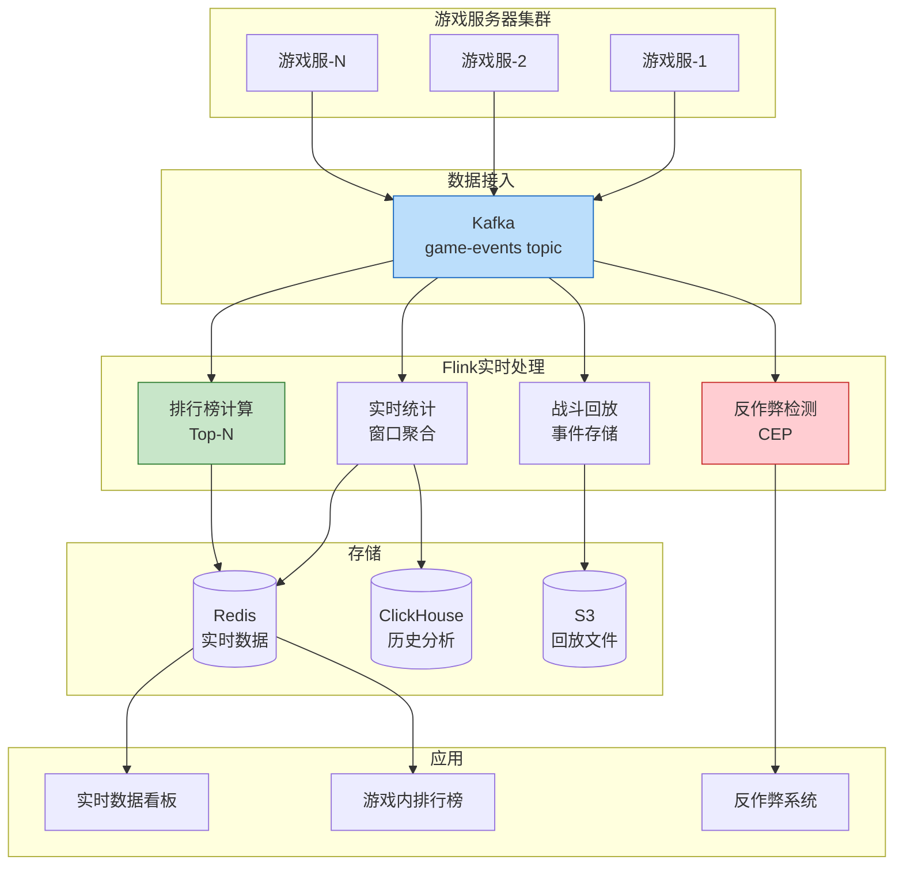
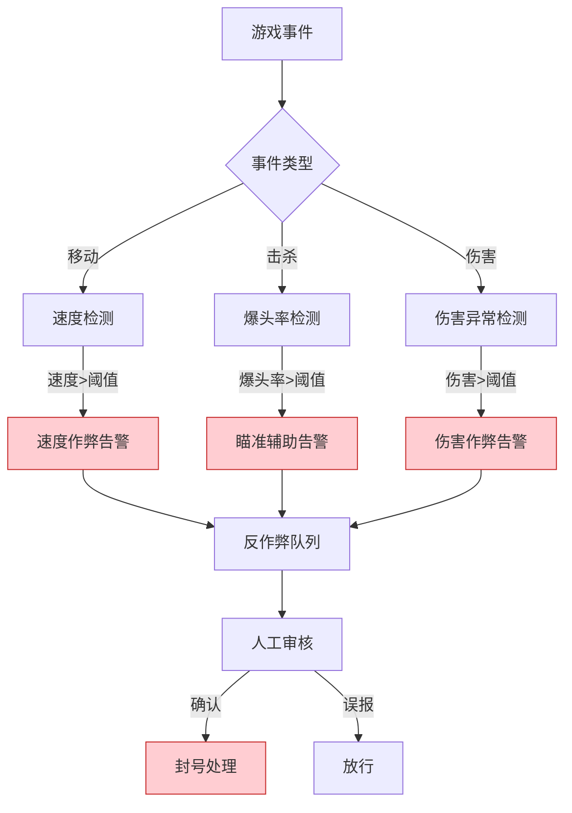

# 游戏行业案例: 实时对战数据处理系统

> **所属阶段**: Knowledge/10-case-studies/gaming | **前置依赖**: [../../02-design-patterns/pattern-windowed-aggregation.md](../../02-design-patterns/pattern-windowed-aggregation.md) | **形式化等级**: L4

---

## 目录

- [游戏行业案例: 实时对战数据处理系统](#游戏行业案例-实时对战数据处理系统)
  - [目录](#目录)
  - [1. 概念定义 (Definitions)](#1-概念定义-definitions)
    - [1.1 实时对战系统定义](#11-实时对战系统定义)
    - [1.2 游戏事件类型](#12-游戏事件类型)
    - [1.3 实时性等级](#13-实时性等级)
  - [2. 属性推导 (Properties)](#2-属性推导-properties)
    - [2.1 事件顺序一致性](#21-事件顺序一致性)
    - [2.2 吞吐量保证](#22-吞吐量保证)
  - [3. 关系建立 (Relations)](#3-关系建立-relations)
    - [3.1 数据处理管道](#31-数据处理管道)
    - [3.2 分析类型](#32-分析类型)
  - [4. 论证过程 (Argumentation)](#4-论证过程-argumentation)
    - [4.1 实时处理必要性](#41-实时处理必要性)
    - [4.2 技术挑战](#42-技术挑战)
  - [5. 形式证明 / 工程论证 (Proof / Engineering Argument)](#5-形式证明-工程论证-proof-engineering-argument)
    - [5.1 实时战斗统计](#51-实时战斗统计)
    - [5.2 反作弊检测](#52-反作弊检测)
  - [6. 实例验证 (Examples)](#6-实例验证-examples)
    - [6.1 案例背景](#61-案例背景)
    - [6.2 性能指标](#62-性能指标)
  - [7. 可视化 (Visualizations)](#7-可视化-visualizations)
    - [7.1 游戏数据处理架构](#71-游戏数据处理架构)
    - [7.2 反作弊检测流程](#72-反作弊检测流程)
  - [8. 引用参考 (References)](#8-引用参考-references)

---

## 1. 概念定义 (Definitions)

### 1.1 实时对战系统定义

**Def-K-10-07-01** (实时对战数据处理系统): 实时对战系统是一个七元组 $\mathcal{G} = (M, P, E, S, C, A, \tau)$：

- $M$：对局集合，$M = \{m_1, m_2, ..., m_n\}$
- $P$：玩家集合，每个对局 $m$ 有 $k$ 个玩家
- $E$：事件流，$E = \{e | e = (t, m, p, action, params)\}$
- $S$：游戏状态
- $C$：计算逻辑
- $A$：分析输出
- $\tau$：延迟上界（通常 $\leq 50$ms）

### 1.2 游戏事件类型

**Def-K-10-07-02** (游戏事件分类):

| 事件类型 | 定义 | 示例 |
|---------|------|------|
| **移动事件** | 位置状态变更 | 英雄移动、技能位移 |
| **战斗事件** | 伤害/治疗发生 | 攻击、施法、受击 |
| **交互事件** | 与环境交互 | 购买装备、使用道具 |
| **状态事件** | 游戏状态变更 | 游戏开始/结束、胜利/失败 |

### 1.3 实时性等级

**Def-K-10-07-03** (延迟等级): 游戏数据处理分为：

| 等级 | 延迟要求 | 应用场景 |
|------|---------|---------|
| 硬实时 | < 16ms | 游戏状态同步 |
| 软实时 | < 100ms | 战斗回放、实时观战 |
| 近实时 | < 1s | 数据统计、排行榜 |

---

## 2. 属性推导 (Properties)

### 2.1 事件顺序一致性

**Lemma-K-10-07-01**: 对于同一对局的事件序列，必须保证因果一致性：

$$
\forall e_i, e_j \in E_m: \quad e_i \rightarrow e_j \Rightarrow t_i < t_j
$$

### 2.2 吞吐量保证

**Lemma-K-10-07-02**: 设单个对局事件率为 $r$，并发对局数为 $N$，则总吞吐量为：

$$
Throughput = r \times N \times k
$$

其中 $k$ 为每对局玩家数

**Thm-K-10-07-01**: 对于百万级并发对局，需要系统吞吐量 $>$ 1000万事件/秒

---

## 3. 关系建立 (Relations)

### 3.1 数据处理管道

```
游戏客户端 ──► 游戏服务器 ──► Kafka ──► Flink ──► 分析/存储
                │                            │
                └────────► 实时同步 ◄─────────┘
```

### 3.2 分析类型

| 分析类型 | 延迟要求 | 技术方案 |
|---------|---------|---------|
| 实时战斗统计 | < 1s | Flink窗口聚合 |
| 实时排行榜 | < 5s | Redis + Flink |
| 战斗回放 | < 100ms | 事件流重放 |
| 反作弊检测 | < 1s | CEP模式匹配 |

---

## 4. 论证过程 (Argumentation)

### 4.1 实时处理必要性

游戏数据处理的特殊要求：

1. **状态同步延迟**：影响玩家体验
2. **实时观战**：需要低延迟数据流
3. **实时排行榜**：激励玩家竞争
4. **即时反馈**：战斗统计实时展示

### 4.2 技术挑战

| 挑战 | 描述 | 解决方案 |
|------|------|---------|
| 高并发 | 百万级同时在线 | 分区并行处理 |
| 乱序数据 | 网络延迟差异 | Event Time + Watermark |
| 大状态 | 玩家会话状态 | RocksDB + TTL |
| 故障恢复 | 不丢失游戏数据 | Checkpoint |

---

## 5. 形式证明 / 工程论证 (Proof / Engineering Argument)

### 5.1 实时战斗统计

```java
/**
 * 实时战斗统计
 */
public class RealtimeBattleAnalytics {

    public static void main(String[] args) throws Exception {
        StreamExecutionEnvironment env = StreamExecutionEnvironment.getExecutionEnvironment();
        env.enableCheckpointing(10000);
        env.setParallelism(256);

        // 1. 游戏事件流
        DataStream<GameEvent> events = env
            .fromSource(createKafkaSource(),
                WatermarkStrategy.<GameEvent>forBoundedOutOfOrderness(Duration.ofMillis(100))
                    .withIdleness(Duration.ofSeconds(30)),
                "Game Events")
            .setParallelism(128);

        // 2. 实时玩家统计
        DataStream<PlayerStats> playerStats = events
            .keyBy(GameEvent::getPlayerId)
            .window(TumblingEventTimeWindows.of(Time.minutes(1)))
            .aggregate(new PlayerStatsAggregate())
            .name("Player Stats")
            .setParallelism(256);

        // 3. 对局级别统计
        DataStream<MatchStats> matchStats = events
            .keyBy(GameEvent::getMatchId)
            .window(TumblingEventTimeWindows.of(Time.minutes(5)))
            .aggregate(new MatchStatsAggregate())
            .name("Match Stats")
            .setParallelism(256);

        // 4. 实时排行榜
        DataStream<LeaderboardEntry> leaderboard = playerStats
            .windowAll(TumblingProcessingTimeWindows.of(Time.seconds(10)))
            .process(new LeaderboardCalculator(100))
            .name("Leaderboard")
            .setParallelism(1);

        // 5. 输出
        playerStats.addSink(new RedisSink<>("player_stats"));
        matchStats.addSink(new ClickHouseSink<>("match_stats"));
        leaderboard.addSink(new RedisSink<>("leaderboard"));

        env.execute("Realtime Battle Analytics");
    }
}

/**
 * 玩家统计聚合
 */
class PlayerStatsAggregate implements AggregateFunction<GameEvent, PlayerAccumulator, PlayerStats> {

    @Override
    public PlayerAccumulator createAccumulator() {
        return new PlayerAccumulator();
    }

    @Override
    public PlayerAccumulator add(GameEvent event, PlayerAccumulator acc) {
        acc.playerId = event.getPlayerId();
        acc.matchId = event.getMatchId();

        switch (event.getEventType()) {
            case "DAMAGE_DEALT" -> {
                acc.totalDamage += event.getIntParam("amount");
                acc.damageEvents++;
            }
            case "KILL" -> acc.kills++;
            case "DEATH" -> acc.deaths++;
            case "ASSIST" -> acc.assists++;
            case "HEAL" -> acc.totalHeal += event.getIntParam("amount");
        }

        return acc;
    }

    @Override
    public PlayerStats getResult(PlayerAccumulator acc) {
        return PlayerStats.builder()
            .playerId(acc.playerId)
            .matchId(acc.matchId)
            .kills(acc.kills)
            .deaths(acc.deaths)
            .assists(acc.assists)
            .kda(calculateKDA(acc.kills, acc.deaths, acc.assists))
            .totalDamage(acc.totalDamage)
            .avgDamagePerHit(acc.damageEvents > 0 ? acc.totalDamage / acc.damageEvents : 0)
            .build();
    }

    @Override
    public PlayerAccumulator merge(PlayerAccumulator a, PlayerAccumulator b) {
        a.kills += b.kills;
        a.deaths += b.deaths;
        a.assists += b.assists;
        a.totalDamage += b.totalDamage;
        a.totalHeal += b.totalHeal;
        a.damageEvents += b.damageEvents;
        return a;
    }

    private double calculateKDA(int k, int d, int a) {
        return d == 0 ? (k + a) : (double) (k + a) / d;
    }
}
```

### 5.2 反作弊检测

```java
/**
 * 游戏反作弊检测（CEP）
 */
public class AntiCheatDetection {

    public static DataStream<CheatAlert> detectAimbot(DataStream<GameEvent> events) {
        // 模式：短时间内多次爆头
        Pattern<GameEvent, ?> aimbotPattern = Pattern
            .<GameEvent>begin("headshot1")
            .where(evt -> "HEADSHOT_KILL".equals(evt.getEventType()))
            .next("headshot2")
            .where(evt -> "HEADSHOT_KILL".equals(evt.getEventType()))
            .next("headshot3")
            .where(evt -> "HEADSHOT_KILL".equals(evt.getEventType()))
            .next("headshot4")
            .where(evt -> "HEADSHOT_KILL".equals(evt.getEventType()))
            .next("headshot5")
            .where(evt -> "HEADSHOT_KILL".equals(evt.getEventType()))
            .within(Time.seconds(10));

        return CEP.pattern(events.keyBy(GameEvent::getPlayerId), aimbotPattern)
            .process(new PatternProcessFunction<GameEvent, CheatAlert>() {
                @Override
                public void processMatch(Map<String, List<GameEvent>> match,
                                        Context ctx, Collector<CheatAlert> out) {
                    String playerId = match.get("headshot1").get(0).getPlayerId();
                    long timeSpan = match.get("headshot5").get(0).getTimestamp()
                                  - match.get("headshot1").get(0).getTimestamp();

                    if (timeSpan < 5000) {  // 5秒内5次爆头
                        out.collect(new CheatAlert(
                            playerId,
                            "AIMBOT_SUSPECTED",
                            "5 headshots in " + timeSpan + "ms",
                            ctx.timestamp()
                        ));
                    }
                }
            });
    }

    public static DataStream<CheatAlert> detectSpeedHack(DataStream<GameEvent> events) {
        // 模式：移动速度异常
        return events
            .keyBy(GameEvent::getPlayerId)
            .process(new SpeedCheckFunction());
    }
}

/**
 * 速度检测函数
 */
class SpeedCheckFunction extends KeyedProcessFunction<String, GameEvent, CheatAlert> {

    private ValueState<PositionState> lastPositionState;
    private static final double MAX_SPEED = 500.0;  // 最大合理速度 units/s

    @Override
    public void open(Configuration parameters) {
        lastPositionState = getRuntimeContext().getState(
            new ValueStateDescriptor<>("last_position", PositionState.class));
    }

    @Override
    public void processElement(GameEvent event, Context ctx, Collector<CheatAlert> out)
            throws Exception {
        if (!"MOVE".equals(event.getEventType())) return;

        PositionState last = lastPositionState.value();
        PositionState current = new PositionState(
            event.getTimestamp(),
            event.getFloatParam("x"),
            event.getFloatParam("y"),
            event.getFloatParam("z")
        );

        if (last != null) {
            double distance = calculateDistance(last, current);
            double timeDelta = (current.timestamp - last.timestamp) / 1000.0;
            double speed = distance / timeDelta;

            if (speed > MAX_SPEED * 2) {  // 超过2倍最大速度
                out.collect(new CheatAlert(
                    event.getPlayerId(),
                    "SPEED_HACK",
                    String.format("Speed: %.2f (max: %.2f)", speed, MAX_SPEED),
                    ctx.timestamp()
                ));
            }
        }

        lastPositionState.update(current);
    }

    private double calculateDistance(PositionState a, PositionState b) {
        return Math.sqrt(
            Math.pow(a.x - b.x, 2) +
            Math.pow(a.y - b.y, 2) +
            Math.pow(a.z - b.z, 2)
        );
    }
}
```

---

## 6. 实例验证 (Examples)

### 6.1 案例背景

**游戏**: 某MOBA竞技手游

| 指标 | 数值 |
|-----|------|
| DAU | 5000万 |
| 日均对局 | 3000万场 |
| 同时在线对局 | 200万场 |
| 事件峰值 | 5000万/秒 |

**挑战**：

1. 实时战斗数据量大
2. 反作弊检测需要低延迟
3. 实时排行榜更新
4. 战斗回放存储

### 6.2 性能指标

| 指标 | 目标值 | 实际值 |
|------|-------|-------|
| 统计延迟(P99) | < 1s | 0.5s |
| 排行榜更新 | < 5s | 3s |
| 反作弊检测 | < 5s | 2s |
| 事件处理吞吐 | 5000万/s | 8000万/s |
| 数据完整性 | 100% | 100% |

---

## 7. 可视化 (Visualizations)

### 7.1 游戏数据处理架构



### 7.2 反作弊检测流程



---

## 8. 引用参考 (References)


---

*文档版本: v1.0 | 最后更新: 2026-04-04*
