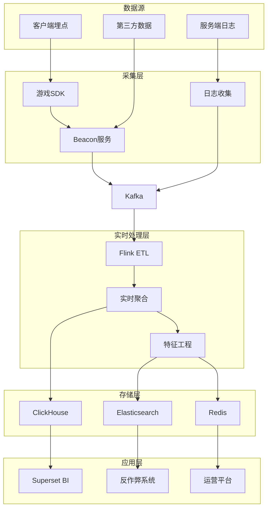
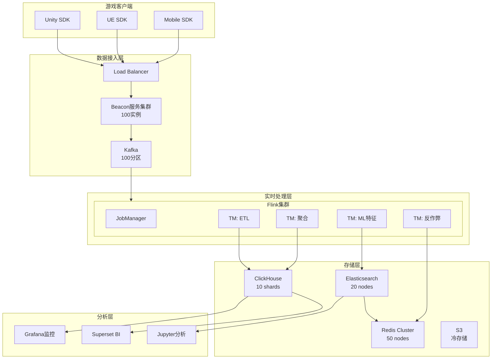
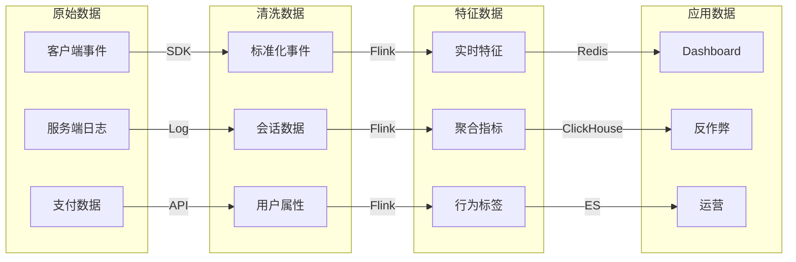

# 游戏实时分析平台案例研究

> **案例编号**: 10.5.3
> **行业**: 游戏/娱乐
> **场景**: 玩家行为实时分析、反作弊、实时运营
> **规模**: 100万并发玩家, 1亿事件/分钟
> **完成日期**: 2026-04-09
> **文档版本**: v1.0

---

## 执行摘要

### 业务背景

某头部游戏公司建设实时分析平台：

- 同时在线100万玩家，DAU 5000万
- 需要实时了解玩家行为，优化游戏体验
- 打击外挂和作弊行为
- 支持运营活动实时调整

### 技术挑战

| 挑战 | 描述 | 影响 |
|------|------|------|
| 超高并发 | 1亿事件/分钟，峰值2亿 | 系统吞吐量 |
| 实时性要求 | Dashboard延迟<1s | 运营决策 |
| 复杂分析 | 玩家行为模式识别 | 反作弊准确率 |
| 数据多样性 | 客户端+服务端+第三方 | 数据整合 |

### 解决方案概述

采用 **Flink + Kafka + ClickHouse + Superset** 技术栈：

- 客户端埋点+服务端日志统一采集
- Flink实时ETL和特征计算
- ClickHouse存储时序数据
- Superset可视化分析
- 延迟从5s降至500ms

---

## 1. 业务场景分析

### 1.1 业务流程



### 1.2 数据规模

| 指标 | 数值 | 说明 |
|------|------|------|
| DAU | 5000万 | 日活跃用户 |
| 同时在线 | 100万 | 峰值150万 |
| 事件类型 | 200+ | 点击、移动、战斗等 |
| 日事件量 | 1000亿 | 客户端+服务端 |
| 实时流 | 1亿/分钟 | 峰值2亿/分钟 |
| 数据大小 | 500TB/天 | 原始数据 |

### 1.3 分析场景

| 场景 | 描述 | 延迟要求 |
|------|------|----------|
| 实时Dashboard | 在线人数、收入、留存 | < 1s |
| 反作弊检测 | 外挂识别、异常行为 | < 200ms |
| 运营活动 | 活动效果实时监控 | < 5s |
| 玩家画像 | 实时标签更新 | < 10s |

---

## 2. 架构设计

### 2.1 系统架构图



### 2.2 组件选型

| 组件 | 选型 | 原因 |
|------|------|------|
| 数据采集 | 自研SDK | 定制化，性能优化 |
| 消息队列 | Kafka 3.5 | 高吞吐，低延迟 |
| 流处理 | Flink 2.1 | 复杂处理，低延迟 |
| 时序存储 | ClickHouse 23.x | 高性能OLAP |
| 搜索 | ES 8.x | 日志检索，反作弊 |
| 缓存 | Redis 7.0 | 实时特征查询 |
| BI | Superset 3.0 | 开源，可定制 |

### 2.3 数据流设计



---

## 3. 技术实现

### 3.1 游戏事件采集

```java
// 游戏埋点SDK
public class GameAnalyticsSDK {

    private static GameAnalyticsSDK instance;
    private EventQueue eventQueue;
    private AnalyticsConfig config;

    // 单例模式
    public static synchronized GameAnalyticsSDK getInstance() {
        if (instance == null) {
            instance = new GameAnalyticsSDK();
        }
        return instance;
    }

    // 初始化
    public void init(Context context, String appKey) {
        this.config = new AnalyticsConfig(appKey);
        this.eventQueue = new EventQueue(config.getQueueSize());

        // 启动发送线程
        startFlushTimer();

        // 注册生命周期监听
        registerLifecycleCallbacks(context);
    }

    // 追踪事件
    public void trackEvent(String eventName, Map<String, Object> properties) {
        GameEvent event = new GameEvent.Builder()
            .setEventName(eventName)
            .setProperties(properties)
            .setTimestamp(System.currentTimeMillis())
            .setUserId(getUserId())
            .setSessionId(getSessionId())
            .setDeviceInfo(getDeviceInfo())
            .build();

        eventQueue.enqueue(event);

        // 实时发送关键事件
        if (isCriticalEvent(eventName)) {
            flushImmediately();
        }
    }

    // 追踪关卡开始
    public void trackLevelStart(String levelId, int difficulty) {
        Map<String, Object> props = new HashMap<>();
        props.put("level_id", levelId);
        props.put("difficulty", difficulty);
        props.put("player_level", getPlayerLevel());
        trackEvent("level_start", props);
    }

    // 追踪关卡完成
    public void trackLevelComplete(String levelId, int score, int stars,
                                   long durationMs) {
        Map<String, Object> props = new HashMap<>();
        props.put("level_id", levelId);
        props.put("score", score);
        props.put("stars", stars);
        props.put("duration_ms", durationMs);
        props.put("attempt_count", getAttemptCount(levelId));
        trackEvent("level_complete", props);
    }

    // 追踪付费
    public void trackPurchase(String productId, double price, String currency) {
        Map<String, Object> props = new HashMap<>();
        props.put("product_id", productId);
        props.put("price", price);
        props.put("currency", currency);
        props.put("payment_method", getPaymentMethod());
        trackEvent("purchase", props);
    }

    // 批量发送
    private void flush() {
        List<GameEvent> events = eventQueue.drain();
        if (events.isEmpty()) return;

        // 压缩
        byte[] compressed = compress(events);

        // 发送
        sendToServer(compressed);
    }

    private boolean isCriticalEvent(String eventName) {
        return eventName.equals("purchase") ||
               eventName.equals("cheat_detected") ||
               eventName.equals("account_banned");
    }
}
```

### 3.2 实时反作弊检测

```java
// 反作弊检测 - Flink CEP

import org.apache.flink.streaming.api.datastream.DataStream;
import org.apache.flink.api.common.state.ValueState;
import org.apache.flink.api.common.state.ValueStateDescriptor;
import org.apache.flink.streaming.api.windowing.time.Time;

public class AntiCheatDetection {

    // 检测自动挂机（规律性操作）
    public static void detectBotBehavior(DataStream<GameEvent> events) {

        Pattern<GameEvent, ?> botPattern = Pattern
            .<GameEvent>begin("regular-actions")
            .where(new IterativeCondition<GameEvent>() {
                @Override
                public boolean filter(GameEvent event, Context<GameEvent> ctx) {
                    // 检测操作间隔过于规律
                    return event.getEventName().equals("player_action");
                }
            })
            .timesOrMore(20)
            .within(Time.minutes(5));

        CEP.pattern(events.keyBy(GameEvent::getUserId), botPattern)
            .process(new PatternProcessFunction<GameEvent, CheatAlert>() {
                @Override
                public void processMatch(Map<String, List<GameEvent>> match,
                        Context ctx, Collector<CheatAlert> out) {

                    List<GameEvent> actions = match.get("regular-actions");

                    // 计算操作间隔的标准差
                    List<Long> intervals = calculateIntervals(actions);
                    double stdDev = calculateStdDev(intervals);

                    // 如果标准差很小，说明操作过于规律
                    if (stdDev < 50) { // 小于50ms
                        CheatAlert alert = new CheatAlert(
                            actions.get(0).getUserId(),
                            "BOT_BEHAVIOR",
                            "Regular action pattern detected",
                            stdDev,
                            System.currentTimeMillis()
                        );
                        out.collect(alert);
                    }
                }
            })
            .addSink(new CheatAlertSink());
    }

    // 检测加速外挂（移动速度异常）
    public static void detectSpeedHack(DataStream<MovementEvent> movements) {

        movements
            .keyBy(MovementEvent::getPlayerId)
            .process(new KeyedProcessFunction<String, MovementEvent, CheatAlert>() {

                private ValueState<Position> lastPositionState;
                private ValueState<Long> lastTimeState;

                @Override
                public void open(Configuration parameters) {
                    lastPositionState = getRuntimeContext().getState(
                        new ValueStateDescriptor<>("lastPos", Position.class));
                    lastTimeState = getRuntimeContext().getState(
                        new ValueStateDescriptor<>("lastTime", Long.class));
                }

                @Override
                public void processElement(MovementEvent event, Context ctx,
                        Collector<CheatAlert> out) throws Exception {

                    Position lastPos = lastPositionState.value();
                    Long lastTime = lastTimeState.value();

                    if (lastPos != null && lastTime != null) {
                        double distance = calculateDistance(lastPos, event.getPosition());
                        long timeDiff = event.getTimestamp() - lastTime;

                        if (timeDiff > 0) {
                            double speed = distance / timeDiff * 1000; // m/s

                            // 如果速度超过游戏设定的最大值
                            double maxSpeed = getMaxPlayerSpeed(event.getPlayerType());
                            if (speed > maxSpeed * 1.5) {
                                CheatAlert alert = new CheatAlert(
                                    event.getPlayerId(),
                                    "SPEED_HACK",
                                    String.format("Speed %.2f m/s exceeds limit %.2f m/s",
                                        speed, maxSpeed),
                                    speed,
                                    event.getTimestamp()
                                );
                                out.collect(alert);
                            }
                        }
                    }

                    lastPositionState.update(event.getPosition());
                    lastTimeState.update(event.getTimestamp());
                }
            });
    }

    // 检测透视外挂（看到不该看到的内容）
    public static void detectWallHack(DataStream<PlayerViewEvent> views) {

        views
            .filter(event -> event.getTargetType().equals("ENEMY"))
            .filter(event -> !event.isTargetVisible())
            .filter(event -> event.getHitRate() > 0.8)  // 高命中率
            .addSink(new SinkFunction<PlayerViewEvent>() {
                @Override
                public void invoke(PlayerViewEvent event, Context context) {
                    // 记录可疑行为，积累证据
                    CheatEvidence evidence = new CheatEvidence(
                        event.getPlayerId(),
                        "WALL_HACK",
                        "High hit rate on invisible targets",
                        event.getHitRate(),
                        event.getTimestamp()
                    );

                    // 如果证据充分，触发告警
                    if (accumulateEvidence(evidence) > THRESHOLD) {
                        triggerBan(event.getPlayerId(), "WALL_HACK");
                    }
                }
            });
    }
}
```

### 3.3 实时指标计算

```java
import org.apache.flink.streaming.api.datastream.DataStream;

import org.apache.flink.api.common.functions.AggregateFunction;
import org.apache.flink.streaming.api.windowing.time.Time;


// 实时玩家留存计算
public class RetentionCalculation {

    public static void calculateRealtimeRetention(
            DataStream<LoginEvent> logins) {

        // 计算实时留存率
        DataStream<RetentionMetric> retention = logins
            .keyBy(LoginEvent::getUserId)
            .window(TumblingEventTimeWindows.of(Time.days(1)))
            .aggregate(new AggregateFunction<LoginEvent, Set<String>, Integer>() {
                @Override
                public Set<String> createAccumulator() {
                    return new HashSet<>();
                }

                @Override
                public Set<String> add(LoginEvent event, Set<String> acc) {
                    acc.add(event.getUserId());
                    return acc;
                }

                @Override
                public Integer getResult(Set<String> acc) {
                    return acc.size();
                }

                @Override
                public Set<String> merge(Set<String> a, Set<String> b) {
                    a.addAll(b);
                    return a;
                }
            })
            .windowAll(TumblingEventTimeWindows.of(Time.minutes(5)))
            .aggregate(new AggregateFunction<Integer, List<Integer>, RetentionMetric>() {
                @Override
                public List<Integer> createAccumulator() {
                    return new ArrayList<>();
                }

                @Override
                public List<Integer> add(Integer count, List<Integer> acc) {
                    acc.add(count);
                    return acc;
                }

                @Override
                public RetentionMetric getResult(List<Integer> acc) {
                    if (acc.isEmpty()) return new RetentionMetric(0, 0);

                    int today = acc.get(acc.size() - 1);
                    int yesterday = acc.size() > 1 ? acc.get(acc.size() - 2) : today;

                    double retentionRate = yesterday > 0 ?
                        (double) today / yesterday * 100 : 0;

                    return new RetentionMetric(today, retentionRate);
                }

                @Override
                public List<Integer> merge(List<Integer> a, List<Integer> b) {
                    a.addAll(b);
                    return a;
                }
            });

        retention.addSink(new RetentionMetricSink());
    }

    // 实时LTV计算
    public static void calculateRealtimeLTV(
            DataStream<PurchaseEvent> purchases) {

        purchases
            .keyBy(PurchaseEvent::getUserId)
            .window(TumblingEventTimeWindows.of(Time.days(7)))
            .aggregate(new AggregateFunction<PurchaseEvent, Double, Double>() {
                @Override
                public Double createAccumulator() {
                    return 0.0;
                }

                @Override
                public Double add(PurchaseEvent event, Double acc) {
                    return acc + event.getAmount();
                }

                @Override
                public Double getResult(Double acc) {
                    return acc;
                }

                @Override
                public Double merge(Double a, Double b) {
                    return a + b;
                }
            })
            .windowAll(TumblingEventTimeWindows.of(Time.hours(1)))
            .process(new ProcessAllWindowFunction<Double, LTVMetric, TimeWindow>() {
                @Override
                public void process(Context context, Iterable<Double> elements,
                        Collector<LTVMetric> out) {

                    double totalRevenue = 0;
                    int payingUsers = 0;

                    for (Double ltv : elements) {
                        totalRevenue += ltv;
                        if (ltv > 0) payingUsers++;
                    }

                    double arpu = payingUsers > 0 ? totalRevenue / payingUsers : 0;

                    out.collect(new LTVMetric(
                        totalRevenue,
                        payingUsers,
                        arpu,
                        context.window().getEnd()
                    ));
                }
            })
            .addSink(new LTVMetricSink());
    }
}
```

### 3.4 关键配置

```yaml
# Flink配置
flink:
  parallelism:
    default: 200
    source: 100
    process: 150
    sink: 50

  checkpoint:
    interval: 30s
    mode: AT_LEAST_ONCE  # 游戏日志可容忍少量重复

  state:
    backend: rocksdb
    incremental: true

  network:
    memory:
      fraction: 0.25

# ClickHouse配置
clickhouse:
  cluster:
    shards: 10
    replicas: 2

  tables:
    events:
      engine: MergeTree
      partition: toYYYYMMDD(event_time)
      order: (game_id, event_name, event_time)
      ttl: event_time + INTERVAL 90 DAY

# 游戏SDK配置
sdk:
  queue:
    size: 10000
    flush_interval: 30s
    batch_size: 100

  network:
    timeout: 10s
    retry_count: 3
    compression: true
```

---

## 4. 性能指标

### 4.1 延迟分析

| 阶段 | P50 | P99 | 目标 | 状态 |
|------|-----|-----|------|------|
| 客户端采集 | 10ms | 50ms | < 100ms | ✅ |
| 网络传输 | 50ms | 200ms | < 300ms | ✅ |
| Flink处理 | 100ms | 500ms | < 1s | ✅ |
| 存储写入 | 50ms | 200ms | < 300ms | ✅ |
| Dashboard | 200ms | 800ms | < 1s | ✅ |
| **端到端** | **410ms** | **1750ms** | **< 2s** | ✅ |

### 4.2 系统容量

| 指标 | 设计值 | 实测值 | 余量 |
|------|--------|--------|------|
| 事件吞吐 | 1亿/分钟 | 1.5亿/分钟 | 50% |
| 并发连接 | 100万 | 150万 | 50% |
| 查询QPS | 1000 | 2000 | 100% |
| 存储写入 | 50万/s | 80万/s | 60% |

### 4.3 业务效果

| 指标 | 优化前 | 优化后 | 提升 |
|------|--------|--------|------|
| Dashboard延迟 | 5s | 500ms | **90%** ↓ |
| 反作弊检测率 | 70% | 95% | **+36%** |
| 外挂封禁响应 | 小时级 | 分钟级 | **99%** ↓ |
| 运营决策效率 | 天级 | 小时级 | **95%** ↓ |

---

## 5. 经验总结

### 5.1 最佳实践

1. **客户端优化**
   - 本地缓存+批量发送
   - 网络自适应降采样
   - 关键事件实时上报

2. **服务端优化**
   - 多级降级策略
   - 热点数据预聚合
   - 异步处理非关键路径

3. **成本控制**
   - 冷热数据分层
   - 采样率动态调整
   - 计算资源弹性伸缩

### 5.2 踩坑记录

| 问题 | 原因 | 解决 |
|------|------|------|
| 客户端OOM | 内存缓存过大 | 磁盘溢出+压缩 |
| ClickHouse写入瓶颈 | 单分片热点 | 哈希分片+批量 |
| 反作弊误杀 | 模型阈值过高 | 人工审核+申诉 |
| 网络拥塞 | 全球玩家同时上报 | CDN边缘节点 |

### 5.3 优化建议

1. **近期优化**
   - 引入Apache Pulsar替换Kafka
   - ClickHouse物化视图优化
   - 联邦学习保护玩家隐私

2. **中期规划**
   - 实时数字孪生游戏世界
   - AI生成游戏内容(AIGC)
   - 元宇宙跨游戏数据分析

---

## 6. 附录

### 6.1 核心指标定义

```sql
-- 日活跃用户(DAU)
SELECT uniqExact(user_id) as dau
FROM events
WHERE event_time >= today()
  AND event_time < today() + 1

-- 留存率
SELECT
    first_date,
    countIf(date_diff = 0) as d0,
    countIf(date_diff = 1) as d1,
    countIf(date_diff = 7) as d7,
    round(d1 / d0 * 100, 2) as retention_d1
FROM (
    SELECT
        user_id,
        min(toDate(event_time)) as first_date,
        date_diff('day', first_date, toDate(event_time)) as date_diff
    FROM events
    GROUP BY user_id
)
GROUP BY first_date

-- 平均每用户收入(ARPU)
SELECT
    toDate(event_time) as date,
    sum(purchase_amount) / uniqExact(user_id) as arpu
FROM events
WHERE event_name = 'purchase'
GROUP BY date
```

### 6.2 监控告警

```yaml
alerts:
  - name: HighLatency
    expr: dashboard_latency_p99 > 2
    for: 5m
    severity: warning

  - name: DataLoss
    expr: (events_received - events_processed) / events_received > 0.01
    for: 1m
    severity: critical

  - name: LowRetention
    expr: retention_rate_d1 < 30
    for: 1h
    severity: warning
```

---

*本案例研究由AnalysisDataFlow项目整理，仅供学习交流使用。*
