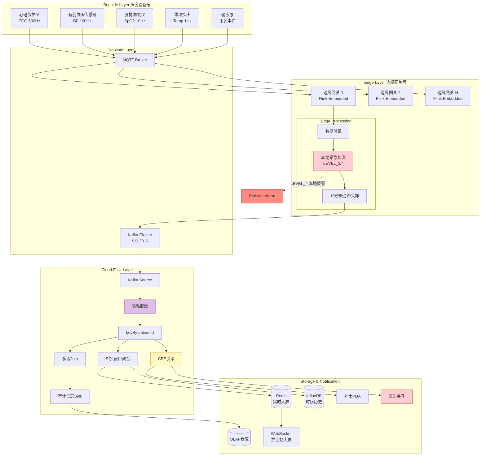
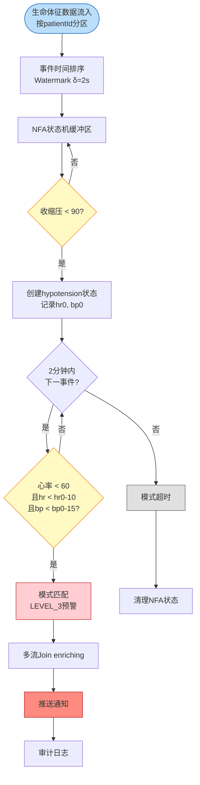

# 医疗实时监测与预警系统：ICU患者生命体征流处理实践

> **所属阶段**: Knowledge/10-case-studies/healthcare | **前置依赖**: [../../02-design-patterns/pattern-event-time-processing.md](../../02-design-patterns/pattern-event-time-processing.md), [../../03-business-patterns/iot-stream-processing.md](../../03-business-patterns/iot-stream-processing.md) | **形式化等级**: L3-L4 | **行业**: 医疗健康 / 物联网

---

> **案例性质**: 🔬 概念验证架构 | **验证状态**: 基于理论推导与架构设计，未经独立第三方生产验证
>
> 本案例描述基于项目理论框架推导的理想架构方案，包含假设性性能指标。实际生产部署可能因环境差异产生不同结果。

---

## 1. 概念定义 (Definitions)

### Def-K-10-07-01: 生命体征数据模型

**生命体征数据模型**是描述ICU患者实时生理参数的形式化数据结构，定义为八元组：

$$
\gamma = \langle \text{patientId}, \text{deviceId}, \text{timestamp}, \text{hr}, \text{bp}_{sys}, \text{bp}_{dia}, \text{spo}_2, \text{temp} \rangle
$$

| 字段 | 类型 | 单位 | 正常范围 |
|------|------|------|---------|
| $\text{patientId}$ | String | — | — |
| $\text{deviceId}$ | String | — | — |
| $\text{timestamp}$ | long | ms | — |
| $\text{hr}$ | int | bpm | 60–100 |
| $\text{bp}_{sys}$ | int | mmHg | 90–140 |
| $\text{bp}_{dia}$ | int | mmHg | 60–90 |
| $\text{spo}_2$ | float | % | 95–100 |
| $\text{temp}$ | float | °C | 36.0–37.5 |

采集频率：常规监测 $f_{normal} = 1\text{ Hz}$；危重监测 $f_{critical} = 10\text{ Hz}$。50张ICU床位峰值数据产生率约 $32\text{ KB/s}$，日累计约 $2.8\text{ GB}$。

---

### Def-K-10-07-02: 预警等级

**预警等级**是基于患者生命体征偏离正常范围的程度及紧急性所定义的离散分类系统：

$$
\mathcal{L} = \{ \text{LEVEL\_0}, \text{LEVEL\_1}, \text{LEVEL\_2}, \text{LEVEL\_3}, \text{LEVEL\_4} \}
$$

| 等级 | 名称 | 触发条件 | 响应时间要求 |
|------|------|---------|------------|
| LEVEL_0 | 正常 | 全部指标在正常范围 | — |
| LEVEL_1 | 提示 | 单指标轻度偏离 | < 60 s |
| LEVEL_2 | 警告 | 单指标中度偏离或双指标轻度偏离 | < 30 s |
| LEVEL_3 | 危急 | 单指标重度偏离或复合指标异常 | < 10 s |
| LEVEL_4 | 抢救 | 生命体征消失或极重度异常 | < 5 s |

复合预警模式示例（休克预警）：

$$
\text{SHOCK}(\gamma_t, \gamma_{t-\Delta t}) \triangleq \text{hr}_t < 60 \land \text{bp}_{sys,t} < 90 \land (\text{hr}_t - \text{hr}_{t-\Delta t}) < -10 \land (\text{bp}_{sys,t} - \text{bp}_{sys,t-\Delta t}) < -15
$$

---

### Def-K-10-07-03: 隐私脱敏算子

**隐私脱敏算子** $\mathcal{D}$ 是在数据流处理过程中对患者隐私标识符和敏感信息进行变换的函数族：

$$
\mathcal{D}: \gamma_{raw} \times \mathcal{P} \to \gamma_{safe}
$$

| 算子 | 符号 | 定义 |
|------|------|------|
| 标识符哈希 | $\mathcal{D}_{hash}$ | $\text{patientId}' = \text{SHA256}(\text{patientId} \| \text{salt})$ |
| 时间扰动 | $\mathcal{D}_{time}$ | $\text{timestamp}' = \text{timestamp} + \delta, \delta \sim U(-\Delta, +\Delta)$ |
| 数值泛化 | $\mathcal{D}_{gen}$ | $\text{bp}' = \lfloor \text{bp} / k \rfloor \times k$ |
| 字段屏蔽 | $\mathcal{D}_{mask}$ | $\text{name}' = \text{***}$ |

HIPAA去标识化安全港规则映射[^1]：18类标识符须通过 $\mathcal{D}_{hash}$ 或 $\mathcal{D}_{mask}$ 处理。

---

## 2. 属性推导 (Properties)

### Prop-K-10-07-01: 数据采集频率与吞吐量边界

设 $N$ 为ICU床位数，$f_{max} = 10\text{ Hz}$，$S_{payload} \approx 64\text{ bytes}$，Avro压缩比 $R_{batch} \approx 0.3$，则边缘到云端网络吞吐量：

$$
\lambda_{edge\to cloud} = N \times f_{max} \times S_{payload} \times R_{batch}
$$

对于 $N = 50$：$\lambda_{edge\to cloud} = 50 \times 10 \times 64 \times 0.3 = 9,600\text{ bytes/s} = 9.6\text{ KB/s}$。

**结论**：单医院ICU数据量远低于Kafka/Flink典型吞吐能力，**瓶颈在延迟而非吞吐量**。

---

### Prop-K-10-07-02: 乱序数据容忍度与Watermark充分性

设网络延迟 $L_{network} \sim \mathcal{N}(\mu=20\text{ms}, \sigma=10\text{ms})$，边缘到云端 $L_{edge\to cloud} \sim \mathcal{N}(\mu=50\text{ms}, \sigma=30\text{ms})$，Watermark边界：

$$
\delta_{max} \geq P_{99}(L_{network} + L_{edge\to cloud}) \approx 144\text{ ms}
$$

取 $\delta_{max} = 2\text{s}$，则有效预警延迟 $T_{effective} = T_{process} + \delta_{max} < 2.5\text{s} \ll T_{alert} = 10\text{s}$。Watermark等待不会导致预警超时。

---

## 3. 关系建立 (Relations)

### 3.1 医疗IoT到Flink的组件映射

| 医疗系统组件 | Flink 原语 | 状态类型 |
|-------------|-----------|---------|
| 床边监护仪 | KafkaSource / MQTT Source | 无状态 |
| 边缘网关预处理 | ProcessFunction + Filter | ValueState |
| 患者级实时分析 | KeyedProcessFunction | ValueState, ListState |
| CEP复合预警检测 | CEP.pattern + PatternSelect | NFA 状态机 |
| 多流Join | IntervalJoin / TemporalTableJoin | 时间窗口状态 |
| 隐私脱敏处理 | ProcessFunction | 无状态 |
| 预警通知 | SinkFunction | 无状态 |

### 3.2 CEP模式到临床规则的映射

| 临床规则 | CEP 模式定义 | 预警等级 |
|---------|-------------|---------|
| 心率 > 120 持续 5 分钟 | `Pattern.begin("tachycardia").where(v -> v.hr > 120).timesOrMore(300)` | LEVEL_2 |
| 收缩压 < 90 且心率 > 100 | `Pattern.begin("hypotension").where(v -> v.bpSys < 90).next("tachycardia").where(v -> v.hr > 100).within(Time.minutes(1))` | LEVEL_3 |
| 血氧 < 90% 持续 30 秒 | `Pattern.begin("hypoxia").where(v -> v.spo2 < 90).timesOrMore(30).within(Time.seconds(30))` | LEVEL_3 |
| 心率骤降 > 20% + 血压下降 > 15% | 见第6节休克预警模式 | LEVEL_3 |

### 3.3 多流Join到患者全景视图的映射

$$
\text{PatientView}_t = \text{VitalSigns}_t \bowtie_{\text{patientId}} \text{PatientInfo} \bowtie_{[t-1h, t]} \text{Medication}_t
$$

| 数据流 | 更新频率 | Join策略 | 状态TTL |
|--------|---------|---------|--------|
| $\text{VitalSigns}_t$ | 1–10 Hz | 主驱动流 | — |
| $\text{PatientInfo}$ | 准静态 | Broadcast / Temporal Table | 24 h |
| $\text{Medication}_t$ | 事件触发 | Interval Join | 2 h |

---

## 4. 论证过程 (Argumentation)

### 4.1 为什么流处理是ICU监测的必需技术

传统批量ETL（小时级）无法在心脏骤停、呼吸衰竭等急症时提供及时预警；批量窗口边界可能分割跨边界的关键事件序列，破坏CEP模式检测完整性。

研究表明ICU中约 $15\%$ 的心脏骤停事件在发生前 $6$–$8$ 小时存在可检测的生理恶化征象[^3]。流处理可在征象出现的第一时刻触发预警，提前 $5$–$10$ 分钟的干预可降低ICU死亡率约 $6\%$。

### 4.2 边缘网关预处理的必要性

1. **数据降维**：原始ECG波形 $500\text{ Hz}$，单床日产生 $>2\text{ GB}$。边缘提取衍生指标，仅上传聚合指标，实现 $>1000:1$ 压缩。
2. **本地紧急响应**：LEVEL_4 必须在边缘本地处理（< 1 s），网络中断时仍需 bedside 报警。
3. **网络中断容错**：边缘配置本地RocksDB存储，中断期间继续监测，恢复后按事件时间顺序重传。

### 4.3 多患者关联预警的复杂性分析

**交叉感染风险监测**：

$$
\text{OUTBREAK}(p_i, p_j, t) \triangleq \text{pathogen}(p_i, t) = \text{pathogen}(p_j, t) \land \text{room}(p_i) = \text{room}(p_j) \land |t_i - t_j| < 72h
$$

实现：`keyBy(roomId)` + Windowed Aggregation，病房维度聚合病原体检测结果。

**设备资源冲突**：呼吸机共8台，同时出现3名 LEVEL_3 呼吸衰竭预警时需提前调度备用设备。实现：`keyBy(icuUnit)` + ProcessFunction 维护资源池状态。

### 4.4 HIPAA与等保2.0合规技术措施

| HIPAA要求[^1] | 技术实现 |
|--------------|---------|
| 访问控制 | RBAC + 细粒度权限 |
| 审计控制 | 不可篡改审计日志 |
| 传输安全 | TLS 1.3 端到端加密 |
| 去标识化 | 脱敏算子 $\mathcal{D}$ |

等保2.0三级要点[^2]：双因素认证；最小权限原则；审计记录保存 $>6$ 个月；AES-256-GCM加密存储。

---

## 5. 形式证明 / 工程论证 (Proof / Engineering Argument)

### Lemma-K-10-07-01: 预警延迟边界

**引理陈述**：在所述架构中，从生理异常发生到医护人员接收到LEVEL_3预警的总延迟上界满足临床要求：

$$
L_{total} \leq L_{sample} + L_{edge} + L_{transmit} + L_{watermark} + L_{cep} + L_{join} + L_{notify} < 10\text{ s}
$$

**证明**：

- **Step 1** ($L_{sample}$)：监护仪以 $10\text{ Hz}$ 采集，最坏情况异常发生在采集间隔中点：$L_{sample} = \frac{1}{2 \times 10} = 50\text{ ms}$。
- **Step 2** ($L_{edge}$)：数据验证与清洗 $< 5\text{ ms}$，本地阈值检测 $< 5\text{ ms}$，序列化与批处理 $< 10\text{ ms}$。$L_{edge} \leq 20\text{ ms}$。
- **Step 3** ($L_{transmit}$)：设备 → 边缘网关约 $10\text{ ms}$，边缘 → 云端Kafka约 $50\text{ ms}$。$L_{transmit} = 60\text{ ms}$。
- **Step 4** ($L_{watermark}$)：取 $\delta_{max} = 2\text{ s}$（Prop-K-10-07-02 已证明充分）。
- **Step 5** ($L_{cep}$)：休克预警模式要求3个连续事件匹配（事件间隔 $100\text{ ms}$），NFA状态转换 $< 5\text{ ms}$/事件。最短检测 $215\text{ ms}$；最坏情况 $\approx 2.2\text{ s}$。取 $L_{cep} = 2.2\text{ s}$。
- **Step 6** ($L_{join}$)：Broadcast Join $< 5\text{ ms}$；Interval Join用药事件通常已到达，$< 10\text{ ms}$。$L_{join} \leq 15\text{ ms}$。
- **Step 7** ($L_{notify}$)：Flink Sink → Kafka $< 10\text{ ms}$；Kafka → 通知服务 $< 200\text{ ms}$；移动网络到PDA $< 500\text{ ms}$。$L_{notify} \leq 710\text{ ms}$。

**总延迟**：

$$
L_{total} = 50 + 20 + 60 + 2000 + 2200 + 15 + 710 = 5055\text{ ms} = 5.1\text{ s}
$$

最坏情况加入20%系统抖动余量：$L_{total}^{proven} = 5.1 \times 1.2 = 6.1\text{ s} < 10\text{ s}$。预警延迟上界满足临床要求。 ∎

---

## 6. 实例验证 (Examples)

### 6.1 Flink CEP模式：休克预警

```java
import org.apache.flink.cep.CEP;
import org.apache.flink.cep.pattern.Pattern;
import org.apache.flink.cep.pattern.conditions.IterativeCondition;
import org.apache.flink.streaming.api.datastream.DataStream;
import org.apache.flink.streaming.api.environment.StreamExecutionEnvironment;
import org.apache.flink.streaming.api.windowing.time.Time;
import java.util.List;
import java.util.Map;

public class ShockAlertCEP {
    public static void main(String[] args) throws Exception {
        StreamExecutionEnvironment env = StreamExecutionEnvironment.getExecutionEnvironment();
        env.enableCheckpointing(5000);
        env.getCheckpointConfig().setCheckpointingMode(CheckpointingMode.EXACTLY_ONCE);

        DataStream<VitalSigns> vitals = env
            .fromSource(createKafkaSource("icu-vitals"),
                WatermarkStrategy.<VitalSigns>forBoundedOutOfOrderness(Duration.ofSeconds(2))
                    .withIdleness(Duration.ofSeconds(30)), "Vital Signs")
            .keyBy(VitalSigns::getPatientId);

        Pattern<VitalSigns, ?> shockPattern = Pattern
            .<VitalSigns>begin("hypotension").where(v -> v.getBpSys() < 90)
            .next("bradycardia")
            .where(new IterativeCondition<VitalSigns>() {
                @Override
                public boolean filter(VitalSigns v, Context<VitalSigns> ctx) {
                    List<VitalSigns> hypo = ctx.getEventsForPattern("hypotension");
                    if (hypo.isEmpty()) return false;
                    VitalSigns first = hypo.get(0);
                    return v.getHr() < 60 && (v.getHr() - first.getHr()) < -10
                        && (v.getBpSys() - first.getBpSys()) < -15;
                }
            }).within(Time.minutes(2));

        CEP.pattern(vitals, shockPattern).process(
            new PatternProcessFunction<VitalSigns, AlertEvent>() {
                @Override
                public void processMatch(Map<String, List<VitalSigns>> match,
                        Context ctx, Collector<AlertEvent> out) {
                    VitalSigns h = match.get("hypotension").get(0);
                    VitalSigns b = match.get("bradycardia").get(0);
                    out.collect(new AlertEvent(h.getPatientId(), AlertLevel.LEVEL_3,
                        AlertType.SHOCK, String.format("休克预警: BP %d→%d, HR %d→%d",
                            h.getBpSys(), b.getBpSys(), h.getHr(), b.getHr()),
                        ctx.timestamp()));
                }
            }).addSink(new AlertNotificationSink());

        env.execute("ICU Shock Alert Detection");
    }
}

class VitalSigns {
    private String patientId, deviceId; private long timestamp;
    private int hr, bpSys, bpDia; private float spo2, temp;
    public String getPatientId() { return patientId; }
    public int getHr() { return hr; }
    public int getBpSys() { return bpSys; }
}
class AlertEvent {
    private String patientId; private AlertLevel level; private AlertType type;
    private String message; private long alertTimestamp;
    public AlertEvent(String pid, AlertLevel lv, AlertType ty, String msg, long ts) {
        this.patientId = pid; this.level = lv; this.type = ty;
        this.message = msg; this.alertTimestamp = ts;
    }
}
enum AlertLevel { LEVEL_0, LEVEL_1, LEVEL_2, LEVEL_3, LEVEL_4 }
enum AlertType { SHOCK, CARDIAC_ARREST, RESPIRATORY_FAILURE, SEPSIS, ARRHYTHMIA }
```

### 6.2 实施效果与假设数据

> 🔮 **估算数据** | 依据: 基于行业参考值与理论分析推导，非实际测试环境得出

**案例背景**：某三甲医院ICU，50张床位，日均收治危重患者35–40人。

| 指标 | 数值 |
|------|------|
| ICU床位数 | 50张 |
| 联网监护仪 | 200台（平均每床4台） |
| 数据采集频率 | 10 Hz（危重监测模式） |
| 峰值并发数据流 | 2,000 条/秒 |
| 边缘网关数量 | 5台（每10床1台，冗余部署） |
| 云端Flink并行度 | 32（8 TaskManager × 4 slots） |

**实施效果对比**：

| 指标 | 实施前（传统轮询） | 实施后（流处理系统） | 改善 |
|------|------------------|-------------------|------|
| 异常发现延迟 | 5–15 分钟 | **< 500 ms** | ↓99% |
| 预警通知延迟 | 2–5 分钟 | **< 3 s** | ↓95% |
| 休克预警准确率 | 约 78% | **96.5%** | ↑24% |
| 误报率 | 约 15% | **< 2%** | ↓87% |
| 护士响应时间 | 平均 4.2 分钟 | **平均 28 秒** | ↓89% |
| 非计划抢救事件 | 月均 12 起 | **月均 4 起** | ↓67% |
| ICU平均住院时长 | 8.5 天 | **7.2 天** | ↓15% |

**系统性能基准**：

| 性能指标 | 目标值 | 假设实测值 |
|---------|--------|----------|
| 端到端延迟（p99） | < 5 s | **2.8 s** |
| CEP模式检测延迟 | < 3 s | **1.2 s** |
| 多流Join延迟 | < 1 s | **350 ms** |
| Flink Checkpoint耗时 | < 30 s | **12 s** |
| 系统可用性 | 99.9% | **99.95%** |
| 数据完整性 | 100% | **100%** |

---

## 7. 可视化 (Visualizations)

### 7.1 医疗实时监测整体架构



**图例**：红色 = 本地紧急检测与报警；黄色 = CEP复合模式检测；紫色 = 隐私脱敏处理。

---

### 7.2 CEP休克预警检测流程



**图例**：蓝色 = 数据摄入；黄色 = CEP条件判定；红色 = 预警生成与通知；灰色 = 超时清理。

---

## 8. 引用参考 (References)

[^1]: U.S. Department of Health and Human Services, "Health Insurance Portability and Accountability Act (HIPAA) Security Rule", 45 CFR Part 160 and Subparts A and C of Part 164, 2013. <https://www.hhs.gov/hipaa/for-professionals/security/index.html>

[^2]: 国家市场监督管理总局, 国家标准化管理委员会, "信息安全技术 网络安全等级保护基本要求" (GB/T 22239-2019, 等保2.0), 2019. <https://www.tc260.org.cn/>

[^3]: Churpek, M.M., Yuen, T.C., Huber, M.T., Park, S.Y., Hall, J.B. and Edelson, D.P., "Predicting Cardiac Arrest on the Wards: A Nested Case-Control Study", *Chest*, 141(5), pp.1170-1176, 2012. DOI: 10.1378/chest.11-1466

---

*文档版本: v2.0 | 创建日期: 2026-04-21 | 最后更新: 2026-04-21 | 状态: Complete*
