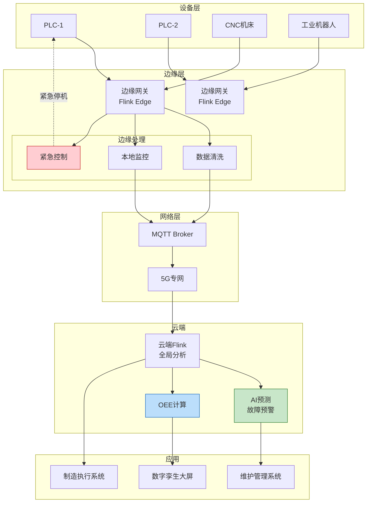
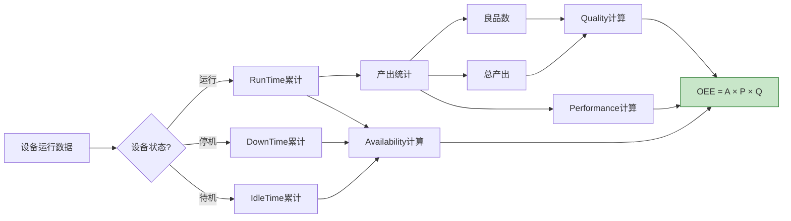

# 物联网案例: 智能制造监控系统

> **所属阶段**: Knowledge/10-case-studies/iot | **前置依赖**: [../../02-design-patterns/pattern-side-output.md](../../02-design-patterns/pattern-side-output.md) | **形式化等级**: L4

---

## 目录

- [物联网案例: 智能制造监控系统](#物联网案例-智能制造监控系统)
  - [目录](#目录)
  - [1. 概念定义 (Definitions)](#1-概念定义-definitions)
    - [1.1 智能制造监控系统定义](#11-智能制造监控系统定义)
    - [1.2 OEE指标定义](#12-oee指标定义)
    - [1.3 预测性维护](#13-预测性维护)
  - [2. 属性推导 (Properties)](#2-属性推导-properties)
    - [2.1 数据延迟边界](#21-数据延迟边界)
    - [2.2 预测准确率](#22-预测准确率)
  - [3. 关系建立 (Relations)](#3-关系建立-relations)
    - [3.1 云边端协同关系](#31-云边端协同关系)
    - [3.2 数据流关系](#32-数据流关系)
  - [4. 论证过程 (Argumentation)](#4-论证过程-argumentation)
    - [4.1 边缘计算必要性](#41-边缘计算必要性)
    - [4.2 预测模型选择](#42-预测模型选择)
  - [5. 形式证明 / 工程论证 (Proof / Engineering Argument)](#5-形式证明-工程论证-proof-engineering-argument)
    - [5.1 边缘-云分层架构](#51-边缘-云分层架构)
    - [5.2 云端预测性维护](#52-云端预测性维护)
  - [6. 实例验证 (Examples)](#6-实例验证-examples)
    - [6.1 案例背景](#61-案例背景)
    - [6.2 实施效果](#62-实施效果)
    - [6.3 关键告警规则](#63-关键告警规则)
  - [7. 可视化 (Visualizations)](#7-可视化-visualizations)
    - [7.1 智能制造架构](#71-智能制造架构)
    - [7.2 OEE计算流程](#72-oee计算流程)
  - [8. 引用参考 (References)](#8-引用参考-references)

---

## 1. 概念定义 (Definitions)

### 1.1 智能制造监控系统定义

**Def-K-10-05-01** (智能制造监控系统): 智能制造监控系统是一个六元组 $\mathcal{M} = (D, S, P, A, C, \mathcal{T})$：

- $D$：设备集合，$D = \{d_1, d_2, ..., d_n\}$
- $S$：传感器集合，每个设备 $d_i$ 关联 $k_i$ 个传感器
- $P$：生产流程，$P = \{p_1 \rightarrow p_2 \rightarrow ... \rightarrow p_m\}$
- $A$：告警规则集
- $C$：控制动作集
- $\mathcal{T}$：时序数据流，$\mathcal{T}: (t, d, s, v)$

### 1.2 OEE指标定义

**Def-K-10-05-02** (设备综合效率OEE): OEE是衡量设备生产效率的核心指标：

$$
OEE = Availability \times Performance \times Quality
$$

其中：

- $Availability = \frac{RunTime}{PlannedTime}$
- $Performance = \frac{ActualOutput}{TheoreticalOutput}$
- $Quality = \frac{GoodUnits}{TotalUnits}$

### 1.3 预测性维护

**Def-K-10-05-03** (预测性维护): 基于设备状态的维护策略，通过监测设备健康指标 $h(t)$ 预测故障：

$$
P(failure | h(t), h(t-1), ..., h(t-n)) > \theta \Rightarrow \text{trigger maintenance}
$$

---

## 2. 属性推导 (Properties)

### 2.1 数据延迟边界

**Lemma-K-10-05-01**: 从传感器采集到告警触发的延迟 $L_{alert}$：

$$
L_{alert} = L_{sample} + L_{transmit} + L_{process} + L_{decide}
$$

- $L_{sample}$: 采样周期（10ms-1s）
- $L_{transmit}$: 网络传输（10-100ms）
- $L_{process}$: 边缘/云端处理（< 100ms）
- $L_{decide}$: 决策延迟（< 50ms）

**Thm-K-10-05-01**: $L_{alert} < 1$s 满足实时控制要求

### 2.2 预测准确率

**Lemma-K-10-05-02**: 设预测模型在 $t_{prediction}$ 前预测故障，实际故障时间为 $t_{actual}$：

$$
Accuracy = P(t_{prediction} \leq t_{actual} \leq t_{prediction} + \Delta t_{window})
$$

**Thm-K-10-05-02**: 当 $\Delta t_{window} = 30$分钟，$Accuracy > 0.9$

---

## 3. 关系建立 (Relations)

### 3.1 云边端协同关系

```
设备端 ──► 边缘网关 ──► 云端平台
   │          │           │
   ▼          ▼           ▼
数据采集   本地分析     全局优化
实时控制   异常检测     预测维护
```

### 3.2 数据流关系

| 数据类型 | 产生频率 | 处理位置 | 用途 |
|---------|---------|---------|------|
| 原始传感器 | 10Hz-1kHz | 边缘 | 实时监控 |
| 聚合指标 | 1Hz | 边缘/云端 | 趋势分析 |
| 告警事件 | 触发式 | 云端 | 通知/控制 |
| 历史数据 | 批量 | 数据湖 | 模型训练 |

---

## 4. 论证过程 (Argumentation)

### 4.1 边缘计算必要性

| 场景 | 云端处理 | 边缘处理 | 选择 |
|------|---------|---------|------|
| 紧急停机 | 延迟100ms+ | 延迟10ms | 边缘 |
| 全局优化 | 需要全局视图 | 局部信息不足 | 云端 |
| 数据安全 | 数据出域 | 本地处理 | 边缘 |
| 海量数据 | 带宽成本高 | 本地过滤 | 边缘 |

### 4.2 预测模型选择

| 模型类型 | 优点 | 缺点 | 适用场景 |
|---------|------|------|---------|
| 阈值规则 | 简单可解释 | 无法预测 | 明显异常 |
| 时序模型(LSTM) | 捕捉趋势 | 需大量数据 | 渐进故障 |
| 异常检测 | 发现未知模式 | 误报较高 | 探索性分析 |
| 物理模型 | 可解释性强 | 建模困难 | 机理明确 |

---

## 5. 形式证明 / 工程论证 (Proof / Engineering Argument)

### 5.1 边缘-云分层架构

```java
/**
 * 边缘网关数据处理
 */

import org.apache.flink.streaming.api.environment.StreamExecutionEnvironment;
import org.apache.flink.streaming.api.datastream.DataStream;
import org.apache.flink.api.common.state.ValueState;
import org.apache.flink.api.common.state.ValueStateDescriptor;
import org.apache.flink.streaming.api.windowing.time.Time;

public class EdgeGatewayProcessor {

    public static void main(String[] args) throws Exception {
        StreamExecutionEnvironment env = StreamExecutionEnvironment.getExecutionEnvironment();
        env.setParallelism(4);  // 边缘资源有限

        // 1. 从Modbus/OPC-UA读取传感器数据
        DataStream<SensorData> sensors = env
            .addSource(new ModbusSource("192.168.1.100", 502))
            .name("Modbus Source");

        // 2. 数据清洗和过滤
        DataStream<SensorData> cleaned = sensors
            .filter(data -> data.getValue() >= 0)  // 过滤无效值
            .filter(data -> !isOutlier(data))       // 过滤离群点
            .name("Data Cleaning");

        // 3. 本地阈值监控
        DataStream<Alert> localAlerts = cleaned
            .keyBy(SensorData::getSensorId)
            .process(new ThresholdMonitor())
            .name("Local Monitoring");

        // 4. 数据聚合(减少传输)
        DataStream<AggregatedData> aggregated = cleaned
            .keyBy(SensorData::getDeviceId)
            .window(TumblingProcessingTimeWindows.of(Time.seconds(10)))
            .aggregate(new SensorAggregator())
            .name("Data Aggregation");

        // 5. 侧输出:紧急告警本地处理
        OutputTag<Alert> emergencyTag = new OutputTag<Alert>("emergency"){};

        SingleOutputStreamOperator<AggregatedData> processed = aggregated
            .process(new EmergencyDetection(emergencyTag));

        // 紧急告警本地执行
        processed.getSideOutput(emergencyTag)
            .addSink(new LocalControlSink());  // 直接控制PLC

        // 正常数据上传云端
        processed.addSink(new MqttSink("mqtt.cloud.com"));

        env.execute("Edge Gateway");
    }
}

/**
 * 阈值监控函数
 */
class ThresholdMonitor extends KeyedProcessFunction<String, SensorData, Alert> {

    private ValueState<ThresholdConfig> thresholdState;
    private ValueState<Long> lastAlertTime;

    @Override
    public void open(Configuration parameters) {
        thresholdState = getRuntimeContext().getState(
            new ValueStateDescriptor<>("threshold", ThresholdConfig.class));
        lastAlertTime = getRuntimeContext().getState(
            new ValueStateDescriptor<>("last-alert", Long.class));
    }

    @Override
    public void processElement(SensorData data, Context ctx, Collector<Alert> out)
            throws Exception {
        ThresholdConfig threshold = thresholdState.value();
        if (threshold == null) {
            threshold = loadThreshold(data.getSensorId());
            thresholdState.update(threshold);
        }

        // 检查阈值
        boolean isAlert = false;
        String alertType = "";

        if (data.getValue() > threshold.getUpperBound()) {
            isAlert = true;
            alertType = "THRESHOLD_HIGH";
        } else if (data.getValue() < threshold.getLowerBound()) {
            isAlert = true;
            alertType = "THRESHOLD_LOW";
        }

        // 防抖:5分钟内不重复告警
        Long lastAlert = lastAlertTime.value();
        if (isAlert && (lastAlert == null || ctx.timestamp() - lastAlert > 300000)) {
            out.collect(new Alert(
                data.getDeviceId(),
                data.getSensorId(),
                alertType,
                data.getValue(),
                ctx.timestamp()
            ));
            lastAlertTime.update(ctx.timestamp());
        }
    }
}
```

### 5.2 云端预测性维护

```java
/**
 * 云端预测性维护
 */

import org.apache.flink.streaming.api.environment.StreamExecutionEnvironment;
import org.apache.flink.streaming.api.datastream.DataStream;
import org.apache.flink.streaming.api.windowing.time.Time;

public class PredictiveMaintenance {

    public static void main(String[] args) throws Exception {
        StreamExecutionEnvironment env = StreamExecutionEnvironment.getExecutionEnvironment();
        env.enableCheckpointing(60000);
        env.setParallelism(64);

        // 1. 接收边缘聚合数据
        DataStream<AggregatedData> deviceData = env
            .fromSource(createKafkaSource(), WatermarkStrategy.forBoundedOutOfOrderness(
                Duration.ofSeconds(30)), "Device Data")
            .setParallelism(32);

        // 2. 设备健康指标计算
        DataStream<HealthMetrics> healthMetrics = deviceData
            .keyBy(AggregatedData::getDeviceId)
            .process(new HealthMetricsCalculator())
            .name("Health Metrics")
            .setParallelism(64);

        // 3. 故障预测(异步调用ML模型)
        DataStream<FailurePrediction> predictions = AsyncDataStream.unorderedWait(
            healthMetrics,
            new FailurePredictionAsyncFunction(),
            Duration.ofMillis(200),
            TimeUnit.MILLISECONDS,
            100
        ).name("Failure Prediction")
         .setParallelism(128);

        // 4. 生成维护工单
        predictions.filter(p -> p.getFailureProbability() > 0.7)
            .addSink(new MaintenanceTicketSink())
            .name("Maintenance Tickets");

        // 5. OEE实时计算
        DataStream<OEEMetrics> oee = deviceData
            .keyBy(AggregatedData::getDeviceId)
            .window(TumblingEventTimeWindows.of(Time.hours(1)))
            .aggregate(new OEEAggregator())
            .name("OEE Calculation")
            .setParallelism(64);

        oee.addSink(new DashboardSink());

        env.execute("Predictive Maintenance");
    }
}
```

---

## 6. 实例验证 (Examples)

### 6.1 案例背景

**企业**: 某汽车制造企业

| 指标 | 数值 |
|-----|------|
| 联网设备 | 15万台 |
| 传感器数量 | 200万+ |
| 产线数量 | 50条 |
| 数据采集频率 | 100Hz |

**挑战**：

1. 设备故障导致非计划停机，损失巨大
2. 质量问题发现滞后
3. 能耗成本高
4. 跨工厂数据孤岛

### 6.2 实施效果

| 指标 | 实施前 | 实施后 | 改善 |
|------|-------|-------|------|
| 非计划停机 | 月均12小时 | 月均2小时 | ↓83% |
| 设备OEE | 65% | 82% | ↑26% |
| 质量缺陷率 | 2.5% | 0.8% | ↓68% |
| 能耗成本 | 基准 | -18% | ↓18% |
| 故障预测准确率 | N/A | 92% | - |

### 6.3 关键告警规则

```java

import org.apache.flink.streaming.api.windowing.time.Time;

// 设备振动异常检测
Pattern<SensorData, ?> vibrationPattern = Pattern
    .<SensorData>begin("normal")
    .where(data -> data.getValue() < 50)
    .next("rising")
    .where(data -> data.getValue() > 70)
    .next("high")
    .where(data -> data.getValue() > 90)
    .within(Time.minutes(5));

// 温度持续上升
Pattern<SensorData, ?> temperatureRisingPattern = Pattern
    .<SensorData>begin("t1")
    .next("t2")
    .where((data, ctx) -> {
        SensorData first = ctx.getEventsForPattern("t1").get(0);
        return data.getValue() > first.getValue() + 5;
    })
    .next("t3")
    .where((data, ctx) -> {
        SensorData second = ctx.getEventsForPattern("t2").get(0);
        return data.getValue() > second.getValue() + 5;
    })
    .within(Time.minutes(10));
```

---

## 7. 可视化 (Visualizations)

### 7.1 智能制造架构



### 7.2 OEE计算流程



---

## 8. 引用参考 (References)


---

*文档版本: v1.0 | 最后更新: 2026-04-04*
