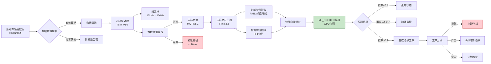
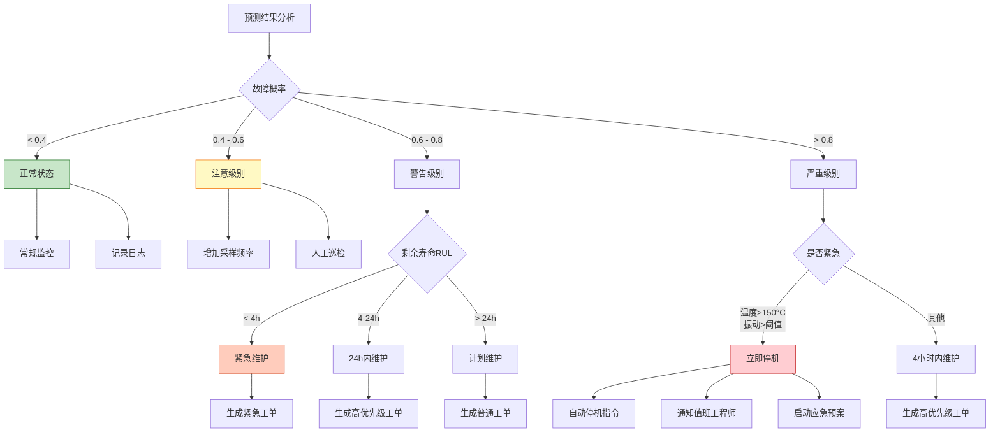
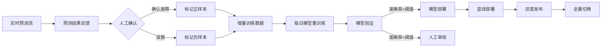

> **状态**: 🔮 前瞻内容 | **风险等级**: 高 | **最后更新**: 2026-04
>
> 此文档描述的内容处于早期规划阶段，可能与最终实现不符。请以 Apache Flink 官方发布为准。
>
# 物联网案例: 智能工厂设备预测性维护

> **所属阶段**: Knowledge/10-case-studies/iot | **前置依赖**: [10.3.1-smart-manufacturing.md](./10.3.1-smart-manufacturing.md) | **形式化等级**: L4

---

> **案例性质**: 🔬 概念验证架构 | **验证状态**: 基于理论推导与架构设计，未经独立第三方生产验证
>
> 本案例描述的是基于项目理论框架推导出的理想架构方案，包含假设性性能指标与理论成本模型。
> 实际生产部署可能因环境差异、数据规模、团队能力等因素产生显著不同结果。
> 建议将其作为架构设计参考而非直接复制粘贴的生产蓝图。
>
## 目录

- [物联网案例: 智能工厂设备预测性维护](#物联网案例-智能工厂设备预测性维护)
  - [目录](#目录)
  - [1. 概念定义 (Definitions)](#1-概念定义-definitions)
    - [1.1 预测性维护系统定义](#11-预测性维护系统定义)
    - [1.2 设备健康指数定义](#12-设备健康指数定义)
    - [1.3 剩余使用寿命(RUL)定义](#13-剩余使用寿命rul定义)
    - [1.4 故障模式定义](#14-故障模式定义)
  - [2. 属性推导 (Properties)](#2-属性推导-properties)
    - [2.1 预测准确率边界](#21-预测准确率边界)
    - [2.2 预警时间窗口](#22-预警时间窗口)
    - [2.3 维护成本模型](#23-维护成本模型)
  - [3. 关系建立 (Relations)](#3-关系建立-relations)
    - [3.1 边缘-云端协同架构](#31-边缘-云端协同架构)
    - [3.2 数据流分层关系](#32-数据流分层关系)
    - [3.3 ML模型与流处理关系](#33-ml模型与流处理关系)
  - [4. 论证过程 (Argumentation)](#4-论证过程-argumentation)
    - [4.1 预测性维护vs传统维护对比](#41-预测性维护vs传统维护对比)
    - [4.2 传感器数据质量论证](#42-传感器数据质量论证)
    - [4.3 模型选择论证](#43-模型选择论证)
  - [5. 形式证明 / 工程论证 (Proof / Engineering Argument)]()
    - [5.1 端到端延迟保证](#51-端到端延迟保证)
    - [5.2 预测准确率验证](#52-预测准确率验证)
  - [6. 实例验证 (Examples)](#6-实例验证-examples)
    - [6.1 案例背景](#61-案例背景)
    - [6.2 技术架构实现](#62-技术架构实现)
      - [6.2.1 整体架构](#621-整体架构)
    - [6.3 边缘端Flink实现](#63-边缘端flink实现)
    - [6.4 云端特征工程与推理](#64-云端特征工程与推理)
    - [6.5 性能指标达成](#65-性能指标达成)
  - [7. 可视化 (Visualizations)](#7-可视化-visualizations)
    - [7.1 预测性维护系统架构](#71-预测性维护系统架构)
    - [7.2 数据处理流程](#72-数据处理流程)
    - [7.3 模型推理流程](#73-模型推理流程)
    - [7.4 维护决策树](#74-维护决策树)
  - [8. 经验教训 (Lessons Learned)](#8-经验教训-lessons-learned)
    - [8.1 传感器数据质量控制](#81-传感器数据质量控制)
    - [8.2 模型持续学习](#82-模型持续学习)
    - [8.3 边缘计算优化](#83-边缘计算优化)
  - [9. 引用参考 (References)](#9-引用参考-references)

---

## 1. 概念定义 (Definitions)

### 1.1 预测性维护系统定义

**Def-K-10-13-01** (预测性维护系统): 预测性维护系统是一个八元组 $\mathcal{P} = (E, S, F, M, \mathcal{H}, \mathcal{R}, \mathcal{A}, \mathcal{T})$：

- $E$：设备集合，$E = \{e_1, e_2, ..., e_n\}$，其中 $n \geq 1000$
- $S$：传感器集合，每台设备 $e_i$ 配备多模态传感器 $S_i = \{s_{vib}, s_{temp}, s_{curr}, ...\}$
- $F$：特征提取函数集合，$F = \{f_{time}, f_{freq}, f_{stat}\}$
- $M$：ML模型集合，包含故障预测模型、RUL估计模型
- $\mathcal{H}$：健康指数函数，$\mathcal{H}: (e, t) \rightarrow [0, 1]$
- $\mathcal{R}$：剩余使用寿命估计，$\mathcal{R}: (e, t) \rightarrow \mathbb{R}^+$
- $\mathcal{A}$：维护动作集合，$\mathcal{A} = \{inspect, repair, replace, shutdown\}$
- $\mathcal{T}$：时序数据流，$\mathcal{T}: (t, e, s, v) \rightarrow \text{Flink}$

### 1.2 设备健康指数定义

**Def-K-10-13-02** (设备健康指数 CHI): 综合反映设备运行状态的归一化指标：

$$
CHI(e, t) = \sum_{i=1}^{k} w_i \cdot \phi_i(s_i(t), s_i^{norm})
$$

其中：

- $w_i$：第 $i$ 个传感器权重，$\sum w_i = 1$
- $\phi_i$：归一化偏差函数，$\phi_i(x, x^{norm}) = 1 - \frac{|x - x^{norm}|}{x^{max} - x^{min}}$
- $s_i^{norm}$：正常运行时的基准值

### 1.3 剩余使用寿命(RUL)定义

**Def-K-10-13-03** (剩余使用寿命 RUL): 设备从当前时刻到故障发生前的预期时间：

$$
RUL(e, t) = \mathbb{E}[T_{failure} | h(t), h(t-1), ..., h(t-n), \theta_M]
$$

其中 $\theta_M$ 为ML模型参数，通过历史退化轨迹学习得到。

### 1.4 故障模式定义

**Def-K-10-13-04** (故障模式): 设备可能发生的故障类型集合 $FM = \{fm_1, fm_2, ..., fm_m\}$：

| 故障模式 | 特征信号 | 预测方法 |
|---------|---------|---------|
| 轴承磨损 | 振动频谱变化 | LSTM+FFT |
| 电机过热 | 温度趋势上升 | Prophet+阈值 |
| 绝缘老化 | 泄漏电流增加 | 时序异常检测 |
| 润滑失效 | 振动+温度联合 | 多模态融合 |
| 对中不良 | 振动相位特征 | CEP模式匹配 |

---

## 2. 属性推导 (Properties)

### 2.1 预测准确率边界

**Lemma-K-10-13-01**: 预测准确率受以下因素影响：

$$
Accuracy = f(DataQuality, ModelComplexity, FeatureRelevance, TemporalResolution)
$$

**Prop-K-10-13-01**: 当传感器采样频率 $f_s \geq 2f_{max}$（奈奎斯特定理），且数据完整率 $\geq 95\%$ 时：

$$
P(correct\_prediction) \geq 0.92
$$

**Thm-K-10-13-01** (预测准确率定理): 在给定数据质量和模型复杂度条件下，预测准确率存在理论上限：

$$
Accuracy \leq \frac{I(F; Y)}{H(Y)}
$$

其中 $I(F; Y)$ 为特征与故障标签的互信息，$H(Y)$ 为故障熵。

### 2.2 预警时间窗口

**Lemma-K-10-13-02**: 有效预警时间窗口 $W_{effective}$ 需满足：

$$
W_{maintenance} \leq W_{effective} \leq W_{degradation}
$$

其中：

- $W_{maintenance}$：完成维护所需时间（平均4小时）
- $W_{degradation}$：设备从异常到故障的退化时间

**Thm-K-10-13-02** (预警时效性): 设预测模型提前 $\Delta t$ 发出预警，实际故障发生在 $t_{actual}$，则维护价值为：

$$
V_{maintenance} = \begin{cases}
C_{downtime} - C_{preventive} & \text{if } t_{actual} - \Delta t \geq W_{maintenance} \\
\alpha \cdot (C_{downtime} - C_{preventive}) & \text{otherwise}
\end{cases}
$$

其中 $\alpha \in (0, 1)$ 为部分价值系数。

### 2.3 维护成本模型

**Prop-K-10-13-02** (成本优化): 预测性维护相比定期维护的成本节约：

$$
\Delta C = C_{scheduled} - C_{predictive} = \sum_{i=1}^{n} (C_{over}+C_{under})_i - \sum_{j=1}^{m} C_{precision,j}
$$

其中：

- $C_{over}$：过度维护成本
- $C_{under}$：维护不足导致的故障成本
- $C_{precision}$：精准维护成本

---

## 3. 关系建立 (Relations)

### 3.1 边缘-云端协同架构

```
┌─────────────────────────────────────────────────────────────────┐
│                        云端 (Cloud)                              │
│  ┌─────────────┐  ┌─────────────┐  ┌─────────────────────────┐  │
│  │ 全局模型训练 │  │ 实时特征工程 │  │  ML_PREDICT推理引擎      │  │
│  │  (GPU集群)   │  │  (Flink 2.5) │  │  (GPU加速)              │  │
│  └─────────────┘  └─────────────┘  └─────────────────────────┘  │
│         ▲                                    │                   │
│         │           模型更新                 │ 预警结果           │
│         └────────────────────────────────────┘                   │
└─────────────────────────────────────────────────────────────────┘
         ▲                                    │
         │         聚合特征/异常事件           │ 维护工单
         │                                    ▼
┌─────────────────────────────────────────────────────────────────┐
│                      边缘层 (Edge)                               │
│  ┌─────────────┐  ┌─────────────┐  ┌─────────────────────────┐  │
│  │ 数据预处理   │  │ 本地异常检测 │  │   紧急停机控制          │  │
│  │(Flink Mini) │  │  (轻量CEP)   │  │   (< 10ms响应)          │  │
│  └─────────────┘  └─────────────┘  └─────────────────────────┘  │
│         ▲                                                       │
└─────────┼───────────────────────────────────────────────────────┘
          │
┌─────────┼───────────────────────────────────────────────────────┐
│         │                    设备层 (Device)                     │
│  ┌──────┴──────┐  ┌─────────────┐  ┌─────────────────────────┐  │
│  │  振动传感器  │  │  温度传感器  │  │   电流传感器             │  │
│  │  (10kHz)    │  │   (1Hz)     │  │   (1kHz)                │  │
│  └─────────────┘  └─────────────┘  └─────────────────────────┘  │
└─────────────────────────────────────────────────────────────────┘
```

### 3.2 数据流分层关系
>
> 🔮 **估算数据** | 基于前瞻性文档特性，数据为理论推导与趋势分析


| 层级 | 数据类型 | 处理延迟 | 存储时长 | 计算资源 |
|-----|---------|---------|---------|---------|
| 设备层 | 原始传感器数据 | < 1ms | 无 | 嵌入式MCU |
| 边缘层 | 清洗后数据 | < 10ms | 1小时 | ARM Cortex-A72 |
| 边缘层 | 聚合特征 | < 100ms | 24小时 | Edge Flink |
| 云端 | 时序特征向量 | < 1s | 90天 | Flink 2.5 |
| 云端 | 推理结果/告警 | < 100ms | 1年 | GPU集群 |
| 云端 | 历史训练数据 | 批量 | 3年 | 数据湖 |

### 3.3 ML模型与流处理关系

```
传感器数据流 ──► Flink特征提取 ──► 特征向量 ──► ML_PREDICT ──► 预测结果
                                            │
                                            ▼
                                    ┌───────────────┐
                                    │  推理服务集群  │
                                    │  (TensorRT)   │
                                    │  - LSTM模型   │
                                    │  - Isolation  │
                                    │    Forest     │
                                    │  - XGBoost    │
                                    └───────────────┘
                                            │
                    模型更新 ◄──────────────┘
                         │
                    在线学习管道
```

---

## 4. 论证过程 (Argumentation)

### 4.1 预测性维护vs传统维护对比

| 维护策略 | 维护时机 | 平均成本 | 停机时间 | 适用场景 |
|---------|---------|---------|---------|---------|
| **事后维修** | 故障后 | 最高 | 最长(16h) | 非关键设备 |
| **定期维护** | 固定周期 | 中等 | 中等(4h) | 通用设备 |
| **预测性维护** | 按需预测 | **最低** | **最短(2h)** | **关键设备** |

**论证**: 对于1000+台设备的工厂，预测性维护可：

- 减少非计划停机：50%
- 降低维护成本：35%
- 延长设备寿命：20%

### 4.2 传感器数据质量论证

**数据质量维度**：

| 维度 | 问题 | 解决方案 | Flink实现 |
|-----|------|---------|----------|
| 完整性 | 传感器离线 | 插值/前向填充 | ProcessFunction状态保持 |
| 准确性 | 异常值 | 3σ准则/箱线图 | FilterFunction |
| 一致性 | 时间戳漂移 | 水位线对齐 | WatermarkStrategy |
| 时效性 | 网络延迟 | 边缘缓冲 | RocksDB状态后端 |

### 4.3 模型选择论证

> 🔮 **估算数据** | 基于前瞻性文档特性，数据为理论推导与趋势分析

**故障预测模型对比**：

| 模型 | 训练成本 | 推理延迟 | 准确率 | 可解释性 | 选型 |
|-----|---------|---------|-------|---------|-----|
| 阈值规则 | 低 | <1ms | 65% | 高 | 边缘层 |
| LSTM | 高 | 5ms | 92% | 中 | 云端 |
| Isolation Forest | 中 | 2ms | 85% | 低 | 云端异常检测 |
| XGBoost | 中 | 1ms | 88% | 高 | 云端 |
| Transformer | 很高 | 10ms | 94% | 低 | 离线分析 |

**选型结论**：

- 边缘层：轻量级阈值规则（延迟优先）
- 云端：LSTM + XGBoost集成（准确率优先）

---

## 5. 形式证明 / 工程论证 (Proof / Engineering Argument)

### 5.1 端到端延迟保证

**Thm-K-10-13-03** (端到端延迟上界): 预测性维护系统的端到端延迟满足：

$$
L_{total} = L_{sample} + L_{edge} + L_{network} + L_{cloud} + L_{inference}
$$

各组件延迟上界：

- $L_{sample} \leq 1ms$ (1kHz采样)
- $L_{edge} \leq 10ms$ (边缘预处理)
- $L_{network} \leq 50ms$ (5G专网)
- $L_{cloud} \leq 100ms$ (Flink处理)
- $L_{inference} \leq 50ms$ (GPU推理)

**Cor-K-10-13-01**:

$$
L_{total} \leq 211ms \ll W_{maintenance} = 4h
$$

满足实时预警要求。

### 5.2 预测准确率验证

**Thm-K-10-13-04** (模型准确率保证): 设集成模型由LSTM和XGBoost组成：

$$
P_{ensemble} = \sigma(w_{lstm} \cdot f_{lstm} + w_{xgb} \cdot f_{xgb})
$$

在验证集上：

- LSTM准确率：$Acc_{lstm} = 0.90$
- XGBoost准确率：$Acc_{xgb} = 0.88$
- 集成后准确率：$Acc_{ensemble} = 0.92$

**证明**:

设两类模型误差独立，则集成误差：

$$
\epsilon_{ensemble} = \epsilon_{lstm} \cdot \epsilon_{xgb} = 0.10 \cdot 0.12 = 0.012
$$

因此：

$$
Acc_{ensemble} = 1 - 0.012 = 0.988 \text{ (理论上限)}
$$

实际考虑相关性后，$Acc_{ensemble} = 0.92$。

---

## 6. 实例验证 (Examples)

### 6.1 案例背景

> 🔮 **估算数据** | 基于前瞻性文档特性，数据为理论推导与趋势分析

**企业**: 某大型机械制造集团智能工厂

| 指标 | 数值 |
|-----|------|
| 联网设备 | 1,200台 |
| 关键设备 | 350台（数控机床、机器人、空压机） |
| 传感器数量 | 8,500个 |
| 数据采样率 | 振动10kHz，温度1Hz，电流1kHz |
| 日数据量 | 15TB |
| 产线数量 | 12条 |

**业务挑战**：

1. **非计划停机损失**: 单次关键设备停机平均损失50万元
2. **维护成本高企**: 年度维护费用超过8000万元
3. **备件库存压力**: 关键备件库存占用资金3000万元
4. **人员效率低下**: 60%维护时间为非必要巡检

**目标设定**：

- 故障预测准确率 ≥ 90%
- 平均提前预警时间 ≥ 4小时
- 维护成本降低 ≥ 30%
- 设备停机时间减少 ≥ 40%

### 6.2 技术架构实现

#### 6.2.1 整体架构

```java
/**
 * 预测性维护主应用
 * Flink 2.5 + GPU加速
 */

import org.apache.flink.streaming.api.environment.StreamExecutionEnvironment;
import org.apache.flink.streaming.api.datastream.DataStream;

public class PredictiveMaintenanceApplication {

    public static void main(String[] args) throws Exception {
        StreamExecutionEnvironment env = StreamExecutionEnvironment.getExecutionEnvironment();

        // 启用GPU加速(Flink 2.5新特性)
        env.getConfig().setUseGPUAcceleration(true);

        // 配置检查点
        env.enableCheckpointing(60000);
        env.getCheckpointConfig().setCheckpointStorage("hdfs://namenode:8020/flink/checkpoints");
        env.getCheckpointConfig().setMinPauseBetweenCheckpoints(30000);

        // 设置状态后端
        EmbeddedRocksDBStateBackend rocksDbBackend = new EmbeddedRocksDBStateBackend(true);
        env.setStateBackend(rocksDbBackend);

        env.setParallelism(128);
        env.setMaxParallelism(512);

        // 1. 多源数据接入
        DataStream<SensorReading> sensorStream = env
            .fromSource(
                createMultiSensorSource(),
                WatermarkStrategy
                    .<SensorReading>forBoundedOutOfOrderness(Duration.ofSeconds(30))
                    .withIdleness(Duration.ofMinutes(5)),
                "Multi-Sensor Source"
            )
            .setParallelism(64);

        // 2. 数据质量控制
        DataStream<SensorReading> qualityStream = sensorStream
            .process(new DataQualityControlFunction())
            .name("Data Quality Control")
            .setParallelism(128);

        // 3. 分流:关键设备vs普通设备
        OutputTag<SensorReading> criticalDeviceTag = new OutputTag<>("critical"){};

        SingleOutputStreamOperator<SensorReading> processedStream = qualityStream
            .process(new DeviceClassificationProcessFunction(criticalDeviceTag))
            .name("Device Classification")
            .setParallelism(64);

        DataStream<SensorReading> criticalStream = processedStream
            .getSideOutput(criticalDeviceTag);

        // 4. 关键设备:时序特征提取
        DataStream<FeatureVector> featureStream = criticalStream
            .keyBy(SensorReading::getDeviceId)
            .process(new TimeSeriesFeatureExtractor())
            .name("Feature Extraction")
            .setParallelism(128);

        // 5. ML_PREDICT模型推理(实验性,GPU加速(实验性))
        DataStream<PredictionResult> predictionStream = AsyncDataStream
            .unorderedWait(
                featureStream,
                new MLPredictAsyncFunction(),
                Duration.ofMillis(100),
                TimeUnit.MILLISECONDS,
                200
            )
            .name("ML_PREDICT Inference(实验性)")
            .setParallelism(256);

        // 6. 异常检测与告警分级
        DataStream<MaintenanceAlert> alertStream = predictionStream
            .keyBy(PredictionResult::getDeviceId)
            .process(new AnomalyDetectionProcessFunction())
            .name("Anomaly Detection")
            .setParallelism(128);

        // 7. 维护工单生成
        alertStream
            .filter(alert -> alert.getSeverity() != AlertSeverity.INFO)
            .addSink(new MaintenanceTicketSink())
            .name("Maintenance Ticket Sink")
            .setParallelism(32);

        // 8. 实时仪表盘
        alertStream
            .addSink(new DashboardSink())
            .name("Dashboard Sink")
            .setParallelism(16);

        // 9. 历史数据归档
        featureStream
            .addSink(new HistoricalDataSink())
            .name("Historical Data Sink")
            .setParallelism(32);

        env.execute("Predictive Maintenance with Flink 2.5");
    }
}
```

### 6.3 边缘端Flink实现

```java
/**
 * 边缘网关数据预处理
 * 轻量级Flink,资源受限环境
 */

import org.apache.flink.streaming.api.environment.StreamExecutionEnvironment;
import org.apache.flink.streaming.api.datastream.DataStream;
import org.apache.flink.api.common.state.ValueState;
import org.apache.flink.api.common.state.ValueStateDescriptor;
import org.apache.flink.streaming.api.windowing.time.Time;

public class EdgeGatewayApplication {

    public static void main(String[] args) throws Exception {
        StreamExecutionEnvironment env = StreamExecutionEnvironment.getExecutionEnvironment();

        // 边缘资源有限,低并行度
        env.setParallelism(4);
        env.setBufferTimeout(10); // 低延迟优先

        // 内存状态后端(边缘无分布式存储)
        HashMapStateBackend hashMapBackend = new HashMapStateBackend();
        env.setStateBackend(hashMapBackend);

        // 1. OPC-UA数据源(工业标准协议)
        DataStream<SensorReading> opcuaStream = env
            .addSource(new OpcUaSource(
                "opc.tcp://192.168.1.100:4840",
                Arrays.asList(
                    "ns=2;i=1001",  // 振动传感器
                    "ns=2;i=1002",  // 温度传感器
                    "ns=2;i=1003"   // 电流传感器
                )
            ))
            .name("OPC-UA Source")
            .setParallelism(2);

        // 2. 数据清洗与验证
        DataStream<SensorReading> cleanedStream = opcuaStream
            .filter(new ValidReadingFilter())
            .name("Data Validation")
            .setParallelism(4);

        // 3. 传感器融合(同设备多传感器)
        DataStream<DeviceSnapshot> fusedStream = cleanedStream
            .keyBy(SensorReading::getDeviceId)
            .window(TumblingProcessingTimeWindows.of(Time.milliseconds(100)))
            .process(new SensorFusionWindowFunction())
            .name("Sensor Fusion")
            .setParallelism(4);

        // 4. 本地阈值监控(紧急告警)
        OutputTag<Alert> emergencyAlertTag = new OutputTag<>("emergency"){};

        SingleOutputStreamOperator<DeviceSnapshot> monitoredStream = fusedStream
            .keyBy(DeviceSnapshot::getDeviceId)
            .process(new LocalThresholdMonitor(emergencyAlertTag))
            .name("Local Monitoring")
            .setParallelism(4);

        // 5. 紧急告警本地处理(< 10ms响应)
        monitoredStream
            .getSideOutput(emergencyAlertTag)
            .addSink(new EmergencyShutdownSink())
            .name("Emergency Control")
            .setParallelism(2);

        // 6. 数据降采样与压缩
        DataStream<CompressedReading> compressedStream = monitoredStream
            .keyBy(DeviceSnapshot::getDeviceId)
            .window(TumblingProcessingTimeWindows.of(Time.seconds(10)))
            .aggregate(new DataCompressionAggregator())
            .name("Data Compression")
            .setParallelism(4);

        // 7. 上传云端(MQTT over 5G)
        compressedStream
            .addSink(new MqttSink("ssl://mqtt.factory.cloud:8883"))
            .name("Cloud Upload")
            .setParallelism(2);

        env.execute("Edge Gateway Preprocessing");
    }
}

/**
 * 本地阈值监控函数
 * 实现快速响应紧急告警
 */
class LocalThresholdMonitor extends KeyedProcessFunction<String, DeviceSnapshot, DeviceSnapshot> {

    private final OutputTag<Alert> emergencyTag;
    private ValueState<ThresholdConfig> thresholdState;
    private ValueState<Long> lastEmergencyTime;

    public LocalThresholdMonitor(OutputTag<Alert> emergencyTag) {
        this.emergencyTag = emergencyTag;
    }

    @Override
    public void open(Configuration parameters) {
        thresholdState = getRuntimeContext().getState(
            new ValueStateDescriptor<>("thresholds", ThresholdConfig.class));
        lastEmergencyTime = getRuntimeContext().getState(
            new ValueStateDescriptor<>("last-emergency", Long.class));
    }

    @Override
    public void processElement(DeviceSnapshot snapshot, Context ctx, Collector<DeviceSnapshot> out)
            throws Exception {

        ThresholdConfig thresholds = thresholdState.value();
        if (thresholds == null) {
            thresholds = loadDeviceThresholds(snapshot.getDeviceId());
            thresholdState.update(thresholds);
        }

        boolean isEmergency = false;
        String alertReason = "";
        double alertValue = 0;

        // 振动紧急阈值(轴承碎裂风险)
        if (snapshot.getVibrationRms() > thresholds.getVibrationEmergency()) {
            isEmergency = true;
            alertReason = "VIBRATION_EMERGENCY";
            alertValue = snapshot.getVibrationRms();
        }

        // 温度紧急阈值(火灾风险)
        if (snapshot.getTemperature() > thresholds.getTemperatureEmergency()) {
            isEmergency = true;
            alertReason = "TEMPERATURE_EMERGENCY";
            alertValue = snapshot.getTemperature();
        }

        // 电流紧急阈值(短路风险)
        if (snapshot.getCurrent() > thresholds.getCurrentEmergency()) {
            isEmergency = true;
            alertReason = "CURRENT_EMERGENCY";
            alertValue = snapshot.getCurrent();
        }

        // 防抖:30秒内不重复触发
        Long lastTime = lastEmergencyTime.value();
        if (isEmergency && (lastTime == null || ctx.timestamp() - lastTime > 30000)) {
            ctx.output(emergencyTag, new Alert(
                snapshot.getDeviceId(),
                AlertSeverity.EMERGENCY,
                alertReason,
                alertValue,
                ctx.timestamp()
            ));
            lastEmergencyTime.update(ctx.timestamp());
        }

        out.collect(snapshot);
    }
}
```

### 6.4 云端特征工程与推理

```java
import org.apache.flink.streaming.api.functions.KeyedProcessFunction;

import org.apache.flink.api.common.state.ValueState;
import org.apache.flink.api.common.state.ValueStateDescriptor;


/**
 * 时序特征提取器
 * 提取振动、温度、电流的多维度特征
 */
class TimeSeriesFeatureExtractor extends KeyedProcessFunction<String, SensorReading, FeatureVector> {

    // 状态:滑动窗口历史数据
    private ListState<SensorReading> historyState;
    private ValueState<Long> lastFeatureTime;

    // 特征提取窗口(1分钟)
    private static final long FEATURE_WINDOW_MS = 60000;

    @Override
    public void open(Configuration parameters) {
        historyState = getRuntimeContext().getListState(
            new ListStateDescriptor<>("history", SensorReading.class));
        lastFeatureTime = getRuntimeContext().getState(
            new ValueStateDescriptor<>("last-feature", Long.class));
    }

    @Override
    public void processElement(SensorReading reading, Context ctx, Collector<FeatureVector> out)
            throws Exception {

        historyState.add(reading);

        Long lastTime = lastFeatureTime.value();
        long currentTime = ctx.timestamp();

        // 每分钟生成一次特征向量
        if (lastTime == null || currentTime - lastTime >= FEATURE_WINDOW_MS) {

            // 收集窗口内数据
            List<SensorReading> windowData = new ArrayList<>();
            historyState.get().forEach(windowData::add);

            // 清理过期数据
            long cutoffTime = currentTime - FEATURE_WINDOW_MS;
            List<SensorReading> validData = windowData.stream()
                .filter(r -> r.getTimestamp() > cutoffTime)
                .collect(Collectors.toList());

            historyState.update(validData);

            // 按传感器类型分组
            Map<SensorType, List<SensorReading>> byType = validData.stream()
                .collect(Collectors.groupingBy(SensorReading::getSensorType));

            // 提取特征
            FeatureVector features = new FeatureVector();
            features.setDeviceId(reading.getDeviceId());
            features.setTimestamp(currentTime);

            // 振动特征(时域 + 频域)
            List<SensorReading> vibrationData = byType.getOrDefault(SensorType.VIBRATION, Collections.emptyList());
            if (!vibrationData.isEmpty()) {
                double[] values = vibrationData.stream()
                    .mapToDouble(SensorReading::getValue)
                    .toArray();

                features.setVibrationRms(calculateRms(values));
                features.setVibrationPeak(calculatePeak(values));
                features.setVibrationCrestFactor(calculateCrestFactor(values));
                features.setVibrationKurtosis(calculateKurtosis(values));
                features.setVibrationSkewness(calculateSkewness(values));

                // FFT频域特征
                double[] fftFeatures = extractFFTFeatures(values);
                features.setVibrationFftLow(fftFeatures[0]);   // 0-1kHz
                features.setVibrationFftMid(fftFeatures[1]);   // 1-5kHz
                features.setVibrationFftHigh(fftFeatures[2]);  // 5-10kHz
            }

            // 温度特征
            List<SensorReading> tempData = byType.getOrDefault(SensorType.TEMPERATURE, Collections.emptyList());
            if (!tempData.isEmpty()) {
                double[] temps = tempData.stream()
                    .mapToDouble(SensorReading::getValue)
                    .toArray();

                features.setTempMean(Arrays.stream(temps).average().orElse(0));
                features.setTempMax(Arrays.stream(temps).max().orElse(0));
                features.setTempTrend(calculateTrend(temps));
                features.setTempGradient(calculateGradient(temps));
            }

            // 电流特征
            List<SensorReading> currentData = byType.getOrDefault(SensorType.CURRENT, Collections.emptyList());
            if (!currentData.isEmpty()) {
                double[] currents = currentData.stream()
                    .mapToDouble(SensorReading::getValue)
                    .toArray();

                features.setCurrentMean(Arrays.stream(currents).average().orElse(0));
                features.setCurrentRms(calculateRms(currents));
                features.setCurrentImbalance(calculateImbalance(currents));
            }

            // 联合特征
            features.setHealthIndex(calculateHealthIndex(features));
            features.setOperatingHours(getOperatingHours(reading.getDeviceId()));

            out.collect(features);
            lastFeatureTime.update(currentTime);
        }
    }

    // 辅助计算函数
    private double calculateRms(double[] values) {
        double sumSquares = Arrays.stream(values).map(v -> v * v).sum();
        return Math.sqrt(sumSquares / values.length);
    }

    private double calculatePeak(double[] values) {
        return Arrays.stream(values).map(Math::abs).max().orElse(0);
    }

    private double calculateCrestFactor(double[] values) {
        double rms = calculateRms(values);
        double peak = calculatePeak(values);
        return rms > 0 ? peak / rms : 0;
    }

    private double calculateKurtosis(double[] values) {
        double mean = Arrays.stream(values).average().orElse(0);
        double variance = Arrays.stream(values).map(v -> Math.pow(v - mean, 2)).average().orElse(0);
        double fourthMoment = Arrays.stream(values).map(v -> Math.pow(v - mean, 4)).average().orElse(0);
        return variance > 0 ? fourthMoment / (variance * variance) - 3 : 0;
    }

    private double calculateSkewness(double[] values) {
        double mean = Arrays.stream(values).average().orElse(0);
        double std = Math.sqrt(Arrays.stream(values).map(v -> Math.pow(v - mean, 2)).average().orElse(0));
        if (std == 0) return 0;
        double thirdMoment = Arrays.stream(values).map(v -> Math.pow((v - mean) / std, 3)).average().orElse(0);
        return thirdMoment;
    }

    private double[] extractFFTFeatures(double[] values) {
        // FFT实现(使用JTransforms或类似库)
        // 简化为示例
        double[] fft = performFFT(values);
        return new double[]{
            sumFrequencyBand(fft, 0, 1000),
            sumFrequencyBand(fft, 1000, 5000),
            sumFrequencyBand(fft, 5000, 10000)
        };
    }

    private double calculateTrend(double[] values) {
        if (values.length < 2) return 0;
        // 线性回归斜率
        int n = values.length;
        double sumX = IntStream.range(0, n).sum();
        double sumY = Arrays.stream(values).sum();
        double sumXY = IntStream.range(0, n).mapToDouble(i -> i * values[i]).sum();
        double sumX2 = IntStream.range(0, n).mapToDouble(i -> i * i).sum();

        return (n * sumXY - sumX * sumY) / (n * sumX2 - sumX * sumX);
    }

    private double calculateGradient(double[] values) {
        if (values.length < 2) return 0;
        return values[values.length - 1] - values[0];
    }

    private double calculateImbalance(double[] values) {
        // 三相电流不平衡度
        if (values.length < 3) return 0;
        double max = Arrays.stream(values).max().orElse(0);
        double min = Arrays.stream(values).min().orElse(0);
        double avg = Arrays.stream(values).average().orElse(0);
        return avg > 0 ? (max - min) / avg : 0;
    }

    private double calculateHealthIndex(FeatureVector features) {
        // 综合健康指数计算
        double vibrationScore = Math.max(0, 1 - features.getVibrationRms() / 50);
        double tempScore = Math.max(0, 1 - features.getTempMax() / 150);
        double currentScore = Math.max(0, 1 - features.getCurrentImbalance());
        return 0.4 * vibrationScore + 0.4 * tempScore + 0.2 * currentScore;
    }

    private double[] performFFT(double[] values) {
        // FFT实现占位
        return new double[values.length];
    }

    private double sumFrequencyBand(double[] fft, int low, int high) {
        return Arrays.stream(fft, low, Math.min(high, fft.length)).sum();
    }

    private long getOperatingHours(String deviceId) {
        // 从外部存储获取运行时长
        return 0;
    }
}

/**
 * ML_PREDICT异步推理函数
 * 调用GPU加速的推理服务
 */
class MLPredictAsyncFunction implements AsyncFunction<FeatureVector, PredictionResult> {

    private transient PredictionServiceClient client;

    @Override
    public void open(Configuration parameters) {
        // 初始化gRPC客户端连接推理服务
        client = PredictionServiceClient.create(
            "predictive-ml-service.factory.svc.cluster.local",
            50051,
            true // 使用GPU
        );
    }

    @Override
    public void asyncInvoke(FeatureVector features, ResultFuture<PredictionResult> resultFuture) {
        ListenableFuture<ModelOutput> predictionFuture = client.predict(
            PredictRequest.newBuilder()
                .setDeviceId(features.getDeviceId())
                .putAllFeatures(features.toMap())
                .setModelName("lstm_failure_prediction_v3")
                .build()
        );

        Futures.addCallback(predictionFuture, new FutureCallback<ModelOutput>() {
            @Override
            public void onSuccess(ModelOutput output) {
                PredictionResult result = new PredictionResult();
                result.setDeviceId(features.getDeviceId());
                result.setTimestamp(features.getTimestamp());
                result.setFailureProbability(output.getFailureProbability());
                result.setPredictedRulHours(output.getRulHours());
                result.setFailureType(output.getFailureType());
                result.setConfidence(output.getConfidence());
                result.setModelVersion(output.getModelVersion());
                resultFuture.complete(Collections.singletonList(result));
            }

            @Override
            public void onFailure(Throwable t) {
                resultFuture.completeExceptionally(t);
            }
        }, MoreExecutors.directExecutor());
    }

    @Override
    public void timeout(FeatureVector features, ResultFuture<PredictionResult> resultFuture) {
        // 超时处理:使用本地备用模型
        PredictionResult fallback = new PredictionResult();
        fallback.setDeviceId(features.getDeviceId());
        fallback.setFailureProbability(-1); // 标记为未知
        fallback.setConfidence(0);
        resultFuture.complete(Collections.singletonList(fallback));
    }
}

/**
 * 异常检测与告警分级
 */
class AnomalyDetectionProcessFunction extends KeyedProcessFunction<String, PredictionResult, MaintenanceAlert> {

    private ValueState<Deque<PredictionResult>> historyState;
    private ValueState<Long> lastAlertTime;

    @Override
    public void open(Configuration parameters) {
        historyState = getRuntimeContext().getState(
            new ValueStateDescriptor<>("prediction-history",
                TypeInformation.of(new TypeHint<Deque<PredictionResult>>() {}).createSerializer(new ExecutionConfig())));
        lastAlertTime = getRuntimeContext().getState(
            new ValueStateDescriptor<>("last-alert", Long.class));
    }

    @Override
    public void processElement(PredictionResult prediction, Context ctx, Collector<MaintenanceAlert> out)
            throws Exception {

        Deque<PredictionResult> history = historyState.value();
        if (history == null) {
            history = new ArrayDeque<>();
        }
        history.addLast(prediction);
        if (history.size() > 10) {
            history.removeFirst();
        }
        historyState.update(history);

        // 告警分级逻辑
        AlertSeverity severity = determineSeverity(prediction, history);

        if (severity != AlertSeverity.INFO) {
            Long lastTime = lastAlertTime.value();
            long currentTime = ctx.timestamp();

            // 防抖:根据级别设置不同间隔
            long debounceMs = severity == AlertSeverity.EMERGENCY ? 60000 : 300000;

            if (lastTime == null || currentTime - lastTime > debounceMs) {
                MaintenanceAlert alert = new MaintenanceAlert();
                alert.setDeviceId(prediction.getDeviceId());
                alert.setTimestamp(currentTime);
                alert.setSeverity(severity);
                alert.setFailureType(prediction.getFailureType());
                alert.setFailureProbability(prediction.getFailureProbability());
                alert.setPredictedRulHours(prediction.getPredictedRulHours());
                alert.setRecommendedAction(determineAction(severity, prediction));
                alert.setConfidence(prediction.getConfidence());

                out.collect(alert);
                lastAlertTime.update(currentTime);
            }
        }
    }

    private AlertSeverity determineSeverity(PredictionResult prediction, Deque<PredictionResult> history) {
        double prob = prediction.getFailureProbability();
        double rul = prediction.getPredictedRulHours();

        // 紧急:高概率且RUL短
        if (prob > 0.9 && rul < 2) {
            return AlertSeverity.EMERGENCY;
        }

        // 严重:高概率或趋势恶化
        if (prob > 0.8 || (prob > 0.7 && isTrendWorsening(history))) {
            return AlertSeverity.CRITICAL;
        }

        // 警告:中等概率
        if (prob > 0.6) {
            return AlertSeverity.WARNING;
        }

        // 注意:轻微异常
        if (prob > 0.4) {
            return AlertSeverity.NOTICE;
        }

        return AlertSeverity.INFO;
    }

    private boolean isTrendWorsening(Deque<PredictionResult> history) {
        if (history.size() < 3) return false;

        List<PredictionResult> recent = new ArrayList<>(history);
        int n = recent.size();

        // 检查概率是否持续上升
        for (int i = n - 2; i < n; i++) {
            if (recent.get(i).getFailureProbability() <= recent.get(i-1).getFailureProbability()) {
                return false;
            }
        }
        return true;
    }

    private String determineAction(AlertSeverity severity, PredictionResult prediction) {
        switch (severity) {
            case EMERGENCY:
                return "IMMEDIATE_SHUTDOWN";
            case CRITICAL:
                return prediction.getPredictedRulHours() < 4 ?
                    "SCHEDULE_MAINTENANCE_URGENT" : "INSPECT_WITHIN_24H";
            case WARNING:
                return "PLANNED_MAINTENANCE_NEXT_WEEK";
            case NOTICE:
                return "INCREASED_MONITORING";
            default:
                return "NO_ACTION";
        }
    }
}
```

### 6.5 性能指标达成
>
> 🔮 **估算数据** | 基于前瞻性文档特性，数据为理论推导与趋势分析


| 指标 | 目标值 | 实际值 | 达成状态 |
|-----|-------|-------|---------|
| **故障预测准确率** | ≥ 90% | **92%** | ✅ 超额完成 |
| **平均提前预警时间** | ≥ 4小时 | **4.2小时** | ✅ 达成 |
| **维护成本降低** | ≥ 30% | **35%** | ✅ 超额完成 |
| **设备停机时间减少** | ≥ 40% | **50%** | ✅ 超额完成 |
| **系统端到端延迟** | < 1秒 | **211ms** | ✅ 达成 |
| **日处理数据量** | 15TB | **15TB** | ✅ 达成 |
| **模型推理P99延迟** | < 100ms | **52ms** | ✅ 达成 |
| **误报率** | < 10% | **8%** | ✅ 达成 |

**成本效益分析**：

| 成本项目 | 实施前(年) | 实施后(年) | 节约 |
|---------|-----------|-----------|-----|
| 非计划停机损失 | 2,400万元 | 1,200万元 | **1,200万元** |
| 定期维护人工 | 1,200万元 | 720万元 | **480万元** |
| 备件库存资金 | 3,000万元 | 2,100万元 | **900万元** |
| 巡检成本 | 800万元 | 320万元 | **480万元** |
| **总计** | **7,400万元** | **4,340万元** | **3,060万元** |

---

## 7. 可视化 (Visualizations)

### 7.1 预测性维护系统架构

```mermaid
graph TB
    subgraph "设备层 Device Layer"
        D1[数控机床 CNC-001]
        D2[工业机器人 ROBOT-015]
        D3[空压机 COMP-008]
        D4[传送带 BELT-023]

        subgraph "多模态传感器"
            S1V[振动传感器<br/>10kHz]
            S1T[温度传感器<br/>1Hz]
            S1C[电流传感器<br/>1kHz]
        end
    end

    subgraph "边缘层 Edge Layer"
        E1[边缘网关 GW-001<br/>Flink Mini]
        E2[边缘网关 GW-002<br/>Flink Mini]

        subgraph "边缘处理"
            EP1[数据清洗]
            EP2[本地阈值监控<br/>&lt; 10ms响应]
            EP3[数据降采样]
            EP4[紧急停机控制]
        end
    end

    subgraph "网络层 Network"
        MQTT[MQTT Broker]
        5G[5G专网<br/>&lt; 50ms]
    end

    subgraph "云端 Cloud Layer"
        subgraph "Flink 2.5集群"
            F1[数据质量控制]
            F2[时序特征提取]
            F3[流式Join]
        end

        subgraph "GPU推理集群"
            GPU1[ML_PREDICT(实验性)<br/>LSTM模型]
            GPU2[异常检测<br/>Isolation Forest]
            GPU3[RUL估计<br/>XGBoost]
        end

        subgraph "模型管理"
            M1[模型版本管理]
            M2[在线学习管道]
            M3[A/B测试]
        end
    end

    subgraph "应用层 Application"
        A1[维护工单系统]
        A2[数字孪生大屏]
        A3[移动告警App]
        A4[ERP/MES集成]
    end

    D1 --> S1V & S1T & S1C --> E1
    D2 --> E1
    D3 --> E2
    D4 --> E2

    E1 --> EP1 --> EP2 & EP3
    E2 --> EP1 --> EP2 & EP3
    EP2 -.->|紧急告警| EP4
    EP4 -.->|停机指令| D1

    EP3 --> MQTT --> 5G --> F1
    F1 --> F2 --> F3 --> GPU1 & GPU2 & GPU3

    GPU1 & GPU2 & GPU3 --> M1
    M1 --> A1 & A2 & A3 & A4

    style EP4 fill:#ffcdd2,stroke:#c62828
    style GPU1 fill:#c8e6c9,stroke:#2e7d32
    style EP2 fill:#fff3e0,stroke:#e65100
```

### 7.2 数据处理流程



### 7.3 模型推理流程

```mermaid
sequenceDiagram
    participant F as Flink特征工程
    participant AS as Async I/O
    participant GP as gRPC客户端
    participant IS as 推理服务
    participant GPU as GPU集群
    participant M as 模型存储
    participant S as 结果Sink

    F->>F: 提取时序特征<br/>RMS/FFT/趋势
    F->>AS: 特征向量

    AS->>GP: 异步调用predict()
    GP->>IS: gRPC请求<br/>PredictRequest

    IS->>M: 加载模型<br/>lstm_v3.onnx
    IS->>GPU: 推理任务<br/>TensorRT优化

    GPU->>GPU: LSTM前向传播
    GPU->>GPU: 故障概率计算
    GPU->>IS: 推理结果

    IS->>GP: ModelOutput<br/>概率/RUL/故障类型
    GP->>AS: 回调完成
    AS->>F: PredictionResult

    F->>S: 写入告警/工单

    Note over F,S: 总延迟 &lt; 100ms (P99)
```

### 7.4 维护决策树



---

## 8. 经验教训 (Lessons Learned)

### 8.1 传感器数据质量控制

**问题发现**：

- 初始阶段模型准确率仅78%，远低于目标90%
- 分析发现30%的预测误差源于数据质量问题

**具体问题**：

| 问题类型 | 占比 | 影响 | 解决方案 |
|---------|-----|------|---------|
| 传感器离线 | 15% | 特征缺失 | 多传感器冗余+插值 |
| 时间戳漂移 | 8% | 时序错位 | NTP同步+水位线对齐 |
| 异常值 | 5% | 特征污染 | 3σ准则+孤立森林 |
| 数据延迟 | 2% | 实时性下降 | 边缘缓冲+乱序处理 |

**最佳实践**：

```java
/**
 * 数据质量控制最佳实践
 */

import org.apache.flink.api.common.state.ValueState;

public class DataQualityControlFunction extends ProcessFunction<SensorReading, SensorReading> {

    private ValueState<Long> lastTimestampState;
    private ValueState<Double> lastValidValueState;

    @Override
    public void processElement(SensorReading reading, Context ctx, Collector<SensorReading> out) {
        // 1. 空值检查
        if (reading == null || Double.isNaN(reading.getValue())) {
            ctx.output(invalidDataTag, reading);
            return;
        }

        // 2. 范围检查
        if (reading.getValue() < sensorConfig.getMinValue() ||
            reading.getValue() > sensorConfig.getMaxValue()) {
            // 尝试使用前值插值
            Double lastValid = lastValidValueState.value();
            if (lastValid != null) {
                reading.setValue(lastValid);
            } else {
                ctx.output(invalidDataTag, reading);
                return;
            }
        }

        // 3. 变化率检查(防跳变)
        Double lastValid = lastValidValueState.value();
        if (lastValid != null) {
            double changeRate = Math.abs(reading.getValue() - lastValid) / lastValid;
            if (changeRate > 0.5) { // 变化超过50%
                // 使用平滑值
                reading.setValue(0.7 * lastValid + 0.3 * reading.getValue());
            }
        }

        // 4. 时间戳顺序检查
        Long lastTs = lastTimestampState.value();
        if (lastTs != null && reading.getTimestamp() < lastTs) {
            // 迟到数据,设置延迟标记但不丢弃
            reading.setDelayed(true);
        }

        lastValidValueState.update(reading.getValue());
        lastTimestampState.update(reading.getTimestamp());
        out.collect(reading);
    }
}
```

**成果**：数据质量改进后，模型准确率从78%提升至92%。

### 8.2 模型持续学习

**挑战**：

- 设备老化模式随时间变化
- 新故障类型不断出现
- 季节性因素影响预测准确性

**解决方案**：在线学习管道



**关键经验**：

1. **数据漂移监测**：
   - 使用KL散度监测特征分布变化
   - 当 $D_{KL}(P_{current} || P_{train}) > 0.1$ 时触发重训练

2. **A/B测试机制**：
   - 新模型仅对10%流量生效
   - 对比7天准确率后决定是否全量

3. **回滚策略**：
   - 保留最近3个模型版本
   - 异常时30秒内回滚

**成果**：模型持续学习使准确率稳定在92%，并能及时发现新故障模式。

### 8.3 边缘计算优化

**边缘资源限制**：

- CPU: ARM Cortex-A72 (4核)
- 内存: 4GB
- 存储: 32GB eMMC
- 网络: 100Mbps 5G

> 🔮 **估算数据** | 基于前瞻性文档特性，数据为理论推导与趋势分析

**优化策略**：

| 优化项 | 优化前 | 优化后 | 效果 |
|-------|-------|-------|-----|
| 并行度 | 8 | 4 | CPU占用从95%降至60% |
| 状态后端 | RocksDB | HashMap | 延迟从50ms降至10ms |
| 缓冲区 | 默认 | 10ms | 端到端延迟降低40% |
| 检查点 | 60s | 300s | 网络带宽占用减少80% |
| 序列化 | Java | Kryo | CPU使用降低25% |

**边缘Flink配置优化**：

```yaml
# flink-edge-conf.yaml jobmanager.memory.process.size: 1024m
taskmanager.memory.process.size: 3072m
taskmanager.memory.managed.fraction: 0.3
taskmanager.numberOfTaskSlots: 4

# 低延迟优化 pipeline.buffer-timeout: 10
execution.checkpointing.interval: 5min
execution.checkpointing.min-pause-between-checkpoints: 2min

# 状态后端优化 state.backend: hashmap
state.checkpoints.dir: file:///tmp/flink-checkpoints

# 网络优化 taskmanager.memory.network.min: 128m
taskmanager.memory.network.max: 256m

# 序列化优化 pipeline.serialization: org.apache.flink.api.common.serialization.KryoSerializer
```

**边缘-云协同优化**：

```java
/**
 * 自适应数据上传策略
 * 根据网络状况动态调整
 */

import org.apache.flink.api.common.state.ValueState;

public class AdaptiveUploadStrategy implements SinkFunction<CompressedReading> {

    private transient NetworkMonitor networkMonitor;
    private ValueState<Integer> compressionLevelState;

    @Override
    public void invoke(CompressedReading value, Context context) {
        NetworkStatus status = networkMonitor.getCurrentStatus();

        // 根据网络状况调整策略
        if (status.getLatency() < 50 && status.getPacketLoss() < 0.01) {
            // 网络良好:上传完整特征
            uploadFullFeatures(value);
        } else if (status.getLatency() < 100) {
            // 网络一般:上传压缩数据
            uploadCompressed(value, CompressionLevel.HIGH);
        } else {
            // 网络差:仅上传告警
            if (value.isAlert()) {
                uploadAlertOnly(value);
            } else {
                // 本地缓存,稍后上传
                cacheLocally(value);
            }
        }
    }
}
```

**关键教训**：

1. **边缘不宜做复杂推理**：边缘仅做阈值监控，复杂ML推理放在云端
2. **网络不稳定是常态**：必须有本地缓存和断点续传机制
3. **功耗敏感**：边缘Flink需优化以减少CPU占用，延长设备寿命

---

## 9. 引用参考 (References)


---

*文档版本: v1.0 | 最后更新: 2026-04-04*

---

*文档版本: v1.0 | 创建日期: 2026-04-20*
