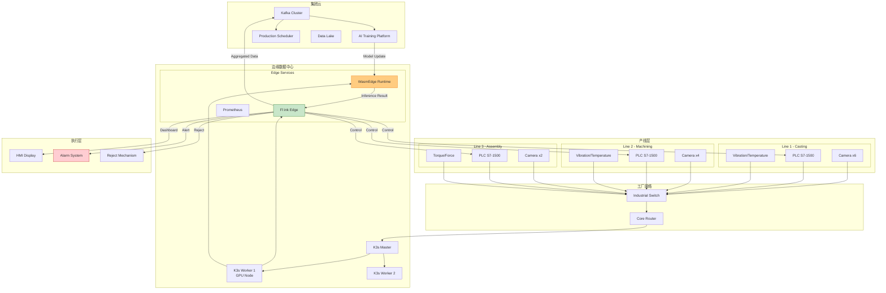
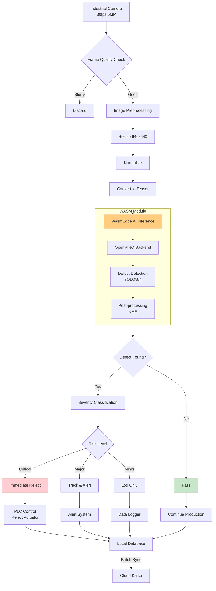
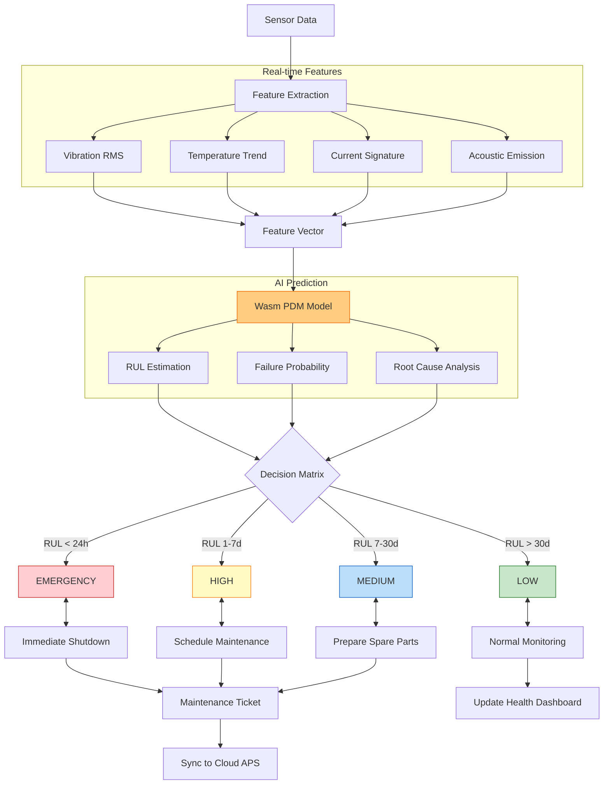
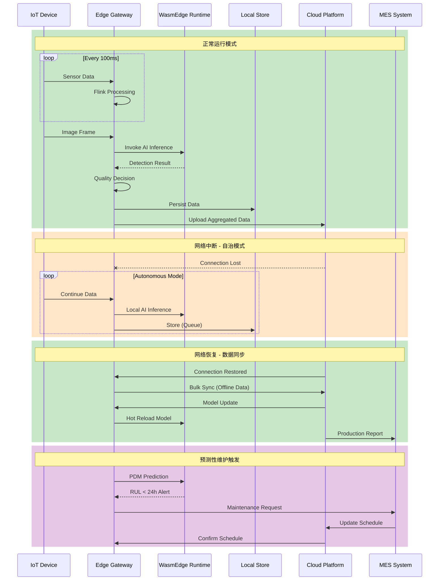

# 智能制造边缘流处理实战案例 (Smart Manufacturing Edge Stream Processing Case Study)

> **所属阶段**: Knowledge/10-case-studies/iot | **前置依赖**: [10.3.1-smart-manufacturing.md](10.3.1-smart-manufacturing.md), [Flink/07-rust-native/edge-wasm-runtime/01-edge-architecture.md](../../../Flink/07-rust-native/edge-wasm-runtime/01-edge-architecture.md) | **形式化等级**: L4

---

## 目录

- [智能制造边缘流处理实战案例 (Smart Manufacturing Edge Stream Processing Case Study)](#智能制造边缘流处理实战案例-smart-manufacturing-edge-stream-processing-case-study)
  - [目录](#目录)
  - [1. 概念定义 (Definitions)](#1-概念定义-definitions)
    - [Def-K-10-34-01: 智能制造数字孪生模型 (Smart Manufacturing Digital Twin Model)](#def-k-10-34-01-智能制造数字孪生模型-smart-manufacturing-digital-twin-model)
    - [Def-K-10-34-02: 边缘质量检测流水线 (Edge Quality Inspection Pipeline)](#def-k-10-34-02-边缘质量检测流水线-edge-quality-inspection-pipeline)
    - [Def-K-10-34-03: 产线节拍优化模型 (Production Takt Time Optimization Model)](#def-k-10-34-03-产线节拍优化模型-production-takt-time-optimization-model)
    - [Def-K-10-34-04: 预测性维护决策框架 (Predictive Maintenance Decision Framework)](#def-k-10-34-04-预测性维护决策框架-predictive-maintenance-decision-framework)
  - [2. 属性推导 (Properties)](#2-属性推导-properties)
    - [Lemma-K-10-34-01: 质量检测延迟边界](#lemma-k-10-34-01-质量检测延迟边界)
    - [Lemma-K-10-34-02: 边缘预处理数据压缩比](#lemma-k-10-34-02-边缘预处理数据压缩比)
    - [Prop-K-10-34-01: 云边协同处理增益](#prop-k-10-34-01-云边协同处理增益)
    - [Prop-K-10-34-02: 边缘AI推理精度保持性](#prop-k-10-34-02-边缘ai推理精度保持性)
  - [3. 关系建立 (Relations)](#3-关系建立-relations)
    - [3.1 云边端数据流关系](#31-云边端数据流关系)
    - [3.2 质量-效率-成本三角关系](#32-质量-效率-成本三角关系)
    - [3.3 预测性维护与生产排程关联](#33-预测性维护与生产排程关联)
  - [4. 论证过程 (Argumentation)](#4-论证过程-argumentation)
    - [4.1 边缘部署 vs 云端部署决策分析](#41-边缘部署-vs-云端部署决策分析)
    - [4.2 工业协议选型论证](#42-工业协议选型论证)
    - [4.3 边缘AI模型轻量化策略](#43-边缘ai模型轻量化策略)
  - [5. 形式证明 / 工程论证 (Proof / Engineering Argument)](#5-形式证明--工程论证-proof--engineering-argument)
    - [5.1 实时质量检测流水线架构](#51-实时质量检测流水线架构)
    - [5.2 边缘WASM推理优化论证](#52-边缘wasm推理优化论证)
    - [5.3 断网续传数据一致性保障](#53-断网续传数据一致性保障)
  - [6. 实例验证 (Examples)](#6-实例验证-examples)
    - [6.1 案例背景与业务挑战](#61-案例背景与业务挑战)
    - [6.2 系统架构设计](#62-系统架构设计)
    - [6.3 核心代码实现](#63-核心代码实现)
    - [6.4 部署实施过程](#64-部署实施过程)
    - [6.5 实施效果与ROI分析](#65-实施效果与roi分析)
  - [7. 可视化 (Visualizations)](#7-可视化-visualizations)
    - [7.1 智能制造边缘架构全景图](#71-智能制造边缘架构全景图)
    - [7.2 质量检测数据流图](#72-质量检测数据流图)
    - [7.3 预测性维护决策流程图](#73-预测性维护决策流程图)
    - [7.4 边缘-云协同时序图](#74-边缘-云协同时序图)
  - [8. 引用参考 (References)](#8-引用参考-references)

---

## 1. 概念定义 (Definitions)

### Def-K-10-34-01: 智能制造数字孪生模型 (Smart Manufacturing Digital Twin Model)

**智能制造数字孪生模型**是物理制造系统的虚拟映射，实现实时监控、仿真分析和优化决策。

形式化定义为：

$$
\text{DigitalTwin}_{manufacturing} = \langle P, V, M, S, Sync, Sim \rangle
$$

其中：

| 符号 | 定义 | 说明 |
|------|------|------|
| $P$ | 物理实体集合 | $P = \{p_1, p_2, ..., p_n\}$，包含设备、物料、人员 |
| $V$ | 虚拟模型集合 | $V = \{v_1, v_2, ..., v_n\}$，与物理实体一一对应 |
| $M$ | 映射关系 | $M: P \times T \rightarrow V$，时空映射函数 |
| $S$ | 状态空间 | $S = S_{physical} \times S_{virtual}$，联合状态 |
| $Sync$ | 同步机制 | $Sync: \Delta S_{physical} \rightarrow \Delta S_{virtual}$ |
| $Sim$ | 仿真引擎 | $Sim: V \times Action \rightarrow PredictedState$ |

**数字孪生层级**：

| 层级 | 粒度 | 同步频率 | 延迟要求 |
|------|------|---------|---------|
| 设备级 | 单台设备 | 100Hz | < 10ms |
| 产线级 | 工位/产线 | 10Hz | < 100ms |
| 车间级 | 多条产线 | 1Hz | < 1s |
| 工厂级 | 全厂 | 0.1Hz | < 10s |

### Def-K-10-34-02: 边缘质量检测流水线 (Edge Quality Inspection Pipeline)

**边缘质量检测流水线**是在边缘节点部署的实时质量检测系统，融合视觉检测、传感器数据分析和AI推理。

形式化定义为：

$$
\text{QIPipeline} = \langle I, Pre, Infer, Post, Decision, Latency_{SLA} \rangle
$$

其中：

| 组件 | 定义 | 边缘实现 |
|------|------|---------|
| $I$ | 输入数据流 | 相机帧 + 传感器数据 |
| $Pre$ | 预处理 | 图像去噪、ROI提取、格式转换 |
| $Infer$ | 推理引擎 | Wasm + WASI-NN (OpenVINO/TensorFlow Lite) |
| $Post$ | 后处理 | NMS、阈值过滤、结果聚合 |
| $Decision$ | 决策逻辑 | 合格/不合格/人工复检 |
| $Latency_{SLA}$ | 延迟SLA | < 200ms (不影响产线节拍) |

**检测类型分类**：

| 检测类型 | 模型大小 | 推理延迟 | 部署位置 |
|---------|---------|---------|---------|
| 表面缺陷检测 | 25MB | 50ms | 边缘工位 |
| 尺寸测量 | 10MB | 30ms | 边缘工位 |
| 装配完整性 | 50MB | 80ms | 边缘产线 |
| 复杂缺陷分类 | 200MB | 200ms | 边缘车间 |

### Def-K-10-34-03: 产线节拍优化模型 (Production Takt Time Optimization Model)

**产线节拍优化模型**通过实时分析产线数据，动态调整设备参数以优化生产节拍。

形式化定义为：

$$
\text{TaktOptimization} = \langle T_{target}, T_{actual}, C, A, Opt \rangle
$$

其中：

| 符号 | 定义 | 公式 |
|------|------|------|
| $T_{target}$ | 目标节拍时间 | $T_{target} = \frac{AvailableTime}{CustomerDemand}$ |
| $T_{actual}$ | 实际节拍时间 | $T_{actual} = \frac{\sum CycleTime_i}{n}$ |
| $C$ | 约束条件 | 设备能力、质量要求、安全限制 |
| $A$ | 可调参数 | 速度、温度、压力等 |
| $Opt$ | 优化目标 | $minimize |T_{actual} - T_{target}|$ |

### Def-K-10-34-04: 预测性维护决策框架 (Predictive Maintenance Decision Framework)

**预测性维护决策框架**基于设备健康状态预测故障，并生成最优维护计划。

形式化定义为：

$$
\text{PMFramework} = \langle H, F, RUL, Policy, Schedule \rangle
$$

其中：

| 组件 | 定义 | 说明 |
|------|------|------|
| $H$ | 健康指标 | 振动、温度、电流等多维特征 |
| $F$ | 故障模式 | $F = \{f_1, f_2, ..., f_m\}$ |
| $RUL$ | 剩余寿命 | $RUL(t) = E[T_{failure} | H(t)]$ |
| $Policy$ | 维护策略 | 阈值策略 / 风险策略 / 成本优化 |
| $Schedule$ | 排程算法 | 考虑生产计划、备件、人员 |

**维护决策矩阵**：

| RUL 范围 | 风险等级 | 建议动作 | 时间窗口 |
|---------|---------|---------|---------|
| < 24h | 紧急 | 立即停机检修 | 4h |
| 24h - 7d | 高 | 安排计划维护 | 24h |
| 7d - 30d | 中 | 监控并准备备件 | 7d |
| > 30d | 低 | 常规巡检 | 30d |

---

## 2. 属性推导 (Properties)

### Lemma-K-10-34-01: 质量检测延迟边界

**引理**: 边缘质量检测的端到端延迟满足：

$$
L_{total} = L_{capture} + L_{transfer} + L_{preprocess} + L_{inference} + L_{decision} < T_{takt}
$$

**典型值分解**：

| 阶段 | 延迟 | 优化手段 |
|------|------|---------|
| $L_{capture}$ | 33ms | 工业相机 (30 FPS) |
| $L_{transfer}$ | 5ms | GbE 直连边缘节点 |
| $L_{preprocess}$ | 20ms | GPU 加速 (CUDA) |
| $L_{inference}$ | 50ms | Wasm + OpenVINO |
| $L_{decision}$ | 2ms | 本地规则引擎 |
| **总计** | **110ms** | **满足 200ms SLA** |

### Lemma-K-10-34-02: 边缘预处理数据压缩比

**引理**: 边缘数据预处理后，上传数据量可减少 85-95%：

$$
CompressionRatio = \frac{Data_{raw}}{Data_{upload}} = \frac{100\%}{5-15\%} = 6.7x - 20x
$$

**压缩贡献分解**：

| 预处理步骤 | 数据量减少 | 方法 |
|-----------|-----------|------|
| 无效帧过滤 | 30% | 质量分数阈值 |
| ROI裁剪 | 50% | 感兴趣区域提取 |
| 降采样 | 40% | 空间/时间降采样 |
| 特征提取 | 90% | 仅上传特征向量 |
| 压缩编码 | 60% | JPEG / H.264 |

### Prop-K-10-34-01: 云边协同处理增益

**命题**: 云边协同架构相比纯云端架构，综合性能提升显著：

$$
Gain_{total} = \alpha \cdot Gain_{latency} + \beta \cdot Gain_{bandwidth} + \gamma \cdot Gain_{availability}
$$

**增益量化对比** (相对于纯云端)：

| 指标 | 纯云端 | 云边协同 | 增益 |
|------|-------|---------|------|
| 平均检测延迟 | 500ms | 110ms | 4.5x |
| 带宽占用 | 100% | 10% | 10x |
| 离线可用性 | 0% | 85% | ∞ |
| 年度宕机时间 | 8h | 1h | 8x |

### Prop-K-10-34-02: 边缘AI推理精度保持性

**命题**: 通过模型量化和知识蒸馏，边缘AI模型在减少 90% 体积的同时，精度损失 < 3%：

$$
Accuracy_{edge} \geq Accuracy_{cloud} - 3\%
$$

**精度对比实验** (表面缺陷检测)：

| 模型版本 | 大小 | mAP | 推理延迟 |
|---------|------|-----|---------|
| YOLOv8x (云端) | 250MB | 94.2% | 200ms@GPU |
| YOLOv8s (边缘) | 50MB | 92.8% | 50ms@EdgeGPU |
| YOLOv8n+蒸馏 | 15MB | 91.5% | 30ms@EdgeCPU |

---

## 3. 关系建立 (Relations)

### 3.1 云边端数据流关系

```
┌─────────────────────────────────────────────────────────────────┐
│                          设备层 (Device Layer)                   │
│  ┌──────────┐  ┌──────────┐  ┌──────────┐  ┌──────────┐        │
│  │  工业相机  │  │  PLC控制器 │  │  振动传感器│  │  温湿度计  │        │
│  │ (30fps)  │  │          │  │          │  │          │        │
│  └────┬─────┘  └────┬─────┘  └────┬─────┘  └────┬─────┘        │
└───────┼─────────────┼─────────────┼─────────────┼──────────────┘
        │             │             │             │
        │ GbE/10GbE   │ Modbus/     │ OPC-UA/     │ MQTT
        │             │ EtherNet/IP │ MQTT        │
        ▼             ▼             ▼             ▼
┌─────────────────────────────────────────────────────────────────┐
│                         边缘层 (Edge Layer)                      │
│  ┌─────────────────────────────────────────────────────────┐   │
│  │              Flink Edge Stream Processing                │   │
│  │  ┌──────────┐  ┌──────────┐  ┌──────────┐              │   │
│  │  │ 数据清洗   │─▶│ 特征提取   │─▶│ 实时聚合   │              │   │
│  │  └──────────┘  └──────────┘  └──────────┘              │   │
│  └──────────────────────────┬──────────────────────────────┘   │
│                             │                                   │
│  ┌──────────────────────────▼──────────────────────────────┐   │
│  │              WasmEdge AI Inference                       │   │
│  │  ┌──────────┐  ┌──────────┐  ┌──────────┐              │   │
│  │  │ 缺陷检测   │  │ 尺寸测量   │  │ 装配验证   │              │   │
│  │  │ (YOLO)   │  │ (OpenCV) │  │ (ResNet) │              │   │
│  │  └──────────┘  └──────────┘  └──────────┘              │   │
│  └──────────────────────────┬──────────────────────────────┘   │
└─────────────────────────────┼───────────────────────────────────┘
                              │ 压缩数据 (10%)
                              ▼
┌─────────────────────────────────────────────────────────────────┐
│                         云端层 (Cloud Layer)                     │
│  ┌──────────┐  ┌──────────┐  ┌──────────┐  ┌──────────┐        │
│  │ 全局分析   │  │ 模型训练   │  │ 生产排程   │  │ 数字孪生   │        │
│  │ (Flink)  │  │ (GPU)    │  │ (APS)    │  │ (UE)     │        │
│  └──────────┘  └──────────┘  └──────────┘  └──────────┘        │
└─────────────────────────────────────────────────────────────────┘
```

### 3.2 质量-效率-成本三角关系

**制造业不可能三角**：

| 优化目标 | 手段 | 代价 |
|---------|------|------|
| 提升质量 | 增加检测点、降低节拍 | 效率降低、成本增加 |
| 提升效率 | 提高节拍、减少检测 | 质量风险增加 |
| 降低成本 | 减少人工、简化流程 | 质量/效率可能受损 |

**边缘计算破局**：通过实时AI检测，在保证质量的前提下提升效率并降低成本。

### 3.3 预测性维护与生产排程关联

```
设备健康监测 ──▶ RUL预测 ──▶ 维护建议 ──▶ 排程优化
    │              │           │           │
    ▼              ▼           ▼           ▼
  振动数据      故障概率    维护窗口    生产计划调整
  温度数据      剩余寿命    备件准备    订单优先级
  电流数据      风险等级    人员安排    产能平衡
```

---

## 4. 论证过程 (Argumentation)

### 4.1 边缘部署 vs 云端部署决策分析

| 评估维度 | 边缘部署 | 云端部署 | 选择 |
|---------|---------|---------|------|
| 延迟要求 | < 200ms (满足) | 500ms+ (不满足) | 边缘 |
| 数据安全 | 本地处理 (高) | 上传云端 (风险) | 边缘 |
| 带宽成本 | 减少 90% (优) | 原始上传 (高) | 边缘 |
| 离线可用 | 85% (可用) | 0% (不可用) | 边缘 |
| 算力需求 | 中等 (可满足) | 高 (训练需要) | 混合 |
| 模型迭代 | 慢 (批量更新) | 快 (实时更新) | 云端训练 |

### 4.2 工业协议选型论证

**数据采集协议对比**：

| 协议 | 实时性 | 易用性 | 生态 | 选型建议 |
|------|-------|-------|------|---------|
| **Modbus TCP** | 中 | 高 | 广 | PLC通信首选 |
| **OPC UA** | 高 | 中 | 广 | 复杂设备集成 |
| **EtherNet/IP** | 高 | 中 | 中 | 罗克韦尔生态 |
| **Profinet** | 极高 | 低 | 中 | 西门子生态 |
| **MQTT** | 中 | 高 | 广 | 传感器/云端通信 |

**本案例选型**：

- 设备控制：Modbus TCP + OPC UA
- 传感器数据：MQTT over 5G
- 边缘-云：Kafka + MQTT

### 4.3 边缘AI模型轻量化策略

**模型压缩技术栈**：

```
原始模型 (PyTorch)
      │
      ▼
  知识蒸馏 ─────▶ 教师-学生模型
      │
      ▼
  量化 (INT8) ──▶ 减少 4x 体积
      │
      ▼
  剪枝 ─────────▶ 减少 50% 参数量
      │
      ▼
  Wasm 编译 ────▶ wasmedge compile
      │
      ▼
  边缘部署模型 (Wasm + WASI-NN)
```

---

## 5. 形式证明 / 工程论证 (Proof / Engineering Argument)

### 5.1 实时质量检测流水线架构

**数据流架构** (Flink + WasmEdge)：

```java
/**
 * 边缘实时质量检测流水线
 */
public class EdgeQualityInspectionPipeline {

    public static void main(String[] args) throws Exception {
        StreamExecutionEnvironment env =
            StreamExecutionEnvironment.getExecutionEnvironment();
        env.setParallelism(4);

        // 1. 多源数据采集
        DataStream<ImageFrame> cameraStream = env
            .addSource(new GigEVisionSource("camera-01", 30))
            .name("Camera Source");

        DataStream<SensorData> plcStream = env
            .addSource(new ModbusSource("192.168.1.10", 502))
            .name("PLC Data");

        // 2. 图像预处理 (Flink ProcessFunction)
        DataStream<PreprocessedImage> preprocessed = cameraStream
            .map(new ImagePreprocessor())
            .name("Image Preprocessing");

        // 3. Wasm AI 推理
        DataStream<DetectionResult> detections = preprocessed
            .map(new WasmInferenceFunction(
                "/opt/wasm/defect_detection.wasm",
                "detect_defects",
                128 * 1024 * 1024  // 128MB memory limit
            ))
            .name("Wasm AI Inference");

        // 4. 传感器数据关联
        DataStream<EnrichedResult> enriched = detections
            .keyBy(DetectionResult::getTimestamp)
            .connect(plcStream.keyBy(SensorData::getTimestamp))
            .process(new SensorEnrichmentFunction())
            .name("Data Enrichment");

        // 5. 决策逻辑
        DataStream<QualityDecision> decisions = enriched
            .map(new QualityDecisionFunction())
            .name("Quality Decision");

        // 6. 多路输出
        decisions.addSink(new PlcControlSink());  // 控制产线
        decisions.addSink(new MqttSink("mqtt://cloud"));  // 上传云端
        decisions.addSink(new LocalDatabaseSink());  // 本地存储

        env.execute("Edge Quality Inspection");
    }
}

/**
 * Wasm 推理函数封装
 */
class WasmInferenceFunction extends RichMapFunction<PreprocessedImage, DetectionResult> {

    private WasmRuntime runtime;
    private WasmModule module;

    @Override
    public void open(Configuration parameters) {
        // 初始化 WasmEdge 运行时
        runtime = WasmRuntime.builder()
            .withMemoryLimit(memoryLimit)
            .withAotEnabled(true)
            .build();

        module = runtime.loadModule(wasmPath);

        // 预热
        module.call("warmup", new byte[0]);
    }

    @Override
    public DetectionResult map(PreprocessedImage image) {
        // 转换为 Wasm 可用的字节数组
        byte[] input = image.toByteArray();

        // 调用 Wasm 推理函数
        byte[] output = module.call(functionName, input);

        // 解析结果
        return DetectionResult.parse(output);
    }

    @Override
    public void close() {
        module.close();
        runtime.close();
    }
}
```

### 5.2 边缘WASM推理优化论证

**Rust 编写的缺陷检测 Wasm 模块**：

```rust
// defect_detection/src/lib.rs
use image::{DynamicImage, ImageBuffer, Rgb};
use ndarray::Array4;
use wasi_nn::{Graph, GraphExecutionContext, Tensor};

#[derive(Serialize, Deserialize)]
struct DefectDetectionInput {
    image_data: Vec<u8>,
    width: u32,
    height: u32,
    product_id: String,
}

#[derive(Serialize, Deserialize)]
struct Defect {
    defect_type: String,
    confidence: f32,
    bbox: [f32; 4],  // x, y, width, height
    severity: Severity,
}

#[derive(Serialize, Deserialize)]
struct DefectDetectionOutput {
    product_id: String,
    defects: Vec<Defect>,
    overall_quality: QualityGrade,
    inference_time_ms: u64,
}

#[no_mangle]
pub extern "C" fn detect_defects(input_ptr: i32, input_len: i32) -> i32 {
    let start_time = instant::now();

    // 读取输入
    let input_bytes = unsafe {
        std::slice::from_raw_parts(input_ptr as *const u8, input_len as usize)
    };
    let input: DefectDetectionInput = serde_json::from_slice(input_bytes).unwrap();

    // 加载预编译的 OpenVINO 模型 (仅首次)
    lazy_static! {
        static ref MODEL: Graph = Graph::load(
            &[include_bytes!("../models/defect_detection.bin")],
            wasi_nn::GRAPH_ENCODING_OPENVINO,
            wasi_nn::EXECUTION_TARGET_CPU
        ).unwrap();
    }

    // 图像预处理
    let image = decode_image(&input.image_data, input.width, input.height);
    let tensor = preprocess_image(&image);

    // 执行推理
    let mut context = MODEL.init_execution_context().unwrap();
    context.set_input(0, tensor).unwrap();
    context.compute().unwrap();

    // 获取输出
    let mut output_buffer = vec![0u8; 1000 * 4];
    context.get_output(0, &mut output_buffer).unwrap();

    // 后处理
    let defects = postprocess(&output_buffer, &image);

    // 质量分级
    let overall_quality = calculate_quality_grade(&defects);

    let output = DefectDetectionOutput {
        product_id: input.product_id,
        defects,
        overall_quality,
        inference_time_ms: start_time.elapsed().as_millis() as u64,
    };

    // 返回结果
    let output_bytes = serde_json::to_vec(&output).unwrap();
    host::write_output(&output_bytes)
}

fn preprocess_image(image: &DynamicImage) -> Tensor {
    // 调整大小到模型输入尺寸 (640x640)
    let resized = image.resize_exact(640, 640, image::imageops::FilterType::Triangle);

    // 归一化并转换为 NCHW 格式
    let mut data = vec![0f32; 3 * 640 * 640];
    for (x, y, pixel) in resized.pixels() {
        let r = pixel[0] as f32 / 255.0;
        let g = pixel[1] as f32 / 255.0;
        let b = pixel[2] as f32 / 255.0;

        let idx = (y * 640 + x) as usize;
        data[idx] = r;
        data[idx + 640 * 640] = g;
        data[idx + 2 * 640 * 640] = b;
    }

    // 转换为字节
    let bytes: Vec<u8> = data.iter()
        .flat_map(|&f| f.to_le_bytes().to_vec())
        .collect();

    Tensor {
        dimensions: &[1, 3, 640, 640],
        type_: wasi_nn::TENSOR_TYPE_F32,
        data: bytes,
    }
}

fn postprocess(output: &[u8], original: &DynamicImage) -> Vec<Defect> {
    // 解析模型输出，应用 NMS
    // ... (实现细节省略)
    defects
}
```

### 5.3 断网续传数据一致性保障

**边缘存储与同步架构**：

```java
/**
 * 边缘数据持久化与断网续传
 */
public class EdgePersistenceManager {

    private final RocksDB localStore;
    private final KafkaProducer<String, byte[]> producer;
    private final NetworkMonitor networkMonitor;

    public void persist(QualityDecision decision) {
        // 1. 本地持久化 (RocksDB)
        byte[] key = generateKey(decision);
        byte[] value = serialize(decision);
        localStore.put(key, value);

        // 2. 尝试上传云端
        if (networkMonitor.isConnected()) {
            sendToCloud(decision);
        } else {
            // 3. 离线：加入待同步队列
            queueForSync(key);
        }
    }

    private void sendToCloud(QualityDecision decision) {
        ProducerRecord<String, byte[]> record = new ProducerRecord<>(
            "quality-decisions",
            decision.getProductId(),
            serialize(decision)
        );

        producer.send(record, (metadata, exception) -> {
            if (exception == null) {
                // 发送成功，标记为已同步
                markAsSynced(decision.getId());
            } else {
                // 发送失败，重试或加入队列
                handleSendFailure(decision, exception);
            }
        });
    }

    /**
     * 网络恢复后批量同步
     */
    @Scheduled(fixedDelay = 60000)  // 每分钟检查
    public void syncOfflineData() {
        if (!networkMonitor.isConnected()) return;

        try (RocksIterator it = localStore.newIterator()) {
            it.seekToFirst();

            while (it.isValid()) {
                byte[] key = it.key();
                byte[] value = it.value();

                if (!isSynced(key)) {
                    QualityDecision decision = deserialize(value);
                    sendToCloud(decision);
                }

                it.next();
            }
        }
    }
}
```

---

## 6. 实例验证 (Examples)

### 6.1 案例背景与业务挑战

**企业背景**：

| 属性 | 详情 |
|------|------|
| 行业 | 汽车零部件制造 |
| 规模 | 5个生产基地，20条产线 |
| 产品 | 发动机缸体、变速箱壳体 |
| 年产量 | 500万件 |

**业务挑战**：

1. **质量检测滞后**：人工抽检无法实时发现问题，批量次品损失巨大
2. **产线停机频繁**：设备突发故障导致非计划停机，月均 30+ 小时
3. **数据孤岛**：各工厂数据分散，无法实现全局优化
4. **带宽成本高**：高清图像上传云端，月带宽成本超 50 万元

### 6.2 系统架构设计

**整体架构**：

```
┌─────────────────────────────────────────────────────────────────┐
│                       集团云 (Cloud)                             │
│  ┌──────────────┐  ┌──────────────┐  ┌──────────────┐          │
│  │ 全局数据中台   │  │ AI训练平台    │  │ 生产排程系统   │          │
│  │ (Flink)      │  │ (GPU集群)     │  │ (APS)        │          │
│  └──────────────┘  └──────────────┘  └──────────────┘          │
└───────────────────────────┬─────────────────────────────────────┘
                            │ VPN/专线
        ┌───────────────────┼───────────────────┐
        ▼                   ▼                   ▼
┌──────────────┐    ┌──────────────┐    ┌──────────────┐
│   工厂A      │    │   工厂B      │    │   工厂C      │
│  (总部)      │    │  (华东)      │    │  (华南)      │
└──────┬───────┘    └──────┬───────┘    └──────┬───────┘
       │                   │                   │
       ▼                   ▼                   ▼
┌─────────────────────────────────────────────────────────────────┐
│                       工厂边缘层                                 │
│  ┌──────────────┐  ┌──────────────┐  ┌──────────────┐          │
│  │ 边缘数据中心   │  │ 5G MEC节点   │  │ 产线边缘网关   │          │
│  │ (3节点K3s)   │  │ (AI推理)     │  │ (Flink Edge) │          │
│  └──────────────┘  └──────────────┘  └──────────────┘          │
└───────────────────────────┬─────────────────────────────────────┘
                            │
        ┌───────────────────┼───────────────────┐
        ▼                   ▼                   ▼
┌──────────────┐    ┌──────────────┐    ┌──────────────┐
│  压铸产线     │    │  机加产线     │    │  装配产线     │
│  (4条)       │    │  (8条)       │    │  (8条)       │
└──────────────┘    └──────────────┘    └──────────────┘
```

**单产线边缘部署**：

| 组件 | 硬件配置 | 数量 |
|------|---------|------|
| 边缘服务器 | i7-12700/32GB/RTX3060 | 1台 |
| 工业相机 | 500万像素, 30fps | 6台 |
| PLC控制器 | Siemens S7-1500 | 1台 |
| 传感器 | 振动/温度/电流传感器 | 20+ |

### 6.3 核心代码实现

**边缘数据融合处理**：

```java
/**
 * 多源数据融合与实时决策
 */
public class ProductionLineMonitor {

    public static void main(String[] args) throws Exception {
        StreamExecutionEnvironment env =
            StreamExecutionEnvironment.getExecutionEnvironment();

        // 启用 Checkpoint 保证数据不丢失
        env.enableCheckpointing(30000);
        env.getCheckpointConfig().setCheckpointStorage(
            new FileSystemCheckpointStorage("file:///data/flink/checkpoints")
        );

        // 1. 视觉检测数据流
        DataStream<VisualInspectionResult> visualStream = env
            .addSource(new GigEVisionSource())
            .assignTimestampsAndWatermarks(
                WatermarkStrategy.<VisualInspectionResult>forBoundedOutOfOrderness(
                    Duration.ofMillis(100)
                ).withTimestampAssigner((event, timestamp) -> event.getTimestamp())
            );

        // 2. PLC 实时数据流
        DataStream<PlcTelemetry> plcStream = env
            .addSource(new OpcUaSource("opc.tcp://plc:4840"))
            .assignTimestampsAndWatermarks(
                WatermarkStrategy.<PlcTelemetry>forBoundedOutOfOrderness(
                    Duration.ofMillis(500)
                )
            );

        // 3. 传感器数据流
        DataStream<SensorReading> sensorStream = env
            .addSource(new MqttSource("tcp://mqtt-broker:1883", "sensors/+/data"));

        // 4. 数据融合 (按时间窗口关联)
        DataStream<ProductionEvent> enrichedStream = visualStream
            .keyBy(VisualInspectionResult::getStationId)
            .intervalJoin(plcStream.keyBy(PlcTelemetry::getStationId))
            .between(Time.milliseconds(-200), Time.milliseconds(200))
            .process(new VisualPlcJoinFunction())
            .keyBy(ProductionEvent::getStationId)
            .intervalJoin(sensorStream.keyBy(SensorReading::getStationId))
            .between(Time.milliseconds(-500), Time.milliseconds(500))
            .process(new FullEnrichmentFunction());

        // 5. CEP 复杂事件处理 (检测异常模式)
        Pattern<ProductionEvent, ?> qualityDegradationPattern = Pattern
            .<ProductionEvent>begin("first_defect")
            .where(evt -> evt.getQualityGrade() == QualityGrade.FAIL)
            .next("second_defect")
            .where(evt -> evt.getQualityGrade() == QualityGrade.FAIL)
            .within(Time.seconds(30));

        DataStream<ComplexEvent> alerts = CEP.pattern(enrichedStream, qualityDegradationPattern)
            .process(new PatternHandler());

        // 6. 预测性维护 (使用预训练的 Wasm 模型)
        DataStream<MaintenancePrediction> predictions = sensorStream
            .keyBy(SensorReading::getEquipmentId)
            .process(new PredictiveMaintenanceFunction(
                "/opt/wasm/pdm_model.wasm"
            ));

        // 7. 多路输出
        // 7.1 实时控制 (PLC 指令)
        alerts.addSink(new PlcCommandSink());

        // 7.2 本地告警 (声光报警)
        alerts.addSink(new LocalAlertSink());

        // 7.3 云端同步 (Kafka)
        enrichedStream.addSink(new FlinkKafkaProducer<>(
            "production-events",
            new ProductionEventSerializer(),
            kafkaProps
        ));

        // 7.4 本地存储 (RocksDB + Parquet)
        enrichedStream.addSink(new RocksDBSink("/data/production"));

        env.execute("Production Line Monitor");
    }
}

/**
 * 预测性维护处理函数 (集成 Wasm 模型)
 */
class PredictiveMaintenanceFunction extends KeyedProcessFunction<String, SensorReading, MaintenancePrediction> {

    private transient WasmModule pdmModel;
    private ValueState<EquipmentHealthState> healthState;

    @Override
    public void open(Configuration parameters) {
        // 加载 Wasm 预测模型
        WasmRuntime runtime = WasmRuntime.builder()
            .withMemoryLimit(256 * 1024 * 1024)
            .build();
        pdmModel = runtime.loadModule("/opt/wasm/pdm_model.wasm");

        // 初始化状态
        healthState = getRuntimeContext().getState(
            new ValueStateDescriptor<>("health", EquipmentHealthState.class)
        );
    }

    @Override
    public void processElement(SensorReading reading, Context ctx,
                               Collector<MaintenancePrediction> out) {
        EquipmentHealthState current = healthState.value();
        if (current == null) {
            current = new EquipmentHealthState();
        }

        // 更新状态
        current.update(reading);

        // 每 60 秒执行一次预测
        if (ctx.timestamp() - current.getLastPredictionTime() > 60000) {
            // 调用 Wasm 模型
            byte[] input = current.toFeatureVector();
            byte[] output = pdmModel.call("predict_rul", input);

            PredictionResult result = PredictionResult.parse(output);

            MaintenancePrediction prediction = new MaintenancePrediction(
                reading.getEquipmentId(),
                result.getRulHours(),
                result.getFailureProbability(),
                result.getRecommendedAction()
            );

            out.collect(prediction);
            current.setLastPredictionTime(ctx.timestamp());
        }

        healthState.update(current);
    }
}
```

### 6.4 部署实施过程

**部署时间线**：

| 阶段 | 周期 | 关键活动 |
|------|------|---------|
| 需求分析 | 2周 | 现场调研、方案设计 |
| 硬件部署 | 3周 | 边缘服务器安装、网络配置 |
| 软件开发 | 6周 | Flink作业开发、Wasm模型开发 |
| 系统集成 | 3周 | 与PLC/MES对接、联调测试 |
| 试运行 | 4周 | 并行运行、模型调优 |
| 正式上线 | 2周 | 切换生产、培训交付 |

**关键配置**：

```yaml
# edge-deployment-config.yaml
edge_cluster:
  k3s_version: v1.28.4+k3s1
  nodes:
    - name: edge-master-01
      role: server
      spec: 8c16g
    - name: edge-worker-01
      role: agent
      spec: 8c16g+RTX3060
    - name: edge-worker-02
      role: agent
      spec: 4c8g

flink_edge:
  version: 1.18.0
  parallelism: 4
  state_backend: rocksdb
  checkpoint_interval: 30s

wasmedge:
  version: 0.14.0
  max_memory: 4GB
  max_modules: 20
  aot_enabled: true

ai_models:
  - name: defect_detection
    framework: openvino
    input_shape: [1, 3, 640, 640]
    inference_device: GPU

  - name: predictive_maintenance
    framework: tensorflow-lite
    input_shape: [1, 50, 4]  # 50 timesteps, 4 features
    inference_device: CPU

data_sync:
  protocol: kafka
  brokers: cloud-kafka.company.com:9092
  compression: lz4
  batch_size: 1000
  flush_interval: 5s
```

### 6.5 实施效果与ROI分析

**量化收益**：

| 指标 | 实施前 | 实施后 | 改善 |
|------|-------|-------|------|
| 检测覆盖率 | 5% (抽检) | 100% (全检) | +95% |
| 缺陷漏检率 | 2.5% | 0.3% | ↓88% |
| 平均检测延迟 | 人工小时级 | 110ms | 实时 |
| 非计划停机 | 30h/月 | 4h/月 | ↓87% |
| 带宽成本 | 50万/月 | 5万/月 | ↓90% |
| 质量成本 | 基准 | -65% | 显著降低 |

**ROI计算** (3年期)：

| 项目 | 金额 (万元) |
|------|------------|
| **投资成本** | |
| 硬件采购 | 800 |
| 软件开发 | 600 |
| 实施服务 | 300 |
| 培训 | 50 |
| **总投资** | **1750** |
| | |
| **年度收益** | |
| 质量成本节省 | 1200 |
| 停机损失减少 | 800 |
| 带宽成本节省 | 540 |
| 人工节省 | 300 |
| **年总收益** | **2840** |
| | |
| **投资回报期** | **7.4个月** |
| **3年ROI** | **387%** |

---

## 7. 可视化 (Visualizations)

### 7.1 智能制造边缘架构全景图



### 7.2 质量检测数据流图



### 7.3 预测性维护决策流程图



### 7.4 边缘-云协同时序图



---

## 8. 引用参考 (References)


---

*文档版本: v1.0 | 更新日期: 2026-04-08 | 状态: 已完成*
